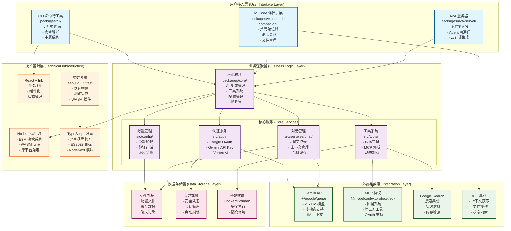
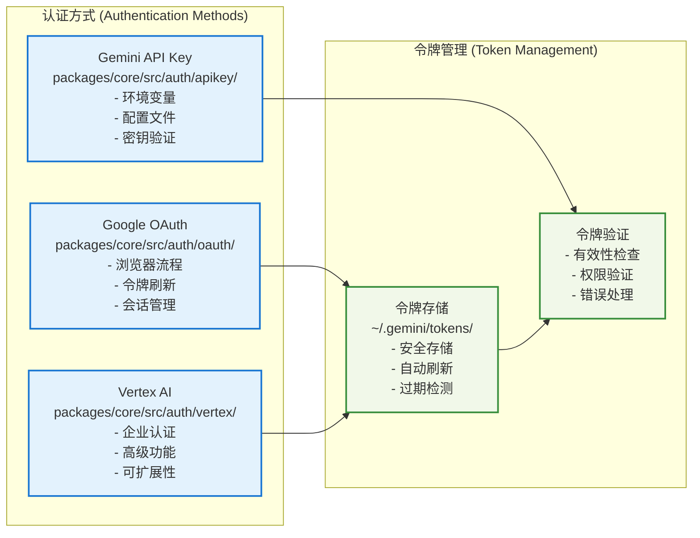
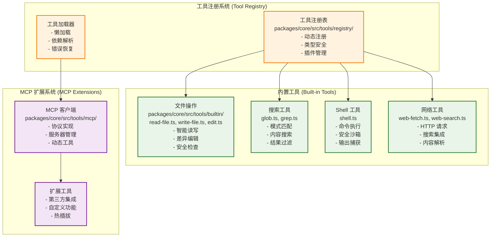
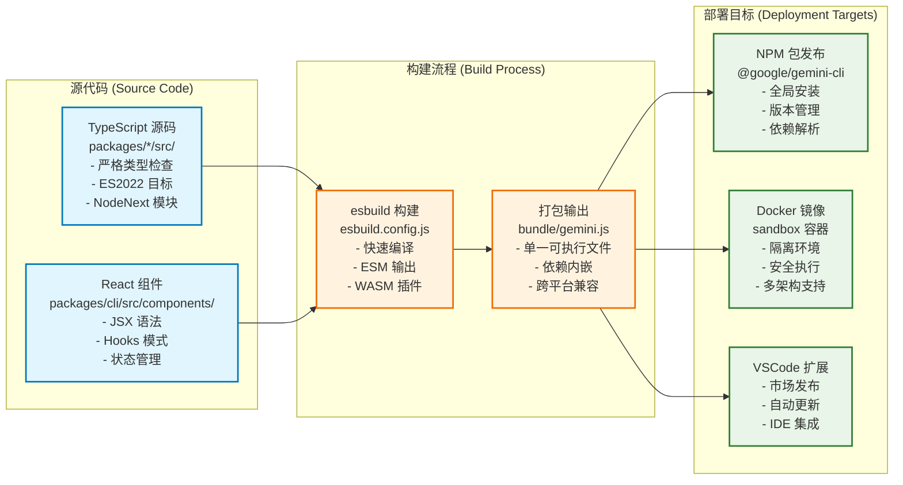
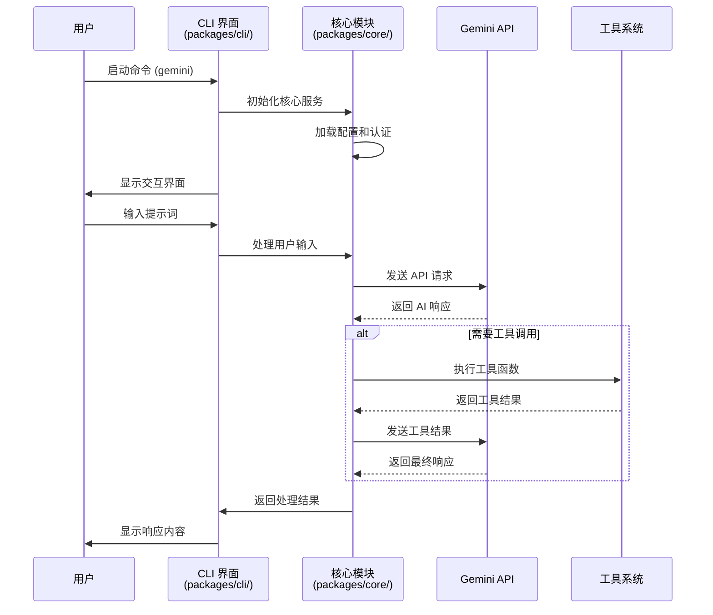
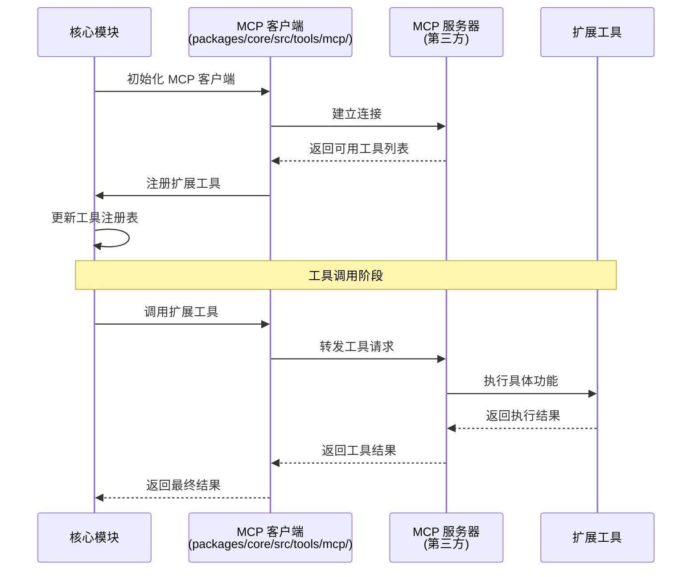

# Gemini CLI 项目完整架构分析报告

## 项目概述

Gemini CLI 是 Google 开发的一款开源 AI 代理工具，将 Gemini
AI 模型的强大功能直接带入终端环境。该项目采用现代化的 monorepo 架构，提供轻量级且直接的 AI 访问体验。

### 基本信息

- **项目名称**: @google/gemini-cli
- **版本**: 0.15.0-nightly.20251107.b8eeb553
- **许可证**: Apache 2.0
- **Node.js 要求**: >=20.0.0
- **仓库地址**: https://github.com/google-gemini/gemini-cli

## 项目整体架构图



## 模块详细架构分析

### 1. 用户接入层 (packages/cli/)

**文件路径**: `packages/cli/`

**核心组件**:

```
packages/cli/
├── index.ts              # CLI 入口点
├── src/
│   ├── cli.tsx          # 主命令行界面
│   ├── commands/        # 命令处理器
│   ├── components/      # React UI 组件
│   ├── theme/          # 主题系统
│   └── utils/          # 工具函数
└── package.json        # CLI 包配置
```

**技术特点**:

- 基于 React + Ink 的终端界面
- yargs 驱动的命令行参数解析
- 支持交互式和非交互式模式
- 可自定义主题系统
- 实时响应和流式输出

**依赖关系**:

```json
{
  "@google/gemini-cli-core": "核心功能模块",
  "ink": "终端 React 渲染器",
  "react": "UI 框架",
  "yargs": "命令行解析"
}
```

### 2. 核心业务层 (packages/core/)

**文件路径**: `packages/core/`

**核心架构**:

```
packages/core/
├── src/
│   ├── ai/              # AI 集成模块
│   │   ├── gemini/     # Gemini API 客户端
│   │   └── content/    # 内容生成器
│   ├── auth/           # 认证系统
│   │   ├── oauth/      # OAuth 流程
│   │   └── tokens/     # 令牌管理
│   ├── tools/          # 工具系统
│   │   ├── builtin/    # 内置工具
│   │   ├── mcp/        # MCP 集成
│   │   └── registry/   # 工具注册表
│   ├── config/         # 配置管理
│   │   ├── settings/   # 设置系统
│   │   └── validation/ # 配置验证
│   ├── services/       # 业务服务
│   │   ├── chat/       # 聊天服务
│   │   ├── files/      # 文件服务
│   │   ├── git/        # Git 服务
│   │   └── shell/      # Shell 服务
│   └── ide/            # IDE 集成
│       ├── detection/  # IDE 检测
│       └── companion/  # 伴侣服务
```

**服务模式设计**:

```typescript
// 核心服务接口设计
interface ServiceRegistry {
  fileDiscovery: FileDiscoveryService; // 文件发现服务
  gitService: GitService; // Git 操作服务
  chatRecording: ChatRecordingService; // 对话记录服务
  shellExecution: ShellExecutionService; // Shell 执行服务
  loopDetection: LoopDetectionService; // 循环检测服务
}
```

**工具系统架构**:

```typescript
// 工具接口定义
interface Tool {
  name: string; // 工具名称
  description: string; // 工具描述
  inputSchema: JSONSchema; // 输入模式
  execute(args: unknown): Promise<ToolResult>; // 执行函数
}

// 内置工具清单
const BUILTIN_TOOLS = [
  'read-file', // 文件读取 - src/tools/builtin/read-file.ts
  'write-file', // 文件写入 - src/tools/builtin/write-file.ts
  'edit', // 智能编辑 - src/tools/builtin/edit.ts
  'shell', // Shell 命令 - src/tools/builtin/shell.ts
  'glob', // 文件模式匹配 - src/tools/builtin/glob.ts
  'grep', // 内容搜索 - src/tools/builtin/grep.ts
  'web-fetch', // 网页获取 - src/tools/builtin/web-fetch.ts
  'web-search', // 搜索集成 - src/tools/builtin/web-search.ts
  'mcp-client', // MCP 客户端 - src/tools/builtin/mcp-client.ts
];
```

### 3. A2A 服务器模块 (packages/a2a-server/)

**文件路径**: `packages/a2a-server/`

**架构组成**:

```
packages/a2a-server/
├── src/
│   ├── http/           # HTTP 服务器
│   │   ├── server.ts   # Express 服务器
│   │   └── routes/     # API 路由
│   ├── a2a/           # A2A 协议实现
│   │   ├── protocol/   # 协议定义
│   │   └── handlers/   # 协议处理器
│   ├── storage/       # 存储管理
│   │   ├── cloud/      # 云存储集成
│   │   └── local/      # 本地存储
│   └── utils/         # 工具函数
├── dist/              # 构建输出
└── package.json       # A2A 包配置
```

**技术实现**:

- Express.js 驱动的 HTTP API 服务
- @a2a-js/sdk 协议实现
- Google Cloud Storage 集成
- tar 文件打包和传输
- 会话状态持久化

### 4. VSCode 伴侣扩展 (packages/vscode-ide-companion/)

**文件路径**: `packages/vscode-ide-companion/`

**扩展结构**:

```
packages/vscode-ide-companion/
├── src/
│   ├── extension.ts    # 扩展入口点
│   ├── commands/       # VSCode 命令
│   ├── diff/          # 差异编辑器
│   ├── mcp/           # MCP 服务器
│   └── utils/         # 工具函数
├── package.json       # VSCode 扩展配置
└── extension/         # 扩展资源
```

**VSCode 集成特性**:

```json
{
  "activationEvents": ["onStartupFinished"],
  "contributes": {
    "commands": [
      "gemini.diff.accept", // 接受差异
      "gemini.diff.cancel" // 取消差异
    ],
    "keybindings": [{ "key": "ctrl+s", "command": "gemini.diff.accept" }]
  }
}
```

### 5. 测试工具模块 (packages/test-utils/)

**文件路径**: `packages/test-utils/`

**测试基础设施**:

```
packages/test-utils/
├── src/
│   ├── mocks/         # 模拟对象
│   ├── fixtures/      # 测试夹具
│   ├── helpers/       # 测试助手
│   └── setup/         # 测试设置
└── package.json       # 测试工具配置
```

## 技术架构深度分析

### 1. 认证系统架构



### 2. 工具系统架构



### 3. 构建和部署架构



## 数据流和交互模式

### 1. 用户交互流程



### 2. MCP 扩展集成流程



## 项目特色和创新点

### 1. 多认证方式支持

- **Google OAuth**: 个人开发者友好，免费额度充足
- **Gemini API Key**: 模型选择灵活，付费升级简单
- **Vertex AI**: 企业级功能，高级安全合规

### 2. 强大的工具生态系统

- **内置工具**: 覆盖文件、搜索、网络、Shell 操作
- **MCP 协议**: 标准化的扩展机制
- **动态加载**: 热插拔式工具管理

### 3. IDE 深度集成

- **VSCode 伴侣**: 无缝的编辑器集成
- **差异编辑器**: 直观的代码变更预览
- **上下文感知**: 智能的项目理解

### 4. 现代化架构设计

- **Monorepo 管理**: 统一的代码组织和依赖管理
- **TypeScript 严格模式**: 高质量的类型安全
- **React 终端 UI**: 现代化的用户界面
- **ESM 模块系统**: 标准化的模块加载

### 5. 安全和沙箱机制

- **容器化执行**: Docker/Podman 隔离环境
- **权限控制**: 细粒度的操作权限管理
- **安全令牌**: 加密的凭证存储和管理

## 扩展性和可维护性分析

### 1. 模块化设计

- 清晰的模块边界和职责分离
- 标准化的接口定义和依赖注入
- 可插拔的组件架构

### 2. 协议标准化

- MCP 协议支持第三方扩展
- 统一的工具接口规范
- 向后兼容的版本管理

### 3. 测试和质量保障

- 完整的测试工具链
- 自动化的 CI/CD 流程
- 代码质量检查和格式化

### 4. 文档和社区支持

- 详细的开发文档
- 活跃的开源社区
- 规范的贡献指南

## 总结

Gemini CLI 项目展现了现代 AI 工具开发的最佳实践：

1. **架构设计**: 采用 monorepo 和微服务架构，模块化程度高，职责分离清晰
2. **技术选型**: 使用 TypeScript、React、esbuild 等现代技术栈，开发效率和代码质量并重
3. **扩展性**: 通过 MCP 协议和工具系统提供强大的扩展能力
4. **用户体验**: 多种认证方式、IDE 集成、沙箱安全等特性提升用户体验
5. **开源生态**: Apache 2.0 许可证，活跃的社区参与和贡献

该项目为 AI CLI 工具的设计和实现提供了优秀的参考范例，值得深入学习和借鉴。

---

_生成日期: 2024年11月14日_ _分析工具: Claude Code_ _项目版本:
0.15.0-nightly.20251107.b8eeb553_
