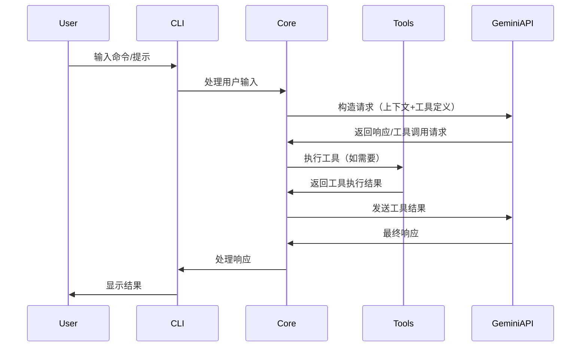

# Gemini CLI 项目全面架构分析报告

## 📋 目录

1. [项目概述](#项目概述)
2. [整体架构设计](#整体架构设计)
3. [核心模块功能实现](#核心模块功能实现)
4. [技术选型与设计决策](#技术选型与设计决策)
5. [扩展性设计](#扩展性设计)
6. [安全性架构](#安全性架构)
7. [性能优化策略](#性能优化策略)
8. [开发和部署流程](#开发和部署流程)
9. [最佳实践总结](#最佳实践总结)
10. [技术创新点](#技术创新点)

---

## 🚀 项目概述

### 基本信息

- **项目名称**: Gemini CLI
- **版本**: 0.13.0-nightly.20251031.c89bc30d
- **开发团队**: Google
- **开源协议**: Apache 2.0
- **技术栈**: TypeScript + Node.js + React (Ink)
- **目标用户**: 开发者、企业团队、AI助手用户

### 项目定位

Gemini CLI 是一个开源的AI代理工具，将Google Gemini
AI的强大能力直接引入命令行环境。它不仅是一个简单的AI助手，更是一个可扩展的AI工具平台，支持丰富的内置工具、第三方扩展和企业级部署。

### 核心价值主张

- **🎯 免费层支持**: 60次/分钟，1000次/天的免费配额
- **🧠 强大的AI能力**: 支持Gemini 2.5 Pro，100万token上下文窗口
- **🔧 内置工具生态**: Google搜索、文件操作、Shell命令、网络请求等
- **🔌 高扩展性**: MCP协议支持，自定义工具开发
- **💻 开发者友好**: 终端优先设计，丰富的键盘快捷键
- **🛡️ 企业级安全**: 多层沙箱隔离，权限控制机制

---

## 🏗️ 整体架构设计

### 核心架构模式

#### 1. 分层架构模式

```
┌─────────────────────────────────────────┐
│               CLI Package               │  ← 用户界面层
│        (React + Ink Terminal UI)       │
├─────────────────────────────────────────┤
│              Core Package               │  ← 业务逻辑层
│      (AI Client + Tool Registry)       │
├─────────────────────────────────────────┤
│             Tools Layer                 │  ← 工具执行层
│    (Built-in Tools + MCP Extensions)   │
├─────────────────────────────────────────┤
│            Services Layer               │  ← 基础服务层
│   (Auth, Config, Sandbox, Git, etc.)   │
└─────────────────────────────────────────┘
```

#### 2. Monorepo包结构

```
packages/
├── cli/                    # 🖥️  用户界面包
│   ├── src/ui/            # React组件
│   ├── src/commands/      # 命令处理
│   └── src/config/        # CLI配置
├── core/                   # 🎯 核心逻辑包
│   ├── src/core/          # Gemini客户端
│   ├── src/tools/         # 工具系统
│   ├── src/services/      # 基础服务
│   └── src/config/        # 配置系统
├── a2a-server/            # 🔗 Agent-to-Agent服务器
│   ├── src/http/          # HTTP服务器
│   └── src/agent/         # 代理执行器
├── test-utils/            # 🧪 测试工具包
└── vscode-ide-companion/  # 🔌 VSCode扩展
```

#### 3. 交互流程设计



### 设计原则

1. **模块化**: 清晰的包边界和职责分离
2. **可扩展性**: 插件化架构支持第三方扩展
3. **安全性**: 多层安全防护，沙箱执行
4. **用户体验**: 现代终端UI，丰富交互
5. **企业级**: 配置管理、认证集成、部署支持

---

## 🔧 核心模块功能实现

### 1. GeminiClient - AI客户端核心

#### 架构设计

```typescript
export class GeminiClient {
  private chat?: GeminiChat;
  private readonly loopDetector: LoopDetectionService;
  private readonly compressionService: ChatCompressionService;
  private readonly modelRouter: ModelRouterService;

  // 核心方法
  async sendMessageStream(): AsyncGenerator<ServerGeminiStreamEvent, Turn>;
  async generateContent(): Promise<GenerateContentResponse>;
  async tryCompressChat(): Promise<ChatCompressionInfo>;
}
```

#### 关键特性

- **流式处理**: 支持实时响应流，用户可以看到AI的思考过程
- **上下文管理**: 智能的上下文窗口管理和自动压缩
- **循环检测**: 防止AI陷入无限循环的智能检测机制
- **模型路由**: 基于请求复杂度的智能模型选择
- **错误恢复**: 内置重试机制和降级策略

#### 实现亮点

```typescript
// 流式响应处理
async *sendMessageStream(request: SendMessageRequest): AsyncGenerator<ServerGeminiStreamEvent, Turn> {
  for await (const chunk of response) {
    yield {
      type: 'streamingContentDelta',
      content: chunk.text(),
      timestamp: Date.now()
    };
  }
}

// 智能上下文压缩
async tryCompressChat(): Promise<ChatCompressionInfo> {
  const compressedHistory = await this.compressionService.compress(
    this.chat?.history || [],
    this.config.maxContextTokens
  );
  return compressedHistory;
}
```

### 2. 工具系统架构

#### 工具注册表设计

```typescript
export class ToolRegistry {
  private tools = new Map<string, AnyDeclarativeTool>();
  private mcpClientManager: McpClientManager;

  // 工具发现和注册
  async discoverAllTools(): Promise<void> {
    // 注册内置工具
    await this.registerBuiltinTools();
    // 发现MCP工具
    await this.discoverMCPTools();
    // 发现命令行工具
    await this.discoverCommandTools();
  }

  registerTool(tool: AnyDeclarativeTool): void {
    this.tools.set(tool.name, tool);
  }
}
```

#### 内置工具生态

| 工具类别     | 工具名称      | 功能描述                    | 安全级别    |
| ------------ | ------------- | --------------------------- | ----------- |
| **文件操作** | ReadFileTool  | 读取文件（支持图片、PDF等） | 🟢 只读     |
|              | WriteFileTool | 写入文件，原子操作          | 🟡 需确认   |
|              | EditTool      | 精确文本编辑，diff预览      | 🟡 需确认   |
| **系统交互** | ShellTool     | 跨平台命令执行              | 🔴 高风险   |
|              | LSTool        | 目录列表和文件信息          | 🟢 只读     |
| **搜索导航** | GrepTool      | 高性能代码搜索              | 🟢 只读     |
|              | RipGrepTool   | Rust实现的快速搜索          | 🟢 只读     |
|              | GlobTool      | 文件模式匹配                | 🟢 只读     |
| **网络通信** | WebFetchTool  | HTTP请求处理                | 🟡 网络访问 |
|              | WebSearchTool | Google搜索集成              | 🟡 网络访问 |

#### MCP工具集成

```typescript
// MCP客户端管理
export class McpClientManager {
  private clients = new Map<string, McpClient>();

  async connectToServer(serverConfig: MCPServerConfig): Promise<void> {
    const client = new McpClient(serverConfig);
    await client.connect();

    // 发现工具
    const tools = await client.listTools();
    tools.forEach((tool) => {
      this.toolRegistry.registerTool(new MCPProxyTool(tool, client));
    });
  }
}
```

### 3. UI系统实现

#### React + Ink架构

```typescript
// 主应用容器
export function AppContainer() {
  return (
    <SettingsContext.Provider value={settings}>
      <KeypressProvider>
        <SessionStatsProvider>
          <VimModeProvider>
            <ThemeProvider>
              <App />
            </ThemeProvider>
          </VimModeProvider>
        </SessionStatsProvider>
      </KeypressProvider>
    </SettingsContext.Provider>
  );
}
```

#### 关键UI特性

- **响应式布局**: 适配不同终端尺寸
- **主题系统**: 丰富的颜色主题和自定义选项
- **键盘快捷键**: Vim模式支持，高效操作
- **无障碍支持**: 屏幕阅读器兼容
- **实时渲染**: 流式内容的实时显示

#### 主题系统设计

```typescript
interface Theme {
  colors: {
    primary: string;
    secondary: string;
    success: string;
    warning: string;
    error: string;
    text: {
      primary: string;
      secondary: string;
      muted: string;
    };
    background: {
      primary: string;
      secondary: string;
    };
  };
  typography: {
    fontFamily: string;
    fontWeight: string;
  };
}
```

### 4. 配置系统实现

#### 多层配置架构

```typescript
// 配置优先级（由低到高）
const CONFIG_SOURCES = [
  'defaults', // 默认值
  'systemDefaults', // 系统默认
  'userSettings', // 用户设置
  'workspaceSettings', // 工作区设置
  'systemSettings', // 系统管理员设置
  'environmentVars', // 环境变量
  'commandLineArgs', // 命令行参数
];
```

#### 配置类型定义

```typescript
export interface Config {
  // AI相关配置
  ai: {
    model: string;
    temperature: number;
    maxTokens: number;
    systemPrompt?: string;
  };

  // UI配置
  ui: {
    theme: string;
    enableVimMode: boolean;
    enableScreenReader: boolean;
    keyboardShortcuts: Record<string, string>;
  };

  // 工具配置
  tools: {
    enabledTools: string[];
    toolTimeout: number;
    requireConfirmation: boolean;
  };

  // 安全配置
  security: {
    sandboxMode: 'docker' | 'podman' | 'seatbelt' | 'none';
    trustedFolders: string[];
    allowNetworkAccess: boolean;
  };

  // MCP服务器配置
  mcpServers: Record<string, MCPServerConfig>;
}
```

#### 动态配置特性

- **热重载**: 配置文件变更自动生效
- **环境变量插值**: 支持 `${VAR}` 语法
- **配置验证**: 运行时类型检查和验证
- **配置迁移**: 自动的版本升级机制

---

## 🛠️ 技术选型与设计决策

### 核心技术栈

#### 前端技术选择

| 技术            | 选择原因               | 优势                          |
| --------------- | ---------------------- | ----------------------------- |
| **TypeScript**  | 类型安全、大型项目维护 | 编译时错误检测、更好的IDE支持 |
| **React + Ink** | 声明式UI、组件化架构   | 现代开发体验、丰富的生态系统  |
| **Zod**         | 运行时类型验证         | 数据验证、类型推断            |

#### 构建工具选择

| 工具               | 选择原因               | 配置亮点             |
| ------------------ | ---------------------- | -------------------- |
| **esbuild**        | 极速构建、ESM支持      | Go实现、Tree Shaking |
| **Vitest**         | 现代测试框架、快速执行 | 原生ESM、并发测试    |
| **npm workspaces** | Monorepo管理           | 依赖共享、统一构建   |

### 架构决策分析

#### 1. Monorepo vs 多仓库

**选择Monorepo的原因:**

- ✅ 代码共享和复用
- ✅ 版本同步管理
- ✅ 统一的构建流程
- ✅ 简化跨包依赖

#### 2. 分层架构设计

**三层分离的优势:**

- **CLI层**: 专注用户体验和交互
- **Core层**: 核心业务逻辑和AI交互
- **Tools层**: 可扩展的功能模块

#### 3. 事件驱动架构

**选择事件驱动的原因:**

```typescript
// 松耦合的组件通信
appEvents.emit(AppEvent.LogError, errorMessage);
appEvents.emit(AppEvent.OpenDebugConsole);
```

- ✅ 组件解耦
- ✅ 易于扩展
- ✅ 调试友好

### 性能优化策略

#### 1. 构建性能

- **esbuild**: 比webpack快10-100倍
- **增量构建**: TypeScript项目引用
- **Bundle优化**: Tree Shaking和代码分割

#### 2. 运行时性能

- **流式处理**: 减少内存占用
- **智能缓存**: API响应和文件内容缓存
- **异步架构**: 非阻塞的I/O操作

#### 3. 内存管理

```typescript
// 动态内存配置
const targetMaxOldSpaceSizeInMB = Math.floor(totalMemoryMB * 0.5);
```

- **自动重启**: 内存不足时重启进程
- **垃圾回收**: 优化的内存限制
- **资源清理**: 完善的cleanup机制

---

## 🔌 扩展性设计

### MCP协议集成

#### 协议支持

```typescript
// MCP传输层支持
export enum MCPTransportType {
  STDIO = 'stdio',
  SSE = 'sse',
  HTTP = 'http',
}

// MCP客户端架构
export class McpClient {
  private client: Client | undefined;
  private transport: Transport | undefined;
  private status: MCPServerStatus;
}
```

#### 工具发现机制

1. **内置工具**: 自动注册系统内置工具
2. **MCP工具**: 通过MCP协议发现外部工具
3. **命令行工具**: 通过discoveryCommand发现
4. **自定义工具**: 用户自定义工具API

### 配置系统扩展

#### 多层配置覆盖

```
命令行参数 (最高优先级)
    ↓
环境变量
    ↓
系统管理员设置 (/etc/gemini-cli/settings.json)
    ↓
工作区设置 (.gemini/settings.json)
    ↓
用户设置 (~/.gemini/settings.json)
    ↓
系统默认 (/etc/gemini-cli/system-defaults.json)
    ↓
内置默认值 (最低优先级)
```

#### 企业级配置管理

- **策略配置**: 管理员可以设置强制策略
- **继承机制**: 配置层次继承和覆盖
- **模板支持**: 配置模板和预设
- **审计日志**: 配置变更审计

### 主题和UI扩展

#### 主题系统架构

```typescript
// 语义化颜色系统
export interface SemanticColors {
  primary: string;
  secondary: string;
  success: string;
  warning: string;
  error: string;
  text: {
    primary: string;
    secondary: string;
    muted: string;
  };
}

// 主题定义
export interface Theme {
  name: string;
  displayName: string;
  colors: SemanticColors;
  typography: Typography;
}
```

#### 扩展管理系统

```typescript
// 扩展安装方式
export enum ExtensionInstallType {
  LOCAL = 'local',
  GIT = 'git',
  GITHUB_RELEASE = 'github-release',
  SYMLINK = 'symlink',
}

// 扩展生命周期管理
export class ExtensionManager {
  async install(name: string, source: string): Promise<void>;
  async uninstall(name: string): Promise<void>;
  async update(name: string): Promise<void>;
  async list(): Promise<Extension[]>;
}
```

---

## 🔐 安全性架构

### 多层沙箱隔离

#### 沙箱策略选择

```typescript
// 平台特定的沙箱实现
export enum SandboxType {
  DOCKER = 'docker',
  PODMAN = 'podman',
  SEATBELT = 'seatbelt', // macOS
  NONE = 'none',
}

// 沙箱配置
export interface SandboxConfig {
  type: SandboxType;
  imageUri?: string;
  mounts?: string[];
  ports?: string[];
  envVars?: Record<string, string>;
}
```

#### macOS Seatbelt沙箱

```bash
# 权限级别配置
SEATBELT_PROFILE=permissive-open    # 开放网络，限制写入
SEATBELT_PROFILE=restrictive-closed # 严格模式，拒绝所有操作
SEATBELT_PROFILE=restrictive-proxied # 代理网络访问
```

#### 容器沙箱实现

```dockerfile
# 最小化容器镜像
FROM node:20-alpine
RUN apk add --no-cache git bash curl
USER node
WORKDIR /workspace
```

### 权限控制系统

#### 工作区信任机制

```typescript
// 三级信任模型
export enum TrustLevel {
  TRUSTED = 'trusted', // 完全信任
  PARENT_TRUSTED = 'parent', // 父目录信任
  UNTRUSTED = 'untrusted', // 明确不信任
}

// 信任状态检查
export class TrustService {
  checkTrustLevel(folderPath: string): TrustLevel;
  addTrustedFolder(folderPath: string): Promise<void>;
  removeTrustedFolder(folderPath: string): Promise<void>;
}
```

#### 策略引擎设计

```toml
# 策略配置文件示例
[admin_policy]
allowed_tools = ["read_file", "write_file"]
require_confirmation = true
max_file_size = "10MB"

[user_policy]
inherits = "admin_policy"
allowed_tools = ["read_file", "grep", "ls"]
require_confirmation = false
```

### 认证和授权

#### 多重认证支持

```typescript
// 认证提供者抽象
export interface AuthProvider {
  authenticate(): Promise<Credentials>;
  refresh(): Promise<Credentials>;
  isValid(): boolean;
}

// 支持的认证方式
export enum AuthType {
  OAUTH = 'oauth', // Google OAuth2
  API_KEY = 'apiKey', // Gemini API Key
  VERTEX_AI = 'vertexAI', // Vertex AI
  CLOUD_SHELL = 'cloudShell', // Cloud Shell
}
```

#### 企业认证集成

- **Single Sign-On**: 支持企业SSO集成
- **Service Account**: Google Cloud服务账户
- **API密钥管理**: 安全的密钥存储和轮换
- **令牌生命周期**: 自动刷新和过期处理

### 命令注入防护

#### Tree-sitter安全解析

```typescript
// 使用Tree-sitter进行安全的命令解析
export class CommandParser {
  private parser: Parser;

  parseCommand(command: string): CommandAST {
    const tree = this.parser.parse(command);
    return this.analyzeAST(tree.rootNode);
  }

  // 检测危险模式
  detectDangerousPatterns(ast: CommandAST): SecurityWarning[] {
    // 检测命令替换、管道注入等
  }
}
```

#### 安全执行流程

```
用户输入 → 语法解析 → 危险检测 → 用户确认 → 沙箱执行 → 结果过滤
```

---

## ⚡ 性能优化策略

### 构建性能优化

#### esbuild配置优化

```javascript
const baseConfig = {
  bundle: true,
  platform: 'node',
  format: 'esm',
  target: 'node20',
  loader: { '.node': 'file' },
  plugins: [wasmPlugin(), externalPlugin()],
  // Tree shaking优化
  treeShaking: true,
  minify: process.env.NODE_ENV === 'production',
};
```

#### 依赖优化策略

- **可选依赖**: 平台特定的native模块
- **动态导入**: 按需加载大型依赖
- **Bundle分析**: 监控包大小和依赖关系

### 运行时性能优化

#### 内存管理策略

```typescript
// 自适应内存配置
export function configureMemoryLimits() {
  const totalMemoryMB = os.totalmem() / (1024 * 1024);
  const targetMaxOldSpaceSizeInMB = Math.floor(totalMemoryMB * 0.5);

  if (process.env.NODE_OPTIONS?.includes('--max-old-space-size')) {
    return; // 用户已配置
  }

  process.env.NODE_OPTIONS = `--max-old-space-size=${targetMaxOldSpaceSizeInMB}`;
}
```

#### 缓存策略设计

```typescript
// 多级缓存架构
export class CacheManager {
  private memoryCache = new Map();
  private diskCache: DiskCache;

  // L1: 内存缓存 (最快)
  // L2: 磁盘缓存 (持久化)
  // L3: 网络缓存 (API响应)
}
```

#### 异步处理优化

- **流式响应**: 实时显示AI生成内容
- **并发执行**: 工具并行执行
- **背景任务**: 非关键任务后台处理

---

## 🚢 开发和部署流程

### 开发工作流

#### 本地开发环境

```bash
# 项目初始化
npm install
npm run build

# 开发模式 (支持热重载)
npm run start

# 调试模式
npm run debug

# 完整测试
npm run preflight
```

#### 代码质量保证

```json
{
  "scripts": {
    "lint": "eslint . --ext .ts,.tsx",
    "format": "prettier --write .",
    "typecheck": "npm run typecheck --workspaces",
    "test": "npm run test --workspaces",
    "test:integration": "npm run test:integration:all"
  }
}
```

### CI/CD流程

#### GitHub Actions工作流

1. **代码检查**: ESLint、Prettier、TypeScript检查
2. **自动测试**: 单元测试、集成测试、E2E测试
3. **安全扫描**: 依赖漏洞扫描、代码安全检查
4. **构建优化**: 多平台构建、Bundle分析
5. **自动发布**: 版本标记、NPM发布、Docker镜像

#### 发布策略

```
开发分支 → 预览版 (每周二) → 稳定版 (每周二) → 夜间版 (每日)
```

### 部署架构

#### 多平台支持

- **NPM包**: 主要分发渠道
- **Homebrew**: macOS/Linux包管理器
- **Docker镜像**: 容器化部署
- **二进制文件**: 独立可执行文件

#### 企业部署选项

- **私有NPM仓库**: 企业内部分发
- **配置管理**: 统一的企业配置
- **安全策略**: 企业级安全策略
- **审计日志**: 使用情况审计

---

## 💡 最佳实践总结

### 架构设计最佳实践

#### 1. 模块化设计

- ✅ **清晰的包边界**: 每个包有明确的职责
- ✅ **接口抽象**: 使用接口定义模块间通信
- ✅ **依赖注入**: 便于测试和扩展
- ✅ **事件驱动**: 松耦合的组件通信

#### 2. 安全性设计

- ✅ **多层防护**: 沙箱、权限、确认机制
- ✅ **最小权限**: 默认拒绝，明确授权
- ✅ **用户控制**: 重要操作需要用户确认
- ✅ **审计跟踪**: 完整的操作日志

#### 3. 用户体验设计

- ✅ **渐进增强**: 从基础功能到高级特性
- ✅ **智能默认**: 合理的默认配置
- ✅ **即时反馈**: 实时响应和状态显示
- ✅ **错误恢复**: 友好的错误处理

### 代码质量最佳实践

#### 1. TypeScript使用

```typescript
// 严格的类型定义
interface ToolConfig {
  readonly name: string;
  readonly description: string;
  readonly parameters: readonly Parameter[];
}

// 联合类型和类型守卫
type AuthType = 'oauth' | 'apiKey' | 'vertexAI';

function isOAuthType(type: AuthType): type is 'oauth' {
  return type === 'oauth';
}
```

#### 2. 错误处理模式

```typescript
// Result模式处理错误
type Result<T, E> = { success: true; data: T } | { success: false; error: E };

// 统一的错误类型
export class GeminiError extends Error {
  constructor(
    message: string,
    public readonly code: string,
    public readonly cause?: Error,
  ) {
    super(message);
  }
}
```

#### 3. 测试策略

- **单元测试**: 每个模块的核心逻辑
- **集成测试**: 模块间的交互
- **E2E测试**: 完整的用户场景
- **性能测试**: 关键路径的性能指标

---

## 🌟 技术创新点

### 1. 终端AI交互革新

#### React + Ink在CLI中的应用

```typescript
// 声明式终端UI
function ChatInterface() {
  return (
    <Box flexDirection="column">
      <ChatHistory messages={messages} />
      <StreamingResponse content={streamingContent} />
      <InputBar onSubmit={handleSubmit} />
    </Box>
  );
}
```

**创新价值**:

- 🚀 现代化的终端用户体验
- 🎨 声明式UI开发模式
- ⚡ 组件化的界面架构
- 🔄 实时渲染和状态管理

### 2. MCP协议生态建设

#### 标准化的AI工具扩展

```typescript
// MCP工具代理实现
export class MCPProxyTool implements DeclarativeTool {
  constructor(
    private mcpTool: MCPTool,
    private client: McpClient,
  ) {}

  async execute(args: any): Promise<ToolResult> {
    return await this.client.callTool(this.mcpTool.name, args);
  }
}
```

**创新价值**:

- 🔌 标准化的扩展协议
- 🌐 跨语言的工具生态
- 🔄 动态工具发现和加载
- 🤝 社区驱动的工具开发

### 3. 智能沙箱执行

#### 多平台自适应沙箱

```typescript
// 智能沙箱选择
export class SandboxManager {
  async detectBestSandbox(): Promise<SandboxType> {
    if (await this.isDockerAvailable()) return 'docker';
    if (await this.isPodmanAvailable()) return 'podman';
    if (process.platform === 'darwin') return 'seatbelt';
    return 'none';
  }
}
```

**创新价值**:

- 🛡️ 自适应的安全策略
- 🔒 跨平台的隔离机制
- ⚖️ 安全性与易用性的平衡
- 🎯 细粒度的权限控制

### 4. 企业级配置管理

#### 多层配置架构

```typescript
// 配置继承和覆盖
export class ConfigManager {
  private mergeSources(sources: ConfigSource[]): Config {
    return sources.reduce((merged, source) => {
      return deepMerge(merged, source.config, {
        arrayMerge: this.getArrayMergeStrategy(source.type),
      });
    }, {} as Config);
  }
}
```

**创新价值**:

- 📊 企业级配置管理
- 🏢 多租户配置隔离
- 🔄 动态配置热重载
- 📋 配置模板和继承

### 5. 流式AI交互

#### 实时响应处理

```typescript
// 流式内容渲染
export function StreamingContent({ stream }: { stream: AsyncIterable<string> }) {
  const [content, setContent] = useState('');

  useEffect(() => {
    (async () => {
      for await (const chunk of stream) {
        setContent(prev => prev + chunk);
      }
    })();
  }, [stream]);

  return <Text>{content}</Text>;
}
```

**创新价值**:

- ⚡ 零延迟的用户反馈
- 🔄 实时的思考过程展示
- 💡 增强的用户参与感
- 📊 优化的内存使用

---

## 📊 项目评估总结

### 技术成熟度评估

| 维度           | 评分       | 说明                             |
| -------------- | ---------- | -------------------------------- |
| **架构设计**   | ⭐⭐⭐⭐⭐ | 清晰的分层架构，模块化设计       |
| **代码质量**   | ⭐⭐⭐⭐⭐ | 严格的TypeScript，完善测试       |
| **安全性**     | ⭐⭐⭐⭐⭐ | 多层安全防护，企业级标准         |
| **扩展性**     | ⭐⭐⭐⭐⭐ | MCP协议，插件化架构              |
| **性能**       | ⭐⭐⭐⭐   | 优秀的构建性能，良好的运行时优化 |
| **用户体验**   | ⭐⭐⭐⭐⭐ | 现代终端UI，丰富的交互           |
| **文档完善度** | ⭐⭐⭐⭐   | 详细的API文档和用户指南          |

### 核心竞争优势

1. **🎯 Google官方支持**: 与Gemini AI深度集成
2. **🏗️ 企业级架构**: 可扩展、安全、可维护
3. **🔌 开放生态**: MCP协议支持第三方扩展
4. **🛡️ 安全优先**: 多层安全防护机制
5. **💻 开发者友好**: 现代化的开发体验
6. **🌐 跨平台支持**: Windows、macOS、Linux全覆盖

### 学习价值

这个项目是现代TypeScript CLI工具开发的优秀范例：

- **架构设计**: 分层架构、模块化、事件驱动
- **技术选型**: 现代化工具链的最佳实践
- **安全设计**: 企业级安全架构
- **用户体验**: 终端UI的创新应用
- **扩展性**: 插件化系统的设计模式
- **工程化**: 完善的开发、测试、部署流程

对于希望学习现代软件架构、CLI工具开发、AI应用集成的开发者来说，这个项目提供了宝贵的学习资源和实践案例。

---

_本报告基于对Gemini
CLI项目源码的深度分析，涵盖了项目的架构设计、技术实现、扩展机制和安全策略等各个方面。这个项目展现了Google在AI工具领域的技术实力和设计理念。_
