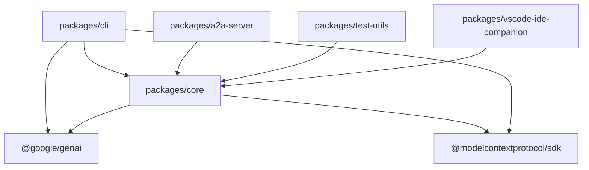

# Gemini CLI 项目架构深度分析报告

## 目录

1. [项目概述](#项目概述)
2. [项目结构](#项目结构)
3. [核心包架构](#核心包架构)
4. [技术栈分析](#技术栈分析)
5. [依赖关系](#依赖关系)
6. [核心模块深度分析](#核心模块深度分析)
7. [工具系统架构](#工具系统架构)
8. [安全架构](#安全架构)
9. [性能优化策略](#性能优化策略)
10. [扩展性设计](#扩展性设计)
11. [开发工作流](#开发工作流)
12. [部署架构](#部署架构)

---

## 项目概述

**项目名称**: @google/gemini-cli **版本**: 0.13.0-nightly.20251031.c89bc30d
**开发者**: Google **许可证**: Apache 2.0 **Node版本要求**: >=20.0.0

Gemini CLI 是一个现代化的AI辅助命令行工具，基于Google Gemini
AI模型构建。该项目采用现代TypeScript技术栈，使用React +
Ink构建终端用户界面，支持多种认证方式和丰富的工具生态系统。

### 核心特性

- **智能对话**: 基于Google Gemini AI的自然语言交互
- **丰富工具集**: 内置文件操作、代码分析、网络请求等多种工具
- **安全沙箱**: Docker容器隔离执行环境
- **扩展性**: 支持MCP(Model Context Protocol)第三方扩展
- **跨平台**: 支持Windows、macOS、Linux
- **IDE集成**: 提供VSCode扩展

---

## 项目结构

### 顶层目录结构

```
gemini-cli/
├── packages/                 # 核心包目录 (Monorepo架构)
│   ├── cli/                 # 用户界面包 - 终端交互和命令处理
│   ├── core/                # 核心逻辑包 - AI客户端和工具系统
│   ├── a2a-server/          # Agent-to-Agent服务器
│   ├── test-utils/          # 共享测试工具包
│   └── vscode-ide-companion/ # VSCode扩展
├── integration-tests/        # 端到端集成测试
├── docs/                    # 项目文档
├── scripts/                 # 构建和部署脚本
├── .gemini/                 # Gemini CLI配置文件
├── hello/                   # 示例项目和演示代码
└── third_party/             # 第三方依赖和补丁
```

### Monorepo 架构优势

- **代码共享**: 通过npm workspaces实现包间代码复用
- **统一构建**: 集中化的构建和测试流程
- **版本同步**: 所有包保持版本一致性
- **开发效率**: 简化跨包开发和调试

---

## 核心包架构

### 1. CLI包 (`packages/cli`) - 用户界面层

**主要职责**:

- 终端用户界面渲染
- 用户输入处理和命令路由
- 认证流程管理
- 配置文件解析

**技术选型**:

- **React + Ink**: 声明式终端UI框架
- **Zod**: 运行时类型验证
- **Yargs**: 命令行参数解析

**核心组件**:

```typescript
// 主入口点
packages/cli/index.ts

// React应用主组件
packages/cli/src/gemini.tsx

// 应用容器和布局
packages/cli/src/ui/AppContainer.tsx

// 配置管理
packages/cli/src/config/
```

### 2. Core包 (`packages/core`) - 业务逻辑层

**主要职责**:

- Gemini AI客户端实现
- 工具系统核心逻辑
- 文件系统操作
- 网络通信管理

**核心模块**:

```typescript
// 核心API导出
packages / core / src / index.ts;

// Gemini客户端实现
packages / core / src / core / client.ts;

// 配置系统
packages / core / src / config / config.ts;

// 工具注册表
packages / core / src / tools / tool - registry.ts;
```

### 3. A2A Server包 (`packages/a2a-server`) - 服务通信层

**主要职责**:

- Agent间通信协议实现
- HTTP API服务器
- 云存储集成

**技术特点**:

- **Express.js**: 轻量级HTTP服务器
- **Google Cloud Storage**: 文件存储服务
- **Winston**: 结构化日志系统

---

## 技术栈分析

### 前端技术栈

| 技术           | 版本         | 用途         | 备注           |
| -------------- | ------------ | ------------ | -------------- |
| **React**      | 19.2.0       | UI组件框架   | 声明式组件开发 |
| **Ink**        | 6.4.0 (fork) | 终端渲染引擎 | 自定义fork版本 |
| **TypeScript** | 5.3.3        | 类型安全语言 | 严格模式配置   |
| **Zod**        | 3.23.8       | 运行时验证   | API数据验证    |

### 后端技术栈

| 技术              | 版本     | 用途             | 备注           |
| ----------------- | -------- | ---------------- | -------------- |
| **Node.js**       | >=20.0.0 | JavaScript运行时 | 现代ES模块支持 |
| **@google/genai** | 1.16.0   | Gemini API客户端 | 官方SDK        |
| **Express.js**    | 5.1.0    | Web框架          | A2A服务器      |
| **WebSocket**     | 8.18.0   | 实时通信         | 双向数据流     |

### 构建工具链

| 工具         | 版本   | 用途         | 配置文件          |
| ------------ | ------ | ------------ | ----------------- |
| **esbuild**  | 0.25.0 | 快速构建器   | esbuild.config.js |
| **Vitest**   | 3.2.4  | 现代测试框架 | vitest.config.ts  |
| **ESLint**   | 9.24.0 | 代码质量检查 | eslint.config.js  |
| **Prettier** | 3.5.3  | 代码格式化   | .prettierrc       |

### 开发工具

| 工具            | 版本   | 用途             |
| --------------- | ------ | ---------------- |
| **Husky**       | 9.1.7  | Git hooks管理    |
| **lint-staged** | 16.1.6 | 暂存文件检查     |
| **TSX**         | 4.20.3 | TypeScript执行器 |

---

## 依赖关系

### 包间依赖图



### 外部依赖分析

#### AI和认证相关

- `@google/genai`: Google Gemini AI官方SDK
- `google-auth-library`: Google认证库
- `@google-cloud/logging`: 云日志服务

#### 终端UI相关

- `ink`: 终端React渲染器 (自定义fork)
- `react`: 组件框架
- `ink-spinner`: 加载动画组件
- `ink-gradient`: 渐变效果组件

#### 文件和系统操作

- `glob`: 文件模式匹配
- `fdir`: 高性能目录遍历
- `shell-quote`: Shell命令转义
- `node-pty`: 伪终端操作 (可选依赖)

#### 网络和通信

- `undici`: 现代HTTP客户端
- `ws`: WebSocket实现
- `https-proxy-agent`: HTTPS代理支持

---

## 核心模块深度分析

### 1. GeminiClient (`packages/core/src/core/client.ts`)

**架构设计**:

```typescript
export class GeminiClient {
  private chat?: GeminiChat;
  private readonly loopDetector: LoopDetectionService;
  private readonly compressionService: ChatCompressionService;
  private readonly modelRouter: ModelRouterService;

  // 核心方法
  async sendMessageStream(): AsyncGenerator<ServerGeminiStreamEvent, Turn>;
  async generateContent(): Promise<GenerateContentResponse>;
  async tryCompressChat(): Promise<ChatCompressionInfo>;
}
```

**关键特性**:

- **流式处理**: 使用AsyncGenerator实现实时响应流
- **智能压缩**: 自动压缩长对话历史，保持上下文相关性
- **循环检测**: 防止AI陷入无限循环
- **模型路由**: 自动选择最适合的模型
- **错误恢复**: 内置重试和降级机制

### 2. 工具系统架构 (`packages/core/src/tools/`)

**工具注册表设计**:

```typescript
export class ToolRegistry {
  private tools: Map<string, AnyDeclarativeTool> = new Map();
  private mcpClientManager: McpClientManager;

  async discoverAllTools(): Promise<void>;
  registerTool(tool: AnyDeclarativeTool): void;
  getFunctionDeclarations(): FunctionDeclaration[];
}
```

**内置工具分类**:

#### 文件操作工具

- **ReadFileTool**: 多格式文件读取 (文本、图像、PDF、Office文档)
- **WriteFileTool**: 安全文件写入，支持原子操作
- **EditTool**: 精确文本编辑，基于diff的修改预览

#### 系统交互工具

- **ShellTool**: 跨平台命令执行 (bash/PowerShell)
- **GrepTool/RipGrepTool**: 高性能代码搜索
- **GlobTool**: 文件模式匹配和发现

#### 网络工具

- **WebFetchTool**: HTTP请求处理
- **WebSearchTool**: 集成Google搜索API

**工具执行流程**:

1. **权限检查**: 验证工具执行权限
2. **参数验证**: Zod schema验证输入参数
3. **安全确认**: 用户确认机制
4. **沙箱执行**: Docker容器隔离执行
5. **结果处理**: 输出格式化和错误处理

### 3. 配置系统 (`packages/core/src/config/config.ts`)

**分层配置架构**:

```
用户全局配置 (~/.gemini/settings.json)
    ↓ 覆盖
项目配置 (.gemini/config.yaml)
    ↓ 覆盖
命令行参数 (--flags)
```

**配置管理特性**:

- **热重载**: 配置文件变更自动生效
- **验证**: 配置项类型和有效性验证
- **迁移**: 配置版本升级和向后兼容
- **环境变量**: 支持环境变量覆盖

### 4. 服务层架构 (`packages/core/src/services/`)

#### 文件发现服务 (FileDiscoveryService)

```typescript
export class FileDiscoveryService {
  private gitIgnoreFilter: GitIgnoreFilter | null = null;
  private geminiIgnoreFilter: GeminiIgnoreFilter | null = null;

  filterFiles(filePaths: string[], options: FilterFilesOptions): string[];
  shouldIgnoreFile(filePath: string, options: FilterFilesOptions): boolean;
}
```

**功能特点**:

- **智能过滤**: 基于.gitignore和.geminiignore的文件过滤
- **性能优化**: 增量扫描和缓存机制
- **类型识别**: 自动识别文件类型和编程语言

#### 其他关键服务

- **ChatCompressionService**: 对话历史智能压缩
- **LoopDetectionService**: 循环行为检测和预防
- **ModelRouterService**: 模型选择和负载均衡
- **ShellExecutionService**: 安全的命令执行服务

---

## 工具系统架构

### 工具发现机制

```typescript
// 内置工具自动注册
const builtinTools = [
  new ReadFileTool(),
  new WriteFileTool(),
  new EditTool(),
  new ShellTool(),
  // ...
];

// MCP工具动态发现
await mcpClientManager.discoverTools();
```

### 权限控制体系

1. **文件夹信任**: 基于`.gemini/trusted-folders.json`的白名单机制
2. **工具白名单**: 可配置的工具使用权限
3. **确认流程**: 危险操作的用户确认机制
4. **沙箱隔离**: Docker容器运行环境隔离

### MCP (Model Context Protocol) 集成

- **标准协议**: 支持MCP标准的第三方工具
- **动态发现**: 运行时发现和注册MCP服务器
- **类型安全**: TypeScript类型定义和验证
- **错误处理**: 优雅的MCP服务器连接失败处理

---

## 安全架构

### 多层安全防护

1. **输入验证**: Zod schema验证所有输入参数
2. **命令过滤**: Shell命令白名单和黑名单
3. **文件访问控制**: 基于信任文件夹的访问权限
4. **沙箱执行**: Docker容器隔离危险操作
5. **网络限制**: 可配置的网络访问策略

### 认证系统

- **OAuth2**: Google账户登录流程
- **API Key**: Gemini API密钥认证
- **Vertex AI**: Google Cloud服务账户认证
- **Token管理**: 安全的令牌存储和刷新

### 安全配置

```typescript
interface SecurityConfig {
  trustedFolders: string[];
  allowedCommands: string[];
  sandboxEnabled: boolean;
  networkPolicy: NetworkPolicyConfig;
  toolWhitelist: string[];
}
```

---

## 性能优化策略

### 构建优化

- **esbuild**: 极速构建和打包
- **Tree Shaking**: 自动移除未使用代码
- **代码分割**: 按需加载大型依赖
- **Bundle分析**: 打包大小监控和优化

### 运行时优化

- **缓存机制**: API响应和文件内容缓存
- **增量更新**: IDE上下文的增量同步
- **内存管理**: 自动内存配置和垃圾回收
- **连接池**: HTTP和WebSocket连接复用

### 用户体验优化

- **渐进式渲染**: 流式响应的实时显示
- **预加载**: 常用工具和配置预加载
- **响应式布局**: 适配不同终端尺寸
- **无障碍支持**: 屏幕阅读器兼容

---

## 扩展性设计

### 插件架构

```typescript
interface Extension {
  name: string;
  version: string;
  tools?: Tool[];
  commands?: Command[];
  themes?: Theme[];
}
```

### 扩展类型

1. **工具扩展**: 新增功能工具
2. **命令扩展**: 自定义命令处理
3. **主题扩展**: UI外观定制
4. **认证扩展**: 新的认证方式

### MCP生态系统

- **标准化接口**: 遵循MCP协议标准
- **语言无关**: 支持任何语言实现的MCP服务器
- **社区贡献**: 开放的扩展生态系统

---

## 开发工作流

### 本地开发环境

```bash
# 项目初始化
npm install
npm run build

# 开发模式启动
npm run start

# 测试执行
npm run test
npm run test:integration:all

# 代码质量检查
npm run lint
npm run typecheck
```

### CI/CD流程

1. **代码提交**: Git hooks自动格式化和检查
2. **自动构建**: GitHub Actions触发构建
3. **测试执行**: 单元测试和集成测试
4. **质量门禁**: 覆盖率和代码质量检查
5. **自动发布**: 多通道版本发布 (stable/preview/nightly)

### 版本管理策略

- **语义化版本**: 遵循SemVer规范
- **发布通道**: stable (稳定版)、preview (预览版)、nightly (每夜构建)
- **变更日志**: 自动生成CHANGELOG.md

---

## 部署架构

### 分发策略

1. **NPM包**: 主要分发渠道
2. **Docker镜像**: 沙箱环境镜像
3. **二进制文件**: 跨平台可执行文件
4. **VSCode扩展**: Marketplace分发

### 沙箱镜像

```dockerfile
# 基于官方Node.js镜像
FROM node:20-alpine

# 安装系统依赖
RUN apk add --no-cache git bash curl

# 配置安全环境
USER node
WORKDIR /workspace
```

### 监控和遥测

- **OpenTelemetry**: 分布式跟踪和监控
- **Google Cloud Monitoring**: 性能指标收集
- **错误报告**: 自动错误收集和分析
- **使用分析**: 匿名使用数据统计

---

## 项目特点总结

### 技术创新点

1. **终端React应用**: 在命令行中实现现代化UI
2. **AI工具集成**: 无缝集成多种AI辅助工具
3. **沙箱安全**: Docker容器化的安全执行环境
4. **MCP协议**: 标准化的扩展协议支持

### 架构优势

1. **模块化设计**: 清晰的包边界和职责分离
2. **类型安全**: 全链路TypeScript类型保护
3. **可扩展性**: 灵活的插件和扩展机制
4. **安全性**: 多层次的安全防护体系

### 开发体验

1. **现代工具链**: 使用最新的构建和开发工具
2. **完善测试**: 单元测试、集成测试、E2E测试覆盖
3. **自动化**: CI/CD自动化构建和发布
4. **文档齐全**: 详细的代码文档和API文档

### 性能表现

1. **快速启动**: esbuild优化的构建速度
2. **内存效率**: 智能的内存管理和缓存策略
3. **响应迅速**: 流式处理的实时交互体验
4. **资源优化**: 精简的依赖树和包大小

---

## 结论

Gemini CLI项目展现了现代TypeScript
CLI工具的最佳实践，其架构设计兼顾了功能性、安全性、性能和可维护性。通过模块化的包结构、完善的工具系统、强大的扩展机制和严格的安全策略，该项目为AI辅助开发工具树立了新的标杆。

项目的技术选型和架构决策都经过深思熟虑，既保证了当前功能的稳定实现，又为未来的扩展和演进提供了良好的基础。其开源的特性和标准化的扩展协议，有望构建起一个繁荣的AI工具生态系统。

---

_本分析报告基于项目源码深度分析生成，涵盖了项目的主要架构组件、技术选型、设计模式和最佳实践。_
