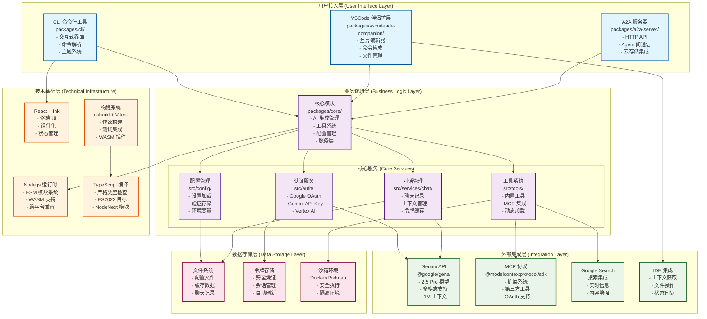
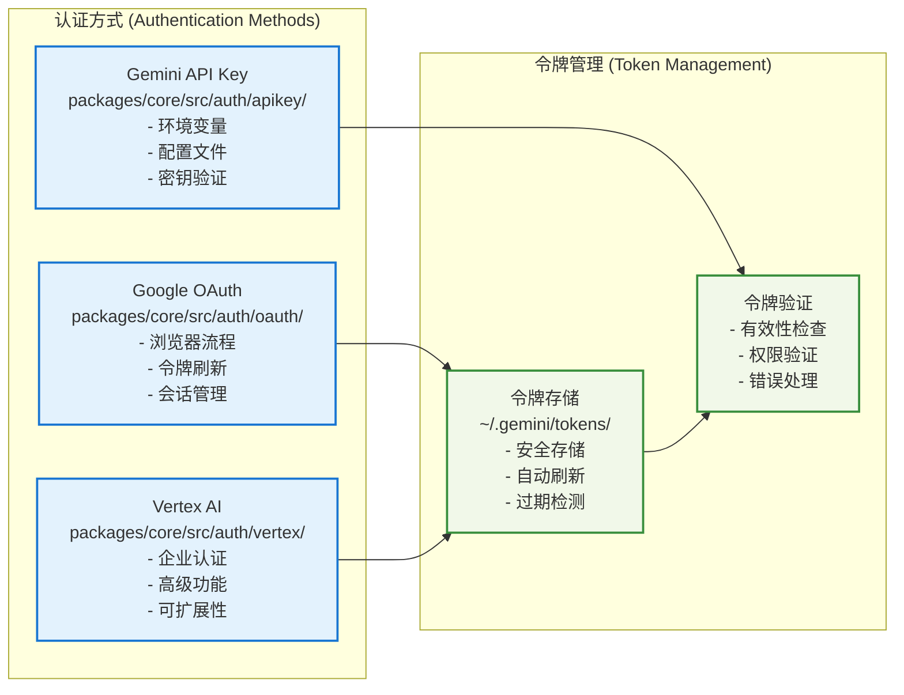
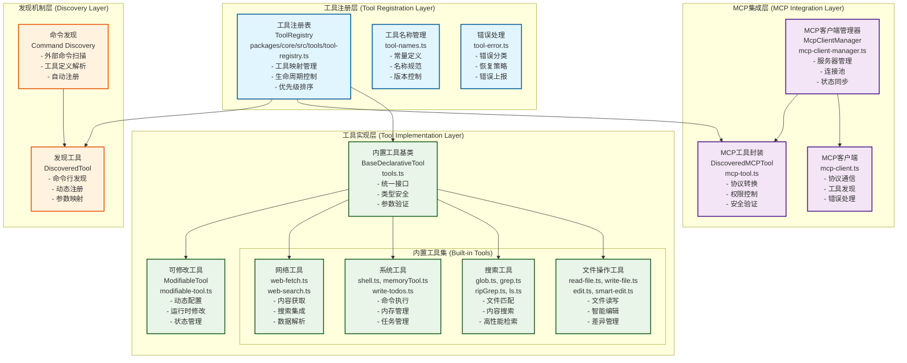
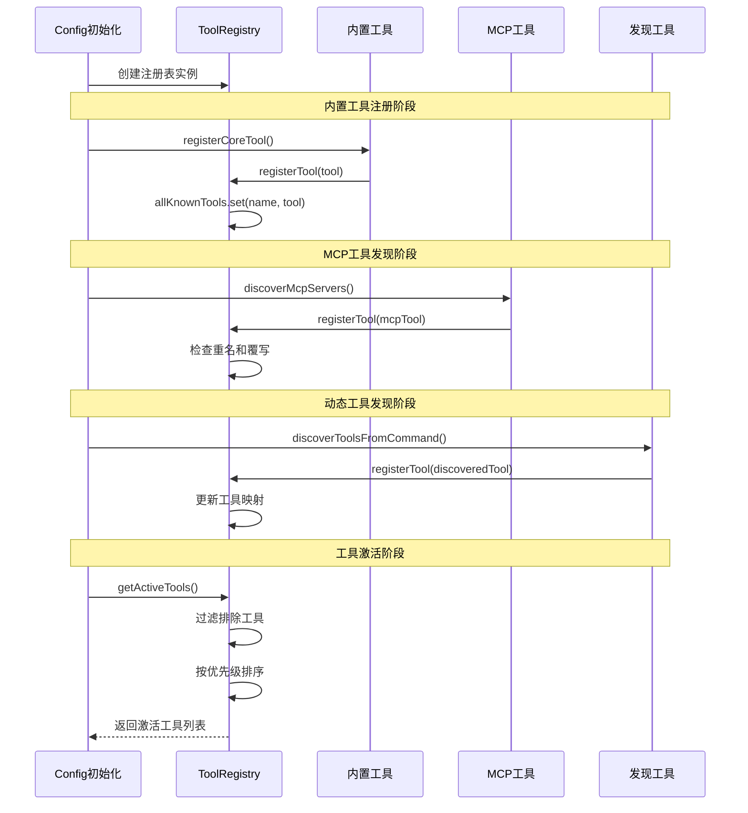
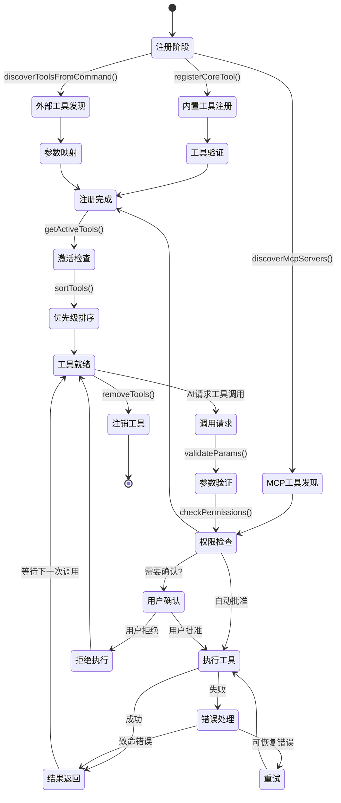
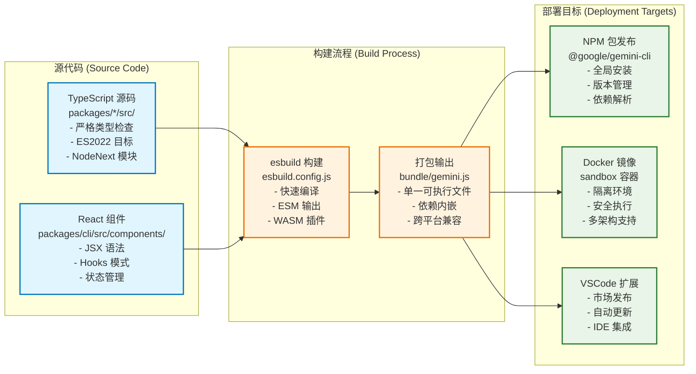

# 概述

分析这个框架我们一直带着这么一个问题： 为什么那么多的框架表现出来的效果差距这么大？即便同一个模型效果也是不一样？

一直带着这个问题分析各个框架，包括 openmanus，unas, oxygent, deepcode, kode,
geminni，包括自己写的一个java版的这类的agent框架，以及公司内部的joycode，这个效果很堪忧，经常编写的代码不能编译通过， 这些框架，使用的更多，总结下来：从大体上一看思路都差不多，但是表现出来的效果确天差地别。

why？

1. 模型不一致？ 这个我们可以自己替换看效果，有大部分效果变化不是很大， 除非模型的能力差距很大的除外
2. 提示词（尤其系统提示词）？ 这个我分析的比较少，但是这个影响非常厉害，在自己开发agent框架里面体现的非常明显。
3. 上下文？
4. memory？
5. 工具选择？还是内置工具效果不一样

。。。。。。。需要找到真正的原因，也许是多重原因重叠起来导致的，找到调试的最佳姿势带着这么目的去深入分析一下这类的开源代码， 不断是去尝试改造这些变量

# 项目架构分析

## 项目整体架构图



## 模块详细架构分析

### 1. 用户接入层 (packages/cli/)

**文件路径**: `packages/cli/`

**核心组件**:

```
packages/cli/
├── index.ts              # CLI 入口点
├── src/
│   ├── cli.tsx          # 主命令行界面
│   ├── commands/        # 命令处理器
│   ├── components/      # React UI 组件
│   ├── theme/          # 主题系统
│   └── utils/          # 工具函数
└── package.json        # CLI 包配置
```

**技术特点**:

- 基于 React + Ink 的终端界面
- yargs 驱动的命令行参数解析
- 支持交互式和非交互式模式
- 可自定义主题系统
- 实时响应和流式输出

**依赖关系**:

```json
{
  "@google/gemini-cli-core": "核心功能模块",
  "ink": "终端 React 渲染器",
  "react": "UI 框架",
  "yargs": "命令行解析"
}
```

### 2. 核心业务层 (packages/core/)

**文件路径**: `packages/core/`

**核心架构**:

```
packages/core/
├── src/
│   ├── ai/              # AI 集成模块
│   │   ├── gemini/     # Gemini API 客户端
│   │   └── content/    # 内容生成器
│   ├── auth/           # 认证系统
│   │   ├── oauth/      # OAuth 流程
│   │   └── tokens/     # 令牌管理
│   ├── tools/          # 工具系统
│   │   ├── builtin/    # 内置工具
│   │   ├── mcp/        # MCP 集成
│   │   └── registry/   # 工具注册表
│   ├── config/         # 配置管理
│   │   ├── settings/   # 设置系统
│   │   └── validation/ # 配置验证
│   ├── services/       # 业务服务
│   │   ├── chat/       # 聊天服务
│   │   ├── files/      # 文件服务
│   │   ├── git/        # Git 服务
│   │   └── shell/      # Shell 服务
│   └── ide/            # IDE 集成
│       ├── detection/  # IDE 检测
│       └── companion/  # 伴侣服务
```

**服务模式设计**:

```typescript
// 核心服务接口设计
interface ServiceRegistry {
  fileDiscovery: FileDiscoveryService; // 文件发现服务
  gitService: GitService; // Git 操作服务
  chatRecording: ChatRecordingService; // 对话记录服务
  shellExecution: ShellExecutionService; // Shell 执行服务
  loopDetection: LoopDetectionService; // 循环检测服务
}
```

**工具系统架构**:

```typescript
// 工具接口定义
interface Tool {
  name: string; // 工具名称
  description: string; // 工具描述
  inputSchema: JSONSchema; // 输入模式
  execute(args: unknown): Promise<ToolResult>; // 执行函数
}

// 内置工具清单
const BUILTIN_TOOLS = [
  'read-file', // 文件读取 - src/tools/builtin/read-file.ts
  'write-file', // 文件写入 - src/tools/builtin/write-file.ts
  'edit', // 智能编辑 - src/tools/builtin/edit.ts
  'shell', // Shell 命令 - src/tools/builtin/shell.ts
  'glob', // 文件模式匹配 - src/tools/builtin/glob.ts
  'grep', // 内容搜索 - src/tools/builtin/grep.ts
  'web-fetch', // 网页获取 - src/tools/builtin/web-fetch.ts
  'web-search', // 搜索集成 - src/tools/builtin/web-search.ts
  'mcp-client', // MCP 客户端 - src/tools/builtin/mcp-client.ts
];
```

### 3. A2A 服务器模块 (packages/a2a-server/)

**文件路径**: `packages/a2a-server/`

**架构组成**:

```
packages/a2a-server/
├── src/
│   ├── http/           # HTTP 服务器
│   │   ├── server.ts   # Express 服务器
│   │   └── routes/     # API 路由
│   ├── a2a/           # A2A 协议实现
│   │   ├── protocol/   # 协议定义
│   │   └── handlers/   # 协议处理器
│   ├── storage/       # 存储管理
│   │   ├── cloud/      # 云存储集成
│   │   └── local/      # 本地存储
│   └── utils/         # 工具函数
├── dist/              # 构建输出
└── package.json       # A2A 包配置
```

**技术实现**:

- Express.js 驱动的 HTTP API 服务
- @a2a-js/sdk 协议实现
- Google Cloud Storage 集成
- tar 文件打包和传输
- 会话状态持久化

### 4. VSCode 伴侣扩展 (packages/vscode-ide-companion/)

**文件路径**: `packages/vscode-ide-companion/`

**扩展结构**:

```
packages/vscode-ide-companion/
├── src/
│   ├── extension.ts    # 扩展入口点
│   ├── commands/       # VSCode 命令
│   ├── diff/          # 差异编辑器
│   ├── mcp/           # MCP 服务器
│   └── utils/         # 工具函数
├── package.json       # VSCode 扩展配置
└── extension/         # 扩展资源
```

**VSCode 集成特性**:

```json
{
  "activationEvents": ["onStartupFinished"],
  "contributes": {
    "commands": [
      "gemini.diff.accept", // 接受差异
      "gemini.diff.cancel" // 取消差异
    ],
    "keybindings": [{ "key": "ctrl+s", "command": "gemini.diff.accept" }]
  }
}
```

### 5. 测试工具模块 (packages/test-utils/)

**文件路径**: `packages/test-utils/`

**测试基础设施**:

```
packages/test-utils/
├── src/
│   ├── mocks/         # 模拟对象
│   ├── fixtures/      # 测试夹具
│   ├── helpers/       # 测试助手
│   └── setup/         # 测试设置
└── package.json       # 测试工具配置
```

## 技术架构深度分析

### 1. 认证系统架构



### 2. 工具系统架构



#### 工具注册核心机制分析

##### 1. 工具注册表 (ToolRegistry)

###### 核心数据结构

```typescript
// packages/core/src/tools/tool-registry.ts
export class ToolRegistry {
  // 核心存储：所有已知工具的映射表
  private allKnownTools: Map<string, AnyDeclarativeTool> = new Map();
  private config: Config;
  private messageBus?: MessageBus;

  constructor(config: Config, messageBus?: MessageBus) {
    this.config = config;
    this.messageBus = messageBus;
  }
}
// 注册工具
registerTool(tool: AnyDeclarativeTool): void {
    if (this.allKnownTools.has(tool.name)) {
      if (tool instanceof DiscoveredMCPTool) {
        tool = tool.asFullyQualifiedTool();
      } else {
        // Decide on behavior: throw error, log warning, or allow overwrite
        debugLogger.warn(
          `Tool with name "${tool.name}" is already registered. Overwriting.`,
        );
      }
    }
    this.allKnownTools.set(tool.name, tool);
  }
```

###### 工具注册流程



###### 工具优先级排序机制

内置工具>DiscoveredTool>DiscoveredMCPTool(根据serverName字符串排序)

```typescript
// 工具排序优先级：内置 > 发现的 > MCP
private sortTools(tools: AnyDeclarativeTool[]): AnyDeclarativeTool[] {
  return tools.sort((a, b) => {
    // 1. 内置工具优先级最高
    const aIsBuiltIn = this.isBuiltInTool(a);
    const bIsBuiltIn = this.isBuiltInTool(b);
    if (aIsBuiltIn && !bIsBuiltIn) return -1;
    if (!aIsBuiltIn && bIsBuiltIn) return 1;

    // 2. 发现工具优先于MCP工具
    const aIsDiscovered = a instanceof DiscoveredTool;
    const bIsDiscovered = b instanceof DiscoveredTool;
    if (aIsDiscovered && !bIsDiscovered) return -1;
    if (!aIsDiscovered && bIsDiscovered) return 1;

    // 3. 同类型工具按名称排序
    return a.name.localeCompare(b.name);
  });
}
```

##### 2. 内置工具注册详解

###### 工具注册辅助函数

```typescript
// packages/core/src/config.ts 中的工具注册逻辑
const registerCoreTool = (ToolClass: any, ...args: unknown[]) => {
  const className = ToolClass.name;
  const toolName = ToolClass.Name || className;
  const coreTools = this.getCoreTools(); // 获取启用的工具配置

  // 工具启用检查逻辑
  let isEnabled = true;
  if (coreTools) {
    // 支持多种匹配模式：
    // 1. 精确名称匹配: "ReadFileTool"
    // 2. 简化名称匹配: "read-file"
    // 3. 参数化匹配: "ReadFileTool(param=value)"
    const normalizedClassName = camelCaseToKebabCase(
      className.replace(/Tool$/, ''),
    );
    isEnabled = coreTools.some(
      (tool) =>
        tool === toolName ||
        tool === normalizedClassName ||
        tool.startsWith(`${toolName}(`) ||
        tool.startsWith(`${normalizedClassName}(`),
    );
  }

  if (isEnabled) {
    // 构建工具实例参数
    const messageBus = this.getEnableMessageBusIntegration()
      ? this.messageBus
      : undefined;
    const toolArgs = [...args, messageBus].filter((arg) => arg !== undefined);

    // 注册工具实例
    registry.registerTool(new ToolClass(...toolArgs));
    debugLogger.log(`已注册工具: ${toolName}`);
  }
};
```

###### 内置工具实现模式

每个内置工具遵循统一的实现模式：

```typescript
// 以ReadFileTool为例
export class ReadFileTool extends BaseDeclarativeTool<
  ReadFileToolParams,
  ToolResult
> {
  static readonly Name = READ_FILE_TOOL_NAME; // 'read-file'

  constructor(
    private config: Config,
    messageBus?: MessageBus,
  ) {
    super(
      ReadFileTool.Name, // 工具名称
      'ReadFile', // 显示名称
      'Read the complete contents of a file...', // 工具描述
      Kind.Read, // 工具类型（读取）
      parameterSchema, // JSON Schema参数定义
      true, // 输出Markdown格式
      false, // 不支持实时输出
      messageBus, // 消息总线引用
    );
  }

  // 创建工具调用实例
  protected createInvocation(
    params: ReadFileToolParams,
  ): ToolInvocation<ReadFileToolParams, ToolResult> {
    return new ReadFileToolInvocation(this.config, params, messageBus);
  }
}
```

###### 参数模式定义

```typescript
// 工具参数的JSON Schema定义
const parameterSchema: JSONSchema = {
  type: 'object',
  properties: {
    path: {
      type: 'string',
      description: '要读取的文件路径（绝对路径或相对于当前工作目录）',
    },
    offset: {
      type: 'integer',
      description: '开始读取的行号偏移量（可选）',
      minimum: 1,
    },
    limit: {
      type: 'integer',
      description: '读取的最大行数（可选）',
      minimum: 1,
    },
  },
  required: ['path'],
  additionalProperties: false,
};
```

##### 3. 动态工具发现机制

###### 命令行工具发现

作用是动态发现并注册工具。类似于Java中的反射机制或插件系统这种设计允许系统在运行时动态发现和加载新的工具，提供了很好的扩展性。

```typescript
// 通过命令行发现外部工具
private async discoverAndRegisterToolsFromCommand(): Promise<void> {
1. 获取发现命令

  const discoveryCmd = this.config.getToolDiscoveryCommand();
  if (!discoveryCmd) {
    return;
  }


  2. 解析并执行外部命令

  const cmdParts = parse(discoveryCmd);
  const proc = spawn(cmdParts[0] as string, cmdParts.slice(1) as string[]);

  3. 收集命令输出

  这里使用了事件监听机制（类似Java中的Observer模式）：
  proc.stdout.on('data', (data) => {
      // 处理标准输出数据
      stdout += stdoutDecoder.write(data);
  });

  proc.stderr.on('data', (data) => {
      // 处理错误输出数据
      stderr += stderrDecoder.write(data);
  });

  4. 安全限制

  代码设置了10MB的输出限制，防止内存溢出：
  const MAX_STDOUT_SIZE = 10 * 1024 * 1024; // 10MB limit
  if (stdoutByteLength + data.length > MAX_STDOUT_SIZE) {
      sizeLimitExceeded = true;
      proc.kill();
  }

  5. 等待进程完成

  await new Promise<void>((resolve, reject) => {
      proc.on('close', (code) => {
          if (code !== 0) {
              reject(new Error(`Command failed with exit code ${code}`));
          }
          resolve();
      });
  });


  6. 解析JSON并注册工具

  const discoveredItems = JSON.parse(stdout.trim());
  for (const tool of discoveredItems) {
      // 提取函数声明
      if (Array.isArray(tool['function_declarations'])) {
          functions.push(...tool['function_declarations']);
      }
      // 注册工具
      this.registerTool(new DiscoveredTool(...));
  }
  }

}
```

###### 条件性工具加载

某些工具根据系统环境和依赖条件动态加载：

```typescript
// RipGrep工具的条件加载逻辑
if (this.getUseRipgrep()) {
  let useRipgrep = false;

  try {
    // 检查ripgrep可执行文件是否存在
    useRipgrep = await canUseRipgrep();
  } catch (error) {
    const errorString = error instanceof Error ? error.message : String(error);
    // 记录fallback事件
    logRipgrepFallback(this, new RipgrepFallbackEvent(errorString));
  }

  if (useRipgrep) {
    registerCoreTool(RipGrepTool, this);
    debugLogger.log('使用RipGrep高性能搜索');
  } else {
    registerCoreTool(GrepTool, this);
    debugLogger.log('回退到标准Grep搜索');
  }
} else {
  // 配置明确禁用ripgrep
  registerCoreTool(GrepTool, this);
}
```

##### 4. MCP工具集成架构

###### MCP客户端管理器

```typescript
// packages/core/src/tools/mcp-client-manager.ts
export class McpClientManager {
  private clients: Map<string, McpClient> = new Map();
  private toolRegistry: ToolRegistry;
  private cliConfig: Config;

  constructor(toolRegistry: ToolRegistry, cliConfig: Config) {
    this.toolRegistry = toolRegistry;
    this.cliConfig = cliConfig;
  }

  // 发现并注册MCP服务器
  async maybeDiscoverMcpServer(
    name: string,
    config: MCPServerConfig,
  ): Promise<void> {
    // 权限检查
    if (!this.isAllowedMcpServer(name)) {
      debugLogger.warn(`MCP服务器 "${name}" 不在允许列表中`);
      return;
    }

    // 信任文件夹检查
    if (!this.cliConfig.isTrustedFolder()) {
      debugLogger.warn('当前目录不是受信任文件夹，跳过MCP服务器发现');
      return;
    }

    try {
      // 创建MCP客户端
      const client = new McpClient(
        name,
        config,
        this.toolRegistry,
        this.cliConfig,
        this.messageBus,
      );

      // 建立连接
      await client.connect();
      debugLogger.log(`MCP客户端 "${name}" 连接成功`);

      // 发现并注册工具
      await client.discover(this.cliConfig);

      // 存储客户端引用
      this.clients.set(name, client);

      // 更新Gemini客户端工具配置
      const geminiClient = this.cliConfig.getGeminiClient();
      if (geminiClient.isInitialized()) {
        await geminiClient.setTools();
        debugLogger.log('已更新Gemini客户端工具列表');
      }
    } catch (error) {
      debugLogger.error(`MCP服务器 "${name}" 初始化失败:`, error);
      throw error;
    }
  }
}
```

###### MCP工具发现流程

```typescript
// MCP工具发现和注册
export async function discoverTools(
  mcpServerName: string,
  mcpServerConfig: MCPServerConfig,
  mcpClient: Client,
  cliConfig: Config,
  messageBus?: MessageBus,
): Promise<DiscoveredMCPTool[]> {
  // 检查服务器工具能力
  const serverCapabilities = mcpClient.getServerCapabilities();
  if (serverCapabilities?.tools == null) {
    debugLogger.log(`MCP服务器 "${mcpServerName}" 不支持工具`);
    return [];
  }

  const discoveredTools: DiscoveredMCPTool[] = [];

  try {
    // 创建MCP可调用工具
    const mcpCallableTool = mcpToTool(mcpClient, {
      timeout: mcpServerConfig.timeout ?? MCP_DEFAULT_TIMEOUT_MSEC,
    });

    // 获取工具定义
    const tool = await mcpCallableTool.tool();

    // 为每个功能声明创建DiscoveredMCPTool
    for (const funcDecl of tool.functionDeclarations) {
      const discoveredTool = new DiscoveredMCPTool(
        mcpCallableTool, // MCP可调用工具
        mcpServerName, // 服务器名称
        funcDecl.name!, // 工具名称
        funcDecl.description ?? '', // 工具描述
        funcDecl.parametersJsonSchema ?? {
          // 参数模式
          type: 'object',
          properties: {},
        },
        mcpServerConfig.trust, // 信任级别
        undefined, // 显示名称
        cliConfig, // CLI配置
        mcpServerConfig.extension?.name, // 扩展名称
        mcpServerConfig.extension?.id, // 扩展ID
        messageBus, // 消息总线
      );

      discoveredTools.push(discoveredTool);
      debugLogger.log(
        `发现MCP工具: ${funcDecl.name} (服务器: ${mcpServerName})`,
      );
    }
  } catch (error) {
    debugLogger.error(`MCP工具发现失败 (服务器: ${mcpServerName}):`, error);
    throw error;
  }

  return discoveredTools;
}
```

###### MCP工具权限和安全控制

```typescript
// MCP工具调用的安全检查
class DiscoveredMCPToolInvocation extends BaseToolInvocation {
  protected override async getConfirmationDetails(): Promise<
    ToolCallConfirmationDetails | false
  > {
    // 1. 受信任文件夹 + 工具信任设置 = 直接执行
    if (this.cliConfig?.isTrustedFolder() && this.trust) {
      return false; // 无需确认
    }

    // 2. 检查工具白名单
    const serverAllowListKey = `${this.serverName}`;
    const toolAllowListKey = `${this.serverName}:${this.serverToolName}`;

    if (
      DiscoveredMCPToolInvocation.allowlist.has(serverAllowListKey) ||
      DiscoveredMCPToolInvocation.allowlist.has(toolAllowListKey)
    ) {
      return false; // 白名单工具，无需确认
    }

    // 3. 需要用户确认
    return {
      type: 'mcp',
      title: 'Confirm MCP Tool Execution',
      serverName: this.serverName,
      toolName: this.serverToolName,
      description: this.tool.description,
      params: this.params,
      riskLevel: this.trust ? 'low' : 'medium',
    };
  }

  // 更新白名单（用户确认后）
  static updateAllowlist(
    serverName: string,
    toolName: string,
    scope: 'server' | 'tool',
  ): void {
    const key = scope === 'server' ? serverName : `${serverName}:${toolName}`;
    DiscoveredMCPToolInvocation.allowlist.add(key);
    debugLogger.log(`已添加到MCP白名单: ${key}`);
  }
}
```

#### 工具执行生命周期



#### 错误处理和恢复机制

##### 错误分类系统

```typescript
// packages/core/src/tools/tool-error.ts
export enum ToolErrorType {
  // 参数相关错误（可恢复）
  INVALID_TOOL_PARAMS = 'invalid_tool_params',
  MISSING_REQUIRED_PARAM = 'missing_required_param',

  // 文件系统错误
  FILE_NOT_FOUND = 'file_not_found',
  PERMISSION_DENIED = 'permission_denied',

  // 网络相关错误（可重试）
  NETWORK_ERROR = 'network_error',
  TIMEOUT = 'timeout',

  // 系统资源错误（致命）
  NO_SPACE_LEFT = 'no_space_left',
  MEMORY_LIMIT_EXCEEDED = 'memory_limit_exceeded',

  // 执行错误
  EXECUTION_FAILED = 'execution_failed',
  COMMAND_NOT_FOUND = 'command_not_found',
}

// 致命错误判断
export function isFatalToolError(errorType?: string): boolean {
  const fatalErrors = new Set<string>([
    ToolErrorType.NO_SPACE_LEFT,
    ToolErrorType.MEMORY_LIMIT_EXCEEDED,
    ToolErrorType.PERMISSION_DENIED,
  ]);
  return errorType ? fatalErrors.has(errorType) : false;
}

// 可重试错误判断
export function isRetryableToolError(errorType?: string): boolean {
  const retryableErrors = new Set<string>([
    ToolErrorType.NETWORK_ERROR,
    ToolErrorType.TIMEOUT,
    ToolErrorType.EXECUTION_FAILED,
  ]);
  return errorType ? retryableErrors.has(errorType) : false;
}
```

##### 错误恢复策略

```typescript
// 工具执行错误恢复逻辑
class ToolExecutionManager {
  private readonly MAX_RETRIES = 3;
  private readonly RETRY_DELAY_MS = 1000;

  async executeToolWithRecovery(
    tool: DeclarativeTool,
    params: unknown,
  ): Promise<ToolResult> {
    let lastError: Error | undefined;

    for (let attempt = 1; attempt <= this.MAX_RETRIES; attempt++) {
      try {
        debugLogger.log(
          `工具执行尝试 ${attempt}/${this.MAX_RETRIES}: ${tool.name}`,
        );

        // 执行工具
        const result = await tool.execute(params);
        debugLogger.log(`工具执行成功: ${tool.name}`);
        return result;
      } catch (error) {
        lastError = error instanceof Error ? error : new Error(String(error));

        // 错误分类和处理决策
        const errorType = this.classifyError(lastError);

        if (isFatalToolError(errorType)) {
          debugLogger.error(`工具执行遇到致命错误: ${errorType}`);
          throw lastError;
        }

        if (!isRetryableToolError(errorType)) {
          debugLogger.warn(`工具执行遇到不可重试错误: ${errorType}`);
          throw lastError;
        }

        // 可重试错误：等待后重试
        if (attempt < this.MAX_RETRIES) {
          const delay = this.RETRY_DELAY_MS * Math.pow(2, attempt - 1); // 指数退避
          debugLogger.warn(
            `工具执行失败，${delay}ms后重试 (${attempt}/${this.MAX_RETRIES}): ${lastError.message}`,
          );
          await new Promise((resolve) => setTimeout(resolve, delay));
        }
      }
    }

    // 重试耗尽，抛出最后的错误
    debugLogger.error(
      `工具执行最终失败，已重试${this.MAX_RETRIES}次: ${tool.name}`,
    );
    throw lastError!;
  }
}
```

#### 性能优化策略

##### 1. 懒加载机制

```typescript
// 工具懒加载实现
class LazyToolLoader {
  private loadedTools = new Set<string>();
  private toolPromises = new Map<string, Promise<DeclarativeTool>>();

  async loadTool(toolName: string): Promise<DeclarativeTool> {
    // 避免重复加载
    if (this.loadedTools.has(toolName)) {
      return this.registry.getTool(toolName)!;
    }

    // 避免并发加载同一工具
    if (this.toolPromises.has(toolName)) {
      return await this.toolPromises.get(toolName)!;
    }

    // 创建加载Promise
    const loadPromise = this.doLoadTool(toolName);
    this.toolPromises.set(toolName, loadPromise);

    try {
      const tool = await loadPromise;
      this.loadedTools.add(toolName);
      return tool;
    } finally {
      this.toolPromises.delete(toolName);
    }
  }

  private async doLoadTool(toolName: string): Promise<DeclarativeTool> {
    debugLogger.log(`懒加载工具: ${toolName}`);

    // 根据工具类型选择加载策略
    if (toolName.startsWith('mcp:')) {
      return await this.loadMcpTool(toolName);
    } else if (toolName.startsWith('discovered:')) {
      return await this.loadDiscoveredTool(toolName);
    } else {
      return await this.loadBuiltinTool(toolName);
    }
  }
}
```

##### 2. 工具缓存机制

```typescript
// 工具结果缓存
class ToolResultCache {
  private cache = new Map<string, CacheEntry>();
  private readonly TTL_MS = 5 * 60 * 1000; // 5分钟TTL

  generateCacheKey(toolName: string, params: unknown): string {
    return `${toolName}:${JSON.stringify(params, Object.keys(params).sort())}`;
  }

  get(key: string): ToolResult | undefined {
    const entry = this.cache.get(key);
    if (!entry) return undefined;

    // 检查过期
    if (Date.now() - entry.timestamp > this.TTL_MS) {
      this.cache.delete(key);
      return undefined;
    }

    debugLogger.log(`工具结果缓存命中: ${key}`);
    return entry.result;
  }

  set(key: string, result: ToolResult): void {
    this.cache.set(key, {
      result,
      timestamp: Date.now(),
    });

    // 定期清理过期条目
    this.cleanupExpired();
  }
}
```

#### 扩展性设计原则

##### 1. 接口标准化

工具系统通过标准化接口确保扩展性：

```typescript
// 统一的工具接口
interface DeclarativeTool {
  readonly name: string; // 唯一标识
  readonly displayName: string; // 显示名称
  readonly description: string; // 功能描述
  readonly kind: Kind; // 工具类型 read, edit, delete, move, search, execute, think ,fetch,other
  readonly parameterSchema: JSONSchema; // 参数模式
  readonly outputsMarkdown: boolean; // 输出格式
  readonly supportsStreaming: boolean; // 流式支持
  readonly messageBus?: MessageBus;
  readonly extensionName?: string;
  readonly extensionId?: string;
  // 执行接口
  execute(params: unknown): Promise<ToolResult>;
}
```

##### 2. 插件化架构

```typescript
// 工具插件接口
interface ToolPlugin {
  name: string;
  version: string;
  description: string;

  // 插件生命周期
  initialize(context: PluginContext): Promise<void>;
  register(registry: ToolRegistry): Promise<void>;
  cleanup(): Promise<void>;

  // 工具提供
  getTools(): DeclarativeTool[];
}

// 插件管理器
class ToolPluginManager {
  private plugins = new Map<string, ToolPlugin>();

  async loadPlugin(pluginPath: string): Promise<void> {
    const plugin = await import(pluginPath);
    await plugin.initialize(this.createPluginContext());
    await plugin.register(this.registry);
    this.plugins.set(plugin.name, plugin);
  }
}
```

#### 总结

Gemini CLI的工具注册系统体现了现代软件架构的最佳实践：

##### 核心优势

1. **统一接口设计**: 通过标准化的工具接口，确保所有类型工具的一致性
2. **分层架构**: 清晰的分层设计，职责分离，便于维护和扩展
3. **类型安全**: 严格的TypeScript类型系统，编译时错误检查
4. **动态扩展**: 支持运行时工具发现和注册，灵活性强
5. **安全可控**: 完善的权限控制和用户确认机制
6. **错误恢复**: 智能的错误分类和恢复策略
7. **性能优化**: 懒加载、缓存等优化机制

### 3. 构建和部署架构



# 启动准备和资源加载

## 项目结构

### 顶层目录结构

```
gemini-cli/
├── packages/                 # 核心包目录 (Monorepo架构)
│   ├── cli/                 # 用户界面包 - 终端交互和命令处理
│   ├── core/                # 核心逻辑包 - AI客户端和工具系统
│   ├── a2a-server/          # Agent-to-Agent服务器
│   ├── test-utils/          # 共享测试工具包
│   └── vscode-ide-companion/ # VSCode扩展
├── integration-tests/        # 端到端集成测试
├── docs/                    # 项目文档
├── scripts/                 # 构建和部署脚本
├── .gemini/                 # Gemini CLI配置文件
├── hello/                   # 示例项目和演示代码
└── third_party/             # 第三方依赖和补丁
```

# 用户一次任务调用跟踪
