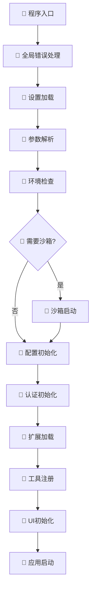
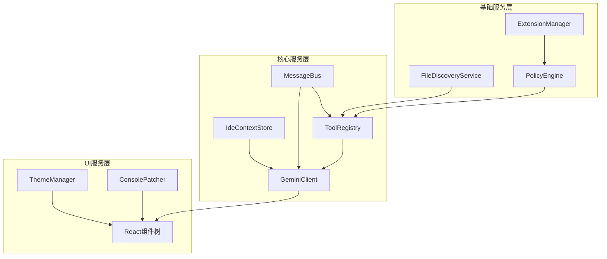
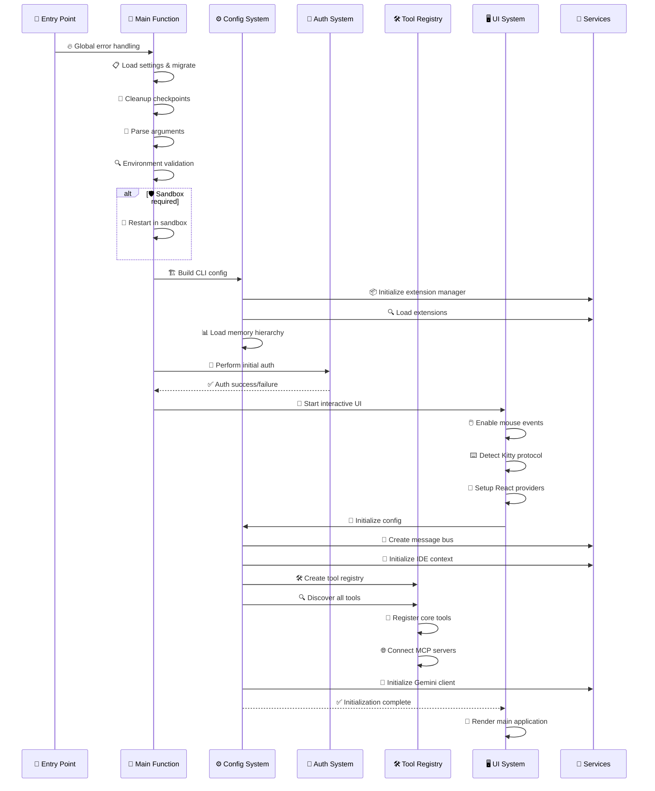

# Gemini CLI 项目启动和初始化流程深度解析

## 📋 目录
1. [启动流程概览](#启动流程概览)
2. [主入口点分析](#主入口点分析)
3. [配置系统初始化](#配置系统初始化)
4. [服务组件初始化](#服务组件初始化)
5. [认证系统初始化](#认证系统初始化)
6. [工具系统发现注册](#工具系统发现注册)
7. [UI系统启动](#ui系统启动)
8. [沙箱环境配置](#沙箱环境配置)
9. [错误处理设置](#错误处理设置)
10. [性能监控初始化](#性能监控初始化)
11. [依赖检查环境准备](#依赖检查环境准备)
12. [完整启动时序图](#完整启动时序图)

---

## 🚀 启动流程概览

Gemini CLI的启动过程是一个精心设计的多阶段初始化流程，涉及环境检查、配置加载、服务初始化、认证设置等多个关键步骤。

### 核心启动阶段



---

## 🎯 主入口点分析

### 入口文件结构

#### 📍 全局入口点：`packages/cli/index.ts`

```typescript
#!/usr/bin/env node

import { main } from './src/gemini.js';
import { FatalError } from './src/core/error.js';
import { debugLogger } from './src/utils/debug.js';

// 🔥 全局错误处理 - 确保所有错误都被优雅处理
main().catch((error) => {
  if (error instanceof FatalError) {
    // 🎨 致命错误的彩色输出
    let errorMessage = error.message;
    if (!process.env['NO_COLOR']) {
      errorMessage = `\x1b[31m${errorMessage}\x1b[0m`; // 红色文本
    }
    debugLogger.error(errorMessage);
    process.exit(error.exitCode);
  }

  // 🚨 意外错误处理
  debugLogger.error('An unexpected critical error occurred:');
  debugLogger.error(error instanceof Error ? error.stack : String(error));
  process.exit(1);
});
```

**关键特性**：
- ✅ **全局异常捕获**: 确保任何未处理的Promise rejection都被捕获
- ✅ **错误分类处理**: 区分致命错误和普通错误
- ✅ **优雅退出**: 提供适当的退出代码
- ✅ **彩色输出**: 支持终端颜色显示

#### 📍 主启动逻辑：`packages/cli/src/gemini.tsx`

```typescript
export async function main() {
  // 1️⃣ 设置全局异常处理器
  setupUnhandledRejectionHandler();

  // 2️⃣ 加载和迁移设置
  const settings = loadSettings();
  const startupWarnings = migrateDeprecatedSettings(settings);

  // 3️⃣ 清理历史检查点
  cleanupCheckpoints();

  // 4️⃣ 解析命令行参数
  const argv = parseArguments(settings.merged);
  const sessionId = `${Date.now()}-${Math.random().toString(36).substring(2, 9)}`;

  // 5️⃣ 调试模式配置
  const isDebugMode = cliConfig.isDebugMode(argv);
  if (isDebugMode) {
    const consolePatcher = new ConsolePatcher();
    consolePatcher.patch();
  }

  // 6️⃣ DNS解析顺序优化
  dns.setDefaultResultOrder(
    validateDnsResolutionOrder(settings.merged.advanced?.dnsResolutionOrder)
  );

  // 7️⃣ 认证类型默认设置
  if (!settings.merged.security?.auth?.selectedType) {
    const isCloudShell = process.env['CLOUD_SHELL'] || process.env['CLOUDSHELL_GCLOUD_CONFIG'];
    const hasApiKey = process.env['GEMINI_API_KEY'];

    if (isCloudShell) {
      settings.merged.security.auth.selectedType = 'CLOUD_SHELL';
    } else if (hasApiKey) {
      settings.merged.security.auth.selectedType = 'USE_GEMINI';
    } else {
      settings.merged.security.auth.selectedType = 'LOGIN_WITH_GOOGLE';
    }
  }

  // 8️⃣ 主题系统初始化
  const themeManager = getThemeManager();
  await themeManager.loadCustomThemes();

  // 9️⃣ 配置构建和初始化
  const config = await loadCliConfig(settings.merged, sessionId, argv);

  // 🔟 启动模式选择
  if (config.isInteractive()) {
    await startInteractiveUI(config, settings, startupWarnings);
  } else {
    await runNonInteractive({config, settings, input, prompt_id});
  }
}
```

---

## ⚙️ 配置系统初始化

### 设置加载机制

#### 📍 设置系统：`packages/cli/src/config/settings.ts`

```typescript
// 🗂️ 配置文件路径定义
export const USER_SETTINGS_PATH = Storage.getGlobalSettingsPath();
export const USER_SETTINGS_DIR = path.dirname(USER_SETTINGS_PATH);

// 🔄 配置迁移映射表
const MIGRATION_MAP: Record<string, string> = {
  accessibility: 'ui.accessibility',           // UI可访问性设置
  allowedTools: 'tools.allowed',              // 允许的工具列表
  autoAccept: 'tools.autoAccept',             // 工具自动接受
  confirmedTools: 'tools.confirmed',          // 已确认的工具
  customCommands: 'commands.custom',          // 自定义命令
  debugMode: 'general.debugMode',             // 调试模式
  defaultModel: 'ai.defaultModel',            // 默认AI模型
  experimentalFeatures: 'features.experimental', // 实验性功能
  gitIgnore: 'files.respectGitIgnore',        // Git忽略文件
  maxFileSize: 'files.maxSize',               // 最大文件大小
  systemPrompt: 'ai.systemPrompt',            // 系统提示词
  temperature: 'ai.temperature',              // AI温度参数
  theme: 'ui.theme',                          // UI主题
  trustedFolders: 'security.trustedFolders'   // 信任文件夹
};

// 📋 设置加载函数
export function loadSettings(): { merged: Settings; startupWarnings: string[] } {
  let userSettings: Partial<Settings> = {};
  const startupWarnings: string[] = [];

  try {
    // 🔍 检查用户设置文件是否存在
    if (fs.existsSync(USER_SETTINGS_PATH)) {
      const settingsContent = fs.readFileSync(USER_SETTINGS_PATH, 'utf8');

      // 📖 解析JSON with Comments格式
      const parsedSettings = JSON.parse(stripJsonComments(settingsContent));

      // 🔄 迁移旧版配置
      userSettings = migrateSettings(parsedSettings, startupWarnings);

      // 🌍 解析环境变量
      userSettings = resolveEnvVarsInObject(userSettings);
    }
  } catch (error) {
    startupWarnings.push(`Failed to load user settings: ${error.message}`);
  }

  // 🔗 深度合并默认设置和用户设置
  const merged = customDeepMerge(getDefaultSettings(), userSettings);

  return { merged, startupWarnings };
}
```

#### 📍 CLI配置构建：`packages/cli/src/config/config.ts`

```typescript
export async function loadCliConfig(
  settings: Settings,
  sessionId: string,
  argv: ArgumentsCamelCase<GeminiArguments>
): Promise<Config> {
  // 1️⃣ 沙箱配置加载
  const sandboxConfig = loadSandboxConfig(argv.sandbox, settings.advanced?.sandbox);

  // 2️⃣ 工作目录和包含目录设置
  const cwd = process.cwd();
  const includeDirectories = argv.includeDirectories?.split(',').map(dir =>
    path.resolve(cwd, dir.trim())
  ) || [];

  // 3️⃣ 调试模式检查
  const debugMode = isDebugMode(argv);

  // 4️⃣ 策略引擎配置
  const policyEngineConfig = await buildPolicyEngineConfig(settings, debugMode);

  // 5️⃣ 工具配置处理
  const allowedTools = processAllowedTools(argv.allowedTools, settings.tools?.allowed);
  const excludeTools = processExcludeTools(argv.excludeTools);

  // 6️⃣ 扩展管理器初始化
  const extensionManager = new ExtensionManager({
    extensionsRootDir: Storage.getExtensionsDir(),
    settingsPath: Storage.getGlobalSettingsPath(),
    isDebug: debugMode,
    allowedTools,
    excludeTools
  });

  // 7️⃣ 扩展加载
  await extensionManager.loadExtensions();

  // 8️⃣ 内存层次加载
  const { memoryContent, fileCount, filePaths } = await loadServerHierarchicalMemory(
    cwd,
    includeDirectories,
    settings
  );

  // 9️⃣ 最终配置对象构建
  return new Config({
    sessionId,
    embeddingModel: DEFAULT_GEMINI_EMBEDDING_MODEL,
    sandbox: sandboxConfig,
    targetDir: cwd,
    includeDirectories,
    debugMode,
    question: argv.question,
    coreTools: settings.tools?.core,
    allowedTools: allowedTools.length > 0 ? allowedTools : undefined,
    policyEngineConfig,
    excludeTools,
    extensionManager,
    memoryContent,
    initialFileCount: fileCount,
    initialFilePaths: filePaths,
    telemetrySettings,
    settings
  });
}
```

---

## 🔧 服务组件初始化

### 核心服务初始化顺序

#### 📍 Config类初始化：`packages/core/src/config/config.ts`

```typescript
export class Config {
  private toolRegistry!: ToolRegistry;
  private geminiClient!: GeminiClient;
  private ideContextStore!: IdeContextStore;
  private messageBus!: MessageBus;

  // 🚀 核心初始化方法
  async initialize(): Promise<void> {
    // 1️⃣ 创建消息总线
    this.messageBus = new MessageBus();

    // 2️⃣ 初始化IDE上下文存储
    this.ideContextStore = new IdeContextStore();

    // 3️⃣ 创建工具注册表
    this.toolRegistry = await this.createToolRegistry();

    // 4️⃣ 初始化Gemini客户端
    this.geminiClient = new GeminiClient(
      this.genAI!,
      this.toolRegistry,
      this.messageBus,
      this.ideContextStore,
      this
    );

    // 5️⃣ 设置工具注册表的客户端引用
    this.toolRegistry.setGeminiClient(this.geminiClient);

    // 6️⃣ 初始化完成回调
    this.onInitialized?.();
  }

  // 🛠️ 工具注册表创建
  private async createToolRegistry(): Promise<ToolRegistry> {
    const mcpClientManager = new McpClientManager(this);

    const toolRegistry = new ToolRegistry(
      this,
      this.messageBus,
      mcpClientManager
    );

    // 📋 发现所有工具
    await toolRegistry.discoverAllTools();

    return toolRegistry;
  }
}
```

### 服务依赖关系图



---

## 🔐 认证系统初始化

### 认证流程分析

#### 📍 认证初始化：`packages/cli/src/core/auth.ts`

```typescript
export async function performInitialAuth(
  config: Config,
  authType: AuthType | undefined,
): Promise<string | null> {
  if (!authType) {
    return null;
  }

  try {
    // 🔄 刷新认证状态
    await config.refreshAuth(authType);
    return null;
  } catch (e) {
    return `Failed to login. Message: ${getErrorMessage(e)}`;
  }
}

// 🎯 支持的认证类型
export type AuthType =
  | 'USE_GEMINI'        // Gemini API密钥
  | 'LOGIN_WITH_GOOGLE' // Google OAuth2
  | 'CLOUD_SHELL'       // Cloud Shell环境
  | 'SERVICE_ACCOUNT';  // 服务账户
```

#### 📍 认证类型自动检测：`packages/cli/src/gemini.tsx`

```typescript
// 🔍 智能认证类型检测
if (!settings.merged.security?.auth?.selectedType) {
  const isCloudShell = process.env['CLOUD_SHELL'] ||
                      process.env['CLOUDSHELL_GCLOUD_CONFIG'];
  const hasApiKey = process.env['GEMINI_API_KEY'];
  const hasVertexConfig = process.env['GOOGLE_GENAI_USE_VERTEXAI'];

  // 🏷️ 认证类型优先级
  if (isCloudShell) {
    settings.merged.security.auth.selectedType = 'CLOUD_SHELL';
  } else if (hasVertexConfig) {
    settings.merged.security.auth.selectedType = 'SERVICE_ACCOUNT';
  } else if (hasApiKey) {
    settings.merged.security.auth.selectedType = 'USE_GEMINI';
  } else {
    settings.merged.security.auth.selectedType = 'LOGIN_WITH_GOOGLE';
  }
}
```

### OAuth2流程处理

```typescript
// 📍 OAuth重定向处理：packages/cli/src/core/auth.ts
export function handleOAuthRedirect(url: string): { success: boolean; error?: string } {
  try {
    const urlObj = new URL(url);
    const code = urlObj.searchParams.get('code');
    const error = urlObj.searchParams.get('error');

    if (error) {
      return { success: false, error: `OAuth error: ${error}` };
    }

    if (code) {
      // 🎉 OAuth授权码获取成功
      return { success: true };
    }

    return { success: false, error: 'No authorization code received' };
  } catch (e) {
    return { success: false, error: `Invalid OAuth URL: ${e.message}` };
  }
}
```

---

## 🛠️ 工具系统发现注册

### 工具注册表架构

#### 📍 工具注册表：`packages/core/src/tools/tool-registry.ts`

```typescript
export class ToolRegistry {
  private tools = new Map<string, AnyDeclarativeTool>();
  private mcpClientManager: McpClientManager;

  // 🔍 工具发现主流程
  async discoverAllTools(): Promise<void> {
    // 1️⃣ 注册核心工具
    await this.registerCoreTools();

    // 2️⃣ 发现命令行工具
    await this.discoverCommandTools();

    // 3️⃣ 发现MCP工具
    await this.mcpClientManager.discoverAllMcpTools();

    // 4️⃣ 注册MCP工具
    this.registerMcpTools();

    // 5️⃣ 应用工具过滤
    this.applyToolFilters();
  }

  // 🧰 核心工具注册
  private async registerCoreTools(): Promise<void> {
    const coreTools = [
      new ReadFileTool(this.config),
      new WriteFileTool(this.config, this.messageBus),
      new EditTool(this.config, this.messageBus),
      new ShellTool(this.config, this.messageBus),
      new LsTool(this.config),
      new GrepTool(this.config),
      new RipGrepTool(this.config),
      new GlobTool(this.config),
      new WebFetchTool(this.config),
      new WebSearchTool(this.config),
      new MemoryTool(this.config, this.messageBus)
    ];

    for (const tool of coreTools) {
      this.registerTool(tool);
    }
  }

  // 🔍 命令行工具发现
  private async discoverCommandTools(): Promise<void> {
    const discoveryCommand = this.config.getToolDiscoveryCommand();
    if (!discoveryCommand) return;

    try {
      // 🚀 执行工具发现命令
      const result = await executeShellCommand(discoveryCommand);
      const discoveredTools = JSON.parse(result.stdout);

      for (const toolSpec of discoveredTools) {
        const tool = new DiscoveredTool(
          this.config,
          toolSpec.name,
          toolSpec.description,
          toolSpec.parameters
        );
        this.registerTool(tool);
      }
    } catch (error) {
      console.warn(`Tool discovery failed: ${error.message}`);
    }
  }
}
```

### MCP工具集成

#### 📍 MCP客户端管理：`packages/core/src/tools/mcp-client-manager.ts`

```typescript
export class McpClientManager {
  private clients: Map<string, McpClient> = new Map();
  private discoveredTools: DiscoveredMCPTool[] = [];

  // 🌐 MCP工具发现
  async discoverAllMcpTools(): Promise<void> {
    const mcpServers = this.config.getMcpServers();

    // 🔄 并行连接所有MCP服务器
    const connectionPromises = Object.entries(mcpServers).map(
      async ([serverName, serverConfig]) => {
        try {
          await this.connectToServer(serverName, serverConfig);
        } catch (error) {
          console.warn(`Failed to connect to MCP server ${serverName}: ${error.message}`);
        }
      }
    );

    await Promise.all(connectionPromises);
  }

  // 🔗 连接MCP服务器
  private async connectToServer(serverName: string, config: MCPServerConfig): Promise<void> {
    const client = new McpClient(serverName, config, this.config);

    // 🤝 建立连接
    await client.connect();

    // 🛠️ 获取工具列表
    const tools = await client.listTools();

    // 📋 注册工具
    for (const tool of tools) {
      const mcpTool = new DiscoveredMCPTool(
        tool,
        serverName,
        tool.name,
        client,
        this.config
      );
      this.discoveredTools.push(mcpTool);
    }

    this.clients.set(serverName, client);
  }
}
```

---

## 🖥️ UI系统启动

### React UI初始化

#### 📍 交互式UI启动：`packages/cli/src/gemini.tsx`

```typescript
async function startInteractiveUI(
  config: Config,
  settings: { merged: Settings; startupWarnings: string[] },
  startupWarnings: string[]
): Promise<void> {
  // 1️⃣ 认证初始化
  const authError = await performInitialAuth(config, settings.merged.security?.auth?.selectedType);
  if (authError) {
    throw new FatalError(authError, 1);
  }

  // 2️⃣ 终端配置
  process.stdout.write('\x1b[?7l'); // 禁用行包装
  if (settings.merged.ui?.enableMouse !== false) {
    enableMouseEvents(); // 启用鼠标事件
  }

  // 3️⃣ Kitty键盘协议检测
  await detectAndEnableKittyProtocol();

  // 4️⃣ React应用启动
  const AppWrapper = () => {
    const kittyProtocolStatus = useKittyKeyboardProtocol();

    return (
      <SettingsContext.Provider value={settings}>
        <KeypressProvider>
          <MouseProvider>
            <ScrollProvider>
              <SessionStatsProvider>
                <VimModeProvider>
                  <AppContainer />
                </VimModeProvider>
              </SessionStatsProvider>
            </ScrollProvider>
          </MouseProvider>
        </KeypressProvider>
      </SettingsContext.Provider>
    );
  };

  // 🎨 Ink渲染器配置
  const { unmount } = render(<AppWrapper />, {
    exitOnCtrlC: false, // 禁用Ctrl+C自动退出
    patchConsole: false // 禁用控制台补丁
  });

  // 🧹 注册清理函数
  registerCleanup(async () => {
    unmount();
    disableMouseEvents();
    process.stdout.write('\x1b[?7h'); // 重新启用行包装
  });
}
```

#### 📍 应用容器初始化：`packages/cli/src/ui/AppContainer.tsx`

```typescript
export function AppContainer() {
  const [configInitialized, setConfigInitialized] = useState(false);
  const [error, setError] = useState<string | null>(null);

  // 🚀 配置初始化
  useEffect(() => {
    (async () => {
      try {
        // 📋 异步初始化配置
        await config.initialize();
        setConfigInitialized(true);
      } catch (err) {
        setError(`Configuration initialization failed: ${err.message}`);
      }
    })();

    // 🧹 清理资源注册
    registerCleanup(async () => {
      disableMouseEvents();
      const ideClient = await IdeClient.getInstance();
      await ideClient.disconnect();
    });
  }, [config]);

  // 📊 性能监控
  useMemoryMonitor(config);

  // 🎨 UI渲染
  if (error) {
    return <ErrorScreen error={error} />;
  }

  if (!configInitialized) {
    return <LoadingScreen message="Initializing Gemini CLI..." />;
  }

  return <App />;
}
```

### Context Provider链

```typescript
// 🔗 React Context提供者链
<SettingsContext.Provider>      // 设置上下文
  <KeypressProvider>            // 键盘事件处理
    <MouseProvider>             // 鼠标事件处理
      <ScrollProvider>          // 滚动控制
        <SessionStatsProvider>  // 会话统计
          <VimModeProvider>     // Vim模式支持
            <AppContainer />    // 主应用容器
          </VimModeProvider>
        </SessionStatsProvider>
      </ScrollProvider>
    </MouseProvider>
  </KeypressProvider>
</SettingsContext.Provider>
```

---

## 🛡️ 沙箱环境配置

### 沙箱检测和配置

#### 📍 沙箱配置加载：`packages/cli/src/config/sandboxConfig.ts`

```typescript
// 🔍 支持的沙箱命令
const VALID_SANDBOX_COMMANDS = ['docker', 'podman', 'sandbox-exec'];

export function loadSandboxConfig(
  sandboxFlag?: boolean | string,
  settingsSandbox?: SandboxSettings
): SandboxConfig {
  // 1️⃣ 检查是否已在沙箱中运行
  if (process.env['SANDBOX']) {
    return { command: '', flags: [], environment: {} };
  }

  // 2️⃣ 获取沙箱命令
  const command = getSandboxCommand(sandboxFlag, settingsSandbox);

  if (!command) {
    return { command: '', flags: [], environment: {} };
  }

  // 3️⃣ 构建沙箱配置
  const config: SandboxConfig = {
    command,
    flags: buildSandboxFlags(command, settingsSandbox),
    environment: buildSandboxEnvironment(settingsSandbox),
    imageUri: settingsSandbox?.imageUri || getDefaultImageUri()
  };

  return config;
}

// 🔍 沙箱命令检测
function getSandboxCommand(
  sandboxFlag?: boolean | string,
  settings?: SandboxSettings
): SandboxConfig['command'] | '' {
  // 🌍 环境变量优先级
  const envSandbox = process.env['GEMINI_SANDBOX']?.toLowerCase().trim() || '';

  if (envSandbox && VALID_SANDBOX_COMMANDS.includes(envSandbox)) {
    return envSandbox as SandboxConfig['command'];
  }

  // 🖥️ 平台特定检测
  if (os.platform() === 'darwin' && commandExists.sync('sandbox-exec')) {
    return 'sandbox-exec';
  }

  // 🐳 容器引擎检测
  if (sandboxFlag === true || sandboxFlag === 'docker') {
    if (commandExists.sync('docker')) {
      return 'docker';
    }
  }

  if (sandboxFlag === true || sandboxFlag === 'podman') {
    if (commandExists.sync('podman')) {
      return 'podman';
    }
  }

  return '';
}
```

### 沙箱启动流程

```typescript
// 📍 沙箱重启逻辑：packages/cli/src/gemini.tsx
async function restartInSandbox(sandboxConfig: SandboxConfig): Promise<void> {
  // 1️⃣ 认证检查 - OAuth2在沙箱中会失败
  if (requiresInteractiveAuth(settings.merged.security?.auth?.selectedType)) {
    throw new FatalSandboxError(
      'Interactive authentication is not supported in sandbox mode. ' +
      'Please use API key or service account authentication.'
    );
  }

  // 2️⃣ 读取stdin数据
  let input = '';
  if (!process.stdin.isTTY) {
    const chunks: Buffer[] = [];
    for await (const chunk of process.stdin) {
      chunks.push(chunk);
    }
    input = Buffer.concat(chunks).toString();
  }

  // 3️⃣ 构建沙箱命令
  const sandboxArgs = [
    ...sandboxConfig.flags,
    process.argv[0], // node executable
    ...process.argv.slice(1) // script and args
  ];

  // 4️⃣ 在沙箱中重启进程
  const childProcess = spawn(sandboxConfig.command, sandboxArgs, {
    stdio: ['pipe', 'inherit', 'inherit'],
    env: { ...process.env, SANDBOX: '1', ...sandboxConfig.environment }
  });

  // 5️⃣ 传递输入数据
  if (input) {
    childProcess.stdin?.write(input);
    childProcess.stdin?.end();
  }

  // 6️⃣ 等待子进程完成
  const exitCode = await new Promise<number>((resolve) => {
    childProcess.on('close', resolve);
  });

  process.exit(exitCode);
}
```

---

## ❌ 错误处理设置

### 全局错误处理机制

#### 📍 未处理Promise拒绝：`packages/cli/src/gemini.tsx`

```typescript
export function setupUnhandledRejectionHandler() {
  let unhandledRejectionOccurred = false;

  // 🚨 全局Promise rejection处理
  process.on('unhandledRejection', (reason, promise) => {
    const errorMessage = `=========================================
This is an unexpected error. Please file a bug report using the /bug tool.
CRITICAL: Unhandled Promise Rejection!
=========================================
Reason: ${reason}
Promise: ${promise}`;

    // 📢 发送错误事件
    appEvents.emit(AppEvent.LogError, errorMessage);

    // 🔍 首次错误时打开调试控制台
    if (!unhandledRejectionOccurred) {
      unhandledRejectionOccurred = true;
      appEvents.emit(AppEvent.OpenDebugConsole);
    }
  });

  // 🚨 未捕获异常处理
  process.on('uncaughtException', (error) => {
    const errorMessage = `=========================================
CRITICAL: Uncaught Exception!
=========================================
Error: ${error.message}
Stack: ${error.stack}`;

    appEvents.emit(AppEvent.LogError, errorMessage);
    appEvents.emit(AppEvent.OpenDebugConsole);

    // 🛑 严重错误，强制退出
    process.exit(1);
  });
}
```

### 错误类型层次结构

```typescript
// 📍 错误类型定义：packages/cli/src/core/error.ts

// 🔴 基础致命错误
export class FatalError extends Error {
  constructor(
    message: string,
    public readonly exitCode: number = 1
  ) {
    super(message);
    this.name = 'FatalError';
  }
}

// ⚙️ 配置错误
export class FatalConfigError extends FatalError {
  constructor(message: string) {
    super(`Configuration Error: ${message}`, 1);
    this.name = 'FatalConfigError';
  }
}

// 🛡️ 沙箱错误
export class FatalSandboxError extends FatalError {
  constructor(message: string) {
    super(`Sandbox Error: ${message}`, 1);
    this.name = 'FatalSandboxError';
  }
}

// 🔐 认证错误
export class FatalAuthError extends FatalError {
  constructor(message: string) {
    super(`Authentication Error: ${message}`, 1);
    this.name = 'FatalAuthError';
  }
}
```

### 控制台补丁系统

#### 📍 控制台拦截：`packages/cli/src/ui/utils/ConsolePatcher.js`

```typescript
export class ConsolePatcher {
  private originalMethods: Map<string, Function> = new Map();

  // 🔧 补丁应用
  patch(): void {
    const methods = ['log', 'warn', 'error', 'info', 'debug'];

    methods.forEach(method => {
      this.originalMethods.set(method, console[method]);

      console[method] = (...args: any[]) => {
        // 📤 发送到UI系统
        appEvents.emit(AppEvent.ConsoleOutput, {
          level: method,
          message: args.join(' '),
          timestamp: Date.now()
        });

        // 🔄 调用原始方法
        this.originalMethods.get(method)!.apply(console, args);
      };
    });
  }

  // 🔄 补丁移除
  unpatch(): void {
    this.originalMethods.forEach((originalMethod, method) => {
      console[method] = originalMethod;
    });
    this.originalMethods.clear();
  }
}
```

---

## 📊 性能监控初始化

### 遥测系统设置

#### 📍 遥测配置：`packages/cli/src/gemini.tsx`

```typescript
// 📊 遥测设置解析
let telemetrySettings;
try {
  telemetrySettings = await resolveTelemetrySettings({
    env: process.env as unknown as Record<string, string | undefined>,
    settings: settings.telemetry,
  });
} catch (err) {
  if (err instanceof FatalConfigError) {
    throw new FatalConfigError(`Invalid telemetry configuration: ${err.message}.`);
  }
  throw err;
}

// 📈 会话统计初始化
const sessionStats = {
  startTime: Date.now(),
  sessionId,
  nodeVersion: process.version,
  platform: os.platform(),
  arch: os.arch()
};
```

### 内存监控服务

#### 📍 内存监控Hook：`packages/cli/src/ui/hooks/useMemoryMonitor.ts`

```typescript
export function useMemoryMonitor(config: Config) {
  useEffect(() => {
    if (!config.isDebugMode()) return;

    const memoryMonitor = new MemoryMonitor();

    // 🔄 定期内存检查
    const interval = setInterval(() => {
      const memoryUsage = process.memoryUsage();

      // 📊 记录内存指标
      memoryMonitor.recordMetric('rss', memoryUsage.rss);
      memoryMonitor.recordMetric('heapUsed', memoryUsage.heapUsed);
      memoryMonitor.recordMetric('heapTotal', memoryUsage.heapTotal);
      memoryMonitor.recordMetric('external', memoryUsage.external);

      // ⚠️ 内存警告阈值
      if (memoryUsage.heapUsed > 500 * 1024 * 1024) { // 500MB
        console.warn('High memory usage detected:', memoryUsage);
      }
    }, 5000); // 每5秒检查一次

    return () => clearInterval(interval);
  }, [config]);
}
```

### 性能指标收集

```typescript
// 📍 性能指标：packages/core/src/services/performance-monitor.ts
export class PerformanceMonitor {
  private metrics: Map<string, MetricData[]> = new Map();

  // 📏 操作计时
  async measureOperation<T>(
    operationName: string,
    operation: () => Promise<T>
  ): Promise<T> {
    const startTime = performance.now();
    const startMemory = process.memoryUsage();

    try {
      const result = await operation();

      // 📊 成功指标记录
      this.recordMetric(operationName, {
        duration: performance.now() - startTime,
        memoryDelta: process.memoryUsage().heapUsed - startMemory.heapUsed,
        status: 'success',
        timestamp: Date.now()
      });

      return result;
    } catch (error) {
      // 📉 错误指标记录
      this.recordMetric(operationName, {
        duration: performance.now() - startTime,
        status: 'error',
        error: error.message,
        timestamp: Date.now()
      });
      throw error;
    }
  }
}
```

---

## 🔍 依赖检查环境准备

### 环境检查清单

#### 📍 依赖验证：`packages/cli/src/gemini.tsx`

```typescript
// 🔍 环境检查函数
function validateEnvironment(): string[] {
  const warnings: string[] = [];

  // 1️⃣ Node.js版本检查
  const nodeVersion = process.version;
  const requiredVersion = '20.0.0';
  if (!semver.gte(nodeVersion, requiredVersion)) {
    warnings.push(`Node.js ${requiredVersion} or higher is required. Current: ${nodeVersion}`);
  }

  // 2️⃣ 终端能力检查
  if (!process.stdout.isTTY && process.argv.includes('--interactive')) {
    warnings.push('Interactive mode requested but stdout is not a TTY');
  }

  // 3️⃣ 颜色支持检查
  if (process.env['NO_COLOR'] === undefined && !supportsColor.stdout) {
    process.env['NO_COLOR'] = '1';
  }

  // 4️⃣ 权限检查
  try {
    fs.accessSync(USER_SETTINGS_DIR, fs.constants.W_OK);
  } catch (error) {
    warnings.push(`Cannot write to settings directory: ${USER_SETTINGS_DIR}`);
  }

  return warnings;
}

// 🌐 DNS解析顺序验证
function validateDnsResolutionOrder(order?: string): 'ipv4first' | 'verbatim' {
  const validOrders = ['ipv4first', 'verbatim'];

  if (order && validOrders.includes(order)) {
    return order as 'ipv4first' | 'verbatim';
  }

  return 'ipv4first'; // 默认优先IPv4
}
```

### 命令可用性检查

```typescript
// 📍 命令存在性检查：packages/cli/src/utils/command-check.ts
import commandExists from 'command-exists';

export async function checkRequiredCommands(): Promise<{
  available: string[];
  missing: string[];
}> {
  const commands = ['git', 'node', 'npm'];
  const available: string[] = [];
  const missing: string[] = [];

  // 🔄 并行检查所有命令
  await Promise.all(
    commands.map(async (cmd) => {
      try {
        await commandExists(cmd);
        available.push(cmd);
      } catch (error) {
        missing.push(cmd);
      }
    })
  );

  return { available, missing };
}

// 🐳 容器引擎检查
export async function checkContainerEngines(): Promise<{
  docker: boolean;
  podman: boolean;
  sandboxExec: boolean;
}> {
  const [docker, podman, sandboxExec] = await Promise.all([
    commandExists('docker').then(() => true).catch(() => false),
    commandExists('podman').then(() => true).catch(() => false),
    commandExists('sandbox-exec').then(() => true).catch(() => false)
  ]);

  return { docker, podman, sandboxExec };
}
```

---

## 📈 完整启动时序图



---

## 🎯 总结

### 🌟 启动流程特点

Gemini CLI的启动流程展现了现代CLI应用的**工程杰作**：

1. **🔄 渐进式初始化**: 分阶段、有序的组件初始化
2. **🛡️ 全面错误处理**: 多层次的错误捕获和处理机制
3. **⚙️ 智能配置系统**: 多源配置合并和迁移机制
4. **🔐 灵活认证策略**: 多种认证方式的自动检测和配置
5. **🛠️ 可扩展工具系统**: 内置工具+MCP工具+自定义工具
6. **🖥️ 现代UI体验**: React+Ink构建的丰富终端界面
7. **🛡️ 安全沙箱执行**: 多平台沙箱环境的智能检测
8. **📊 完善监控体系**: 性能监控和遥测数据收集

### 💡 设计亮点

- **模块化架构**: 清晰的职责分离和依赖关系
- **异步优化**: 并行初始化和非阻塞操作
- **容错机制**: 优雅的降级和错误恢复
- **用户体验**: 智能默认配置和友好错误提示
- **扩展性**: 插件化的工具和扩展系统

这个启动流程不仅保证了应用的稳定运行，更为用户提供了快速、可靠、功能丰富的AI辅助体验。每个初始化步骤都经过精心设计，体现了现代软件工程的最佳实践。

---

*本文档基于Gemini CLI项目源码的深入分析，详细展现了从程序启动到完全初始化的完整技术流程和关键实现细节。*