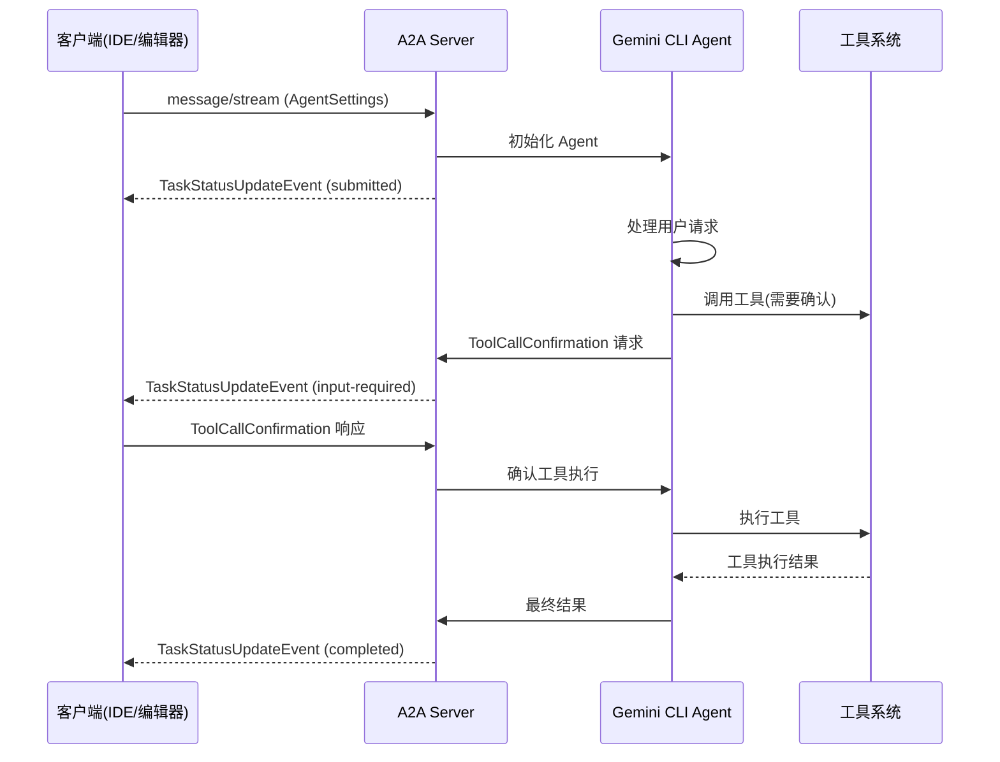

# Gemini CLI A2A Server 模块深度分析

## 概述

`@google/gemini-cli-a2a-server` 是 Gemini
CLI 项目中的一个**实验性模块**，它实现了基于 **A2A
(Agent-to-Agent) 协议**的服务器端，用于标准化客户端与 Gemini CLI
Agent 之间的通信。

## 核心功能

### 🎯 **主要目的**

A2A
Server 的核心作用是提供一个标准化的通信协议，使得不同的客户端（如 IDE、编辑器、开发工具）能够以统一的方式与 Gemini
CLI Agent 进行交互。

### 🔄 **解决的问题**

1. **客户端集成标准化**: 为 Zed、Gemini Code Assist 等客户端提供统一的集成接口
2. **协议标准化**: 基于开源的 A2A 协议，而不是自定义协议
3. **实时交互**: 支持流式通信和实时状态更新
4. **工具权限管理**: 提供工具调用确认机制

## 技术架构

### 1. 核心依赖分析

```json
{
  "dependencies": {
    "@a2a-js/sdk": "^0.3.2", // A2A 协议 SDK
    "@google-cloud/storage": "^7.16.0", // GCS 存储支持
    "@google/gemini-cli-core": "file:../core", // Gemini CLI 核心模块
    "express": "^5.1.0", // Web 服务器框架
    "winston": "^3.17.0" // 日志系统
  }
}
```

### 2. 模块结构

```
packages/a2a-server/
├── src/
│   ├── agent/          # Agent 执行器实现
│   ├── commands/       # 命令注册和处理
│   ├── config/         # 配置管理
│   ├── http/           # HTTP 服务器和路由
│   ├── persistence/    # 数据持久化（GCS）
│   ├── utils/          # 工具函数
│   ├── index.ts        # 模块导出
│   └── types.ts        # 类型定义
├── package.json
├── README.md
└── development-extension-rfc.md  # 协议规范文档
```

## A2A 协议扩展：development-tool

### 1. 协议概述

A2A Server 实现了一个名为 `development-tool`
的 A2A 协议扩展，专门用于开发工具场景：

```typescript
// Agent Card 示例
const coderAgentCard: AgentCard = {
  name: 'Gemini SDLC Agent',
  description:
    'An agent that generates code based on natural language instructions and streams file outputs.',
  url: 'http://localhost:41242/',
  provider: {
    organization: 'Google',
    url: 'https://google.com',
  },
  protocolVersion: '0.3.0',
  capabilities: {
    streaming: true, // 支持流式通信
    pushNotifications: false, // 不支持推送通知
    stateTransitionHistory: true, // 支持状态转换历史
  },
};
```

### 2. 事件类型系统

```typescript
export enum CoderAgentEvent {
  ToolCallConfirmationEvent = 'tool-call-confirmation', // 工具调用确认请求
  ToolCallUpdateEvent = 'tool-call-update', // 工具调用状态更新
  TextContentEvent = 'text-content', // 文本内容更新
  StateChangeEvent = 'state-change', // 状态变更
  StateAgentSettingsEvent = 'agent-settings', // Agent 设置
  ThoughtEvent = 'thought', // Agent 思维过程
  CitationEvent = 'citation', // 引用信息
}
```

### 3. 通信流程



## 核心组件分析

### 1. Agent 执行器 (CoderAgentExecutor)

```typescript
// src/agent/executor.ts
export class CoderAgentExecutor {
  // 负责执行 Gemini CLI Agent 并将结果适配为 A2A 协议格式
  async executeTask(
    message: string,
    settings: AgentSettings,
    onUpdate: (event: CoderAgentMessage) => void,
  ): Promise<void> {
    // 1. 初始化 Gemini CLI Core
    // 2. 执行 Agent 任务
    // 3. 将 Agent 事件转换为 A2A 事件
    // 4. 通过回调发送实时更新
  }
}
```

**关键功能**:

- 桥接 Gemini CLI Core 和 A2A 协议
- 实时事件转换和流式传输
- 工具调用权限管理

### 2. HTTP 服务器 (Express App)

```typescript
// src/http/app.ts
export function createApp(): express.Application {
  const app = express();

  // A2A 协议端点
  const a2aApp = new A2AExpressApp({
    agentCard: coderAgentCard,
    requestHandler: new DefaultRequestHandler({
      taskStore,
      executor: new CoderAgentExecutor(),
    }),
  });

  // 自定义端点
  app.get('/commands/get', getCommands); // 获取可用命令
  app.post('/command/execute', executeCommand); // 执行命令

  return app;
}
```

**核心特性**:

- 基于 Express.js 的 HTTP 服务器
- 集成 A2A SDK 的标准端点
- 自定义命令发现和执行端点

### 3. 任务持久化 (Task Store)

```typescript
// src/persistence/gcs.ts
export class GCSTaskStore implements TaskStore {
  // 使用 Google Cloud Storage 持久化任务状态
  async saveTask(taskId: string, task: Task): Promise<void> {
    // 保存任务到 GCS
  }

  async loadTask(taskId: string): Promise<Task | null> {
    // 从 GCS 加载任务
  }
}

export class NoOpTaskStore implements TaskStore {
  // 无操作实现，用于开发和测试
}
```

**存储选项**:

- **GCSTaskStore**: 生产环境，使用 Google Cloud Storage
- **InMemoryTaskStore**: 开发环境，内存存储
- **NoOpTaskStore**: 测试环境，无持久化

### 4. 配置管理

```typescript
// src/config/config.ts
export interface A2AServerConfig {
  port: number;
  targetDir: string;
  persistence: 'gcs' | 'memory' | 'noop';
  gcsBucket?: string;
}

export function loadConfig(): A2AServerConfig {
  // 从环境变量和配置文件加载配置
}
```

## 协议规范详解

### 1. 初始化流程

```typescript
// 客户端必须在第一条消息中发送 AgentSettings
interface AgentSettings {
  kind: CoderAgentEvent.StateAgentSettingsEvent;
  workspacePath: string; // 工作区路径
}
```

### 2. 工具调用生命周期

```typescript
// 工具调用状态机
enum ToolCallStatus {
  PENDING = 1, // 等待确认
  EXECUTING = 2, // 执行中
  SUCCEEDED = 3, // 执行成功
  FAILED = 4, // 执行失败
  CANCELLED = 5, // 用户取消
}

// 工具调用对象
interface ToolCall {
  tool_call_id: string;
  status: ToolCallStatus;
  tool_name: string;
  description?: string;
  input_parameters: Record<string, unknown>;
  live_content?: string; // 实时输出（如 shell 命令输出）
  result?: ToolOutput | ErrorDetails;
  confirmation_request?: ConfirmationRequest;
}
```

### 3. 确认请求机制

```typescript
// 确认请求
interface ConfirmationRequest {
  options: ConfirmationOption[]; // 用户选择选项
  details: ExecuteDetails | FileDiff | McpDetails | GenericDetails;
}

// 确认选项
interface ConfirmationOption {
  id: string; // 选项 ID（如 'proceed_once', 'cancel'）
  name: string; // 显示名称
  description?: string; // 详细描述
}
```

### 4. Agent 思维过程

```typescript
// Agent 思维事件
interface AgentThought {
  subject: string; // 思维主题
  description: string; // 详细描述
}
```

## 实际应用场景

### 1. IDE 集成

```typescript
// 在 VS Code 或 Zed 中集成
class GeminiCLIExtension {
  private a2aClient: A2AClient;

  async initialize() {
    this.a2aClient = new A2AClient('http://localhost:41242');

    // 获取可用命令
    const commands = await this.a2aClient.request('/commands/get');
    this.registerCommands(commands);
  }

  async executeCommand(command: string, args: string) {
    const stream = await this.a2aClient.stream({
      message: `/${command} ${args}`,
      metadata: {
        agentSettings: {
          workspacePath: workspace.rootPath,
        },
      },
    });

    // 处理流式响应
    for await (const event of stream) {
      this.handleAgentEvent(event);
    }
  }
}
```

### 2. 工具调用确认

```typescript
// 处理工具调用确认
function handleToolCallConfirmation(toolCall: ToolCall) {
  if (toolCall.confirmation_request) {
    // 显示确认对话框
    const userChoice = await showConfirmationDialog(
      toolCall.confirmation_request,
    );

    // 发送用户选择
    await a2aClient.stream({
      contextId: currentContextId,
      taskId: currentTaskId,
      message: {
        toolCallConfirmation: {
          tool_call_id: toolCall.tool_call_id,
          selected_option_id: userChoice.id,
        },
      },
    });
  }
}
```

### 3. 实时状态更新

```typescript
// 处理不同类型的事件
function handleAgentEvent(event: TaskStatusUpdateEvent) {
  const metadata = event.message.metadata;

  switch (metadata.kind) {
    case CoderAgentEvent.TextContentEvent:
      // 显示文本内容
      displayTextContent(event.message.content);
      break;

    case CoderAgentEvent.ThoughtEvent:
      // 显示 Agent 思维过程
      displayThought(event.message.data);
      break;

    case CoderAgentEvent.ToolCallUpdateEvent:
      // 更新工具调用状态
      updateToolCallStatus(event.message.data);
      break;

    case CoderAgentEvent.StateChangeEvent:
      // 更新整体状态
      updateTaskState(event.status);
      break;
  }
}
```

## 技术优势

### 1. 标准化协议

- **基于开源标准**: 使用 Linux Foundation 采纳的 A2A 协议
- **生态系统对齐**: 与行业标准保持一致
- **互操作性**: 支持多种客户端集成

### 2. 实时交互

- **流式通信**: 支持实时状态更新和输出流
- **事件驱动**: 基于事件的异步通信模式
- **用户确认**: 工具执行前的权限确认机制

### 3. 扩展性设计

- **模块化架构**: 清晰的职责分离
- **插件化配置**: 支持不同的存储后端
- **协议扩展**: 可扩展的事件类型系统

## 部署和配置

### 1. 环境变量

```bash
# 服务器配置
PORT=41242
TARGET_DIR=/workspace

# 持久化配置
PERSISTENCE_TYPE=gcs  # gcs | memory | noop
GCS_BUCKET=my-bucket

# 日志配置
LOG_LEVEL=info
```

### 2. 启动方式

```bash
# 开发环境
npm run start

# 生产环境
npm run build
node dist/src/http/server.js

# 使用 CLI
gemini-cli-a2a-server --port 41242 --target-dir /workspace
```

### 3. 客户端连接

```typescript
// 连接到 A2A Server
const client = new A2AClient('http://localhost:41242');

// 获取 Agent Card
const agentCard = await client.getAgentCard();
console.log('Connected to:', agentCard.name);

// 开始对话
const stream = await client.stream({
  message: 'Help me implement a new feature',
  metadata: {
    agentSettings: {
      workspacePath: '/path/to/workspace',
    },
  },
});
```

## 发展状态和未来规划

### 🚧 **当前状态**

- **实验性质**: 代码标注为 "experimental and under active development"
- **功能完整**: 基本的 A2A 协议实现已完成
- **客户端集成**: 已与 Zed 和 Gemini Code Assist 进行集成测试

### 🚀 **未来发展**

1. **协议稳定化**: 完善 development-tool 扩展规范
2. **性能优化**: 优化流式传输和内存使用
3. **安全增强**: 加强工具调用的安全验证
4. **生态扩展**: 支持更多客户端和开发工具

## 与 Gemini CLI Core 的关系

### 1. 架构层次

```
┌─────────────────────────────────────┐
│        客户端层 (IDE/编辑器)          │
├─────────────────────────────────────┤
│       A2A 协议层 (标准化通信)         │
├─────────────────────────────────────┤
│     A2A Server (协议适配器)          │
├─────────────────────────────────────┤
│    Gemini CLI Core (核心功能)        │
├─────────────────────────────────────┤
│       工具系统 (实际执行)             │
└─────────────────────────────────────┘
```

### 2. 职责分工

- **Gemini CLI Core**: 提供核心 Agent 功能和工具系统
- **A2A Server**: 提供标准化的通信协议和客户端适配
- **客户端**: 提供用户界面和开发环境集成

## 总结

Gemini CLI A2A Server 是一个**协议适配器和标准化层**，它的核心价值在于：

### 🎯 **核心价值**

1. **标准化集成**: 为不同客户端提供统一的集成接口
2. **实时交互**: 支持流式通信和实时状态更新
3. **权限管理**: 提供工具调用的确认和授权机制
4. **生态兼容**: 基于开源 A2A 协议，促进生态发展

### 🏗️ **技术特色**

- **协议扩展**: 实现了专门的 development-tool A2A 扩展
- **事件驱动**: 完整的事件类型系统和状态管理
- **模块化设计**: 清晰的架构分层和职责分离
- **生产就绪**: 支持多种存储后端和部署方式

### 🚀 **实际意义**

这个模块为 Gemini
CLI 提供了**企业级集成能力**，使得 AI 代理能够无缝集成到现有的开发工具链中，是 Gemini
CLI 生态系统的重要组成部分。
