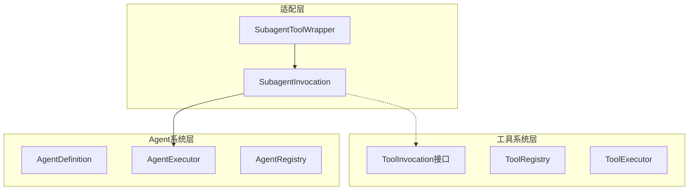
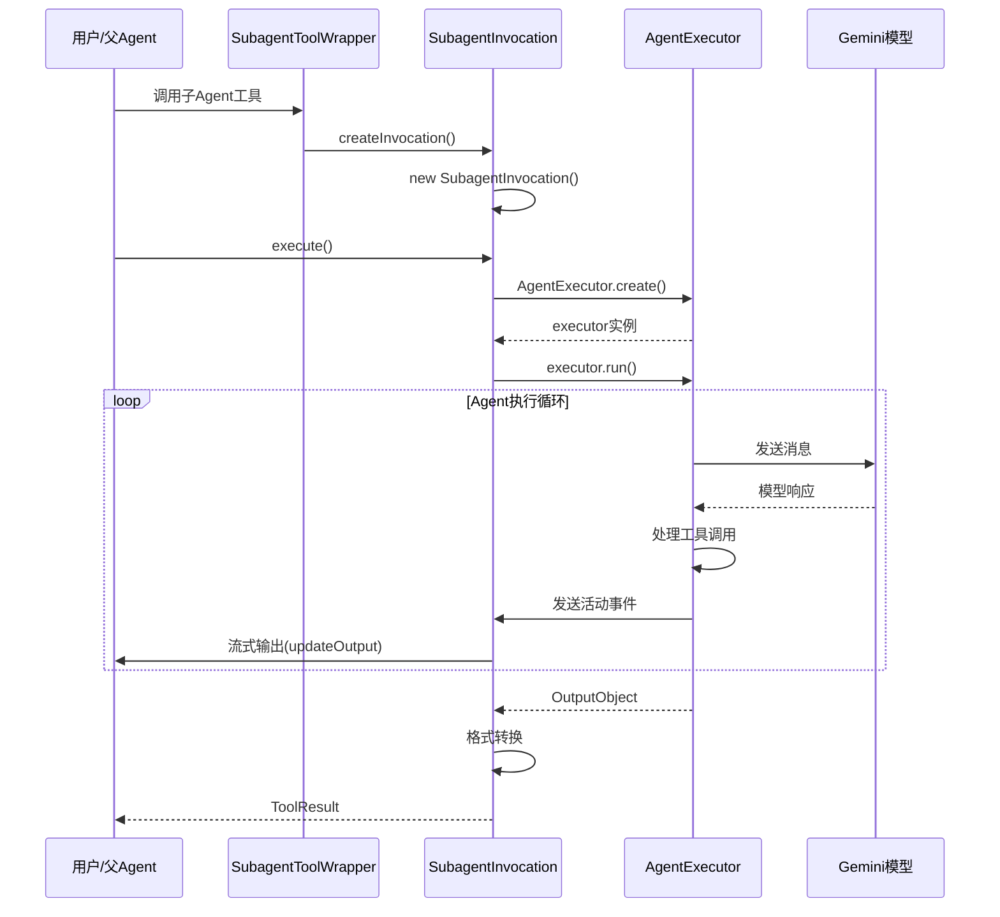

# SubagentInvocation 设计分析：工具系统与Agent系统的桥梁

## 概述

`SubagentInvocation` 是 Gemini CLI
Agent 系统中一个关键的适配器类，它的存在解决了一个核心架构问题：**如何将 Agent（智能代理）无缝集成到现有的工具系统中**。

## 核心设计问题

### 1. 架构层次差异

Gemini CLI 有两个不同的执行层次：



**问题**：Agent 系统有自己的执行模型，而工具系统有标准化的 `ToolInvocation`
接口，两者需要统一。

### 2. 职责分离原则

```typescript
// AgentExecutor: 专注于Agent的核心执行逻辑
class AgentExecutor {
  // 纯粹的Agent执行，不关心工具系统的细节
  async run(inputs: AgentInputs, signal: AbortSignal): Promise<OutputObject>;
}

// SubagentInvocation: 专注于工具系统集成
class SubagentInvocation extends BaseToolInvocation {
  // 将Agent包装成工具调用，处理工具系统的协议
  async execute(
    signal: AbortSignal,
    updateOutput?: Function,
  ): Promise<ToolResult>;
}
```

## SubagentInvocation 的设计意义

### 1. 适配器模式的完美实现

`SubagentInvocation` 实现了经典的适配器模式，将两个不兼容的接口进行适配：

```typescript
// 目标接口：工具系统期望的接口
interface ToolInvocation<TParams, TResult> {
  execute(signal: AbortSignal, updateOutput?: Function): Promise<TResult>;
  getDescription(): string;
  // ... 其他工具方法
}

// 被适配者：Agent执行器
class AgentExecutor {
  async run(inputs: AgentInputs, signal: AbortSignal): Promise<OutputObject>;
  // ... Agent特有的方法
}

// 适配器：连接两者
class SubagentInvocation extends BaseToolInvocation {
  async execute(
    signal: AbortSignal,
    updateOutput?: Function,
  ): Promise<ToolResult> {
    // 1. 创建AgentExecutor
    const executor = await AgentExecutor.create(
      this.definition,
      this.config,
      onActivity,
    );

    // 2. 调用Agent的run方法
    const output = await executor.run(this.params, signal);

    // 3. 将Agent的OutputObject转换为工具系统的ToolResult
    return this.convertToToolResult(output);
  }
}
```

### 2. 数据格式转换

Agent 系统和工具系统有不同的数据格式：

```typescript
// Agent系统的输出格式
interface OutputObject {
  result: string;
  terminate_reason: AgentTerminateMode;
}

// 工具系统的输出格式
interface ToolResult {
  llmContent: PartListUnion;
  returnDisplay: string;
  error?: ToolError;
}
```

`SubagentInvocation` 负责这种格式转换：

```typescript
// 在 execute 方法中的转换逻辑
const output = await executor.run(this.params, signal);

// 转换为工具系统格式
return {
  llmContent: [
    {
      text: `Subagent '${this.definition.name}' finished.\nResult:\n${output.result}`,
    },
  ],
  returnDisplay: `Subagent ${this.definition.name} Finished\nResult:\n${output.result}`,
};
```

### 3. 流式输出桥接

Agent 系统使用事件回调进行流式输出，工具系统使用 `updateOutput` 回调：

```typescript
// Agent系统的事件模型
type ActivityCallback = (activity: SubagentActivityEvent) => void;

// 工具系统的输出模型
type UpdateOutputCallback = (output: string | AnsiOutput) => void;

// SubagentInvocation 进行桥接
const onActivity = (activity: SubagentActivityEvent): void => {
  if (!updateOutput) return;

  if (
    activity.type === 'THOUGHT_CHUNK' &&
    typeof activity.data['text'] === 'string'
  ) {
    updateOutput(`🤖💭 ${activity.data['text']}`); // 转换格式并调用工具回调
  }
};
```

## 与 AgentExecutor 的关系和区别

### 1. 职责分工

| 组件                 | 主要职责          | 关注点                       |
| -------------------- | ----------------- | ---------------------------- |
| `AgentExecutor`      | Agent核心执行逻辑 | 对话循环、工具调用、状态管理 |
| `SubagentInvocation` | 工具系统集成      | 接口适配、格式转换、流式输出 |

### 2. 生命周期关系



### 3. 代码层次结构

```typescript
// 层次1: 工具系统基类
abstract class BaseToolInvocation<TParams, TResult> {
  abstract execute(
    signal: AbortSignal,
    updateOutput?: Function,
  ): Promise<TResult>;
}

// 层次2: Agent适配器
class SubagentInvocation<TOutput> extends BaseToolInvocation<
  AgentInputs,
  ToolResult
> {
  private readonly definition: AgentDefinition<TOutput>;

  async execute(
    signal: AbortSignal,
    updateOutput?: Function,
  ): Promise<ToolResult> {
    // 创建并使用 AgentExecutor
    const executor = await AgentExecutor.create(
      this.definition,
      this.config,
      onActivity,
    );
    const output = await executor.run(this.params, signal);
    return this.formatResult(output);
  }
}

// 层次3: Agent核心执行器
class AgentExecutor<TOutput> {
  async run(inputs: AgentInputs, signal: AbortSignal): Promise<OutputObject> {
    // 纯粹的Agent执行逻辑
  }
}
```

## 为什么这样设计？

### 1. 单一职责原则 (SRP)

```typescript
// ❌ 如果没有分离，AgentExecutor会变得臃肿
class AgentExecutor {
  // Agent核心逻辑
  async run() {
    /* ... */
  }

  // 工具系统集成（违反SRP）
  async execute() {
    /* ... */
  }
  getDescription() {
    /* ... */
  }
  toolLocations() {
    /* ... */
  }

  // 格式转换（违反SRP）
  formatForToolSystem() {
    /* ... */
  }
}

// ✅ 分离后各自专注自己的职责
class AgentExecutor {
  async run() {
    /* 纯粹的Agent逻辑 */
  }
}

class SubagentInvocation {
  async execute() {
    /* 工具系统集成 */
  }
  getDescription() {
    /* 工具描述 */
  }
}
```

### 2. 开闭原则 (OCP)

这种设计使得系统对扩展开放，对修改关闭：

```typescript
// 可以轻松添加新的工具系统适配器
class WebAgentInvocation extends BaseToolInvocation {
  // 适配Web环境的Agent调用
}

class MobileAgentInvocation extends BaseToolInvocation {
  // 适配移动端的Agent调用
}

// AgentExecutor 无需修改
```

### 3. 依赖倒置原则 (DIP)

```typescript
// 高层模块（工具系统）不依赖低层模块（具体Agent实现）
// 都依赖抽象（ToolInvocation接口）

interface ToolInvocation<TParams, TResult> {
  execute(): Promise<TResult>;
}

// 工具系统只知道接口，不知道具体实现
class ToolExecutor {
  async executetool(invocation: ToolInvocation<any, any>) {
    return await invocation.execute();
  }
}
```

### 4. 接口隔离原则 (ISP)

```typescript
// Agent系统只需要关心Agent相关的接口
interface AgentExecutionInterface {
  run(inputs: AgentInputs, signal: AbortSignal): Promise<OutputObject>;
}

// 工具系统只需要关心工具相关的接口
interface ToolInvocationInterface {
  execute(signal: AbortSignal): Promise<ToolResult>;
  getDescription(): string;
}

// SubagentInvocation 实现工具接口，内部使用Agent接口
```

## 实际运行示例

### 1. 完整的调用链

```typescript
// 1. 用户调用子Agent
const result = await parentAgent.callTool('codebase_investigator', {
  objective: 'Find authentication bugs',
});

// 2. 工具系统创建调用实例
const wrapper = new SubagentToolWrapper(definition, config);
const invocation = wrapper.createInvocation(params);

// 3. 执行调用
const toolResult = await invocation.execute(signal, (output) => {
  console.log('实时输出:', output);
});

// 4. 内部流程
class SubagentInvocation {
  async execute(signal, updateOutput) {
    // 创建Agent执行器
    const executor = await AgentExecutor.create(
      this.definition,
      this.config,
      (activity) => {
        // 将Agent事件转换为工具输出
        if (activity.type === 'THOUGHT_CHUNK') {
          updateOutput(`🤖💭 ${activity.data.text}`);
        }
      },
    );

    // 运行Agent
    const agentOutput = await executor.run(this.params, signal);

    // 转换为工具结果
    return {
      llmContent: [{ text: agentOutput.result }],
      returnDisplay: agentOutput.result,
    };
  }
}
```

### 2. 错误处理的适配

```typescript
class SubagentInvocation {
  async execute(signal, updateOutput) {
    try {
      const executor = await AgentExecutor.create(/*...*/);
      const output = await executor.run(this.params, signal);
      return this.formatSuccessResult(output);
    } catch (error) {
      // 将Agent异常转换为工具系统的错误格式
      return {
        llmContent: `Subagent '${this.definition.name}' failed. Error: ${error.message}`,
        returnDisplay: `Subagent Failed: ${this.definition.name}\nError: ${error.message}`,
        error: {
          message: error.message,
          type: ToolErrorType.EXECUTION_FAILED,
        },
      };
    }
  }
}
```

## 总结

`SubagentInvocation` 的设计体现了优秀的软件架构原则：

### 🎯 **核心价值**

1. **架构解耦**: 将Agent系统与工具系统完全解耦
2. **职责清晰**: 每个类都有明确的单一职责
3. **易于扩展**: 可以轻松添加新的适配器
4. **类型安全**: 保持强类型检查
5. **错误隔离**: 不同层次的错误得到适当处理

### 🏗️ **设计模式应用**

- **适配器模式**: 适配不同的接口
- **桥接模式**: 连接Agent事件和工具输出
- **模板方法模式**: 继承BaseToolInvocation的执行框架

### 🚀 **实际效果**

- Agent可以像普通工具一样被调用
- 保持了Agent系统的独立性和完整性
- 提供了统一的工具调用体验
- 支持流式输出和实时反馈

这种设计让 Gemini
CLI 能够将强大的Agent能力无缝集成到现有的工具生态系统中，是一个非常优雅的架构解决方案。
