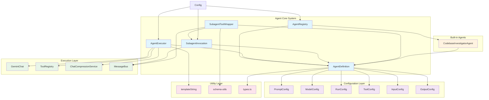
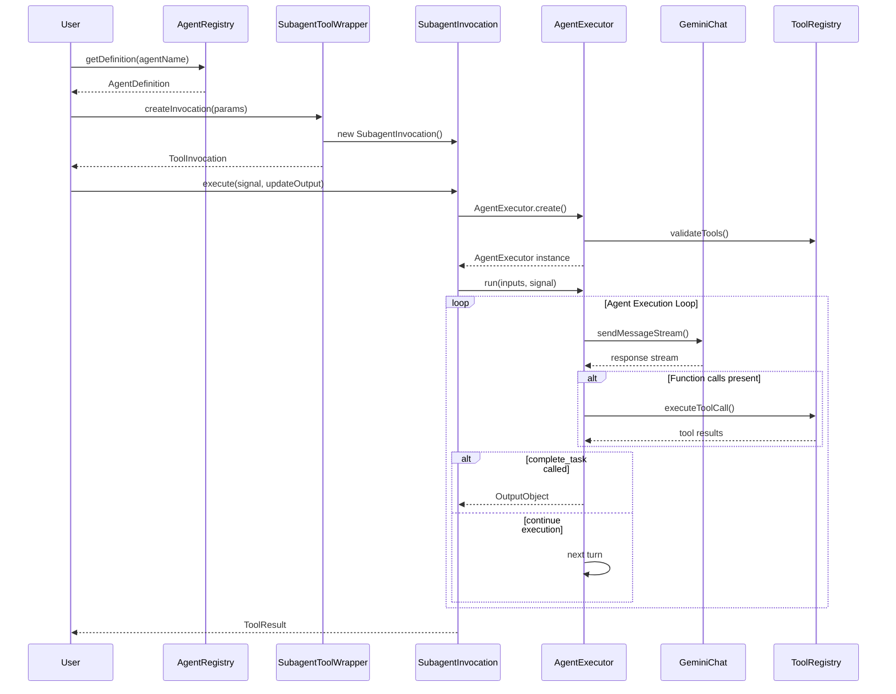
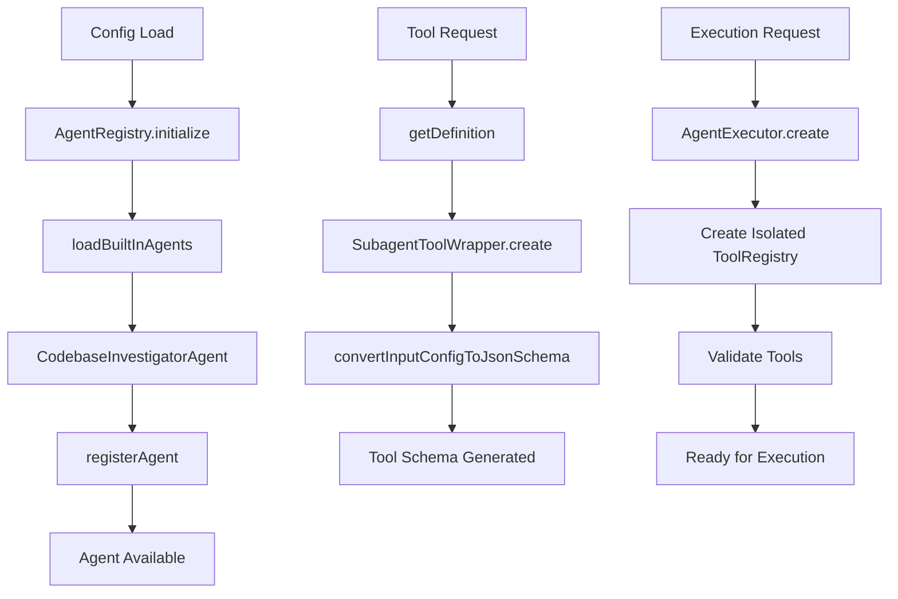

# Agent架构系统分析

## 目录

- [宏观概述](#宏观概述)
- [架构图](#架构图)
- [类继承关系图](#类继承关系图)
- [核心模块详解](#核心模块详解)
- [设计模式与原则](#设计模式与原则)
- [数据流分析](#数据流分析)

## 宏观概述

Gemini
CLI的Agent系统是一个完整的智能代理执行框架，采用了现代软件工程的设计原则，实现了高度模块化、可扩展的智能代理架构。该系统主要解决以下核心问题：

### 核心功能

1. **智能代理定义与管理** - 通过AgentDefinition接口统一定义代理能力
2. **代理执行引擎** - AgentExecutor提供完整的代理生命周期管理
3. **工具集成** - 将代理包装为标准工具，实现无缝集成
4. **注册与发现** - AgentRegistry提供代理的注册、发现和管理
5. **类型安全** - 全面的TypeScript类型系统保证运行时安全

### 设计哲学

- **组合优于继承** - 通过接口组合实现功能扩展
- **依赖注入** - 通过构造函数注入实现松耦合
- **事件驱动** - 通过回调机制实现异步通信
- **类型安全** - 泛型系统保证编译时类型检查

## 架构图



## 类继承关系图

```mermaid
classDiagram
    %% Core interfaces and types
    class AgentDefinition~TOutput~ {
        +string name
        +string displayName?
        +string description
        +PromptConfig promptConfig
        +ModelConfig modelConfig
        +RunConfig runConfig
        +ToolConfig? toolConfig
        +OutputConfig~TOutput~? outputConfig
        +InputConfig inputConfig
        +processOutput?(output) string
    }

    %% Configuration interfaces
    class PromptConfig {
        +string? systemPrompt
        +Content[]? initialMessages
        +string? query
    }

    class ModelConfig {
        +string model
        +number temp
        +number top_p
        +number? thinkingBudget
    }

    class RunConfig {
        +number max_time_minutes
        +number? max_turns
    }

    class ToolConfig {
        +Array tools
    }

    class InputConfig {
        +Record inputs
    }

    class OutputConfig~T~ {
        +string outputName
        +string description
        +T schema
    }

    %% Core classes
    class AgentRegistry {
        -Map~string, AgentDefinition~ agents
        -Config config
        +initialize() Promise~void~
        +registerAgent(definition) void
        +getDefinition(name) AgentDefinition?
        +getAllDefinitions() AgentDefinition[]
        -loadBuiltInAgents() void
    }

    class AgentExecutor~TOutput~ {
        +AgentDefinition~TOutput~ definition
        -string agentId
        -ToolRegistry toolRegistry
        -Config runtimeContext
        -ActivityCallback? onActivity
        -ChatCompressionService compressionService
        +create(definition, config, onActivity?) Promise~AgentExecutor~
        +run(inputs, signal) Promise~OutputObject~
        -executeTurn() Promise~AgentTurnResult~
        -callModel() Promise~object~
        -processFunctionCalls() Promise~object~
        -createChatObject() Promise~GeminiChat~
    }

    class SubagentInvocation~TOutput~ {
        -AgentDefinition~TOutput~ definition
        -Config config
        +getDescription() string
        +execute(signal, updateOutput?) Promise~ToolResult~
    }

    class SubagentToolWrapper {
        -AgentDefinition definition
        -Config config
        +createInvocation(params) ToolInvocation
    }

    %% Tool system integration
    class BaseToolInvocation~TParams, TResult~ {
        <<abstract>>
        +execute(signal, updateOutput?) Promise~TResult~
        +getDescription() string
    }

    class BaseDeclarativeTool~TParams, TResult~ {
        <<abstract>>
        +createInvocation(params) ToolInvocation~TParams, TResult~
    }

    %% Built-in agents
    class CodebaseInvestigatorAgent {
        <<const>>
        +name "codebase_investigator"
        +description string
        +inputConfig InputConfig
        +outputConfig OutputConfig
        +modelConfig ModelConfig
        +runConfig RunConfig
        +toolConfig ToolConfig
        +promptConfig PromptConfig
    }

    %% Enums and types
    class AgentTerminateMode {
        <<enumeration>>
        ERROR
        TIMEOUT
        GOAL
        MAX_TURNS
        ABORTED
        ERROR_NO_COMPLETE_TASK_CALL
    }

    class OutputObject {
        +string result
        +AgentTerminateMode terminate_reason
    }

    class SubagentActivityEvent {
        +boolean isSubagentActivityEvent
        +string agentName
        +string type
        +Record~string, unknown~ data
    }

    %% Relationships
    AgentDefinition --> PromptConfig
    AgentDefinition --> ModelConfig
    AgentDefinition --> RunConfig
    AgentDefinition --> ToolConfig
    AgentDefinition --> InputConfig
    AgentDefinition --> OutputConfig

    AgentRegistry --> AgentDefinition
    AgentExecutor --> AgentDefinition
    SubagentInvocation --> AgentDefinition
    SubagentToolWrapper --> AgentDefinition

    SubagentInvocation --|> BaseToolInvocation
    SubagentToolWrapper --|> BaseDeclarativeTool
    SubagentToolWrapper --> SubagentInvocation

    AgentExecutor --> OutputObject
    AgentExecutor --> SubagentActivityEvent

    CodebaseInvestigatorAgent ..|> AgentDefinition

    %% Type parameters
    AgentDefinition : ~TOutput extends z.ZodTypeAny~
    AgentExecutor : ~TOutput extends z.ZodTypeAny~
    SubagentInvocation : ~TOutput extends z.ZodTypeAny~
    OutputConfig : ~T extends z.ZodTypeAny~
```



## 核心模块详解

### 1. AgentDefinition (types.ts)

**作用**: 智能代理的完整配置接口，定义了代理的所有属性和行为

**核心特性**:

- 泛型设计支持强类型输出验证
- 模块化配置结构，每个方面独立配置
- 支持自定义输出处理函数

**关键字段**:

```typescript
interface AgentDefinition<TOutput extends z.ZodTypeAny = z.ZodUnknown> {
  name: string; // 唯一标识符
  description: string; // 代理功能描述
  promptConfig: PromptConfig; // 提示词配置
  modelConfig: ModelConfig; // 模型参数配置
  runConfig: RunConfig; // 运行时配置
  toolConfig?: ToolConfig; // 工具配置
  outputConfig?: OutputConfig<TOutput>; // 输出配置
  inputConfig: InputConfig; // 输入参数配置
  processOutput?: (output: z.infer<TOutput>) => string; // 输出处理器
}
```

### 2. AgentRegistry (registry.ts)

**作用**: 代理注册中心，负责代理的生命周期管理

**核心功能**:

- 代理发现与加载
- 配置验证与合并
- 内置代理管理
- 运行时代理查找

**设计模式**: 注册表模式 + 单例模式

### 3. AgentExecutor (executor.ts)

**作用**: 代理执行引擎，核心的代理运行时环境

**核心特性**:

- 完整的代理生命周期管理
- 工具调用编排与执行
- 异常处理与恢复机制
- 流式输出与活动事件
- 聊天压缩与内存管理

**执行流程**:

1. **初始化阶段**: 创建隔离的工具注册表，验证工具安全性
2. **运行阶段**: 循环执行turn，处理模型响应和工具调用
3. **终止阶段**: 处理各种终止条件，尝试优雅恢复
4. **清理阶段**: 释放资源，记录遥测数据

### 4. SubagentInvocation (invocation.ts)

**作用**: 代理调用的具体实现，继承自BaseToolInvocation

**职责**:

- 封装代理执行逻辑
- 提供流式输出接口
- 处理执行结果格式化
- 异常处理与错误报告

### 5. SubagentToolWrapper (subagent-tool-wrapper.ts)

**作用**: 将代理包装为标准工具，实现工具系统集成

**设计模式**: 适配器模式 **核心功能**:

- 动态生成工具schema
- 参数验证与转换
- 创建调用实例

### 6. CodebaseInvestigatorAgent (codebase-investigator.ts)

**作用**: 内置的代码库分析代理

**特色功能**:

- 结构化输出 (使用Zod schema)
- 专门的代码分析工具集
- 详细的调查报告格式

## 设计模式与原则

### 1. 策略模式 (Strategy Pattern)

- **应用**: AgentDefinition中的processOutput函数
- **优势**: 允许不同代理有不同的输出处理策略

### 2. 工厂模式 (Factory Pattern)

- **应用**: AgentExecutor.create()静态方法
- **优势**: 封装复杂的创建逻辑，确保对象正确初始化

### 3. 观察者模式 (Observer Pattern)

- **应用**: ActivityCallback机制
- **优势**: 解耦执行器与UI层，支持实时状态更新

### 4. 适配器模式 (Adapter Pattern)

- **应用**: SubagentToolWrapper
- **优势**: 将代理适配为工具系统接口

### 5. 注册表模式 (Registry Pattern)

- **应用**: AgentRegistry
- **优势**: 集中管理代理，支持动态注册与发现

### 6. 模板方法模式 (Template Method Pattern)

- **应用**: BaseToolInvocation的继承结构
- **优势**: 定义执行骨架，子类实现具体细节

## 数据流分析

### 代理执行数据流



### 配置与初始化流程



这个架构设计体现了现代软件工程的最佳实践，通过清晰的职责分离、强类型系统和灵活的配置机制，构建了一个健壮、可扩展的智能代理执行平台。
