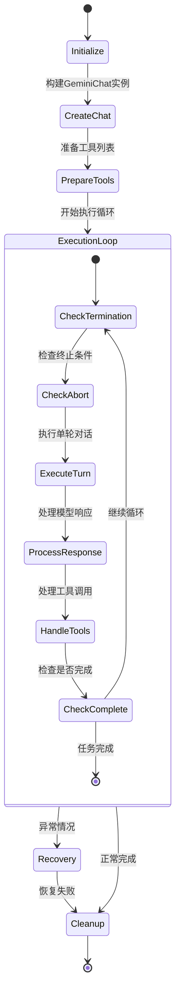

# Agent系统详细技术分析

## 目录

- [核心类型系统](#核心类型系统)
- [执行引擎深度解析](#执行引擎深度解析)
- [工具集成机制](#工具集成机制)
- [内存管理与优化](#内存管理与优化)
- [错误处理与恢复](#错误处理与恢复)
- [安全性分析](#安全性分析)
- [性能优化策略](#性能优化策略)
- [扩展性设计](#扩展性设计)

## 核心类型系统

### 1. 类型安全架构

Agent系统采用了严格的TypeScript类型系统，通过泛型和约束确保编译时和运行时的类型安全：

```typescript
// 核心泛型约束
interface AgentDefinition<TOutput extends z.ZodTypeAny = z.ZodUnknown>

// 类型推导示例
type InferredOutput = z.infer<typeof CodebaseInvestigationReportSchema>
// 结果: { SummaryOfFindings: string; ExplorationTrace: string[]; RelevantLocations: {...}[] }
```

**设计优势**:

- **编译时验证**: 防止类型不匹配的运行时错误
- **智能提示**: IDE能够提供精确的代码补全
- **重构安全**: 类型变更会在编译时被捕获

### 2. 配置类型层次结构

```typescript
// 输入配置类型映射
type InputTypeMapping = {
  string: string;
  number: number;
  boolean: boolean;
  integer: number;
  'string[]': string[];
  'number[]': number[];
};

// 运行时类型验证
const validateInputType = (
  value: unknown,
  type: keyof InputTypeMapping,
): boolean => {
  // 实现运行时类型检查逻辑
};
```

### 3. 事件类型系统

```typescript
// 活动事件类型定义
interface SubagentActivityEvent {
  isSubagentActivityEvent: true; // 类型标记
  agentName: string;
  type: 'TOOL_CALL_START' | 'TOOL_CALL_END' | 'THOUGHT_CHUNK' | 'ERROR';
  data: Record<string, unknown>;
}

// 类型守卫函数
function isSubagentActivityEvent(
  event: unknown,
): event is SubagentActivityEvent {
  return (
    typeof event === 'object' &&
    event !== null &&
    'isSubagentActivityEvent' in event
  );
}
```

## 执行引擎深度解析

### 1. AgentExecutor生命周期管理

#### 创建阶段 (AgentExecutor.create)

```typescript
static async create<TOutput extends z.ZodTypeAny>(
  definition: AgentDefinition<TOutput>,
  runtimeContext: Config,
  onActivity?: ActivityCallback,
): Promise<AgentExecutor<TOutput>>
```

**关键步骤**:

1. **工具注册表隔离**: 为每个代理实例创建独立的工具环境
2. **工具安全验证**: 确保所有工具都在白名单内
3. **依赖注入**: 注入配置、工具注册表和回调函数

#### 执行阶段 (run方法)

```typescript
async run(inputs: AgentInputs, signal: AbortSignal): Promise<OutputObject>
```

**执行流程详解**:



### 2. 单轮执行详解 (executeTurn)

```typescript
private async executeTurn(
  chat: GeminiChat,
  currentMessage: Content,
  tools: FunctionDeclaration[],
  turnCounter: number,
  combinedSignal: AbortSignal,
  timeoutSignal: AbortSignal,
): Promise<AgentTurnResult>
```

**核心步骤**:

1. **聊天压缩**: 智能管理对话历史长度

```typescript
await this.tryCompressChat(chat, promptId);
```

2. **模型调用**: 流式处理模型响应

```typescript
const { functionCalls } = await promptIdContext.run(promptId, async () =>
  this.callModel(chat, currentMessage, tools, combinedSignal, promptId),
);
```

3. **工具执行**: 并行处理多个工具调用

```typescript
const toolExecutionPromises: Array<Promise<Part[] | void>> = [];
// 并行执行所有工具调用
const asyncResults = await Promise.all(toolExecutionPromises);
```

### 3. 思维链处理

Agent系统支持模型的"思维"输出，通过parseThought函数提取：

```typescript
const { subject } = parseThought(parts?.find((p) => p.thought)?.text || '');
if (subject) {
  this.emitActivity('THOUGHT_CHUNK', { text: subject });
}
```

这允许用户实时看到代理的思考过程，增强了可解释性。

## 工具集成机制

### 1. 工具安全白名单

```typescript
private static async validateTools(
  toolRegistry: ToolRegistry,
  agentName: string,
): Promise<void> {
  const allowlist = new Set([
    LS_TOOL_NAME,
    READ_FILE_TOOL_NAME,
    GREP_TOOL_NAME,
    GLOB_TOOL_NAME,
    READ_MANY_FILES_TOOL_NAME,
    MEMORY_TOOL_NAME,
    WEB_SEARCH_TOOL_NAME,
  ]);
  // 验证逻辑...
}
```

**安全原则**:

- **最小权限**: 只允许必要的工具
- **非交互式**: 禁止需要用户确认的工具
- **只读操作**: 优先使用只读工具

### 2. 动态工具Schema生成

SubagentToolWrapper通过schema-utils动态生成工具的JSON Schema：

```typescript
const parameterSchema = convertInputConfigToJsonSchema(definition.inputConfig);
```

**转换规则**:

```typescript
// InputConfig -> JSON Schema 映射
'string' -> { type: 'string' }
'number' -> { type: 'number' }
'string[]' -> { type: 'array', items: { type: 'string' } }
```

### 3. 完成工具注入

系统自动为每个代理注入`complete_task`工具：

```typescript
const completeTool: FunctionDeclaration = {
  name: TASK_COMPLETE_TOOL_NAME,
  description: outputConfig
    ? 'Call this tool to submit your final answer and complete the task.'
    : 'Call this tool to signal that you have completed your task.',
  parameters: {
    type: Type.OBJECT,
    properties: {},
    required: [],
  },
};
```

## 内存管理与优化

### 1. 聊天压缩服务

ChatCompressionService负责管理对话历史的长度：

```typescript
const { newHistory, info } = await this.compressionService.compress(
  chat,
  prompt_id,
  false,
  model,
  this.runtimeContext,
  this.hasFailedCompressionAttempt,
);
```

**压缩策略**:

- **令牌计数**: 监控对话长度
- **重要性评估**: 保留关键信息
- **失败恢复**: 压缩失败时的回退机制

### 2. 内存泄漏防护

```typescript
// 超时控制
const timeoutController = new AbortController();
const timeoutId = setTimeout(
  () => timeoutController.abort(new Error('Agent timed out.')),
  max_time_minutes * 60 * 1000,
);

// 清理资源
finally {
  clearTimeout(timeoutId);
  // 其他清理操作...
}
```

## 错误处理与恢复

### 1. 多层次错误处理

```typescript
// 1. 信号级别的取消
if (combinedSignal.aborted) {
  const terminateReason = timeoutSignal.aborted
    ? AgentTerminateMode.TIMEOUT
    : AgentTerminateMode.ABORTED;
  return { status: 'stop', terminateReason, finalResult: null };
}

// 2. 协议违规检测
if (functionCalls.length === 0) {
  this.emitActivity('ERROR', {
    error: `Agent stopped calling tools but did not call '${TASK_COMPLETE_TOOL_NAME}'`,
    context: 'protocol_violation',
  });
  return {
    status: 'stop',
    terminateReason: AgentTerminateMode.ERROR_NO_COMPLETE_TASK_CALL,
    finalResult: null,
  };
}
```

### 2. 优雅恢复机制

```typescript
private async executeFinalWarningTurn(
  chat: GeminiChat,
  tools: FunctionDeclaration[],
  turnCounter: number,
  reason: AgentTerminateMode,
  externalSignal: AbortSignal,
): Promise<string | null>
```

**恢复策略**:

- **宽限期**: 给代理最后一次完成任务的机会
- **明确指导**: 提供清晰的完成指令
- **时间限制**: 防止恢复过程无限延长

### 3. 错误分类与处理

```typescript
enum AgentTerminateMode {
  ERROR = 'ERROR', // 一般错误
  TIMEOUT = 'TIMEOUT', // 超时
  GOAL = 'GOAL', // 成功完成
  MAX_TURNS = 'MAX_TURNS', // 达到最大轮数
  ABORTED = 'ABORTED', // 用户取消
  ERROR_NO_COMPLETE_TASK_CALL = 'ERROR_NO_COMPLETE_TASK_CALL', // 协议违规
}
```

## 安全性分析

### 1. 输入验证

```typescript
// 参数验证
if (!definition.name || !definition.description) {
  debugLogger.warn(
    `[AgentRegistry] Skipping invalid agent definition. Missing name or description.`,
  );
  return;
}

// 输出验证
const validationResult = outputConfig.schema.safeParse(outputValue);
if (!validationResult.success) {
  taskCompleted = false;
  const error = `Output validation failed: ${JSON.stringify(validationResult.error.flatten())}`;
  // 处理验证失败...
}
```

### 2. 工具权限控制

```typescript
// 工具授权检查
if (!allowedToolNames.has(functionCall.name as string)) {
  const error = `Unauthorized tool call: '${functionCall.name}' is not available to this agent.`;
  // 拒绝执行未授权工具...
}
```

### 3. 资源隔离

每个代理实例都有独立的：

- 工具注册表
- 聊天会话
- 配置上下文
- 信号控制器

## 性能优化策略

### 1. 并行工具执行

```typescript
// 创建工具执行Promise数组
const toolExecutionPromises: Array<Promise<Part[] | void>> = [];

for (const [index, functionCall] of functionCalls.entries()) {
  const executionPromise = (async () => {
    // 异步执行工具调用
    const { response: toolResponse } = await executeToolCall(/*...*/);
    return toolResponse.responseParts;
  })();

  toolExecutionPromises.push(executionPromise);
}

// 等待所有工具执行完成
const asyncResults = await Promise.all(toolExecutionPromises);
```

### 2. 流式输出

```typescript
// 实时输出思维过程
if (subject) {
  this.emitActivity('THOUGHT_CHUNK', { text: subject });
}

// 工具执行状态更新
this.emitActivity('TOOL_CALL_START', {
  name: functionCall.name,
  args,
});
```

### 3. 智能压缩

```typescript
// 基于失败历史调整压缩策略
const { newHistory, info } = await this.compressionService.compress(
  chat,
  prompt_id,
  false,
  model,
  this.runtimeContext,
  this.hasFailedCompressionAttempt, // 历史失败标记
);
```

## 扩展性设计

### 1. 插件化架构

```typescript
// 代理定义可以完全外部化
export const CustomAgent: AgentDefinition = {
  name: 'custom_agent',
  description: '自定义代理功能',
  // 完整配置...
};

// 注册自定义代理
registry.registerAgent(CustomAgent);
```

### 2. 配置驱动

所有代理行为都通过配置控制：

- **模型参数**: 温度、top_p、思维预算
- **运行限制**: 时间、轮数限制
- **工具集合**: 可用工具列表
- **输入输出**: 参数和结果格式

### 3. 事件系统

```typescript
// 可扩展的事件类型
type ActivityEventType =
  | 'TOOL_CALL_START'
  | 'TOOL_CALL_END'
  | 'THOUGHT_CHUNK'
  | 'ERROR'
  | 'CUSTOM_EVENT'; // 可扩展

// 事件处理器
const onActivity = (activity: SubagentActivityEvent): void => {
  switch (activity.type) {
    case 'CUSTOM_EVENT':
      // 处理自定义事件
      break;
  }
};
```

### 4. 模型无关性

```typescript
// 模型配置抽象
interface ModelConfig {
  model: string; // 模型标识符
  temp: number; // 通用参数
  top_p: number; // 通用参数
  thinkingBudget?: number; // 特定功能
}
```

系统设计为模型无关，可以轻松适配不同的语言模型。

## 总结

Gemini CLI的Agent系统展现了现代AI应用开发的最佳实践：

1. **类型安全**: 全面的TypeScript类型系统
2. **模块化**: 清晰的职责分离和接口设计
3. **可扩展**: 插件化架构和配置驱动
4. **健壮性**: 多层次错误处理和恢复机制
5. **性能**: 并行执行和智能优化
6. **安全性**: 严格的权限控制和输入验证

这个架构为构建复杂的AI代理系统提供了坚实的基础，既保证了当前功能的稳定性，也为未来的扩展留下了充足的空间。
