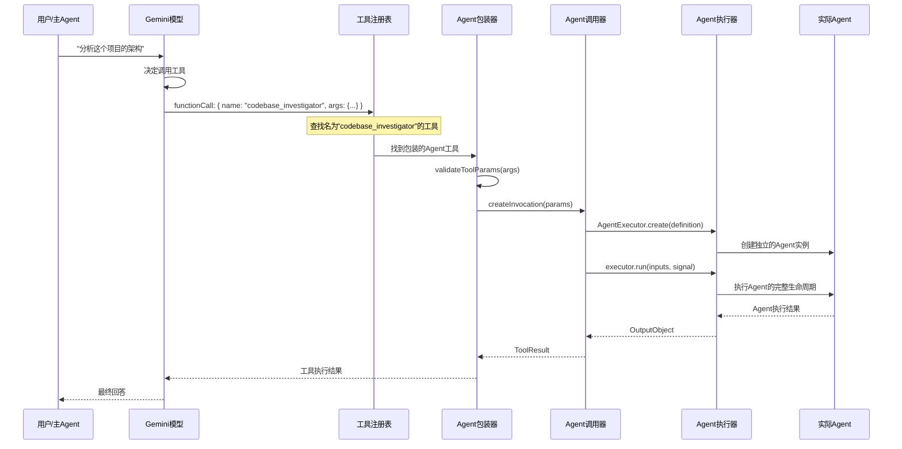

# Agent作为工具的执行机制深度分析

## 核心架构：Agent-to-Tool包装器模式

### 1. 包装器设计原理

```typescript
// SubagentToolWrapper 的核心作用
export class SubagentToolWrapper extends BaseDeclarativeTool<
  AgentInputs,
  ToolResult
> {
  constructor(
    private readonly definition: AgentDefinition, // ← Agent定义
    private readonly config: Config,
    messageBus?: MessageBus,
  ) {
    // 🔄 将Agent的inputConfig转换为Tool的JSON Schema
    const parameterSchema = convertInputConfigToJsonSchema(
      definition.inputConfig,
    );

    // 🛠️ 调用父类构造函数，将Agent伪装成Tool
    super(
      definition.name, // ← Agent名称变成Tool名称
      definition.displayName, // ← Agent显示名变成Tool显示名
      definition.description, // ← Agent描述变成Tool描述
      Kind.Think, // ← 标记为"思考型"工具
      parameterSchema, // ← Agent输入参数变成Tool参数
      /* isOutputMarkdown */ true,
      /* canUpdateOutput */ true,
      messageBus,
    );
  }
}
```

### 2. 执行流程完整链路



### 3. 关键转换点分析

#### 3.1 Agent定义 → Tool Schema转换

```typescript
// agents/schema-utils.ts
export function convertInputConfigToJsonSchema(
  inputConfig: InputConfig,
): JsonSchemaObject {
  // 🔄 将Agent的输入配置转换为JSON Schema
  // Agent定义：
  // inputConfig: {
  //   inputs: {
  //     objective: { description: '目标', type: 'string', required: true }
  //   }
  // }
  // 转换为Tool Schema：
  // {
  //   type: 'object',
  //   properties: {
  //     objective: { type: 'string', description: '目标' }
  //   },
  //   required: ['objective']
  // }
}
```

#### 3.2 Tool调用 → Agent执行转换

```typescript
// agents/invocation.ts
export class SubagentInvocation extends BaseToolInvocation {
  async execute(
    signal: AbortSignal,
    updateOutput?: (output: string) => void,
  ): Promise<ToolResult> {
    // 🎭 从Tool调用转换为Agent执行

    // 1. 创建Agent执行器
    const executor = await AgentExecutor.create(
      this.definition, // ← 使用原始Agent定义
      this.config,
      onActivity, // ← 桥接Agent事件到Tool输出
    );

    // 2. 执行Agent（完整的Agent生命周期）
    const output = await executor.run(this.params, signal);

    // 3. 将Agent结果转换为Tool结果
    return {
      llmContent: [{ text: resultContent }],
      returnDisplay: displayContent,
    };
  }
}
```

## 触发机制详解

### 1. 注册阶段：Agent → Tool

```typescript
// config/config.ts:1351
if (this.getCodebaseInvestigatorSettings().enabled) {
  const definition = this.agentRegistry.getDefinition('codebase_investigator');

  if (definition) {
    // 🔄 将Agent包装成Tool并注册
    const wrapper = new SubagentToolWrapper(definition, this);
    registry.registerTool(wrapper); // ← 现在它是一个"工具"了！
  }
}
```

**结果**：模型看到的工具列表中会有：

```json
{
  "name": "codebase_investigator",
  "description": "专门用于代码库分析、架构映射和理解系统级依赖的工具",
  "parameters": {
    "type": "object",
    "properties": {
      "objective": {
        "type": "string",
        "description": "用户最终目标的全面详细描述"
      }
    },
    "required": ["objective"]
  }
}
```

### 2. 触发阶段：模型决策

```typescript
// 模型看到用户询问："分析这个项目的架构"
// 模型决定调用工具：

const functionCall = {
  name: 'codebase_investigator', // ← 调用"工具"
  args: {
    objective: '分析这个项目的架构并找出依赖关系',
  },
};
```

### 3. 执行阶段：Tool → Agent转换

```typescript
// core/nonInteractiveToolExecutor.ts
export async function executeToolCall(
  config: Config,
  toolCallRequest: ToolCallRequestInfo, // ← name: "codebase_investigator"
  abortSignal: AbortSignal,
): Promise<CompletedToolCall> {
  // 1. 通过工具注册表查找"工具"
  const tool = registry.getTool('codebase_investigator'); // ← 实际是SubagentToolWrapper

  // 2. 构建工具调用
  const invocation = tool.build(toolCallRequest.args); // ← 创建SubagentInvocation

  // 3. 执行"工具"（实际执行Agent）
  const result = await invocation.execute(abortSignal);

  return result;
}
```

## 与普通工具的对比

### 相同点：

1. **注册方式相同**：都通过`registry.registerTool()`注册
2. **调用接口相同**：都通过`functionCall`机制触发
3. **参数验证相同**：都使用JSON Schema验证参数
4. **结果格式相同**：都返回`ToolResult`格式

### 不同点：

| 维度           | 普通工具     | Agent工具          |
| -------------- | ------------ | ------------------ |
| **执行模式**   | 直接函数调用 | 完整Agent生命周期  |
| **复杂度**     | 简单操作     | 复杂推理循环       |
| **子工具调用** | 不支持       | 支持调用其他工具   |
| **状态管理**   | 无状态       | 有状态（聊天历史） |
| **执行时间**   | 毫秒级       | 分钟级             |
| **中断处理**   | 简单         | 复杂（恢复机制）   |

### 执行对比示例：

#### 普通工具（如ReadFile）：

```typescript
class ReadFileInvocation {
  async execute(): Promise<ToolResult> {
    const content = fs.readFileSync(this.params.filePath); // ← 直接操作
    return { llmContent: content };
  }
}
```

#### Agent工具（CodebaseInvestigator）：

```typescript
class SubagentInvocation {
  async execute(): Promise<ToolResult> {
    const executor = await AgentExecutor.create(this.definition);

    // ← 启动完整的Agent执行循环
    const result = await executor.run(this.params, signal);
    // 包含：
    // - 多轮对话
    // - 工具调用链
    // - 思考过程
    // - 错误恢复
    // - 结果整合

    return { llmContent: result.result };
  }
}
```

## 设计优势

### 1. **统一接口**

- 主Agent不需要区分"工具"还是"子Agent"
- 相同的调用方式，降低复杂度

### 2. **类型安全**

- Agent参数自动转换为Tool Schema
- 编译时和运行时双重验证

### 3. **隔离执行**

- 每个Agent有独立的工具注册表
- 避免工具冲突和权限问题

### 4. **流式反馈**

- Agent的思考过程可以实时显示
- 通过`updateOutput`回调桥接事件

### 5. **错误处理**

- Agent执行错误自动转换为Tool错误
- 统一的错误处理机制

## 实际触发示例

### 用户输入：

```
"帮我分析一下这个项目的架构"
```

### 模型推理：

```
用户想要分析项目架构，我应该使用 codebase_investigator 工具
```

### 函数调用：

```json
{
  "name": "codebase_investigator",
  "args": {
    "objective": "分析这个项目的架构，包括模块结构、依赖关系和关键组件"
  }
}
```

### 执行过程：

```
1. ToolRegistry.getTool("codebase_investigator") → SubagentToolWrapper
2. SubagentToolWrapper.build(args) → SubagentInvocation
3. SubagentInvocation.execute() → AgentExecutor.run()
4. AgentExecutor 启动完整的Agent执行循环
5. Agent 使用 ls、read_file、grep 等工具分析项目
6. Agent 调用 complete_task 工具提交结果
7. 结果转换为 ToolResult 返回给主Agent
```

## 总结

**Agent被包装成Tool的核心机制**：

1. **外观模式**：Agent对外表现为Tool，但内部是完整的Agent执行引擎
2. **适配器模式**：SubagentToolWrapper适配Agent接口到Tool接口
3. **桥接模式**：SubagentInvocation桥接Tool调用到Agent执行
4. **统一调用**：主Agent通过相同的functionCall机制调用子Agent

这种设计让Agent可以像普通工具一样被调用，但实际执行时拥有完整的推理和工具使用能力！🎯
