# Agents Module Architecture Analysis

## 概述

`packages/core/src/agents`
模块是一个高度模块化的AI代理系统，提供了完整的代理定义、注册、执行和管理框架。该模块采用了现代软件工程的最佳实践，包括类型安全、依赖注入、事件驱动架构和插件化设计。

## 模块结构总览

```
packages/core/src/agents/
├── types.ts                    # 核心类型定义
├── registry.ts                 # 代理注册管理器
├── executor.ts                 # 代理执行引擎
├── invocation.ts              # 代理调用包装器
├── subagent-tool-wrapper.ts   # 子代理工具包装器
├── schema-utils.ts            # 配置到Schema转换工具
├── utils.ts                   # 模板字符串工具
├── codebase-investigator.ts   # 具体代理实现示例
└── *.test.ts                  # 对应的测试文件
```

## 接口和类继承关系图

```mermaid
classDiagram
    %% 核心接口定义
    class AgentDefinition~TOutput~ {
        <<interface>>
        +name: string
        +displayName?: string
        +description: string
        +promptConfig: PromptConfig
        +modelConfig: ModelConfig
        +runConfig: RunConfig
        +toolConfig?: ToolConfig
        +outputConfig?: OutputConfig~TOutput~
        +inputConfig: InputConfig
        +processOutput?: (output: z.infer~TOutput~) => string
    }

    %% 配置接口
    class PromptConfig {
        <<interface>>
        +systemPrompt?: string
        +initialMessages?: Content[]
        +query?: string
    }

    class ModelConfig {
        <<interface>>
        +model: string
        +temp: number
        +top_p: number
        +thinkingBudget?: number
    }

    class RunConfig {
        <<interface>>
        +max_time_minutes: number
        +max_turns?: number
    }

    class ToolConfig {
        <<interface>>
        +tools: Array~string | FunctionDeclaration | AnyDeclarativeTool~
    }

    class OutputConfig~T~ {
        <<interface>>
        +outputName: string
        +description: string
        +schema: T
    }

    class InputConfig {
        <<interface>>
        +inputs: Record~string, InputDefinition~
    }

    %% 事件和输出接口
    class SubagentActivityEvent {
        <<interface>>
        +isSubagentActivityEvent: true
        +agentName: string
        +type: EventType
        +data: Record~string, unknown~
    }

    class OutputObject {
        <<interface>>
        +result: string
        +terminate_reason: AgentTerminateMode
    }

    %% 类型别名
    class AgentInputs {
        <<type>>
        Record~string, unknown~
    }

    %% 枚举
    class AgentTerminateMode {
        <<enumeration>>
        ERROR
        TIMEOUT
        GOAL
        MAX_TURNS
        ABORTED
        ERROR_NO_COMPLETE_TASK_CALL
    }

    %% 核心类
    class AgentRegistry {
        -agents: Map~string, AgentDefinition~any~~
        -config: Config
        +constructor(config: Config)
        +initialize(): Promise~void~
        +registerAgent~TOutput~(definition: AgentDefinition~TOutput~): void
        +getDefinition(name: string): AgentDefinition | undefined
        +getAllDefinitions(): AgentDefinition[]
        -loadBuiltInAgents(): void
    }

    class AgentExecutor~TOutput~ {
        +definition: AgentDefinition~TOutput~
        -agentId: string
        -toolRegistry: ToolRegistry
        -runtimeContext: Config
        -onActivity?: ActivityCallback
        -compressionService: ChatCompressionService
        +create~TOutput~(definition, context, onActivity?): Promise~AgentExecutor~TOutput~~
        +run(inputs: AgentInputs, signal: AbortSignal): Promise~OutputObject~
        -executeTurn(...): Promise~AgentTurnResult~
        -processFunctionCalls(...): Promise~ProcessResult~
        -createChatObject(inputs: AgentInputs): Promise~GeminiChat~
        -prepareToolsList(): FunctionDeclaration[]
        -buildSystemPrompt(inputs: AgentInputs): Promise~string~
        -checkTermination(...): AgentTerminateMode | null
        -emitActivity(type, data): void
        +validateTools(registry, agentName): Promise~void~
    }

    class SubagentInvocation~TOutput~ {
        -definition: AgentDefinition~TOutput~
        -config: Config
        +constructor(params, definition, config, messageBus?)
        +getDescription(): string
        +execute(signal, updateOutput?): Promise~ToolResult~
    }

    class SubagentToolWrapper {
        -definition: AgentDefinition
        -config: Config
        +constructor(definition, config, messageBus?)
        #createInvocation(params): ToolInvocation~AgentInputs, ToolResult~
    }

    %% 外部基类 (从其他模块继承)
    class BaseToolInvocation~AgentInputs, ToolResult~ {
        <<abstract>>
        #params: AgentInputs
        #messageBus?: MessageBus
        +execute(signal, updateOutput?): Promise~ToolResult~
    }

    class BaseDeclarativeTool~AgentInputs, ToolResult~ {
        <<abstract>>
        +name: string
        +displayName: string
        +description: string
        +kind: Kind
        +schema: JsonSchemaObject
        #createInvocation(params): ToolInvocation~AgentInputs, ToolResult~
    }

    %% 工具函数
    class SchemaUtils {
        <<utility>>
        +convertInputConfigToJsonSchema(inputConfig: InputConfig): JsonSchemaObject
    }

    class TemplateUtils {
        <<utility>>
        +templateString(template: string, inputs: AgentInputs): string
    }

    %% 具体实现示例
    class CodebaseInvestigatorAgent {
        <<const AgentDefinition>>
        +name: "codebase_investigator"
        +inputConfig: InputConfig
        +outputConfig: OutputConfig~CodebaseInvestigationReportSchema~
        +toolConfig: ToolConfig
        +promptConfig: PromptConfig
        +modelConfig: ModelConfig
        +runConfig: RunConfig
    }

    %% 关系定义
    AgentDefinition --> PromptConfig : contains
    AgentDefinition --> ModelConfig : contains
    AgentDefinition --> RunConfig : contains
    AgentDefinition --> ToolConfig : contains
    AgentDefinition --> OutputConfig : contains
    AgentDefinition --> InputConfig : contains

    AgentRegistry --> AgentDefinition : manages
    AgentExecutor --> AgentDefinition : uses
    AgentExecutor --> OutputObject : returns
    AgentExecutor --> AgentTerminateMode : uses
    AgentExecutor --> SubagentActivityEvent : emits

    SubagentInvocation --|> BaseToolInvocation : extends
    SubagentInvocation --> AgentDefinition : uses
    SubagentInvocation --> AgentExecutor : creates

    SubagentToolWrapper --|> BaseDeclarativeTool : extends
    SubagentToolWrapper --> AgentDefinition : wraps
    SubagentToolWrapper --> SubagentInvocation : creates
    SubagentToolWrapper --> SchemaUtils : uses

    AgentExecutor --> TemplateUtils : uses

    CodebaseInvestigatorAgent ..|> AgentDefinition : implements

    %% 泛型关系
    note for AgentDefinition "泛型 TOutput 确保输出类型安全\n默认为 z.ZodUnknown"
    note for AgentExecutor "泛型 TOutput 与 AgentDefinition 保持一致"
    note for SubagentInvocation "泛型 TOutput 传递给 AgentExecutor"

    %% 设计模式标注
    note for AgentExecutor "工厂模式: create() 静态方法\n观察者模式: ActivityCallback"
    note for AgentRegistry "注册表模式: 集中管理代理"
    note for SubagentToolWrapper "适配器模式: 代理 -> 工具接口"
    note for SubagentInvocation "桥接模式: 事件桥接"
```



## 类型依赖关系图



## 核心架构组件

### 1. 类型系统 (types.ts)

该文件定义了整个代理系统的核心类型架构，体现了强类型设计原则：

#### 1.1 代理定义结构 (`AgentDefinition`)

```typescript
export interface AgentDefinition<TOutput extends z.ZodTypeAny = z.ZodUnknown> {
  name: string; // 唯一标识符
  displayName?: string; // 显示名称
  description: string; // 代理描述
  promptConfig: PromptConfig; // 提示配置
  modelConfig: ModelConfig; // 模型配置
  runConfig: RunConfig; // 运行配置
  toolConfig?: ToolConfig; // 工具配置
  outputConfig?: OutputConfig<TOutput>; // 输出配置
  inputConfig: InputConfig; // 输入配置
  processOutput?: (output: z.infer<TOutput>) => string; // 输出处理函数
}
```

**设计原理**：

- **泛型设计**: 使用 TypeScript 泛型 `<TOutput>` 确保输出类型安全
- **可选性原则**: 合理设计可选和必需字段，提供灵活性同时保证核心功能
- **职责分离**: 将不同关注点分离到不同的配置对象中

#### 1.2 终止模式枚举 (`AgentTerminateMode`)

```typescript
export enum AgentTerminateMode {
  ERROR = 'ERROR',
  TIMEOUT = 'TIMEOUT',
  GOAL = 'GOAL',
  MAX_TURNS = 'MAX_TURNS',
  ABORTED = 'ABORTED',
  ERROR_NO_COMPLETE_TASK_CALL = 'ERROR_NO_COMPLETE_TASK_CALL',
}
```

**设计原理**：

- **穷举性**: 明确定义所有可能的终止状态
- **可追踪性**: 便于调试和监控代理执行状态

#### 1.3 子代理活动事件 (`SubagentActivityEvent`)

```typescript
export interface SubagentActivityEvent {
  isSubagentActivityEvent: true; // 类型标识符
  agentName: string; // 代理名称
  type: 'TOOL_CALL_START' | 'TOOL_CALL_END' | 'THOUGHT_CHUNK' | 'ERROR';
  data: Record<string, unknown>; // 事件数据
}
```

**设计原理**：

- **类型安全标识**: 使用判别联合类型确保类型安全
- **事件驱动**: 支持实时监控代理执行过程
- **扩展性**: 通过 `data` 字段支持任意事件数据

### 2. 代理注册管理器 (registry.ts)

`AgentRegistry` 类负责代理的发现、加载、验证和注册：

```typescript
export class AgentRegistry {
  private readonly agents = new Map<string, AgentDefinition<any>>();

  constructor(private readonly config: Config) {}

  async initialize(): Promise<void> {
    this.loadBuiltInAgents();
  }

  protected registerAgent<TOutput extends z.ZodTypeAny>(
    definition: AgentDefinition<TOutput>,
  ): void {
    // 基础验证和注册逻辑
  }
}
```

**架构特点**：

#### 2.1 依赖注入模式

- 通过构造函数注入 `Config` 实例，实现配置的外部化管理
- 便于测试和不同环境下的配置切换

#### 2.2 延迟初始化

- `initialize()` 方法实现延迟加载，避免循环依赖
- 支持异步加载，为将来的动态代理加载预留空间

#### 2.3 内置代理管理

```typescript
private loadBuiltInAgents(): void {
  const investigatorSettings = this.config.getCodebaseInvestigatorSettings();

  if (investigatorSettings?.enabled) {
    const agentDef = {
      ...CodebaseInvestigatorAgent,
      // 配置合并和覆盖逻辑
    };
    this.registerAgent(agentDef);
  }
}
```

**设计优势**：

- **配置驱动**: 通过配置控制代理的启用/禁用
- **配置合并**: 支持运行时配置覆盖默认配置
- **类型安全**: 保持强类型约束

### 3. 代理执行引擎 (executor.ts)

`AgentExecutor` 是整个系统的核心执行引擎，实现了复杂的代理生命周期管理：

#### 3.1 核心架构

```typescript
export class AgentExecutor<TOutput extends z.ZodTypeAny> {
  readonly definition: AgentDefinition<TOutput>;

  static async create<TOutput extends z.ZodTypeAny>(
    definition: AgentDefinition<TOutput>,
    runtimeContext: Config,
    onActivity?: ActivityCallback,
  ): Promise<AgentExecutor<TOutput>>;

  async run(inputs: AgentInputs, signal: AbortSignal): Promise<OutputObject>;
}
```

#### 3.2 静态工厂方法模式

```typescript
static async create(): Promise<AgentExecutor<TOutput>> {
  // 创建独立的工具注册表
  const agentToolRegistry = new ToolRegistry(runtimeContext);
  const parentToolRegistry = await runtimeContext.getToolRegistry();

  // 工具验证和注册
  await AgentExecutor.validateTools(agentToolRegistry, definition.name);

  return new AgentExecutor(/* ... */);
}
```

**设计原理**：

- **工具隔离**: 每个代理实例有独立的工具注册表，避免冲突
- **安全验证**: 创建时验证所有工具的非交互性，确保子代理安全运行
- **异步初始化**: 支持异步的工具注册和验证过程

#### 3.3 生命周期管理

**执行循环 (Execution Loop)**:

```typescript
async run(inputs: AgentInputs, signal: AbortSignal): Promise<OutputObject> {
  // 1. 初始化阶段
  const chat = await this.createChatObject(inputs);
  const tools = this.prepareToolsList();

  // 2. 执行循环
  while (true) {
    const reason = this.checkTermination(startTime, turnCounter);
    if (reason) break;

    const turnResult = await this.executeTurn(/* ... */);
    if (turnResult.status === 'stop') break;
  }

  // 3. 恢复机制
  if (shouldAttemptRecovery) {
    await this.executeFinalWarningTurn(/* ... */);
  }

  // 4. 清理和日志
}
```

**关键特性**：

1. **智能终止检测**: 多维度检测终止条件（时间、轮次、目标达成等）
2. **恢复机制**: 在失败情况下提供最后机会完成任务
3. **信号传播**: 正确处理外部中断信号和内部超时
4. **压缩管理**: 自动管理聊天历史压缩，优化内存使用

#### 3.4 工具调用处理

```typescript
private async processFunctionCalls(
  functionCalls: FunctionCall[],
  signal: AbortSignal,
  promptId: string,
): Promise<{
  nextMessage: Content;
  submittedOutput: string | null;
  taskCompleted: boolean;
}> {
  // 并行处理工具调用
  const toolExecutionPromises: Array<Promise<Part[] | void>> = [];

  for (const functionCall of functionCalls) {
    if (functionCall.name === TASK_COMPLETE_TOOL_NAME) {
      // 同步处理完成工具
    } else {
      // 异步处理其他工具
      const executionPromise = executeToolCall(/* ... */);
      toolExecutionPromises.push(executionPromise);
    }
  }

  await Promise.all(toolExecutionPromises);
}
```

**设计亮点**：

- **并行执行**: 同时处理多个工具调用，提高执行效率
- **完成检测**: 特殊处理任务完成工具调用
- **错误处理**: 完善的错误处理和状态管理

### 4. 调用系统 (invocation.ts)

`SubagentInvocation` 实现了代理调用的具体执行逻辑：

```typescript
export class SubagentInvocation<
  TOutput extends z.ZodTypeAny,
> extends BaseToolInvocation<AgentInputs, ToolResult> {
  async execute(
    signal: AbortSignal,
    updateOutput?: (output: string | AnsiOutput) => void,
  ): Promise<ToolResult> {
    // 活动回调桥接
    const onActivity = (activity: SubagentActivityEvent): void => {
      if (activity.type === 'THOUGHT_CHUNK') {
        updateOutput?.(`🤖💭 ${activity.data['text']}`);
      }
    };

    const executor = await AgentExecutor.create(/* ... */);
    const output = await executor.run(this.params, signal);

    return {
      llmContent: [{ text: resultContent }],
      returnDisplay: displayContent,
    };
  }
}
```

**架构特点**：

- **桥接模式**: 将代理的内部事件桥接到工具系统的输出流
- **流式输出**: 支持实时显示代理的思考过程
- **错误封装**: 将执行错误转换为工具系统标准格式

### 5. 工具包装器 (subagent-tool-wrapper.ts)

`SubagentToolWrapper` 将代理包装为标准工具接口：

```typescript
export class SubagentToolWrapper extends BaseDeclarativeTool<
  AgentInputs,
  ToolResult
> {
  constructor(
    private readonly definition: AgentDefinition,
    private readonly config: Config,
    messageBus?: MessageBus,
  ) {
    const parameterSchema = convertInputConfigToJsonSchema(
      definition.inputConfig,
    );

    super(
      definition.name,
      definition.displayName ?? definition.name,
      definition.description,
      Kind.Think,
      parameterSchema,
      /* isOutputMarkdown */ true,
      /* canUpdateOutput */ true,
      messageBus,
    );
  }
}
```

**设计模式**：

- **适配器模式**: 将代理适配为工具系统接口
- **动态Schema生成**: 根据代理配置动态生成工具参数模式
- **统一接口**: 提供与其他工具一致的调用接口

### 6. Schema转换工具 (schema-utils.ts)

提供配置到JSON Schema的转换功能：

```typescript
export function convertInputConfigToJsonSchema(
  inputConfig: InputConfig,
): JsonSchemaObject {
  const properties: Record<string, JsonSchemaProperty> = {};
  const required: string[] = [];

  for (const [name, definition] of Object.entries(inputConfig.inputs)) {
    // 类型映射和转换逻辑
    switch (definition.type) {
      case 'string':
      case 'number':
      case 'integer':
      case 'boolean':
        schemaProperty.type = definition.type;
        break;
      case 'string[]':
        schemaProperty.type = 'array';
        schemaProperty.items = { type: 'string' };
        break;
      // ...
    }
  }
}
```

**特点**：

- **类型安全转换**: 确保配置类型正确映射到JSON Schema
- **穷举处理**: 使用TypeScript的穷举检查确保所有类型被处理
- **错误友好**: 提供详细的错误信息

### 7. 模板系统 (utils.ts)

提供字符串模板功能：

```typescript
export function templateString(template: string, inputs: AgentInputs): string {
  const placeholderRegex = /\$\{(\w+)\}/g;

  // 预验证所需键是否存在
  const requiredKeys = new Set(
    Array.from(template.matchAll(placeholderRegex), (match) => match[1]),
  );

  const missingKeys = Array.from(requiredKeys).filter(
    (key) => !inputKeys.has(key),
  );

  if (missingKeys.length > 0) {
    throw new Error(/* 详细错误信息 */);
  }

  return template.replace(placeholderRegex, (_match, key) =>
    String(inputs[key]),
  );
}
```

**设计特点**：

- **预验证**: 执行替换前验证所有必需参数
- **错误友好**: 提供缺失参数的详细信息
- **简单高效**: 使用正则表达式实现高效的模板替换

## 设计模式分析

### 1. 工厂模式 (Factory Pattern)

- `AgentExecutor.create()` 使用静态工厂方法模式
- 封装复杂的创建逻辑，包括工具验证和注册

### 2. 注册表模式 (Registry Pattern)

- `AgentRegistry` 实现代理的集中注册和管理
- 支持动态注册和配置覆盖

### 3. 策略模式 (Strategy Pattern)

- 不同的终止策略通过 `AgentTerminateMode` 枚举定义
- 恢复策略可以根据终止原因选择不同的处理方式

### 4. 观察者模式 (Observer Pattern)

- 通过 `ActivityCallback` 实现事件监听
- 支持实时监控代理执行状态

### 5. 适配器模式 (Adapter Pattern)

- `SubagentToolWrapper` 将代理适配为工具接口
- 实现不同系统间的接口统一

### 6. 模板方法模式 (Template Method Pattern)

- `BaseToolInvocation` 定义执行模板
- 子类实现具体的执行逻辑

## 核心设计原则

### 1. SOLID原则

#### 单一职责原则 (Single Responsibility Principle)

- 每个类都有明确的单一职责
- `AgentRegistry` 只负责注册管理
- `AgentExecutor` 只负责执行逻辑

#### 开闭原则 (Open/Closed Principle)

- 系统对扩展开放，对修改关闭
- 新代理通过实现 `AgentDefinition` 接口添加
- 工具系统支持插件式扩展

#### 里氏替换原则 (Liskov<!-- cspell:ignore Liskov --> Substitution Principle)

- 所有代理都可以通过统一接口调用
- 子类型可以替换父类型而不破坏程序

#### 接口隔离原则 (Interface Segregation Principle)

- 接口设计精简，避免强迫实现不需要的方法
- 配置对象按职责分离（PromptConfig, ModelConfig等）

#### 依赖倒置原则 (Dependency Inversion Principle)

- 高层模块不依赖低层模块的具体实现
- 通过接口和依赖注入实现解耦

### 2. 类型安全设计

- **泛型约束**: 使用TypeScript泛型确保类型安全
- **判别联合**: 使用判别联合类型确保事件类型安全
- **Zod验证**: 使用Zod进行运行时类型验证

### 3. 错误处理策略

- **多层错误处理**: 从工具调用到代理执行的多层错误捕获
- **恢复机制**: 提供最后机会恢复机制
- **详细错误信息**: 提供上下文丰富的错误信息

## 具体实现示例：代码库调查代理

`codebase-investigator.ts` 提供了一个完整的代理实现示例：

```typescript
export const CodebaseInvestigatorAgent: AgentDefinition<
  typeof CodebaseInvestigationReportSchema
> = {
  name: 'codebase_investigator',
  description: `专门用于代码库分析、架构映射和理解系统级依赖的工具`,

  inputConfig: {
    inputs: {
      objective: {
        description: '用户最终目标的全面详细描述',
        type: 'string',
        required: true,
      },
    },
  },

  outputConfig: {
    outputName: 'report',
    description: '最终调查报告的JSON对象',
    schema: CodebaseInvestigationReportSchema,
  },

  toolConfig: {
    tools: [LS_TOOL_NAME, READ_FILE_TOOL_NAME, GLOB_TOOL_NAME, GREP_TOOL_NAME],
  },

  promptConfig: {
    systemPrompt: `你是代码库调查员，专门进行复杂软件项目的逆向工程...`,
    query: `你的任务是深入调查代码库以找到所有相关文件...`,
  },
};
```

**实现特点**：

- **结构化输出**: 使用Zod Schema定义结构化的JSON输出
- **专门化工具**: 只使用只读工具，确保安全性
- **详细提示**: 提供详细的系统提示和查询模板
- **类型安全**: 完整的TypeScript类型约束

## 性能优化策略

### 1. 并行处理

- 工具调用的并行执行
- 异步初始化避免阻塞

### 2. 内存管理

- 聊天历史的智能压缩
- 工具注册表的隔离设计

### 3. 资源清理

- 超时控制和信号传播
- 完善的finally块清理逻辑

## 扩展性设计

### 1. 插件架构

- 代理可以作为插件动态加载
- 工具系统支持自定义工具

### 2. 配置驱动

- 运行时配置支持
- 环境特定的配置覆盖

### 3. 事件系统

- 丰富的事件回调机制
- 支持监控和调试

## 总结

`packages/core/src/agents` 模块展现了现代软件架构的优秀实践：

1. **高度模块化**: 清晰的职责分离和模块边界
2. **类型安全**: 全面的TypeScript类型约束和运行时验证
3. **可扩展性**: 插件化架构支持动态扩展
4. **健壮性**: 完善的错误处理和恢复机制
5. **性能优化**: 并行处理和智能资源管理
6. **开发者友好**: 丰富的调试信息和事件监控

该模块为构建复杂的AI代理系统提供了坚实的架构基础，既保证了系统的稳定性和性能，又提供了足够的灵活性支持各种应用场景。
