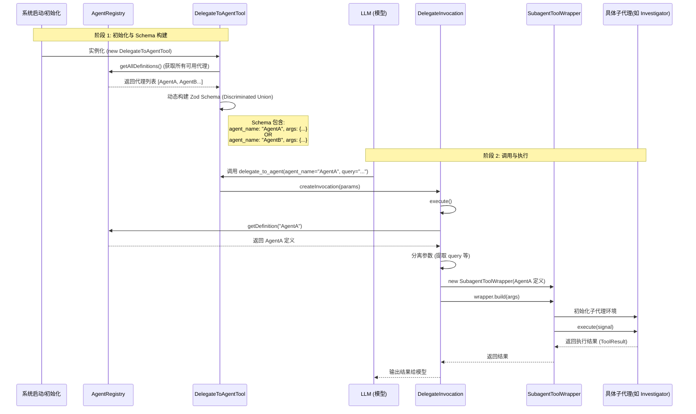

# DelegateToAgentTool 代码分析

**文件路径**: `@packages/core/src/agents/delegate-to-agent-tool.ts`

## 1. 核心功能与工作原理

这个文件定义了一个名为 `DelegateToAgentTool` 的工具。它的核心作用是充当一个
**动态路由网关**。它本身不执行具体的业务逻辑，而是将任务“分派”（Delegate）给在系统中注册的其他专门 Agent（子代理）。

**主要工作原理：**

1.  **动态架构生成 (Dynamic Schema Generation)**:
    - 在工具初始化时，它会读取 `AgentRegistry`（代理注册表）中所有可用的 Agent。
    - 它利用 `zod` 动态构建参数校验 Schema。
    - 它使用 **Discriminated Union**（带判别式的联合类型），以 `agent_name`
      作为区分键。这意味着 LLM 在调用此工具时，如果选择了某个
      `agent_name`，模型就会知道必须提供该特定 Agent 所需的特定参数（例如
      `objective`）。

2.  **统一入口 (Unified Entry Point)**:
    - LLM 不需要知道每个 Agent 具体的工具名称，只需要知道有一个通用的
      `delegate_to_agent` 工具。
    - 通过传入 `agent_name`，该工具在内部进行路由。

3.  **执行委托 (Execution Delegation)**:
    - 当工具被调用时，它剥离出 `agent_name`，将剩余的参数作为输入。
    - 它使用 `SubagentToolWrapper` 来包装并执行具体的子代理逻辑。

---

## 2. 代码结构详细分析

该文件主要包含两个类：

### A. `DelegateToAgentTool` (工具定义类)

继承自 `BaseDeclarativeTool`。负责告诉 LLM 这个工具长什么样。

- **构造函数 (`constructor`)**:
  - 遍历 `registry.getAllDefinitions()` 获取所有注册的 Agent。
  - **构建 Schema**:
    - 如果注册表为空，生成一个 fallback schema。
    - 如果不为空，遍历每个 Agent 定义，将其输入配置（`inputConfig`）转换为 Zod 对象。
    - 抛出错误检查：防止子代理参数中包含保留字 `agent_name`。
    - 使用 `z.discriminatedUnion('agent_name', ...)`
      将所有 Agent 的 Schema 合并。这非常关键，它让 LLM 明白：“如果 `agent_name`
      是 'codebase_investigator'，那么必须提供 'objective' 参数”。
  - 调用 `super` 注册工具，名称为 `DELEGATE_TO_AGENT_TOOL_NAME`。

- **`createInvocation`**:
  - 工厂方法，当工具被实际调用时，创建一个 `DelegateInvocation` 实例来处理执行。

### B. `DelegateInvocation` (执行逻辑类)

继承自 `BaseToolInvocation`。负责实际运行代码。

- **`execute` 方法**:
  1.  **查找定义**: 根据传入的 `agent_name` 从 `registry`
      中获取对应的 Agent 定义。如果找不到则报错。
  2.  **参数分离**: 使用解构赋值
      `const { agent_name, ...agentArgs } = this.params;`
      将路由参数（名字）和实际传递给 Agent 的参数分开。
  3.  **包装器调用**: 实例化
      `SubagentToolWrapper`。这是一个封装层，负责处理子 Agent 的生命周期（初始化、上下文传递等）。
  4.  **构建与运行**: 调用 `wrapper.build(agentArgs)` 准备环境，最后执行并返回
      `ToolResult`。

---

## 3. 流程图分析 (Mermaid)

下面是该工具从初始化到执行的完整流程图：

## 4. 总结

`delegate-to-agent-tool.ts` 是一个**元工具（Meta-Tool）**。

- **灵活性**：它不需要硬编码支持哪些 Agent。只要在 `AgentRegistry`
  里注册了新的 Agent，这个工具会自动更新其 Schema，让 LLM 能够感知并调用新 Agent。
- **安全性**：它在构建 Schema 时就做好了类型映射和校验，利用 Zod 确保传给子 Agent 的参数类型正确。
- **解耦**：它将“如何调用工具”与“具体的 Agent 逻辑”分开了。具体的执行细节被委托给了
  `SubagentToolWrapper`。
