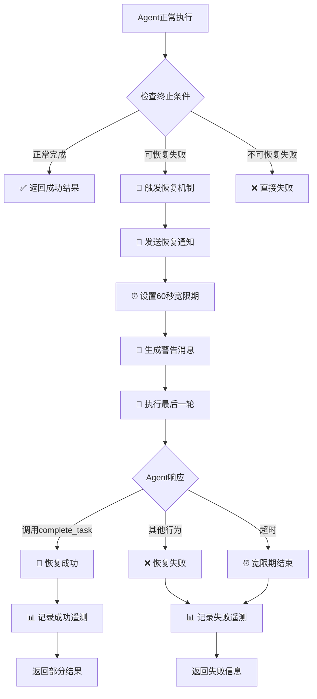

# Agent执行器的优雅恢复机制：executeFinalWarningTurn 深度解析

## 概述

`executeFinalWarningTurn` 是 Gemini CLI
Agent 系统中一个关键的**优雅恢复机制**，它在 Agent 即将因各种限制而失败时，提供最后一次完成任务的机会，体现了优秀的用户体验设计。

## 核心设计目的

### 🎯 **主要目标**

这个方法的核心目的是在 Agent 执行**即将失败**时，给它**最后一次机会**来完成任务，而不是直接失败退出，最大化任务执行的价值。

### 🔄 **触发场景**

当 Agent 遇到以下三种可恢复的失败情况时会触发：

```typescript
type RecoverableReason =
  | AgentTerminateMode.TIMEOUT // 执行超时
  | AgentTerminateMode.MAX_TURNS // 达到最大轮数限制
  | AgentTerminateMode.ERROR_NO_COMPLETE_TASK_CALL; // 停止调用工具但未调用完成工具
```

## 详细执行流程

### 1. 失败检测阶段

```typescript
// 在 AgentExecutor.run() 方法中的检测逻辑
while (true) {
  // 检查终止条件
  const reason = this.checkTermination(startTime, turnCounter);
  if (reason) {
    terminateReason = reason; // TIMEOUT, MAX_TURNS, 或其他
    break; // 退出主执行循环
  }

  // 检查外部信号
  if (combinedSignal.aborted) {
    terminateReason = timeoutController.signal.aborted
      ? AgentTerminateMode.TIMEOUT
      : AgentTerminateMode.ABORTED;
    break;
  }

  // 执行正常轮次...
}
```

### 2. 恢复决策阶段

```typescript
// 统一恢复逻辑 - 只对可恢复的情况尝试恢复
if (
  terminateReason !== AgentTerminateMode.ERROR && // 不恢复一般错误
  terminateReason !== AgentTerminateMode.ABORTED && // 不恢复用户取消
  terminateReason !== AgentTerminateMode.GOAL // 不恢复已完成任务
) {
  // 尝试优雅恢复
  const recoveryResult = await this.executeFinalWarningTurn(
    chat,
    tools,
    turnCounter,
    terminateReason,
    signal,
  );

  if (recoveryResult !== null) {
    // 🎉 恢复成功
    terminateReason = AgentTerminateMode.GOAL;
    finalResult = recoveryResult;
  }
}
```

### 3. 恢复执行阶段

```typescript
private async executeFinalWarningTurn(
  chat: GeminiChat,
  tools: FunctionDeclaration[],
  turnCounter: number,
  reason: AgentTerminateMode,
  externalSignal: AbortSignal,
): Promise<string | null> {

  // 🚨 步骤1: 通知开始恢复尝试
  this.emitActivity('THOUGHT_CHUNK', {
    text: `Execution limit reached (${reason}). Attempting one final recovery turn with a grace period.`,
  });

  const recoveryStartTime = Date.now();
  let success = false;

  // ⏰ 步骤2: 设置宽限期（60秒）
  const gracePeriodMs = GRACE_PERIOD_MS; // 60 * 1000
  const graceTimeoutController = new AbortController();
  const graceTimeoutId = setTimeout(
    () => graceTimeoutController.abort(new Error('Grace period timed out.')),
    gracePeriodMs,
  );

  try {
    // 📝 步骤3: 构造明确的警告消息
    const recoveryMessage: Content = {
      role: 'user',
      parts: [{ text: this.getFinalWarningMessage(reason) }],
    };

    // 🔄 步骤4: 监控多个信号源
    const combinedSignal = AbortSignal.any([
      externalSignal,           // 外部取消信号
      graceTimeoutController.signal, // 宽限期超时信号
    ]);

    // 🎯 步骤5: 执行最后一轮对话
    const turnResult = await this.executeTurn(
      chat,
      recoveryMessage,
      tools,
      turnCounter,
      combinedSignal,
      graceTimeoutController.signal,
    );

    // ✅ 步骤6: 检查恢复结果
    if (
      turnResult.status === 'stop' &&
      turnResult.terminateReason === AgentTerminateMode.GOAL
    ) {
      // 🎉 恢复成功！
      this.emitActivity('THOUGHT_CHUNK', {
        text: 'Graceful recovery succeeded.',
      });
      success = true;
      return turnResult.finalResult ?? 'Task completed during grace period.';
    }

    // ❌ 其他情况都视为恢复失败
    this.emitActivity('ERROR', {
      error: `Graceful recovery attempt failed. Reason: ${turnResult.status}`,
      context: 'recovery_turn',
    });
    return null;

  } catch (error) {
    // 🚫 异常情况（通常是宽限期超时）
    this.emitActivity('ERROR', {
      error: `Graceful recovery attempt failed: ${String(error)}`,
      context: 'recovery_turn',
    });
    return null;

  } finally {
    // 🧹 清理资源并记录遥测数据
    clearTimeout(graceTimeoutId);
    logRecoveryAttempt(
      this.runtimeContext,
      new RecoveryAttemptEvent(
        this.agentId,
        this.definition.name,
        reason,
        Date.now() - recoveryStartTime,
        success,
        turnCounter,
      ),
    );
  }
}
```

## 警告消息生成

### 针对性指导策略

```typescript
private getFinalWarningMessage(
  reason: AgentTerminateMode.TIMEOUT | AgentTerminateMode.MAX_TURNS | AgentTerminateMode.ERROR_NO_COMPLETE_TASK_CALL,
): string {
  let explanation = '';

  switch (reason) {
    case AgentTerminateMode.TIMEOUT:
      explanation = 'You have exceeded the time limit.';
      break;
    case AgentTerminateMode.MAX_TURNS:
      explanation = 'You have exceeded the maximum number of turns.';
      break;
    case AgentTerminateMode.ERROR_NO_COMPLETE_TASK_CALL:
      explanation = 'You have stopped calling tools without finishing.';
      break;
    default:
      throw new Error(`Unknown terminate reason: ${reason}`);
  }

  return `${explanation} You have one final chance to complete the task with a short grace period. You MUST call \`complete_task\` immediately with your best answer and explain that your investigation was interrupted. Do not call any other tools.`;
}
```

### 消息设计原则

1. **明确说明问题**: 告诉 Agent 为什么会触发恢复
2. **紧迫感**: 强调这是"最后一次机会"
3. **具体指令**: 必须调用 `complete_task` 工具
4. **行为限制**: 不要调用其他工具，专注完成
5. **期望管理**: 可以解释调查被中断

## 执行流程图



## 实际应用场景

### 场景1: 超时恢复成功

```typescript
// 原始情况: Agent 执行5分钟后超时
// 没有恢复机制的结果:
{
  result: "Agent timed out after 5 minutes.",
  terminate_reason: "TIMEOUT"
}

// 有恢复机制的结果:
{
  result: "Investigation was interrupted due to time limit, but I found critical issues: Authentication bypass vulnerability in src/auth/middleware.js:45. The login function doesn't validate JWT tokens properly. Recommend immediate security review.",
  terminate_reason: "GOAL" // 转换为成功完成
}
```

### 场景2: 达到最大轮数后恢复

```typescript
// 恢复消息示例:
'You have exceeded the maximum number of turns. You have one final chance to complete the task with a short grace period. You MUST call `complete_task` immediately with your best answer and explain that your investigation was interrupted. Do not call any other tools.';

// Agent 的恢复响应:
await complete_task({
  report: {
    SummaryOfFindings:
      'Due to turn limit, focused on critical findings: Found SQL injection vulnerability in user login endpoint. Located in src/controllers/authController.js:127.',
    ExplorationTrace: [
      'Searched for authentication files',
      'Found authController.js',
      'Identified SQL injection risk',
      'Investigation interrupted by turn limit',
    ],
    RelevantLocations: [
      {
        FilePath: 'src/controllers/authController.js',
        Reasoning: 'Contains vulnerable SQL query construction',
        KeySymbols: ['loginUser', 'validateCredentials'],
      },
    ],
  },
});
```

### 场景3: 协议违规后恢复

```typescript
// Agent 停止调用工具但没有调用 complete_task
// 恢复消息:
'You have stopped calling tools without finishing. You have one final chance to complete the task with a short grace period. You MUST call `complete_task` immediately with your best answer...';

// 期望的恢复行为:
await complete_task({
  answer:
    'Based on my analysis so far, I identified the main issue in the authentication flow. While my investigation was incomplete, the key finding is...',
});
```

## 设计原理与优势

### 1. 用户体验优化

**传统失败方式**:

```typescript
// ❌ 硬失败 - 用户得不到任何有用信息
'Agent execution failed: Maximum turns exceeded';
```

**优雅恢复方式**:

```typescript
// ✅ 软着陆 - 用户至少得到部分有价值的结果
"Agent reached turn limit but provided key findings:
- Authentication vulnerability detected
- Main issue in login.js:45
- Recommend immediate security review"
```

### 2. 价值最大化原则

即使 Agent 无法完全完成任务，也要尽可能提取已获得的有价值信息：

```typescript
// 部分结果示例
{
  "SummaryOfFindings": "Investigation incomplete due to time constraints, but identified critical security flaw",
  "ExplorationTrace": ["Analyzed auth module", "Found vulnerability", "Time expired"],
  "RelevantLocations": [
    {
      "FilePath": "src/auth/login.js",
      "Reasoning": "Contains SQL injection vulnerability",
      "KeySymbols": ["authenticateUser"]
    }
  ]
}
```

### 3. 资源保护机制

```typescript
// 宽限期设计 - 防止无限等待
const GRACE_PERIOD_MS = 60 * 1000; // 严格限制60秒

// 多重信号监控
const combinedSignal = AbortSignal.any([
  externalSignal,                    // 用户取消
  graceTimeoutController.signal,     // 宽限期超时
]);

// 资源清理保证
finally {
  clearTimeout(graceTimeoutId);      // 清理定时器
  logRecoveryAttempt(/*遥测数据*/);   // 记录尝试结果
}
```

### 4. 可观测性增强

```typescript
// 详细的遥测记录
logRecoveryAttempt(
  this.runtimeContext,
  new RecoveryAttemptEvent(
    this.agentId, // 哪个Agent
    this.definition.name, // Agent类型
    reason, // 失败原因
    duration, // 恢复耗时
    success, // 是否成功
    turnCounter, // 执行轮数
  ),
);

// 实时状态通知
this.emitActivity('THOUGHT_CHUNK', {
  text: 'Graceful recovery succeeded.',
});
```

## 错误处理策略

### 1. 分层错误处理

```typescript
try {
  // 尝试恢复执行
  const turnResult = await this.executeTurn(/*...*/);

  if (
    turnResult.status === 'stop' &&
    turnResult.terminateReason === AgentTerminateMode.GOAL
  ) {
    return turnResult.finalResult; // 成功路径
  }

  return null; // 恢复失败但不抛异常
} catch (error) {
  // 异常路径（通常是超时）
  this.emitActivity('ERROR', {
    error: `Graceful recovery attempt failed: ${String(error)}`,
    context: 'recovery_turn',
  });
  return null;
}
```

### 2. 优雅降级

```typescript
// 恢复失败后的处理
if (recoveryResult !== null) {
  // 恢复成功
  terminateReason = AgentTerminateMode.GOAL;
  finalResult = recoveryResult;
} else {
  // 恢复失败，设置适当的错误消息
  if (terminateReason === AgentTerminateMode.TIMEOUT) {
    finalResult = `Agent timed out after ${this.definition.runConfig.max_time_minutes} minutes.`;
  } else if (terminateReason === AgentTerminateMode.MAX_TURNS) {
    finalResult = `Agent reached max turns limit (${this.definition.runConfig.max_turns}).`;
  }
}
```

## 性能考虑

### 1. 时间控制

```typescript
// 严格的时间限制
const GRACE_PERIOD_MS = 60 * 1000; // 不超过1分钟

// 避免递归恢复
// 每个Agent执行只允许一次恢复尝试
```

### 2. 内存管理

```typescript
// 自动清理
finally {
  clearTimeout(graceTimeoutId);     // 清理定时器
  // AbortController 会自动垃圾回收
}
```

### 3. 并发控制

```typescript
// 使用 AbortSignal.any() 高效监控多个信号
const combinedSignal = AbortSignal.any([
  externalSignal,
  graceTimeoutController.signal,
]);
```

## 最佳实践

### 1. Agent 开发者指南

当开发 Agent 时，应该考虑恢复场景：

```typescript
// ✅ 好的做法：支持部分完成
if (timeRunningOut || turnsRunningOut) {
  await complete_task({
    result: 'Partial analysis complete. Key findings: ' + keyFindings,
  });
}

// ❌ 不好的做法：忽略限制继续执行
while (true) {
  await someExpensiveOperation(); // 可能导致超时
}
```

### 2. 错误信息设计

```typescript
// ✅ 信息丰富的错误消息
'Investigation interrupted due to time limit. Analyzed 15 files, found 3 potential issues in authentication module. Main concern: SQL injection in login.js:45.';

// ❌ 无用的错误消息
'Task failed.';
```

### 3. 遥测数据利用

```typescript
// 分析恢复成功率
const recoveryStats = {
  totalAttempts: 100,
  successfulRecoveries: 75,
  timeoutRecoveries: 45,
  maxTurnRecoveries: 30,
  averageRecoveryTime: 25000, // 25秒
};

// 优化策略
if (recoveryStats.successRate < 0.5) {
  // 调整默认时间限制或轮数限制
}
```

## 总结

`executeFinalWarningTurn` 体现了优秀软件设计的多个原则：

### 🎯 **核心价值**

1. **用户友好**: 不轻易放弃，尽力提供有价值的结果
2. **资源高效**: 严格控制恢复时间，避免资源浪费
3. **可观测**: 详细记录恢复过程，便于系统优化
4. **健壮性**: 多层错误处理，确保系统稳定

### 🏗️ **设计模式**

- **优雅降级模式**: 系统在压力下仍能提供基本服务
- **超时模式**: 防止无限等待的资源保护
- **重试模式**: 给失败操作第二次机会
- **观察者模式**: 实时通知恢复进度

### 🚀 **实际效果**

这个机制显著提升了 Gemini CLI
Agent 系统的实用性和用户满意度，让 Agent 在面临各种限制时仍能最大化任务价值，是一个非常人性化和实用的设计！
