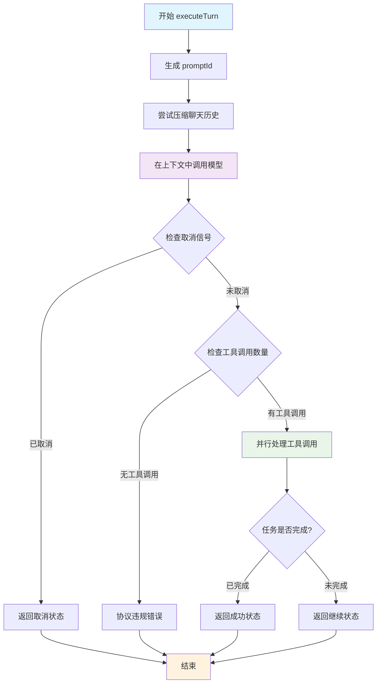

# Agent执行器核心方法：executeTurn 深度解析

## 概述

`executeTurn` 是 `AgentExecutor`
类中最核心的方法之一，负责执行 Agent 的单轮对话逻辑。它是 Agent 执行循环的基本单元，每次调用都代表 Agent 与模型进行一次完整的交互。

## 方法签名

```typescript
private async executeTurn(
  chat: GeminiChat,                    // 聊天会话对象
  currentMessage: Content,             // 当前要发送给模型的消息
  tools: FunctionDeclaration[],        // 可用的工具列表
  turnCounter: number,                 // 当前轮次计数器
  combinedSignal: AbortSignal,         // 组合的取消信号
  timeoutSignal: AbortSignal,          // 超时信号
): Promise<AgentTurnResult>            // 返回轮次执行结果
```

## 返回类型定义

```typescript
/** Agent 单轮执行的可能结果 */
type AgentTurnResult =
  | {
      status: 'continue'; // 继续执行下一轮
      nextMessage: Content; // 下一轮的消息内容
    }
  | {
      status: 'stop'; // 停止执行
      terminateReason: AgentTerminateMode; // 停止原因
      finalResult: string | null; // 最终结果
    };
```

## 详细执行流程

### 1. 初始化阶段

```typescript
const promptId = `${this.agentId}#${turnCounter}`;
```

**作用**：

- 为当前轮次生成唯一的 prompt ID
- 格式：`{agentId}#{turnCounter}`，如 `agent-abc123#5`
- 用于日志追踪、遥测数据关联和调试

### 2. 聊天压缩阶段

```typescript
await this.tryCompressChat(chat, promptId);
```

**目的**：

- 管理对话历史的长度，防止超出模型的上下文限制
- 智能压缩早期的对话内容，保留重要信息
- 优化性能和成本

**压缩策略**：

```typescript
// 在 tryCompressChat 方法中
const { newHistory, info } = await this.compressionService.compress(
  chat,
  prompt_id,
  false,
  model,
  this.runtimeContext,
  this.hasFailedCompressionAttempt,
);

if (info.compressionStatus === CompressionStatus.COMPRESSED) {
  if (newHistory) {
    chat.setHistory(newHistory);
    this.hasFailedCompressionAttempt = false;
  }
} else if (
  info.compressionStatus ===
  CompressionStatus.COMPRESSION_FAILED_INFLATED_TOKEN_COUNT
) {
  this.hasFailedCompressionAttempt = true;
}
```

### 3. 模型调用阶段

```typescript
const { functionCalls } = await promptIdContext.run(promptId, async () =>
  this.callModel(chat, currentMessage, tools, combinedSignal, promptId),
);
```

**关键特性**：

#### 3.1 异步上下文管理

- 使用 `promptIdContext.run()` 设置当前轮次的上下文
- 整个调用链中的所有操作都能获取到当前的 `promptId`
- 用于日志关联和遥测数据追踪

#### 3.2 模型交互

```typescript
// callModel 方法内部流程
private async callModel(/*...*/): Promise<{ functionCalls: FunctionCall[]; textResponse: string }> {
  const messageParams = {
    message: message.parts || [],
    config: {
      abortSignal: signal,
      tools: tools.length > 0 ? [{ functionDeclarations: tools }] : undefined,
    },
  };

  const responseStream = await chat.sendMessageStream(
    this.definition.modelConfig.model,
    messageParams,
    promptId,
  );

  const functionCalls: FunctionCall[] = [];
  let textResponse = '';

  // 流式处理模型响应
  for await (const resp of responseStream) {
    if (signal.aborted) break;

    if (resp.type === StreamEventType.CHUNK) {
      const chunk = resp.value;

      // 提取思维内容并实时发送
      const { subject } = parseThought(
        chunk.candidates?.[0]?.content?.parts?.find((p) => p.thought)?.text || '',
      );
      if (subject) {
        this.emitActivity('THOUGHT_CHUNK', { text: subject });
      }

      // 收集函数调用
      if (chunk.functionCalls) {
        functionCalls.push(...chunk.functionCalls);
      }

      // 收集文本响应
      const text = chunk.candidates?.[0]?.content?.parts
        ?.filter((p) => !p.thought && p.text)
        .map((p) => p.text)
        .join('') || '';

      if (text) {
        textResponse += text;
      }
    }
  }

  return { functionCalls, textResponse };
}
```

#### 3.3 解构赋值优化

- 只提取需要的 `functionCalls`，忽略 `textResponse`
- `textResponse` 已经通过事件流实时发送给用户
- 提高代码清晰度和性能

### 4. 信号检查阶段

```typescript
if (combinedSignal.aborted) {
  const terminateReason = timeoutSignal.aborted
    ? AgentTerminateMode.TIMEOUT
    : AgentTerminateMode.ABORTED;
  return {
    status: 'stop',
    terminateReason,
    finalResult: null,
  };
}
```

**信号类型判断**：

- `timeoutSignal.aborted`：内部超时（达到时间限制）
- `combinedSignal.aborted && !timeoutSignal.aborted`：外部取消（用户主动取消）

**设计意图**：

- 区分不同的取消原因，便于错误处理和用户反馈
- 优雅处理中断，避免资源泄漏

### 5. 协议验证阶段

```typescript
if (functionCalls.length === 0) {
  this.emitActivity('ERROR', {
    error: `Agent stopped calling tools but did not call '${TASK_COMPLETE_TOOL_NAME}' to finalize the session.`,
    context: 'protocol_violation',
  });
  return {
    status: 'stop',
    terminateReason: AgentTerminateMode.ERROR_NO_COMPLETE_TASK_CALL,
    finalResult: null,
  };
}
```

**协议要求**：

- Agent 必须持续调用工具或调用 `complete_task` 工具完成任务
- 不允许"静默"停止（既不调用工具也不完成任务）
- 这是一个重要的安全检查，防止 Agent 进入无效状态

**错误处理**：

- 发送错误活动事件，通知上层调用者
- 返回特定的终止原因，便于后续的恢复机制处理

### 6. 工具调用处理阶段

```typescript
const { nextMessage, submittedOutput, taskCompleted } =
  await this.processFunctionCalls(functionCalls, combinedSignal, promptId);
```

**并行处理策略**：

```typescript
// processFunctionCalls 方法内部逻辑
private async processFunctionCalls(/*...*/): Promise<{
  nextMessage: Content;
  submittedOutput: string | null;
  taskCompleted: boolean;
}> {
  const allowedToolNames = new Set(this.toolRegistry.getAllToolNames());
  allowedToolNames.add(TASK_COMPLETE_TOOL_NAME);

  let submittedOutput: string | null = null;
  let taskCompleted = false;

  // 并行执行工具调用
  const toolExecutionPromises: Array<Promise<Part[] | void>> = [];
  const syncResponseParts: Part[] = [];

  for (const [index, functionCall] of functionCalls.entries()) {
    const callId = functionCall.id ?? `${promptId}-${index}`;

    // 发送工具调用开始事件
    this.emitActivity('TOOL_CALL_START', {
      name: functionCall.name,
      args: functionCall.args ?? {},
    });

    if (functionCall.name === TASK_COMPLETE_TOOL_NAME) {
      // 同步处理完成工具
      taskCompleted = true;
      // 处理输出验证和格式化...
    } else {
      // 异步处理其他工具
      const executionPromise = (async () => {
        const { response: toolResponse } = await executeToolCall(/*...*/);
        return toolResponse.responseParts;
      })();
      toolExecutionPromises.push(executionPromise);
    }
  }

  // 等待所有异步工具执行完成
  const asyncResults = await Promise.all(toolExecutionPromises);

  // 合并所有响应
  const toolResponseParts: Part[] = [...syncResponseParts];
  for (const result of asyncResults) {
    if (result) {
      toolResponseParts.push(...result);
    }
  }

  return {
    nextMessage: { role: 'user', parts: toolResponseParts },
    submittedOutput,
    taskCompleted,
  };
}
```

**关键特性**：

- **并行执行**：多个工具调用同时执行，提高性能
- **权限检查**：验证工具调用是否被授权
- **完成检测**：识别 `complete_task` 工具调用
- **输出验证**：验证完成工具的输出格式

### 7. 结果判断阶段

```typescript
if (taskCompleted) {
  const finalResult = submittedOutput ?? 'Task completed successfully.';
  return {
    status: 'stop',
    terminateReason: AgentTerminateMode.GOAL,
    finalResult,
  };
}

// Task is not complete, continue to the next turn.
return {
  status: 'continue',
  nextMessage,
};
```

**两种可能的结果**：

#### 7.1 任务完成 (`status: 'stop'`)

- Agent 成功调用了 `complete_task` 工具
- 提取并返回最终结果
- 终止原因设为 `GOAL`（目标达成）

#### 7.2 继续执行 (`status: 'continue'`)

- 任务尚未完成，需要继续下一轮
- 返回下一轮的消息内容（包含工具执行结果）

## 执行流程图



## 错误处理机制

### 1. 分层错误处理

```typescript
// 层次1: 信号取消
if (combinedSignal.aborted) {
  // 区分超时和用户取消
}

// 层次2: 协议违规
if (functionCalls.length === 0) {
  // Agent 停止工作但未完成任务
}

// 层次3: 工具执行错误
// 在 processFunctionCalls 中处理单个工具的执行失败
```

### 2. 活动事件通知

```typescript
// 错误事件
this.emitActivity('ERROR', {
  error: 'Agent stopped calling tools but did not call complete_task',
  context: 'protocol_violation',
});

// 工具调用事件
this.emitActivity('TOOL_CALL_START', {
  name: functionCall.name,
  args: functionCall.args,
});

// 思维过程事件
this.emitActivity('THOUGHT_CHUNK', {
  text: subject,
});
```

## 性能优化策略

### 1. 并行工具执行

```typescript
// 创建工具执行Promise数组
const toolExecutionPromises: Array<Promise<Part[] | void>> = [];

// 并行执行所有工具
for (const functionCall of functionCalls) {
  if (functionCall.name !== TASK_COMPLETE_TOOL_NAME) {
    const promise = executeToolAsync(functionCall);
    toolExecutionPromises.push(promise);
  }
}

// 等待所有工具执行完成
const results = await Promise.all(toolExecutionPromises);
```

### 2. 流式输出处理

```typescript
// 实时发送思维过程
for await (const resp of responseStream) {
  const { subject } = parseThought(thoughtText);
  if (subject) {
    this.emitActivity('THOUGHT_CHUNK', { text: subject }); // 立即发送
  }
}
```

### 3. 智能聊天压缩

```typescript
// 基于历史失败调整压缩策略
await this.compressionService.compress(
  chat,
  prompt_id,
  false,
  model,
  this.runtimeContext,
  this.hasFailedCompressionAttempt, // 考虑历史失败
);
```

## 可观测性设计

### 1. 上下文追踪

```typescript
// 使用 AsyncLocalStorage 进行上下文管理
const { functionCalls } = await promptIdContext.run(promptId, async () =>
  this.callModel(/*...*/),
);

// 整个调用链中都能获取到 promptId
function someDeepFunction() {
  const currentPromptId = promptIdContext.getStore(); // 自动获取
}
```

### 2. 详细的活动事件

```typescript
// 工具调用开始
this.emitActivity('TOOL_CALL_START', {
  name: functionCall.name,
  args: functionCall.args,
});

// 工具调用结束
this.emitActivity('TOOL_CALL_END', {
  name: functionCall.name,
  output: toolResponse.resultDisplay,
});

// 错误事件
this.emitActivity('ERROR', {
  context: 'tool_call',
  name: functionCall.name,
  error: toolResponse.error.message,
});
```

### 3. 遥测数据集成

- 每个 `promptId` 都与遥测系统关联
- 所有工具调用、错误、性能指标都被记录
- 便于后续分析和系统优化

## 设计模式应用

### 1. 命令模式 (Command Pattern)

```typescript
// 每个工具调用都是一个命令
interface ToolCommand {
  name: string;
  args: Record<string, unknown>;
  execute(): Promise<ToolResult>;
}

// executeTurn 作为命令调度器
const commands = functionCalls.map((call) => createToolCommand(call));
const results = await Promise.all(commands.map((cmd) => cmd.execute()));
```

### 2. 观察者模式 (Observer Pattern)

```typescript
// 通过 emitActivity 发送事件
this.emitActivity('TOOL_CALL_START', data);

// 上层可以注册监听器
const onActivity = (activity: SubagentActivityEvent) => {
  console.log(`Agent activity: ${activity.type}`);
};
```

### 3. 状态模式 (State Pattern)

```typescript
// 不同的返回状态代表不同的执行状态
type AgentTurnResult =
  | { status: 'continue'; nextMessage: Content } // 继续状态
  | { status: 'stop'; terminateReason: AgentTerminateMode }; // 停止状态
```

## 与其他组件的协作

### 1. 与 AgentExecutor.run() 的关系

```typescript
// run() 方法中的主循环
while (true) {
  const reason = this.checkTermination(startTime, turnCounter);
  if (reason) break;

  // 调用 executeTurn
  const turnResult = await this.executeTurn(
    chat,
    currentMessage,
    tools,
    turnCounter++,
    combinedSignal,
    timeoutController.signal,
  );

  if (turnResult.status === 'stop') {
    terminateReason = turnResult.terminateReason;
    finalResult = turnResult.finalResult;
    break;
  }

  // 继续下一轮
  currentMessage = turnResult.nextMessage;
}
```

### 2. 与工具系统的集成

```typescript
// 通过 ToolRegistry 管理可用工具
const allowedToolNames = new Set(this.toolRegistry.getAllToolNames());

// 通过 executeToolCall 执行具体工具
const { response: toolResponse } = await executeToolCall(
  this.runtimeContext,
  requestInfo,
  signal,
);
```

### 3. 与聊天服务的协作

```typescript
// 通过 GeminiChat 与模型交互
const responseStream = await chat.sendMessageStream(
  this.definition.modelConfig.model,
  messageParams,
  promptId,
);

// 通过 ChatCompressionService 管理历史
await this.compressionService.compress(/*...*/);
```

## 最佳实践总结

### 1. 错误处理

- **分层处理**：不同层次的错误有不同的处理策略
- **明确分类**：区分超时、取消、协议违规等不同错误类型
- **用户友好**：提供清晰的错误信息和上下文

### 2. 性能优化

- **并行执行**：工具调用并行处理，减少总执行时间
- **流式输出**：实时发送思维过程，提升用户体验
- **智能压缩**：动态管理对话历史，平衡性能和上下文

### 3. 可观测性

- **上下文管理**：使用 AsyncLocalStorage 进行请求追踪
- **事件驱动**：通过活动事件提供实时反馈
- **遥测集成**：完整的性能和错误监控

### 4. 代码质量

- **类型安全**：充分利用 TypeScript 类型系统
- **单一职责**：每个方法专注于特定功能
- **可测试性**：清晰的输入输出和依赖注入

## 总结

`executeTurn` 方法是 Gemini CLI Agent 系统的核心执行单元，它优雅地处理了：

### 🎯 **核心功能**

- **模型交互**：与 Gemini 模型进行流式对话
- **工具编排**：并行执行多个工具调用
- **状态管理**：准确判断执行状态和终止条件
- **错误处理**：多层次的错误检测和处理

### 🏗️ **设计优势**

- **高性能**：并行工具执行和流式输出
- **高可靠**：完善的错误处理和信号管理
- **高可观测**：详细的事件追踪和上下文管理
- **高可维护**：清晰的代码结构和类型安全

### 🚀 **实际价值**

- 提供了稳定可靠的 Agent 执行环境
- 支持复杂的多工具协作场景
- 实现了优秀的用户体验（实时反馈）
- 为系统监控和优化提供了丰富的数据

这个方法体现了现代异步编程的最佳实践，是构建高质量 AI Agent 系统的重要参考！
