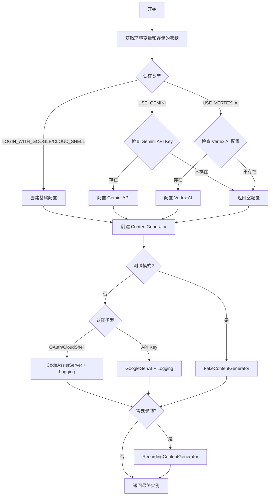

# ContentGenerator 源码分析

## 概述

`ContentGenerator` 是 Gemini
CLI 项目中的核心抽象接口，定义了与生成式 AI 模型交互的标准接口。该文件包含了接口定义、认证类型枚举、配置管理以及不同实现的工厂方法。

## 文件位置

`packages/core/src/core/contentGenerator.ts`

## 核心组件分析

### 1. ContentGenerator 接口定义

```typescript
// contentGenerator.ts:29-45
export interface ContentGenerator {
  generateContent(
    request: GenerateContentParameters,
    userPromptId: string,
  ): Promise<GenerateContentResponse>;

  generateContentStream(
    request: GenerateContentParameters,
    userPromptId: string,
  ): Promise<AsyncGenerator<GenerateContentResponse>>;

  countTokens(request: CountTokensParameters): Promise<CountTokensResponse>;

  embedContent(request: EmbedContentParameters): Promise<EmbedContentResponse>;

  userTier?: UserTierId;
}
```

**接口功能：**

- **generateContent**: 生成单次完整响应
- **generateContentStream**: 生成流式响应（支持实时输出）
- **countTokens**: 计算输入内容的 token 数量
- **embedContent**: 生成文本嵌入向量
- **userTier**: 可选的用户等级信息

### 2. 认证类型枚举

```typescript
// contentGenerator.ts:47-52
export enum AuthType {
  LOGIN_WITH_GOOGLE = 'oauth-personal',
  USE_GEMINI = 'gemini-api-key',
  USE_VERTEX_AI = 'vertex-ai',
  CLOUD_SHELL = 'cloud-shell',
}
```

**认证方式说明：**

| 认证类型            | 值               | 用途                   | 端点               |
| ------------------- | ---------------- | ---------------------- | ------------------ |
| `LOGIN_WITH_GOOGLE` | `oauth-personal` | Google 账户 OAuth 认证 | Code Assist Server |
| `USE_GEMINI`        | `gemini-api-key` | Gemini API Key         | Gemini API         |
| `USE_VERTEX_AI`     | `vertex-ai`      | Vertex AI API Key      | Vertex AI          |
| `CLOUD_SHELL`       | `cloud-shell`    | Cloud Shell 环境       | Code Assist Server |

### 3. 配置类型定义

```typescript
// contentGenerator.ts:54-59
export type ContentGeneratorConfig = {
  apiKey?: string;
  vertexai?: boolean;
  authType?: AuthType;
  proxy?: string;
};
```

**配置参数：**

- **apiKey**: API 密钥（用于 Gemini API 或 Vertex AI）
- **vertexai**: 是否使用 Vertex AI 端点
- **authType**: 认证类型
- **proxy**: 代理服务器配置

### 4. 配置创建函数

```typescript
// contentGenerator.ts:61-105
export async function createContentGeneratorConfig(
  config: Config,
  authType: AuthType | undefined,
): Promise<ContentGeneratorConfig>;
```

**配置创建逻辑：**

#### 4.1 环境变量获取

```typescript
const geminiApiKey =
  (await loadApiKey()) || process.env['GEMINI_API_KEY'] || undefined;
const googleApiKey = process.env['GOOGLE_API_KEY'] || undefined;
const googleCloudProject =
  process.env['GOOGLE_CLOUD_PROJECT'] ||
  process.env['GOOGLE_CLOUD_PROJECT_ID'] ||
  undefined;
const googleCloudLocation = process.env['GOOGLE_CLOUD_LOCATION'] || undefined;
```

**环境变量优先级：**

1. 存储的 API Key（通过 `loadApiKey()`）
2. `GEMINI_API_KEY` 环境变量
3. `GOOGLE_API_KEY` 环境变量
4. Google Cloud 项目和位置信息

#### 4.2 认证类型处理

**Google OAuth / Cloud Shell:**

```typescript
if (
  authType === AuthType.LOGIN_WITH_GOOGLE ||
  authType === AuthType.CLOUD_SHELL
) {
  return contentGeneratorConfig; // 无需额外验证
}
```

**Gemini API Key:**

```typescript
if (authType === AuthType.USE_GEMINI && geminiApiKey) {
  contentGeneratorConfig.apiKey = geminiApiKey;
  contentGeneratorConfig.vertexai = false;
  return contentGeneratorConfig;
}
```

**Vertex AI:**

```typescript
if (
  authType === AuthType.USE_VERTEX_AI &&
  (googleApiKey || (googleCloudProject && googleCloudLocation))
) {
  contentGeneratorConfig.apiKey = googleApiKey;
  contentGeneratorConfig.vertexai = true;
  return contentGeneratorConfig;
}
```

### 5. ContentGenerator 工厂方法

```typescript
// contentGenerator.ts:107-169
export async function createContentGenerator(
  config: ContentGeneratorConfig,
  gcConfig: Config,
  sessionId?: string,
): Promise<ContentGenerator>;
```

#### 5.1 实现选择逻辑

**1. 测试模式 - FakeContentGenerator**

```typescript
if (gcConfig.fakeResponses) {
  return FakeContentGenerator.fromFile(gcConfig.fakeResponses);
}
```

**2. Google OAuth / Cloud Shell - CodeAssistServer**

```typescript
if (
  config.authType === AuthType.LOGIN_WITH_GOOGLE ||
  config.authType === AuthType.CLOUD_SHELL
) {
  const httpOptions = { headers: baseHeaders };
  return new LoggingContentGenerator(
    await createCodeAssistContentGenerator(
      httpOptions,
      config.authType,
      gcConfig,
      sessionId,
    ),
    gcConfig,
  );
}
```

**3. API Key - GoogleGenAI SDK**

```typescript
if (
  config.authType === AuthType.USE_GEMINI ||
  config.authType === AuthType.USE_VERTEX_AI
) {
  const googleGenAI = new GoogleGenAI({
    apiKey: config.apiKey === '' ? undefined : config.apiKey,
    vertexai: config.vertexai,
    httpOptions,
  });
  return new LoggingContentGenerator(googleGenAI.models, gcConfig);
}
```

#### 5.2 HTTP 选项配置

**基础 Headers:**

```typescript
const version = process.env['CLI_VERSION'] || process.version;
const userAgent = `GeminiCLI/${version} (${process.platform}; ${process.arch})`;
const baseHeaders: Record<string, string> = {
  'User-Agent': userAgent,
};
```

**使用统计 Headers:**

```typescript
if (gcConfig?.getUsageStatisticsEnabled()) {
  const installationManager = new InstallationManager();
  const installationId = installationManager.getInstallationId();
  headers = {
    ...headers,
    'x-gemini-api-privileged-user-id': `${installationId}`,
  };
}
```

#### 5.3 装饰器模式应用

**日志装饰器:** 所有实现都被 `LoggingContentGenerator`
包装，添加请求/响应日志功能。

**录制装饰器:**

```typescript
if (gcConfig.recordResponses) {
  return new RecordingContentGenerator(generator, gcConfig.recordResponses);
}
```

## ContentGenerator 实现类分析

### 1. FakeContentGenerator

- **用途**: 测试和开发时使用预设响应
- **特点**: 从文件加载预定义的响应数据
- **适用场景**: 单元测试、集成测试、离线开发

### 2. CodeAssistServer

- **用途**: Google OAuth 认证的内部服务
- **端点**: `https://cloudcode-pa.googleapis.com/v1internal`
- **特点**:
  - 支持 SSE 流式响应
  - 集成用户等级管理
  - 项目级别的权限控制

### 3. GoogleGenAI SDK

- **用途**: 直接使用 Google 的生成式 AI SDK
- **支持端点**:
  - Gemini API: `generativelanguage.googleapis.com`
  - Vertex AI: `{location}-aiplatform.googleapis.com`
- **特点**: 官方 SDK，功能完整

### 4. LoggingContentGenerator (装饰器)

- **功能**: 为任何 ContentGenerator 添加日志记录
- **记录内容**:
  - API 请求/响应
  - 错误信息
  - 性能指标
  - 服务器详细信息

### 5. RecordingContentGenerator (装饰器)

- **功能**: 记录所有请求和响应用于回放
- **用途**: 调试、测试数据生成、行为分析

## 架构设计模式

### 1. 策略模式 (Strategy Pattern)

不同的认证类型对应不同的实现策略：

- Google OAuth → CodeAssistServer
- API Key → GoogleGenAI SDK
- 测试模式 → FakeContentGenerator

### 2. 工厂模式 (Factory Pattern)

`createContentGenerator` 函数根据配置创建合适的实现。

### 3. 装饰器模式 (Decorator Pattern)

- `LoggingContentGenerator`: 添加日志功能
- `RecordingContentGenerator`: 添加录制功能

### 4. 适配器模式 (Adapter Pattern)

统一不同 AI 服务的接口差异，提供一致的调用方式。

## 配置流程图



## 关键特性

### 1. 多端点支持

- **Code Assist**: 内部 Google 服务，支持高级功能
- **Gemini API**: 公共 API，易于集成
- **Vertex AI**: 企业级服务，支持私有部署

### 2. 安全认证

- **OAuth 2.0**: 安全的用户认证
- **API Key**: 简单的服务认证
- **Cloud Shell**: 自动认证环境

### 3. 可观测性

- 完整的请求/响应日志
- 错误跟踪和分析
- 性能指标收集

### 4. 测试友好

- 支持模拟响应
- 请求录制和回放
- 可配置的测试环境

### 5. 用户体验

- 自动安装 ID 生成
- 使用统计收集（可选）
- 代理支持

## 扩展性设计

### 1. 新认证方式扩展

只需在 `AuthType` 枚举中添加新类型，并在工厂方法中添加对应逻辑。

### 2. 新实现添加

实现 `ContentGenerator` 接口即可无缝集成。

### 3. 新装饰器添加

可以轻松添加新的装饰器来扩展功能（如缓存、限流等）。

## 总结

`ContentGenerator`
是一个设计精良的抽象层，通过策略模式、工厂模式和装饰器模式的组合，实现了：

1. **统一接口**: 屏蔽不同 AI 服务的差异
2. **灵活配置**: 支持多种认证和部署方式
3. **可扩展性**: 易于添加新的实现和功能
4. **可观测性**: 完整的日志和监控支持
5. **测试友好**: 支持模拟和录制功能

这种设计使得系统能够适应不同的部署环境和用户需求，同时保持代码的清晰和可维护性。
