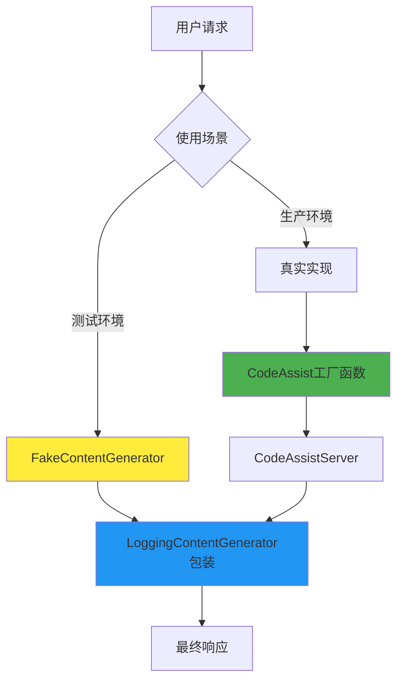

# ContentGenerator 实现类对比分析

## 概述

这三个文件都与 `ContentGenerator`
接口相关，但扮演着完全不同的角色。让我用通俗易懂的方式来解释它们的关系和区别。

## 角色定位对比

### 🎭 角色比喻

想象一个餐厅的运作模式：

- **FakeContentGenerator** = 样品展示柜（展示假的食物模型）
- **CodeAssist** = 厨师长（真正制作食物的人）
- **LoggingContentGenerator** = 服务员（记录每个订单和服务过程）

## 详细分析

### 1. FakeContentGenerator - 测试替身

**文件位置**: `packages/core/src/core/fakeContentGenerator.ts`

#### 🎯 作用

这是一个**测试用的假实现**，就像电影中的替身演员。

#### 🔧 工作原理

```typescript
// 从文件加载预设的响应
static async fromFile(filePath: string): Promise<FakeContentGenerator> {
  const fileContent = await promises.readFile(filePath, 'utf-8');
  const responses = fileContent
    .split('\n')
    .filter((line) => line.trim() !== '')
    .map((line) => JSON.parse(line) as FakeResponse);
  return new FakeContentGenerator(responses);
}

// 按顺序返回预设的响应
private getNextResponse<M extends FakeResponse['method']>(method: M, request: unknown): R {
  const response = this.responses[this.callCounter++];
  // 返回预设的假响应
  return response.response as R;
}
```

#### 📝 使用场景

- **单元测试**: 不需要真实 API 调用
- **集成测试**: 模拟各种响应情况
- **离线开发**: 没有网络时也能开发
- **CI/CD**: 持续集成时避免真实 API 调用

#### 💡 特点

- ✅ 快速：无网络延迟
- ✅ 可控：响应完全可预测
- ✅ 稳定：不受外部服务影响
- ❌ 假的：不是真实的 AI 响应

---

### 2. CodeAssist - 工厂函数

**文件位置**: `packages/core/src/code_assist/codeAssist.ts`

#### 🎯 作用

这**不是一个 ContentGenerator 实现**，而是一个**工厂函数**，用来创建真正的 ContentGenerator。

#### 🔧 工作原理

```typescript
export async function createCodeAssistContentGenerator(
  httpOptions: HttpOptions,
  authType: AuthType,
  config: Config,
  sessionId?: string,
): Promise<ContentGenerator> {
  if (
    authType === AuthType.LOGIN_WITH_GOOGLE ||
    authType === AuthType.CLOUD_SHELL
  ) {
    // 1. 获取 OAuth 客户端
    const authClient = await getOauthClient(authType, config);

    // 2. 设置用户信息
    const userData = await setupUser(authClient);

    // 3. 创建 CodeAssistServer 实例
    return new CodeAssistServer(
      authClient,
      userData.projectId,
      httpOptions,
      sessionId,
      userData.userTier,
    );
  }
  throw new Error(`Unsupported authType: ${authType}`);
}
```

#### 📝 职责

- **身份验证**: 处理 Google OAuth 登录
- **用户设置**: 获取用户项目信息和权限等级
- **实例创建**: 创建配置好的 CodeAssistServer
- **类型检查**: 验证认证类型是否支持

#### 💡 特点

- 🏭 工厂模式：负责创建其他对象
- 🔐 认证处理：处理复杂的 OAuth 流程
- ⚙️ 配置管理：设置服务器连接参数
- 🚫 不直接处理 AI 请求

---

### 3. LoggingContentGenerator - 装饰器

**文件位置**: `packages/core/src/core/loggingContentGenerator.ts`

#### 🎯 作用

这是一个**装饰器**，为任何 ContentGenerator 添加日志记录功能。

#### 🔧 工作原理

```typescript
export class LoggingContentGenerator implements ContentGenerator {
  constructor(
    private readonly wrapped: ContentGenerator, // 包装其他实现
    private readonly config: Config,
  ) {}

  async generateContent(
    req: GenerateContentParameters,
    userPromptId: string,
  ): Promise<GenerateContentResponse> {
    // 1. 记录请求开始
    const startTime = Date.now();
    this.logApiRequest(toContents(req.contents), req.model, userPromptId);

    try {
      // 2. 调用真正的实现
      const response = await this.wrapped.generateContent(req, userPromptId);

      // 3. 记录成功响应
      const durationMs = Date.now() - startTime;
      this._logApiResponse(/* ... 各种参数 ... */);

      return response;
    } catch (error) {
      // 4. 记录错误
      this._logApiError(/* ... 错误信息 ... */);
      throw error;
    }
  }
}
```

#### 📝 功能

- **请求日志**: 记录每个 API 请求的详细信息
- **响应日志**: 记录响应时间、内容、token 使用量
- **错误日志**: 记录错误类型、状态码、持续时间
- **性能监控**: 统计请求耗时
- **端点识别**: 自动识别使用的 API 端点

#### 💡 特点

- 🎭 装饰器模式：增强而不改变原有功能
- 📊 全面监控：记录所有 API 交互
- 🔍 调试友好：详细的日志信息
- 🚀 透明代理：不影响原有功能

---

## 关系图解



## 使用流程对比

### 🧪 测试场景

```typescript
// 1. 创建假的内容生成器
const fakeGenerator = await FakeContentGenerator.fromFile(
  'test-responses.json',
);

// 2. 用日志装饰器包装（可选）
const loggedFakeGenerator = new LoggingContentGenerator(fakeGenerator, config);

// 3. 使用
const response = await loggedFakeGenerator.generateContent(
  request,
  'test-prompt',
);
```

### 🌐 生产场景

```typescript
// 1. 通过工厂创建真实的内容生成器
const realGenerator = await createCodeAssistContentGenerator(
  httpOptions,
  AuthType.LOGIN_WITH_GOOGLE,
  config,
);

// 2. 自动被日志装饰器包装
const response = await realGenerator.generateContent(request, 'user-prompt');
```

## 核心区别总结

| 特性         | FakeContentGenerator | CodeAssist      | LoggingContentGenerator |
| ------------ | -------------------- | --------------- | ----------------------- |
| **类型**     | 具体实现类           | 工厂函数        | 装饰器类                |
| **目的**     | 测试替身             | 创建实例        | 添加日志                |
| **网络请求** | ❌ 无                | ❌ 不直接发送   | ❌ 代理转发             |
| **数据来源** | 📁 文件              | 🏭 创建其他实例 | 🔄 包装其他实例         |
| **使用场景** | 🧪 测试              | 🔐 OAuth认证    | 📊 生产监控             |
| **独立性**   | ✅ 独立工作          | ❌ 创建其他实例 | ❌ 需要包装对象         |

## 实际应用举例

### 场景1：开发者写单元测试

```typescript
// 准备测试数据文件 test-responses.json
[
  {
    method: 'generateContent',
    response: { candidates: [{ content: { parts: [{ text: 'Hello!' }] } }] },
  },
  {
    method: 'generateContent',
    response: { candidates: [{ content: { parts: [{ text: 'World!' }] } }] },
  },
];

// 测试代码
const generator = await FakeContentGenerator.fromFile('test-responses.json');
const response1 = await generator.generateContent(req, 'test1'); // 返回 "Hello!"
const response2 = await generator.generateContent(req, 'test2'); // 返回 "World!"
```

### 场景2：用户登录使用 Google 账户

```typescript
// 系统自动调用
const generator = await createCodeAssistContentGenerator(
  { headers: { 'User-Agent': 'GeminiCLI/1.0' } },
  AuthType.LOGIN_WITH_GOOGLE,
  config,
);
// 这会创建一个 CodeAssistServer 实例，然后被 LoggingContentGenerator 包装
```

### 场景3：监控生产环境

```typescript
// 任何 ContentGenerator 都会被自动包装
const wrappedGenerator = new LoggingContentGenerator(anyGenerator, config);

// 每次调用都会自动记录日志
await wrappedGenerator.generateContent(req, promptId);
// 日志会包含：请求时间、响应时间、token使用量、错误信息等
```

## 总结

这三个文件体现了软件设计的几个重要模式：

1. **FakeContentGenerator**: 测试替身模式，提供可控的假数据
2. **CodeAssist**: 工厂模式，负责创建和配置复杂对象
3. **LoggingContentGenerator**: 装饰器模式，为现有功能添加新特性

它们协同工作，为系统提供了灵活性、可测试性和可观测性。理解它们的区别有助于理解整个系统的架构设计思想。
