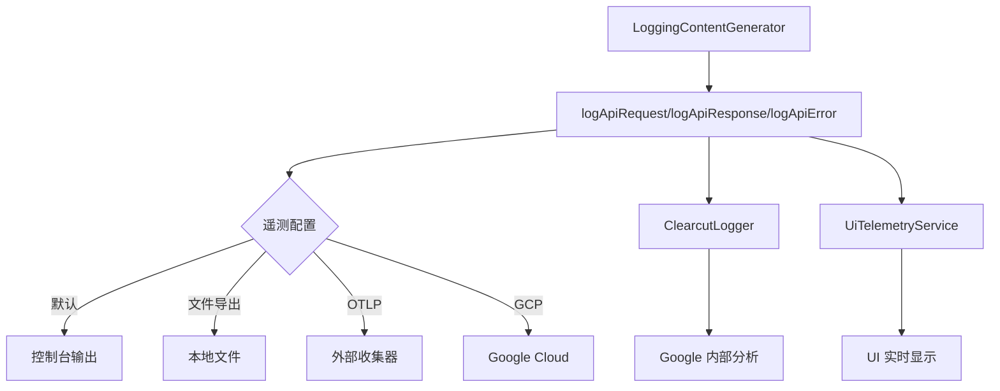

# LoggingContentGenerator 日志查看指南

## 概述

`LoggingContentGenerator`
记录的日志通过多个渠道输出，根据配置不同，可以在不同位置查看。这份指南将详细说明如何查看这些日志。

## 日志系统架构

### 🏗️ 日志流向图



## 日志输出位置

### 1. 🖥️ 控制台输出（默认）

**查看方式**: 直接在运行 Gemini CLI 的终端中查看

**示例输出**:

```bash
$ gemini "Hello, how are you?"

# API 请求日志
[2024-11-20T08:45:12.123Z] API Request: model=gemini-2.0-flash prompt_id=abc123
[2024-11-20T08:45:12.124Z] Request content: [{"role":"user","parts":[{"text":"Hello, how are you?"}]}]

# API 响应日志
[2024-11-20T08:45:13.456Z] API Response: model=gemini-2.0-flash duration=1333ms tokens={"input":15,"output":25}
[2024-11-20T08:45:13.457Z] Response: {"candidates":[{"content":{"parts":[{"text":"Hello! I'm doing well..."}]}}]}
```

### 2. 📁 本地文件输出

#### 配置方式

```bash
# 方法1: 命令行参数
gemini --telemetry-outfile ./logs/gemini.log "your question"

# 方法2: 环境变量
export GEMINI_TELEMETRY_OUTFILE="./logs/gemini.log"
gemini "your question"

# 方法3: 配置文件 (~/.gemini/settings.json)
{
  "telemetry": {
    "outfile": "./logs/gemini.log"
  }
}
```

#### 查看方式

```bash
# 实时查看日志
tail -f ./logs/gemini.log

# 查看最新日志
tail -n 100 ./logs/gemini.log

# 搜索特定内容
grep "API Response" ./logs/gemini.log

# 格式化 JSON 日志
cat ./logs/gemini.log | jq '.'
```

#### 日志格式示例

```json
{
  "timestamp": "2024-11-20T08:45:12.123Z",
  "level": "INFO",
  "message": "API Request",
  "attributes": {
    "model": "gemini-2.0-flash",
    "prompt_id": "abc123",
    "auth_type": "oauth-personal",
    "server": {
      "address": "cloudcode-pa.googleapis.com",
      "port": 443
    }
  },
  "body": {
    "contents": [
      { "role": "user", "parts": [{ "text": "Hello, how are you?" }] }
    ]
  }
}
```

### 3. 🌐 外部收集器 (OTLP)

#### 配置方式

```bash
# 使用 Jaeger
export GEMINI_TELEMETRY_OTLP_ENDPOINT="http://localhost:14268/api/traces"
export GEMINI_TELEMETRY_OTLP_PROTOCOL="http"

# 使用 Zipkin
export GEMINI_TELEMETRY_OTLP_ENDPOINT="http://localhost:9411/api/v2/spans"

# 使用自定义收集器
export GEMINI_TELEMETRY_OTLP_ENDPOINT="https://your-collector.com/v1/traces"
```

#### 查看方式

- **Jaeger UI**: http://localhost:16686
- **Zipkin UI**: http://localhost:9411
- **Grafana**: 配置 OTLP 数据源后查看

### 4. ☁️ Google Cloud Platform

#### 配置方式

```bash
export GEMINI_TELEMETRY_TARGET="gcp"
export GOOGLE_CLOUD_PROJECT="your-project-id"
```

#### 查看方式

- **Cloud Logging**: https://console.cloud.google.com/logs
- **Cloud Trace**: https://console.cloud.google.com/traces
- **Cloud Monitoring**: https://console.cloud.google.com/monitoring

## 具体查看步骤

### 🔍 方法1: 终端实时查看（最简单）

```bash
# 启动 Gemini CLI 并观察输出
gemini --debug "测试消息"

# 输出示例:
# [DEBUG] OpenTelemetry SDK started successfully.
# [INFO] API Request: model=gemini-2.0-flash
# [INFO] API Response: duration=1234ms tokens={"input":10,"output":20}
```

### 🔍 方法2: 文件日志查看

```bash
# 1. 配置日志文件
mkdir -p ~/gemini-logs
export GEMINI_TELEMETRY_OUTFILE="~/gemini-logs/api.log"

# 2. 运行 Gemini CLI
gemini "你好"

# 3. 查看日志文件
cat ~/gemini-logs/api.log | jq '.body.message' # 查看消息内容
cat ~/gemini-logs/api.log | jq '.attributes.model' # 查看使用的模型
cat ~/gemini-logs/api.log | jq 'select(.level == "ERROR")' # 只看错误日志
```

### 🔍 方法3: 使用 Jaeger 查看（推荐用于详细分析）

```bash
# 1. 启动 Jaeger (使用 Docker)
docker run -d --name jaeger \
  -p 16686:16686 \
  -p 14268:14268 \
  jaegertracing/all-in-one:latest

# 2. 配置 Gemini CLI
export GEMINI_TELEMETRY_OTLP_ENDPOINT="http://localhost:14268/api/traces"
export GEMINI_TELEMETRY_OTLP_PROTOCOL="http"

# 3. 运行 Gemini CLI
gemini "分析这个问题"

# 4. 打开 Jaeger UI
open http://localhost:16686

# 5. 在 UI 中搜索服务 "gemini-cli"
```

## 日志内容详解

### 📊 API 请求日志包含：

- **时间戳**: 请求发送时间
- **模型名称**: 使用的 AI 模型
- **提示词 ID**: 用于追踪的唯一标识
- **认证类型**: oauth-personal, gemini-api-key 等
- **服务器信息**: 端点地址和端口
- **请求内容**: 发送给 AI 的完整消息

### 📊 API 响应日志包含：

- **响应时间**: 请求耗时（毫秒）
- **Token 使用量**: 输入/输出/缓存/思考 token 数
- **模型版本**: 实际使用的模型版本
- **响应内容**: AI 返回的完整内容
- **状态码**: HTTP 状态码

### 📊 API 错误日志包含：

- **错误类型**: 网络错误、认证错误、配额错误等
- **错误消息**: 详细错误描述
- **状态码**: HTTP 错误状态码
- **重试信息**: 是否会重试，重试次数等

## 常用查看命令

### 🔧 查看最近的 API 调用

```bash
# 查看最近 10 次 API 调用
tail -n 10 ~/gemini-logs/api.log | jq 'select(.body.message == "API Response")'

# 查看今天的所有 API 调用
grep "$(date +%Y-%m-%d)" ~/gemini-logs/api.log | jq '.'
```

### 🔧 查看错误日志

```bash
# 查看所有错误
grep -i "error" ~/gemini-logs/api.log | jq '.'

# 查看特定错误类型
jq 'select(.attributes.error_type == "quota_exceeded")' ~/gemini-logs/api.log
```

### 🔧 分析性能

```bash
# 查看响应时间分布
jq 'select(.body.message == "API Response") | .attributes.duration_ms' ~/gemini-logs/api.log | sort -n

# 查看 Token 使用统计
jq 'select(.body.message == "API Response") | .attributes.usage' ~/gemini-logs/api.log
```

### 🔧 按模型分组查看

```bash
# 查看不同模型的使用情况
jq 'group_by(.attributes.model) | map({model: .[0].attributes.model, count: length})' ~/gemini-logs/api.log
```

## 配置文件位置

### 全局配置

```bash
# macOS/Linux
~/.gemini/settings.json

# Windows
%USERPROFILE%\.gemini\settings.json
```

### 项目级配置

```bash
# 项目根目录
./.gemini/settings.json
```

### 配置示例

```json
{
  "telemetry": {
    "enabled": true,
    "outfile": "./logs/gemini-api.log",
    "otlpEndpoint": "http://localhost:14268/api/traces",
    "otlpProtocol": "http",
    "target": "file"
  },
  "debug": true
}
```

## 常见问题

### ❓ 为什么看不到日志？

1. **检查遥测是否启用**:

   ```bash
   gemini --telemetry-enabled=true "test"
   ```

2. **检查配置**:

   ```bash
   cat ~/.gemini/settings.json
   ```

3. **使用调试模式**:
   ```bash
   gemini --debug "test"
   ```

### ❓ 日志文件太大怎么办？

```bash
# 按日期轮转日志
export GEMINI_TELEMETRY_OUTFILE="./logs/gemini-$(date +%Y%m%d).log"

# 清理旧日志
find ./logs -name "gemini-*.log" -mtime +7 -delete
```

### ❓ 如何过滤敏感信息？

日志中可能包含用户输入内容，可以通过以下方式过滤：

```bash
# 只查看元数据，不显示内容
jq 'del(.body.contents, .body.response_text)' ~/gemini-logs/api.log

# 查看统计信息
jq '{timestamp: .timestamp, model: .attributes.model, duration: .attributes.duration_ms, tokens: .attributes.usage}' ~/gemini-logs/api.log
```

## 总结

LoggingContentGenerator 的日志可以通过多种方式查看：

1. **开发调试**: 使用终端控制台输出
2. **本地分析**: 使用文件输出 + jq 命令
3. **专业分析**: 使用 Jaeger/Zipkin 等可视化工具
4. **企业环境**: 使用 Google Cloud 平台

选择合适的方式取决于你的需求和环境。对于日常使用，推荐使用文件输出配合 jq 命令进行分析。
