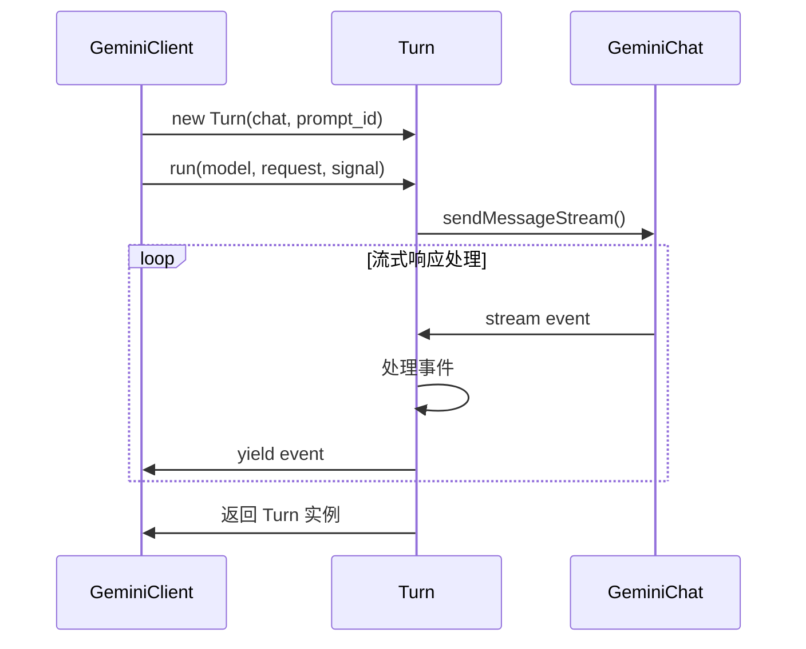

# Turn 源码分析

## 概述

`Turn` 类是 Gemini CLI 中管理单个对话轮次的核心组件，负责处理与 Gemini
API 的单次交互循环，包括流式响应处理、工具调用管理、事件分发等关键功能。

## 文件位置

`packages/core/src/core/turn.ts`

---

## 1. 类型系统与事件架构

### 1.1 GeminiEventType 枚举

```typescript
export enum GeminiEventType {
  Content = 'content', // 内容响应
  ToolCallRequest = 'tool_call_request', // 工具调用请求
  ToolCallResponse = 'tool_call_response', // 工具调用响应
  ToolCallConfirmation = 'tool_call_confirmation', // 工具调用确认
  UserCancelled = 'user_cancelled', // 用户取消
  Error = 'error', // 错误事件
  ChatCompressed = 'chat_compressed', // 聊天压缩
  Thought = 'thought', // 思考过程
  MaxSessionTurns = 'max_session_turns', // 达到最大轮次
  Finished = 'finished', // 完成
  LoopDetected = 'loop_detected', // 检测到循环
  Citation = 'citation', // 引用信息
  Retry = 'retry', // 重试
  ContextWindowWillOverflow = 'context_window_will_overflow', // 上下文窗口溢出
  InvalidStream = 'invalid_stream', // 无效流
}
```

**事件设计特点：**

- **完整覆盖**：涵盖对话过程中的所有可能状态
- **类型安全**：每种事件都有对应的类型定义
- **可观测性**：支持详细的事件追踪和调试

### 1.2 核心事件类型

#### 内容事件

```typescript
export type ServerGeminiContentEvent = {
  type: GeminiEventType.Content;
  value: string; // 响应内容
  traceId?: string; // 追踪ID
};
```

#### 工具调用事件

```typescript
export interface ToolCallRequestInfo {
  callId: string; // 调用ID
  name: string; // 工具名称
  args: Record<string, unknown>; // 参数
  isClientInitiated: boolean; // 是否客户端发起
  prompt_id: string; // 提示ID
}

export interface ToolCallResponseInfo {
  callId: string; // 调用ID
  responseParts: Part[]; // 响应部分
  resultDisplay: ToolResultDisplay | undefined; // 结果显示
  error: Error | undefined; // 错误信息
  errorType: ToolErrorType | undefined; // 错误类型
  outputFile?: string | undefined; // 输出文件
  contentLength?: number; // 内容长度
}
```

#### 思考事件

```typescript
export type ServerGeminiThoughtEvent = {
  type: GeminiEventType.Thought;
  value: ThoughtSummary; // 思考摘要
  traceId?: string; // 追踪ID
};
```

---

## 2. Turn 类架构分析

### 2.1 类定义与属性

```typescript
export class Turn {
  readonly pendingToolCalls: ToolCallRequestInfo[] = []; // 待处理的工具调用
  private debugResponses: GenerateContentResponse[] = []; // 调试响应记录
  private pendingCitations = new Set<string>(); // 待处理的引用
  finishReason: FinishReason | undefined = undefined; // 完成原因

  constructor(
    private readonly chat: GeminiChat, // 聊天实例
    private readonly prompt_id: string, // 提示ID
  ) {}
}
```

**设计特点：**

- **状态管理**：维护工具调用、引用、完成状态
- **依赖注入**：通过构造函数注入 GeminiChat 实例
- **调试支持**：记录所有响应用于问题排查

### 2.2 核心方法

#### run() - 主执行方法

```typescript
async *run(
  model: string,
  req: PartListUnion,
  signal: AbortSignal,
): AsyncGenerator<ServerGeminiStreamEvent>
```

**方法特点：**

- **异步生成器**：使用 `async *` 实现流式事件输出
- **模型参数化**：支持指定使用的模型
- **可中断**：通过 AbortSignal 支持取消操作

---

## 3. 执行流程详解

### 3.1 请求执行与调试

```typescript
// 调试日志 - 记录实际与模型交互的信息
debugLogger.error(
  '我是真的和模型交互了实用的模型：' +
    model +
    '\n 请求 \n' +
    JSON.stringify(req, null, 2) +
    '\n signal \n' +
    JSON.stringify(signal, null, 2),
);

// 发送消息流
const responseStream = await this.chat.sendMessageStream(
  model,
  {
    message: req,
    config: {
      abortSignal: signal,
    },
  },
  this.prompt_id,
);
```

**关键点：**

- **调试友好**：详细记录请求参数和模型信息
- **配置传递**：将 AbortSignal 传递给底层聊天实例
- **流式处理**：获取响应流进行逐步处理

### 3.2 流式响应处理循环

```typescript
for await (const streamEvent of responseStream) {
  // 1. 取消检查
  if (signal?.aborted) {
    yield { type: GeminiEventType.UserCancelled };
    return;
  }

  // 2. 重试事件处理
  if (streamEvent.type === 'retry') {
    yield { type: GeminiEventType.Retry };
    continue;
  }

  // 3. 获取响应内容
  const resp = streamEvent.value as GenerateContentResponse;
  if (!resp) continue;

  this.debugResponses.push(resp);
  const traceId = resp.responseId;

  // 4. 处理不同类型的响应...
}
```

### 3.3 响应类型处理

#### 思考处理 (Thought Processing)

```typescript
const thoughtPart = resp.candidates?.[0]?.content?.parts?.[0];
if (thoughtPart?.thought) {
  const thought = parseThought(thoughtPart.text ?? '');
  yield {
    type: GeminiEventType.Thought,
    value: thought,
    traceId,
  };
  continue;
}
```

#### 内容处理 (Content Processing)

```typescript
const text = getResponseText(resp);
if (text) {
  yield { type: GeminiEventType.Content, value: text, traceId };
}
```

#### 工具调用处理 (Function Call Processing)

```typescript
const functionCalls = resp.functionCalls ?? [];
for (const fnCall of functionCalls) {
  const event = this.handlePendingFunctionCall(fnCall);
  if (event) {
    yield event;
  }
}
```

#### 引用处理 (Citation Processing)

```typescript
for (const citation of getCitations(resp)) {
  this.pendingCitations.add(citation);
}
```

### 3.4 完成状态处理

```typescript
const finishReason = resp.candidates?.[0]?.finishReason;

if (finishReason) {
  // 输出待处理的引用
  if (this.pendingCitations.size > 0) {
    yield {
      type: GeminiEventType.Citation,
      value: `Citations:\n${[...this.pendingCitations].sort().join('\n')}`,
    };
    this.pendingCitations.clear();
  }

  // 设置完成原因并发出完成事件
  this.finishReason = finishReason;
  yield {
    type: GeminiEventType.Finished,
    value: {
      reason: finishReason,
      usageMetadata: resp.usageMetadata,
    },
  };
}
```

---

## 4. 工具调用处理机制

### 4.1 handlePendingFunctionCall() 方法

```typescript
private handlePendingFunctionCall(
  fnCall: FunctionCall,
): ServerGeminiStreamEvent | null {
  // 1. 生成唯一调用ID
  const callId =
    fnCall.id ??
    `${fnCall.name}-${Date.now()}-${Math.random().toString(16).slice(2)}`;

  // 2. 提取参数
  const name = fnCall.name || 'undefined_tool_name';
  const args = (fnCall.args || {}) as Record<string, unknown>;

  // 3. 创建工具调用请求
  const toolCallRequest: ToolCallRequestInfo = {
    callId,
    name,
    args,
    isClientInitiated: false,  // 模型发起的调用
    prompt_id: this.prompt_id,
  };

  // 4. 添加到待处理队列
  this.pendingToolCalls.push(toolCallRequest);

  // 5. 返回请求事件
  return { type: GeminiEventType.ToolCallRequest, value: toolCallRequest };
}
```

**设计亮点：**

- **ID 生成**：支持模型提供ID或自动生成
- **参数处理**：安全的参数提取和类型转换
- **状态追踪**：维护待处理工具调用队列
- **事件驱动**：通过事件通知上层处理工具调用

---

## 5. 错误处理与容错机制

### 5.1 多层次错误处理

```typescript
try {
  // 主执行逻辑...
} catch (e) {
  // 1. 用户取消检查
  if (signal.aborted) {
    yield { type: GeminiEventType.UserCancelled };
    return;
  }

  // 2. 无效流错误
  if (e instanceof InvalidStreamError) {
    yield { type: GeminiEventType.InvalidStream };
    return;
  }

  // 3. 友好错误转换
  const error = toFriendlyError(e);

  // 4. 未授权错误直接抛出
  if (error instanceof UnauthorizedError) {
    throw error;
  }

  // 5. 构建上下文并报告错误
  const contextForReport = [
    ...this.chat.getHistory(/*curated*/ true),
    createUserContent(req),
  ];

  await reportError(
    error,
    'Error when talking to Gemini API',
    contextForReport,
    'Turn.run-sendMessageStream',
  );

  // 6. 构建结构化错误
  const structuredError: StructuredError = {
    message: getErrorMessage(error),
    status: extractStatusCode(error),
  };

  // 7. 可能包含模式深度上下文
  await this.chat.maybeIncludeSchemaDepthContext(structuredError);

  // 8. 发出错误事件
  yield { type: GeminiEventType.Error, value: { error: structuredError } };
}
```

### 5.2 错误分类处理

**取消错误**：

- 检查 `signal.aborted` 状态
- 发出 `UserCancelled` 事件
- 优雅退出

**流错误**：

- 捕获 `InvalidStreamError`
- 发出 `InvalidStream` 事件
- 触发上层重试机制

**API 错误**：

- 友好错误转换
- 详细上下文记录
- 结构化错误响应

**授权错误**：

- 直接向上抛出
- 不进行包装处理

---

## 6. 引用处理机制

### 6.1 getCitations() 函数

```typescript
function getCitations(resp: GenerateContentResponse): string[] {
  return (resp.candidates?.[0]?.citationMetadata?.citations ?? [])
    .filter((citation) => citation.uri !== undefined)
    .map((citation) => {
      if (citation.title) {
        return `(${citation.title}) ${citation.uri}`;
      }
      return citation.uri!;
    });
}
```

**处理逻辑：**

- **安全提取**：使用可选链和默认值避免空指针
- **格式化**：支持带标题和无标题的引用格式
- **去重**：通过 Set 数据结构自动去重

### 6.2 引用输出时机

```typescript
// 在响应完成时输出所有累积的引用
if (this.pendingCitations.size > 0) {
  yield {
    type: GeminiEventType.Citation,
    value: `Citations:\n${[...this.pendingCitations].sort().join('\n')}`,
  };
  this.pendingCitations.clear();
}
```

---

## 7. 调试与可观测性

### 7.1 调试响应记录

```typescript
getDebugResponses(): GenerateContentResponse[] {
  return this.debugResponses;
}
```

**用途：**

- **问题排查**：保留所有原始响应用于调试
- **性能分析**：分析响应时间和内容
- **质量监控**：评估模型响应质量

### 7.2 追踪ID支持

```typescript
const traceId = resp.responseId;

yield {
  type: GeminiEventType.Content,
  value: text,
  traceId,  // 包含追踪ID
};
```

**好处：**

- **请求关联**：将事件与特定请求关联
- **分布式追踪**：支持跨服务的追踪
- **日志聚合**：便于日志系统聚合相关事件

---

## 8. 与 GeminiClient 的协作关系

### 8.1 生命周期管理



### 8.2 事件传递

- **Turn** 负责与 GeminiChat 交互
- **GeminiClient** 接收 Turn 产生的事件
- **事件类型**决定 GeminiClient 的后续处理逻辑

### 8.3 状态同步

- Turn 的 `pendingToolCalls` 被 GeminiClient 读取
- `finishReason` 用于判断对话是否结束
- 调试信息可供上层系统使用

---

## 9. 设计模式分析

### 9.1 生成器模式 (Generator Pattern)

**优势：**

- **流式处理**：支持大型响应的渐进式处理
- **内存友好**：避免一次性加载所有数据
- **可中断**：支持随时停止生成过程

### 9.2 事件驱动模式 (Event-Driven Pattern)

**特点：**

- **解耦设计**：事件生产者和消费者解耦
- **可扩展性**：容易添加新的事件类型
- **可测试性**：事件可以独立测试

### 9.3 状态机模式 (State Machine Pattern)

**状态流转：**

```
初始化 → 执行中 → [工具调用] → 完成/错误
```

---

## 10. 总结

### 10.1 核心价值

1. **单一职责**：专注于单个对话轮次的管理
2. **事件驱动**：通过结构化事件提供良好的可观测性
3. **错误恢复**：完善的错误处理和分类机制
4. **工具集成**：seamless的工具调用处理
5. **流式响应**：高效的流式数据处理

### 10.2 架构优势

- **模块化设计**：与 GeminiClient 清晰分工
- **类型安全**：完整的 TypeScript 类型系统
- **可扩展性**：容易添加新的响应类型处理
- **调试友好**：丰富的调试信息和追踪能力

### 10.3 使用场景

- **对话管理**：管理用户与AI的单次交互
- **工具调用**：处理模型请求的工具执行
- **流式UI**：为前端提供实时更新的数据流
- **错误处理**：提供详细的错误信息和恢复机制

Turn 类是 Gemini
CLI 中的关键组件，它将复杂的流式API交互抽象为清晰的事件流，为上层应用提供了稳定可靠的对话轮次管理能力。
