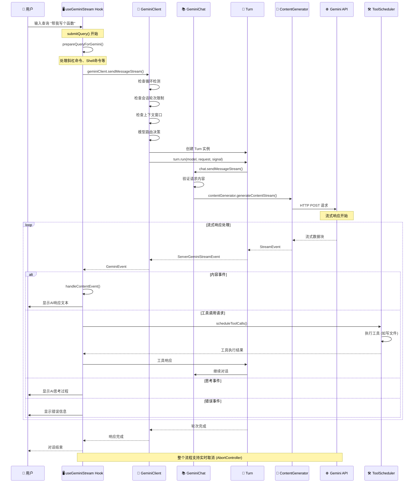
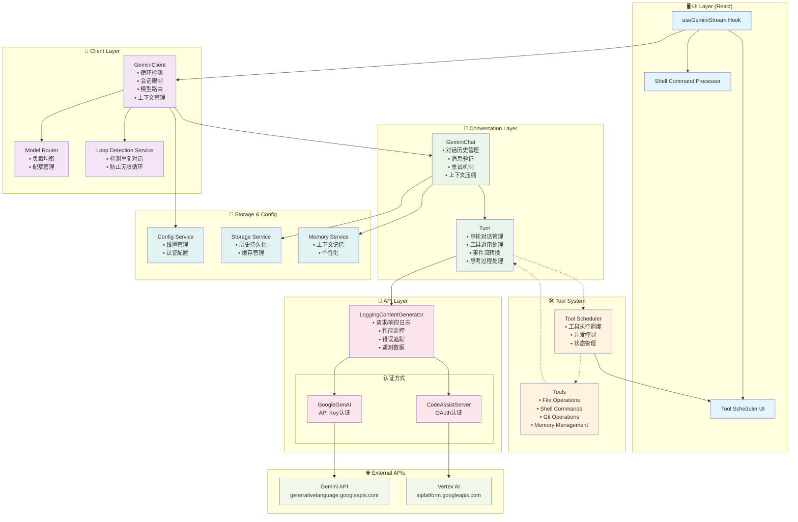

# submitQuery 调用链路完整分析

## 概述

本文档深入分析了 Gemini CLI 中 `useGeminiStream.ts` 的 `submitQuery`
方法的完整调用链路，从用户输入到最终 API 调用的全过程，以及涉及的核心概念和架构设计。

## 1. submitQuery 方法核心逻辑流程

### 方法位置

- **文件**: `/packages/cli/src/ui/hooks/useGeminiStream.ts`
- **行号**: 818-995

### 主要执行步骤

1. **状态检查**: 检查是否已在响应中且非续传模式
2. **预处理用户输入**: 调用 `prepareQueryForGemini()` 处理各种命令类型
   - 斜杠命令 (Slash Commands)
   - Shell 命令
   - @ 命令 (At Commands)
3. **调用 Gemini API**: `geminiClient.sendMessageStream()` 获取流式响应
4. **处理事件流**: `processGeminiStreamEvents()` 处理各种响应事件
5. **循环检测处理**: 处理潜在的无限循环情况

## 2. 完整调用链路分析

### 调用链路图

```
useGeminiStream.submitQuery()
    ↓
GeminiClient.sendMessageStream()
    ↓
Turn.run()
    ↓
GeminiChat.sendMessageStream()
    ↓
GeminiChat.makeApiCallAndProcessStream()
    ↓
LoggingContentGenerator.generateContentStream()
    ↓
GoogleGenAI.models.generateContentStream() 或 CodeAssistServer.generateContentStream()
    ↓
HTTP Request to Gemini API
```

### 各层详细说明

#### **第1层: useGeminiStream Hook**

**文件位置**: `/packages/cli/src/ui/hooks/useGeminiStream.ts:893`

```typescript
const stream = geminiClient.sendMessageStream(
  queryToSend,
  abortSignal,
  prompt_id!,
);
```

#### **第2层: GeminiClient.sendMessageStream**

**文件位置**: `/packages/core/src/core/client.ts:403-610`

**主要职责**:

- 🔄 **循环检测**: 重置循环检测器，防止无限对话
- 📏 **会话限制**: 检查是否超过最大会话轮数
- 🗜️ **Token 管理**: 检查上下文窗口是否会溢出
- 🗜️ **聊天压缩**: 如果需要，压缩聊天历史
- 💻 **IDE 上下文**: 添加 IDE 编辑器状态信息
- 🚦 **模型路由**: 决定使用哪个模型

**关键调用**:

```typescript
// 第 532 行
const resultStream = turn.run(modelToUse, request, linkedSignal);
```

#### **第3层: Turn.run**

**文件位置**: `/packages/core/src/core/turn.ts:230-371`

**主要职责**:

- 🔄 **流事件处理**: 将底层 API 响应转换为上层事件
- 🛠️ **工具调用管理**: 处理函数调用请求
- 💭 **思考模式**: 处理模型的思考过程
- 📎 **引用处理**: 管理响应中的引用信息

**关键调用**:

```typescript
// 第 246 行
const responseStream = await this.chat.sendMessageStream(
  model,
  {
    message: req,
    config: {
      abortSignal: signal,
    },
  },
  this.prompt_id,
);
```

#### **第4层: GeminiChat.sendMessageStream**

**文件位置**: `/packages/core/src/core/geminiChat.ts:229-347`

**主要职责**:

- 📜 **历史管理**: 维护对话历史
- 🔁 **重试机制**: 处理无效内容的重试逻辑
- ✅ **内容验证**: 验证响应内容的有效性
- 📊 **消息记录**: 记录对话内容用于分析

**关键调用**:

```typescript
// 第 287 行
const stream = await self.makeApiCallAndProcessStream(
  model,
  requestContents,
  currentParams,
  prompt_id,
);
```

#### **第5层: GeminiChat.makeApiCallAndProcessStream**

**文件位置**: `/packages/core/src/core/geminiChat.ts:349-393`

**主要职责**:

- 🎯 **模型选择**: 根据配置选择有效模型
- 📊 **配额检查**: 检查是否发生配额错误
- 🔁 **重试逻辑**: 使用指数退避重试机制
- ⬇️ **降级处理**: 处理 429 错误和降级逻辑

**关键调用**:

```typescript
// 第 370 行
return this.config.getContentGenerator().generateContentStream(
  {
    model: modelToUse,
    contents: requestContents,
    config: { ...this.generationConfig, ...params.config },
  },
  prompt_id,
);
```

#### **第6层: LoggingContentGenerator.generateContentStream**

**文件位置**: `/packages/core/src/core/loggingContentGenerator.ts:221-266`

**主要职责**:

- 📝 **请求日志**: 记录 API 请求详情
- 📝 **响应日志**: 记录 API 响应和性能指标
- ❌ **错误日志**: 记录 API 错误信息
- 📈 **遥测数据**: 收集使用统计信息

**关键调用**:

```typescript
// 第 241 行
stream = await this.wrapped.generateContentStream(req, userPromptId);
```

#### **第7层: 实际的 ContentGenerator**

根据认证类型，有两种实现：

##### **7a. GoogleGenAI (API Key 方式)**

**文件位置**: `/packages/core/src/core/contentGenerator.ts:152-157`

当使用 Gemini API Key 或 Vertex AI 时，最终调用 Google 官方的 `@google/genai`
SDK，发送 HTTP 请求到:

- **Gemini API**: `https://generativelanguage.googleapis.com`
- **Vertex AI**: `https://{location}-aiplatform.googleapis.com`

##### **7b. CodeAssistServer (OAuth 方式)**

**文件位置**: `/packages/core/src/code_assist/server.ts`

当使用 Google OAuth 登录时，请求通过内部的 CodeAssistServer 路由。

## 3. 核心概念详解

### 概念层次关系

```
🏢 GeminiClient (客户端总控)
    ├── 📚 GeminiChat (会话管理器)
    ├── 🔄 Turn (对话轮次)
    └── 🔧 ToolScheduler (工具调度器)

📡 ContentGenerator (API调用层)
    ├── 🪵 LoggingContentGenerator (日志装饰器)
    └── 🌐 GoogleGenAI/CodeAssistServer (实际API)
```

### 各概念详细说明

#### **🏢 GeminiClient**

**文件位置**: `/packages/core/src/core/client.ts`

**职责**: 整个AI客户端的总控制器

**核心功能**:

- 🔄 **循环检测**: 防止AI陷入无限对话循环
- 📏 **会话限制**: 控制每个会话的最大轮次
- 🗜️ **聊天压缩**: 当上下文过长时自动压缩历史
- 🚦 **模型路由**: 根据负载和配额选择合适的模型
- 💾 **状态管理**: 跟踪当前会话状态

#### **📚 GeminiChat**

**文件位置**: `/packages/core/src/core/geminiChat.ts`

**职责**: 单个对话会话的管理器

**核心功能**:

- 📜 **历史维护**: 管理完整的对话历史记录
- 🔁 **重试机制**: 处理API调用失败的重试逻辑
- ✅ **内容验证**: 验证AI响应内容的有效性
- 📊 **配额管理**: 处理API配额限制和降级

#### **🔄 Turn**

**文件位置**: `/packages/core/src/core/turn.ts`

**职责**: 单次对话轮次的完整生命周期管理

**核心功能**:

- 🔄 **Agent循环**: 管理 用户输入→AI思考→工具调用→最终响应 的完整循环
- 🛠️ **工具调用**: 处理AI主动调用工具的请求和响应
- 💭 **思考处理**: 处理AI的思考过程显示
- 📎 **引用管理**: 管理响应中的引用和来源信息

#### **📡 ContentGenerator 层**

- **LoggingContentGenerator**: 装饰器模式，为API调用添加日志、监控、遥测功能
- **GoogleGenAI/CodeAssistServer**: 实际的API调用实现

## 4. 运行时序图



## 5. 系统架构图



## 6. 各层组件详细说明

### **🖥️ UI Layer (用户界面层)**

- **useGeminiStream Hook**: React Hook，管理整个对话流程的状态和事件
- **Shell Command Processor**: 处理Shell命令执行
- **Tool Scheduler UI**: 工具调用的用户界面展示

### **🏢 Client Layer (客户端层)**

- **GeminiClient**:
  - 🔄 **循环检测**: 使用算法检测并防止AI陷入重复对话循环
  - 📏 **会话限制**: 控制单个会话的最大轮次，防止过度消耗
  - 🚦 **模型路由**: 根据负载、配额、性能选择最优模型
  - 🗜️ **上下文管理**: 智能压缩长对话历史，保持重要信息
- **Model Router**: 负载均衡器，处理多模型切换
- **Loop Detection Service**: 专门的循环检测服务

### **💬 Conversation Layer (对话层)**

- **GeminiChat**:
  - 📜 **对话历史**: 维护完整的对话记录，支持上下文连续性
  - ✅ **消息验证**: 确保消息格式正确，内容安全
  - 🔁 **重试机制**: 智能重试失败的API调用，包含指数退避
  - 🗜️ **压缩机制**: 当对话过长时自动压缩历史，保留关键信息
- **Turn**:
  - 🔄 **Agent循环**: 完整的"输入→思考→工具→响应"循环管理
  - 🛠️ **工具编排**: 处理AI主动调用工具的完整生命周期
  - 💭 **思考显示**: 展示AI的推理过程给用户
  - 📎 **引用管理**: 处理AI响应中的来源引用

### **🛠️ Tool System (工具系统)**

- **Tool Scheduler**:
  - ⚡ **并发执行**: 支持多个工具并行执行
  - 🎯 **状态跟踪**: 跟踪每个工具调用的执行状态
  - ⏱️ **超时控制**: 防止工具执行时间过长
- **Tools**: 各种具体工具实现（文件操作、Shell命令等）

### **📡 API Layer (API层)**

- **LoggingContentGenerator**:
  - 🪵 **全链路日志**: 记录完整的请求/响应日志
  - 📊 **性能监控**: 跟踪API调用的延迟和成功率
  - 🔍 **错误追踪**: 详细的错误信息和堆栈跟踪
  - 📈 **遥测数据**: 收集使用统计和性能指标

### **🌐 External APIs (外部API)**

- **Gemini API**: Google的生成式AI API
- **Vertex AI**: Google Cloud的企业级AI平台

### **💾 Storage & Config (存储和配置)**

- **Config Service**: 管理所有配置项，包括API密钥、模型选择等
- **Storage Service**: 持久化对话历史、用户设置等
- **Memory Service**: 长期记忆管理，个性化用户体验

## 7. 关键设计亮点

### **🏗️ 架构设计**

- **分层架构**: 清晰的职责分离，易于维护和扩展
- **装饰器模式**: LoggingContentGenerator 为底层 API 调用添加功能
- **观察者模式**: 事件驱动的流式处理机制

### **⚡ 性能优化**

- **流式处理**: 使用 AsyncGenerator 实现实时响应
- **并发控制**: 工具调用支持并行执行
- **智能压缩**: 上下文自动压缩保持性能

### **🛡️ 容错机制**

- **多层重试**: 从 Chat 层到 API 层的重试机制
- **降级处理**: 配额限制时的自动降级
- **循环检测**: 防止AI陷入无限对话循环
- **超时控制**: 防止长时间阻塞

### **🔍 可观测性**

- **全链路日志**: 完整的请求/响应跟踪
- **性能监控**: 延迟、成功率等关键指标
- **错误追踪**: 详细的错误信息和上下文
- **遥测数据**: 使用统计和性能分析

### **🔧 工具系统**

- **完整生命周期**: 从请求到执行到响应的完整管理
- **状态跟踪**: 实时显示工具执行状态
- **并发执行**: 支持多个工具同时运行
- **安全控制**: 工具执行的权限和沙箱限制

## 8. 待确认的技术细节

基于分析，以下几个方面需要进一步确认：

1. **循环检测算法**: 具体的检测逻辑和阈值设置
2. **模型路由策略**: 模型选择的决策算法
3. **上下文压缩**: 压缩算法的具体实现
4. **工具调用安全**: 安全限制和沙箱机制
5. **性能优化**: 高并发场景下的优化策略

## 9. 结论

Gemini CLI 的 `submitQuery`
调用链展现了一个成熟的企业级 AI 应用架构，具备了生产环境所需的各种特性：

- ✅ **完整的分层设计**
- ✅ **强大的容错能力**
- ✅ **优秀的可观测性**
- ✅ **灵活的工具系统**
- ✅ **高性能的流式处理**

这个架构不仅支持当前的功能需求，还为未来的扩展和优化提供了良好的基础。

---

**文档版本**: v1.0 **创建时间**: 2024-11-18 **分析范围**: Gemini CLI
submitQuery 完整调用链路
