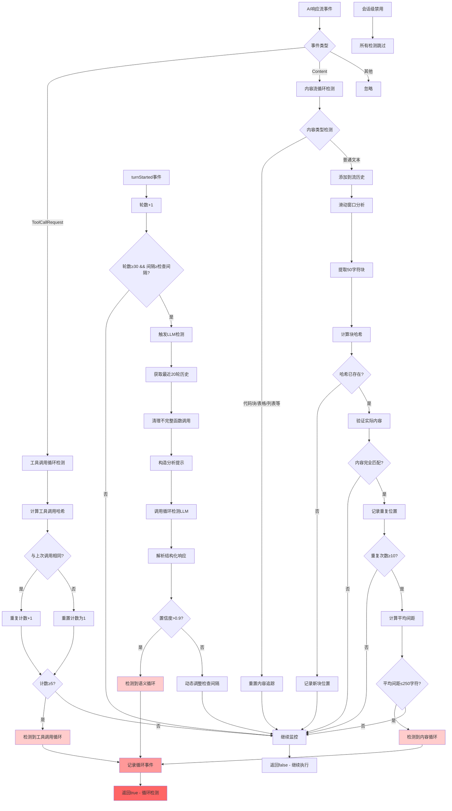

# LoopDetectionService 源码深度分析

> **文件路径**: `packages/core/src/services/loopDetectionService.ts` **作者**:
> Google LLC **许可证**: Apache-2.0 **分析日期**: 2025-11-18

## 📋 目录

- [1. 概述](#1-概述)
- [2. 整体架构设计](#2-整体架构设计)
- [3. 三层检测机制详解](#3-三层检测机制详解)
  - [3.1 工具调用循环检测](#31-工具调用循环检测)
  - [3.2 内容流循环检测](#32-内容流循环检测)
  - [3.3 LLM语义循环检测](#33-llm语义循环检测)
- [4. 核心算法原理](#4-核心算法原理)
- [5. 工作流程图](#5-工作流程图)
- [6. 技术亮点总结](#6-技术亮点总结)
- [7. 性能与优化](#7-性能与优化)

---

## 1. 概述

`LoopDetectionService` 是 Google Gemini AI
CLI 中的核心安全组件，专门用于检测和防止AI在对话中陷入**无限循环**或**无意义重复**。这是一个高度成熟的工程化产品，体现了Google在AI系统稳定性和安全性方面的深度思考。

### 1.1 主要功能

- **实时循环检测**: 在AI响应流中实时监控循环模式
- **多层次防护**: 从简单重复到复杂语义循环的全面覆盖
- **智能误报控制**: 区分合理重复与真正的无意义循环
- **资源优化**: 平衡检测准确性与计算资源消耗

### 1.2 核心常量配置

```typescript
const TOOL_CALL_LOOP_THRESHOLD = 5; // 工具调用重复阈值
const CONTENT_LOOP_THRESHOLD = 10; // 内容重复阈值
const CONTENT_CHUNK_SIZE = 50; // 内容块大小
const MAX_HISTORY_LENGTH = 5000; // 最大历史长度
const LLM_CHECK_AFTER_TURNS = 30; // LLM检测触发轮数
const DEFAULT_LLM_CHECK_INTERVAL = 3; // 默认LLM检测间隔
```

---

## 2. 整体架构设计

### 2.1 设计原则

**渐进式复杂度**: 从简单快速的检测开始，逐步升级到资源密集但更精确的检测方法。

```
第一层: 工具调用检测 (O(1), ~1ms)
    ↓
第二层: 内容流检测 (O(n), ~10ms)
    ↓
第三层: LLM语义检测 (O(history), ~1000ms)
```

**上下文感知**: 智能识别不同内容类型，避免在代码块、表格等结构化内容中误报。

**自适应机制**: 根据检测结果动态调整检测频率和敏感度。

### 2.2 核心类结构

```typescript
export class LoopDetectionService {
  // 配置与状态
  private readonly config: Config;
  private promptId: string;
  private disabledForSession: boolean = false;

  // 工具调用追踪
  private lastToolCallKey: string | null = null;
  private toolCallRepetitionCount: number = 0;

  // 内容流追踪
  private streamContentHistory: string = '';
  private contentStats = new Map<string, number[]>();
  private lastContentIndex: number = 0;
  private inCodeBlock: boolean = false;

  // LLM检测追踪
  private turnsInCurrentPrompt: number = 0;
  private llmCheckInterval: number = DEFAULT_LLM_CHECK_INTERVAL;
  private lastCheckTurn: number = 0;
}
```

---

## 3. 三层检测机制详解

### 3.1 工具调用循环检测

#### 核心算法

**文件位置**: `checkToolCallLoop()` - `loopDetectionService.ts:176-195`

```typescript
private checkToolCallLoop(toolCall: { name: string; args: object }): boolean {
  const key = this.getToolCallKey(toolCall);  // 生成唯一标识

  if (this.lastToolCallKey === key) {
    this.toolCallRepetitionCount++;          // 相同调用，计数+1
  } else {
    this.lastToolCallKey = key;
    this.toolCallRepetitionCount = 1;        // 不同调用，重置计数
  }

  if (this.toolCallRepetitionCount >= TOOL_CALL_LOOP_THRESHOLD) {
    logLoopDetected(this.config, new LoopDetectedEvent(
      LoopType.CONSECUTIVE_IDENTICAL_TOOL_CALLS,
      this.promptId
    ));
    return true;
  }
  return false;
}
```

#### 关键技术点

**1. 哈希标识生成**

```typescript
private getToolCallKey(toolCall: { name: string; args: object }): string {
  const argsString = JSON.stringify(toolCall.args);
  const keyString = `${toolCall.name}:${argsString}`;
  return createHash('sha256').update(keyString).digest('hex');
}
```

**2. 检测特点**

- ✅ **快速响应**: O(1)时间复杂度
- ✅ **精确匹配**: 工具名称+参数完全相同才算重复
- ✅ **连续检测**: 只检测连续的重复调用
- ⚠️ **局限性**: 无法检测交替模式 (A→B→A→B...)

---

### 3.2 内容流循环检测

这是最复杂的检测机制，使用**滑动窗口 + 哈希匹配**算法。

#### 3.2.1 内容类型过滤

**文件位置**: `checkContentLoop()` - `loopDetectionService.ts:208-244`

````typescript
private checkContentLoop(content: string): boolean {
  // 检测各种内容类型
  const numFences = (content.match(/```/g) ?? []).length;        // 代码块
  const hasTable = /(^|\n)\s*(\|.*\||[|+-]{3,})/.test(content); // 表格
  const hasListItem = /(^|\n)\s*[*-+]\s/.test(content);         // 列表
  const hasHeading = /(^|\n)#+\s/.test(content);                // 标题
  const hasBlockquote = /(^|\n)>\s/.test(content);              // 引用
  const isDivider = /^[+-_=*\u2500-\u257F]+$/.test(content);    // 分割线

  // 遇到结构化内容时重置追踪，避免跨边界误判
  if (numFences || hasTable || hasListItem || hasHeading || hasBlockquote || isDivider) {
    this.resetContentTracking();
  }

  // 代码块内容跳过检测
  this.inCodeBlock = numFences % 2 === 0 ? this.inCodeBlock : !this.inCodeBlock;
  if (wasInCodeBlock || this.inCodeBlock || isDivider) {
    return false;
  }

  // 执行滑动窗口分析
  this.streamContentHistory += content;
  this.truncateAndUpdate();
  return this.analyzeContentChunksForLoop();
}
````

#### 3.2.2 滑动窗口算法

**文件位置**: `analyzeContentChunksForLoop()` -
`loopDetectionService.ts:288-313`

```typescript
private analyzeContentChunksForLoop(): boolean {
  while (this.hasMoreChunksToProcess()) {
    // 提取固定大小的内容块 (50字符)
    const currentChunk = this.streamContentHistory.substring(
      this.lastContentIndex,
      this.lastContentIndex + CONTENT_CHUNK_SIZE
    );
    const chunkHash = createHash('sha256').update(currentChunk).digest('hex');

    if (this.isLoopDetectedForChunk(currentChunk, chunkHash)) {
      logLoopDetected(this.config, new LoopDetectedEvent(
        LoopType.CHANTING_IDENTICAL_SENTENCES,
        this.promptId
      ));
      return true;
    }

    this.lastContentIndex++; // 滑动窗口向前移动1个字符
  }
  return false;
}
```

#### 3.2.3 循环模式识别

**文件位置**: `isLoopDetectedForChunk()` - `loopDetectionService.ts:332-358`

```typescript
private isLoopDetectedForChunk(chunk: string, hash: string): boolean {
  const existingIndices = this.contentStats.get(hash);

  // 首次出现，记录位置
  if (!existingIndices) {
    this.contentStats.set(hash, [this.lastContentIndex]);
    return false;
  }

  // 验证实际内容匹配（防止hash碰撞）
  if (!this.isActualContentMatch(chunk, existingIndices[0])) {
    return false;
  }

  existingIndices.push(this.lastContentIndex);

  // 检查重复次数
  if (existingIndices.length < CONTENT_LOOP_THRESHOLD) {
    return false;
  }

  // 分析最近出现位置的密集程度
  const recentIndices = existingIndices.slice(-CONTENT_LOOP_THRESHOLD);
  const totalDistance = recentIndices[recentIndices.length - 1] - recentIndices[0];
  const averageDistance = totalDistance / (CONTENT_LOOP_THRESHOLD - 1);
  const maxAllowedDistance = CONTENT_CHUNK_SIZE * 5; // 250字符

  return averageDistance <= maxAllowedDistance;
}
```

#### 3.2.4 滑动窗口示例

```
文本流: "ABCDEFGHIJKLMNOPQRSTUVWXYZ0123456789..."
窗口大小: 50字符

窗口1: [0-49]   "ABCDEFGHIJKLMNO...XYZ012345"  → Hash_A
窗口2: [1-50]   "BCDEFGHIJKLMNOP...YZ0123456"  → Hash_B
窗口3: [2-51]   "CDEFGHIJKLMNOPQ...Z01234567"  → Hash_C
...

如果Hash_A在位置[0,250,500,750...]出现10次，且平均间距≤250：检测到循环
```

---

### 3.3 LLM语义循环检测

这是最智能的检测机制，使用另一个LLM进行**元认知分析**。

#### 3.3.1 触发条件

**文件位置**: `turnStarted()` - `loopDetectionService.ts:159-174`

```typescript
async turnStarted(signal: AbortSignal) {
  this.turnsInCurrentPrompt++;

  // 触发条件：
  // 1. 对话轮数 ≥ 30轮
  // 2. 距离上次检查间隔 ≥ llmCheckInterval (3-15轮)
  if (
    this.turnsInCurrentPrompt >= LLM_CHECK_AFTER_TURNS &&
    this.turnsInCurrentPrompt - this.lastCheckTurn >= this.llmCheckInterval
  ) {
    this.lastCheckTurn = this.turnsInCurrentPrompt;
    return await this.checkForLoopWithLLM(signal);
  }
  return false;
}
```

#### 3.3.2 LLM分析系统提示

**文件位置**: `LOOP_DETECTION_SYSTEM_PROMPT` - `loopDetectionService.ts:60-69`

```typescript
const LOOP_DETECTION_SYSTEM_PROMPT = `You are a sophisticated AI diagnostic agent specializing in identifying when a conversational AI is stuck in an unproductive state.

An unproductive state is characterized by one or more of the following patterns over the last 5 or more assistant turns:

Repetitive Actions: The assistant repeats the same tool calls or conversational responses a decent number of times. This includes simple loops (e.g., tool_A, tool_A, tool_A) and alternating patterns (e.g., tool_A, tool_B, tool_A, tool_B, ...).

Cognitive Loop: The assistant seems unable to determine the next logical step. It might express confusion, repeatedly ask the same questions, or generate responses that don't logically follow from the previous turns, indicating it's stuck and not advancing the task.

Crucially, differentiate between a true unproductive state and legitimate, incremental progress.
For example, a series of 'tool_A' or 'tool_B' tool calls that make small, distinct changes to the same file (like adding docstrings to functions one by one) is considered forward progress and is NOT a loop.`;
```

#### 3.3.3 结构化分析流程

**文件位置**: `checkForLoopWithLLM()` - `loopDetectionService.ts:396-473`

```typescript
private async checkForLoopWithLLM(signal: AbortSignal) {
  // 1. 获取最近20轮对话历史
  const recentHistory = this.config
    .getGeminiClient()
    .getHistory()
    .slice(-LLM_LOOP_CHECK_HISTORY_COUNT);

  // 2. 清理不完整的函数调用/响应对
  const trimmedHistory = this.trimRecentHistory(recentHistory);

  // 3. 构造结构化响应Schema
  const schema = {
    type: 'object',
    properties: {
      unproductive_state_analysis: {
        type: 'string',
        description: 'Your reasoning on if the conversation is looping without forward progress.'
      },
      unproductive_state_confidence: {
        type: 'number',
        description: 'A number between 0.0 and 1.0 representing your confidence...'
      }
    }
  };

  // 4. 调用专用的循环检测LLM
  const result = await this.config.getBaseLlmClient().generateJson({
    modelConfigKey: { model: 'loop-detection' },
    contents,
    schema,
    systemInstruction: LOOP_DETECTION_SYSTEM_PROMPT,
    abortSignal: signal,
    promptId: this.promptId
  });

  // 5. 分析结果并动态调整
  if (result['unproductive_state_confidence'] > 0.9) {
    // 高置信度 → 报告循环
    return true;
  } else {
    // 动态调整检查间隔
    this.llmCheckInterval = Math.round(
      MIN_LLM_CHECK_INTERVAL +
      (MAX_LLM_CHECK_INTERVAL - MIN_LLM_CHECK_INTERVAL) *
      (1 - result['unproductive_state_confidence'])
    );
  }
  return false;
}
```

#### 3.3.4 动态间隔调整算法

```typescript
// 置信度 → 检查间隔映射
// 置信度越高 → 检查越频繁

confidence = 0.1  →  interval = 5 + 10×(1-0.1) = 14轮 (低风险，少检查)
confidence = 0.5  →  interval = 5 + 10×(1-0.5) = 10轮 (中等风险)
confidence = 0.9  →  interval = 5 + 10×(1-0.9) = 6轮  (高风险，频繁检查)
confidence > 0.9  →  立即报告循环
```

---

## 4. 核心算法原理

### 4.1 内存优化算法

**智能截断 + 索引重映射**

```typescript
private truncateAndUpdate(): void {
  if (this.streamContentHistory.length <= MAX_HISTORY_LENGTH) {
    return;
  }

  // 计算需要删除的内容长度
  const truncationAmount = this.streamContentHistory.length - MAX_HISTORY_LENGTH;

  // 截断历史内容
  this.streamContentHistory = this.streamContentHistory.slice(truncationAmount);

  // 调整当前索引位置
  this.lastContentIndex = Math.max(0, this.lastContentIndex - truncationAmount);

  // 重新映射所有哈希对应的位置索引
  for (const [hash, oldIndices] of this.contentStats.entries()) {
    const adjustedIndices = oldIndices
      .map((index) => index - truncationAmount)
      .filter((index) => index >= 0);  // 移除无效索引

    if (adjustedIndices.length > 0) {
      this.contentStats.set(hash, adjustedIndices);
    } else {
      this.contentStats.delete(hash);  // 清理无效哈希
    }
  }
}
```

### 4.2 哈希冲突防护

**双重验证机制**

```typescript
private isActualContentMatch(currentChunk: string, originalIndex: number): boolean {
  const originalChunk = this.streamContentHistory.substring(
    originalIndex,
    originalIndex + CONTENT_CHUNK_SIZE
  );
  return originalChunk === currentChunk;  // 字符串完全匹配验证
}
```

### 4.3 状态重置策略

```typescript
// 全局重置：新对话开始
reset(promptId: string): void {
  this.promptId = promptId;
  this.resetToolCallCount();    // 重置工具调用计数
  this.resetContentTracking();  // 重置内容追踪
  this.resetLlmCheckTracking(); // 重置LLM检查追踪
  this.loopDetected = false;
}

// 内容追踪重置：遇到结构化内容
private resetContentTracking(resetHistory = true): void {
  if (resetHistory) {
    this.streamContentHistory = '';
  }
  this.contentStats.clear();  // 清空哈希映射
  this.lastContentIndex = 0;
}
```

---

## 5. 工作流程图



---

## 6. 技术亮点总结

### 6.1 核心技术栈

| 技术组件       | 用途                     | 优势                     |
| -------------- | ------------------------ | ------------------------ |
| **SHA256哈希** | 工具调用和内容块唯一标识 | 快速比较、低冲突率       |
| **滑动窗口**   | 流式内容分析             | O(n)时间复杂度、内存可控 |
| **LLM元认知**  | 语义层面循环检测         | 理解上下文、智能判断     |
| **动态阈值**   | 自适应检测频率           | 平衡准确性与性能         |
| **正则表达式** | 内容类型识别             | 精确的结构化内容检测     |

### 6.2 三层检测机制对比

| 检测层次       | 检测目标         | 阈值         | 时间复杂度 | 延迟    | 优点                   | 局限性             |
| -------------- | ---------------- | ------------ | ---------- | ------- | ---------------------- | ------------------ |
| **工具调用层** | 连续相同工具调用 | 5次          | O(1)       | ~1ms    | 响应快速、准确         | 只能检测简单重复   |
| **内容流层**   | 文本内容重复模式 | 10次/250字符 | O(n)       | ~10ms   | 检测文本循环、内存可控 | 可能误报结构化内容 |
| **语义理解层** | 对话语义循环     | 置信度>0.9   | O(history) | ~1000ms | 理解上下文、智能判断   | 延迟高、资源消耗大 |

### 6.3 防误报机制

**1. 内容类型感知**

````typescript
// 检测各种结构化内容类型
const detectors = {
  codeBlock: /```/g,
  table: /(^|\n)\s*(\|.*\||[|+-]{3,})/,
  listItem: /(^|\n)\s*[*-+]\s/,
  heading: /(^|\n)#+\s/,
  blockquote: /(^|\n)>\s/,
  divider: /^[+-_=*\u2500-\u257F]+$/,
};

// 遇到结构化内容时重置追踪
if (hasStructuredContent) {
  this.resetContentTracking();
}
````

**2. 双重验证**

```typescript
// 哈希匹配 + 实际内容验证
if (hash === existingHash && actualContent === originalContent) {
  // 确认为真正的重复
}
```

**3. 上下文边界保护**

```typescript
// 代码块内跳过检测
if (this.inCodeBlock) {
  return false;
}
```

---

## 7. 性能与优化

### 7.1 性能特征

```typescript
// 时间复杂度分析
工具调用检测: O(1); // 哈希计算 + 简单比较
内容流检测: O(n); // n为新增内容长度
LLM检测: O(h); // h为历史对话长度
总体: O(1) + O(n) + O(h); // 渐进式触发
```

### 7.2 内存管理

```typescript
// 内存使用控制
streamContentHistory: ≤ 5000字符    // 固定上限
contentStats: ≤ 100个哈希映射       // 动态清理
llmHistory: ≤ 20轮对话             // 滑动窗口
```

### 7.3 资源优化策略

**1. 延迟加载**

- LLM检测仅在30轮后触发
- 根据置信度动态调整检测频率

**2. 内存回收**

- 定期截断历史内容
- 自动清理无效哈希映射

**3. 计算缓存**

- 哈希结果缓存避免重复计算
- 滑动窗口增量处理

### 7.4 错误处理

```typescript
try {
  result = await this.config.getBaseLlmClient().generateJson({...});
} catch (e) {
  // 静默处理LLM错误，不影响主流程
  this.config.getDebugMode() ? debugLogger.warn(e) : debugLogger.debug(e);
  return false;
}
```

---

## 📋 总结

`LoopDetectionService` 是一个工程化程度极高的AI安全组件，展现了以下技术特点：

### 🎯 **核心价值**

- **多层次防御体系**: 从简单重复到复杂语义循环全面覆盖
- **智能化程度高**: 使用LLM进行元认知分析，理解"真正的进展 vs 无意义循环"
- **工程化成熟**: 内存管理、性能优化、误报控制都考虑周全

### 🚀 **技术创新点**

1. **渐进式复杂度设计**: 从O(1)到O(n)再到O(history)的分层检测
2. **上下文感知的误报控制**: 智能识别代码块、表格等结构化内容
3. **自适应检测机制**: 基于置信度动态调整检测频率
4. **LLM元认知应用**: 用AI监督AI，这是一个前沿的技术思路

### 💡 **工程经验**

- **性能与准确性的平衡**: 通过分层检测机制巧妙平衡
- **内存管理**: 固定缓冲区 + 智能截断算法防止内存泄漏
- **容错设计**: LLM检测失败不影响主流程
- **可维护性**: 清晰的模块划分和状态管理

这个服务可以作为**AI系统稳定性保障**的经典案例，特别适用于长对话、复杂任务场景中防止AI陷入无效循环的解决方案。

---

**参考文献**:

- [Google Gemini API Documentation](https://ai.google.dev/docs)
- [Node.js Crypto Module](https://nodejs.org/api/crypto.html)
- [正则表达式匹配模式](https://developer.mozilla.org/en-US/docs/Web/JavaScript/Guide/Regular_Expressions)
