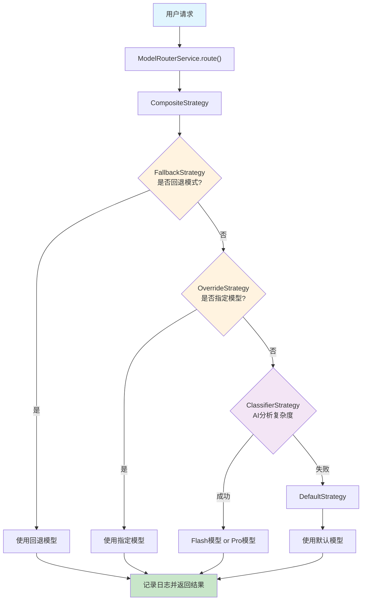

# Routing 系统源码分析

## 概述

`packages/core/src/routing/` 文件夹包含了 Gemini
CLI 项目中的模型路由系统，负责根据不同的上下文和策略来选择合适的模型进行 API 调用。该系统采用了策略模式和责任链模式的设计，提供了灵活且可扩展的路由决策机制。

## 文件结构

```
routing/
├── modelRouterService.ts          # 核心路由服务
├── modelRouterService.test.ts     # 路由服务测试
├── routingStrategy.ts             # 路由策略接口定义
└── strategies/
    ├── classifierStrategy.ts      # AI 分类器策略
    ├── classifierStrategy.test.ts
    ├── compositeStrategy.ts       # 组合策略
    ├── compositeStrategy.test.ts
    ├── defaultStrategy.ts         # 默认策略
    ├── defaultStrategy.test.ts
    ├── fallbackStrategy.ts        # 回退策略
    ├── fallbackStrategy.test.ts
    ├── overrideStrategy.ts        # 覆盖策略
    └── overrideStrategy.test.ts
```

## 核心接口和类定义

### 1. RoutingDecision 接口

```typescript
export interface RoutingDecision {
  /** 要使用的模型标识符 (例如: 'gemini-2.5-pro') */
  model: string;
  /** 路由决策的元数据 */
  metadata: {
    source: string; // 决策来源
    latencyMs: number; // 延迟时间
    reasoning: string; // 决策原因
    error?: string; // 可选的错误信息
  };
}
```

### 2. RoutingContext 接口

```typescript
export interface RoutingContext {
  /** 完整的对话历史 */
  history: Content[];
  /** 当前要处理的请求 */
  request: PartListUnion;
  /** 用于取消 LLM 调用的信号 */
  signal: AbortSignal;
}
```

### 3. RoutingStrategy 接口

```typescript
export interface RoutingStrategy {
  /** 策略名称 (例如: 'fallback', 'override', 'composite') */
  readonly name: string;

  /**
   * 根据给定的请求上下文决定使用哪个模型
   * @returns Promise<RoutingDecision | null> - 路由决策或 null（表示该策略不适用）
   */
  route(
    context: RoutingContext,
    config: Config,
    baseLlmClient: BaseLlmClient,
  ): Promise<RoutingDecision | null>;
}
```

### 4. TerminalStrategy 接口

```typescript
export interface TerminalStrategy extends RoutingStrategy {
  /**
   * 保证返回决策的终端策略（不能返回 null）
   * 用于确保组合链总是能得出结果
   */
  route(
    context: RoutingContext,
    config: Config,
    baseLlmClient: BaseLlmClient,
  ): Promise<RoutingDecision>;
}
```

## 继承关系图

```
RoutingStrategy (interface)
    ├── OverrideStrategy (class)
    ├── FallbackStrategy (class)
    ├── ClassifierStrategy (class)
    └── TerminalStrategy (interface)
            ├── DefaultStrategy (class)
            └── CompositeStrategy (class)
```

### 继承关系说明

1. **基础接口**: `RoutingStrategy` 是所有路由策略的基础接口
2. **普通策略**: `OverrideStrategy`、`FallbackStrategy`、`ClassifierStrategy`
   实现了基础接口，可以返回 `null`
3. **终端策略**: `TerminalStrategy` 继承了
   `RoutingStrategy`，但要求必须返回决策（不能返回 `null`）
4. **终端实现**: `DefaultStrategy` 和 `CompositeStrategy` 实现了
   `TerminalStrategy`

## 核心服务类分析

### ModelRouterService

```typescript
export class ModelRouterService {
  private config: Config;
  private strategy: TerminalStrategy;

  constructor(config: Config) {
    this.config = config;
    this.strategy = this.initializeDefaultStrategy();
  }
}
```

**职责**:

- 作为路由系统的入口点
- 管理路由策略的配置和执行
- 处理路由异常和日志记录
- 提供统一的路由接口

**初始化策略**:

```typescript
private initializeDefaultStrategy(): TerminalStrategy {
  return new CompositeStrategy(
    [
      new FallbackStrategy(),    // 最高优先级
      new OverrideStrategy(),
      new ClassifierStrategy(),
      new DefaultStrategy(),     // 最低优先级（终端策略）
    ],
    'agent-router',
  );
}
```

## 路由策略详细分析

### 1. DefaultStrategy（默认策略）

**文件位置**: `strategies/defaultStrategy.ts:16-33`

**类型**: `TerminalStrategy`

**功能**:

- 作为最后的兜底策略，总是返回默认的 Gemini 模型
- 不依赖任何上下文，保证系统总能做出路由决策

**特点**:

- 延迟为 0（即时返回）
- 使用 `DEFAULT_GEMINI_MODEL` 常量
- 实现了 `TerminalStrategy` 接口，保证不返回 `null`

```typescript
export class DefaultStrategy implements TerminalStrategy {
  readonly name = 'default';

  async route(): Promise<RoutingDecision> {
    return {
      model: DEFAULT_GEMINI_MODEL,
      metadata: {
        source: this.name,
        latencyMs: 0,
        reasoning: `Routing to default model: ${DEFAULT_GEMINI_MODEL}`,
      },
    };
  }
}
```

### 2. OverrideStrategy（覆盖策略）

**文件位置**: `strategies/overrideStrategy.ts:19-42`

**类型**: `RoutingStrategy`

**功能**:

- 处理用户显式指定模型的情况
- 当配置中的模型不是 'auto' 时，直接使用指定的模型

**决策逻辑**:

```typescript
const overrideModel = config.getModel();

// 如果模型是 'auto'，传递给下一个策略
if (overrideModel === DEFAULT_GEMINI_MODEL_AUTO) return null;

// 返回覆盖的模型名称
return {
  model: overrideModel,
  metadata: {
    source: this.name,
    latencyMs: 0,
    reasoning: `Routing bypassed by forced model directive. Using: ${overrideModel}`,
  },
};
```

### 3. FallbackStrategy（回退策略）

**文件位置**: `strategies/fallbackStrategy.ts:16-43`

**类型**: `RoutingStrategy`

**功能**:

- 处理系统处于回退模式时的路由决策
- 当主要服务不可用时，使用回退模型

**决策逻辑**:

```typescript
const isInFallbackMode: boolean = config.isInFallbackMode();

if (!isInFallbackMode) {
  return null; // 不在回退模式，传递给下一个策略
}

const effectiveModel = getEffectiveModel(isInFallbackMode, config.getModel());
```

### 4. ClassifierStrategy（分类器策略）

**文件位置**: `strategies/classifierStrategy.ts:129-200`

**类型**: `RoutingStrategy`

**功能**:

- 最复杂的策略，使用 AI 分析请求复杂度
- 根据任务复杂性在 Flash 模型和 Pro 模型之间选择

**工作原理**:

1. **历史过滤**:

   ```typescript
   const historySlice = context.history.slice(-HISTORY_SEARCH_WINDOW);
   const cleanHistory = historySlice.filter(
     (content) => !isFunctionCall(content) && !isFunctionResponse(content),
   );
   const finalHistory = cleanHistory.slice(-HISTORY_TURNS_FOR_CONTEXT);
   ```

2. **AI 分类**:
   - 使用专门的分类器提示词
   - 通过 JSON Schema 验证响应格式
   - 根据复杂度标准选择模型

3. **复杂度评估标准**:
   - **COMPLEX (Pro 模型)**:
     - 高操作复杂度（4+ 步骤/工具调用）
     - 战略规划和概念设计
     - 高模糊性或大范围（需要深入调查）
     - 深度调试和根因分析

   - **SIMPLE (Flash 模型)**:
     - 高度具体、有界限、操作复杂度低（1-3 工具调用）

4. **JSON 响应格式**:
   ```typescript
   {
     "reasoning": "决策的逐步解释",
     "model_choice": "flash" | "pro"
   }
   ```

### 5. CompositeStrategy（组合策略）

**文件位置**: `strategies/compositeStrategy.ts:19-110`

**类型**: `TerminalStrategy`

**功能**:

- 实现责任链模式，按优先级顺序尝试多个策略
- 保证最终一定能返回路由决策

**工作流程**:

1. **策略分离**:

   ```typescript
   const nonTerminalStrategies = this.strategies.slice(
     0,
     -1,
   ) as RoutingStrategy[];
   const terminalStrategy = this.strategies[
     this.strategies.length - 1
   ] as TerminalStrategy;
   ```

2. **顺序执行**:

   ```typescript
   // 尝试非终端策略
   for (const strategy of nonTerminalStrategies) {
     try {
       const decision = await strategy.route(context, config, baseLlmClient);
       if (decision) {
         return this.finalizeDecision(decision, startTime);
       }
     } catch (error) {
       console.error(`Strategy '${strategy.name}' failed. Continuing...`);
     }
   }

   // 执行终端策略作为兜底
   const decision = await terminalStrategy.route(
     context,
     config,
     baseLlmClient,
   );
   ```

3. **元数据增强**:

   ```typescript
   private finalizeDecision(decision: RoutingDecision, startTime: number): RoutingDecision {
     const endTime = performance.now();
     const compositeSource = `${this.name}/${decision.metadata.source}`;
     const latency = decision.metadata.latencyMs || endTime - startTime;

     return {
       ...decision,
       metadata: {
         ...decision.metadata,
         source: compositeSource,
         latencyMs: Math.round(latency),
       },
     };
   }
   ```

## 策略执行优先级

在 `ModelRouterService` 中，策略按以下优先级执行：

1. **FallbackStrategy** - 检查是否在回退模式
2. **OverrideStrategy** - 检查用户是否显式指定模型
3. **ClassifierStrategy** - AI 智能分析任务复杂度
4. **DefaultStrategy** - 兜底策略，使用默认模型

## 工作原理总结

### 路由决策流程



### 设计优势

1. **灵活性**: 策略模式允许动态切换路由逻辑
2. **可扩展性**: 新策略可以轻松加入组合链
3. **容错性**: 每个策略失败都有下一个策略兜底
4. **可观测性**: 详细的元数据记录便于调试和监控
5. **性能优化**: 智能分类避免了对简单任务使用昂贵模型

### 关键特性

- **责任链模式**: 多个策略按优先级顺序处理请求
- **终端保证**: 通过 `TerminalStrategy` 接口确保总能得到决策
- **AI 驱动**: `ClassifierStrategy` 使用 AI 分析任务复杂度
- **异常处理**: 完善的错误处理和日志记录机制
- **性能监控**: 详细的延迟和决策来源跟踪

这个路由系统为 Gemini
CLI 提供了智能、可靠且高效的模型选择机制，能够根据不同场景自动选择最合适的模型来处理用户请求。
