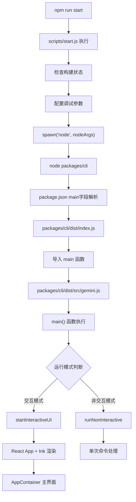

# Gemini CLI 子程序启动链路完整分析

> **分析对象**: `scripts/start.js` 子程序启动过程 **更新时间**: 2025-11-15
> **适用版本**: Gemini CLI v0.15.0

## 🎯 核心问题解答

**问题**: `const child = spawn('node', nodeArgs, { stdio: 'inherit', env });`
启动的子程序代码入口在哪？

**答案**: 真正的入口是 `packages/cli/dist/src/gemini.js` 中的 `main()`
函数，经过以下链路：

```
scripts/start.js → spawn → packages/cli → dist/index.js → src/gemini.js → main()
```

## 🚀 完整启动链路图



## 📁 关键文件链路分析

### 1. **启动触发**: `scripts/start.js`

**关键代码**:

```javascript
// 第58-59行: 构建 nodeArgs
nodeArgs.push(join(root, 'packages', 'cli')); // 指向 packages/cli 目录
nodeArgs.push(...process.argv.slice(2)); // 传递CLI参数

// 第72行: 启动子进程
const child = spawn('node', nodeArgs, { stdio: 'inherit', env });
```

**执行结果**: `node packages/cli [其他参数...]`

### 2. **包解析**: `packages/cli/package.json`

**关键配置**:

```json
{
  "name": "@google/gemini-cli",
  "main": "dist/index.js", // ← Node.js 自动找到这个入口
  "bin": {
    "gemini": "dist/index.js"
  }
}
```

**作用**: Node.js 在执行 `node packages/cli` 时，会根据 `package.json` 的 `main`
字段找到真正的入口文件。

### 3. **全局入口**: `packages/cli/dist/index.js`

**完整代码**:

```javascript
#!/usr/bin/env node
/**
 * @license
 * Copyright 2025 Google LLC
 * SPDX-License-Identifier: Apache-2.0
 */

import './src/gemini.js';
import { main } from './src/gemini.js';
import { debugLogger, FatalError } from '@google/gemini-cli-core';

// --- 全局入口点 ---
main().catch((error) => {
  if (error instanceof FatalError) {
    let errorMessage = error.message;
    if (!process.env['NO_COLOR']) {
      errorMessage = `\x1b[31m${errorMessage}\x1b[0m`;
    }
    debugLogger.error(errorMessage);
    process.exit(error.exitCode);
  }
  debugLogger.error('An unexpected critical error occurred:');
  // ... 错误处理
});
```

**功能**:

- 导入并执行 `main()` 函数
- 全局错误处理和进程退出管理
- 颜色输出控制

### 4. **核心主函数**: `packages/cli/dist/src/gemini.js` → `main()`

**函数签名**:

```javascript
export async function main() {
  setupUnhandledRejectionHandler();
  // 主要初始化逻辑
}
```

**关键执行步骤**:

```javascript
// 1. 加载设置和解析参数
const settings = loadSettings();
const argv = await parseArguments(settings.merged);

// 2. 沙箱模式检查（可能重新启动）
if (!process.env['SANDBOX']) {
  // 在沙箱中重新启动或重新启动子进程
  await relaunchAppInChildProcess(memoryArgs, []);
}

// 3. 加载完整配置
const config = await loadCliConfig(settings.merged, sessionId, argv);

// 4. 模式分支
if (config.isInteractive()) {
  // 交互模式: 启动 React UI
  await startInteractiveUI(
    config,
    settings,
    startupWarnings,
    process.cwd(),
    initializationResult,
  );
} else {
  // 非交互模式: 处理单次命令
  await runNonInteractive(config, input);
}
```

### 5. **交互UI启动**: `startInteractiveUI()` 函数

**关键代码**:

```javascript
export async function startInteractiveUI(
  config,
  settings,
  startupWarnings,
  workspaceRoot,
  initializationResult,
) {
  // 终端配置
  if (!config.getScreenReader()) {
    process.stdout.write('\x1b[?7l'); // 禁用行包装
  }

  // React 组件树
  const AppWrapper = () => {
    useKittyKeyboardProtocol();
    return (
      <SettingsContext.Provider value={settings}>
        <KeypressProvider config={config}>
          <MouseProvider mouseEventsEnabled={mouseEventsEnabled}>
            <ScrollProvider>
              <SessionStatsProvider>
                <VimModeProvider settings={settings}>
                  <AppContainer
                    config={config}
                    settings={settings}
                    startupWarnings={startupWarnings}
                    version={version}
                    initializationResult={initializationResult}
                  />
                </VimModeProvider>
              </SessionStatsProvider>
            </ScrollProvider>
          </MouseProvider>
        </KeypressProvider>
      </SettingsContext.Provider>
    );
  };

  // 使用 Ink 框架渲染到终端
  const instance = render(
    process.env['DEBUG'] ? (
      <React.StrictMode>
        <AppWrapper />
      </React.StrictMode>
    ) : (
      <AppWrapper />
    ),
    {
      exitOnCtrlC: false,
      isScreenReaderEnabled: config.getScreenReader(),
      alternateBuffer: settings.merged.ui?.useAlternateBuffer,
      onRender: ({ renderTime }) => {
        if (renderTime > SLOW_RENDER_MS) {
          recordSlowRender(config, renderTime);
        }
      },
    },
  );
}
```

## 🔍 源码与构建文件对应关系

### TypeScript 源码 → JavaScript 构建产物

| 源码文件                                | 构建文件                                     | 说明       |
| --------------------------------------- | -------------------------------------------- | ---------- |
| `packages/cli/src/gemini.tsx`           | `packages/cli/dist/src/gemini.js`            | 主入口函数 |
| `packages/cli/src/ui/AppContainer.tsx`  | `packages/cli/dist/src/ui/AppContainer.js`   | 主UI组件   |
| `packages/cli/src/config/config.ts`     | `packages/cli/dist/src/config/config.js`     | 配置管理   |
| `packages/cli/src/nonInteractiveCli.ts` | `packages/cli/dist/src/nonInteractiveCli.js` | 非交互模式 |

**构建命令**: `npm run build` 使用 esbuild 将 TypeScript 编译为 JavaScript

### 关键组件架构

```
AppContainer (主容器)
├── ChatInterface (聊天界面)
├── FileExplorer (文件浏览器)
├── SettingsPanel (设置面板)
├── StatusBar (状态栏)
└── CommandPalette (命令面板)
```

## 🐛 调试要点和断点位置

### 推荐断点位置

#### 1. **启动流程调试**

```typescript
// scripts/start.js:72 - 子进程启动
const child = spawn('node', nodeArgs, { stdio: 'inherit', env });

// packages/cli/dist/index.js:11 - 全局入口
main().catch((error) => {
  // 设置断点这里
});

// packages/cli/dist/src/gemini.js:157 - main函数开始
export async function main() {
  setupUnhandledRejectionHandler();
  // 设置断点这里
}
```

#### 2. **配置和初始化调试**

```typescript
// packages/cli/dist/src/gemini.js:160 - 设置加载
const settings = loadSettings();

// packages/cli/dist/src/gemini.js:171 - 参数解析
const argv = await parseArguments(settings.merged);

// packages/cli/dist/src/gemini.js:265 - 配置加载
const config = await loadCliConfig(settings.merged, sessionId, argv);
```

#### 3. **UI渲染调试**

```typescript
// packages/cli/dist/src/gemini.js:311 - 交互UI启动
await startInteractiveUI(config, settings, startupWarnings, process.cwd(), initializationResult);

// packages/cli/dist/src/gemini.js:135 - React渲染
const instance = render(/* React组件 */, renderOptions);
```

### VSCode 调试配置

**使用推荐配置**: "Debug CLI from Start"

```json
{
  "name": "Debug CLI from Start",
  "type": "node",
  "request": "launch",
  "runtimeExecutable": "npm",
  "runtimeArgs": ["run", "debug"],
  "env": {
    "GEMINI_SANDBOX": "false",
    "DEBUG": "1"
  }
}
```

## 🎯 核心架构特点

### 1. **基于 React + Ink 的终端应用**

Gemini CLI 实际上是一个 **完整的 React 应用程序运行在终端中**：

- **React**: 提供组件化UI架构
- **Ink**: 将React组件渲染到终端
- **Context Providers**: 管理全局状态（设置、键盘、鼠标、滚动等）

### 2. **多模式支持**

```typescript
if (config.isInteractive()) {
  // 交互模式: 完整的聊天UI界面
  await startInteractiveUI(/* ... */);
} else {
  // 非交互模式: 单次命令执行
  await runNonInteractive(config, input);
}
```

### 3. **沙箱和重启机制**

```typescript
// 可能在沙箱环境中重新启动
if (!process.env['SANDBOX']) {
  await relaunchAppInChildProcess(memoryArgs, []);
}
```

**作用**:

- 提供隔离的执行环境
- 支持内存配置优化
- 支持进程重启和恢复

## 🔧 关键技术栈

### 前端技术

- **React**: UI组件框架
- **Ink**: 终端渲染引擎
- **TypeScript**: 主要开发语言
- **Context API**: 状态管理

### 后端技术

- **Node.js**: 运行时环境
- **esbuild**: 构建工具
- **Vitest**: 测试框架

### 终端特性

- **键盘协议**: 支持 Kitty 键盘协议
- **鼠标事件**: 终端鼠标交互
- **屏幕阅读器**: 无障碍支持
- **Vim模式**: Vim键位绑定

## 🚀 启动模式对比

### 开发模式启动

```bash
npm run start
# → scripts/start.js
# → 开发环境配置
# → packages/cli
# → React UI
```

**特点**:

- DEV=true 环境变量
- 热重载支持
- 调试友好

### 调试模式启动

```bash
npm run debug
# → DEBUG=1 + --inspect-brk
# → 第一行暂停
# → 等待调试器连接
```

**特点**:

- 启用详细日志
- 调试器支持
- GEMINI_CLI_NO_RELAUNCH=true

### 生产模式启动

```bash
gemini [command]
# → bundle/gemini.js
# → packages/cli/dist/index.js
# → 优化的构建产物
```

**特点**:

- 优化的代码
- 最小化启动时间
- 生产环境配置

## 📊 性能和监控

### 渲染性能监控

```typescript
onRender: ({ renderTime }) => {
  if (renderTime > SLOW_RENDER_MS) {
    recordSlowRender(config, renderTime);
  }
};
```

### 内存管理

```typescript
const memoryArgs = settings.merged.advanced?.autoConfigureMemory
  ? getNodeMemoryArgs(isDebugMode)
  : [];
```

### 会话管理

```typescript
await cleanupExpiredSessions(config, settings.merged);
```

## 🎪 总结

### 启动链路核心要点

1. **多层入口设计**: 从 scripts/start.js → packages/cli → dist/index.js →
   src/gemini.js
2. **智能模式切换**: 根据参数和环境自动选择交互/非交互模式
3. **React终端应用**: 使用现代前端技术栈构建的终端应用
4. **完整的开发体验**: 支持调试、热重载、性能监控等开发特性

### 调试建议

1. **从 main() 开始**: 设置断点在 `packages/cli/dist/src/gemini.js:157`
2. **关注模式分支**: 理解交互和非交互模式的区别
3. **React组件调试**: 在 AppContainer 及其子组件中设置断点
4. **配置加载调试**: 关注 settings 和 config 的加载过程

### 架构优势

- ✅ **现代化架构**: React + TypeScript + 现代构建工具
- ✅ **丰富的交互**: 支持鼠标、键盘、Vim模式等
- ✅ **开发友好**: 完整的调试和开发工具支持
- ✅ **性能优化**: 渲染监控、内存管理、会话清理
- ✅ **扩展性**: 插件系统、主题系统、配置系统

Gemini
CLI 不仅仅是一个简单的命令行工具，而是一个**功能完备的终端应用程序**，展现了现代 CLI 工具的最佳实践！ 🚀

---

_本文档基于 Gemini CLI 源码分析生成，适用于开发调试和架构理解。_
