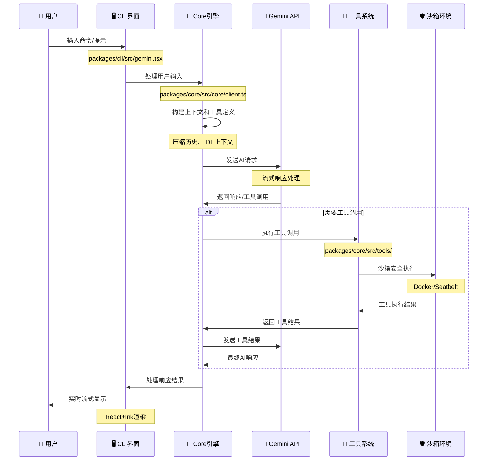
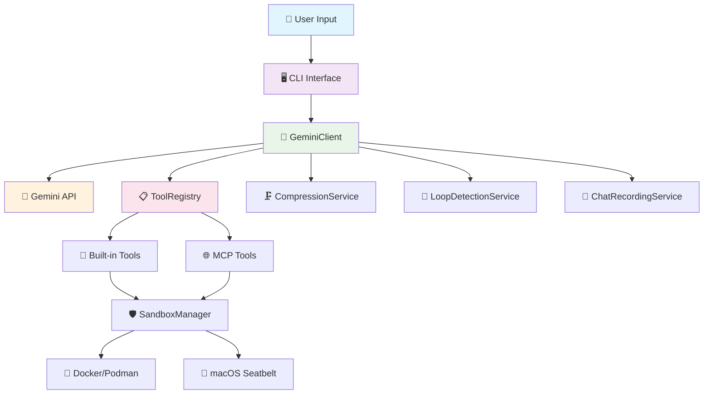

# Gemini CLI 完整交互流程详解

## 📋 目录

1. [流程概览](#流程概览)
2. [详细流程分析](#详细流程分析)
3. [关键代码路径](#关键代码路径)
4. [核心组件交互](#核心组件交互)
5. [错误处理流程](#错误处理流程)
6. [性能优化点](#性能优化点)

---

## 🔄 流程概览



---

## 🔍 详细流程分析

### 1️⃣ 用户输入处理

#### 📍 入口点：`packages/cli/src/gemini.tsx`

```typescript
// 主入口函数
export async function main() {
  setupUnhandledRejectionHandler();

  const settings = loadSettings();
  const config = await loadCliConfig(settings.merged, sessionId, argv);

  if (config.isInteractive()) {
    // 🖥️ 交互式模式
    await startInteractiveUI(config, settings, startupWarnings);
  } else {
    // 📝 非交互式模式
    await runNonInteractive({ config, settings, input, prompt_id });
  }
}
```

#### 📍 交互式UI启动：`packages/cli/src/ui/AppContainer.tsx`

```typescript
export function AppContainer() {
  return (
    <SettingsContext.Provider value={settings}>
      <KeypressProvider>
        <SessionStatsProvider>
          <VimModeProvider>
            <ThemeProvider>
              {/* 🎨 主应用组件 */}
              <App />
            </ThemeProvider>
          </VimModeProvider>
        </SessionStatsProvider>
      </KeypressProvider>
    </SettingsContext.Provider>
  );
}
```

#### 📍 用户输入捕获：`packages/cli/src/ui/App.tsx`

```typescript
const App = () => {
  const [input, setInput] = useState('');

  // ⌨️ 处理用户输入
  const handleSubmit = useCallback(async (userInput: string) => {
    if (!userInput.trim()) return;

    setInput('');

    // 🚀 发送到Core处理
    await sendMessageToCore({
      text: userInput,
      attachments: currentAttachments
    });
  }, [sendMessageToCore, currentAttachments]);

  return (
    <Box flexDirection="column" height="100%">
      <ChatHistory messages={messages} />
      <StreamingResponse content={streamingContent} />
      <InputBar
        value={input}
        onChange={setInput}
        onSubmit={handleSubmit}
      />
    </Box>
  );
};
```

---

### 2️⃣ Core引擎处理

#### 📍 核心客户端：`packages/core/src/core/client.ts`

```typescript
export class GeminiClient {
  private chat?: GeminiChat;
  private readonly loopDetector: LoopDetectionService;
  private readonly compressionService: ChatCompressionService;

  // 🔥 核心消息处理方法
  async *sendMessageStream(
    request: SendMessageRequest,
  ): AsyncGenerator<ServerGeminiStreamEvent, Turn> {
    try {
      // 1️⃣ 检查循环和上下文窗口
      if (this.loopDetector.isLooping(request)) {
        yield { type: GeminiEventType.LoopDetected };
        return;
      }

      // 2️⃣ 尝试压缩上下文
      const compressionInfo = await this.tryCompressChat();
      if (compressionInfo.status === CompressionStatus.COMPRESSED) {
        yield {
          type: GeminiEventType.ChatCompressed,
          compressionInfo,
        };
      }

      // 3️⃣ 构建请求内容
      const geminiRequest = await this.buildGeminiRequest(request);

      // 4️⃣ 检查Token溢出
      if (this.willContextOverflow(geminiRequest)) {
        yield { type: GeminiEventType.ContextWindowWillOverflow };
        return;
      }

      // 5️⃣ 发送流式请求
      const stream = this.genAI.generateContentStream(geminiRequest);

      // 6️⃣ 处理流式响应
      for await (const chunk of stream) {
        yield {
          type: GeminiEventType.StreamingContentDelta,
          content: chunk.text(),
          timestamp: Date.now(),
        };
      }

      // 7️⃣ 处理工具调用
      const finalResponse = await stream.response;
      const functionCalls = finalResponse.functionCalls();

      if (functionCalls?.length > 0) {
        yield* this.handleToolCalls(functionCalls);
      }
    } catch (error) {
      yield {
        type: GeminiEventType.Error,
        error: error.message,
      };
    }
  }

  // 🛠️ 工具调用处理
  private async *handleToolCalls(
    functionCalls: FunctionCall[],
  ): AsyncGenerator<ServerGeminiStreamEvent> {
    for (const call of functionCalls) {
      yield {
        type: GeminiEventType.ToolCallStarted,
        toolCall: {
          name: call.name,
          args: call.args,
        },
      };

      // 执行工具
      const result = await this.toolRegistry.executeTool(call.name, call.args);

      yield {
        type: GeminiEventType.ToolCallCompleted,
        toolCall: { name: call.name, args: call.args },
        result: result,
      };
    }
  }
}
```

#### 📍 上下文构建：`packages/core/src/core/geminiChat.ts`

```typescript
export class GeminiChat {
  private history: Content[] = [];

  // 📝 添加用户消息
  addUserMessage(request: SendMessageRequest): void {
    const userContent: Content = {
      role: 'user',
      parts: [
        { text: request.text },
        ...this.buildAttachmentParts(request.attachments),
      ],
    };

    this.history.push(userContent);
  }

  // 🔧 构建工具定义
  private buildToolDeclarations(): FunctionDeclaration[] {
    return this.toolRegistry.getFunctionDeclarations().map((tool) => ({
      name: tool.name,
      description: tool.description,
      parameters: tool.parameters,
    }));
  }

  // 🏗️ 构建完整请求
  buildRequest(): GenerateContentRequest {
    return {
      contents: this.history,
      tools: this.buildToolDeclarations(),
      systemInstruction: this.getSystemInstruction(),
      generationConfig: {
        temperature: this.config.temperature,
        maxOutputTokens: this.config.maxOutputTokens,
      },
    };
  }
}
```

---

### 3️⃣ 工具系统执行

#### 📍 工具注册表：`packages/core/src/tools/tool-registry.ts`

```typescript
export class ToolRegistry {
  private tools = new Map<string, AnyDeclarativeTool>();
  private mcpClientManager: McpClientManager;

  // 🔍 工具发现和注册
  async discoverAllTools(): Promise<void> {
    // 1. 注册内置工具
    await this.registerBuiltinTools();

    // 2. 发现MCP工具
    await this.mcpClientManager.discoverAllMcpTools();

    // 3. 注册MCP工具
    for (const mcpTool of this.mcpClientManager.getDiscoveredTools()) {
      this.registerTool(mcpTool);
    }
  }

  // ⚡ 工具执行
  async executeTool(name: string, args: any): Promise<ToolResult> {
    const tool = this.tools.get(name);
    if (!tool) {
      throw new Error(`Tool not found: ${name}`);
    }

    // 🔒 安全检查
    if (tool.requiresConfirmation && !this.hasUserApproval(name, args)) {
      const approved = await this.requestUserConfirmation(name, args);
      if (!approved) {
        return { success: false, error: 'User denied permission' };
      }
    }

    // 🛡️ 沙箱执行
    return await this.executeInSandbox(tool, args);
  }

  // 🏃 沙箱执行
  private async executeInSandbox(
    tool: AnyDeclarativeTool,
    args: any,
  ): Promise<ToolResult> {
    const sandboxConfig = this.config.getSandboxConfig();

    if (sandboxConfig.enabled) {
      // Docker/Podman/Seatbelt沙箱
      return await this.sandboxManager.execute(tool, args);
    } else {
      // 直接执行
      return await tool.execute(args);
    }
  }
}
```

#### 📍 内置工具示例：`packages/core/src/tools/shell.ts`

```typescript
export class ShellTool extends BaseDeclarativeTool<ShellParams, ToolResult> {
  name = 'shell';
  description = '在沙箱环境中执行Shell命令';

  async execute(params: ShellParams): Promise<ToolResult> {
    const { command, workingDirectory } = params;

    // 🔒 安全验证
    if (!this.isCommandAllowed(command)) {
      return {
        success: false,
        error: 'Command not allowed by security policy',
      };
    }

    // 🛡️ 沙箱执行
    const executionConfig: ShellExecutionConfig = {
      command,
      workingDirectory,
      timeout: this.config.toolTimeout,
      sandboxEnabled: true,
    };

    try {
      const result = await this.shellExecutionService.execute(executionConfig);

      return {
        success: result.exitCode === 0,
        output: result.output,
        exitCode: result.exitCode,
      };
    } catch (error) {
      return {
        success: false,
        error: error.message,
      };
    }
  }

  // 🔍 命令安全检查
  private isCommandAllowed(command: string): boolean {
    const dangerousPatterns = [
      /rm\s+-rf/,
      /sudo/,
      /chmod\s+777/,
      // ... 更多危险模式
    ];

    return !dangerousPatterns.some((pattern) => pattern.test(command));
  }
}
```

---

### 4️⃣ 沙箱安全执行

#### 📍 沙箱管理器：`packages/core/src/sandbox/sandbox-manager.ts`

```typescript
export class SandboxManager {
  // 🏃 执行工具在沙箱中
  async execute(tool: AnyDeclarativeTool, args: any): Promise<ToolResult> {
    const sandboxType = this.detectBestSandbox();

    switch (sandboxType) {
      case SandboxType.DOCKER:
        return await this.executeInDocker(tool, args);
      case SandboxType.PODMAN:
        return await this.executeInPodman(tool, args);
      case SandboxType.SEATBELT:
        return await this.executeInSeatbelt(tool, args);
      default:
        return await tool.execute(args);
    }
  }

  // 🐳 Docker沙箱执行
  private async executeInDocker(
    tool: AnyDeclarativeTool,
    args: any,
  ): Promise<ToolResult> {
    const containerConfig = {
      image: this.config.sandboxImageUri,
      workdir: '/workspace',
      mounts: this.buildMounts(),
      env: this.buildEnvironment(),
      user: 'node',
    };

    const dockerCommand = this.buildDockerCommand(tool, args, containerConfig);

    return await this.executeCommand(dockerCommand);
  }

  // 🍎 macOS Seatbelt沙箱
  private async executeInSeatbelt(
    tool: AnyDeclarativeTool,
    args: any,
  ): Promise<ToolResult> {
    const profile = this.config.seatbeltProfile || 'permissive-open';
    const profilePath = path.join(__dirname, `sandbox-macos-${profile}.sb`);

    const seatbeltCommand = [
      'sandbox-exec',
      '-f',
      profilePath,
      '-D',
      `HOME=${os.homedir()}`,
      '-D',
      `WORKSPACE=${this.workspaceRoot}`,
      ...this.buildToolCommand(tool, args),
    ];

    return await this.executeCommand(seatbeltCommand);
  }
}
```

---

### 5️⃣ 响应流式处理

#### 📍 流式响应组件：`packages/cli/src/ui/StreamingResponse.tsx`

```typescript
export const StreamingResponse: React.FC<StreamingResponseProps> = ({
  content,
  isComplete
}) => {
  const [displayContent, setDisplayContent] = useState('');
  const [currentIndex, setCurrentIndex] = useState(0);

  // ⚡ 实时内容更新
  useEffect(() => {
    if (currentIndex < content.length) {
      const timer = setTimeout(() => {
        setDisplayContent(prev => prev + content[currentIndex]);
        setCurrentIndex(prev => prev + 1);
      }, 10); // 10ms延迟模拟打字效果

      return () => clearTimeout(timer);
    }
  }, [content, currentIndex]);

  // 🎨 语法高亮渲染
  const renderContent = useMemo(() => {
    return highlightCode(displayContent, {
      theme: 'github-dark',
      language: 'markdown'
    });
  }, [displayContent]);

  return (
    <Box flexDirection="column" paddingX={1}>
      <Text>{renderContent}</Text>
      {!isComplete && <Spinner />}
    </Box>
  );
};
```

#### 📍 消息历史管理：`packages/cli/src/ui/ChatHistory.tsx`

```typescript
export const ChatHistory: React.FC<ChatHistoryProps> = ({ messages }) => {
  const scrollRef = useRef<any>();

  // 📜 自动滚动到底部
  useEffect(() => {
    if (scrollRef.current) {
      scrollRef.current.scrollToBottom();
    }
  }, [messages]);

  return (
    <Box flexDirection="column" flexGrow={1}>
      <ScrollableBox ref={scrollRef}>
        {messages.map((message, index) => (
          <MessageComponent
            key={`${message.id}-${index}`}
            message={message}
            isLast={index === messages.length - 1}
          />
        ))}
      </ScrollableBox>
    </Box>
  );
};
```

---

## 🗂️ 关键代码路径

### 📁 核心文件结构

```
packages/
├── cli/src/
│   ├── gemini.tsx                 # 🚀 主入口点
│   ├── ui/
│   │   ├── App.tsx               # 🖥️ 主应用组件
│   │   ├── AppContainer.tsx      # 📦 应用容器
│   │   ├── ChatHistory.tsx       # 💬 消息历史
│   │   └── StreamingResponse.tsx # ⚡ 流式响应
│   └── config/
│       └── cli-config.ts         # ⚙️ CLI配置
├── core/src/
│   ├── core/
│   │   ├── client.ts             # 🎯 Gemini客户端
│   │   ├── geminiChat.ts         # 💭 聊天管理
│   │   └── config.ts             # 🔧 核心配置
│   ├── tools/
│   │   ├── tool-registry.ts      # 📋 工具注册表
│   │   ├── shell.ts              # 🐚 Shell工具
│   │   ├── read-file.ts          # 📖 文件读取
│   │   ├── write-file.ts         # ✏️ 文件写入
│   │   └── mcp-client-manager.ts # 🔌 MCP管理
│   ├── services/
│   │   ├── chatCompressionService.ts     # 🗜️ 对话压缩
│   │   ├── loopDetectionService.ts       # 🔄 循环检测
│   │   ├── shellExecutionService.ts      # 🛠️ Shell执行
│   │   └── chatRecordingService.ts       # 📝 对话记录
│   └── sandbox/
│       └── sandbox-manager.ts    # 🛡️ 沙箱管理
```

### 🎯 关键函数调用链

```typescript
// 1️⃣ 用户输入处理链
main()
  → startInteractiveUI()
  → AppContainer()
  → App.handleSubmit()
  → sendMessageToCore()

// 2️⃣ Core处理链
sendMessageToCore()
  → GeminiClient.sendMessageStream()
  → buildGeminiRequest()
  → genAI.generateContentStream()
  → handleToolCalls()

// 3️⃣ 工具执行链
handleToolCalls()
  → ToolRegistry.executeTool()
  → SandboxManager.execute()
  → tool.execute()

// 4️⃣ 响应渲染链
streamingResponse
  → StreamingResponse.component
  → ChatHistory.update()
  → UI.render()
```

---

## 🔧 核心组件交互

### 📊 组件依赖图



### ⚡ 数据流向

```typescript
// 📈 数据流向示例
interface DataFlow {
  // 输入阶段
  userInput: string;
  attachments?: File[];

  // 处理阶段
  processedRequest: SendMessageRequest;
  geminiRequest: GenerateContentRequest;

  // 响应阶段
  streamChunks: StreamingContentDelta[];
  toolCalls?: FunctionCall[];
  toolResults?: ToolResult[];

  // 输出阶段
  finalResponse: string;
  uiUpdate: UIUpdateEvent;
}
```

---

## ❌ 错误处理流程

### 🛡️ 多层错误处理

```typescript
// packages/core/src/core/client.ts
export class GeminiClient {
  async *sendMessageStream(
    request: SendMessageRequest,
  ): AsyncGenerator<ServerGeminiStreamEvent, Turn> {
    try {
      // 1️⃣ 前置检查错误
      if (this.loopDetector.isLooping(request)) {
        yield { type: GeminiEventType.LoopDetected };
        return;
      }

      if (this.willContextOverflow(geminiRequest)) {
        yield { type: GeminiEventType.ContextWindowWillOverflow };
        return;
      }

      // 2️⃣ API调用错误处理
      const stream = this.genAI.generateContentStream(geminiRequest);
    } catch (error) {
      // 3️⃣ 错误分类处理
      if (error instanceof RateLimitError) {
        yield {
          type: GeminiEventType.RateLimitExceeded,
          retryAfter: error.retryAfter,
        };
      } else if (error instanceof TokenLimitError) {
        yield {
          type: GeminiEventType.TokenLimitExceeded,
          limit: error.limit,
        };
      } else {
        yield {
          type: GeminiEventType.Error,
          error: error.message,
        };
      }
    }
  }
}
```

### 🔄 重试机制

```typescript
// packages/core/src/services/retry-service.ts
export class RetryService {
  async executeWithRetry<T>(
    operation: () => Promise<T>,
    options: RetryOptions = {},
  ): Promise<T> {
    const {
      maxRetries = 3,
      baseDelay = 1000,
      maxDelay = 10000,
      backoffFactor = 2,
    } = options;

    let lastError: Error;

    for (let attempt = 0; attempt <= maxRetries; attempt++) {
      try {
        return await operation();
      } catch (error) {
        lastError = error;

        if (attempt === maxRetries) {
          break;
        }

        // 🕐 指数退避延迟
        const delay = Math.min(
          baseDelay * Math.pow(backoffFactor, attempt),
          maxDelay,
        );

        await this.sleep(delay);
      }
    }

    throw lastError;
  }
}
```

---

## ⚡ 性能优化点

### 🚀 关键优化策略

#### 1. 流式处理优化

```typescript
// packages/core/src/core/client.ts
async *sendMessageStream(request: SendMessageRequest): AsyncGenerator<ServerGeminiStreamEvent, Turn> {
  // ⚡ 立即开始流式响应，不等待完整响应
  const stream = this.genAI.generateContentStream(geminiRequest);

  for await (const chunk of stream) {
    // 🎯 实时推送内容块
    yield {
      type: GeminiEventType.StreamingContentDelta,
      content: chunk.text(),
      timestamp: Date.now()
    };
  }
}
```

#### 2. 上下文压缩优化

```typescript
// packages/core/src/services/chatCompressionService.ts
export class ChatCompressionService {
  async compress(history: Content[]): Promise<CompressionResult> {
    // 🧠 只压缩旧的30%内容，保留最近70%
    const splitPoint = this.findOptimalSplitPoint(history, 0.3);
    const oldContent = history.slice(0, splitPoint);
    const recentContent = history.slice(splitPoint);

    // ⚡ 并行压缩多个内容块
    const compressionPromises = this.chunkContent(oldContent).map((chunk) =>
      this.compressChunk(chunk),
    );

    const compressedChunks = await Promise.all(compressionPromises);

    return {
      compressedHistory: [...compressedChunks, ...recentContent],
      originalTokenCount: this.countTokens(history),
      compressedTokenCount: this.countTokens(compressedChunks),
    };
  }
}
```

#### 3. 缓存策略优化

```typescript
// packages/core/src/utils/cache.ts
export class SmartCache<K, V> {
  private cache = new Map<
    K,
    { value: V; timestamp: number; accessCount: number }
  >();

  get(key: K): V | undefined {
    const entry = this.cache.get(key);
    if (entry) {
      // 📊 更新访问统计
      entry.accessCount++;
      entry.timestamp = Date.now();

      // 🔄 LRU更新
      this.cache.delete(key);
      this.cache.set(key, entry);

      return entry.value;
    }
    return undefined;
  }

  set(key: K, value: V): void {
    // 🧹 智能清理：优先清理访问频率低的条目
    if (this.cache.size >= this.maxSize) {
      this.evictLeastUsed();
    }

    this.cache.set(key, {
      value,
      timestamp: Date.now(),
      accessCount: 1,
    });
  }
}
```

### 📊 性能监控点

```typescript
// packages/core/src/services/performance-monitor.ts
export class PerformanceMonitor {
  // 🔍 关键性能指标监控
  async measureOperation<T>(
    operationName: string,
    operation: () => Promise<T>,
  ): Promise<T> {
    const startTime = performance.now();
    const startMemory = process.memoryUsage();

    try {
      const result = await operation();

      // 📈 记录成功指标
      this.recordMetrics(operationName, {
        duration: performance.now() - startTime,
        memoryDelta: process.memoryUsage().heapUsed - startMemory.heapUsed,
        status: 'success',
      });

      return result;
    } catch (error) {
      // 📉 记录错误指标
      this.recordMetrics(operationName, {
        duration: performance.now() - startTime,
        status: 'error',
        error: error.message,
      });
      throw error;
    }
  }
}
```

---

## 🎯 总结

### 🌟 流程特点

1. **🔄 全异步流水线**: 从用户输入到响应输出的全异步处理
2. **⚡ 实时流式响应**: 边生成边显示，提升用户体验
3. **🛡️ 多层安全防护**: 命令检查 → 用户确认 → 沙箱执行
4. **🧠 智能上下文管理**: 自动压缩、循环检测、内存优化
5. **🔧 灵活工具系统**: 内置工具 + MCP扩展 + 自定义工具
6. **🎨 现代UI体验**: React+Ink打造的丰富终端界面

### 💡 架构亮点

- **模块化设计**: CLI → Core → Tools → Sandbox的清晰分层
- **事件驱动**: 基于事件流的松耦合架构
- **插件化**: 支持MCP协议的第三方工具扩展
- **性能优化**: 流式处理、智能缓存、上下文压缩
- **安全优先**: 沙箱隔离、权限控制、命令验证

这个完整的交互流程展现了Gemini
CLI作为现代AI助手工具的**工程杰作**，每个环节都经过精心设计和优化，为用户提供了安全、高效、流畅的AI交互体验。

---

_本文档基于Gemini
CLI项目源码的深入分析，详细展现了从用户输入到系统响应的完整技术流程。_
