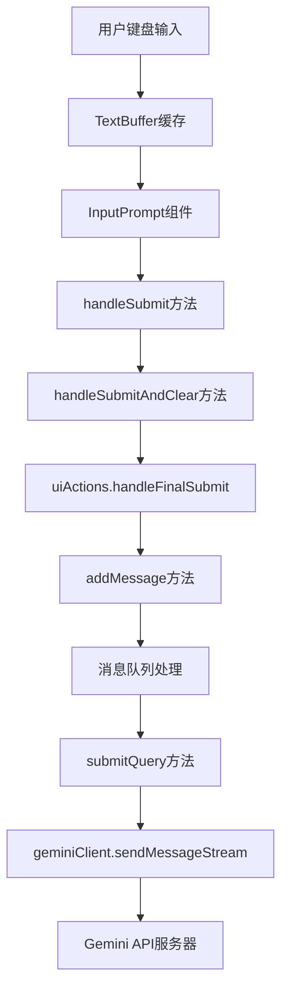
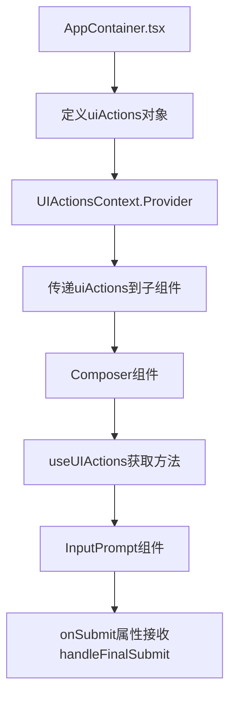

# Gemini CLI 用户输入处理完整流程分析

> **分析对象**: 用户输入从键盘捕获到提交服务器的完整数据流 **更新时间**:
> 2025-11-15 **适用版本**: Gemini CLI v0.15.0

## 🎯 核心问题解答

**问题**: 用户在终端输入文字后，数据是如何被捕获、处理并发送到 Gemini
API 服务器的？

**答案**: 完整数据流包含以下关键环节：

```
键盘输入 → TextBuffer → InputPrompt.handleSubmit →
uiActions.handleFinalSubmit → addMessage → 消息队列 →
submitQuery → Gemini API
```

## 🚀 完整数据流程图

### 主要数据流



### Context上下文架构



## 📁 关键代码位置详解

### 1. **输入捕获**: `packages/cli/src/ui/components/InputPrompt.tsx:718`

```typescript
// 用户按下回车键触发提交
const handleSubmit = useCallback(
  (buffer: TextBuffer) => {
    if (!onSubmit) return;

    const textToSubmit = buffer.text;
    if (textToSubmit.trim()) {
      handleSubmitAndClear(textToSubmit);
    }
  },
  [handleSubmitAndClear],
);

// 清空输入框并调用 onSubmit 回调
const handleSubmitAndClear = useCallback(
  (submittedValue: string) => {
    buffer.setText(''); // 清空输入框
    onSubmit(submittedValue); // 调用传入的 onSubmit 函数
  },
  [buffer, onSubmit],
);
```

**关键点**:

- `buffer.text` 包含用户输入的完整内容
- `buffer.setText('')` 清空输入框为下次输入做准备
- `onSubmit(submittedValue)` 将用户输入传递给上层组件

### 2. **组件连接**: `packages/cli/src/ui/components/Composer.tsx:143`

```typescript
import { useUIActions } from '../contexts/UIActionsContext.js';

export function Composer() {
  const uiActions = useUIActions();

  return (
    <InputPrompt
      onSubmit={uiActions.handleFinalSubmit} // 传递处理函数
      buffer={uiState.buffer}
      userMessages={uiState.userMessages}
      onClearScreen={uiActions.handleClearScreen}
      config={config}
      // ... 其他属性
    />
  );
}
```

**关键点**:

- `useUIActions()` 从 Context 获取 UI 操作方法
- `onSubmit={uiActions.handleFinalSubmit}` 将处理函数传递给 InputPrompt

### 3. **核心处理逻辑**: `packages/cli/src/ui/AppContainer.tsx:712-717`

```typescript
const handleFinalSubmit = useCallback(
  (submittedValue: string) => {
    addMessage(submittedValue); // 将用户输入添加到消息队列
  },
  [addMessage],
);
```

**功能**:

- 接收来自 InputPrompt 的用户输入文本
- 调用 `addMessage()` 将文本添加到消息处理队列
- 使用 `useCallback` 优化性能，避免不必要的重新渲染

### 4. **UI Actions 上下文**: `packages/cli/src/ui/AppContainer.tsx:1422-1479`

```typescript
const uiActions: UIActions = useMemo(
  () => ({
    handleThemeSelect,
    closeThemeDialog,
    handleAuthSelect,
    setAuthState,
    // ... 其他UI操作方法
    handleFinalSubmit, // ← 用户输入提交处理
    handleClearScreen,
    setQueueErrorMessage,
    popAllMessages,
    // ... 更多方法
  }),
  [
    // ... 所有依赖项
    handleFinalSubmit,
    handleClearScreen,
    // ... 更多依赖项
  ],
);

return (
  <UIStateContext.Provider value={uiState}>
    <UIActionsContext.Provider value={uiActions}>
      {/* 组件树 */}
    </UIActionsContext.Provider>
  </UIStateContext.Provider>
);
```

**架构特点**:

- 使用 React Context 模式管理全局 UI 操作方法
- `useMemo` 优化性能，避免不必要的对象重建
- 将所有 UI 相关的操作方法集中管理

### 5. **消息队列处理**: `packages/cli/src/ui/hooks/useMessageQueue.ts`

```typescript
const addMessage = useCallback(
  (message: string) => {
    // 添加用户消息到队列
    const newUserMessage = createUserMessage(message);
    setUserMessages((prev) => [...prev, newUserMessage]);

    // 如果AI空闲，自动发送查询
    if (streamingState === StreamingState.Idle) {
      const combinedMessage = getCombinedMessage(message);
      submitQuery(combinedMessage); // 发送到AI服务
    }
  },
  [
    createUserMessage,
    setUserMessages,
    streamingState,
    getCombinedMessage,
    submitQuery,
  ],
);
```

**处理逻辑**:

1. 创建用户消息对象并添加到消息历史
2. 检查AI服务状态
3. 如果AI空闲，立即发送查询请求

### 6. **API调用**: `packages/cli/src/ui/hooks/useGeminiStream.ts`

```typescript
const submitQuery = useCallback(
  async (queryToSend: string) => {
    try {
      // 设置流式响应状态
      setStreamingState(StreamingState.Responding);

      // 发送到Gemini API
      await geminiClient.sendMessageStream(queryToSend, abortSignal, prompt_id);
    } catch (error) {
      // 错误处理
      handleStreamingError(error);
    }
  },
  [geminiClient, setStreamingState, abortSignal, handleStreamingError],
);
```

**API交互**:

- 使用流式API与Gemini服务通信
- 支持请求取消机制 (abortSignal)
- 完整的错误处理和状态管理

## 🔍 数据流关键对象

### TextBuffer 对象

```typescript
interface TextBuffer {
  text: string; // 当前输入内容
  setText(text: string): void; // 设置文本内容
  // ... 其他缓存相关方法
}
```

### 用户消息对象

```typescript
interface UserMessage {
  id: string;
  content: string;
  timestamp: number;
  type: 'user';
  // ... 其他消息属性
}
```

### 流状态枚举

```typescript
enum StreamingState {
  Idle = 'Idle', // 空闲状态
  Responding = 'Responding', // AI响应中
  WaitingForConfirmation = 'WaitingForConfirmation', // 等待用户确认
  // ... 其他状态
}
```

## 🎪 执行时序分析

### 用户输入完整时序

```
时刻T1: 用户开始输入
├─ TextBuffer 实时更新 buffer.text
├─ InputPrompt 组件渲染显示当前内容
└─ 输入框实时反馈

时刻T2: 用户按下回车键
├─ handleSubmit(buffer) 被触发
├─ handleSubmitAndClear(buffer.text) 执行
├─ buffer.setText('') 清空输入框
└─ onSubmit(submittedValue) 调用上层处理

时刻T3: UI Actions 处理
├─ uiActions.handleFinalSubmit(submittedValue) 执行
├─ addMessage(submittedValue) 被调用
├─ 新用户消息添加到队列
└─ 界面更新显示用户消息

时刻T4: 自动发送处理
├─ 检查 streamingState === Idle
├─ getCombinedMessage() 组合完整查询
├─ submitQuery(combinedMessage) 发送请求
└─ setStreamingState(Responding) 更新状态

时刻T5: API通信
├─ geminiClient.sendMessageStream() 执行
├─ 建立与Gemini API的连接
├─ 发送用户输入内容
└─ 开始接收流式响应
```

## 🔧 关键技术特性

### 1. **React Hooks 架构**

- `useCallback`: 优化函数引用，避免不必要重新渲染
- `useMemo`: 优化对象创建，提升性能
- `useContext`: 跨组件共享状态和方法

### 2. **异步流处理**

- 流式API支持实时响应显示
- AbortController 支持请求取消
- 完整的异常处理机制

### 3. **状态管理**

- 多层Context Provider管理全局状态
- 消息队列系统处理并发输入
- 流状态机控制UI交互逻辑

### 4. **性能优化**

- TextBuffer 实现高效输入缓存
- 依赖数组精确控制Hook重新执行
- 组件级别的渲染优化

## 🐛 调试要点

### 推荐断点位置

```typescript
// 1. 输入捕获调试
// packages/cli/src/ui/components/InputPrompt.tsx:718
const handleSubmit = useCallback((buffer: TextBuffer) => {
  // 设置断点这里，检查 buffer.text
});

// 2. 提交处理调试
// packages/cli/src/ui/AppContainer.tsx:714
const handleFinalSubmit = useCallback((submittedValue: string) => {
  // 设置断点这里，检查 submittedValue
  addMessage(submittedValue);
});

// 3. 消息队列调试
// packages/cli/src/ui/hooks/useMessageQueue.ts
const addMessage = useCallback((message: string) => {
  // 设置断点这里，检查消息处理逻辑
});

// 4. API调用调试
// packages/cli/src/ui/hooks/useGeminiStream.ts
const submitQuery = useCallback(async (queryToSend: string) => {
  // 设置断点这里，检查API请求
});
```

### 常见调试场景

1. **输入不响应**: 检查 `isInputActive` 状态和相关条件
2. **消息丢失**: 检查 `addMessage` 和消息队列状态
3. **API调用失败**: 检查 `submitQuery` 和网络连接
4. **性能问题**: 检查 Hook 依赖数组和重新渲染

## 📊 架构优势

### 1. **清晰的数据流**

- 单向数据流，易于理解和调试
- 明确的组件职责分离
- 完整的状态管理机制

### 2. **高性能设计**

- React Hooks 优化策略
- 流式API减少响应延迟
- 智能的消息队列处理

### 3. **良好的扩展性**

- Context 模式支持功能扩展
- Hook 抽象便于复用
- 模块化的组件架构

### 4. **完善的错误处理**

- 多层级错误捕获
- 用户友好的错误提示
- 优雅的降级处理

## 🎯 总结

### 核心设计原则

1. **React化**: 使用现代React Hooks和Context模式
2. **流式优先**: 支持实时响应和流式处理
3. **性能导向**: 多重优化策略确保流畅体验
4. **用户友好**: 完整的状态反馈和错误处理

### 关键创新点

- **终端React应用**: 在终端中实现完整的React应用体验
- **智能消息队列**: 自动检测AI状态并智能发送请求
- **多层Context架构**: 清晰的状态和操作分离管理
- **流式API集成**: 实时显示AI响应，提升用户体验

Gemini
CLI 的用户输入处理系统展现了现代CLI工具的**最佳架构实践**，将Web开发的优秀模式成功应用到终端应用开发中！ 🚀

---

_本文档基于 Gemini CLI 源码深度分析生成，适用于开发调试和架构理解。_
