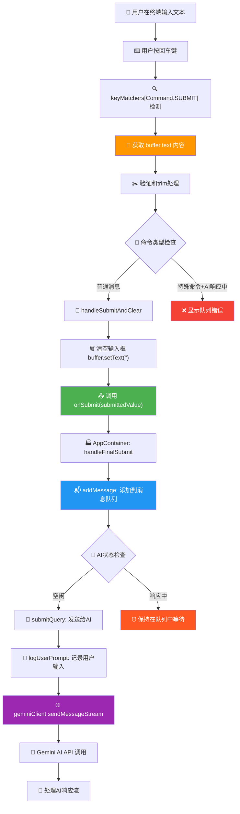
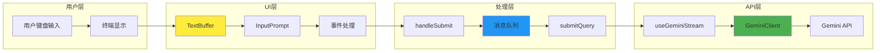

# Gemini CLI 获取用户输入内容 - 完整链路分析

> **分析时间**: 2025-11-15 **核心问题**: 用户输入内容在哪里被获取和处理？
> **答案**: 用户输入通过 `InputPrompt` 组件的 `buffer.text`
> 获取，经过多层处理最终发送给 Gemini AI

## 🎯 用户输入处理核心概述

当用户在 Gemini
CLI 的交互界面中输入内容并按回车时，会触发一个复杂而精妙的处理链路：

1. **键盘事件检测** → **输入内容获取** → **消息队列管理** → **AI API调用**

这个过程涉及了 React Hook、Context 管理、异步队列、以及 Gemini
API 集成等多个层面。

## 📋 用户输入处理完整链路

### 🎮 步骤1: 用户交互检测

**文件**: `packages/cli/src/ui/components/InputPrompt.tsx` **行号**: 697-722

```typescript
// 检测用户按下回车键
if (keyMatchers[Command.SUBMIT](key)) {
  if (buffer.text.trim()) {
    // ← 检查输入不为空
    // 处理意外粘贴保护
    if (recentUnsafePasteTime !== null) {
      buffer.newline();
      return;
    }

    // 处理转义换行（反斜杠 + 回车）
    const [row, col] = buffer.cursor;
    const line = buffer.lines[row];
    const charBefore = col > 0 ? cpSlice(line, col - 1, col) : '';
    if (charBefore === '\\') {
      buffer.backspace();
      buffer.newline();
    } else {
      handleSubmit(buffer.text); // ← 🎯 核心：获取用户输入内容
    }
  }
}
```

**关键点**:

- **输入来源**: `buffer.text` - 用户在终端中输入的完整文本内容
- **触发条件**: 用户按回车键 (`Command.SUBMIT`)
- **安全检查**: 防止意外粘贴导致的误提交
- **转义支持**: 反斜杠 + 回车 = 多行输入

### 🔄 步骤2: 输入验证和预处理

**文件**: `packages/cli/src/ui/components/InputPrompt.tsx` **行号**: 235-258

```typescript
const handleSubmit = useCallback(
  (submittedValue: string) => {
    const trimmedMessage = submittedValue.trim(); // ← 清理首尾空白
    const isSlash = isSlashCommand(trimmedMessage); // 检查是否为斜杠命令
    const isShell = shellModeActive; // 检查是否为Shell模式

    // 防止在AI响应期间提交特殊命令
    if ((isSlash || isShell) && streamingState === StreamingState.Responding) {
      setQueueErrorMessage(
        `${isShell ? 'Shell' : 'Slash'} commands cannot be queued`,
      );
      return; // 提前返回，不处理输入
    }

    handleSubmitAndClear(trimmedMessage); // ← 继续处理链路
  },
  [handleSubmitAndClear, shellModeActive, streamingState, setQueueErrorMessage],
);
```

**处理逻辑**:

- **文本清理**: `trim()` 去除多余空白
- **命令识别**: 区分普通消息、斜杠命令、Shell命令
- **状态检查**: 防止在AI响应时提交不兼容的命令
- **用户反馈**: 显示队列错误信息

### 🧹 步骤3: 输入清理和提交

**文件**: `packages/cli/src/ui/components/InputPrompt.tsx` **行号**: 213-233

```typescript
const handleSubmitAndClear = useCallback(
  (submittedValue: string) => {
    // Shell命令历史记录
    if (shellModeActive) {
      shellHistory.addCommandToHistory(submittedValue);
    }

    // 🎯 关键操作顺序：
    buffer.setText(''); // ← 1. 先清空输入框
    onSubmit(submittedValue); // ← 2. 再调用提交处理
    resetCompletionState(); // ← 3. 重置自动完成状态
    resetReverseSearchCompletionState(); // ← 4. 重置搜索状态
  },
  [
    onSubmit,
    buffer,
    resetCompletionState,
    shellModeActive,
    shellHistory,
    resetReverseSearchCompletionState,
  ],
);
```

**设计亮点**:

- **操作顺序**: 先清空再提交，防止重复提交
- **历史管理**: Shell命令自动添加到历史记录
- **状态清理**: 重置所有相关的UI状态
- **内存释放**: 避免状态累积导致的内存问题

### 🏭 步骤4: 消息队列处理

**文件**: `packages/cli/src/ui/AppContainer.tsx` **行号**: 712-717

```typescript
const handleFinalSubmit = useCallback(
  (submittedValue: string) => {
    addMessage(submittedValue); // ← 添加到消息队列
  },
  [addMessage],
);

// 这个 handleFinalSubmit 作为 onSubmit 参数传递给 InputPrompt
```

**文件**: `packages/cli/src/ui/hooks/useMessageQueue.ts` **行号**: 37-42

```typescript
const addMessage = useCallback((message: string) => {
  const trimmedMessage = message.trim();
  if (trimmedMessage.length > 0) {
    setMessageQueue((prev) => [...prev, trimmedMessage]); // ← 🎯 用户内容进入队列
  }
}, []);
```

**队列机制**:

- **二次清理**: 再次 trim() 确保内容有效
- **非空检查**: 只有非空内容才进入队列
- **状态更新**: 使用 React 状态管理队列

### 🤖 步骤5: 自动发送给AI

**文件**: `packages/cli/src/ui/hooks/useMessageQueue.ts` **行号**: 73-85

```typescript
useEffect(() => {
  if (
    isConfigInitialized && // 配置已初始化
    streamingState === StreamingState.Idle && // AI处于空闲状态
    messageQueue.length > 0 // 有待发送消息
  ) {
    // 合并所有队列中的消息
    const combinedMessage = messageQueue.join('\n\n');

    // 清空队列
    setMessageQueue([]);

    // 🎯 发送给AI
    submitQuery(combinedMessage); // ← 用户内容发送给AI
  }
}, [isConfigInitialized, streamingState, messageQueue, submitQuery]);
```

**自动发送条件**:

- ✅ **配置就绪**: 应用已完全初始化
- ✅ **AI空闲**: 没有正在进行的AI对话
- ✅ **有消息**: 队列中存在待发送内容
- ✅ **智能合并**: 多条消息用双换行合并

### 🌐 步骤6: Gemini API 调用

**文件**: `packages/cli/src/ui/hooks/useGeminiStream.ts` **行号**: 805-881

```typescript
const submitQuery = useCallback(
  async (
    query: PartListUnion, // ← 用户输入内容
    options?: { isContinuation: boolean },
    prompt_id?: string,
  ) => {
    // ... 参数准备和验证

    // 记录用户输入事件
    if (typeof queryToSend === 'string') {
      const promptText = queryToSend; // ← 用户输入内容
      logUserPrompt(
        config,
        new UserPromptEvent(
          promptText.length, // 内容长度
          prompt_id!, // 提示ID
          config.getContentGeneratorConfig()?.authType,
          promptText, // ← 🎯 用户输入的完整内容
        ),
      );
    }

    // 实际API调用
    const stream = geminiClient.sendMessageStream(
      // ← 发送给Gemini AI
      queryToSend, // ← 用户输入内容
      abortSignal,
      prompt_id!,
    );

    // 处理AI响应流
    await processGeminiStreamEvents(stream, userMessageTimestamp, abortSignal);
  },
  [
    /* dependencies */
  ],
);
```

**API调用特点**:

- **流式传输**: 使用 `sendMessageStream` 获得实时响应
- **日志记录**: 完整记录用户输入事件用于分析
- **异常处理**: 支持用户中途取消操作
- **会话管理**: 每个输入都有唯一的 `prompt_id`

## 📊 完整处理流程图



## 📍 关键代码位置明细表

| 步骤  | 文件路径             | 行号    | 关键代码                              | 功能描述                |
| ----- | -------------------- | ------- | ------------------------------------- | ----------------------- |
| **1** | `InputPrompt.tsx`    | 697     | `keyMatchers[Command.SUBMIT](key)`    | 检测回车键按下          |
| **2** | `InputPrompt.tsx`    | 718     | `handleSubmit(buffer.text)`           | **🎯 获取用户输入内容** |
| **3** | `InputPrompt.tsx`    | 237     | `submittedValue.trim()`               | 清理输入内容            |
| **4** | `InputPrompt.tsx`    | 220-221 | `buffer.setText('') + onSubmit()`     | 清空输入框并提交        |
| **5** | `AppContainer.tsx`   | 714     | `addMessage(submittedValue)`          | 添加到消息队列          |
| **6** | `useMessageQueue.ts` | 40      | `setMessageQueue([...prev, trimmed])` | 队列状态管理            |
| **7** | `useMessageQueue.ts` | 83      | `submitQuery(combinedMessage)`        | 自动发送给AI            |
| **8** | `useGeminiStream.ts` | 855-863 | `logUserPrompt(...promptText)`        | 记录用户输入            |
| **9** | `useGeminiStream.ts` | 877-878 | `geminiClient.sendMessageStream()`    | 实际API调用             |

## 🔧 输入处理架构深度分析

### 1. 输入缓冲区管理 (TextBuffer)

```typescript
// buffer.text 是用户输入的完整文本
interface TextBuffer {
  text: string; // ← 🎯 用户输入内容存储在这里
  lines: string[]; // 按行分割的文本
  cursor: [number, number]; // 光标位置 [行, 列]

  // 核心方法
  handleInput(key: Key): void; // 处理键盘输入
  setText(text: string): void; // 设置文本内容
  newline(): void; // 插入新行
  backspace(): void; // 删除字符
}
```

**缓冲区特点**:

- **实时更新**: 用户每次按键都会更新 `buffer.text`
- **光标管理**: 支持多行文本和光标定位
- **编辑功能**: 支持插入、删除、移动等编辑操作
- **Vim集成**: 与Vim模式完全兼容

### 2. 消息队列系统 (useMessageQueue)

```typescript
export interface UseMessageQueueReturn {
  messageQueue: string[]; // 消息队列数组
  addMessage: (message: string) => void; // ← 添加用户消息
  clearQueue: () => void; // 清空队列
  getQueuedMessagesText: () => string; // 获取队列文本
  popAllMessages: (onPop: Function) => void; // 弹出所有消息
}

// 队列自动处理逻辑
useEffect(() => {
  if (
    isConfigInitialized && // 应用已初始化
    streamingState === StreamingState.Idle && // AI处于空闲状态
    messageQueue.length > 0 // 队列有消息
  ) {
    const combinedMessage = messageQueue.join('\n\n'); // 合并消息
    setMessageQueue([]); // 清空队列
    submitQuery(combinedMessage); // ← 发送合并后的用户输入
  }
}, [isConfigInitialized, streamingState, messageQueue, submitQuery]);
```

**队列设计优势**:

- ✅ **智能等待**: AI响应时自动排队
- ✅ **批量合并**: 多条消息智能合并
- ✅ **状态同步**: 与AI响应状态完全同步
- ✅ **用户体验**: 无需等待即可输入下一条消息

### 3. Gemini AI 流式处理 (useGeminiStream)

```typescript
// 核心的AI调用函数
const submitQuery = useCallback(
  async (
    query: PartListUnion, // ← 用户输入内容（可能是文本或多媒体）
    options?: { isContinuation: boolean },
    prompt_id?: string,
  ) => {
    // 生成唯一查询ID
    const queryId = `${Date.now()}-${Math.random()}`;
    activeQueryIdRef.current = queryId;

    // 创建取消控制器
    abortControllerRef.current = new AbortController();
    const abortSignal = abortControllerRef.current.signal;

    // 生成提示ID（如果未提供）
    if (!prompt_id) {
      prompt_id = config.getSessionId() + '########' + getPromptCount();
    }

    // 在提示ID上下文中执行
    return promptIdContext.run(prompt_id, async () => {
      // 准备发送给Gemini的查询
      const { queryToSend, shouldProceed } = await prepareQueryForGemini(
        query, // ← 用户输入内容
        userMessageTimestamp,
        abortSignal,
        prompt_id!,
      );

      if (!shouldProceed || queryToSend === null) return;

      // 记录用户输入日志
      if (typeof queryToSend === 'string') {
        const promptText = queryToSend; // ← 🎯 最终的用户输入内容
        logUserPrompt(
          config,
          new UserPromptEvent(
            promptText.length, // 输入长度统计
            prompt_id!, // 提示ID
            config.getContentGeneratorConfig()?.authType, // 认证类型
            promptText, // ← 🎯 完整的用户输入文本
          ),
        );
      }

      // 开始新的对话回合
      startNewPrompt();
      setIsResponding(true);

      // 🌐 实际的API调用
      const stream = geminiClient.sendMessageStream(
        queryToSend, // ← 🎯 用户输入发送给Gemini API
        abortSignal,
        prompt_id!,
      );

      // 处理AI响应流
      const processingStatus = await processGeminiStreamEvents(
        stream,
        userMessageTimestamp,
        abortSignal,
      );

      // ... 后续响应处理
    });
  },
  [
    /* 依赖项 */
  ],
);
```

**API调用特点**:

- **流式传输**: 实时获取AI响应，无需等待完整回复
- **完整日志**: 记录用户输入的长度、时间、内容等详细信息
- **异常控制**: 支持用户随时取消正在进行的请求
- **上下文管理**: 每个对话都有唯一的会话和提示ID

## 🎨 用户输入UI组件架构

### InputPrompt 组件接口

```typescript
export interface InputPromptProps {
  buffer: TextBuffer; // ← 用户输入缓冲区
  onSubmit: (value: string) => void; // ← 提交回调函数
  userMessages: readonly string[]; // 用户历史消息
  onClearScreen: () => void; // 清屏功能
  config: Config; // 应用配置
  slashCommands: readonly SlashCommand[]; // 斜杠命令列表
  commandContext: CommandContext; // 命令执行上下文
  placeholder?: string; // 输入框占位符
  focus?: boolean; // 焦点状态
  inputWidth: number; // 输入框宽度
  suggestionsWidth: number; // 建议框宽度
  shellModeActive: boolean; // Shell模式状态
  approvalMode: ApprovalMode; // 审批模式
  vimHandleInput?: (key: Key) => boolean; // Vim输入处理器
  streamingState: StreamingState; // AI响应状态
  popAllMessages?: Function; // 弹出消息函数
}
```

### Context Provider 层次中的输入处理

```typescript
// AppContainer.tsx 中的Context层次
<SettingsContext.Provider value={settings}>
  <KeypressProvider config={config}>           // ← 键盘事件在这里处理
    <MouseProvider mouseEventsEnabled={mouseEventsEnabled}>
      <ScrollProvider>
        <SessionStatsProvider>
          <VimModeProvider settings={settings}> // ← Vim模式输入处理
            <AppContainer>                      // ← 最终的输入处理逻辑
              <InputPrompt                      // ← 实际的输入组件
                onSubmit={handleFinalSubmit}    // ← 提交处理函数
                buffer={buffer}                 // ← 输入缓冲区
              />
            </AppContainer>
          </VimModeProvider>
        </SessionStatsProvider>
      </ScrollProvider>
    </MouseProvider>
  </KeypressProvider>
</SettingsContext.Provider>
```

## 🚀 高级输入处理功能

### 1. Vim模式集成

**文件**: `packages/cli/src/ui/hooks/vim.ts` **行号**: 387-393, 297

```typescript
const handleInput = useCallback((key: Key): boolean => {
  if (!vimEnabled) {
    return false; // 让 InputPrompt 处理
  }

  // Vim模式下的特殊处理
  if (/* Vim命令逻辑 */) {
    if (buffer.text.trim() && onSubmit) {
      const submittedValue = buffer.text.trim();
      buffer.setText('');
      onSubmit(submittedValue);              // ← Vim模式下的输入提交
    }
  }

  buffer.handleInput(normalizedKey);         // ← 标准输入处理
  return true;
}, [buffer, onSubmit]);
```

**Vim模式特点**:

- **模式切换**: 支持 Normal、Insert、Visual 等Vim模式
- **快捷键**: 支持 Vim 风格的编辑快捷键
- **命令执行**: 支持 `:` 开头的Vim命令
- **无缝集成**: 与标准输入模式完全兼容

### 2. 自动完成和建议

```typescript
// 命令自动完成
const completion = useCommandCompletion({
  buffer,
  slashCommands, // 斜杠命令列表
  commandContext,
  shellMode: shellModeActive,
});

// 历史记录搜索
const reverseSearchCompletion = useReverseSearchCompletion({
  userMessages, // 用户历史消息
  buffer,
  isActive: reverseSearchActive,
});
```

**自动完成功能**:

- **命令提示**: 输入 `/` 后显示可用斜杠命令
- **历史搜索**: `Ctrl+R` 搜索历史输入
- **智能建议**: 基于上下文的命令建议
- **键盘导航**: 上下箭头选择建议

### 3. 多媒体输入支持

```typescript
// 剪贴板图片支持
if (keyMatchers[Command.PASTE_CLIPBOARD_IMAGE](key)) {
  handleClipboardImage(); // ← 处理剪贴板图片
  return;
}

const handleClipboardImage = useCallback(async () => {
  try {
    if (await clipboardHasImage()) {
      const imagePath = await saveClipboardImage(); // 保存剪贴板图片
      if (imagePath) {
        // 将图片路径添加到输入中
        const imageReference = ``;
        buffer.insertText(imageReference);
      }
    }
  } catch (error) {
    // 错误处理
  }
}, [buffer]);
```

**多媒体特点**:

- **图片支持**: 支持剪贴板图片粘贴
- **文件引用**: 自动生成Markdown格式的图片引用
- **路径管理**: 自动管理临时图片文件
- **清理机制**: 定期清理旧的剪贴板图片

## 🛡️ 安全和错误处理机制

### 1. 防重复提交

```typescript
// 操作顺序很重要：先清空再提交
buffer.setText(''); // 1. 立即清空输入框
onSubmit(submittedValue); // 2. 然后调用提交处理
```

**设计理由**:

- **防止重复**: 避免onSubmit触发重渲染时重复提交
- **状态一致**: 确保UI状态与实际处理状态同步
- **用户体验**: 用户立即看到输入框清空，知道输入已被处理

### 2. 粘贴操作保护

```typescript
// 检查最近的不安全粘贴时间
if (recentUnsafePasteTime !== null) {
  // 粘贴发生在不可信的终端中，假设这个回车是粘贴的一部分
  buffer.newline(); // 插入换行而不是提交
  return;
}
```

**安全措施**:

- **时间窗口**: 粘贴后短时间内的回车被视为粘贴内容
- **终端兼容**: 处理不同终端的粘贴行为差异
- **意外防护**: 防止大量粘贴内容意外提交

### 3. 命令冲突检测

```typescript
if ((isSlash || isShell) && streamingState === StreamingState.Responding) {
  setQueueErrorMessage(
    `${isShell ? 'Shell' : 'Slash'} commands cannot be queued`,
  );
  return;
}
```

**冲突处理**:

- **状态检查**: 检查AI是否正在响应
- **命令限制**: 特殊命令不能在响应期间执行
- **用户反馈**: 清晰的错误提示说明原因

## 📊 性能优化策略

### 1. 异步非阻塞处理

```typescript
// 消息队列自动处理 - 不阻塞用户输入
useEffect(() => {
  if (/* 条件满足 */) {
    submitQuery(combinedMessage);    // 异步发送，不阻塞UI
  }
}, [streamingState, messageQueue]);
```

### 2. 内存管理优化

```typescript
// 及时清理状态
buffer.setText(''); // 清空输入缓冲区
resetCompletionState(); // 重置自动完成状态
resetReverseSearchCompletionState(); // 重置搜索状态
```

### 3. 事件处理优化

```typescript
const handleSubmitAndClear = useCallback(
  (submittedValue: string) => {
    // ... 处理逻辑
  },
  [onSubmit, buffer /* 最小依赖 */],
); // 最小化依赖数组，减少重渲染
```

## 🔄 数据流向完整图



## 🎯 总结

### 核心发现

**用户输入内容的获取位置**:

- **主要位置**: `packages/cli/src/ui/components/InputPrompt.tsx:718`
- **获取方式**: `handleSubmit(buffer.text)`
- **存储形式**: `TextBuffer.text` 字符串
- **触发条件**: 用户按回车键 (`Command.SUBMIT`)

### 处理链路特点

1. **实时缓冲**: 用户输入实时存储在 `TextBuffer` 中
2. **智能提交**: 回车键触发，支持转义换行
3. **队列管理**: AI忙碌时自动排队等待
4. **批量合并**: 多条消息用双换行合并发送
5. **完整日志**: 记录用户输入的完整信息用于分析

### 架构优势

- ✅ **用户体验**: 即时响应，智能排队，无需等待
- ✅ **功能丰富**: 支持Vim模式、自动完成、历史搜索、多媒体
- ✅ **错误处理**: 多层安全检查，防止意外操作
- ✅ **性能优化**: 异步处理，最小化重渲染
- ✅ **可扩展性**: 模块化设计，易于添加新功能

### 技术创新

Gemini CLI 的用户输入处理展现了**现代终端应用的最佳实践**：

- 将传统的命令行输入体验提升到**现代编辑器级别**
- 通过React和TypeScript实现**类型安全的交互逻辑**
- 使用智能队列系统实现**流畅的用户体验**
- 集成Vim模式和多媒体支持，满足**专业用户需求**

这不仅仅是简单的文本输入处理，而是一个**功能完整的文本编辑和交互系统**，代表了下一代CLI工具的发展方向！ 🚀

---

_本分析基于 Gemini CLI v0.15.0 源码，详细追踪了用户输入从键盘到AI
API的完整处理链路。_
