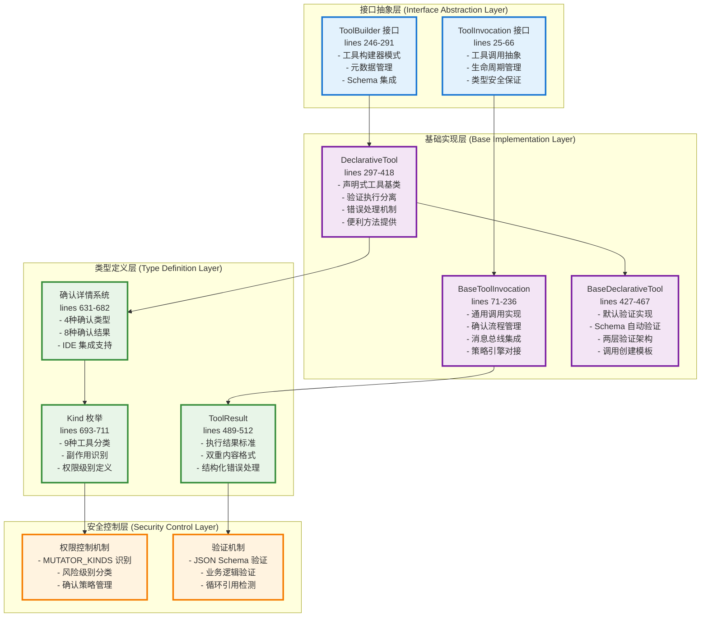
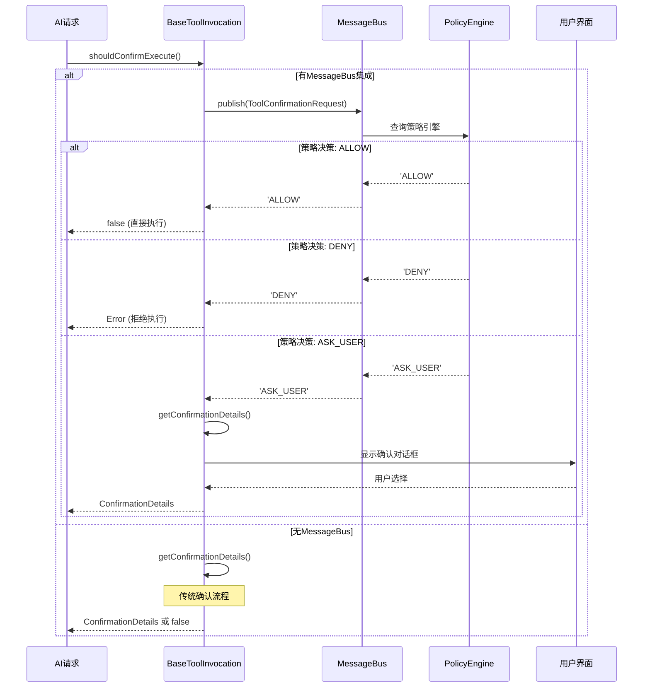

# Gemini CLI tools.ts 核心架构深度分析

## 文件概述

`packages/core/src/tools/tools.ts` 是 Gemini
CLI 工具系统的**核心基础架构文件**，定义了整个工具系统的基础接口、抽象类、类型系统和安全机制。这个文件体现了现代软件架构的最佳实践，包含了**719行**精心设计的代码。

### 文件统计信息

- **代码行数**: 719 行
- **接口定义**: 8 个核心接口
- **抽象类**: 3 个基础类
- **枚举类型**: 2 个重要枚举
- **类型定义**: 10+ 个联合类型和结构体
- **设计模式**: 构建器、模板方法、策略、观察者

## 整体架构层次



## 核心接口设计分析

### 1. ToolInvocation 接口 - 工具调用抽象 (lines 25-66)

这是工具系统的**核心抽象**，定义了一个已验证且准备执行的工具调用。

```typescript
export interface ToolInvocation<
  TParams extends object,
  TResult extends ToolResult,
> {
  // 核心数据
  params: TParams; // 已验证的参数

  // 生命周期方法
  getDescription(): string; // 执行前描述
  toolLocations(): ToolLocation[]; // 影响范围
  shouldConfirmExecute( // 确认检查
    abortSignal: AbortSignal,
  ): Promise<ToolCallConfirmationDetails | false>;
  execute( // 实际执行
    signal: AbortSignal,
    updateOutput?: (output: string | AnsiOutput) => void,
    shellExecutionConfig?: ShellExecutionConfig,
  ): Promise<TResult>;
}
```

**设计亮点**：

1. **类型安全**: 泛型 `<TParams, TResult>` 确保编译时类型检查
2. **生命周期分离**: 描述 → 确认 → 执行的清晰流程
3. **可取消性**: 全面支持 `AbortSignal` 取消机制
4. **流式输出**: `updateOutput` 回调支持实时输出更新
5. **透明性**: `toolLocations()` 提供操作范围的可视性

### 2. ToolBuilder 接口 - 构建器模式 (lines 246-291)

实现了**构建器设计模式**，分离工具定义和实例化逻辑。

```typescript
export interface ToolBuilder<
  TParams extends object,
  TResult extends ToolResult,
> {
  // 工具元数据
  name: string; // 内部标识符
  displayName: string; // 用户友好名称
  description: string; // 功能描述
  kind: Kind; // 工具分类（安全控制）
  schema: FunctionDeclaration; // Gemini API 兼容模式

  // 输出特性
  isOutputMarkdown: boolean; // 输出格式标识
  canUpdateOutput: boolean; // 流式输出能力

  // 核心构建方法
  build(params: TParams): ToolInvocation<TParams, TResult>;
}
```

**架构优势**：

- **元数据驱动**: 丰富的元数据支持工具分类和权限管理
- **标准兼容**: `schema` 属性直接对接 Gemini API
- **特性声明**: 明确声明输出格式和能力特性

## 基础实现层架构

### 1. BaseToolInvocation - 通用调用实现 (lines 71-236)

这个抽象基类实现了**复杂的确认流程和消息总线集成**。

#### 确认流程架构



#### 关键方法深度解析

**getMessageBusDecision() 方法** (lines 145-228)：

```typescript
protected getMessageBusDecision(abortSignal: AbortSignal): Promise<'ALLOW' | 'DENY' | 'ASK_USER'> {
  const correlationId = randomUUID();
  const toolCall = {
    name: this._toolName || this.constructor.name,
    args: this.params as Record<string, unknown>
  };

  return new Promise<'ALLOW' | 'DENY' | 'ASK_USER'>((resolve) => {
    // 30秒超时机制
    const timeoutId = setTimeout(() => {
      cleanup();
      resolve('ASK_USER'); // 默认策略：超时时询问用户
    }, 30000);

    // AbortSignal 支持
    const abortHandler = () => {
      cleanup();
      resolve('DENY');
    };

    // 响应处理器
    const responseHandler = (response: ToolConfirmationResponse) => {
      if (response.correlationId === correlationId) {
        cleanup();
        if (response.requiresUserConfirmation) {
          resolve('ASK_USER');
        } else if (response.confirmed) {
          resolve('ALLOW');
        } else {
          resolve('DENY');
        }
      }
    };

    // 设置监听器和发送请求
    this.messageBus?.subscribe(MessageBusType.TOOL_CONFIRMATION_RESPONSE, responseHandler);
    this.messageBus?.publish(request);
  });
}
```

**架构特点**：

1. **异步决策**: 支持复杂的异步策略评估
2. **超时保护**: 30秒超时避免无限等待
3. **关联ID**: 确保请求响应匹配
4. **资源清理**: 完善的监听器清理机制
5. **默认安全**: 超时默认选择用户确认

### 2. DeclarativeTool - 声明式工具基类 (lines 297-418)

实现了**声明式工具设计模式**，分离验证和执行逻辑。

```typescript
export abstract class DeclarativeTool<
  TParams extends object,
  TResult extends ToolResult,
> implements ToolBuilder<TParams, TResult>
{
  constructor(
    readonly name: string,
    readonly displayName: string,
    readonly description: string,
    readonly kind: Kind, // 安全分类
    readonly parameterSchema: unknown, // JSON Schema
    readonly isOutputMarkdown: boolean = true,
    readonly canUpdateOutput: boolean = false,
    readonly messageBus?: MessageBus, // 消息总线
    readonly extensionName?: string, // 扩展标识
    readonly extensionId?: string,
  ) {}

  // 抽象方法：子类必须实现
  abstract build(params: TParams): ToolInvocation<TParams, TResult>;

  // 模板方法：标准执行流程
  async buildAndExecute(
    params: TParams,
    signal: AbortSignal,
    updateOutput?: (output: string | AnsiOutput) => void,
    shellExecutionConfig?: ShellExecutionConfig,
  ): Promise<TResult> {
    const invocation = this.build(params); // 构建调用
    return invocation.execute(signal, updateOutput, shellExecutionConfig); // 执行
  }

  // 安全方法：永不抛出异常
  async validateBuildAndExecute(
    params: TParams,
    abortSignal: AbortSignal,
  ): Promise<ToolResult> {
    const invocationOrError = this.silentBuild(params);

    if (invocationOrError instanceof Error) {
      // 验证失败：返回结构化错误
      return {
        llmContent: `Error: Invalid parameters provided. Reason: ${invocationOrError.message}`,
        returnDisplay: invocationOrError.message,
        error: {
          message: invocationOrError.message,
          type: ToolErrorType.INVALID_TOOL_PARAMS,
        },
      };
    }

    try {
      return await invocationOrError.execute(abortSignal);
    } catch (error) {
      // 执行失败：返回结构化错误
      const errorMessage =
        error instanceof Error ? error.message : String(error);
      return {
        llmContent: `Error: Tool call execution failed. Reason: ${errorMessage}`,
        returnDisplay: errorMessage,
        error: {
          message: errorMessage,
          type: ToolErrorType.EXECUTION_FAILED,
        },
      };
    }
  }
}
```

**设计模式分析**：

1. **模板方法模式**: `buildAndExecute` 定义标准流程，子类实现细节
2. **错误处理策略**: 提供安全和非安全两种执行方式
3. **元数据驱动**: 丰富的构造参数支持灵活配置

### 3. BaseDeclarativeTool - 默认验证实现 (lines 427-467)

提供了**两层验证架构**的默认实现。

```typescript
export abstract class BaseDeclarativeTool<
  TParams extends object,
  TResult extends ToolResult,
> extends DeclarativeTool<TParams, TResult> {
  // 实现构建方法：验证 + 创建
  build(params: TParams): ToolInvocation<TParams, TResult> {
    const validationError = this.validateToolParams(params);
    if (validationError) {
      throw new Error(validationError);
    }
    return this.createInvocation(
      params,
      this.messageBus,
      this.name,
      this.displayName,
    );
  }

  // 两层验证机制
  override validateToolParams(params: TParams): string | null {
    // 第一层：JSON Schema 验证
    const schemaErrors = SchemaValidator.validate(
      this.schema.parametersJsonSchema,
      params,
    );
    if (schemaErrors) return schemaErrors;

    // 第二层：业务逻辑验证
    return this.validateToolParamValues(params);
  }

  // 业务验证钩子：子类可重写
  protected validateToolParamValues(_params: TParams): string | null {
    return null; // 默认通过
  }

  // 抽象方法：子类必须实现调用创建
  protected abstract createInvocation(
    params: TParams,
    messageBus?: MessageBus,
    _toolName?: string,
    _toolDisplayName?: string,
  ): ToolInvocation<TParams, TResult>;
}
```

**验证架构优势**：

1. **分层验证**: Schema验证 + 业务验证的清晰分层
2. **可扩展性**: 子类可以重写业务验证逻辑
3. **早期失败**: 验证失败时立即抛出异常
4. **类型安全**: 验证通过后保证参数类型正确

## 安全机制和权限控制

### 1. 工具分类系统

```typescript
// lines 693-703: 工具类型枚举
export enum Kind {
  Read = 'read', // 只读操作 - 低风险
  Edit = 'edit', // 编辑操作 - 中等风险
  Delete = 'delete', // 删除操作 - 高风险
  Move = 'move', // 移动操作 - 中等风险
  Search = 'search', // 搜索操作 - 低风险
  Execute = 'execute', // 执行操作 - 高风险
  Think = 'think', // 思考操作 - 低风险
  Fetch = 'fetch', // 网络获取 - 中等风险
  Other = 'other', // 其他操作 - 待定
}

// lines 706-711: 副作用工具识别
export const MUTATOR_KINDS: Kind[] = [
  Kind.Edit, // 文件修改
  Kind.Delete, // 文件删除
  Kind.Move, // 文件移动
  Kind.Execute, // 命令执行
] as const;
```

### 2. 安全策略矩阵

| 工具类型  | 风险级别 | 需要确认 | 权限要求 | 典型操作        | 安全考虑       |
| --------- | -------- | -------- | -------- | --------------- | -------------- |
| `Read`    | 🟢 低    | 否       | 基础读取 | 文件内容读取    | 信息泄露风险   |
| `Search`  | 🟢 低    | 否       | 基础搜索 | 文件/内容搜索   | 索引遍历风险   |
| `Think`   | 🟢 低    | 否       | 内存操作 | 计算/推理       | CPU/内存消耗   |
| `Fetch`   | 🟡 中    | 可选     | 网络访问 | HTTP请求        | 网络安全风险   |
| `Edit`    | 🟡 中    | 是       | 文件写入 | 文件修改        | 数据完整性风险 |
| `Move`    | 🟡 中    | 是       | 文件系统 | 文件重命名/移动 | 数据丢失风险   |
| `Execute` | 🔴 高    | 是       | 系统执行 | Shell命令       | 系统安全风险   |
| `Delete`  | 🔴 高    | 是       | 删除权限 | 文件/目录删除   | 不可逆数据丢失 |

### 3. 确认类型系统

```typescript
// lines 678-682: 确认详情联合类型
export type ToolCallConfirmationDetails =
  | ToolEditConfirmationDetails // 文件编辑确认
  | ToolExecuteConfirmationDetails // 命令执行确认
  | ToolMcpConfirmationDetails // MCP工具确认
  | ToolInfoConfirmationDetails; // 信息展示确认
```

每种确认类型针对特定场景设计：

#### ToolEditConfirmationDetails (lines 631-645)

```typescript
export interface ToolEditConfirmationDetails {
  type: 'edit';
  title: string;
  fileName: string;
  filePath: string;
  fileDiff: string; // unified diff 格式
  originalContent: string | null;
  newContent: string;
  isModifying?: boolean; // 是否为修改模式
  ideConfirmation?: Promise<DiffUpdateResult>; // IDE 集成支持
  onConfirm: (
    outcome: ToolConfirmationOutcome,
    payload?: ToolConfirmationPayload,
  ) => Promise<void>;
}
```

**特点**：

- **差异可视化**: 提供完整的文件变更对比
- **IDE 集成**: 支持编辑器内的差异预览和接受
- **修改支持**: 用户可以在确认时修改建议的变更

#### ToolExecuteConfirmationDetails (lines 653-659)

```typescript
export interface ToolExecuteConfirmationDetails {
  type: 'exec';
  title: string;
  command: string; // 完整命令
  rootCommand: string; // 根命令（用于分类）
  onConfirm: (outcome: ToolConfirmationOutcome) => Promise<void>;
}
```

**安全考虑**：

- **命令透明**: 显示完整的执行命令
- **根命令识别**: 便于实施基于命令类型的策略
- **执行环境**: 可以与沙箱环境集成

### 4. 确认结果处理

```typescript
// lines 684-691: 确认结果枚举
export enum ToolConfirmationOutcome {
  ProceedOnce = 'proceed_once', // 单次执行
  ProceedAlways = 'proceed_always', // 工具级别白名单
  ProceedAlwaysServer = 'proceed_always_server', // 服务器级别白名单
  ProceedAlwaysTool = 'proceed_always_tool', // 特定工具白名单
  ModifyWithEditor = 'modify_with_editor', // 编辑器内修改
  Cancel = 'cancel', // 取消执行
}
```

**白名单策略**：

- **层次化白名单**: 支持不同粒度的信任级别
- **临时vs永久**: 区分一次性执行和长期信任
- **可撤销性**: 白名单决策可以被后续策略覆盖

## 类型系统和数据结构

### 1. ToolResult 接口设计 (lines 489-512)

这是工具执行结果的**标准化接口**，支持双重内容格式。

```typescript
export interface ToolResult {
  llmContent: PartListUnion; // LLM历史内容（结构化）
  returnDisplay: ToolResultDisplay; // 用户显示内容（格式化）
  error?: {
    // 结构化错误信息
    message: string; // 人类可读错误描述
    type?: ToolErrorType; // 机器可读错误分类
  };
}
```

**双重内容架构**：

1. **llmContent**: 用于AI模型的上下文，采用Gemini API的 `PartListUnion` 格式
2. **returnDisplay**: 用于用户界面显示，支持多种格式化选项

### 2. 显示格式类型系统

```typescript
// lines 603: 显示内容联合类型
export type ToolResultDisplay = string | FileDiff | AnsiOutput | TodoList;
```

**格式支持分析**：

#### string - 纯文本格式

- 最通用的输出格式
- 支持Markdown渲染
- 适用于简单的文本输出

#### FileDiff - 文件差异格式 (lines 612-618)

```typescript
export interface FileDiff {
  fileDiff: string; // unified diff 格式文本
  fileName: string; // 文件名
  originalContent: string | null; // 原始内容
  newContent: string; // 修改后内容
  diffStat?: DiffStat; // 详细变更统计
}
```

#### DiffStat - 变更统计 (lines 620-629)

```typescript
export interface DiffStat {
  // AI模型的变更统计
  model_added_lines: number;
  model_removed_lines: number;
  model_added_chars: number;
  model_removed_chars: number;

  // 用户的二次编辑统计
  user_added_lines: number;
  user_removed_lines: number;
  user_added_chars: number;
  user_removed_chars: number;
}
```

**双重统计的价值**：

- **溯源追踪**: 区分AI建议和用户修改
- **质量评估**: 分析AI建议的准确性
- **审计支持**: 完整的变更历史记录

#### AnsiOutput - 终端输出格式

- 保持终端颜色和格式
- 支持实时流式输出
- 适用于命令行工具输出

#### TodoList - 任务列表格式 (lines 599-610)

```typescript
export interface TodoList {
  todos: Todo[];
}

export interface Todo {
  description: string;
  status: TodoStatus; // 'pending' | 'in_progress' | 'completed' | 'cancelled'
}
```

## 辅助工具和实用函数

### 1. Schema 循环检测算法 (lines 519-597)

```typescript
export function hasCycleInSchema(schema: object): boolean {
  // 实现深度优先搜索检测 $ref 循环引用
  function traverse(
    node: unknown,
    visitedRefs: Set<string>, // 全局访问记录
    pathRefs: Set<string>, // 当前路径记录
  ): boolean {
    // 检测 $ref 引用
    if ('$ref' in node && typeof node.$ref === 'string') {
      const ref = node.$ref;

      // 检测循环：当前路径中已存在相同引用
      if (pathRefs.has(ref)) {
        return true; // 发现循环！
      }

      // 已访问过的引用，直接返回
      if (visitedRefs.has(ref)) {
        return false;
      }

      // 递归检查引用目标
      const resolvedNode = resolveRef(ref);
      if (resolvedNode) {
        visitedRefs.add(ref);
        pathRefs.add(ref);
        const hasCycle = traverse(resolvedNode, visitedRefs, pathRefs);
        pathRefs.delete(ref); // 回溯
        return hasCycle;
      }
    }

    // 遍历所有属性
    for (const key in node) {
      if (traverse(node[key], visitedRefs, pathRefs)) {
        return true;
      }
    }

    return false;
  }

  return traverse(schema, new Set<string>(), new Set<string>());
}
```

**算法特点**：

1. **深度优先搜索**: 系统遍历Schema结构
2. **双重Set追踪**: 区分全局访问和当前路径
3. **回溯机制**: 正确处理复杂引用关系
4. **安全保护**: 防止恶意Schema导致无限递归

### 2. 工具类型检查 (lines 479-487)

```typescript
export function isTool(obj: unknown): obj is AnyDeclarativeTool {
  return (
    typeof obj === 'object' &&
    obj !== null &&
    'name' in obj &&
    'build' in obj &&
    typeof (obj as AnyDeclarativeTool).build === 'function'
  );
}
```

**类型守卫作用**：

- **运行时验证**: 确保对象符合工具接口
- **类型收窄**: TypeScript编译器类型推断
- **动态加载安全**: 验证动态加载的工具对象

## 设计模式和架构原则

### 1. 使用的设计模式

#### 构建器模式 (Builder Pattern)

- **ToolBuilder接口**: 分离工具定义和实例化
- **优势**: 复杂对象的分步构建，参数验证前置
- **应用**: 所有工具都通过构建器创建实例

#### 模板方法模式 (Template Method Pattern)

- **DeclarativeTool.buildAndExecute()**: 定义标准执行流程
- **抽象方法**: `build()` 和 `createInvocation()` 由子类实现
- **优势**: 统一流程，个性化实现

#### 策略模式 (Strategy Pattern)

- **确认策略**: 不同工具类型采用不同确认策略
- **验证策略**: Schema验证 + 业务验证的组合
- **输出策略**: 多种输出格式的统一处理

#### 观察者模式 (Observer Pattern)

- **MessageBus集成**: 工具执行事件的发布订阅
- **实时输出**: `updateOutput` 回调机制
- **策略引擎**: 工具确认请求的异步处理

### 2. 架构原则遵循

#### SOLID原则

- **单一职责**: 每个接口和类职责明确
- **开放封闭**: 对扩展开放，对修改封闭
- **里氏替换**: 子类可以无缝替换父类
- **接口隔离**: 接口设计精准，无冗余方法
- **依赖倒置**: 依赖抽象，不依赖具体实现

#### 其他设计原则

- **组合优于继承**: 通过接口组合实现功能
- **尽早验证**: 参数验证在执行前完成
- **快速失败**: 错误情况立即抛出异常
- **资源管理**: 正确的生命周期管理和清理

## 扩展性和可维护性

### 1. 扩展点设计

#### 新工具类型添加

```typescript
// 1. 继承 BaseDeclarativeTool
class NewTool extends BaseDeclarativeTool<NewParams, NewResult> {
  constructor(config: Config) {
    super(
      'new-tool',                    // 工具名称
      'New Tool',                    // 显示名称
      'Description of new tool',     // 描述
      Kind.Other,                    // 工具分类
      newToolSchema,                 // 参数Schema
      true,                          // Markdown输出
      false,                         // 流式输出
      messageBus                     // 消息总线
    );
  }

  // 2. 实现参数验证
  protected validateToolParamValues(params: NewParams): string | null {
    // 自定义验证逻辑
    return null;
  }

  // 3. 创建工具调用实例
  protected createInvocation(params: NewParams, ...): ToolInvocation<NewParams, NewResult> {
    return new NewToolInvocation(params, ...);
  }
}

// 4. 实现工具调用
class NewToolInvocation extends BaseToolInvocation<NewParams, NewResult> {
  async execute(signal: AbortSignal): Promise<NewResult> {
    // 具体执行逻辑
  }

  getDescription(): string {
    // 返回执行描述
  }
}
```

#### 新确认类型添加

```typescript
// 1. 定义新的确认详情接口
export interface ToolCustomConfirmationDetails {
  type: 'custom';
  title: string;
  customField: string;
  onConfirm: (outcome: ToolConfirmationOutcome) => Promise<void>;
}

// 2. 扩展联合类型
export type ToolCallConfirmationDetails =
  | ToolEditConfirmationDetails
  | ToolExecuteConfirmationDetails
  | ToolMcpConfirmationDetails
  | ToolInfoConfirmationDetails
  | ToolCustomConfirmationDetails; // 新增
```

### 2. 版本兼容性

#### 向后兼容保证

- **接口稳定**: 核心接口保持稳定，新功能通过可选参数扩展
- **默认值**: 新参数提供合理的默认值
- **渐进升级**: 旧工具可以逐步迁移到新架构

#### 版本演进策略

- **废弃警告**: 使用 `@deprecated` 标记过时的方法
- **并存期**: 新旧接口在一段时间内并存
- **清理时机**: 在主版本升级时移除废弃接口

## 性能优化考虑

### 1. 内存管理

- **泛型类型**: 编译时类型检查，运行时零开销
- **懒加载**: 工具实例按需创建
- **资源清理**: 完善的监听器和定时器清理

### 2. 执行效率

- **早期验证**: 在执行前完成所有验证
- **异步设计**: 全面支持异步操作和取消
- **流式输出**: 支持大文件的流式处理

### 3. 缓存策略

- **Schema验证缓存**: 避免重复验证相同的Schema
- **工具实例复用**: 无状态工具可以复用实例
- **结果缓存**: 幂等操作可以缓存结果

## 总结

`tools.ts` 文件是 Gemini
CLI 工具系统的**架构基石**，体现了现代软件工程的最佳实践：

### 核心优势

1. **类型安全**: 完善的TypeScript类型系统，编译时错误检查
2. **分层架构**: 清晰的抽象层次，职责分离明确
3. **安全机制**: 多层次的权限控制和用户确认
4. **扩展性**: 灵活的扩展点设计，支持新工具类型
5. **标准化**: 统一的接口规范，便于工具间协作
6. **可维护性**: 良好的代码组织和文档化

### 设计亮点

- **双重内容格式**: 同时满足AI模型和用户界面需求
- **异步确认机制**: 复杂的策略引擎集成
- **两层验证架构**: Schema验证 + 业务验证
- **循环检测算法**: 保护系统免受恶意Schema攻击
- **副作用识别**: 基于工具类型的安全分类

### 架构价值

这个文件不仅定义了工具系统的基础架构，更体现了**企业级软件**的设计思维：

- **安全第一**: 全面的安全考虑和权限控制
- **用户体验**: 丰富的确认机制和错误处理
- **开发者友好**: 清晰的抽象和便利的基类
- **未来兼容**: 良好的扩展性设计

该文件为AI
CLI工具的设计和实现提供了**优秀的架构参考**，是现代软件工程实践的典型范例。

---

_分析日期: 2024年11月14日_ _文件版本: packages/core/src/tools/tools.ts_
_代码行数: 719 lines_ _项目版本: 0.15.0-nightly.20251107.b8eeb553_
