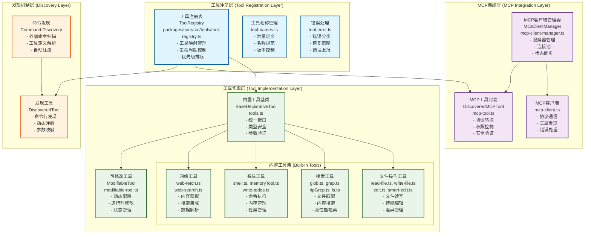
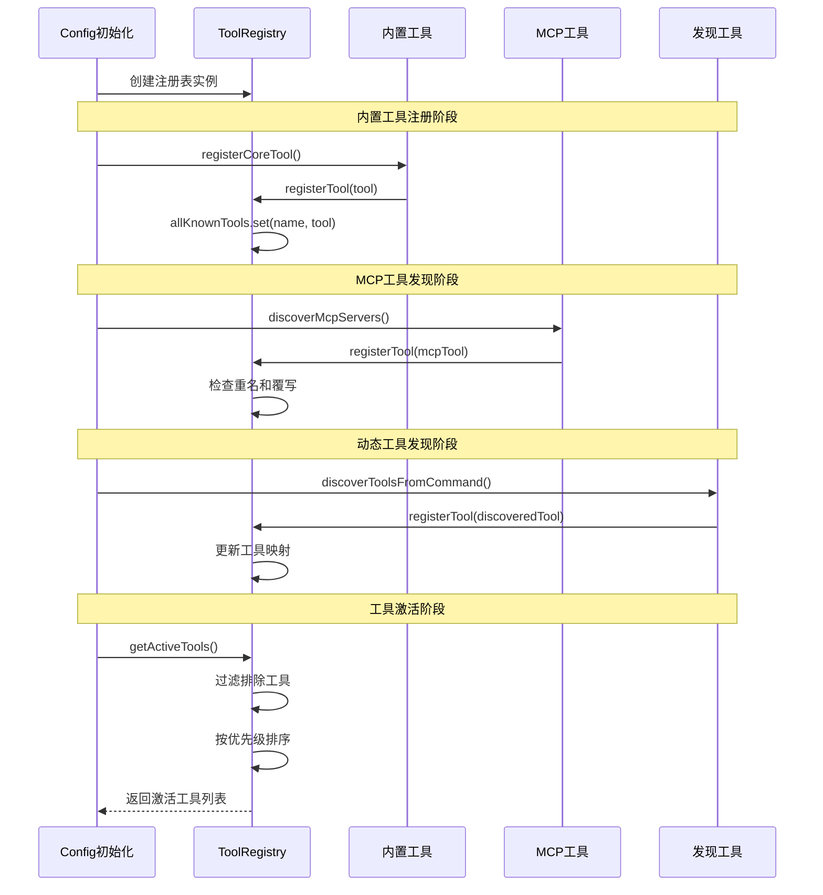
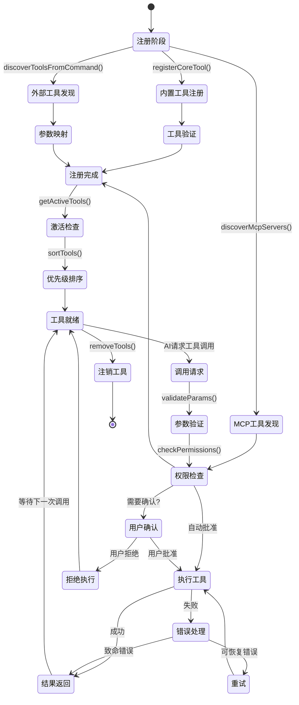

# Gemini CLI 工具注册系统深度架构分析

## 概述

Gemini
CLI的工具系统采用了一套完善的工具注册和管理机制，支持内置工具、动态发现工具和MCP协议扩展工具的统一管理。本文档深入分析工具注册系统的架构设计、实现原理和执行流程。

## 工具系统整体架构



## 工具注册核心机制分析

### 1. 工具注册表 (ToolRegistry)

#### 核心数据结构

```typescript
// packages/core/src/tools/tool-registry.ts
export class ToolRegistry {
  // 核心存储：所有已知工具的映射表
  private allKnownTools: Map<string, AnyDeclarativeTool> = new Map();
  private config: Config;
  private messageBus?: MessageBus;

  constructor(config: Config, messageBus?: MessageBus) {
    this.config = config;
    this.messageBus = messageBus;
  }
}
```

#### 工具注册流程



#### 工具优先级排序机制

```typescript
// 工具排序优先级：内置 > 发现的 > MCP
private sortTools(tools: AnyDeclarativeTool[]): AnyDeclarativeTool[] {
  return tools.sort((a, b) => {
    // 1. 内置工具优先级最高
    const aIsBuiltIn = this.isBuiltInTool(a);
    const bIsBuiltIn = this.isBuiltInTool(b);
    if (aIsBuiltIn && !bIsBuiltIn) return -1;
    if (!aIsBuiltIn && bIsBuiltIn) return 1;

    // 2. 发现工具优先于MCP工具
    const aIsDiscovered = a instanceof DiscoveredTool;
    const bIsDiscovered = b instanceof DiscoveredTool;
    if (aIsDiscovered && !bIsDiscovered) return -1;
    if (!aIsDiscovered && bIsDiscovered) return 1;

    // 3. 同类型工具按名称排序
    return a.name.localeCompare(b.name);
  });
}
```

### 2. 内置工具注册详解

#### 工具注册辅助函数

```typescript
// packages/core/src/config.ts 中的工具注册逻辑
const registerCoreTool = (ToolClass: any, ...args: unknown[]) => {
  const className = ToolClass.name;
  const toolName = ToolClass.Name || className;
  const coreTools = this.getCoreTools(); // 获取启用的工具配置

  // 工具启用检查逻辑
  let isEnabled = true;
  if (coreTools) {
    // 支持多种匹配模式：
    // 1. 精确名称匹配: "ReadFileTool"
    // 2. 简化名称匹配: "read-file"
    // 3. 参数化匹配: "ReadFileTool(param=value)"
    const normalizedClassName = camelCaseToKebabCase(
      className.replace(/Tool$/, ''),
    );
    isEnabled = coreTools.some(
      (tool) =>
        tool === toolName ||
        tool === normalizedClassName ||
        tool.startsWith(`${toolName}(`) ||
        tool.startsWith(`${normalizedClassName}(`),
    );
  }

  if (isEnabled) {
    // 构建工具实例参数
    const messageBus = this.getEnableMessageBusIntegration()
      ? this.messageBus
      : undefined;
    const toolArgs = [...args, messageBus].filter((arg) => arg !== undefined);

    // 注册工具实例
    registry.registerTool(new ToolClass(...toolArgs));
    debugLogger.log(`已注册工具: ${toolName}`);
  }
};
```

#### 内置工具实现模式

每个内置工具遵循统一的实现模式：

```typescript
// 以ReadFileTool为例
export class ReadFileTool extends BaseDeclarativeTool<
  ReadFileToolParams,
  ToolResult
> {
  static readonly Name = READ_FILE_TOOL_NAME; // 'read-file'

  constructor(
    private config: Config,
    messageBus?: MessageBus,
  ) {
    super(
      ReadFileTool.Name, // 工具名称
      'ReadFile', // 显示名称
      'Read the complete contents of a file...', // 工具描述
      Kind.Read, // 工具类型（读取）
      parameterSchema, // JSON Schema参数定义
      true, // 输出Markdown格式
      false, // 不支持实时输出
      messageBus, // 消息总线引用
    );
  }

  // 创建工具调用实例
  protected createInvocation(
    params: ReadFileToolParams,
  ): ToolInvocation<ReadFileToolParams, ToolResult> {
    return new ReadFileToolInvocation(this.config, params, messageBus);
  }
}
```

#### 参数模式定义

```typescript
// 工具参数的JSON Schema定义
const parameterSchema: JSONSchema = {
  type: 'object',
  properties: {
    path: {
      type: 'string',
      description: '要读取的文件路径（绝对路径或相对于当前工作目录）',
    },
    offset: {
      type: 'integer',
      description: '开始读取的行号偏移量（可选）',
      minimum: 1,
    },
    limit: {
      type: 'integer',
      description: '读取的最大行数（可选）',
      minimum: 1,
    },
  },
  required: ['path'],
  additionalProperties: false,
};
```

### 3. 动态工具发现机制

#### 命令行工具发现

```typescript
// 通过命令行发现外部工具
private async discoverAndRegisterToolsFromCommand(): Promise<void> {
  const discoveryCmd = this.config.getToolDiscoveryCommand();
  if (!discoveryCmd) return;

  debugLogger.log(`执行工具发现命令: ${discoveryCmd}`);

  try {
    // 执行外部命令获取工具定义
    const cmdParts = discoveryCmd.split(/\s+/);
    const proc = spawn(cmdParts[0], cmdParts.slice(1), {
      stdio: ['pipe', 'pipe', 'pipe'],
      timeout: 30000 // 30秒超时
    });

    // 收集命令输出
    let stdout = '';
    proc.stdout?.on('data', data => stdout += data);

    await new Promise((resolve, reject) => {
      proc.on('close', code => {
        if (code === 0) resolve(void 0);
        else reject(new Error(`工具发现命令退出码: ${code}`));
      });
      proc.on('error', reject);
    });

    // 解析工具定义JSON
    const discoveredItems = JSON.parse(stdout.trim());

    // 注册发现的工具
    const functions: FunctionDeclaration[] = discoveredItems.functions || [];
    for (const func of functions) {
      const parameters = convertToJSONSchema(func.parameters);

      this.registerTool(new DiscoveredTool(
        this.config,
        func.name,
        DISCOVERED_TOOL_PREFIX + func.name, // 'discovered:'前缀
        func.description ?? '',
        parameters,
        this.messageBus
      ));

      debugLogger.log(`已注册发现工具: ${func.name}`);
    }
  } catch (error) {
    debugLogger.warn(`工具发现失败: ${error}`);
  }
}
```

#### 条件性工具加载

某些工具根据系统环境和依赖条件动态加载：这个就是平时使用的grep和rp两个命令这个同样在package/core/src/config/config.ts 文件中

```typescript
// RipGrep工具的条件加载逻辑
if (this.getUseRipgrep()) {
  let useRipgrep = false;

  try {
    // 检查ripgrep可执行文件是否存在
    useRipgrep = await canUseRipgrep();
  } catch (error) {
    const errorString = error instanceof Error ? error.message : String(error);
    // 记录fallback事件
    logRipgrepFallback(this, new RipgrepFallbackEvent(errorString));
  }

  if (useRipgrep) {
    registerCoreTool(RipGrepTool, this);
    debugLogger.log('使用RipGrep高性能搜索');
  } else {
    registerCoreTool(GrepTool, this);
    debugLogger.log('回退到标准Grep搜索');
  }
} else {
  // 配置明确禁用ripgrep
  registerCoreTool(GrepTool, this);
}
```

### 4. MCP工具集成架构

#### MCP客户端管理器

```typescript
// packages/core/src/tools/mcp-client-manager.ts
export class McpClientManager {
  private clients: Map<string, McpClient> = new Map();
  private toolRegistry: ToolRegistry;
  private cliConfig: Config;

  constructor(toolRegistry: ToolRegistry, cliConfig: Config) {
    this.toolRegistry = toolRegistry;
    this.cliConfig = cliConfig;
  }

  // 发现并注册MCP服务器
  async maybeDiscoverMcpServer(
    name: string,
    config: MCPServerConfig,
  ): Promise<void> {
    // 权限检查
    if (!this.isAllowedMcpServer(name)) {
      debugLogger.warn(`MCP服务器 "${name}" 不在允许列表中`);
      return;
    }

    // 信任文件夹检查
    if (!this.cliConfig.isTrustedFolder()) {
      debugLogger.warn('当前目录不是受信任文件夹，跳过MCP服务器发现');
      return;
    }

    try {
      // 创建MCP客户端
      const client = new McpClient(
        name,
        config,
        this.toolRegistry,
        this.cliConfig,
        this.messageBus,
      );

      // 建立连接
      await client.connect();
      debugLogger.log(`MCP客户端 "${name}" 连接成功`);

      // 发现并注册工具
      await client.discover(this.cliConfig);

      // 存储客户端引用
      this.clients.set(name, client);

      // 更新Gemini客户端工具配置
      const geminiClient = this.cliConfig.getGeminiClient();
      if (geminiClient.isInitialized()) {
        await geminiClient.setTools();
        debugLogger.log('已更新Gemini客户端工具列表');
      }
    } catch (error) {
      debugLogger.error(`MCP服务器 "${name}" 初始化失败:`, error);
      throw error;
    }
  }
}
```

#### MCP工具发现流程

```typescript
// MCP工具发现和注册
export async function discoverTools(
  mcpServerName: string,
  mcpServerConfig: MCPServerConfig,
  mcpClient: Client,
  cliConfig: Config,
  messageBus?: MessageBus,
): Promise<DiscoveredMCPTool[]> {
  // 检查服务器工具能力
  const serverCapabilities = mcpClient.getServerCapabilities();
  if (serverCapabilities?.tools == null) {
    debugLogger.log(`MCP服务器 "${mcpServerName}" 不支持工具`);
    return [];
  }

  const discoveredTools: DiscoveredMCPTool[] = [];

  try {
    // 创建MCP可调用工具
    const mcpCallableTool = mcpToTool(mcpClient, {
      timeout: mcpServerConfig.timeout ?? MCP_DEFAULT_TIMEOUT_MSEC,
    });

    // 获取工具定义
    const tool = await mcpCallableTool.tool();

    // 为每个功能声明创建DiscoveredMCPTool
    for (const funcDecl of tool.functionDeclarations) {
      const discoveredTool = new DiscoveredMCPTool(
        mcpCallableTool, // MCP可调用工具
        mcpServerName, // 服务器名称
        funcDecl.name!, // 工具名称
        funcDecl.description ?? '', // 工具描述
        funcDecl.parametersJsonSchema ?? {
          // 参数模式
          type: 'object',
          properties: {},
        },
        mcpServerConfig.trust, // 信任级别
        undefined, // 显示名称
        cliConfig, // CLI配置
        mcpServerConfig.extension?.name, // 扩展名称
        mcpServerConfig.extension?.id, // 扩展ID
        messageBus, // 消息总线
      );

      discoveredTools.push(discoveredTool);
      debugLogger.log(
        `发现MCP工具: ${funcDecl.name} (服务器: ${mcpServerName})`,
      );
    }
  } catch (error) {
    debugLogger.error(`MCP工具发现失败 (服务器: ${mcpServerName}):`, error);
    throw error;
  }

  return discoveredTools;
}
```

#### MCP工具权限和安全控制

```typescript
// MCP工具调用的安全检查
class DiscoveredMCPToolInvocation extends BaseToolInvocation {
  protected override async getConfirmationDetails(): Promise<
    ToolCallConfirmationDetails | false
  > {
    // 1. 受信任文件夹 + 工具信任设置 = 直接执行
    if (this.cliConfig?.isTrustedFolder() && this.trust) {
      return false; // 无需确认
    }

    // 2. 检查工具白名单
    const serverAllowListKey = `${this.serverName}`;
    const toolAllowListKey = `${this.serverName}:${this.serverToolName}`;

    if (
      DiscoveredMCPToolInvocation.allowlist.has(serverAllowListKey) ||
      DiscoveredMCPToolInvocation.allowlist.has(toolAllowListKey)
    ) {
      return false; // 白名单工具，无需确认
    }

    // 3. 需要用户确认
    return {
      type: 'mcp',
      title: 'Confirm MCP Tool Execution',
      serverName: this.serverName,
      toolName: this.serverToolName,
      description: this.tool.description,
      params: this.params,
      riskLevel: this.trust ? 'low' : 'medium',
    };
  }

  // 更新白名单（用户确认后）
  static updateAllowlist(
    serverName: string,
    toolName: string,
    scope: 'server' | 'tool',
  ): void {
    const key = scope === 'server' ? serverName : `${serverName}:${toolName}`;
    DiscoveredMCPToolInvocation.allowlist.add(key);
    debugLogger.log(`已添加到MCP白名单: ${key}`);
  }
}
```

## 工具执行生命周期



## 错误处理和恢复机制

### 错误分类系统 （和源码不一致，但是大体的逻辑是对的）

```typescript
// packages/core/src/tools/tool-error.ts
export enum ToolErrorType {
  // 参数相关错误（可恢复）
  INVALID_TOOL_PARAMS = 'invalid_tool_params',
  MISSING_REQUIRED_PARAM = 'missing_required_param',

  // 文件系统错误
  FILE_NOT_FOUND = 'file_not_found',
  PERMISSION_DENIED = 'permission_denied',

  // 网络相关错误（可重试）
  NETWORK_ERROR = 'network_error',
  TIMEOUT = 'timeout',

  // 系统资源错误（致命）
  NO_SPACE_LEFT = 'no_space_left',
  MEMORY_LIMIT_EXCEEDED = 'memory_limit_exceeded',

  // 执行错误
  EXECUTION_FAILED = 'execution_failed',
  COMMAND_NOT_FOUND = 'command_not_found',
}

// 致命错误判断
export function isFatalToolError(errorType?: string): boolean {
  const fatalErrors = new Set<string>([
    ToolErrorType.NO_SPACE_LEFT,
    ToolErrorType.MEMORY_LIMIT_EXCEEDED,
    ToolErrorType.PERMISSION_DENIED,
  ]);
  return errorType ? fatalErrors.has(errorType) : false;
}

// 可重试错误判断
export function isRetryableToolError(errorType?: string): boolean {
  const retryableErrors = new Set<string>([
    ToolErrorType.NETWORK_ERROR,
    ToolErrorType.TIMEOUT,
    ToolErrorType.EXECUTION_FAILED,
  ]);
  return errorType ? retryableErrors.has(errorType) : false;
}
```

### 错误恢复策略（没有源码）

```typescript
// 工具执行错误恢复逻辑
class ToolExecutionManager {
  private readonly MAX_RETRIES = 3;
  private readonly RETRY_DELAY_MS = 1000;

  async executeToolWithRecovery(
    tool: DeclarativeTool,
    params: unknown,
  ): Promise<ToolResult> {
    let lastError: Error | undefined;

    for (let attempt = 1; attempt <= this.MAX_RETRIES; attempt++) {
      try {
        debugLogger.log(
          `工具执行尝试 ${attempt}/${this.MAX_RETRIES}: ${tool.name}`,
        );

        // 执行工具
        const result = await tool.execute(params);
        debugLogger.log(`工具执行成功: ${tool.name}`);
        return result;
      } catch (error) {
        lastError = error instanceof Error ? error : new Error(String(error));

        // 错误分类和处理决策
        const errorType = this.classifyError(lastError);

        if (isFatalToolError(errorType)) {
          debugLogger.error(`工具执行遇到致命错误: ${errorType}`);
          throw lastError;
        }

        if (!isRetryableToolError(errorType)) {
          debugLogger.warn(`工具执行遇到不可重试错误: ${errorType}`);
          throw lastError;
        }

        // 可重试错误：等待后重试
        if (attempt < this.MAX_RETRIES) {
          const delay = this.RETRY_DELAY_MS * Math.pow(2, attempt - 1); // 指数退避
          debugLogger.warn(
            `工具执行失败，${delay}ms后重试 (${attempt}/${this.MAX_RETRIES}): ${lastError.message}`,
          );
          await new Promise((resolve) => setTimeout(resolve, delay));
        }
      }
    }

    // 重试耗尽，抛出最后的错误
    debugLogger.error(
      `工具执行最终失败，已重试${this.MAX_RETRIES}次: ${tool.name}`,
    );
    throw lastError!;
  }
}
```

## 性能优化策略

### 1. 懒加载机制（源码没有）

```typescript
// 工具懒加载实现
class LazyToolLoader {
  private loadedTools = new Set<string>();
  private toolPromises = new Map<string, Promise<DeclarativeTool>>();

  async loadTool(toolName: string): Promise<DeclarativeTool> {
    // 避免重复加载
    if (this.loadedTools.has(toolName)) {
      return this.registry.getTool(toolName)!;
    }

    // 避免并发加载同一工具
    if (this.toolPromises.has(toolName)) {
      return await this.toolPromises.get(toolName)!;
    }

    // 创建加载Promise
    const loadPromise = this.doLoadTool(toolName);
    this.toolPromises.set(toolName, loadPromise);

    try {
      const tool = await loadPromise;
      this.loadedTools.add(toolName);
      return tool;
    } finally {
      this.toolPromises.delete(toolName);
    }
  }

  private async doLoadTool(toolName: string): Promise<DeclarativeTool> {
    debugLogger.log(`懒加载工具: ${toolName}`);

    // 根据工具类型选择加载策略
    if (toolName.startsWith('mcp:')) {
      return await this.loadMcpTool(toolName);
    } else if (toolName.startsWith('discovered:')) {
      return await this.loadDiscoveredTool(toolName);
    } else {
      return await this.loadBuiltinTool(toolName);
    }
  }
}
```

### 2. 工具缓存机制（源码没有）

```typescript
// 工具结果缓存
class ToolResultCache {
  private cache = new Map<string, CacheEntry>();
  private readonly TTL_MS = 5 * 60 * 1000; // 5分钟TTL

  generateCacheKey(toolName: string, params: unknown): string {
    return `${toolName}:${JSON.stringify(params, Object.keys(params).sort())}`;
  }

  get(key: string): ToolResult | undefined {
    const entry = this.cache.get(key);
    if (!entry) return undefined;

    // 检查过期
    if (Date.now() - entry.timestamp > this.TTL_MS) {
      this.cache.delete(key);
      return undefined;
    }

    debugLogger.log(`工具结果缓存命中: ${key}`);
    return entry.result;
  }

  set(key: string, result: ToolResult): void {
    this.cache.set(key, {
      result,
      timestamp: Date.now(),
    });

    // 定期清理过期条目
    this.cleanupExpired();
  }
}
```

## 扩展性设计原则

### 1. 接口标准化

工具系统通过标准化接口确保扩展性：

```typescript
// 统一的工具接口
interface DeclarativeTool {
  readonly name: string; // 唯一标识
  readonly displayName: string; // 显示名称
  readonly description: string; // 功能描述
  readonly kind: Kind; // 工具类型
  readonly parameterSchema: JSONSchema; // 参数模式
  readonly outputsMarkdown: boolean; // 输出格式
  readonly supportsStreaming: boolean; // 流式支持

  // 执行接口
  execute(params: unknown): Promise<ToolResult>;
}
```

### 2. 插件化架构（源码没有）

```typescript
// 工具插件接口
interface ToolPlugin {
  name: string;
  version: string;
  description: string;

  // 插件生命周期
  initialize(context: PluginContext): Promise<void>;
  register(registry: ToolRegistry): Promise<void>;
  cleanup(): Promise<void>;

  // 工具提供
  getTools(): DeclarativeTool[];
}

// 插件管理器
class ToolPluginManager {
  private plugins = new Map<string, ToolPlugin>();

  async loadPlugin(pluginPath: string): Promise<void> {
    const plugin = await import(pluginPath);
    await plugin.initialize(this.createPluginContext());
    await plugin.register(this.registry);
    this.plugins.set(plugin.name, plugin);
  }
}
```

## 总结

Gemini CLI的工具注册系统体现了现代软件架构的最佳实践：

### 核心优势

1. **统一接口设计**: 通过标准化的工具接口，确保所有类型工具的一致性
2. **分层架构**: 清晰的分层设计，职责分离，便于维护和扩展
3. **类型安全**: 严格的TypeScript类型系统，编译时错误检查
4. **动态扩展**: 支持运行时工具发现和注册，灵活性强
5. **安全可控**: 完善的权限控制和用户确认机制
6. **错误恢复**: 智能的错误分类和恢复策略
7. **性能优化**: 懒加载、缓存等优化机制

### 设计原则

- **开放封闭原则**: 对扩展开放，对修改封闭
- **单一职责**: 每个组件职责明确，耦合度低
- **依赖倒置**: 基于接口编程，便于测试和替换
- **组合优于继承**: 通过组合实现功能复用

该工具注册系统为AI助手提供了强大、安全、可扩展的工具执行环境，是现代AI
CLI工具的优秀实现范例。
