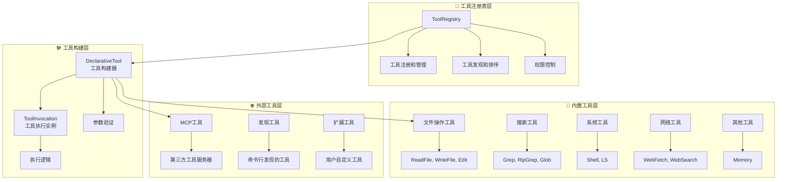
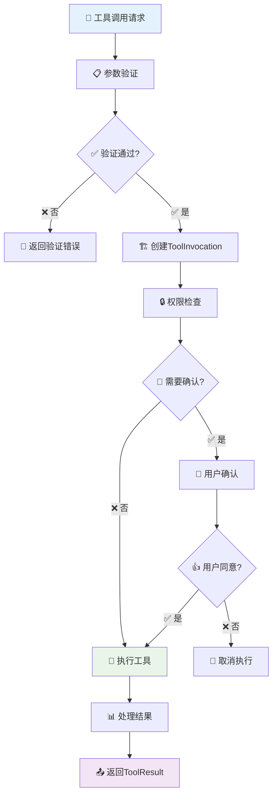

# Gemini CLI 工具系统深度技术分析

## 📋 目录

1. [系统架构概览](#系统架构概览)
2. [工具注册表核心实现](#工具注册表核心实现)
3. [工具基类设计](#工具基类设计)
4. [工具发现机制](#工具发现机制)
5. [权限管理和安全机制](#权限管理和安全机制)
6. [内置工具详细分析](#内置工具详细分析)
7. [MCP工具集成](#mcp工具集成)
8. [工具执行流程](#工具执行流程)
9. [错误处理机制](#错误处理机制)
10. [性能优化策略](#性能优化策略)

---

## 🏗️ 系统架构概览

### 核心架构设计

Gemini
CLI的工具系统采用了分层架构和Builder模式，实现了工具定义与执行的分离，提供了强大的扩展性和安全性。



### 设计原则

| 原则         | 实现方式                | 收益           |
| ------------ | ----------------------- | -------------- |
| **职责分离** | Builder与Invocation分离 | 清晰的架构边界 |
| **类型安全** | 强类型参数验证          | 减少运行时错误 |
| **可扩展性** | 多种工具来源支持        | 丰富的工具生态 |
| **安全性**   | 多层权限验证            | 保护系统安全   |
| **性能优化** | 工具排序和缓存          | 提升执行效率   |

---

## 📋 工具注册表核心实现

### ToolRegistry 类架构

#### 📍 核心文件：`packages/core/src/tools/tool-registry.ts`

```typescript
export class ToolRegistry {
  // 🗂️ 核心存储：所有已知工具的映射表
  private allKnownTools: Map<string, AnyDeclarativeTool> = new Map();
  private config: Config;
  private messageBus?: MessageBus;
  private mcpClientManager: McpClientManager;

  constructor(
    config: Config,
    messageBus?: MessageBus,
    mcpClientManager?: McpClientManager,
  ) {
    this.config = config;
    this.messageBus = messageBus;
    this.mcpClientManager =
      mcpClientManager || new McpClientManager(this, config);
  }
}
```

### 工具注册机制

```typescript
// 🔧 工具注册方法
registerTool(tool: AnyDeclarativeTool): void {
  if (this.allKnownTools.has(tool.name)) {
    if (tool instanceof DiscoveredMCPTool) {
      // 🏷️ MCP工具使用完全限定名避免冲突
      tool = tool.asFullyQualifiedTool();
    } else {
      debugLogger.warn(
        `Tool with name "${tool.name}" is already registered. Overwriting.`,
      );
    }
  }
  this.allKnownTools.set(tool.name, tool);
}
```

**关键特性**：

- ✅ **冲突处理**: 支持工具覆盖，记录警告信息
- ✅ **名称管理**: MCP工具使用完全限定名
- ✅ **统一存储**: 所有工具使用统一的名称映射

### 工具排序策略

```typescript
// 🎯 工具优先级排序
sortTools(): void {
  const getPriority = (tool: AnyDeclarativeTool): number => {
    if (tool instanceof DiscoveredMCPTool) return 2;  // MCP工具
    if (tool instanceof DiscoveredTool) return 1;     // 发现的工具
    return 0; // 内置工具 (最高优先级)
  };

  this.allKnownTools = new Map(
    Array.from(this.allKnownTools.entries()).sort((a, b) => {
      const toolA = a[1];
      const toolB = b[1];
      const priorityA = getPriority(toolA);
      const priorityB = getPriority(toolB);

      // 🔢 按优先级排序
      if (priorityA !== priorityB) {
        return priorityA - priorityB;
      }

      // 📝 MCP工具按服务器名称排序
      if (priorityA === 2) {
        const serverA = (toolA as DiscoveredMCPTool).serverName;
        const serverB = (toolB as DiscoveredMCPTool).serverName;
        return serverA.localeCompare(serverB);
      }

      return 0;
    }),
  );
}
```

**优先级顺序**：

1. **内置工具** (priority: 0) - 最高优先级
2. **发现的工具** (priority: 1) - 中等优先级
3. **MCP工具** (priority: 2) - 按服务器名称排序

### 活跃工具过滤

```typescript
// 🔍 获取活跃工具列表
private getActiveTools(): AnyDeclarativeTool[] {
  const excludedTools = this.config.getExcludeTools() ?? new Set([]);
  const activeTools: AnyDeclarativeTool[] = [];

  for (const tool of this.allKnownTools.values()) {
    if (this.isActiveTool(tool, excludedTools)) {
      activeTools.push(tool);
    }
  }
  return activeTools;
}

// ✅ 检查工具是否活跃
private isActiveTool(
  tool: AnyDeclarativeTool,
  excludeTools?: Set<string>,
): boolean {
  excludeTools ??= this.config.getExcludeTools() ?? new Set([]);
  const normalizedClassName = tool.constructor.name.replace(/^_+/, '');
  const possibleNames = [tool.name, normalizedClassName];

  // 🏷️ MCP工具的特殊名称处理
  if (tool instanceof DiscoveredMCPTool) {
    if (tool.name.startsWith(tool.getFullyQualifiedPrefix())) {
      possibleNames.push(
        tool.name.substring(tool.getFullyQualifiedPrefix().length),
      );
    } else {
      possibleNames.push(`${tool.getFullyQualifiedPrefix()}${tool.name}`);
    }
  }

  return !possibleNames.some((name) => excludeTools.has(name));
}
```

---

## 🛠️ 工具基类设计

### DeclarativeTool 抽象基类

#### 📍 核心文件：`packages/core/src/tools/tools.ts`

```typescript
export abstract class DeclarativeTool<
  TParams extends object,
  TResult extends ToolResult,
> implements ToolBuilder<TParams, TResult>
{
  constructor(
    readonly name: string, // 工具名称
    readonly displayName: string, // 显示名称
    readonly description: string, // 工具描述
    readonly kind: Kind, // 工具类型
    readonly parameterSchema: unknown, // 参数Schema
    readonly isOutputMarkdown: boolean = true, // 输出是否为Markdown
    readonly canUpdateOutput: boolean = false, // 是否支持输出更新
    readonly messageBus?: MessageBus, // 消息总线
    readonly extensionName?: string, // 扩展名称
    readonly extensionId?: string, // 扩展ID
  ) {}

  // 📋 生成函数声明Schema
  get schema(): FunctionDeclaration {
    return {
      name: this.name,
      description: this.description,
      parametersJsonSchema: this.parameterSchema,
    };
  }

  // ✅ 参数验证 (子类可重写)
  validateToolParams(_params: TParams): string | null {
    return null;
  }

  // 🏗️ 抽象方法：构建工具执行实例
  abstract build(params: TParams): ToolInvocation<TParams, TResult>;

  // 🚀 构建并执行工具
  async buildAndExecute(
    params: TParams,
    signal: AbortSignal,
    updateOutput?: (output: string | AnsiOutput) => void,
    shellExecutionConfig?: ShellExecutionConfig,
  ): Promise<TResult> {
    const invocation = this.build(params);
    return invocation.execute(signal, updateOutput, shellExecutionConfig);
  }
}
```

### BaseDeclarativeTool 实现类

```typescript
export abstract class BaseDeclarativeTool<
  TParams extends object,
  TResult extends ToolResult,
> extends DeclarativeTool<TParams, TResult> {
  // 🏗️ 构建工具执行实例
  build(params: TParams): ToolInvocation<TParams, TResult> {
    // 1️⃣ 参数验证
    const validationError = this.validateToolParams(params);
    if (validationError) {
      throw new Error(validationError);
    }

    // 2️⃣ 创建执行实例
    return this.createInvocation(
      params,
      this.messageBus,
      this.name,
      this.displayName,
    );
  }

  // ✅ 参数验证（JSON Schema + 自定义验证）
  override validateToolParams(params: TParams): string | null {
    // JSON Schema验证
    const errors = SchemaValidator.validate(
      this.schema.parametersJsonSchema,
      params,
    );

    if (errors) {
      return errors;
    }

    // 自定义业务逻辑验证
    return this.validateToolParamValues(params);
  }

  // 🎯 自定义参数值验证（子类重写）
  protected validateToolParamValues(_params: TParams): string | null {
    return null;
  }

  // 🏭 抽象工厂方法：创建执行实例
  protected abstract createInvocation(
    params: TParams,
    messageBus?: MessageBus,
    _toolName?: string,
    _toolDisplayName?: string,
  ): ToolInvocation<TParams, TResult>;
}
```

### ToolInvocation 接口设计

```typescript
export interface ToolInvocation<
  TParams extends object,
  TResult extends ToolResult,
> {
  params: TParams;

  // 📝 获取工具描述
  getDescription(): string;

  // 📍 获取工具位置信息
  toolLocations(): ToolLocation[];

  // 🔒 检查是否需要确认执行
  shouldConfirmExecute(
    abortSignal: AbortSignal,
  ): Promise<ToolCallConfirmationDetails | false>;

  // 🚀 执行工具
  execute(
    signal: AbortSignal,
    updateOutput?: (output: string | AnsiOutput) => void,
    shellExecutionConfig?: ShellExecutionConfig,
  ): Promise<TResult>;
}
```

### BaseToolInvocation 基础实现

```typescript
export abstract class BaseToolInvocation<
  TParams extends object,
  TResult extends ToolResult,
> implements ToolInvocation<TParams, TResult>
{
  constructor(
    readonly params: TParams,
    protected readonly messageBus?: MessageBus,
    readonly _toolName?: string,
    readonly _toolDisplayName?: string,
    readonly _serverName?: string,
  ) {}

  abstract getDescription(): string;

  toolLocations(): ToolLocation[] {
    return [];
  }

  // 🔒 执行确认流程
  async shouldConfirmExecute(
    abortSignal: AbortSignal,
  ): Promise<ToolCallConfirmationDetails | false> {
    if (this.messageBus) {
      // 1️⃣ 获取消息总线决策
      const decision = await this.getMessageBusDecision(abortSignal);

      if (decision === 'ALLOW') {
        return false; // 无需确认，直接执行
      }

      if (decision === 'DENY') {
        throw new Error(
          `Tool execution for "${
            this._toolDisplayName || this._toolName
          }" denied by policy.`,
        );
      }

      if (decision === 'ASK_USER') {
        return this.getConfirmationDetails(abortSignal);
      }
    }

    // 2️⃣ 默认需要用户确认
    return this.getConfirmationDetails(abortSignal);
  }
}
```

---

## 🔍 工具发现机制

### 工具发现流程

```typescript
// 🔍 发现所有工具的主流程
async discoverAllTools(): Promise<void> {
  // 1️⃣ 移除之前发现的工具
  this.removeDiscoveredTools();

  // 2️⃣ 从命令行发现工具
  await this.discoverAndRegisterToolsFromCommand();
}
```

### 命令行工具发现

```typescript
// 📋 从命令行发现工具
private async discoverAndRegisterToolsFromCommand(): Promise<void> {
  const discoveryCmd = this.config.getToolDiscoveryCommand();
  if (!discoveryCmd) {
    return;
  }

  try {
    // 🚀 执行工具发现命令
    const cmdParts = parse(discoveryCmd);
    const proc = spawn(cmdParts[0] as string, cmdParts.slice(1) as string[]);

    let stdout = '';
    let stderr = '';

    // 📊 收集输出
    proc.stdout?.on('data', (data: Buffer) => {
      stdout += data.toString();
    });

    proc.stderr?.on('data', (data: Buffer) => {
      stderr += data.toString();
    });

    // ⏳ 等待进程完成
    await new Promise<void>((resolve, reject) => {
      proc.on('close', (code) => {
        if (code === 0) {
          resolve();
        } else {
          reject(new Error(`Discovery command failed with code ${code}: ${stderr}`));
        }
      });
    });

    // 📋 解析发现的工具
    const functions: FunctionDeclaration[] = [];
    const discoveredItems = JSON.parse(stdout.trim());

    for (const tool of discoveredItems) {
      if (tool && typeof tool === 'object') {
        if (Array.isArray(tool['function_declarations'])) {
          functions.push(...tool['function_declarations']);
        } else if (Array.isArray(tool['functionDeclarations'])) {
          functions.push(...tool['functionDeclarations']);
        } else if (tool['name']) {
          functions.push(tool as FunctionDeclaration);
        }
      }
    }

    // 🔧 注册每个发现的工具
    for (const func of functions) {
      if (!func.name) {
        debugLogger.warn('Discovered a tool with no name. Skipping.');
        continue;
      }

      const parameters = func.parametersJsonSchema &&
        typeof func.parametersJsonSchema === 'object' &&
        !Array.isArray(func.parametersJsonSchema)
          ? func.parametersJsonSchema
          : {};

      this.registerTool(
        new DiscoveredTool(
          this.config,
          func.name,
          DISCOVERED_TOOL_PREFIX + func.name,
          func.description ?? '',
          parameters as Record<string, unknown>,
          this.messageBus,
        ),
      );
    }
  } catch (e) {
    console.error(`Tool discovery command "${discoveryCmd}" failed:`, e);
    throw e;
  }
}
```

### DiscoveredTool 实现

```typescript
export class DiscoveredTool extends BaseDeclarativeTool<
  ToolParams,
  ToolResult
> {
  private readonly originalName: string;

  constructor(
    private readonly config: Config,
    originalName: string,
    prefixedName: string,
    description: string,
    override readonly parameterSchema: Record<string, unknown>,
    messageBus?: MessageBus,
  ) {
    const discoveryCmd = config.getToolDiscoveryCommand()!;
    const callCommand = config.getToolCallCommand()!;

    // 📝 构建详细描述
    const fullDescription =
      description +
      `

This tool was discovered from the project by executing the command \`${discoveryCmd}\` on project root.
When called, this tool will execute the command \`${callCommand} ${originalName}\` on project root.
Tool discovery and call commands can be configured in project or user settings.

When called, the tool call command is executed as a subprocess.
On success, tool output is returned as a json string.
Otherwise, the following information is returned:

Stdout: Output on stdout stream. Can be \`(empty)\` or partial.
Stderr: Output on stderr stream. Can be \`(empty)\` or partial.
Error: Error or \`(none)\` if no error was reported for the subprocess.
Exit Code: Exit code or \`(none)\` if terminated by signal.
Signal: Signal number or \`(none)\` if no signal was received.
`;

    super(
      prefixedName,
      prefixedName,
      fullDescription,
      Kind.Other,
      parameterSchema,
      false, // isOutputMarkdown
      false, // canUpdateOutput
      messageBus,
    );

    this.originalName = originalName;
  }
}
```

### 发现工具执行

```typescript
class DiscoveredToolInvocation extends BaseToolInvocation<
  ToolParams,
  ToolResult
> {
  async execute(
    _signal: AbortSignal,
    _updateOutput?: (output: string) => void,
  ): Promise<ToolResult> {
    const callCommand = this.config.getToolCallCommand()!;

    // 🚀 启动子进程执行工具
    const child = spawn(callCommand, [this.originalToolName]);

    // 📤 发送参数到stdin
    child.stdin.write(JSON.stringify(this.params));
    child.stdin.end();

    let stdout = '';
    let stderr = '';
    let error: Error | null = null;
    let code: number | null = null;
    let signal: NodeJS.Signals | null = null;

    // 📊 收集执行结果
    await new Promise<void>((resolve) => {
      child.stdout?.on('data', (data: Buffer) => {
        stdout += data.toString();
      });

      child.stderr?.on('data', (data: Buffer) => {
        stderr += data.toString();
      });

      child.on('error', (err: Error) => {
        error = err;
      });

      child.on(
        'close',
        (exitCode: number | null, killSignal: NodeJS.Signals | null) => {
          code = exitCode;
          signal = killSignal;
          resolve();
        },
      );
    });

    // ❌ 错误处理
    if (error || code !== 0 || signal || stderr) {
      const llmContent = [
        `Stdout: ${stdout || '(empty)'}`,
        `Stderr: ${stderr || '(empty)'}`,
        `Error: ${error ?? '(none)'}`,
        `Exit Code: ${code ?? '(none)'}`,
        `Signal: ${signal ?? '(none)'}`,
      ].join('\n');

      return {
        llmContent,
        returnDisplay: llmContent,
        error: {
          message: llmContent,
          type: ToolErrorType.DISCOVERED_TOOL_EXECUTION_ERROR,
        },
      };
    }

    // ✅ 成功返回
    return {
      llmContent: stdout,
      returnDisplay: stdout,
    };
  }
}
```

---

## 🔐 权限管理和安全机制

### 工具类型和权限级别

```typescript
// 🏷️ 工具类型枚举
export enum Kind {
  Read = 'read', // 只读操作
  Edit = 'edit', // 编辑操作
  Delete = 'delete', // 删除操作
  Move = 'move', // 移动操作
  Search = 'search', // 搜索操作
  Execute = 'execute', // 执行操作
  Think = 'think', // 思考操作
  Fetch = 'fetch', // 获取操作
  Other = 'other', // 其他操作
}

// ⚠️ 有副作用的工具类型
export const MUTATOR_KINDS: Kind[] = [
  Kind.Edit,
  Kind.Delete,
  Kind.Move,
  Kind.Execute,
] as const;
```

### 工具确认流程

```typescript
// 🔒 工具执行确认流程
async shouldConfirmExecute(
  abortSignal: AbortSignal,
): Promise<ToolCallConfirmationDetails | false> {
  if (this.messageBus) {
    // 1️⃣ 获取消息总线策略决策
    const decision = await this.getMessageBusDecision(abortSignal);

    if (decision === 'ALLOW') {
      return false; // 策略允许，无需确认
    }

    if (decision === 'DENY') {
      throw new Error(
        `Tool execution for "${
          this._toolDisplayName || this._toolName
        }" denied by policy.`,
      );
    }

    if (decision === 'ASK_USER') {
      return this.getConfirmationDetails(abortSignal);
    }
  }

  // 2️⃣ 默认获取用户确认
  return this.getConfirmationDetails(abortSignal);
}
```

### MessageBus 决策机制

```typescript
// 🎯 获取消息总线决策
protected getMessageBusDecision(
  abortSignal: AbortSignal,
): Promise<'ALLOW' | 'DENY' | 'ASK_USER'> {
  if (!this.messageBus) {
    return Promise.resolve('ALLOW');
  }

  const correlationId = randomUUID();
  const toolCall = {
    name: this._toolName || this.constructor.name,
    args: this.params as Record<string, unknown>,
  };

  return new Promise<'ALLOW' | 'DENY' | 'ASK_USER'>((resolve) => {
    // ⏰ 设置超时处理
    const timeoutMs = 30000; // 30秒超时
    const timeout = setTimeout(() => {
      cleanup();
      resolve('ALLOW'); // 超时默认允许
    }, timeoutMs);

    // 📢 设置事件监听器
    const cleanup = () => {
      clearTimeout(timeout);
      if (this.messageBus) {
        this.messageBus.off(`tool-confirmation-response-${correlationId}`, responseHandler);
      }
    };

    const responseHandler = (response: ToolConfirmationResponse) => {
      cleanup();
      resolve(response.decision);
    };

    if (this.messageBus) {
      this.messageBus.on(`tool-confirmation-response-${correlationId}`, responseHandler);
    }

    // 🚀 发送确认请求
    const request: ToolConfirmationRequest = {
      type: MessageBusType.TOOL_CONFIRMATION_REQUEST,
      toolCall,
      correlationId,
      serverName: this._serverName,
    };

    try {
      this.messageBus.publish(request);
    } catch (_error) {
      cleanup();
      resolve('ALLOW');
    }
  });
}
```

---

## 🔨 内置工具详细分析

### 文件操作工具

#### 1. ReadFileTool - 文件读取工具

**工具名称**: `read_file` **权限级别**: `Kind.Read` **📍 文件**:
`packages/core/src/tools/read-file.ts`

```typescript
export class ReadFileTool extends BaseDeclarativeTool<
  ReadFileToolParams,
  ToolResult
> {
  static readonly Name = READ_FILE_TOOL_NAME;

  constructor(
    private config: Config,
    messageBus?: MessageBus,
  ) {
    super(
      ReadFileTool.Name,
      'ReadFile',
      `Reads and returns the content of a specified file. If the file is large, the content will be truncated. The tool's response will clearly indicate if truncation has occurred and will provide details on how to read more of the file using the 'offset' and 'limit' parameters. Handles text, images (PNG, JPG, GIF, WEBP, SVG, BMP), and PDF files. For text files, it can read specific line ranges.`,
      Kind.Read,
      {
        properties: {
          file_path: {
            description: 'The path to the file to read.',
            type: 'string',
          },
          offset: {
            description:
              "Optional: For text files, the 0-based line number to start reading from. Requires 'limit' to be set. Use for paginating through large files.",
            type: 'number',
          },
          limit: {
            description:
              "Optional: For text files, maximum number of lines to read. Use with 'offset' to paginate through large files. If omitted, reads the entire file (if feasible, up to a default limit).",
            type: 'number',
          },
        },
        required: ['file_path'],
        type: 'object',
      },
      true,
      false,
      messageBus,
    );
  }
}
```

**核心特性**:

- ✅ **多格式支持**: 文本、图片(PNG/JPG/GIF/WEBP/SVG/BMP)、PDF
- ✅ **分页读取**: 支持offset和limit参数进行大文件分页
- ✅ **智能截断**: 自动处理大文件截断并提供分页提示
- ✅ **路径验证**: 确保文件在工作空间范围内

#### 2. WriteFileTool - 文件写入工具

**工具名称**: `write_file` **权限级别**: `Kind.Edit` **📍 文件**:
`packages/core/src/tools/write-file.ts`

```typescript
export class WriteFileTool
  extends BaseDeclarativeTool<WriteFileToolParams, ToolResult>
  implements ModifiableDeclarativeTool<WriteFileToolParams>
{
  static readonly Name = WRITE_FILE_TOOL_NAME;

  constructor(
    private readonly config: Config,
    messageBus?: MessageBus,
  ) {
    super(
      WriteFileTool.Name,
      'WriteFile',
      `Writes content to a specified file in the local filesystem.

      The user has the ability to modify \`content\`. If modified, this will be stated in the response.`,
      Kind.Edit,
      {
        properties: {
          file_path: {
            description: 'The path to the file to write to.',
            type: 'string',
          },
          content: {
            description: 'The content to write to the file.',
            type: 'string',
          },
        },
        required: ['file_path', 'content'],
        type: 'object',
      },
      true,
      false,
      messageBus,
    );
  }
}
```

**核心特性**:

- ✅ **内容校正**: 支持`ensureCorrectEdit`机制
- ✅ **用户修改**: 用户可以修改写入内容
- ✅ **差异显示**: 显示内容变更的差异
- ✅ **IDE集成**: 支持IDE集成和确认

#### 3. EditTool - 精确编辑工具

**工具名称**: `replace` **权限级别**: `Kind.Edit` **📍 文件**:
`packages/core/src/tools/edit.ts`

```typescript
export class EditTool
  extends BaseDeclarativeTool<EditToolParams, ToolResult>
  implements ModifiableDeclarativeTool<EditToolParams>
{
  static readonly Name = EDIT_TOOL_NAME;

  constructor(
    private readonly config: Config,
    messageBus?: MessageBus,
  ) {
    super(
      EditTool.Name,
      'Edit',
      `Replaces text within a file. By default, replaces a single occurrence, but can replace multiple occurrences when \`expected_replacements\` is specified. This tool requires providing significant context around the change to ensure precise targeting. Always use the ${READ_FILE_TOOL_NAME} tool to examine the file's current content before attempting a text replacement.

      The user has the ability to modify the \`new_string\` content. If modified, this will be stated in the response.

Expectation for required parameters:
1. \`file_path\` is the path to the file to modify.
2. \`old_string\` MUST be the exact literal text to replace (including all whitespace, indentation, newlines, and surrounding code etc.).
3. \`new_string\` MUST be the exact literal text to replace \`old_string\` with (also including all whitespace, indentation, newlines, and surrounding code etc.). Ensure the resulting code is correct and idiomatic.
4. NEVER escape \`old_string\` or \`new_string\`, that would break the exact literal text requirement.
**Important:** If ANY of the above are not satisfied, the tool will fail. CRITICAL for \`old_string\`: Must uniquely identify the single instance to change. Include at least 3 lines of context BEFORE and AFTER the target text, matching whitespace and indentation precisely. If this string matches multiple locations, or does not match exactly, the tool will fail.
**Multiple replacements:** Set \`expected_replacements\` to the number of occurrences you want to replace. The tool will replace ALL occurrences that match \`old_string\` exactly. Ensure the number of replacements matches your expectation.`,
      Kind.Edit,
      // Schema定义...
    );
  }
}
```

**核心特性**:

- ✅ **精确匹配**: 要求精确的字符串匹配，包括空白字符
- ✅ **多次替换**: 支持`expected_replacements`参数
- ✅ **上下文验证**: 要求提供足够的上下文确保唯一性
- ✅ **智能校正**: `ensureCorrectEdit`内容校正机制

### 搜索工具

#### 4. GrepTool - 文本搜索工具

**工具名称**: `search_file_content` **权限级别**: `Kind.Search` **📍 文件**:
`packages/core/src/tools/grep.ts`

```typescript
export class GrepTool extends BaseDeclarativeTool<GrepToolParams, ToolResult> {
  static readonly Name = GREP_TOOL_NAME;

  constructor(
    private readonly config: Config,
    messageBus?: MessageBus,
  ) {
    super(
      GrepTool.Name,
      'SearchText',
      'Searches for a regular expression pattern within the content of files in a specified directory (or current working directory). Can filter files by a glob pattern. Returns the lines containing matches, along with their file paths and line numbers.',
      Kind.Search,
      // Schema定义...
    );
  }
}
```

**三级搜索策略**:

```typescript
private async performGrepSearch(options: {
  pattern: string;
  path: string;
  include?: string;
  signal: AbortSignal;
}): Promise<GrepMatch[]> {
  const { pattern, path: absolutePath, include } = options;
  let strategyUsed = 'none';

  try {
    // 🥇 策略1: Git grep (最快)
    const isGit = isGitRepository(absolutePath);
    const gitAvailable = isGit && (await this.isCommandAvailable('git'));

    if (gitAvailable) {
      strategyUsed = 'git grep';
      const gitArgs = [
        'grep',
        '--untracked',    // 包含未跟踪文件
        '-n',             // 显示行号
        '-E',             // 扩展正则表达式
        '--ignore-case',  // 忽略大小写
        pattern,
      ];
      if (include) {
        gitArgs.push('--', include);
      }
      // 执行git grep...
    }

    // 🥈 策略2: 系统grep (中等速度)
    const grepAvailable = await this.isCommandAvailable('grep');
    if (grepAvailable) {
      strategyUsed = 'system grep';
      // 执行系统grep...
    }

    // 🥉 策略3: JavaScript fallback (最慢但兼容性最好)
    strategyUsed = 'javascript fallback';
    const globPattern = include ? include : '**/*';
    const ignorePatterns = this.fileExclusions.getGlobExcludes();

    const filesStream = globStream(globPattern, {
      cwd: absolutePath,
      dot: true,
      ignore: ignorePatterns,
      absolute: true,
      nodir: true,
      signal: options.signal,
    });

    const regex = new RegExp(pattern, 'i');
    const allMatches: GrepMatch[] = [];

    // 🔍 逐文件搜索
    for await (const filePath of filesStream) {
      const fileAbsolutePath = filePath as string;
      try {
        const content = await fsPromises.readFile(fileAbsolutePath, 'utf8');
        const lines = content.split(/\r?\n/);
        lines.forEach((line, index) => {
          if (regex.test(line)) {
            allMatches.push({
              filePath: path.relative(absolutePath, fileAbsolutePath) ||
                       path.basename(fileAbsolutePath),
              lineNumber: index + 1,
              line,
            });
          }
        });
      } catch (readError: unknown) {
        // 忽略权限拒绝等错误
      }
    }

    return allMatches;
  } catch (error: unknown) {
    throw error;
  }
}
```

#### 5. GlobTool - 文件匹配工具

**工具名称**: `glob` **权限级别**: `Kind.Search` **📍 文件**:
`packages/core/src/tools/glob.ts`

```typescript
export class GlobTool extends BaseDeclarativeTool<GlobToolParams, ToolResult> {
  static readonly Name = GLOB_TOOL_NAME;

  constructor(
    private config: Config,
    messageBus?: MessageBus,
  ) {
    super(
      GlobTool.Name,
      'FindFiles',
      'Efficiently finds files matching specific glob patterns (e.g., `src/**/*.ts`, `**/*.md`), returning absolute paths sorted by modification time (newest first). Ideal for quickly locating files based on their name or path structure, especially in large codebases.',
      Kind.Search,
      // Schema定义...
    );
  }
}
```

**智能文件排序**:

```typescript
export function sortFileEntries(
  entries: GlobPath[],
  nowTimestamp: number,
  recencyThresholdMs: number,
): GlobPath[] {
  const sortedEntries = [...entries];
  sortedEntries.sort((a, b) => {
    const mtimeA = a.mtimeMs ?? 0;
    const mtimeB = b.mtimeMs ?? 0;
    const aIsRecent = nowTimestamp - mtimeA < recencyThresholdMs;
    const bIsRecent = nowTimestamp - mtimeB < recencyThresholdMs;

    // 🕐 最近修改的文件优先
    if (aIsRecent && bIsRecent) {
      return mtimeB - mtimeA; // 最新的排在前面
    } else if (aIsRecent) {
      return -1;
    } else if (bIsRecent) {
      return 1;
    } else {
      // 📝 非最近文件按字母排序
      return a.fullpath().localeCompare(b.fullpath());
    }
  });
  return sortedEntries;
}
```

### 系统执行工具

#### 6. ShellTool - Shell命令执行工具

**工具名称**: `run_shell_command` **权限级别**: `Kind.Execute` **📍 文件**:
`packages/core/src/tools/shell.ts`

```typescript
export class ShellTool extends BaseDeclarativeTool<
  ShellToolParams,
  ToolResult
> {
  static readonly Name = SHELL_TOOL_NAME;

  private allowlist: Set<string> = new Set();

  constructor(
    private readonly config: Config,
    messageBus?: MessageBus,
  ) {
    // 🔧 初始化Shell解析器
    void initializeShellParsers().catch(() => {
      // 错误会在解析命令时显示
    });

    super(
      ShellTool.Name,
      'Shell',
      getShellToolDescription(),
      Kind.Execute,
      // Schema定义...
    );
  }
}
```

**安全机制**:

```typescript
// 🔒 获取确认详情
protected override async getConfirmationDetails(
  _abortSignal: AbortSignal,
): Promise<ToolCallConfirmationDetails | false> {
  const command = stripShellWrapper(this.params.command);
  const rootCommands = [...new Set(getCommandRoots(command))];

  // 🚫 非交互模式安全检查
  if (
    !this.config.isInteractive() &&
    this.config.getApprovalMode() !== ApprovalMode.YOLO
  ) {
    if (this.isInvocationAllowlisted(command)) {
      return false;
    }

    throw new Error(
      `Command "${command}" is not in the list of allowed tools for non-interactive mode.`,
    );
  }

  // 🔍 检查未确认的命令
  const commandsToConfirm = rootCommands.filter(
    (command) => !this.allowlist.has(command),
  );

  if (commandsToConfirm.length === 0) {
    return false; // 所有命令都已在允许列表中
  }

  // 📋 构建确认详情
  const confirmationDetails: ToolExecuteConfirmationDetails = {
    type: 'exec',
    title: 'Confirm Shell Command',
    command: this.params.command,
    rootCommand: commandsToConfirm.join(', '),
    onConfirm: async (outcome: ToolConfirmationOutcome) => {
      if (outcome === ToolConfirmationOutcome.ProceedAlways) {
        // ✅ 用户选择"总是允许"，加入允许列表
        commandsToConfirm.forEach((command) => this.allowlist.add(command));
      }
    },
  };

  return confirmationDetails;
}
```

### 网络工具

#### 7. WebFetchTool - 网页获取工具

**工具名称**: `web_fetch` **权限级别**: `Kind.Fetch` **📍 文件**:
`packages/core/src/tools/web-fetch.ts`

```typescript
export class WebFetchTool extends BaseDeclarativeTool<
  WebFetchToolParams,
  ToolResult
> {
  static readonly Name = WEB_FETCH_TOOL_NAME;

  constructor(
    private readonly config: Config,
    messageBus?: MessageBus,
  ) {
    super(
      WebFetchTool.Name,
      'WebFetch',
      "Processes content from URL(s), including local and private network addresses (e.g., localhost), embedded in a prompt. Include up to 20 URLs and instructions (e.g., summarize, extract specific data) directly in the 'prompt' parameter.",
      Kind.Fetch,
      // Schema定义...
    );
  }
}
```

**双重获取策略**:

```typescript
async execute(signal: AbortSignal): Promise<ToolResult> {
  const userPrompt = this.params.prompt;
  const { validUrls: urls } = parsePrompt(userPrompt);
  const url = urls[0];
  const isPrivate = isPrivateIp(url);

  // 🏠 私有IP地址直接使用回退方法
  if (isPrivate) {
    logWebFetchFallbackAttempt(
      this.config,
      new WebFetchFallbackAttemptEvent('private_ip'),
    );
    return this.executeFallback(signal);
  }

  const geminiClient = this.config.getGeminiClient();

  try {
    // 🥇 主要方法：使用Gemini的urlContext工具
    const response = await geminiClient.generateContent(
      [{ role: 'user', parts: [{ text: userPrompt }] }],
      { tools: [{ urlContext: {} }] },
      signal,
      DEFAULT_GEMINI_FLASH_MODEL,
    );

    let responseText = getResponseText(response) || '';
    const urlContextMeta = response.candidates?.[0]?.urlContextMetadata;
    const groundingMetadata = response.candidates?.[0]?.groundingMetadata;

    // ❌ 错误检测和回退
    let processingError = false;
    if (urlContextMeta?.urlMetadata && urlContextMeta.urlMetadata.length > 0) {
      const allStatuses = urlContextMeta.urlMetadata.map(
        (m) => m.urlRetrievalStatus,
      );
      if (allStatuses.every((s) => s !== 'URL_RETRIEVAL_STATUS_SUCCESS')) {
        processingError = true;
      }
    }

    if (processingError) {
      return this.executeFallback(signal);
    }

    // 📚 处理citations和sources
    // ... 处理引用和来源信息

    return {
      llmContent: responseText,
      returnDisplay: `Content processed from prompt.`,
    };
  } catch (error: unknown) {
    // 🥈 回退方法：直接HTTP请求 + html-to-text
    return this.executeFallback(signal);
  }
}
```

### 其他工具

#### 8. LSTool - 目录列表工具

**工具名称**: `list_directory` **权限级别**: `Kind.Search`

#### 9. MemoryTool - 用户记忆工具

**工具名称**: `save_memory` **权限级别**: `Kind.Think` **📍 文件**:
`packages/core/src/tools/memory.ts`

```typescript
export class MemoryTool
  extends BaseDeclarativeTool<SaveMemoryParams, ToolResult>
  implements ModifiableDeclarativeTool<SaveMemoryParams>
{
  static readonly Name = MEMORY_TOOL_NAME;

  constructor(messageBus?: MessageBus) {
    super(
      MemoryTool.Name,
      'Save Memory',
      memoryToolDescription,
      Kind.Think,
      memoryToolSchemaData.parametersJsonSchema as Record<string, unknown>,
      true,
      false,
      messageBus,
    );
  }
}
```

**记忆文件管理**:

```typescript
// 📝 计算新的记忆内容
function computeNewContent(currentContent: string, fact: string): string {
  let processedText = fact.trim();
  processedText = processedText.replace(/^(-+\s*)+/, '').trim();
  const newMemoryItem = `- ${processedText}`;

  const headerIndex = currentContent.indexOf(MEMORY_SECTION_HEADER);

  if (headerIndex === -1) {
    // 📄 未找到记忆部分，添加新的记忆部分
    const separator = ensureNewlineSeparation(currentContent);
    return (
      currentContent +
      `${separator}${MEMORY_SECTION_HEADER}\n${newMemoryItem}\n`
    );
  } else {
    // 📚 找到记忆部分，插入新的记忆条目
    const startOfSectionContent = headerIndex + MEMORY_SECTION_HEADER.length;
    let endOfSectionIndex = currentContent.indexOf(
      '\n## ',
      startOfSectionContent,
    );
    if (endOfSectionIndex === -1) {
      endOfSectionIndex = currentContent.length;
    }

    const beforeSectionMarker = currentContent
      .substring(0, startOfSectionContent)
      .trimEnd();
    let sectionContent = currentContent
      .substring(startOfSectionContent, endOfSectionIndex)
      .trimEnd();
    const afterSectionMarker = currentContent.substring(endOfSectionIndex);

    sectionContent += `\n${newMemoryItem}`;
    return (
      `${beforeSectionMarker}\n${sectionContent.trimStart()}\n${afterSectionMarker}`.trimEnd() +
      '\n'
    );
  }
}
```

---

## 🌐 MCP工具集成

### MCP客户端管理器

#### 📍 核心文件：`packages/core/src/tools/mcp-client-manager.ts`

```typescript
export class McpClientManager {
  private clients: Map<string, McpClient> = new Map();
  private readonly toolRegistry: ToolRegistry;
  private readonly cliConfig: Config;
  private discoveryPromise: Promise<void> | undefined;
  private discoveryState: MCPDiscoveryState = MCPDiscoveryState.NOT_STARTED;
  private readonly eventEmitter?: EventEmitter;
  private readonly blockedMcpServers: Array<{
    name: string;
    extensionName: string;
  }> = [];

  constructor(
    toolRegistry: ToolRegistry,
    cliConfig: Config,
    eventEmitter?: EventEmitter,
  ) {
    this.toolRegistry = toolRegistry;
    this.cliConfig = cliConfig;
    this.eventEmitter = eventEmitter;
  }
}
```

### MCP工具发现流程

```typescript
// 🔍 MCP服务器发现
maybeDiscoverMcpServer(
  name: string,
  config: MCPServerConfig,
): Promise<void> | void {
  // 1️⃣ 检查是否允许此MCP服务器
  if (!this.isAllowedMcpServer(name)) {
    if (!this.blockedMcpServers.find((s) => s.name === name)) {
      this.blockedMcpServers?.push({
        name,
        extensionName: config.extension?.name ?? '',
      });
    }
    return;
  }

  // 2️⃣ 检查文件夹信任状态
  if (!this.cliConfig.isTrustedFolder()) {
    return;
  }

  // 3️⃣ 检查扩展是否活跃
  if (config.extension && !config.extension.isActive) {
    return;
  }

  // 4️⃣ 检查是否已存在同名服务器
  const existing = this.clients.get(name);
  if (existing && existing.getServerConfig().extension !== config.extension) {
    const extensionText = config.extension
      ? ` from extension "${config.extension.name}"`
      : '';
    debugLogger.warn(
      `Skipping MCP config for server with name "${name}"${extensionText} as it already exists.`,
    );
    return;
  }

  // 5️⃣ 创建发现Promise
  const currentDiscoveryPromise = new Promise<void>((resolve, _reject) => {
    (async () => {
      try {
        if (existing) {
          await existing.disconnect();
        }

        // 🔧 创建或复用MCP客户端
        const client =
          existing ??
          new McpClient(
            name,
            config,
            this.toolRegistry,
            this.cliConfig.getPromptRegistry(),
            this.cliConfig.getWorkspaceContext(),
            this.cliConfig.getDebugMode(),
          );

        if (!existing) {
          this.clients.set(name, client);
          this.eventEmitter?.emit('mcp-client-update', this.clients);
        }

        try {
          // 🤝 连接并发现工具
          await client.connect();
          await client.discover(this.cliConfig);
          this.eventEmitter?.emit('mcp-client-update', this.clients);
        } catch (error) {
          this.eventEmitter?.emit('mcp-client-update', this.clients);
          coreEvents.emitFeedback(
            'error',
            `Error during discovery for server '${name}': ${getErrorMessage(
              error,
            )}`,
            error,
          );
        }
      } finally {
        // 🔄 更新工具注册表
        const geminiClient = this.cliConfig.getGeminiClient();
        if (geminiClient.isInitialized()) {
          await geminiClient.setTools();
        }
        resolve();
      }
    })();
  });

  // 📋 管理发现Promise队列
  // ...
}
```

### DiscoveredMCPTool 实现

#### 📍 核心文件：`packages/core/src/tools/mcp-tool.ts`

```typescript
export class DiscoveredMCPTool extends BaseDeclarativeTool<
  ToolParams,
  ToolResult
> {
  constructor(
    private readonly mcpTool: CallableTool,
    readonly serverName: string,
    readonly serverToolName: string,
    description: string,
    override readonly parameterSchema: unknown,
    readonly trust?: boolean,
    nameOverride?: string,
    private readonly cliConfig?: Config,
    override readonly extensionName?: string,
    override readonly extensionId?: string,
    messageBus?: MessageBus,
  ) {
    super(
      nameOverride ?? generateValidName(serverToolName),
      `${serverToolName} (${serverName} MCP Server)`,
      description,
      Kind.Other,
      parameterSchema,
      true, // isOutputMarkdown
      false, // canUpdateOutput,
      messageBus,
      extensionName,
      extensionId,
    );
  }

  // 🏷️ 获取完全限定前缀
  getFullyQualifiedPrefix(): string {
    return `${this.serverName}__`;
  }

  // 🔧 创建完全限定名称的工具
  asFullyQualifiedTool(): DiscoveredMCPTool {
    return new DiscoveredMCPTool(
      this.mcpTool,
      this.serverName,
      this.serverToolName,
      this.description,
      this.parameterSchema,
      this.trust,
      `${this.getFullyQualifiedPrefix()}${this.serverToolName}`,
      this.cliConfig,
      this.extensionName,
      this.extensionId,
      this.messageBus,
    );
  }
}
```

### MCP工具执行

```typescript
class DiscoveredMCPToolInvocation extends BaseToolInvocation<
  ToolParams,
  ToolResult
> {
  async execute(signal: AbortSignal): Promise<ToolResult> {
    const functionCalls: FunctionCall[] = [
      {
        name: this.serverToolName,
        args: this.params,
      },
    ];

    // 🚫 使用AbortSignal支持取消
    const rawResponseParts = await new Promise<Part[]>((resolve, reject) => {
      if (signal.aborted) {
        const error = new Error('Tool call aborted');
        error.name = 'AbortError';
        reject(error);
        return;
      }

      const onAbort = () => {
        cleanup();
        const error = new Error('Tool call aborted');
        error.name = 'AbortError';
        reject(error);
      };

      const cleanup = () => {
        signal.removeEventListener('abort', onAbort);
      };

      signal.addEventListener('abort', onAbort, { once: true });

      // 🚀 调用MCP工具
      this.mcpTool
        .callTool(functionCalls)
        .then((res) => {
          cleanup();
          resolve(res);
        })
        .catch((err) => {
          cleanup();
          reject(err);
        });
    });

    // ❌ 错误检测
    if (this.isMCPToolError(rawResponseParts)) {
      const errorMessage = `MCP tool '${
        this.serverToolName
      }' reported tool error for function call: ${safeJsonStringify(
        functionCalls[0],
      )} with response: ${safeJsonStringify(rawResponseParts)}`;

      return {
        llmContent: errorMessage,
        returnDisplay: `Error: MCP tool '${this.serverToolName}' reported an error.`,
        error: {
          message: errorMessage,
          type: ToolErrorType.MCP_TOOL_ERROR,
        },
      };
    }

    // ✅ 转换MCP内容格式
    const transformedParts = transformMcpContentToParts(rawResponseParts);

    return {
      llmContent: transformedParts,
      returnDisplay: getStringifiedResultForDisplay(rawResponseParts),
    };
  }
}
```

### MCP内容转换

```typescript
// 🔄 转换MCP内容为标准Part格式
function transformMcpContentToParts(sdkResponse: Part[]): Part[] {
  const funcResponse = sdkResponse?.[0]?.functionResponse;
  const mcpContent = funcResponse?.response?.['content'] as McpContentBlock[];
  const toolName = funcResponse?.name || 'unknown tool';

  if (!Array.isArray(mcpContent)) {
    return [{ text: '[Error: Could not parse tool response]' }];
  }

  const transformed = mcpContent.flatMap(
    (block: McpContentBlock): Part | Part[] | null => {
      switch (block.type) {
        case 'text':
          return transformTextBlock(block);
        case 'image':
        case 'audio':
          return transformImageAudioBlock(block, toolName);
        case 'resource':
          return transformResourceBlock(block, toolName);
        case 'resource_link':
          return transformResourceLinkBlock(block);
        default:
          return null;
      }
    },
  );

  return transformed.filter((part): part is Part => part !== null);
}
```

---

## 🚀 工具执行流程

### 完整执行流程图



### 参数验证流程

```typescript
// 🏗️ 构建工具执行实例
build(params: TParams): ToolInvocation<TParams, TResult> {
  // 1️⃣ JSON Schema验证
  const validationError = this.validateToolParams(params);
  if (validationError) {
    throw new Error(validationError);
  }

  // 2️⃣ 创建执行实例
  return this.createInvocation(
    params,
    this.messageBus,
    this.name,
    this.displayName,
  );
}

// ✅ 参数验证（两层验证）
override validateToolParams(params: TParams): string | null {
  // 第一层：JSON Schema验证
  const errors = SchemaValidator.validate(
    this.schema.parametersJsonSchema,
    params,
  );

  if (errors) {
    return errors;
  }

  // 第二层：自定义业务逻辑验证
  return this.validateToolParamValues(params);
}
```

### 权限检查和确认流程

```typescript
// 🔒 执行前确认检查
async shouldConfirmExecute(
  abortSignal: AbortSignal,
): Promise<ToolCallConfirmationDetails | false> {
  if (this.messageBus) {
    // 1️⃣ 获取消息总线策略决策
    const decision = await this.getMessageBusDecision(abortSignal);

    if (decision === 'ALLOW') {
      return false; // 策略允许，直接执行
    }

    if (decision === 'DENY') {
      throw new Error(
        `Tool execution for "${
          this._toolDisplayName || this._toolName
        }" denied by policy.`,
      );
    }

    if (decision === 'ASK_USER') {
      // 2️⃣ 需要用户确认
      return this.getConfirmationDetails(abortSignal);
    }
  }

  // 3️⃣ 默认需要用户确认
  return this.getConfirmationDetails(abortSignal);
}
```

### 可修改工具支持

```typescript
// 🔧 可修改工具接口
export interface ModifiableDeclarativeTool<TParams extends object>
  extends DeclarativeTool<TParams, ToolResult> {
  getModifyContext(abortSignal: AbortSignal): ModifyContext<TParams>;
}

// 📝 修改上下文接口
export interface ModifyContext<ToolParams> {
  getFilePath: (params: ToolParams) => string; // 获取文件路径
  getCurrentContent: (params: ToolParams) => Promise<string>; // 获取当前内容
  getProposedContent: (params: ToolParams) => Promise<string>; // 获取建议内容
  createUpdatedParams: (
    // 创建更新后的参数
    oldContent: string,
    modifiedProposedContent: string,
    originalParams: ToolParams,
  ) => ToolParams;
}
```

---

## ❌ 错误处理机制

### 工具错误类型体系

#### 📍 核心文件：`packages/core/src/tools/tool-error.ts`

```typescript
export enum ToolErrorType {
  // 🔧 通用错误
  INVALID_TOOL_PARAMS = 'invalid_tool_params',
  UNKNOWN = 'unknown',
  UNHANDLED_EXCEPTION = 'unhandled_exception',
  TOOL_NOT_REGISTERED = 'tool_not_registered',
  EXECUTION_FAILED = 'execution_failed',

  // 📁 文件系统错误
  FILE_NOT_FOUND = 'file_not_found',
  FILE_WRITE_FAILURE = 'file_write_failure',
  READ_CONTENT_FAILURE = 'read_content_failure',
  ATTEMPT_TO_CREATE_EXISTING_FILE = 'attempt_to_create_existing_file',
  FILE_TOO_LARGE = 'file_too_large',
  PERMISSION_DENIED = 'permission_denied',
  NO_SPACE_LEFT = 'no_space_left',
  TARGET_IS_DIRECTORY = 'target_is_directory',
  PATH_NOT_IN_WORKSPACE = 'path_not_in_workspace',

  // ✏️ 编辑特定错误
  EDIT_PREPARATION_FAILURE = 'edit_preparation_failure',
  EDIT_NO_OCCURRENCE_FOUND = 'edit_no_occurrence_found',
  EDIT_EXPECTED_OCCURRENCE_MISMATCH = 'edit_expected_occurrence_mismatch',
  EDIT_NO_CHANGE = 'edit_no_change',

  // 🛠️ 工具特定错误
  GLOB_EXECUTION_ERROR = 'glob_execution_error',
  GREP_EXECUTION_ERROR = 'grep_execution_error',
  LS_EXECUTION_ERROR = 'ls_execution_error',
  MCP_TOOL_ERROR = 'mcp_tool_error',
  MEMORY_TOOL_EXECUTION_ERROR = 'memory_tool_execution_error',
  SHELL_EXECUTE_ERROR = 'shell_execute_error',
  DISCOVERED_TOOL_EXECUTION_ERROR = 'discovered_tool_execution_error',
  WEB_FETCH_PROCESSING_ERROR = 'web_fetch_processing_error',
  WEB_SEARCH_FAILED = 'web_search_failed',
}
```

### 致命错误判断

```typescript
// ⚠️ 判断是否为致命错误
export function isFatalToolError(errorType?: string): boolean {
  if (!errorType) {
    return false;
  }

  const fatalErrors = new Set<string>([
    ToolErrorType.NO_SPACE_LEFT, // 磁盘空间不足
    // 可以添加更多致命错误类型
  ]);

  return fatalErrors.has(errorType);
}
```

### 错误处理策略

#### 错误分类处理

1. **🔄 可恢复错误** - LLM可以自我纠正
   - `INVALID_TOOL_PARAMS` - 无效参数
   - `FILE_NOT_FOUND` - 文件未找到
   - `PERMISSION_DENIED` - 权限问题
   - `EDIT_NO_OCCURRENCE_FOUND` - 编辑目标未找到

2. **💥 致命错误** - 系统级问题，需要停止执行
   - `NO_SPACE_LEFT` - 磁盘空间不足

3. **🛠️ 工具特定错误** - 每种工具的特殊错误处理逻辑
   - `MCP_TOOL_ERROR` - MCP工具执行错误
   - `SHELL_EXECUTE_ERROR` - Shell命令执行错误
   - `WEB_FETCH_PROCESSING_ERROR` - 网页获取处理错误

---

## ⚡ 性能优化策略

### 工具排序优化

```typescript
// 🎯 智能工具排序
sortTools(): void {
  const getPriority = (tool: AnyDeclarativeTool): number => {
    if (tool instanceof DiscoveredMCPTool) return 2;  // MCP工具优先级最低
    if (tool instanceof DiscoveredTool) return 1;     // 发现工具中等优先级
    return 0; // 内置工具优先级最高
  };

  this.allKnownTools = new Map(
    Array.from(this.allKnownTools.entries()).sort((a, b) => {
      const toolA = a[1];
      const toolB = b[1];
      const priorityA = getPriority(toolA);
      const priorityB = getPriority(toolB);

      // 📊 按优先级排序
      if (priorityA !== priorityB) {
        return priorityA - priorityB;
      }

      // 🏷️ MCP工具按服务器名称排序
      if (priorityA === 2) {
        const serverA = (toolA as DiscoveredMCPTool).serverName;
        const serverB = (toolB as DiscoveredMCPTool).serverName;
        return serverA.localeCompare(serverB);
      }

      return 0;
    }),
  );
}
```

### 搜索性能优化

#### GrepTool的三级搜索策略

```typescript
// 🏆 搜索性能优化策略
const SEARCH_STRATEGIES = [
  {
    name: 'git grep',
    condition: () => isGitRepository() && isCommandAvailable('git'),
    performance: '🥇 最快',
    description: '利用Git索引，性能最佳',
  },
  {
    name: 'system grep',
    condition: () => isCommandAvailable('grep'),
    performance: '🥈 中等',
    description: '使用系统工具，兼容性好',
  },
  {
    name: 'javascript fallback',
    condition: () => true,
    performance: '🥉 较慢',
    description: '纯JS实现，兼容性最好',
  },
];
```

### 异步执行和取消支持

```typescript
// 🚫 支持取消的异步执行
async execute(
  signal: AbortSignal,                                    // 取消信号
  updateOutput?: (output: string | AnsiOutput) => void,  // 流式输出更新
  shellExecutionConfig?: ShellExecutionConfig,           // 执行配置
): Promise<TResult>
```

**关键特性**：

- ✅ **AbortSignal支持**: 所有工具都支持取消操作
- ✅ **流式输出**: 实时更新输出内容
- ✅ **配置传递**: 执行时配置参数传递

### 缓存和状态管理

#### 多级缓存策略

```typescript
// 🗄️ 工具系统缓存架构
const CACHE_LEVELS = {
  L1: {
    name: '工具允许列表缓存',
    description: '已确认的工具命令缓存，避免重复确认',
    ttl: 'session',
  },
  L2: {
    name: 'MCP客户端状态缓存',
    description: '连接状态和发现状态跟踪',
    ttl: 'persistent',
  },
  L3: {
    name: '文件过滤缓存',
    description: '忽略模式的预计算和缓存',
    ttl: '1 hour',
  },
};
```

1. **🔒 工具允许列表缓存**: 用户确认的工具命令根命令缓存
2. **🌐 MCP客户端状态管理**: 连接状态和发现状态跟踪
3. **📁 文件过滤缓存**: gitignore和geminiignore模式的预计算

---

## 🎯 总结

### 🌟 系统优势

Gemini CLI的工具系统是一个设计精良、功能完备的工具管理框架：

| 优势              | 实现方式                 | 收益                         |
| ----------------- | ------------------------ | ---------------------------- |
| **🏗️ 模块化设计** | Builder与Invocation分离  | 清晰的架构边界和职责分离     |
| **🔒 类型安全**   | 强类型参数验证和结果处理 | 减少运行时错误，提高代码质量 |
| **🔌 可扩展性**   | 多种工具来源和自定义扩展 | 丰富的工具生态系统           |
| **🛡️ 安全性**     | 多层权限验证和用户确认   | 保护系统安全，防止恶意操作   |
| **⚡ 性能优化**   | 智能排序、缓存和异步执行 | 提升执行效率和用户体验       |
| **👥 用户体验**   | 丰富错误信息和交互确认   | 友好的用户交互和错误处理     |

### 🎨 架构亮点

1. **Builder Pattern**: 工具构建器与执行实例分离，实现了灵活的工具定义和执行
2. **Strategy Pattern**: 多种搜索和获取策略，根据环境自动选择最佳方案
3. **Observer Pattern**: 事件驱动的状态更新和通知机制
4. **Template Method**: 统一的工具执行流程和生命周期管理
5. **Factory Pattern**: 工具创建和注册的工厂模式

### 🚀 扩展性特征

- **🌐 MCP协议集成**: 标准化的第三方工具集成
- **🔍 命令行工具发现**: 动态发现项目特定的工具
- **🎨 IDE集成支持**: 差异显示和编辑确认
- **👤 用户自定义**: 支持用户修改工具行为
- **📦 扩展系统**: 完整的扩展生命周期管理

### 💡 设计理念

这个工具系统体现了**"安全性、可扩展性、用户体验"**的设计哲学：

- **安全第一**: 多层权限验证确保系统安全
- **扩展优先**: 开放的工具生态支持无限扩展
- **体验至上**: 友好的确认机制和错误处理

工具系统为Gemini
CLI提供了强大而灵活的工具执行能力，是整个AI助手系统的**核心基础设施**，支撑着从简单文件操作到复杂系统交互的各种AI辅助任务。

---

_本文档基于Gemini
CLI项目源码的深度分析，详细展现了工具系统的设计思想、实现细节和架构特色。_
