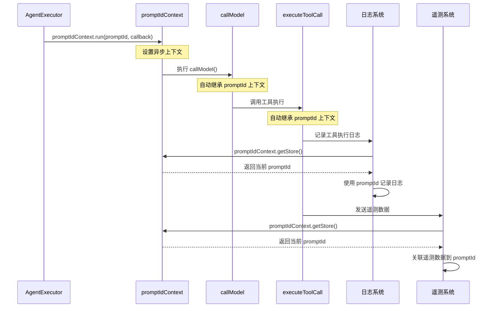

# AsyncLocalStorage 在 Gemini CLI 中的应用详解

## 概述

`export const promptIdContext = new AsyncLocalStorage<string>();`
这行代码创建了一个 **异步本地存储**
实例，这是 Node.js 中一个非常重要的异步上下文管理机制。

## AsyncLocalStorage 核心原理

### 1. 什么是 AsyncLocalStorage

`AsyncLocalStorage`
是 Node.js 提供的一个 API，用于在异步调用链中维护上下文状态，类似于线程本地存储（Thread
Local Storage）但适用于异步环境。

```typescript
// 基本概念
const context = new AsyncLocalStorage<T>();

// 设置上下文并执行
context.run(value, () => {
  // 在这个回调及其所有异步子调用中
  // context.getStore() 都会返回 value
});
```

### 2. 异步上下文传播机制

```typescript
// 示例：上下文如何在异步调用链中传播
const userContext = new AsyncLocalStorage<{ userId: string }>();

async function handleRequest(userId: string) {
  await userContext.run({ userId }, async () => {
    await processRequest(); // 自动继承上下文
  });
}

async function processRequest() {
  await validateUser(); // 自动继承上下文
  await saveData(); // 自动继承上下文
}

async function validateUser() {
  const { userId } = userContext.getStore()!; // 获取上下文
  console.log(`Validating user: ${userId}`);
}

async function saveData() {
  const { userId } = userContext.getStore()!; // 获取上下文
  console.log(`Saving data for user: ${userId}`);
}
```

## 在 Gemini CLI Agent 系统中的应用

### 1. 代码位置和定义

```typescript
// packages/core/src/utils/promptIdContext.ts
export const promptIdContext = new AsyncLocalStorage<string>();
```

### 2. 在 AgentExecutor 中的使用

```typescript
// packages/core/src/agents/executor.ts:194
private async executeTurn(
  chat: GeminiChat,
  currentMessage: Content,
  tools: FunctionDeclaration[],
  turnCounter: number,
  combinedSignal: AbortSignal,
  timeoutSignal: AbortSignal,
): Promise<AgentTurnResult> {
  // 生成当前轮次的唯一 prompt ID
  const promptId = `${this.agentId}#${turnCounter}`;

  // 在 promptIdContext 中运行整个处理流程
  const { functionCalls } = await promptIdContext.run(promptId, async () =>
    this.callModel(chat, currentMessage, tools, combinedSignal, promptId),
  );

  // 后续所有异步调用都能自动获取到这个 promptId
  const { nextMessage, submittedOutput, taskCompleted } =
    await this.processFunctionCalls(functionCalls, combinedSignal, promptId);
}
```

### 3. 上下文传播流程图



## 解决的核心问题

### 1. 传统参数传递的痛点

**问题场景**：

- Agent 执行过程中有多层深度嵌套的异步调用
- 需要在整个调用链中追踪当前的 prompt ID
- 传统方式需要在每个函数参数中传递 ID

**传统方式的代码**：

```typescript
// 繁琐的参数传递
async function executeAgent(promptId: string) {
  await callModel(promptId, chat, message, tools);
}

async function callModel(
  promptId: string,
  chat: GeminiChat,
  message: Content,
  tools: FunctionDeclaration[],
) {
  // 需要继续传递 promptId
  await executeToolCall(promptId, toolName, args);
}

async function executeToolCall(promptId: string, toolName: string, args: any) {
  // 需要继续传递 promptId
  await logToolExecution(promptId, toolName, result);
}

async function logToolExecution(
  promptId: string,
  toolName: string,
  result: any,
) {
  logger.log(`[${promptId}] Tool ${toolName} executed with result: ${result}`);
}
```

### 2. AsyncLocalStorage 的优雅解决方案

```typescript
// 简洁的上下文管理
async function executeAgent() {
  const promptId = generatePromptId();

  await promptIdContext.run(promptId, async () => {
    await callModel(chat, message, tools); // 不需要传递 promptId
  });
}

async function callModel(
  chat: GeminiChat,
  message: Content,
  tools: FunctionDeclaration[],
) {
  // 不需要接收和传递 promptId
  await executeToolCall(toolName, args);
}

async function executeToolCall(toolName: string, args: any) {
  // 不需要接收和传递 promptId
  await logToolExecution(toolName, result);
}

async function logToolExecution(toolName: string, result: any) {
  // 自动获取当前上下文的 promptId
  const promptId = promptIdContext.getStore();
  logger.log(`[${promptId}] Tool ${toolName} executed with result: ${result}`);
}
```

## 具体应用场景

### 1. 遥测数据关联

```typescript
// packages/core/src/telemetry/loggers.ts (假设)
export function logAgentStart(config: Config, event: AgentStartEvent) {
  const promptId = promptIdContext.getStore();

  // 所有遥测数据都自动关联到当前的 promptId
  telemetryService.recordEvent({
    type: 'agent_start',
    promptId,
    agentId: event.agentId,
    agentName: event.agentName,
    timestamp: Date.now(),
  });
}

export function logToolCall(toolName: string, args: any, result: any) {
  const promptId = promptIdContext.getStore();

  telemetryService.recordEvent({
    type: 'tool_call',
    promptId,
    toolName,
    args,
    result,
    timestamp: Date.now(),
  });
}
```

### 2. 错误追踪和调试

```typescript
// 错误处理中自动获取上下文
function handleAgentError(error: Error) {
  const promptId = promptIdContext.getStore();

  errorReporter.report({
    error,
    promptId,
    context: 'agent_execution',
    timestamp: Date.now(),
    stackTrace: error.stack,
  });

  debugLogger.error(`[${promptId}] Agent execution failed: ${error.message}`);
}
```

### 3. 性能监控

```typescript
// 性能监控自动关联到 prompt
class PerformanceMonitor {
  startTimer(operation: string) {
    const promptId = promptIdContext.getStore();
    const startTime = Date.now();

    return {
      end: () => {
        const duration = Date.now() - startTime;
        this.recordMetric({
          promptId,
          operation,
          duration,
          timestamp: startTime,
        });
      },
    };
  }
}
```

## 技术实现细节

### 1. 类型安全

```typescript
// 类型安全的上下文管理
export const promptIdContext = new AsyncLocalStorage<string>();

// 安全的获取方法
export function getCurrentPromptId(): string | undefined {
  return promptIdContext.getStore();
}

// 要求必须有上下文的方法
export function requirePromptId(): string {
  const promptId = promptIdContext.getStore();
  if (!promptId) {
    throw new Error('No prompt ID in current context');
  }
  return promptId;
}
```

### 2. 嵌套上下文处理

```typescript
// 支持嵌套的上下文
async function executeSubAgent(parentPromptId: string) {
  const subPromptId = `${parentPromptId}-sub-${Date.now()}`;

  // 子上下文不会影响父上下文
  await promptIdContext.run(subPromptId, async () => {
    await runSubAgentLogic();
  });

  // 这里又回到了父上下文
  const currentId = promptIdContext.getStore(); // 仍然是 parentPromptId
}
```

### 3. 内存管理

```typescript
// AsyncLocalStorage 自动管理内存
// 当异步操作完成时，上下文会自动清理
await promptIdContext.run(promptId, async () => {
  // 在这个作用域内，promptId 被存储
  await someAsyncOperation();
});
// 离开作用域后，promptId 自动清理，防止内存泄漏
```

## 优势总结

### 1. 代码简洁性

- 消除了繁琐的参数传递
- 函数签名更加简洁
- 降低了代码耦合度

### 2. 维护性

- 添加新的需要 promptId 的功能时，不需要修改调用链
- 重构时不需要担心 promptId 传递问题
- 更容易进行单元测试

### 3. 性能优化

- 避免了大量的参数传递开销
- 内存使用更加高效
- 自动的生命周期管理

### 4. 可观测性

- 统一的上下文标识
- 更好的日志关联
- 完整的调用链追踪

## 最佳实践

### 1. 上下文边界清晰

```typescript
// 好的做法：在明确的边界设置上下文
async function handleAgentRequest(request: AgentRequest) {
  const promptId = generatePromptId();

  await promptIdContext.run(promptId, async () => {
    // 整个请求处理过程都在这个上下文中
    await processAgentRequest(request);
  });
}
```

### 2. 防御性编程

```typescript
// 安全地获取上下文
function logWithContext(message: string) {
  const promptId = promptIdContext.getStore();

  if (promptId) {
    logger.log(`[${promptId}] ${message}`);
  } else {
    logger.log(`[NO_CONTEXT] ${message}`);
  }
}
```

### 3. 测试友好

```typescript
// 在测试中模拟上下文
describe('Agent execution', () => {
  it('should log with prompt ID', async () => {
    const testPromptId = 'test-prompt-123';

    await promptIdContext.run(testPromptId, async () => {
      // 测试代码
      await executeAgentLogic();

      // 验证日志包含正确的 promptId
      expect(mockLogger.calls).toContainEqual(
        expect.stringContaining(`[${testPromptId}]`),
      );
    });
  });
});
```

AsyncLocalStorage 是现代 Node.js 应用中处理异步上下文的标准方案，在 Gemini
CLI 的 Agent 系统中发挥了关键作用，使得整个系统的可观测性和维护性得到了显著提升。
