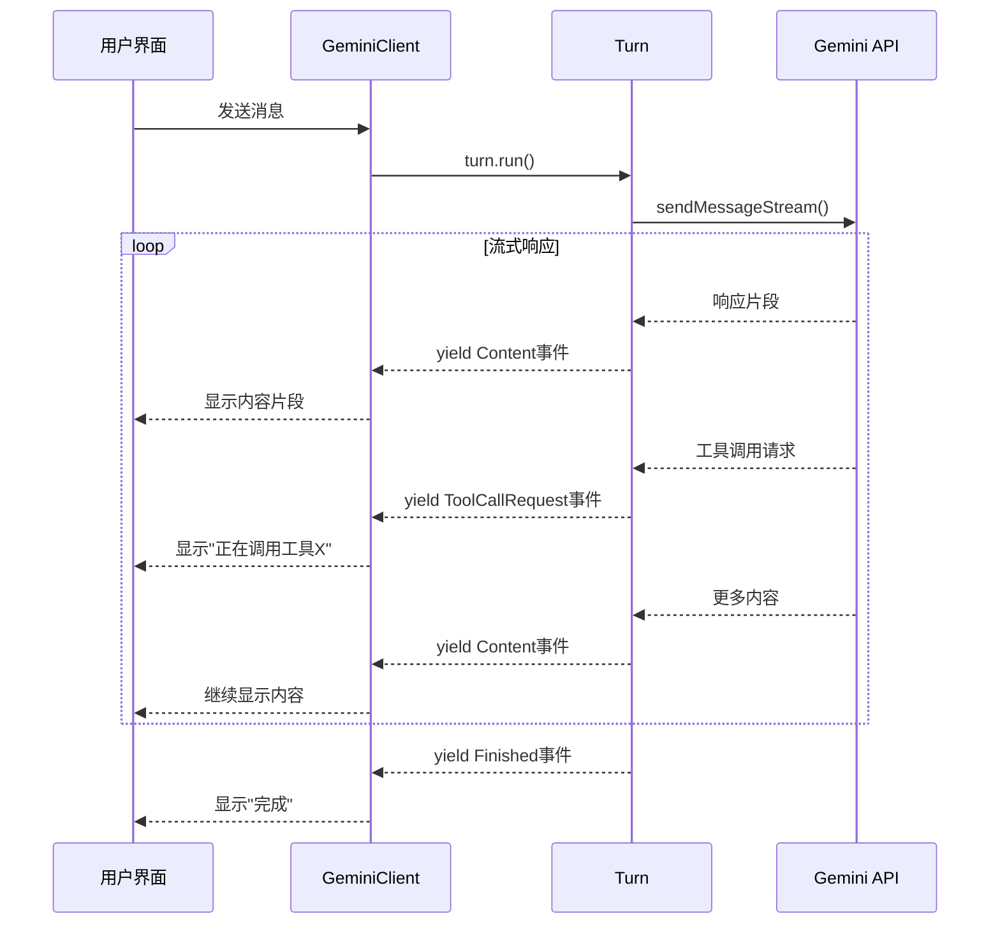

# yield 关键字详解

## 概述

`yield` 是 JavaScript/TypeScript 中**生成器函数 (Generator Functions)**
的核心关键字，用于暂停函数执行并向调用者返回一个值，同时保持函数的执行状态，可以在稍后恢复执行。

---

## 1. 基本概念

### 1.1 生成器函数语法

```typescript
// 普通函数
function normalFunction() {
  return '一次性返回所有结果';
}

// 生成器函数 (注意 function* 语法)
function* generatorFunction() {
  yield '第一个值';
  yield '第二个值';
  yield '第三个值';
  return '最终值';
}
```

### 1.2 异步生成器函数

```typescript
// 异步生成器函数 (Turn.run() 使用的就是这种)
async function* asyncGeneratorFunction() {
  yield '立即返回的值';

  await someAsyncOperation();
  yield '异步操作后的值';

  yield '最后一个值';
}
```

---

## 2. yield 的工作原理

### 2.1 执行流程对比

**普通函数：**

```typescript
function normalFunction() {
  console.log('开始执行');
  const result1 = processStep1();
  const result2 = processStep2();
  const result3 = processStep3();
  console.log('执行完成');
  return [result1, result2, result3]; // 一次性返回所有结果
}

// 调用
const results = normalFunction(); // 函数完全执行完才返回
```

**生成器函数：**

```typescript
function* generatorFunction() {
  console.log('开始执行');

  const result1 = processStep1();
  yield result1; // 暂停并返回 result1，保持状态

  console.log('恢复执行步骤2');
  const result2 = processStep2();
  yield result2; // 再次暂停并返回 result2

  console.log('恢复执行步骤3');
  const result3 = processStep3();
  yield result3; // 再次暂停并返回 result3

  console.log('执行完成');
}

// 调用
const generator = generatorFunction(); // 创建生成器，函数还未开始执行
const first = generator.next(); // 执行到第一个 yield，返回 {value: result1, done: false}
const second = generator.next(); // 从第一个 yield 后继续执行到第二个 yield
const third = generator.next(); // 从第二个 yield 后继续执行到第三个 yield
const done = generator.next(); // 函数执行完成，返回 {value: undefined, done: true}
```

### 2.2 状态保持

```typescript
function* counter() {
  let count = 0;
  while (true) {
    const increment = yield count; // yield 可以接收外部传入的值
    count += increment || 1;
  }
}

const gen = counter();
console.log(gen.next().value); // 0
console.log(gen.next(5).value); // 5 (传入 5 作为 increment)
console.log(gen.next(2).value); // 7 (5 + 2)
console.log(gen.next().value); // 8 (7 + 1，默认增加1)
```

---

## 3. Turn 类中的 yield 使用分析

### 3.1 Turn.run() 方法签名

```typescript
async *run(
  model: string,
  req: PartListUnion,
  signal: AbortSignal,
): AsyncGenerator<ServerGeminiStreamEvent>
```

**关键点：**

- `async *`: 异步生成器函数
- `yield`: 逐个产生 `ServerGeminiStreamEvent` 事件
- `AsyncGenerator<ServerGeminiStreamEvent>`: 返回异步生成器

### 3.2 实际使用场景

#### 场景1：内容事件

```typescript
const text = getResponseText(resp);
if (text) {
  yield { type: GeminiEventType.Content, value: text, traceId };
  //     ↑
  //     暂停函数，向调用者返回内容事件
  //     调用者可以立即处理这个事件（如更新UI）
  //     然后函数继续执行处理下一个事件
}
```

#### 场景2：工具调用事件

```typescript
const functionCalls = resp.functionCalls ?? [];
for (const fnCall of functionCalls) {
  const event = this.handlePendingFunctionCall(fnCall);
  if (event) {
    yield event; // 逐个返回工具调用事件
    //     ↑
    //     每个工具调用都会暂停函数
    //     让调用者处理这个工具调用请求
  }
}
```

#### 场景3：错误处理

```typescript
try {
  // 主要逻辑...
} catch (e) {
  // ... 错误处理逻辑

  yield {
    type: GeminiEventType.Error,
    value: { error: structuredError }
  };
  //   ↑
  //   出错时立即通知调用者
  //   调用者可以立即显示错误信息给用户
  return; // 结束生成器
}
```

### 3.3 调用者如何使用

在 GeminiClient 中：

```typescript
// GeminiClient.sendMessageStream() 中
const resultStream = turn.run(modelToUse, request, linkedSignal);

for await (const event of resultStream) {
  //              ↑
  //              每次 yield 产生的事件都会在这里被处理

  if (this.loopDetector.addAndCheck(event)) {
    yield { type: GeminiEventType.LoopDetected };
    controller.abort();
    return turn;
  }

  yield event; // GeminiClient 也是生成器，继续向上传递事件
  //     ↑
  //     将 Turn 的事件传递给更上层（UI层）

  this.updateTelemetryTokenCount();

  // 根据事件类型做不同处理...
}
```

---

## 4. yield 的优势分析

### 4.1 与传统回调对比

**传统回调方式：**

```typescript
class Turn {
  run(
    model: string,
    req: PartListUnion,
    callbacks: {
      onContent: (text: string) => void;
      onToolCall: (call: ToolCallRequestInfo) => void;
      onError: (error: Error) => void;
      onFinished: () => void;
    },
  ) {
    // 复杂的回调管理...
    callbacks.onContent('某些内容');
    callbacks.onToolCall(toolCallInfo);
    // ...
  }
}
```

**yield 生成器方式：**

```typescript
class Turn {
  async *run(model: string, req: PartListUnion) {
    yield { type: 'Content', value: '某些内容' };
    yield { type: 'ToolCallRequest', value: toolCallInfo };
    // 更简洁，类型安全
  }
}
```

### 4.2 内存效率

**普通函数 - 一次性返回所有数据：**

```typescript
async function getAllEvents(): Promise<ServerGeminiStreamEvent[]> {
  const events: ServerGeminiStreamEvent[] = [];

  // 处理大量数据...
  for (let i = 0; i < 1000000; i++) {
    events.push(processLargeData(i));
  }

  return events; // 内存中同时保存100万个事件！
}
```

**生成器函数 - 按需生成：**

```typescript
async function* getEventsStream() {
  // 处理大量数据...
  for (let i = 0; i < 1000000; i++) {
    yield processLargeData(i); // 一次只在内存中保存一个事件
  }
}
```

### 4.3 实时响应

**用户体验对比：**

**没有 yield（批量处理）：**

```
用户发送消息 → [等待3秒] → 突然显示完整回复
```

**使用 yield（流式处理）：**

```
用户发送消息 → 立即显示"思考中" → 逐字显示回复内容 → 显示工具调用 → 显示最终结果
```

---

## 5. yield 在流式 AI 应用中的价值

### 5.1 为什么 AI 应用需要流式处理？

1. **响应时间长**：AI 模型生成回复可能需要几秒到几分钟
2. **用户体验**：用户希望看到实时进展，而不是长时间等待
3. **内容生成**：AI 通常是逐步生成内容，而不是一次性输出
4. **工具调用**：AI 可能需要调用多个工具，每个都有等待时间

### 5.2 Turn 类的流式事件流



### 5.3 具体的用户体验

```typescript
// 用户在界面上看到的实时更新：

// 1. 立即显示
yield { type: GeminiEventType.Content, value: "我来帮你分析这个代码。" };

// 2. 显示思考过程
yield { type: GeminiEventType.Thought, value: { summary: "正在分析代码结构..." } };

// 3. 显示工具调用
yield { type: GeminiEventType.ToolCallRequest, value: { name: "read_file", args: {...} } };

// 4. 继续显示内容
yield { type: GeminiEventType.Content, value: "我发现这个文件有以下特点：\n1. ..." };

// 5. 显示引用
yield { type: GeminiEventType.Citation, value: "参考文档：..." };

// 6. 完成
yield { type: GeminiEventType.Finished, value: { reason: "STOP" } };
```

---

## 6. yield vs Promise vs Observable

### 6.1 三种异步模式对比

**Promise（一次性异步）：**

```typescript
async function fetchData(): Promise<string> {
  const result = await apiCall();
  return result; // 只能返回一个值
}
```

**Observable（响应式流）：**

```typescript
function fetchDataStream(): Observable<string> {
  return new Observable((subscriber) => {
    // 复杂的订阅管理
    subscriber.next('数据1');
    subscriber.next('数据2');
    subscriber.complete();
  });
}
```

**AsyncGenerator（异步生成器）：**

```typescript
async function* fetchDataGenerator() {
  yield '数据1'; // 简洁直观
  yield '数据2';
  return '完成';
}
```

### 6.2 Turn 类为什么选择 AsyncGenerator？

1. **简洁性**：`yield` 语法比 Observable 的订阅模式更直观
2. **类型安全**：TypeScript 原生支持，类型推导完整
3. **错误处理**：可以使用标准的 try/catch 语法
4. **调试友好**：可以设置断点，逐步调试
5. **标准化**：是 ECMAScript 标准，不依赖第三方库

---

## 7. 总结

### 7.1 yield 的核心价值

1. **暂停与恢复**：允许函数在执行过程中暂停，返回中间结果
2. **状态保持**：暂停时保持所有局部变量和执行状态
3. **按需处理**：调用者可以控制何时请求下一个值
4. **内存效率**：避免一次性加载大量数据到内存

### 7.2 在 Turn 类中的作用

- **实时事件流**：将 AI 响应过程分解为多个实时事件
- **用户体验**：让用户能看到 AI 的"思考"和执行过程
- **资源控制**：支持随时取消和暂停处理
- **错误隔离**：每个 yield 点都是潜在的错误恢复点

### 7.3 适用场景

- ✅ **流式数据处理**（如 AI 响应）
- ✅ **实时更新UI**（如进度条、聊天消息）
- ✅ **大数据分页**（逐块处理大文件）
- ✅ **用户交互流程**（向导、多步骤表单）

`yield`
让 Turn 类能够优雅地处理 AI 对话中的复杂异步流程，为用户提供流畅的实时体验。
