# Gemini CLI main() 函数详细流程分析

> **分析时间**: 2025-11-15 **文件**: `packages/cli/src/gemini.tsx` - main() 函数
> **代码行数**: 252-525行

## 🎯 流程概览

Gemini
CLI 的 main() 函数是整个应用程序的核心入口点，包含了复杂的初始化、配置加载、沙箱检查和模式分支逻辑。

## 📊 完整执行流程图

```mermaid
flowchart TD
    A["开始 main() 函数"] --> B["setupUnhandledRejectionHandler<br>设置全局异常处理"]
    B --> C["DEBUG: 函数已启动"]
    C --> D["loadSettings<br>加载用户设置"]
    D --> E["DEBUG: 用户设置"]
    E --> F["migrateDeprecatedSettings<br>迁移旧版设置"]
    F --> G["cleanupCheckpoints<br>清理检查点文件"]
    G --> H["parseArguments<br>解析命令行参数"]
    H --> I["DEBUG: argv 对象"]
    I --> J{"检查参数兼容性<br>promptInteractive && !stdin.isTTY?"}
    J -->|"是"| K["输出错误信息并退出<br>process.exit(1)"]
    J -->|"否"| L["isDebugMode<br>判断调试模式"]
    L --> M["ConsolePatcher<br>配置控制台输出"]
    M --> N["registerCleanup<br>注册清理函数"]
    N --> O["DEBUG: 测试一下"]
    O --> P["dns.setDefaultResultOrder<br>设置DNS解析顺序"]
    P --> Q["DEBUG: settings 完整信息"]
    Q --> R{"检查认证配置<br>!selectedType?"}
    R -->|"是"| S{"CLOUD_SHELL 环境?"}
    S -->|"是"| T["设置 CLOUD_SHELL 认证"]
    S -->|"否"| U["跳过认证设置"]
    T --> U
    R -->|"否"| U
    U --> V["themeManager.loadCustomThemes<br>加载自定义主题"]
    V --> W{"主题设置存在?"}
    W -->|"是"| X["setActiveTheme<br>设置激活主题"]
    W -->|"否"| Y["跳过主题设置"]
    X --> Z{"主题设置成功?"}
    Z -->|"否"| AA["输出主题警告"]
    Z -->|"是"| Y
    AA --> Y
    Y --> BB["DEBUG: SANDBOX 检查结果"]
    BB --> CC{"检查沙箱环境<br>!process.env['SANDBOX']?"}

    CC -->|"否 在沙箱内"| UU["DEBUG: 还继续吗<br>直接执行主应用逻辑"]
    CC -->|"是 在沙箱外"| EE["计算内存参数<br>getNodeMemoryArgs"]
    EE --> FF["loadSandboxConfig<br>加载沙箱配置"]
    FF --> GG["DEBUG: sandboxConfig"]
    GG --> HH{"沙箱配置存在?"}

    HH -->|"否"| II["relaunchAppInChildProcess<br>重启子进程"]
    II --> JJ["当前进程结束<br>新子进程重新开始"]


    HH -->|"是"| KK["loadCliConfig<br>加载部分配置"]
    KK --> LL{"认证验证需要?"}
    LL -->|"是"| MM["validateAuthMethod<br>验证认证方法"]
    MM --> NN["partialConfig.refreshAuth<br>刷新认证"]
    NN --> OO{"认证成功?"}
    OO -->|"否"| PP["输出认证错误<br>process.exit(1)"]
    OO -->|"是"| QQ["检查标准输入"]
    LL -->|"否"| QQ
    QQ --> RR["injectStdinIntoArgs<br>注入标准输入到参数"]
    RR --> SS["relaunchOnExitCode<br>启动沙箱"]
    SS --> TT["沙箱启动成功<br>当前进程退出"]
    UU --> VV["loadCliConfig<br>加载完整配置"]
    VV --> WW["DEBUG: config 对象"]
    WW --> XX["getPolicyEngine<br>获取策略引擎"]
    XX --> YY["createPolicyUpdater<br>创建策略更新器"]
    YY --> ZZ["cleanupExpiredSessions<br>清理过期会话"]
    ZZ --> AAA{"扩展列表模式?<br>getListExtensions()"}
    AAA -->|"是"| BBB["输出扩展列表<br>process.exit(0)"]
    AAA -->|"否"| CCC{"交互模式且TTY?"}
    CCC -->|"是"| DDD["setRawMode(true)<br>设置原始模式"]
    DDD --> EEE["注册信号处理器<br>SIGTERM/SIGINT"]
    EEE --> FFF["detectAndEnableKittyProtocol<br>启用Kitty键盘协议"]
    FFF --> GGG["setMaxSizedBoxDebugging<br>设置调试"]
    CCC -->|"否"| GGG
    GGG --> HHH["initializeApp<br>初始化应用"]
    HHH --> III{"Google OAuth 且浏览器抑制?"}
    III -->|"是"| JJJ["getOauthClient<br>预处理OAuth"]
    III -->|"否"| KKK{"Zed集成实验功能?"}
    JJJ --> KKK
    KKK -->|"是"| LLL["runZedIntegration<br>运行Zed集成并返回"]
    KKK -->|"否"| MMM["config.getQuestion<br>获取问题输入"]
    MMM --> NNN["getStartupWarnings<br>获取启动警告"]
    NNN --> OOO{"交互模式?<br>config.isInteractive()"}

    OOO -->|"是"| PPP["startInteractiveUI<br>启动React UI界面"]
    PPP --> QQQ["return 结束"]

    OOO -->|"否"| RRR["config.initialize<br>初始化配置"]
    RRR --> SSS{"非TTY模式?<br>!process.stdin.isTTY"}
    SSS -->|"是"| TTT["readStdin<br>读取标准输入"]
    TTT --> UUU["合并输入数据"]
    UUU --> VVV{"输入存在?"}
    SSS -->|"否"| VVV
    VVV -->|"否"| WWW["输出错误信息<br>process.exit(1)"]
    VVV -->|"是"| XXX["生成随机 prompt_id"]
    XXX --> YYY["logUserPrompt<br>记录用户输入"]
    YYY --> ZZZ["validateNonInteractiveAuth<br>验证非交互认证"]
    ZZZ --> AAAA["runNonInteractive<br>运行非交互模式"]
    AAAA --> BBBB["runExitCleanup<br>执行退出清理"]
    BBBB --> CCCC["process.exit(0)"]

    %% 样式定义
    classDef startNode fill:#e1f5fe,stroke:#0277bd,stroke-width:2px
    classDef decisionNode fill:#fff3e0,stroke:#f57c00,stroke-width:2px
    classDef processNode fill:#e8f5e8,stroke:#388e3c,stroke-width:2px
    classDef exitNode fill:#ffebee,stroke:#d32f2f,stroke-width:2px
    classDef debugNode fill:#f3e5f5,stroke:#7b1fa2,stroke-width:2px
    classDef relaunchNode fill:#fff9c4,stroke:#f57f17,stroke-width:2px

    %% 应用样式
    class A startNode
    class CC,HH,OOO decisionNode
    class PPP,AAAA processNode
    class K,PP,WWW,BBB,CCCC exitNode
    class C,E,I,O,Q,BB,GG,UU,WW debugNode
    class JJ,TT relaunchNode
```



## 🔍 关键执行阶段详细分析

> **⚠️ 重要修正说明**:
>
> 沙箱检查是整个流程的**关键分岔点**：
>
> - **在沙箱外** (`!process.env['SANDBOX']` =
>   true)：无论有无沙箱配置，都会重启进程并退出当前进程
> - **在沙箱内** (`!process.env['SANDBOX']` =
>   false)：直接跳过沙箱逻辑，执行主应用逻辑
>
> **只有在沙箱内运行时，才会执行403行开始的主应用逻辑！**

### 第一阶段：初始化和配置加载 (252-270行)

```typescript
// 1. 设置全局异常处理
setupUnhandledRejectionHandler();

// 2. 加载用户设置
const settings = loadSettings();
🚀 输出: 用户设置信息

// 3. 迁移旧版设置
migrateDeprecatedSettings(settings, new ExtensionManager({...}));

// 4. 清理检查点文件
await cleanupCheckpoints();

// 5. 解析命令行参数
const argv = await parseArguments(settings.merged);
🚀 输出: argv 完整JSON结构
```

**关键特点**:

- ✅ 错误处理优先设置
- ✅ 配置向后兼容性处理
- ✅ 调试信息完整记录

### 第二阶段：环境验证和配置 (271-316行)

```typescript
// 1. 参数兼容性检查
if (argv.promptInteractive && !process.stdin.isTTY) {
  process.exit(1); // 🚨 退出点1
}

// 2. 调试模式和控制台配置
const isDebugMode = cliConfig.isDebugMode(argv);
const consolePatcher = new ConsolePatcher({...});

// 3. 网络和认证配置
dns.setDefaultResultOrder(...);
🚀 输出: settings 完整JSON结构

// 4. 自动认证设置
if (process.env['CLOUD_SHELL'] === 'true') {
  settings.setValue(SettingScope.User, 'selectedAuthType', AuthType.CLOUD_SHELL);
}

// 5. 主题管理
themeManager.loadCustomThemes(settings.merged.ui?.customThemes);
```

**关键决策点**:

- **参数验证**: 防止无效参数组合
- **自动配置**: Cloud Shell环境自动设置认证
- **主题系统**: 支持自定义主题

### 第三阶段：沙箱检查和分支 (318-395行) ⭐ **关键阶段**

```typescript
🚀 输出: SANDBOX 检查结果

if (!process.env['SANDBOX']) {
  // ⚠️ 在沙箱外运行 - 需要重启进程
  const memoryArgs = getNodeMemoryArgs(isDebugMode);
  const sandboxConfig = await loadSandboxConfig(settings.merged, argv);

  🚀 输出: sandboxConfig 完整信息

  if (sandboxConfig) {
    // 🔄 启动沙箱分支
    const partialConfig = await loadCliConfig(...);

    // 认证验证（沙箱会干扰OAuth重定向）
    if (需要认证) {
      await partialConfig.refreshAuth(...);
    }

    // 处理标准输入并启动沙箱
    const sandboxArgs = injectStdinIntoArgs(process.argv, stdinData);
    await start_sandbox(...);
    process.exit(0); // 🚨 当前进程退出，沙箱内重新开始

  } else {
    // 🔄 重启子进程分支
    await relaunchAppInChildProcess(memoryArgs, []);
    // 🚨 当前进程结束，新子进程重新从main()开始
  }
}
// ⚠️ 只有 process.env['SANDBOX'] 存在时，才会执行到下面的代码
```

**沙箱逻辑核心要点**:

- **第一次启动**: `!process.env['SANDBOX']` = true，需要检查是否启动沙箱
- **沙箱环境下**: `process.env['SANDBOX']` 存在，直接执行主应用逻辑
- **两个重启场景**:
  1. 有沙箱配置 → 在沙箱内重启
  2. 无沙箱配置 → 在当前环境重启子进程
- **关键点**: 沙箱外的所有分支都会导致当前进程结束！

### 第四阶段：主应用逻辑 (401-468行)

```typescript
🚀 输出: 还继续吗

// 1. 加载完整配置
const config = await loadCliConfig(settings.merged, sessionId, argv);
🚀 输出: config 对象 (可能有循环引用)

// 2. 策略和消息总线
const policyEngine = config.getPolicyEngine();
const messageBus = config.getMessageBus();
createPolicyUpdater(policyEngine, messageBus);

// 3. 会话管理
await cleanupExpiredSessions(config, settings.merged);

// 4. 扩展列表模式检查
if (config.getListExtensions()) {
  // 输出所有已安装扩展
  process.exit(0); // 🚨 退出点3
}

// 5. 终端原始模式设置
if (config.isInteractive() && !wasRaw && process.stdin.isTTY) {
  process.stdin.setRawMode(true);
  // 信号处理器设置
  await detectAndEnableKittyProtocol();
}

// 6. 应用初始化
const initializationResult = await initializeApp(config, settings);

// 7. OAuth预处理
if (需要Google认证 && 浏览器被抑制) {
  await getOauthClient(...);
}

// 8. Zed集成检查
if (config.getExperimentalZedIntegration()) {
  return runZedIntegration(...); // 🔄 Zed分支
}
```

**初始化特点**:

- **完整配置加载**: 包含扩展、策略、消息总线等
- **终端优化**: 原始模式、键盘协议支持
- **OAuth优化**: 浏览器抑制时预处理认证
- **实验功能**: Zed编辑器集成支持

### 第五阶段：运行模式分支 (460-523行)

```typescript
let input = config.getQuestion();
const startupWarnings = await getStartupWarnings();

// 🔀 核心分支点：交互 vs 非交互模式
if (config.isInteractive()) {
  // 🎨 交互模式：启动React UI
  await startInteractiveUI(
    config, settings, startupWarnings,
    process.cwd(), initializationResult
  );
  return; // ✅ 交互模式结束

} else {
  // 📝 非交互模式：命令行处理
  await config.initialize();

  // 处理管道输入
  if (!process.stdin.isTTY) {
    const stdinData = await readStdin();
    if (stdinData) {
      input = `${stdinData}\n\n${input}`;
    }
  }

  // 输入验证
  if (!input) {
    process.exit(1); // 🚨 退出点4
  }

  // 执行非交互处理
  const prompt_id = Math.random().toString(16).slice(2);
  logUserPrompt(config, new UserPromptEvent(...));

  const nonInteractiveConfig = await validateNonInteractiveAuth(...);

  await runNonInteractive({
    config: nonInteractiveConfig,
    settings, input, prompt_id,
    hasDeprecatedPromptArg
  });

  await runExitCleanup();
  process.exit(0); // 🚨 退出点5
}
```

## 🎯 关键决策点和分支分析

### 1. **沙箱检查分支** (最重要)

```
沙箱环境检查
├── 在沙箱内 → 继续主应用逻辑
└── 在沙箱外
    ├── 有沙箱配置 → 启动沙箱并退出
    └── 无沙箱配置 → 重启子进程
```

### 2. **运行模式分支** (用户体验)

```
运行模式判断
├── 交互模式 → React UI (startInteractiveUI)
└── 非交互模式 → 命令行处理 (runNonInteractive)
```

### 3. **认证处理分支** (安全)

```
认证检查
├── 无认证配置 → 自动设置 (Cloud Shell)
├── 沙箱环境 → 预先验证认证
└── Google OAuth → 预处理 (浏览器抑制时)
```

## 🚨 程序退出点和重启点总结

| 类型         | 位置       | 触发条件                     | 结果             |
| ------------ | ---------- | ---------------------------- | ---------------- |
| **错误退出** | 参数验证   | promptInteractive + 管道输入 | exit(1)          |
| **错误退出** | 认证失败   | 沙箱环境认证错误             | exit(1)          |
| **错误退出** | 输入验证   | 非交互模式无输入             | exit(1)          |
| **正常退出** | 扩展列表   | --list-extensions 命令       | exit(0)          |
| **正常退出** | 非交互完成 | 非交互模式处理完成           | exit(0)          |
| **进程重启** | 沙箱启动   | 启动沙箱环境                 | 新进程在沙箱内   |
| **进程重启** | 子进程重启 | 无沙箱配置时重启             | 新子进程继续执行 |

### 🔄 重要的进程重启逻辑

```typescript
// 场景1: 启动沙箱
await start_sandbox(sandboxConfig, memoryArgs, partialConfig, sandboxArgs);
// → 当前进程退出，新进程在沙箱内从头开始，process.env['SANDBOX'] 会存在

// 场景2: 重启子进程
await relaunchAppInChildProcess(memoryArgs, []);
// → 当前进程结束，新子进程从头开始，但不在沙箱内
```

**核心设计理念**:

- 确保应用总是运行在正确的环境配置下（沙箱/非沙箱）
- 内存优化通过进程重启实现
- 沙箱提供安全隔离的执行环境

## 🔧 调试信息输出点

根据代码中的调试输出，关键信息点包括：

1. **🚀 Gemini CLI main() 函数已启动！** - 函数入口
2. **🚀 Gemini CLI main() 用户设置！** - settings对象 (可能有循环引用)
3. **🚀 Gemini CLI main() argv！** - 解析后的参数
4. **🚀 Gemini CLI main() settings** - 完整设置JSON
5. **🚀 Gemini CLI main() SANDBOX** - 沙箱检查结果
6. **🚀 Gemini CLI main() sandboxConfig** - 沙箱配置
7. **🚀 Gemini CLI main() 还继续吗** - 主逻辑开始
8. **config对象输出** - 完整配置 (有循环引用风险)

## 💡 性能和优化要点

### 1. **内存管理**

- 动态计算Node.js堆大小（系统内存50%）
- 需要时自动重启进程应用新内存设置

### 2. **延迟加载**

- 沙箱配置按需加载
- 完整配置在确定运行模式后加载

### 3. **异步优化**

- 启动警告并行获取
- OAuth预处理避免UI阻塞

### 4. **资源清理**

- 注册清理函数处理进程退出
- 会话文件定期清理

## 🏗️ 架构设计亮点

### 1. **渐进式启动**

```
轻量初始化 → 环境检查 → 配置加载 → 功能初始化 → 运行模式
```

### 2. **多重安全保障**

- 参数验证防止无效组合
- 沙箱隔离提供安全执行环境
- 认证预验证避免运行时失败

### 3. **灵活的运行模式**

- 交互模式：完整的React终端应用
- 非交互模式：传统CLI工具行为
- 特殊模式：Zed集成、扩展列表等

### 4. **完善的错误处理**

- 全局异常捕获
- 分阶段错误检查
- 用户友好的错误信息

## 🎪 总结

Gemini CLI 的 main() 函数展现了**企业级CLI应用的复杂架构设计**：

- ✅ **多层初始化**: 从轻量到完整的渐进式启动
- ✅ **安全沙箱**: 完整的隔离执行环境支持
- ✅ **双模式运行**: 交互和非交互无缝切换
- ✅ **智能配置**: 自动检测和优化系统参数
- ✅ **完善监控**: 详细的调试信息和性能监控
- ✅ **优雅处理**: 多重错误检查和资源清理

这不仅仅是一个启动函数，而是一个**完整的应用程序生命周期管理系统**，代表了现代CLI工具的最佳实践！ 🚀

---

_本分析基于实际代码执行流程，包含了所有调试输出点和分支逻辑。_
