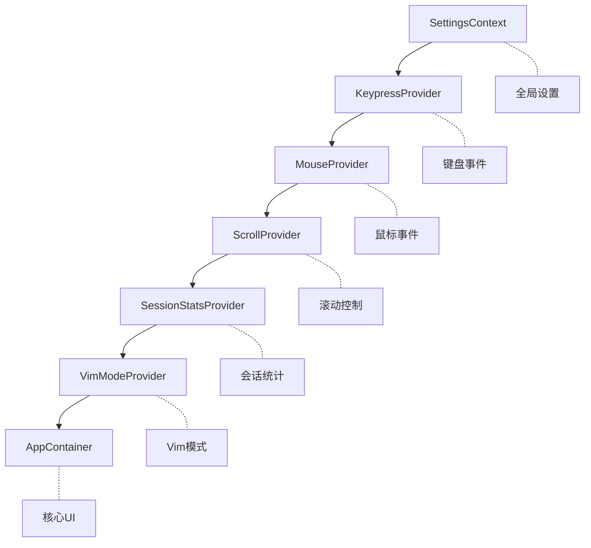
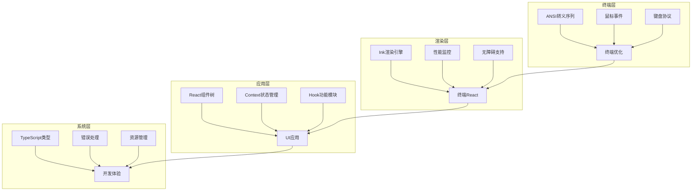

# Gemini CLI startInteractiveUI 函数详细分析

> **分析时间**: 2025-11-15 **文件**: `packages/cli/src/gemini.tsx` -
> startInteractiveUI 函数 (第148-250行)
> **作用**: 交互式UI模式核心入口，将React应用渲染到终端

## 🎯 函数概览

`startInteractiveUI` 是 Gemini CLI **交互式UI模式**的核心入口函数，负责：

- 配置终端优化参数
- 构建React组件架构
- 启动Ink渲染引擎
- 管理后台任务和资源清理

这个函数将传统的命令行工具转换为功能完整的**终端React应用**。

## 📋 函数签名和参数分析

```typescript
export async function startInteractiveUI(
  config: Config, // 应用配置对象
  settings: LoadedSettings, // 用户设置
  startupWarnings: string[], // 启动时的警告信息
  workspaceRoot: string = process.cwd(), // 工作目录，默认当前目录
  initializationResult: InitializationResult, // 初始化结果
);
```

### 参数详解

| 参数                   | 类型                 | 作用                                     | 默认值          |
| ---------------------- | -------------------- | ---------------------------------------- | --------------- |
| `config`               | Config               | 应用核心配置，包含认证、调试、功能开关等 | 必需            |
| `settings`             | LoadedSettings       | 用户个性化设置，UI主题、行为配置等       | 必需            |
| `startupWarnings`      | string[]             | 启动警告列表，向用户显示重要提示         | 必需            |
| `workspaceRoot`        | string               | 当前工作目录路径                         | `process.cwd()` |
| `initializationResult` | InitializationResult | 应用初始化状态和结果                     | 必需            |

**参数设计亮点**:

- ✅ **配置分离**: config 和 settings 分别管理系统级和用户级配置
- ✅ **用户体验**: startupWarnings 提供用户友好的启动提示
- ✅ **灵活性**: workspaceRoot 支持自定义工作目录
- ✅ **状态传递**: initializationResult 完整传递初始化状态

## 🖥️ 终端优化配置 (第165-180行)

### 1. 禁用终端自动换行

```typescript
// 非屏幕阅读器模式下禁用终端换行
if (!config.getScreenReader()) {
  process.stdout.write('\x1b[?7l'); // ANSI 转义序列：禁用自动换行
}
```

**ANSI 转义序列说明**:

- `\x1b[?7l` - 禁用自动换行 (DEC Private Mode Reset)
- `\x1b[?7h` - 启用自动换行 (在清理函数中恢复)

**设计理由**:

- **避免冲突**: 让 Ink 框架完全控制文本换行
- **渲染优化**: 减少终端调整大小时的渲染伪影
- **终端兼容**: 对 Ghostty、iTerm2 等现代终端效果更好
- **无障碍考虑**: 屏幕阅读器模式下保持终端原生换行行为

### 2. 鼠标事件配置

```typescript
const mouseEventsEnabled = settings.merged.ui?.useAlternateBuffer === true;
if (mouseEventsEnabled) {
  enableMouseEvents(); // 启用终端鼠标交互
}
```

**鼠标事件特点**:

- **条件启用**: 仅在启用备用缓冲区时开启鼠标事件
- **用户控制**: 通过 `settings.merged.ui?.useAlternateBuffer` 配置
- **性能考虑**: 避免不必要的鼠标事件处理开销

### 3. 清理函数注册

```typescript
registerCleanup(() => {
  process.stdout.write('\x1b[?7h'); // 重新启用终端换行
  if (mouseEventsEnabled) {
    disableMouseEvents(); // 禁用鼠标事件
  }
});
```

**清理机制设计**:

- **终端恢复**: 确保程序退出时恢复终端原始状态
- **资源清理**: 正确清理鼠标事件监听器
- **优雅退出**: 防止终端状态污染影响后续使用

## 🪟 窗口和版本管理 (第182-183行)

```typescript
const version = await getCliVersion();
setWindowTitle(basename(workspaceRoot), settings);
```

**功能解析**:

- **版本获取**: 异步获取当前 CLI 版本，用于UI显示
- **窗口标题**: 设置终端窗口标题为工作目录基名
- **用户体验**: 让用户清楚当前工作环境和版本信息

## ⚛️ React 组件架构 (第185-216行)

### 多层 Context Provider 嵌套架构

```typescript
const AppWrapper = () => {
  useKittyKeyboardProtocol();  // Kitty 终端键盘协议支持
  return (
    <SettingsContext.Provider value={settings}>           {/* Level 7 */}
      <KeypressProvider                                    {/* Level 6 */}
        config={config}
        debugKeystrokeLogging={settings.merged.general?.debugKeystrokeLogging}
      >
        <MouseProvider                                     {/* Level 5 */}
          mouseEventsEnabled={mouseEventsEnabled}
          debugKeystrokeLogging={settings.merged.general?.debugKeystrokeLogging}
        >
          <ScrollProvider>                                 {/* Level 4 */}
            <SessionStatsProvider>                         {/* Level 3 */}
              <VimModeProvider settings={settings}>       {/* Level 2 */}
                <AppContainer                              {/* Level 1 - 核心UI */}
                  config={config}
                  settings={settings}
                  startupWarnings={startupWarnings}
                  version={version}
                  initializationResult={initializationResult}
                />
              </VimModeProvider>
            </SessionStatsProvider>
          </ScrollProvider>
        </MouseProvider>
      </KeypressProvider>
    </SettingsContext.Provider>
  );
};
```

### Context Provider 层次结构分析

| 层级        | Provider               | 管理功能     | 依赖数据               | 作用范围     |
| ----------- | ---------------------- | ------------ | ---------------------- | ------------ |
| **Level 7** | `SettingsContext`      | 全局设置管理 | settings 对象          | 整个应用     |
| **Level 6** | `KeypressProvider`     | 键盘事件处理 | config, 调试设置       | 所有键盘交互 |
| **Level 5** | `MouseProvider`        | 鼠标事件管理 | 鼠标启用状态, 调试设置 | 所有鼠标交互 |
| **Level 4** | `ScrollProvider`       | 滚动功能控制 | 无直接依赖             | 滚动相关组件 |
| **Level 3** | `SessionStatsProvider` | 会话统计管理 | 无直接依赖             | 统计显示组件 |
| **Level 2** | `VimModeProvider`      | Vim 模式支持 | settings               | Vim 键位绑定 |
| **Level 1** | `AppContainer`         | 主UI组件容器 | 所有传入参数           | 核心应用界面 |

### 架构设计优势



**设计原则**:

- ✅ **单一职责**: 每个 Provider 专注管理特定功能
- ✅ **组合模式**: 通过组合实现复杂的应用功能
- ✅ **依赖注入**: 清晰的数据流向和依赖关系
- ✅ **可测试性**: 每个 Provider 可以独立测试和替换

### 特殊功能集成

#### Kitty 键盘协议支持

```typescript
useKittyKeyboardProtocol(); // Hook 调用，启用现代终端键盘协议
```

**功能特点**:

- **现代终端支持**: 支持 Kitty 终端的增强键盘协议
- **键位精确度**: 能识别更多键位组合和修饰键
- **用户体验**: 提供类似IDE的键盘交互体验

## 🎨 Ink 渲染引擎配置 (第218-236行)

### 渲染实例创建

```typescript
const instance = render(
  process.env['DEBUG'] ? (
    <React.StrictMode>      // 调试模式：启用React严格模式
      <AppWrapper />
    </React.StrictMode>
  ) : (
    <AppWrapper />          // 生产模式：直接渲染
  ),
  {
    exitOnCtrlC: false,                                   // 禁用默认Ctrl+C退出
    isScreenReaderEnabled: config.getScreenReader(),      // 屏幕阅读器支持
    onRender: ({ renderTime }: { renderTime: number }) => {
      if (renderTime > SLOW_RENDER_MS) {                  // 慢渲染监控(200ms)
        recordSlowRender(config, renderTime);
      }
    },
    alternateBuffer: settings.merged.ui?.useAlternateBuffer, // 终端备用缓冲区
  },
);
```

### 渲染配置详解

#### 1. 调试模式差异化

```typescript
// 开发环境 vs 生产环境
process.env['DEBUG'] ?
  <React.StrictMode><AppWrapper /></React.StrictMode> :
  <AppWrapper />
```

**React.StrictMode 效果**:

- **双重渲染**: 帮助发现副作用问题
- **废弃API检查**: 警告使用过时API
- **副作用检查**: 检测不纯的组件
- **性能开销**: 仅在开发模式使用

#### 2. 终端控制配置

```typescript
exitOnCtrlC: false,  // 禁用Ink默认的Ctrl+C退出行为
```

**设计理由**:

- **自定义控制**: 应用需要自己处理退出逻辑
- **用户确认**: 可能需要保存工作或确认退出
- **防止误操作**: 避免用户意外按下Ctrl+C导致数据丢失

#### 3. 无障碍功能支持

```typescript
isScreenReaderEnabled: config.getScreenReader(),
```

**无障碍特性**:

- **屏幕阅读器**: 为视力障碍用户提供语音输出
- **动态配置**: 根据用户配置启用/禁用
- **包容性设计**: 确保所有用户都能使用应用

#### 4. 性能监控系统

```typescript
onRender: ({ renderTime }) => {
  if (renderTime > SLOW_RENDER_MS) {
    // SLOW_RENDER_MS = 200ms
    recordSlowRender(config, renderTime);
  }
};
```

**性能监控机制**:

- **阈值检测**: 200ms 作为慢渲染判断标准
- **自动记录**: 慢渲染事件自动记录到日志
- **优化依据**: 为性能优化提供数据支持
- **用户体验**: 确保界面响应流畅

#### 5. 终端缓冲区模式

```typescript
alternateBuffer: settings.merged.ui?.useAlternateBuffer,
```

**备用缓冲区功能**:

- **独立屏幕**: 类似 vim/less 的全屏模式
- **状态隔离**: 不影响终端历史记录
- **兼容性**: 需要终端支持 ANSI 转义序列
- **用户选择**: 可通过设置启用/禁用

## 🔄 后台任务管理 (第238-248行)

### 自动更新检查

```typescript
checkForUpdates(settings)
  .then((info) => {
    handleAutoUpdate(info, settings, config.getProjectRoot());
  })
  .catch((err) => {
    // 静默忽略更新检查错误，不影响主功能
    if (config.getDebugMode()) {
      debugLogger.warn('Update check failed:', err);
    }
  });
```

### 后台任务设计模式

**异步非阻塞设计**:

- ✅ **不阻塞UI**: 更新检查与UI启动并行进行
- ✅ **错误容忍**: 网络错误不影响核心功能
- ✅ **调试友好**: 调试模式下记录详细错误信息
- ✅ **用户体验**: 后台自动处理，用户无感知

**错误处理策略**:

```typescript
.catch((err) => {
  // 1. 静默处理：不向用户显示错误
  // 2. 条件记录：仅在调试模式记录
  // 3. 功能隔离：不影响主要功能
})
```

## 🧹 资源清理管理 (第250行)

```typescript
registerCleanup(() => instance.unmount());
```

### 清理机制完整性

**多层级清理体系**:

1. **React组件清理**: `instance.unmount()` 卸载整个组件树
2. **终端状态恢复**: 恢复换行设置
3. **事件监听器清理**: 清理鼠标和键盘事件
4. **资源释放**: 防止内存泄漏

**清理时机**:

- 用户主动退出应用
- 程序异常终止
- 系统信号 (SIGTERM, SIGINT)
- 父进程终止

## 🏗️ 设计模式和架构亮点

### 1. 关注点分离 (Separation of Concerns)

```
┌─────────────────────────────────┐
│         startInteractiveUI      │
├─────────────────────────────────┤
│ 🖥️ 终端配置  │ ANSI转义序列      │
│ ⚛️ React架构 │ 组件树和Context   │
│ 🎨 渲染引擎  │ Ink配置和优化     │
│ 📊 性能监控  │ 渲染时间追踪      │
│ 🔄 后台任务  │ 更新检查和处理    │
│ 🧹 资源管理  │ 清理和内存释放    │
└─────────────────────────────────┘
```

### 2. 防御性编程 (Defensive Programming)

```typescript
// 条件检查防止错误
if (!config.getScreenReader()) { ... }
if (mouseEventsEnabled) { ... }

// 可选链防止null/undefined错误
settings.merged.ui?.useAlternateBuffer
settings.merged.general?.debugKeystrokeLogging

// 错误处理防止崩溃
.catch((err) => { /* 错误处理 */ })

// 环境检查
process.env['DEBUG'] ? /* 调试逻辑 */ : /* 生产逻辑 */
```

### 3. 配置驱动架构 (Configuration-Driven)

| 配置源                                           | 配置项     | 影响功能                |
| ------------------------------------------------ | ---------- | ----------------------- |
| `config.getScreenReader()`                       | 屏幕阅读器 | 终端换行、无障碍功能    |
| `settings.merged.ui?.useAlternateBuffer`         | 备用缓冲区 | 鼠标事件、全屏模式      |
| `settings.merged.general?.debugKeystrokeLogging` | 调试日志   | 键盘事件记录            |
| `process.env['DEBUG']`                           | 调试模式   | React严格模式、错误日志 |
| `config.getDebugMode()`                          | 应用调试   | 性能监控、详细日志      |

### 4. 组合模式 (Composition Pattern)

```typescript
// Provider组合：每个Provider专注单一功能
Settings → Keypress → Mouse → Scroll → Session → Vim → AppContainer

// Hook组合：功能模块化
useKittyKeyboardProtocol()  // 键盘协议
useMouse()                  // 鼠标处理
useVimMode()               // Vim模式
```

## 📊 技术栈集成架构



### 技术栈特点

| 技术             | 版本/类型     | 作用               | 优势                     |
| ---------------- | ------------- | ------------------ | ------------------------ |
| **React**        | 组件框架      | UI组件架构         | 声明式、组件化、生态丰富 |
| **Ink**          | 终端渲染      | React到终端的适配  | 类Web开发体验、高性能    |
| **TypeScript**   | 类型系统      | 类型安全和开发体验 | 静态检查、IDE支持        |
| **Context API**  | 状态管理      | 全局状态共享       | 原生支持、简单易用       |
| **ANSI转义序列** | 终端控制      | 底层终端功能       | 直接控制、兼容性好       |
| **异步编程**     | Promise/async | 非阻塞操作         | 用户体验、性能优化       |

## 🚀 性能和优化策略

### 1. 渲染性能优化

```typescript
// 渲染时间监控
onRender: ({ renderTime }) => {
  if (renderTime > SLOW_RENDER_MS) {  // 200ms阈值
    recordSlowRender(config, renderTime);
  }
}

// 调试模式差异化
process.env['DEBUG'] ?
  <React.StrictMode><AppWrapper /></React.StrictMode> :
  <AppWrapper />
```

**优化措施**:

- **阈值监控**: 200ms作为慢渲染标准
- **环境差异**: 生产环境去掉React.StrictMode开销
- **数据收集**: 为性能优化提供量化依据

### 2. 内存管理优化

```typescript
// 资源清理
registerCleanup(() => instance.unmount());
registerCleanup(() => {
  process.stdout.write('\x1b[?7h');
  if (mouseEventsEnabled) {
    disableMouseEvents();
  }
});
```

**内存策略**:

- **及时清理**: 组件卸载时立即清理资源
- **事件清理**: 清理所有事件监听器
- **状态恢复**: 恢复终端原始状态

### 3. 异步任务优化

```typescript
// 非阻塞更新检查
checkForUpdates(settings)
  .then((info) => {
    /* 处理更新 */
  })
  .catch((err) => {
    /* 静默处理错误 */
  });
```

**异步策略**:

- **并行执行**: 更新检查与UI启动同时进行
- **错误隔离**: 辅助功能错误不影响主功能
- **用户体验**: 后台处理，用户无感知

## 🔍 代码质量和可维护性

### 1. 类型安全

```typescript
// 强类型定义
export async function startInteractiveUI(
  config: Config,
  settings: LoadedSettings,
  startupWarnings: string[],
  workspaceRoot: string = process.cwd(),
  initializationResult: InitializationResult,
);

// 可选链安全访问
settings.merged.ui?.useAlternateBuffer;
settings.merged.general?.debugKeystrokeLogging;
```

### 2. 错误处理

```typescript
// 多层级错误处理
.catch((err) => {
  if (config.getDebugMode()) {
    debugLogger.warn('Update check failed:', err);
  }
});

// 条件保护
if (!config.getScreenReader()) {
  process.stdout.write('\x1b[?7l');
}
```

### 3. 测试友好设计

```typescript
// 依赖注入
const AppWrapper = () => {
  useKittyKeyboardProtocol();
  return (/* Provider组合 */);
};

// 功能分离
registerCleanup(() => instance.unmount());
```

## 🎯 总结

### 核心特性

`startInteractiveUI` 函数展现了**现代终端应用开发的最佳实践**：

- ✅ **现代架构**: React + TypeScript + Context API
- ✅ **终端优化**: ANSI转义序列、鼠标支持、键盘协议
- ✅ **用户体验**: 无障碍支持、窗口标题、性能监控
- ✅ **错误处理**: 多层级错误处理、优雅降级
- ✅ **资源管理**: 完整的清理机制、内存管理
- ✅ **配置驱动**: 灵活的配置系统、运行时调整

### 设计哲学

1. **渐进增强**: 从基础功能到高级特性的层次设计
2. **用户为中心**: 无障碍支持、错误容忍、性能优化
3. **开发者友好**: 类型安全、调试支持、可测试性
4. **系统集成**: 终端、React、Node.js的无缝整合

### 技术创新

这个函数代表了**CLI工具的演进方向**：

- 从简单的文本输出 → 丰富的交互界面
- 从单线程阻塞 → 多任务异步处理
- 从固定功能 → 高度可配置的用户体验
- 从开发者工具 → 面向所有用户的应用

**Gemini CLI** 通过 `startInteractiveUI`
函数，成功地将**Web开发的现代化体验**带入了**传统的命令行环境**，代表了下一代CLI工具的发展方向！ 🚀

---

_本分析基于 Gemini CLI v0.15.0 源码，展现了企业级终端应用的架构设计和实现细节。_
