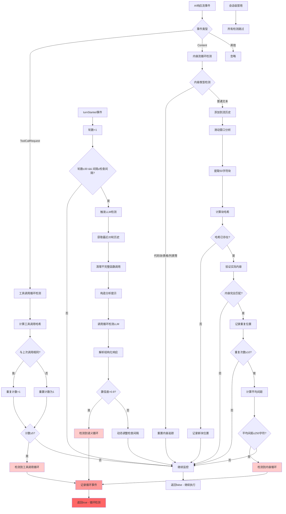

# LoopDetectionService 工作流程图



## 三层检测机制对比

| 检测层次       | 检测目标         | 阈值         | 优点                   | 局限性             |
| -------------- | ---------------- | ------------ | ---------------------- | ------------------ |
| **工具调用层** | 连续相同工具调用 | 5次          | 响应快速、准确         | 只能检测简单重复   |
| **内容流层**   | 文本内容重复模式 | 10次/250字符 | 检测文本循环、内存可控 | 可能误报结构化内容 |
| **语义理解层** | 对话语义循环     | 置信度>0.9   | 理解上下文、智能判断   | 延迟高、资源消耗大 |

## 关键算法细节

### 滑动窗口算法

```
文本: "ABCDEFGHIJKLMNOP..."
窗口大小: 50字符
窗口1: "ABCDEFG...XYZ"  → 哈希A
窗口2:  "BCDEFGH...YZ0" → 哈希B
窗口3:   "CDEFGHI...Z01" → 哈希C
...
```

### 动态间隔调整

```
置信度 → 检查间隔
0.1   → 14轮 (低风险，少检查)
0.5   → 10轮 (中等风险)
0.9   → 6轮  (高风险，频繁检查)
```
