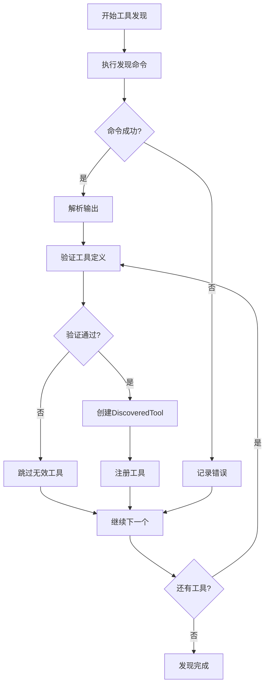
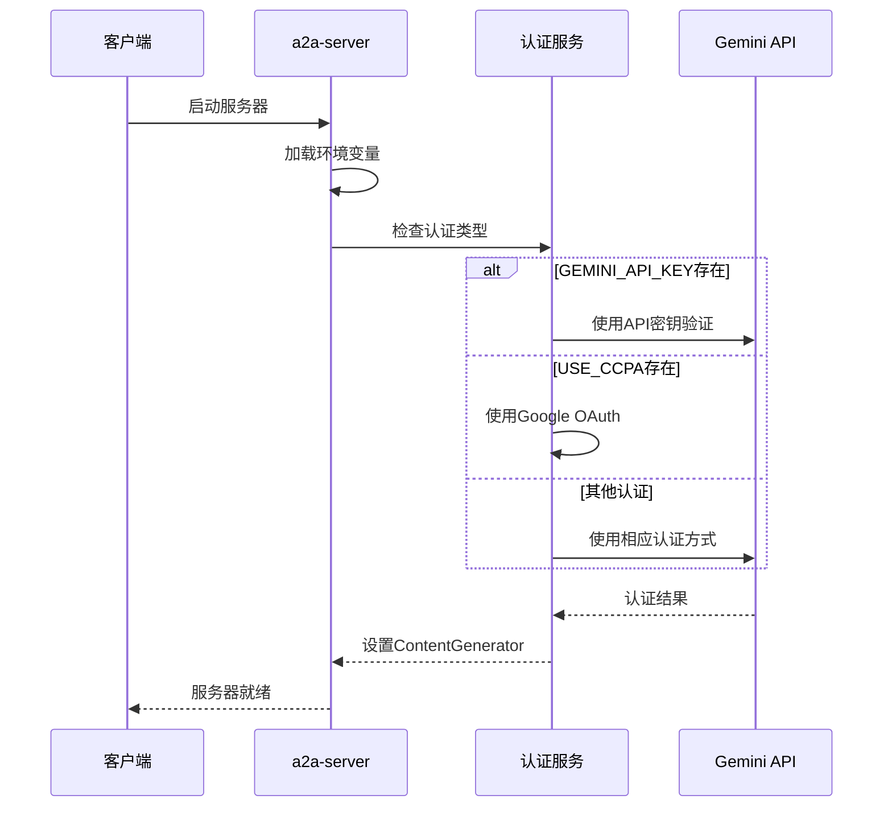
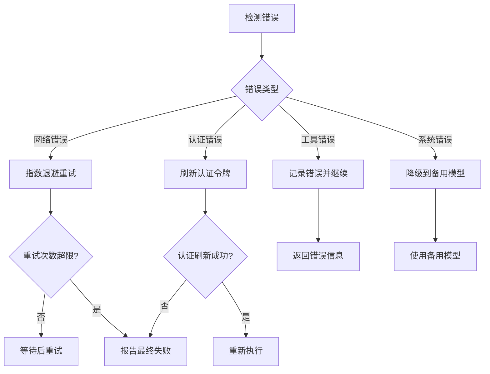

# API参考

<cite>
**本文档中引用的文件**
- [packages/a2a-server/src/index.ts](file://packages/a2a-server/src/index.ts)
- [packages/a2a-server/src/http/app.ts](file://packages/a2a-server/src/http/app.ts)
- [packages/a2a-server/src/types.ts](file://packages/a2a-server/src/types.ts)
- [packages/a2a-server/src/http/server.ts](file://packages/a2a-server/src/http/server.ts)
- [packages/a2a-server/src/agent/executor.ts](file://packages/a2a-server/src/agent/executor.ts)
- [packages/core/src/core/client.ts](file://packages/core/src/core/client.ts)
- [packages/core/src/tools/tool-registry.ts](file://packages/core/src/tools/tool-registry.ts)
- [packages/core/src/tools/tools.ts](file://packages/core/src/tools/tools.ts)
- [packages/core/src/config/config.ts](file://packages/core/src/config/config.ts)
- [packages/a2a-server/src/commands/command-registry.ts](file://packages/a2a-server/src/commands/command-registry.ts)
- [packages/a2a-server/src/http/endpoints.test.ts](file://packages/a2a-server/src/http/endpoints.test.ts)
</cite>

## 目录

1. [简介](#简介)
2. [a2a-server HTTP API](#a2a-server-http-api)
3. [核心模块编程接口](#核心模块编程接口)
4. [认证机制](#认证机制)
5. [错误处理](#错误处理)
6. [使用示例](#使用示例)
7. [故障排除指南](#故障排除指南)

## 简介

gemini-cli提供了两个主要的API接口：

1. **a2a-server HTTP API** - 提供RESTful接口用于任务管理和命令执行
2. **核心模块编程接口** - 包含`GeminiClient`类和工具注册机制

本文档详细介绍了这两个接口的所有公共函数、类和接口，为开发者集成和扩展gemini-cli提供了完整的技术参考。

## a2a-server HTTP API

### 概述

a2a-server提供了一个基于Express的HTTP服务器，支持任务管理、命令执行和状态查询等功能。服务器监听在`CODER_AGENT_PORT`环境变量指定的端口上，默认使用动态端口分配。

### 端点概览

| HTTP方法 | 端点                           | 描述               | 请求体                       | 响应格式            |
| -------- | ------------------------------ | ------------------ | ---------------------------- | ------------------- |
| POST     | `/tasks`                       | 创建新任务         | `{contextId, agentSettings}` | `string` (任务ID)   |
| GET      | `/tasks/:taskId/metadata`      | 获取特定任务元数据 | 无                           | `TaskMetadata`      |
| GET      | `/tasks/metadata`              | 获取所有任务元数据 | 无                           | `TaskMetadata[]`    |
| POST     | `/executeCommand`              | 执行命令           | `{command, args}`            | `any`               |
| GET      | `/listCommands`                | 列出可用命令       | 无                           | `CommandResponse[]` |
| GET      | `/.well-known/agent-card.json` | 获取代理卡片信息   | 无                           | `AgentCard`         |

### 详细端点说明

#### POST /tasks

创建新的代码生成任务。

**请求格式:**

```json
{
  "contextId": "string",
  "agentSettings": {
    "kind": "agent-settings",
    "workspacePath": "string"
  }
}
```

**响应:**

- **201 Created**: 返回任务ID字符串
- **500 Internal Server Error**: 创建任务失败时返回错误信息

**使用示例:**

```bash
curl -X POST http://localhost:41242/tasks \
  -H "Content-Type: application/json" \
  -d '{
    "contextId": "my-session-123",
    "agentSettings": {
      "kind": "agent-settings",
      "workspacePath": "/path/to/project"
    }
  }'
```

#### GET /tasks/:taskId/metadata

获取指定任务的详细元数据信息。

**路径参数:**

- `taskId`: 任务唯一标识符

**响应格式:**

```typescript
interface TaskMetadata {
  id: string;
  contextId: string;
  taskState: TaskState;
  model: string;
  mcpServers: Array<{
    name: string;
    status: MCPServerStatus;
    tools: Array<{
      name: string;
      description: string;
      parameterSchema: unknown;
    }>;
  }>;
  availableTools: Array<{
    name: string;
    description: string;
    parameterSchema: unknown;
  }>;
}
```

#### POST /executeCommand

执行预定义的命令。

**请求格式:**

```json
{
  "command": "string",
  "args": ["string", "string", ...]
}
```

**响应:**

- **200 OK**: 命令执行结果
- **400 Bad Request**: 无效的命令或参数格式
- **404 Not Found**: 命令未找到
- **500 Internal Server Error**: 命令执行失败

#### GET /listCommands

列出所有可用的命令及其子命令。

**响应格式:**

```typescript
interface CommandResponse {
  name: string;
  description: string;
  arguments: CommandArgument[];
  subCommands: CommandResponse[];
}
```

#### GET /.well-known/agent-card.json

获取代理卡片信息，用于A2A协议的发现机制。

**响应格式:**

```typescript
interface AgentCard {
  name: string;
  description: string;
  url: string;
  provider: {
    organization: string;
    url: string;
  };
  protocolVersion: string;
  version: string;
  capabilities: {
    streaming: boolean;
    pushNotifications: boolean;
    stateTransitionHistory: boolean;
  };
  skills: Array<{
    id: string;
    name: string;
    description: string;
    tags: string[];
    examples: string[];
    inputModes: string[];
    outputModes: string[];
  }>;
}
```

**图表来源**

- [packages/a2a-server/src/http/app.ts](file://packages/a2a-server/src/http/app.ts#L122-L262)

**节来源**

- [packages/a2a-server/src/http/app.ts](file://packages/a2a-server/src/http/app.ts#L122-L262)
- [packages/a2a-server/src/http/endpoints.test.ts](file://packages/a2a-server/src/http/endpoints.test.ts#L72-L162)

## 核心模块编程接口

### GeminiClient 类

`GeminiClient`是核心模块的主要入口点，负责与Google Gemini API的交互。

#### 构造函数

```typescript
constructor(config: Config)
```

**参数:**

- `config`: 配置对象，包含模型设置、工具配置等

#### 主要方法

##### initialize()

初始化聊天会话。

```typescript
async initialize(): Promise<void>
```

**功能:** 启动新的聊天会话，加载历史记录和工具配置。

##### sendMessageStream()

发送消息并流式接收响应。

```typescript
async *sendMessageStream(
  request: PartListUnion,
  signal: AbortSignal,
  prompt_id: string,
  turns: number = MAX_TURNS,
  isInvalidStreamRetry: boolean = false
): AsyncGenerator<ServerGeminiStreamEvent, Turn>
```

**参数:**

- `request`: 用户输入内容
- `signal`: 中止信号
- `prompt_id`: 提示符标识符
- `turns`: 最大轮次限制
- `isInvalidStreamRetry`: 是否为重试调用

**返回值:** 异步生成器，产生流式事件直到完成

##### generateContent()

生成内容的同步版本。

```typescript
async generateContent(
  contents: Content[],
  generationConfig: GenerateContentConfig,
  abortSignal: AbortSignal,
  model: string
): Promise<GenerateContentResponse>
```

**参数:**

- `contents`: 内容数组
- `generationConfig`: 生成配置
- `abortSignal`: 中止信号
- `model`: 使用的模型名称

##### setTools()

设置可用工具。

```typescript
async setTools(): Promise<void>
```

**功能:** 从工具注册表加载工具声明到聊天会话。

##### resetChat()

重置聊天会话。

```typescript
async resetChat(): Promise<void>
```

**功能:** 清除当前会话历史并启动新会话。

**图表来源**

- [packages/core/src/core/client.ts](file://packages/core/src/core/client.ts#L68-L694)

**节来源**

- [packages/core/src/core/client.ts](file://packages/core/src/core/client.ts#L68-L694)

### 工具注册机制

#### ToolRegistry 类

工具注册表管理所有可用的工具，支持内置工具、发现工具和MCP工具。

##### 构造函数

```typescript
constructor(config: Config)
```

##### 主要方法

###### registerTool()

注册单个工具。

```typescript
registerTool(tool: AnyDeclarativeTool): void
```

**参数:**

- `tool`: 要注册的工具实例

###### getFunctionDeclarations()

获取所有活动工具的函数声明。

```typescript
getFunctionDeclarations(): FunctionDeclaration[]
```

**返回值:** 函数声明数组，用于API调用

###### getTool()

获取特定工具。

```typescript
getTool(name: string): AnyDeclarativeTool | undefined
```

**参数:**

- `name`: 工具名称

**返回值:** 工具实例或undefined

###### getAllTools()

获取所有活动工具。

```typescript
getAllTools(): AnyDeclarativeTool[]
```

**返回值:** 工具实例数组

##### 工具发现流程



**图表来源**

- [packages/core/src/tools/tool-registry.ts](file://packages/core/src/tools/tool-registry.ts#L294-L423)

**节来源**

- [packages/core/src/tools/tool-registry.ts](file://packages/core/src/tools/tool-registry.ts#L190-L535)

### 工具基类体系

#### BaseDeclarativeTool

所有声明式工具的基类。

##### 抽象方法

###### createInvocation()

创建具体的工具调用实例。

```typescript
protected abstract createInvocation(
  params: TParams,
  messageBus?: MessageBus,
  _toolName?: string,
  _toolDisplayName?: string
): ToolInvocation<TParams, TResult>
```

**参数:**

- `params`: 工具参数
- `messageBus`: 消息总线（可选）
- `_toolName`: 工具名称（可选）
- `_toolDisplayName`: 显示名称（可选）

**返回值:** 工具调用实例

##### 验证方法

###### validateToolParams()

验证工具参数。

```typescript
override validateToolParams(params: TParams): string | null
```

**功能:** 使用JSON Schema验证参数，并调用子类的自定义验证逻辑。

#### ToolInvocation 接口

表示一个已验证并准备执行的工具调用。

##### 主要方法

###### getDescription()

获取工具操作的描述。

```typescript
getDescription(): string
```

**返回值:** Markdown格式的操作描述

###### execute()

执行工具调用。

```typescript
execute(
  signal: AbortSignal,
  updateOutput?: (output: string | AnsiOutput) => void,
  shellExecutionConfig?: ShellExecutionConfig
): Promise<TResult>
```

**参数:**

- `signal`: 中止信号
- `updateOutput`: 输出更新回调（可选）
- `shellExecutionConfig`: Shell执行配置（可选）

**返回值:** 工具执行结果

**节来源**

- [packages/core/src/tools/tools.ts](file://packages/core/src/tools/tools.ts#L29-L719)

## 认证机制

### 支持的认证方式

gemini-cli支持多种认证方式：

| 认证类型       | 环境变量           | 描述                | 使用场景       |
| -------------- | ------------------ | ------------------- | -------------- |
| Gemini API Key | `GEMINI_API_KEY`   | 直接API密钥认证     | 开发和测试环境 |
| Google登录     | `USE_CCPA`         | Google账户OAuth认证 | 生产环境       |
| Vertex AI      | 无                 | 服务账户认证        | 企业环境       |
| Cloud Shell    | `CLOUD_SHELL=true` | GCP Cloud Shell认证 | GCP环境        |

### 认证流程



**图表来源**

- [packages/a2a-server/src/config/config.ts](file://packages/a2a-server/src/config/config.ts#L30-L117)

### 认证配置

#### 环境变量配置

```bash
# API密钥认证
export GEMINI_API_KEY="your-api-key-here"

# Google OAuth认证
export USE_CCPA=true
export GOOGLE_APPLICATION_CREDENTIALS="/path/to/service-account.json"

# GCP项目配置
export GOOGLE_CLOUD_PROJECT="your-project-id"

# 日志级别
export DEBUG=true
```

#### 配置优先级

1. `GEMINI_API_KEY` 环境变量
2. `USE_CCPA` 环境变量
3. 默认回退到Google OAuth

**节来源**

- [packages/a2a-server/src/config/config.ts](file://packages/a2a-server/src/config/config.ts#L30-L117)

## 错误处理

### 错误类型

#### HTTP API错误

| 状态码 | 错误类型              | 描述           | 处理建议       |
| ------ | --------------------- | -------------- | -------------- |
| 400    | Bad Request           | 请求格式错误   | 检查请求体格式 |
| 404    | Not Found             | 资源不存在     | 验证资源ID     |
| 500    | Internal Server Error | 服务器内部错误 | 查看服务器日志 |

#### 工具执行错误

```typescript
interface ToolResult {
  llmContent: PartListUnion;
  returnDisplay: ToolResultDisplay;
  error?: {
    message: string;
    type?: ToolErrorType;
  };
}
```

**错误类型枚举:**

- `INVALID_TOOL_PARAMS`: 无效的工具参数
- `EXECUTION_FAILED`: 工具执行失败
- `DISCOVERED_TOOL_EXECUTION_ERROR`: 发现工具执行错误

### 错误恢复策略



**节来源**

- [packages/core/src/core/client.ts](file://packages/core/src/core/client.ts#L589-L658)

## 使用示例

### 基本HTTP API使用

#### 创建任务并获取结果

```javascript
const baseUrl = 'http://localhost:41242';

// 1. 创建任务
const createTaskResponse = await fetch(`${baseUrl}/tasks`, {
  method: 'POST',
  headers: { 'Content-Type': 'application/json' },
  body: JSON.stringify({
    contextId: 'session-123',
    agentSettings: {
      kind: 'agent-settings',
      workspacePath: '/path/to/project',
    },
  }),
});

const taskId = await createTaskResponse.json();

// 2. 发送消息
const messagesResponse = await fetch(`${baseUrl}/tasks/${taskId}/messages`, {
  method: 'POST',
  headers: { 'Content-Type': 'application/json' },
  body: JSON.stringify({
    parts: [{ text: '编写一个Python函数来计算斐波那契数列' }],
  }),
});

// 3. 获取任务元数据
const metadataResponse = await fetch(`${baseUrl}/tasks/${taskId}/metadata`);
const metadata = await metadataResponse.json();
```

#### 批量任务管理

```javascript
// 获取所有任务
const tasksResponse = await fetch(`${baseUrl}/tasks/metadata`);
const allTasks = await tasksResponse.json();

// 过滤活跃任务
const activeTasks = allTasks.filter((task) =>
  ['submitted', 'running', 'input-required'].includes(task.taskState),
);

// 取消任务
const cancelResponse = await fetch(`${baseUrl}/tasks/${taskId}/cancel`, {
  method: 'POST',
});
```

### 编程接口使用

#### 初始化GeminiClient

```typescript
import { Config, GeminiClient } from '@google/gemini-cli-core';

// 创建配置
const config = new Config({
  sessionId: 'unique-session-id',
  targetDir: '/path/to/project',
  model: 'gemini-pro',
  debugMode: true,
});

// 初始化客户端
const client = new GeminiClient(config);
await client.initialize();
await client.setTools();
```

#### 流式对话

```typescript
import { AbortController } from 'abort-controller';

const controller = new AbortController();
const signal = controller.signal;

try {
  const stream = client.sendMessageStream(
    [{ text: '解释一下什么是闭包？' }],
    signal,
    'prompt-123',
  );

  for await (const event of stream) {
    switch (event.type) {
      case 'text-content':
        process.stdout.write(event.value);
        break;
      case 'tool-call-request':
        console.log('需要调用工具:', event.value);
        break;
      case 'state-change':
        console.log('状态变更:', event.value);
        break;
    }
  }
} catch (error) {
  if (signal.aborted) {
    console.log('用户取消了对话');
  } else {
    console.error('对话错误:', error);
  }
}
```

#### 工具调用

```typescript
// 获取工具注册表
const toolRegistry = config.getToolRegistry();

// 查找特定工具
const readFileTool = toolRegistry.getTool('read_file');
if (readFileTool) {
  // 构建并执行工具调用
  const invocation = readFileTool.build({
    path: './package.json',
    maxLines: 10,
  });

  const result = await invocation.execute(signal);
  console.log('文件内容:', result.returnDisplay);
}
```

**节来源**

- [packages/a2a-server/src/http/endpoints.test.ts](file://packages/a2a-server/src/http/endpoints.test.ts#L72-L162)

## 故障排除指南

### 常见问题及解决方案

#### 1. 认证失败

**症状:** 服务器启动时出现认证错误

**解决方案:**

```bash
# 检查API密钥
echo $GEMINI_API_KEY

# 验证Google OAuth配置
export USE_CCPA=true
export GOOGLE_APPLICATION_CREDENTIALS="/path/to/service-account.json"

# 检查GCP项目配置
echo $GOOGLE_CLOUD_PROJECT
```

#### 2. 端口冲突

**症状:** 服务器无法启动，提示端口已被占用

**解决方案:**

```bash
# 指定不同端口
export CODER_AGENT_PORT=41243

# 或者让系统自动分配
unset CODER_AGENT_PORT
```

#### 3. 工具执行失败

**症状:** 工具调用返回错误

**诊断步骤:**

```bash
# 启用调试模式
export DEBUG=true

# 检查工具发现命令
echo $GEMINI_TOOL_DISCOVERY_COMMAND

# 验证工具调用权限
ls -la $(which gemini-tool-discovery)
```

#### 4. 内存不足

**症状:** 服务器崩溃或响应缓慢

**解决方案:**

```bash
# 增加Node.js内存限制
export NODE_OPTIONS="--max-old-space-size=4096"

# 启用压缩阈值
export GEMINI_COMPRESSION_THRESHOLD=1000000
```

### 调试技巧

#### 启用详细日志

```bash
# 设置日志级别
export DEBUG=true
export LOG_LEVEL=debug

# 查看服务器日志
tail -f /var/log/gemini-server.log
```

#### 性能监控

```javascript
// 监控工具执行时间
const startTime = Date.now();
const result = await tool.execute(signal);
const duration = Date.now() - startTime;
console.log(`工具执行耗时: ${duration}ms`);
```

#### 网络诊断

```bash
# 检查服务器状态
curl -I http://localhost:41242/

# 测试代理卡片
curl http://localhost:41242/.well-known/agent-card.json

# 检查端口监听
netstat -tlnp | grep 41242
```

**节来源**

- [packages/a2a-server/src/utils/logger.ts](file://packages/a2a-server/src/utils/logger.ts)
- [packages/core/src/utils/debugLogger.ts](file://packages/core/src/utils/debugLogger.ts)
