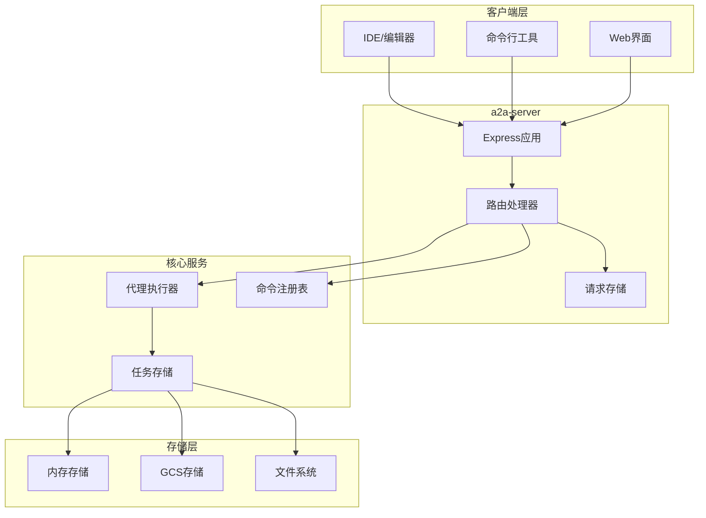
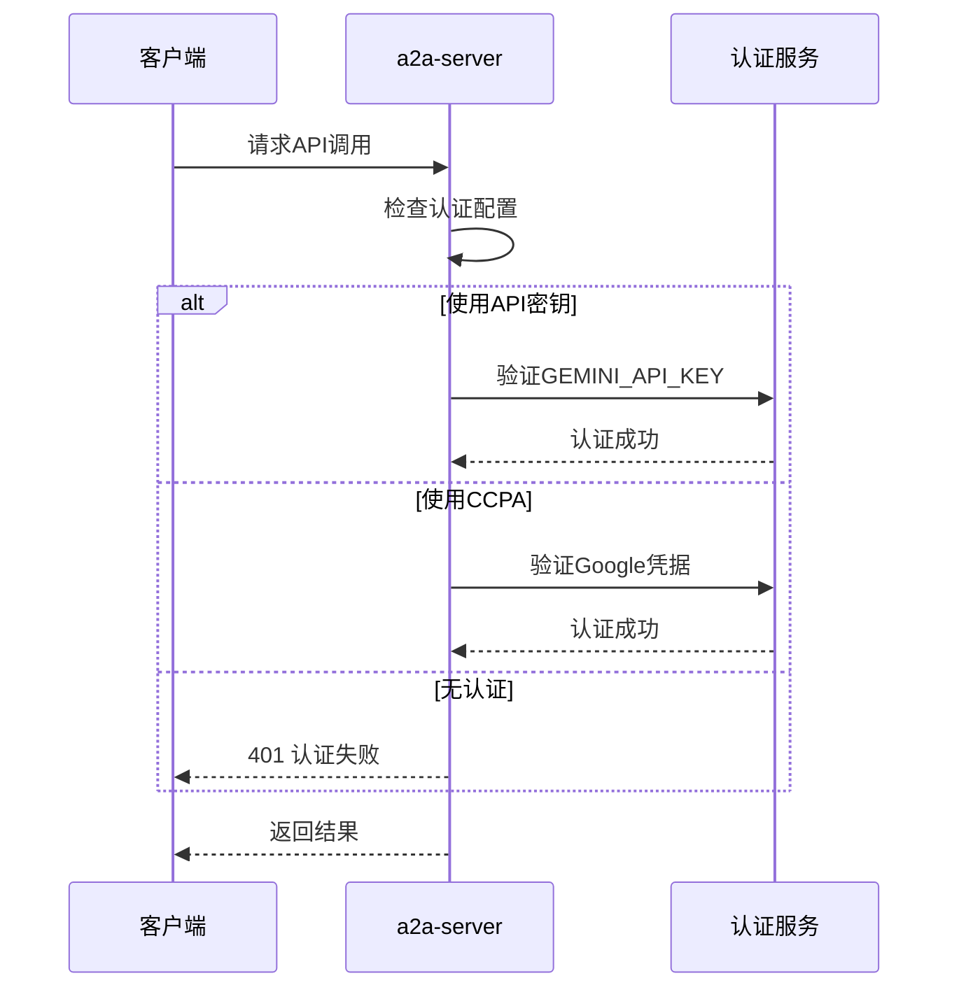
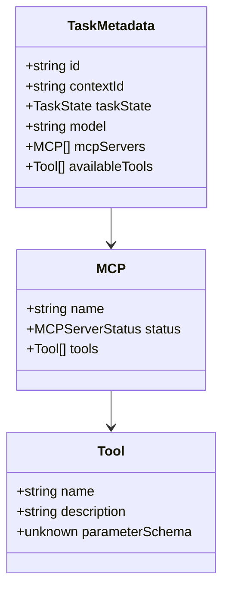
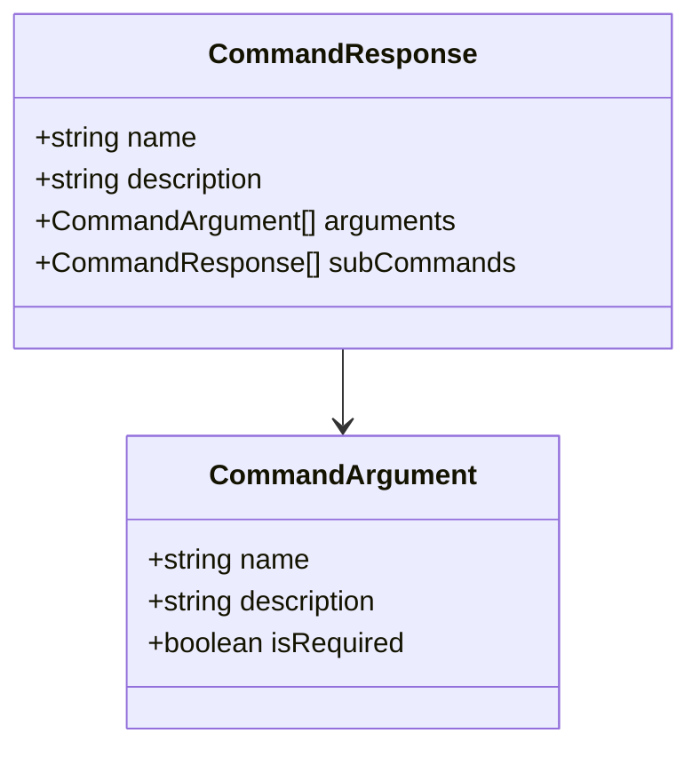
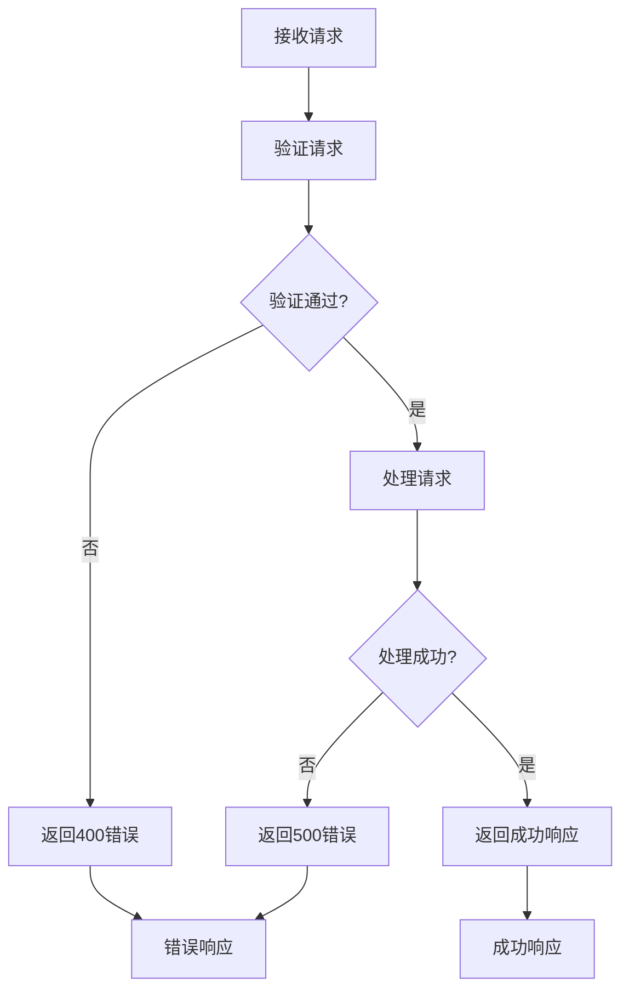
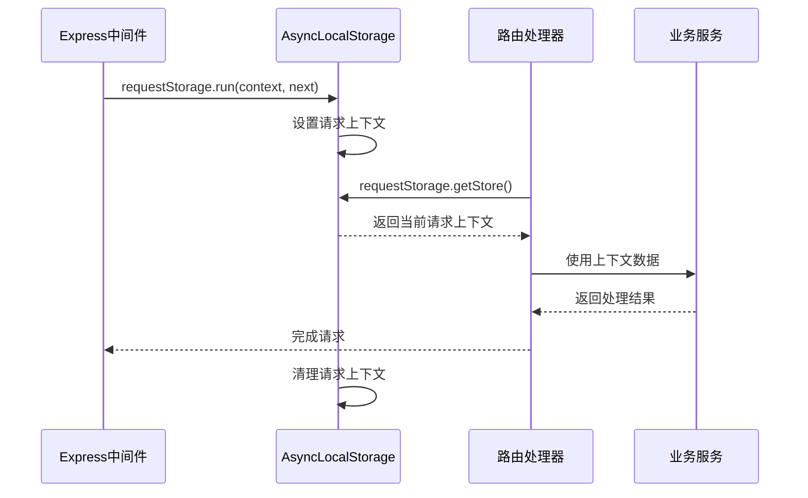

# a2a-server HTTP API 文档

<cite>
**本文档中引用的文件**
- [app.ts](file://packages/a2a-server/src/http/app.ts)
- [server.ts](file://packages/a2a-server/src/http/server.ts)
- [requestStorage.ts](file://packages/a2a-server/src/http/requestStorage.ts)
- [types.ts](file://packages/a2a-server/src/types.ts)
- [endpoints.test.ts](file://packages/a2a-server/src/http/endpoints.test.ts)
- [config.ts](file://packages/a2a-server/src/config/config.ts)
- [gcs.ts](file://packages/a2a-server/src/persistence/gcs.ts)
- [command-registry.ts](file://packages/a2a-server/src/commands/command-registry.ts)
- [extensions.ts](file://packages/a2a-server/src/commands/extensions.ts)
- [types.ts](file://packages/a2a-server/src/commands/types.ts)
</cite>

## 目录

1. [简介](#简介)
2. [项目架构](#项目架构)
3. [认证机制](#认证机制)
4. [API端点详解](#api端点详解)
5. [请求与响应数据结构](#请求与响应数据结构)
6. [错误处理](#错误处理)
7. [使用示例](#使用示例)
8. [requestStorage.ts的作用](#requeststoragets的作用)
9. [部署与配置](#部署与配置)
10. [故障排除](#故障排除)

## 简介

a2a-server是Gemini CLI项目中的一个实验性组件，提供了面向第三方系统的HTTP
API接口。该服务器实现了任务管理、命令执行和元数据查询功能，支持与IDE和其他开发工具的集成。

### 核心特性

- **任务管理**：创建、查询和管理代码生成任务
- **命令执行**：执行CLI命令和扩展功能
- **状态监控**：提供任务状态和元数据查询
- **持久化存储**：支持本地内存和Google Cloud Storage存储
- **扩展支持**：可插拔的命令系统

## 项目架构



**图表来源**

- [app.ts](file://packages/a2a-server/src/http/app.ts#L113-L263)
- [requestStorage.ts](file://packages/a2a-server/src/http/requestStorage.ts#L10-L11)

**章节来源**

- [app.ts](file://packages/a2a-server/src/http/app.ts#L1-L299)
- [server.ts](file://packages/a2a-server/src/http/server.ts#L1-L35)

## 认证机制

a2a-server支持多种认证方式：

### API密钥认证

通过环境变量设置：

- `GEMINI_API_KEY`: 使用Gemini API密钥进行身份验证
- `USE_CCPA`: 启用Cloud Identity认证

### 身份验证流程



**图表来源**

- [config.ts](file://packages/a2a-server/src/config/config.ts#L107-L115)

**章节来源**

- [config.ts](file://packages/a2a-server/src/config/config.ts#L30-L115)

## API端点详解

### 1. 创建任务 - POST /tasks

**描述**: 创建新的代码生成任务

**HTTP方法**: `POST`

**请求头**:

```
Content-Type: application/json
```

**请求体**:

```json
{
  "contextId": "string",
  "agentSettings": {
    "kind": "agent-settings",
    "workspacePath": "string"
  }
}
```

**响应**:

- **201 Created**: 任务创建成功
  ```json
  "task-id-uuid"
  ```
- **500 Internal Server Error**: 服务器内部错误

**章节来源**

- [app.ts](file://packages/a2a-server/src/http/app.ts#L122-L143)

### 2. 获取任务元数据 - GET /tasks/{taskId}/metadata

**描述**: 查询特定任务的详细元数据

**HTTP方法**: `GET`

**路径参数**:

- `taskId` (必需): 任务唯一标识符

**响应**:

- **200 OK**: 成功获取元数据
  ```json
  {
    "metadata": {
      "id": "task-id",
      "contextId": "context-id",
      "taskState": "submitted",
      "model": "gemini-pro",
      "mcpServers": [],
      "availableTools": []
    }
  }
  ```
- **404 Not Found**: 任务不存在
- **500 Internal Server Error**: 服务器内部错误

**章节来源**

- [app.ts](file://packages/a2a-server/src/http/app.ts#L248-L261)

### 3. 获取所有任务元数据 - GET /tasks/metadata

**描述**: 获取所有任务的元数据列表（仅支持内存存储）

**HTTP方法**: `GET`

**响应**:

- **200 OK**: 成功获取元数据列表
  ```json
  [
    {
      "id": "task-id-1",
      "contextId": "context-id-1",
      "taskState": "completed",
      "model": "gemini-pro",
      "mcpServers": [],
      "availableTools": []
    }
  ]
  ```
- **204 No Content**: 没有任务
- **501 Not Implemented**: 不支持的存储类型
- **500 Internal Server Error**: 服务器内部错误

**章节来源**

- [app.ts](file://packages/a2a-server/src/http/app.ts#L220-L239)

### 4. 执行命令 - POST /executeCommand

**描述**: 执行指定的CLI命令

**HTTP方法**: `POST`

**请求头**:

```
Content-Type: application/json
```

**请求体**:

```json
{
  "command": "string",
  "args": ["arg1", "arg2"]
}
```

**响应**:

- **200 OK**: 命令执行成功
  ```json
  {
    "name": "command-name",
    "data": {...}
  }
  ```
- **400 Bad Request**: 请求格式错误
- **404 Not Found**: 命令未找到
- **500 Internal Server Error**: 命令执行失败

**章节来源**

- [app.ts](file://packages/a2a-server/src/http/app.ts#L146-L176)

### 5. 列出命令 - GET /listCommands

**描述**: 获取所有可用命令的列表

**HTTP方法**: `GET`

**响应**:

- **200 OK**: 成功获取命令列表
  ```json
  {
    "commands": [
      {
        "name": "extensions",
        "description": "Manage extensions.",
        "arguments": [],
        "subCommands": [
          {
            "name": "extensions list",
            "description": "Lists all installed extensions.",
            "arguments": [],
            "subCommands": []
          }
        ]
      }
    ]
  }
  ```
- **500 Internal Server Error**: 服务器内部错误

**章节来源**

- [app.ts](file://packages/a2a-server/src/http/app.ts#L178-L218)

### 6. 获取代理卡片 - GET /.well-known/agent-card.json

**描述**: 获取代理的元数据卡片

**HTTP方法**: `GET`

**响应**:

- **200 OK**: 成功获取代理卡片
  ```json
  {
    "name": "Gemini SDLC Agent",
    "description": "An agent that generates code based on natural language instructions and streams file outputs.",
    "url": "http://localhost:41242/",
    "provider": {
      "organization": "Google",
      "url": "https://google.com"
    },
    "protocolVersion": "0.3.0",
    "version": "0.0.2",
    "capabilities": {
      "streaming": true,
      "pushNotifications": false,
      "stateTransitionHistory": true
    },
    "defaultInputModes": ["text"],
    "defaultOutputModes": ["text"],
    "skills": [
      {
        "id": "code_generation",
        "name": "Code Generation",
        "description": "Generates code snippets or complete files based on user requests, streaming the results.",
        "tags": ["code", "development", "programming"],
        "examples": [
          "Write a python function to calculate fibonacci numbers.",
          "Create an HTML file with a basic button that alerts \"Hello!\" when clicked."
        ],
        "inputModes": ["text"],
        "outputModes": ["text"]
      }
    ]
  }
  ```

**章节来源**

- [app.ts](file://packages/a2a-server/src/http/app.ts#L33-L73)

## 请求与响应数据结构

### 任务元数据结构



**图表来源**

- [types.ts](file://packages/a2a-server/src/types.ts#L94-L113)

### 命令响应结构



**图表来源**

- [types.ts](file://packages/a2a-server/src/commands/types.ts#L9-L28)
- [app.ts](file://packages/a2a-server/src/http/app.ts#L26-L31)

**章节来源**

- [types.ts](file://packages/a2a-server/src/types.ts#L94-L139)
- [types.ts](file://packages/a2a-server/src/commands/types.ts#L1-L29)

## 错误处理

### HTTP状态码

| 状态码 | 描述                  | 场景                                     |
| ------ | --------------------- | ---------------------------------------- |
| 400    | Bad Request           | 请求格式错误，如无效的JSON或缺少必需字段 |
| 401    | Unauthorized          | 缺少有效的认证凭据                       |
| 404    | Not Found             | 请求的资源不存在                         |
| 500    | Internal Server Error | 服务器内部错误                           |
| 501    | Not Implemented       | 功能尚未实现                             |

### 错误响应格式

```json
{
  "error": "错误描述信息"
}
```

### 错误处理流程



**图表来源**

- [app.ts](file://packages/a2a-server/src/http/app.ts#L122-L143)
- [app.ts](file://packages/a2a-server/src/http/app.ts#L146-L176)

**章节来源**

- [app.ts](file://packages/a2a-server/src/http/app.ts#L122-L176)

## 使用示例

### 创建新任务

```bash
curl -X POST http://localhost:41242/tasks \
  -H "Content-Type: application/json" \
  -d '{
    "contextId": "my-project-123",
    "agentSettings": {
      "kind": "agent-settings",
      "workspacePath": "/path/to/workspace"
    }
  }'
```

**响应**:

```
"550e8400-e29b-41d4-a716-446655440000"
```

### 获取任务元数据

```bash
curl -X GET http://localhost:41242/tasks/550e8400-e29b-41d4-a716-446655440000/metadata
```

**响应**:

```json
{
  "metadata": {
    "id": "550e8400-e29b-41d4-a716-446655440000",
    "contextId": "my-project-123",
    "taskState": "submitted",
    "model": "gemini-pro",
    "mcpServers": [],
    "availableTools": []
  }
}
```

### 执行命令

```bash
curl -X POST http://localhost:41242/executeCommand \
  -H "Content-Type: application/json" \
  -d '{
    "command": "extensions list",
    "args": []
  }'
```

**响应**:

```json
{
  "name": "extensions list",
  "data": [
    {
      "name": "example-extension",
      "version": "1.0.0",
      "description": "Example extension"
    }
  ]
}
```

### 获取代理卡片

```bash
curl -X GET http://localhost:41242/.well-known/agent-card.json
```

**响应**: 包含完整的代理元数据信息

### 使用API密钥认证

```bash
curl -X POST http://localhost:41242/tasks \
  -H "Authorization: Bearer YOUR_API_KEY" \
  -H "Content-Type: application/json" \
  -d '{
    "contextId": "authenticated-session",
    "agentSettings": {
      "kind": "agent-settings",
      "workspacePath": "/workspace"
    }
  }'
```

**章节来源**

- [endpoints.test.ts](file://packages/a2a-server/src/http/endpoints.test.ts#L78-L87)

## requestStorage.ts的作用

`requestStorage.ts`模块提供了异步本地存储功能，用于在请求生命周期内维护上下文信息。

### 核心功能

1. **请求上下文隔离**: 为每个请求提供独立的存储空间
2. **异步安全**: 使用`AsyncLocalStorage`确保异步操作中的数据一致性
3. **中间件集成**: 作为Express中间件自动管理请求上下文

### 实现原理



**图表来源**

- [requestStorage.ts](file://packages/a2a-server/src/http/requestStorage.ts#L10-L11)
- [app.ts](file://packages/a2a-server/src/http/app.ts#L113-L116)

### 在应用中的使用

在`app.ts`中，`requestStorage`被用作Express中间件：

```typescript
expressApp.use((req, res, next) => {
  requestStorage.run({ req }, next);
});
```

这确保了在整个请求处理过程中，任何需要访问当前请求信息的地方都可以通过`requestStorage.getStore()`获取。

**章节来源**

- [requestStorage.ts](file://packages/a2a-server/src/http/requestStorage.ts#L1-L11)
- [app.ts](file://packages/a2a-server/src/http/app.ts#L113-L116)

## 部署与配置

### 环境变量

| 变量名                           | 描述                       | 默认值             |
| -------------------------------- | -------------------------- | ------------------ |
| `CODER_AGENT_PORT`               | 服务器监听端口             | 0（随机端口）      |
| `CODER_AGENT_WORKSPACE_PATH`     | 工作区路径                 | 当前工作目录       |
| `GCS_BUCKET_NAME`                | Google Cloud Storage桶名称 | 无（使用内存存储） |
| `GEMINI_API_KEY`                 | Gemini API密钥             | 无                 |
| `USE_CCPA`                       | 启用Cloud Identity认证     | false              |
| `GOOGLE_APPLICATION_CREDENTIALS` | Google应用凭据文件路径     | 无                 |

### 存储配置

#### 内存存储（默认）

- 适用于开发和测试环境
- 数据在服务器重启后丢失
- 性能最佳

#### Google Cloud Storage存储

- 适用于生产环境
- 数据持久化存储
- 支持高可用性和备份

### 启动命令

```bash
# 开发环境
npm run dev

# 生产环境
npm start

# 自定义端口
CODER_AGENT_PORT=8080 npm start
```

**章节来源**

- [config.ts](file://packages/a2a-server/src/config/config.ts#L148-L183)
- [gcs.ts](file://packages/a2a-server/src/persistence/gcs.ts#L33-L48)

## 故障排除

### 常见问题

#### 1. 认证失败

**症状**: 接收到401错误 **解决方案**:

- 检查`GEMINI_API_KEY`是否正确设置
- 验证`USE_CCPA`环境变量配置
- 确认Google Cloud凭据文件路径

#### 2. 任务创建失败

**症状**: POST /tasks返回500错误 **解决方案**:

- 检查工作区路径是否存在
- 验证磁盘空间是否充足
- 查看服务器日志获取详细错误信息

#### 3. 命令执行失败

**症状**: /executeCommand返回500错误 **解决方案**:

- 确认命令名称拼写正确
- 检查命令参数格式
- 验证扩展是否已正确安装

#### 4. GCS存储连接问题

**症状**: 无法保存/加载任务到GCS **解决方案**:

- 验证Google Cloud项目权限
- 检查网络连接
- 确认GCS桶名称正确

### 日志记录

服务器使用统一的日志记录系统：

```typescript
import { logger } from '../utils/logger.js';
```

日志级别：

- `info`: 正常操作信息
- `warn`: 警告信息
- `error`: 错误信息

### 调试模式

启用调试模式：

```bash
DEBUG=true npm start
```

这将输出详细的请求和错误信息，有助于问题诊断。

**章节来源**

- [config.ts](file://packages/a2a-server/src/config/config.ts#L107-L115)
- [gcs.ts](file://packages/a2a-server/src/persistence/gcs.ts#L33-L48)

## 结论

a2a-server提供了一个功能完整的HTTP
API，支持代码生成任务的创建、管理和查询。通过灵活的认证机制、可插拔的命令系统和多种存储选项，它能够满足不同场景下的集成需求。

### 主要优势

- **易于集成**: 标准化的REST API设计
- **灵活认证**: 支持多种认证方式
- **可扩展**: 基于命令系统的插件架构
- **可靠存储**: 支持本地和云端存储
- **实时反馈**: 流式响应和状态更新

### 最佳实践

1. 使用适当的认证机制保护API访问
2. 实施请求限流以防止滥用
3. 监控API使用情况和性能指标
4. 定期备份重要数据
5. 遵循安全编码实践

通过遵循本文档的指导，开发者可以有效地将第三方系统与a2a-server集成，构建强大的代码生成和开发工具链。
