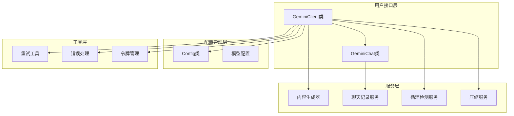
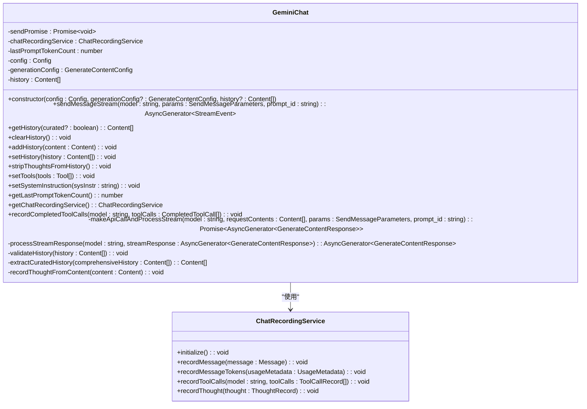
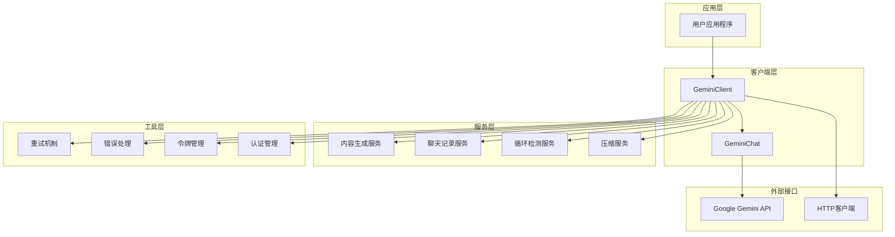
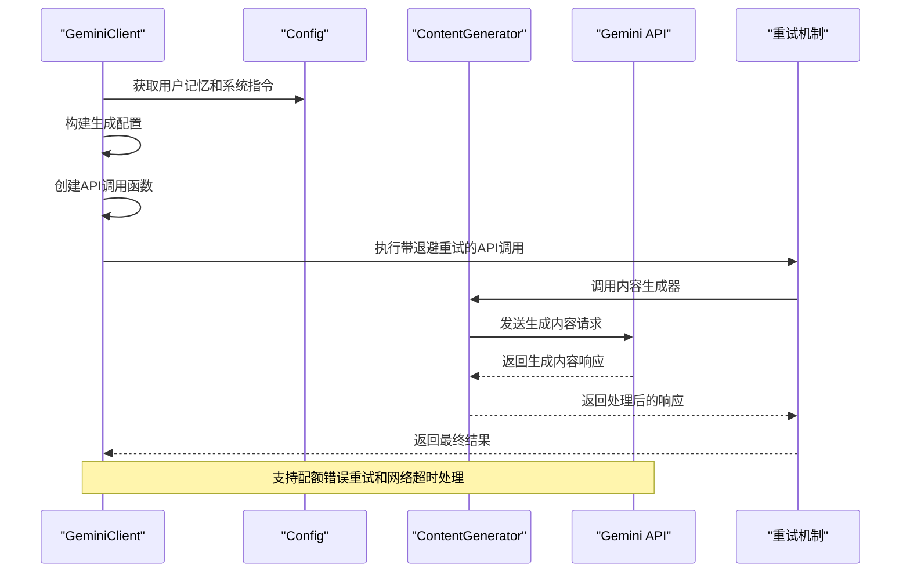
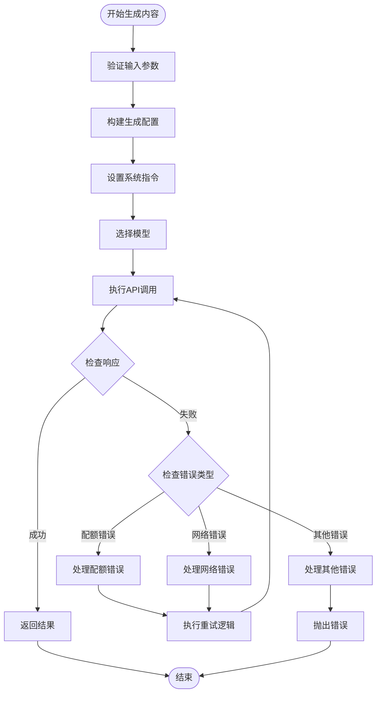
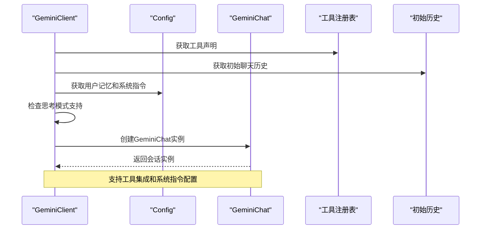
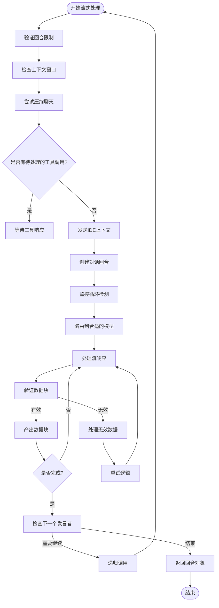
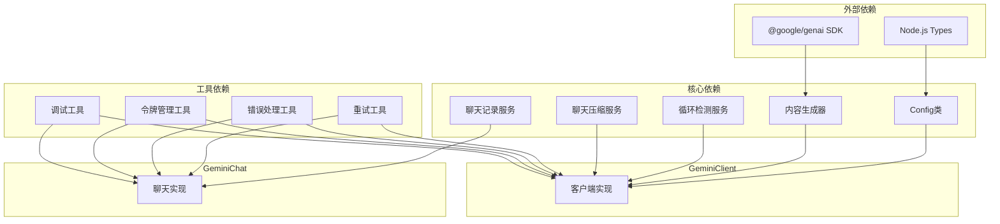
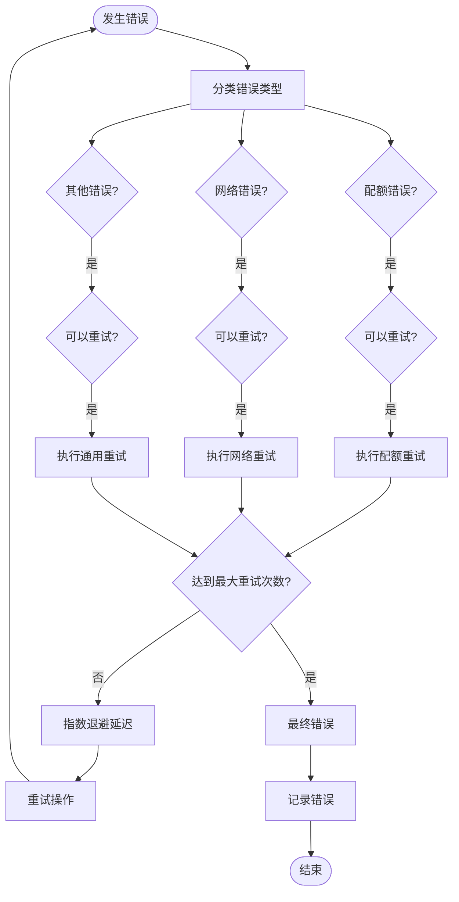

# Gemini客户端接口技术文档

<cite>
**本文档中引用的文件**
- [client.ts](file://packages/core/src/core/client.ts)
- [geminiChat.ts](file://packages/core/src/core/geminiChat.ts)
- [config.ts](file://packages/core/src/config/config.ts)
- [retry.ts](file://packages/core/src/utils/retry.ts)
- [googleErrors.ts](file://packages/core/src/utils/googleErrors.ts)
- [converter.ts](file://packages/core/src/code_assist/converter.ts)
</cite>

## 目录

1. [简介](#简介)
2. [项目结构](#项目结构)
3. [核心组件](#核心组件)
4. [架构概览](#架构概览)
5. [详细组件分析](#详细组件分析)
6. [依赖关系分析](#依赖关系分析)
7. [性能考虑](#性能考虑)
8. [故障排除指南](#故障排除指南)
9. [结论](#结论)

## 简介

Gemini客户端接口是一个基于TypeScript的高级API封装层，为Google
Gemini语言模型提供了统一的访问接口。该系统通过`GeminiClient`类实现了智能的对话管理、内容生成和流式响应处理功能，同时集成了完善的错误处理、重试机制和配额管理策略。

本文档深入解析了Gemini客户端的核心架构，包括构造函数参数设计、主要方法实现细节、类型定义规范以及最佳实践指导。

## 项目结构

Gemini客户端接口采用模块化架构设计，主要分为以下几个层次：



**图表来源**

- [client.ts](file://packages/core/src/core/client.ts#L67-L93)
- [geminiChat.ts](file://packages/core/src/core/geminiChat.ts#L177-L201)

**章节来源**

- [client.ts](file://packages/core/src/core/client.ts#L1-L694)
- [geminiChat.ts](file://packages/core/src/core/geminiChat.ts#L1-L660)

## 核心组件

### GeminiClient类

`GeminiClient`是Gemini客户端接口的核心类，负责管理与Gemini模型的交互会话。该类采用了依赖注入模式，通过构造函数接收配置对象和可选的HTTP客户端实例。

#### 构造函数参数

```mermaid
classDiagram
class GeminiClient {
-chat : GeminiChat
-generateContentConfig : GenerateContentConfig
-sessionTurnCount : number
-loopDetector : LoopDetectionService
-compressionService : ChatCompressionService
-lastPromptId : string
-currentSequenceModel : string
-lastSentIdeContext : IdeContext
-forceFullIdeContext : boolean
-hasFailedCompressionAttempt : boolean
+constructor(config : Config)
+initialize() : Promise~void~
+generateContent(contents : Content[], generationConfig : GenerateContentConfig, abortSignal : AbortSignal, model : string) : Promise~GenerateContentResponse~
+startChat(extraHistory? : Content[]) : Promise~GeminiChat~
+sendMessageStream(request : PartListUnion, signal : AbortSignal, prompt_id : string, turns? : number, isInvalidStreamRetry? : boolean) : AsyncGenerator~ServerGeminiStreamEvent, Turn~
+addHistory(content : Content) : Promise~void~
+resetChat() : Promise~void~
+getHistory() : Content[]
+setHistory(history : Content[]) : void
+setTools() : Promise~void~
+stripThoughtsFromHistory() : void
+getChat() : GeminiChat
+isInitialized() : boolean
+getChatRecordingService() : ChatRecordingService
+getLoopDetectionService() : LoopDetectionService
+getCurrentSequenceModel() : string
+addDirectoryContext() : Promise~void~
-getContentGeneratorOrFail() : ContentGenerator
-updateTelemetryTokenCount() : void
-tryCompressChat(prompt_id : string, force? : boolean) : Promise~ChatCompressionInfo~
-getIdeContextParts(forceFullContext : boolean) : {contextParts : string[], newIdeContext : IdeContext}
-_getEffectiveModelForCurrentTurn() : string
}
class Config {
+getModel() : string
+getUserMemory() : string
+getToolRegistry() : ToolRegistry
+getContentGenerator() : ContentGenerator
+getSessionId() : string
+getIdeMode() : boolean
+getDebugMode() : boolean
+getQuotaErrorOccurred() : boolean
+getContinueOnFailedApiCall() : boolean
+getRetryFetchErrors() : boolean
+getSkipNextSpeakerCheck() : boolean
+getMaxSessionTurns() : number
+getBaseLlmClient() : BaseLlmClient
+getModelRouterService() : ModelRouterService
}
GeminiClient --> Config : "依赖"
```

**图表来源**

- [client.ts](file://packages/core/src/core/client.ts#L67-L93)
- [config.ts](file://packages/core/src/config/config.ts#L1-L200)

#### 配置对象结构

`Config`对象包含了Gemini客户端运行所需的所有配置参数：

| 参数名称                  | 类型      | 描述                 | 默认值         |
| ------------------------- | --------- | -------------------- | -------------- |
| `model`                   | `string`  | 使用的Gemini模型名称 | `'gemini-pro'` |
| `apiKey`                  | `string`  | Google API密钥       | `undefined`    |
| `userMemory`              | `string`  | 用户记忆内容         | `''`           |
| `sessionId`               | `string`  | 会话标识符           | 自动生成       |
| `debugMode`               | `boolean` | 调试模式开关         | `false`        |
| `ideMode`                 | `boolean` | IDE模式开关          | `false`        |
| `quotaErrorOccurred`      | `boolean` | 配额错误状态         | `false`        |
| `continueOnFailedApiCall` | `boolean` | 失败API调用继续标志  | `false`        |
| `retryFetchErrors`        | `boolean` | 重试获取错误标志     | `false`        |
| `skipNextSpeakerCheck`    | `boolean` | 跳过下一轮检查标志   | `false`        |

**章节来源**

- [client.ts](file://packages/core/src/core/client.ts#L67-L93)
- [config.ts](file://packages/core/src/config/config.ts#L1-L200)

### GeminiChat类

`GeminiChat`类负责管理单个对话会话，维护对话历史并处理与Gemini模型的交互。

#### 构造函数参数



**图表来源**

- [geminiChat.ts](file://packages/core/src/core/geminiChat.ts#L177-L201)
- [geminiChat.ts](file://packages/core/src/core/geminiChat.ts#L34-L41)

**章节来源**

- [geminiChat.ts](file://packages/core/src/core/geminiChat.ts#L177-L201)

## 架构概览

Gemini客户端接口采用分层架构设计，确保了良好的可维护性和扩展性：



**图表来源**

- [client.ts](file://packages/core/src/core/client.ts#L1-L50)
- [geminiChat.ts](file://packages/core/src/core/geminiChat.ts#L1-L50)

## 详细组件分析

### generateContent方法实现

`generateContent`方法是Gemini客户端的核心内容生成接口，支持同步和异步调用模式。

#### 方法签名和参数



**图表来源**

- [client.ts](file://packages/core/src/core/client.ts#L589-L657)
- [retry.ts](file://packages/core/src/utils/retry.ts#L89-L215)

#### 请求构建过程

方法内部的请求构建遵循以下流程：

1. **配置合并**：将默认配置与传入的生成配置进行深度合并
2. **系统指令设置**：从配置中获取用户记忆并构建系统指令
3. **模型选择**：根据当前状态和配置确定使用的模型
4. **API调用**：通过内容生成器发送请求

#### 响应处理和错误恢复



**图表来源**

- [client.ts](file://packages/core/src/core/client.ts#L589-L657)
- [retry.ts](file://packages/core/src/utils/retry.ts#L89-L215)

**章节来源**

- [client.ts](file://packages/core/src/core/client.ts#L589-L657)

### startChat方法实现

`startChat`方法用于创建和初始化新的对话会话，支持历史消息的持久化和流式响应处理。

#### 会话创建流程



**图表来源**

- [client.ts](file://packages/core/src/core/client.ts#L177-L219)
- [geminiChat.ts](file://packages/core/src/core/geminiChat.ts#L177-L201)

#### 历史消息管理

会话的历史消息管理包括以下特性：

| 功能         | 描述               | 实现方式                       |
| ------------ | ------------------ | ------------------------------ |
| 历史持久化   | 保存完整的对话历史 | 内存存储，支持序列化           |
| 历史过滤     | 过滤无效或空的消息 | `extractCuratedHistory`函数    |
| 思考内容剥离 | 移除模型的思考过程 | `stripThoughtsFromHistory`方法 |
| 工具调用记录 | 记录工具使用情况   | `recordCompletedToolCalls`方法 |
| 令牌计数跟踪 | 监控对话令牌使用量 | `getLastPromptTokenCount`方法  |

**章节来源**

- [client.ts](file://packages/core/src/core/client.ts#L177-L219)
- [geminiChat.ts](file://packages/core/src/core/geminiChat.ts#L427-L464)

### 流式响应处理

Gemini客户端支持实时流式响应处理，提供渐进式的用户体验。

#### 流式处理架构



**图表来源**

- [client.ts](file://packages/core/src/core/client.ts#L402-L587)
- [geminiChat.ts](file://packages/core/src/core/geminiChat.ts#L494-L587)

**章节来源**

- [client.ts](file://packages/core/src/core/client.ts#L402-L587)
- [geminiChat.ts](file://packages/core/src/core/geminiChat.ts#L494-L587)

## 依赖关系分析

Gemini客户端接口的依赖关系体现了清晰的分层架构：



**图表来源**

- [client.ts](file://packages/core/src/core/client.ts#L7-L54)
- [geminiChat.ts](file://packages/core/src/core/geminiChat.ts#L7-L41)

**章节来源**

- [client.ts](file://packages/core/src/core/client.ts#L7-L54)
- [geminiChat.ts](file://packages/core/src/core/geminiChat.ts#L7-L41)

## 性能考虑

### 令牌管理优化

Gemini客户端实现了智能的令牌管理策略：

- **预估令牌计算**：使用字符串长度估算请求令牌数量
- **动态压缩**：自动压缩长对话历史以节省令牌
- **上下文窗口监控**：防止超出模型上下文限制

### 并发控制

- **发送队列**：使用Promise链确保消息按序发送
- **循环检测**：防止无限循环的对话模式
- **会话限制**：限制最大对话轮次

### 缓存策略

- **模型选择缓存**：在对话序列中保持模型一致性
- **IDE上下文缓存**：智能更新编辑器上下文信息

## 故障排除指南

### 常见错误类型

| 错误类型 | 描述                | 解决方案               |
| -------- | ------------------- | ---------------------- |
| 配额错误 | API调用超出配额限制 | 启用自动降级或升级账户 |
| 网络超时 | 网络连接问题        | 检查网络连接和重试配置 |
| 认证失败 | API密钥无效         | 验证密钥有效性         |
| 内容无效 | 模型返回无效响应    | 启用内容重试机制       |
| 循环检测 | 检测到对话循环      | 检查对话逻辑           |

### 重试策略配置



**图表来源**

- [retry.ts](file://packages/core/src/utils/retry.ts#L89-L215)
- [googleErrors.ts](file://packages/core/src/utils/googleErrors.ts#L1-L306)

**章节来源**

- [retry.ts](file://packages/core/src/utils/retry.ts#L89-L215)
- [googleErrors.ts](file://packages/core/src/utils/googleErrors.ts#L1-L306)

### 调试和监控

- **调试模式**：启用详细日志记录
- **遥测数据**：收集使用统计信息
- **错误报告**：自动报告和分析错误
- **性能监控**：跟踪API调用性能

## 结论

Gemini客户端接口提供了一个功能完整、设计精良的API封装层，具备以下核心优势：

1. **模块化设计**：清晰的分层架构便于维护和扩展
2. **智能重试**：完善的错误处理和重试机制
3. **流式处理**：支持实时响应和渐进式加载
4. **性能优化**：智能的令牌管理和并发控制
5. **开发友好**：丰富的类型定义和错误处理

该接口为开发者提供了强大而灵活的Gemini模型访问能力，适用于各种应用场景，从简单的文本生成到复杂的对话系统集成。
