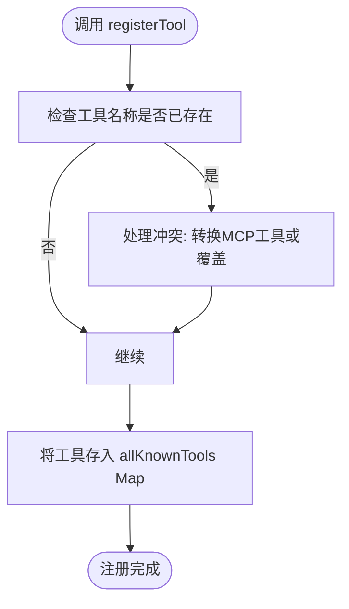
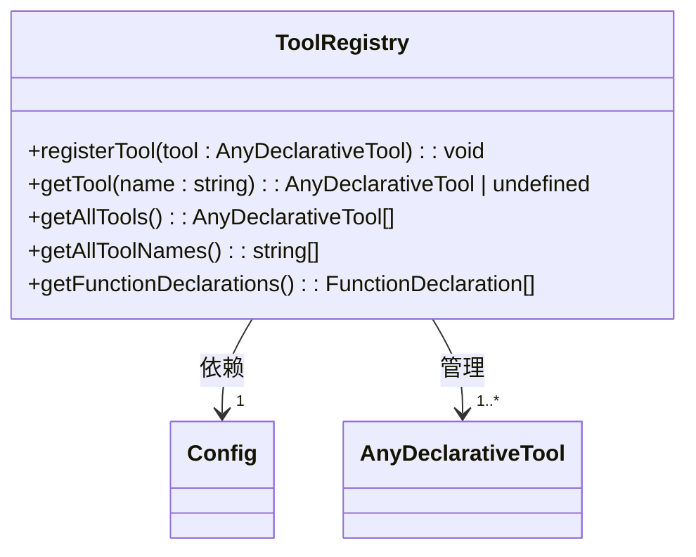
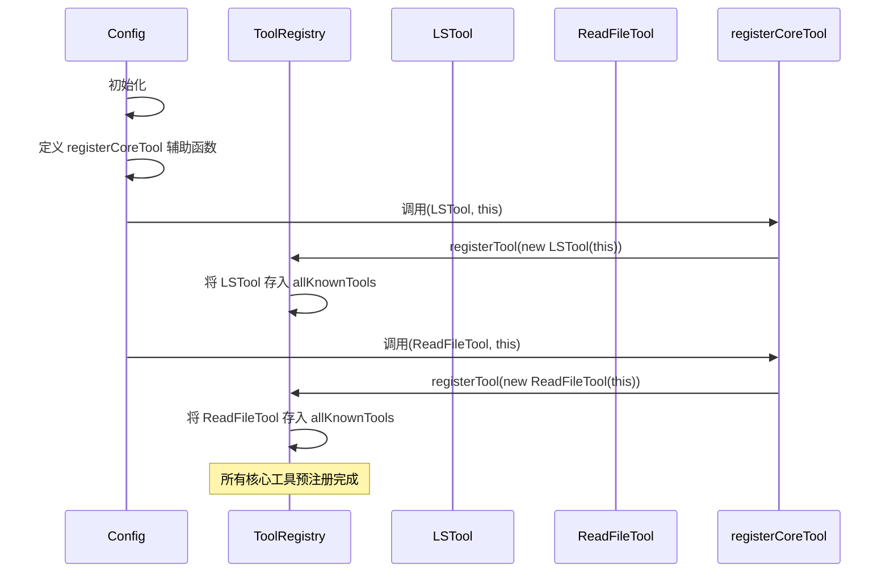

# 工具注册与管理

<cite>
**本文档引用的文件**   
- [tool-registry.ts](file://packages/core/src/tools/tool-registry.ts)
- [tools.ts](file://packages/core/src/tools/tools.ts)
- [modifiable-tool.ts](file://packages/core/src/tools/modifiable-tool.ts)
- [config.ts](file://packages/core/src/config/config.ts)
- [ls.ts](file://packages/core/src/tools/ls.ts)
- [read-file.ts](file://packages/core/src/tools/read-file.ts)
</cite>

## 目录

1. [引言](#引言)
2. [工具注册表单例设计](#工具注册表单例设计)
3. [工具抽象类与可修改工具接口](#工具抽象类与可修改工具接口)
4. [工具发现与预注册机制](#工具发现与预注册机制)
5. [创建自定义工具的分步教程](#创建自定义工具的分步教程)
6. [结论](#结论)

## 引言

本指南深入探讨Gemini
CLI中工具注册与管理系统的内部工作原理。我们将详细分析`ToolRegistry`单例的设计模式，阐述`Tool`抽象类和`ModifiableTool`接口的契约，并提供从零开始创建自定义工具的完整教程。通过本指南，您将全面理解该系统如何将工具能力安全、高效地集成到AI模型中。

## 工具注册表单例设计

`ToolRegistry`类是整个工具系统的核心，它采用单例模式来集中管理所有可用的工具。该类负责工具的注册、发现、查询和生命周期管理，确保系统中所有组件都能通过一个统一的入口访问工具。

### 内部数据结构

`ToolRegistry`使用一个`Map<string, AnyDeclarativeTool>`来存储所有已知的工具，键为工具名称，值为工具实例。这种设计保证了工具名称的唯一性，并提供了高效的查找性能。值得注意的是，即使被配置排除的工具也会被注册，这为在会话期间动态启用它们提供了可能。

**Section sources**

- [tool-registry.ts](file://packages/core/src/tools/tool-registry.ts#L190-L194)

### 核心方法的内部工作原理

`ToolRegistry`暴露了三个关键的公共方法，它们是与工具交互的主要接口。

#### `registerTool` 方法

此方法是向系统引入新工具的入口。当一个工具实例被传入时，`registerTool`首先检查该工具名称是否已存在。如果存在，对于`DiscoveredMCPTool`类型的工具，它会将其转换为全限定名工具以避免冲突；对于其他工具，则会记录一条警告日志并覆盖原有工具。最后，工具被安全地存入`allKnownTools`映射中。



**Diagram sources **

- [tool-registry.ts](file://packages/core/src/tools/tool-registry.ts#L218-L230)

#### `getTool` 方法

`getTool`方法根据提供的名称查找并返回一个工具实例。其内部逻辑不仅仅是简单的Map查找。它首先从`allKnownTools`中获取工具，然后通过`isActiveTool`私有方法检查该工具是否未被配置排除。只有同时满足“存在”和“激活”两个条件的工具才会被返回，这确保了查询结果的准确性。

**Section sources**

- [tool-registry.ts](file://packages/core/src/tools/tool-registry.ts#L524-L534)

#### `listTools` 方法

`listTools`功能由`getAllTools`和`getAllToolNames`等方法实现。`getAllTools`返回所有激活工具的数组，并按`displayName`进行字母排序，以提供一致的展示顺序。`getAllToolNames`则返回所有激活工具的名称列表。这两个方法都依赖于`getActiveTools`私有方法，该方法会过滤掉被`excludeTools`配置排除的工具。



**Diagram sources **

- [tool-registry.ts](file://packages/core/src/tools/tool-registry.ts#L498-L508)

## 工具抽象类与可修改工具接口

系统的工具契约由`DeclarativeTool`抽象类和`ModifiableDeclarativeTool`接口共同定义，它们为工具的实现提供了清晰的规范。

### `Tool` 抽象类的契约

`DeclarativeTool`是所有工具的基类，它定义了工具的核心契约。每个工具实例都必须提供以下关键属性：

- **name**: 工具的内部唯一标识符，用于API调用。
- **displayName**: 用户友好的显示名称。
- **description**: 工具功能的详细描述，供AI模型理解。
- **parameterSchema**: 一个JSON Schema，严格定义了工具接受的参数结构和类型。
- **isOutputMarkdown**: 布尔值，指示`returnDisplay`字段是否应渲染为Markdown。
- **canUpdateOutput**: 布尔值，指示工具是否支持流式输出。

`invoke`方法的签名通过`build`和`execute`方法的组合来实现。`build`方法接收原始参数，进行验证，并返回一个`ToolInvocation`对象。`execute`方法则在`ToolInvocation`上被调用，执行实际的业务逻辑。

**Section sources**

- [tools.ts](file://packages/core/src/tools/tools.ts#L302-L321)

### `parameters` 的JSON Schema验证机制

参数验证是确保系统安全的关键环节。`BaseDeclarativeTool`（`DeclarativeTool`的子类）的`validateToolParams`方法实现了双重验证：

1.  **JSON
    Schema验证**: 使用`SchemaValidator`对参数进行结构化验证，确保其符合`parameterSchema`的定义。
2.  **自定义逻辑验证**: 调用`validateToolParamValues`钩子方法，允许子类实现特定于业务的验证逻辑（例如，检查文件路径是否在工作区内）。

只有当这两层验证都通过时，`build`方法才会成功返回一个`ToolInvocation`实例，否则会抛出带有详细错误信息的异常。

```mermaid
flowchart TD
Start([调用 build(params)]) --> SchemaValidation["使用 SchemaValidator 验证参数结构"]
SchemaValidation --> |失败| ThrowError["抛出结构错误"]
SchemaValidation --> |成功| CustomValidation["调用 validateToolParamValues 进行自定义验证"]
CustomValidation --> |失败| ThrowError
CustomValidation --> |成功| CreateInvocation["创建并返回 ToolInvocation 实例"]
CreateInvocation --> End([验证通过])
```

**Diagram sources **

- [tools.ts](file://packages/core/src/tools/tools.ts#L444-L454)

### `description` 字段的元数据作用

`description`字段不仅仅是对工具功能的简单说明，它在系统中扮演着至关重要的元数据角色。当AI模型需要决定是否调用某个工具时，它会参考所有可用工具的`description`字段。因此，一个清晰、准确的描述能够极大地帮助模型理解工具的用途和适用场景，从而做出更明智的决策。此外，该描述也会在用户确认对话框中显示，为用户提供决策依据。

## 工具发现与预注册机制

系统通过多种机制来发现和注册工具，其中最核心的是在配置初始化时通过`config.ts`文件进行的预注册。

### `tools.ts`中的`BUILTIN_TOOLS`常量

虽然代码中没有直接名为`BUILTIN_TOOLS`的常量，但其功能由`config.ts`中的`registerCoreTool`辅助函数和一系列注册调用实现。该函数遍历所有核心工具类（如`LSTool`,
`ReadFileTool`），根据配置判断其是否启用，然后通过`registry.registerTool()`方法将它们注册到`ToolRegistry`中。



**Diagram sources **

- [config.ts](file://packages/core/src/config/config.ts#L1279-L1314)

### 工具发现过程

除了预注册的核心工具，系统还支持动态发现工具：

1.  **命令行发现**: 通过配置`tools.discoveryCommand`，系统可以执行一个外部命令，该命令输出一个包含工具定义的JSON数组。`ToolRegistry`会解析此输出并注册为`DiscoveredTool`。
2.  **MCP服务器发现**: 通过配置`mcpServers`，系统可以连接到一个或多个Model
    Context Protocol
    (MCP)服务器，发现并注册服务器提供的工具，这些工具被注册为`DiscoveredMCPTool`。

这些发现的工具与预注册工具一样，都存储在`allKnownTools`中，并通过相同的接口进行管理。

**Section sources**

- [tool-registry.ts](file://packages/core/src/tools/tool-registry.ts#L294-L423)

## 创建自定义工具的分步教程

本教程将指导您创建一个名为`HelloWorldTool`的自定义工具。

### 步骤1: 实现`Tool`子类

首先，创建一个新的TypeScript文件（例如`hello-world-tool.ts`），并实现一个继承自`BaseDeclarativeTool`的类。

```typescript
import {
  BaseDeclarativeTool,
  BaseToolInvocation,
  Kind,
  ToolResult,
} from '../tools/tools';
import type { Config } from '../config/config';

// 定义工具参数的接口
interface HelloWorldToolParams {
  name: string;
}

// 定义工具执行结果
interface HelloWorldResult {
  message: string;
}

// 工具执行的调用类
class HelloWorldToolInvocation extends BaseToolInvocation<
  HelloWorldToolParams,
  ToolResult
> {
  getDescription(): string {
    return `Say hello to ${this.params.name}`;
  }

  async execute(): Promise<ToolResult> {
    const message = `Hello, ${this.params.name}! Welcome to the Gemini CLI.`;
    return {
      llmContent: message,
      returnDisplay: message,
    };
  }
}

// 主工具类
export class HelloWorldTool extends BaseDeclarativeTool<
  HelloWorldToolParams,
  ToolResult
> {
  constructor(
    private config: Config,
    messageBus?: MessageBus,
  ) {
    super(
      'hello_world', // 工具名称
      'Hello World', // 显示名称
      'A simple tool that says hello to a given name.', // 描述
      Kind.Other, // 种类
      {
        type: 'object',
        properties: {
          name: {
            type: 'string',
            description: 'The name of the person to greet.',
          },
        },
        required: ['name'],
      }, // 参数的JSON Schema
      true, // isOutputMarkdown
      false, // canUpdateOutput
      messageBus,
    );
  }

  protected createInvocation(
    params: HelloWorldToolParams,
    messageBus?: MessageBus,
  ): ToolInvocation<HelloWorldToolParams, ToolResult> {
    return new HelloWorldToolInvocation(
      params,
      messageBus,
      this.name,
      this.displayName,
    );
  }
}
```

**Section sources**

- [ls.ts](file://packages/core/src/tools/ls.ts#L257-L345)
- [read-file.ts](file://packages/core/src/tools/read-file.ts#L144-L240)

### 步骤2: 注册到`ToolRegistry`

在您的配置初始化代码中（通常在`config.ts`或类似文件中），调用`registerTool`方法来注册您的新工具。

```typescript
// 在配置初始化的某个位置
const helloWorldTool = new HelloWorldTool(config);
registry.registerTool(helloWorldTool);
```

### 步骤3: 在会话中调用

一旦工具被注册，AI模型就可以根据用户的提示来调用它。例如，当用户输入“向张三问好”时，模型可能会生成一个函数调用请求：

```json
{
  "name": "hello_world",
  "args": {
    "name": "张三"
  }
}
```

`ToolRegistry`会查找`hello_world`工具，验证参数，创建`HelloWorldToolInvocation`实例并执行，最终将“Hello, 张三!
Welcome to the Gemini CLI.”作为结果返回给模型，由模型整合后呈现给用户。

## 结论

Gemini
CLI的工具注册与管理系统是一个设计精良、功能强大的架构。通过`ToolRegistry`单例，系统实现了对工具的集中化管理。`DeclarativeTool`和`ModifiableDeclarativeTool`等契约确保了工具实现的一致性和安全性。JSON
Schema验证机制为系统提供了强大的输入防护。通过预注册和动态发现机制，系统既保证了核心功能的稳定性，又具备了良好的扩展性。开发者可以遵循本文档的指导，轻松地创建和集成自定义工具，从而极大地扩展AI模型的能力边界。
