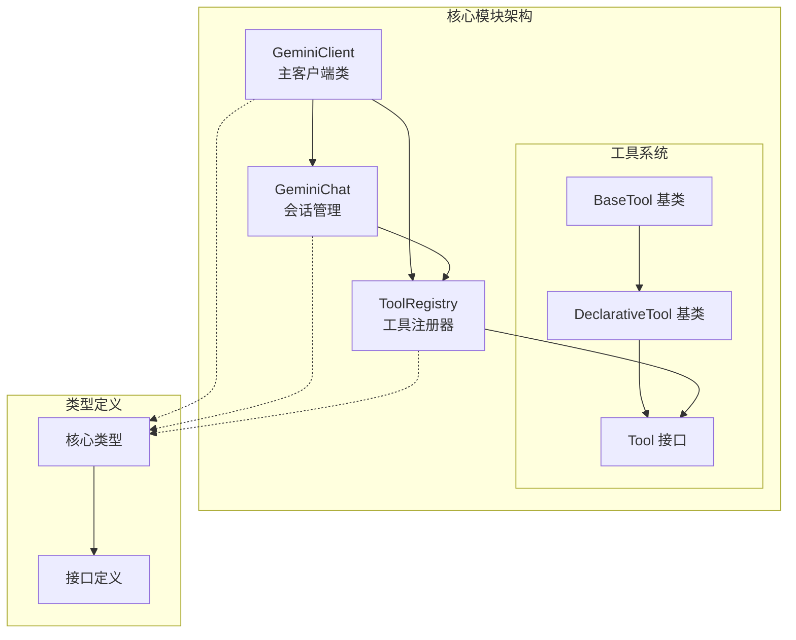
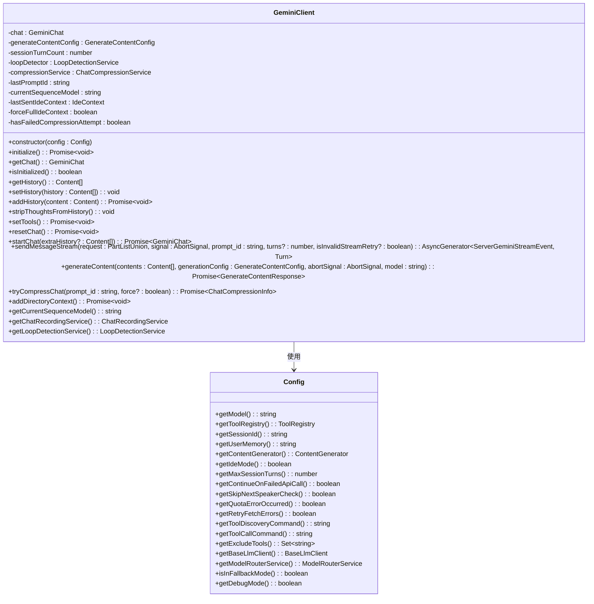
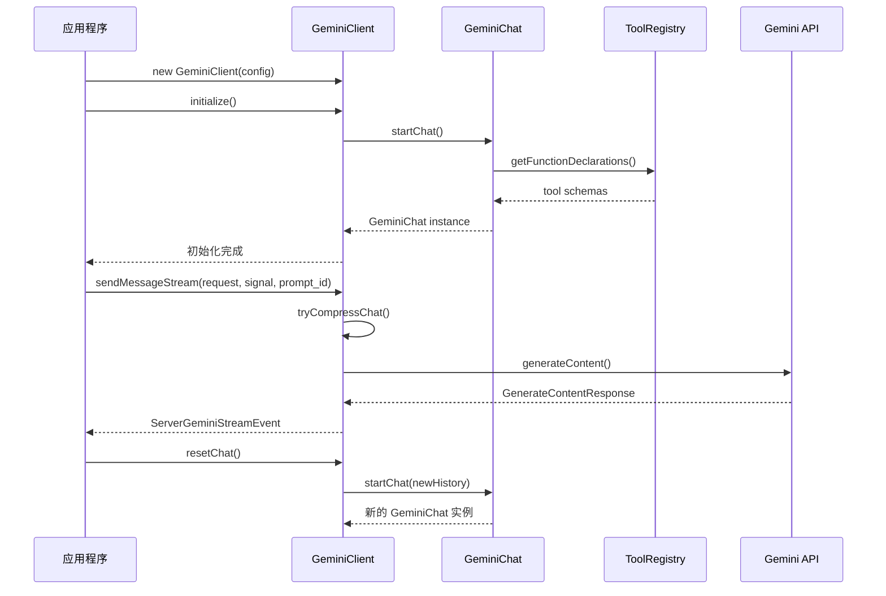
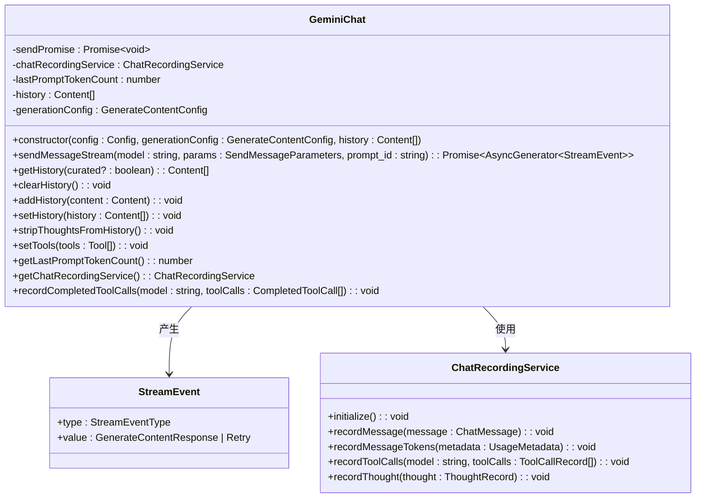
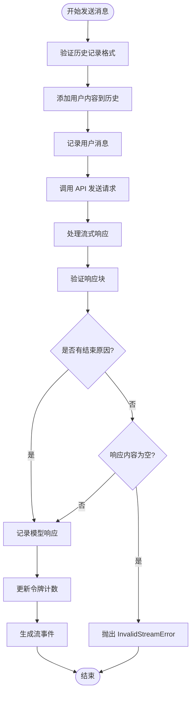
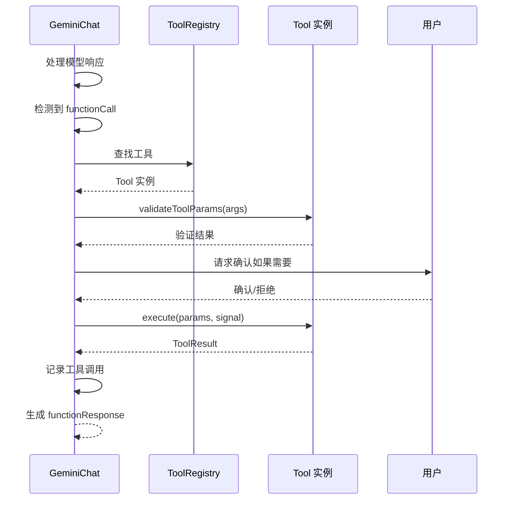
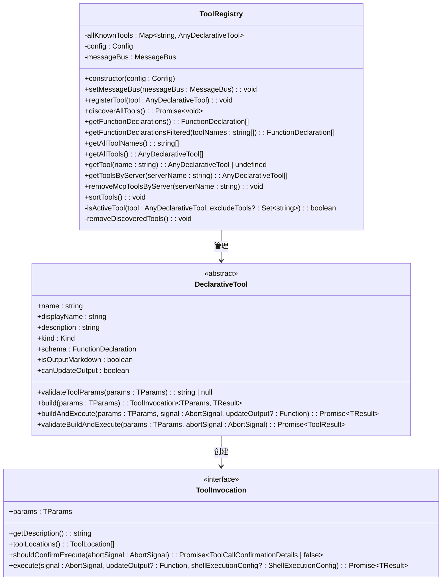
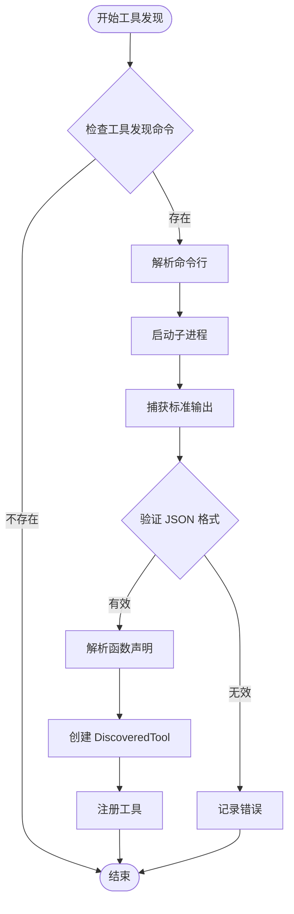
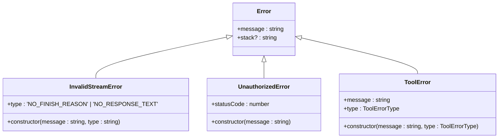

# 核心编程接口

<cite>
**本文档引用的文件**
- [client.ts](file://packages/core/src/core/client.ts)
- [geminiChat.ts](file://packages/core/src/core/geminiChat.ts)
- [tool-registry.ts](file://packages/core/src/tools/tool-registry.ts)
- [tools.ts](file://packages/core/src/tools/tools.ts)
- [turn.ts](file://packages/core/src/core/turn.ts)
</cite>

## 目录

1. [简介](#简介)
2. [项目结构概览](#项目结构概览)
3. [GeminiClient 类详解](#geminiclient-类详解)
4. [GeminiChat 会话对象](#geminichat-会话对象)
5. [工具注册与管理](#工具注册与管理)
6. [核心接口与类型](#核心接口与类型)
7. [使用示例](#使用示例)
8. [错误处理与异常](#错误处理与异常)
9. [最佳实践](#最佳实践)
10. [总结](#总结)

## 简介

gemini-cli 核心模块提供了强大的编程接口，支持与 Google
Gemini 模型进行交互。该系统包含三个主要组件：`GeminiClient`
客户端类、`GeminiChat` 会话对象和 `ToolRegistry`
工具注册器。这些组件协同工作，为开发者提供了灵活且可扩展的 AI 助手功能。

## 项目结构概览



**图表来源**

- [client.ts](file://packages/core/src/core/client.ts#L67-L692)
- [geminiChat.ts](file://packages/core/src/core/geminiChat.ts#L182-L649)
- [tool-registry.ts](file://packages/core/src/tools/tool-registry.ts#L189-L533)

## GeminiClient 类详解

`GeminiClient`
是 gemini-cli 的核心入口点，负责管理与 Gemini 模型的连接、会话状态和工具集成。

### 类定义与构造函数



**图表来源**

- [client.ts](file://packages/core/src/core/client.ts#L67-L692)

### 核心方法详解

#### 1. 初始化与配置

| 方法名            | 参数类型 | 返回类型        | 描述                           |
| ----------------- | -------- | --------------- | ------------------------------ |
| `initialize()`    | 无       | `Promise<void>` | 初始化客户端，创建初始聊天会话 |
| `isInitialized()` | 无       | `boolean`       | 检查客户端是否已初始化         |
| `resetChat()`     | 无       | `Promise<void>` | 重置当前聊天会话               |

#### 2. 会话管理

| 方法名                           | 参数类型    | 默认值 | 返回类型        | 描述                     |
| -------------------------------- | ----------- | ------ | --------------- | ------------------------ |
| `getHistory()`                   | 无          | -      | `Content[]`     | 获取完整对话历史记录     |
| `setHistory(history: Content[])` | `Content[]` | -      | `void`          | 设置新的对话历史记录     |
| `addHistory(content: Content)`   | `Content`   | -      | `Promise<void>` | 向历史记录添加新内容     |
| `stripThoughtsFromHistory()`     | 无          | -      | `void`          | 从历史记录中移除思考内容 |

#### 3. 工具集成

| 方法名                      | 参数类型 | 返回类型                            | 描述                       |
| --------------------------- | -------- | ----------------------------------- | -------------------------- |
| `setTools()`                | 无       | `Promise<void>`                     | 从配置中加载并设置可用工具 |
| `getChatRecordingService()` | 无       | `ChatRecordingService \| undefined` | 获取聊天记录服务实例       |

#### 4. 内容生成

| 方法名                                                                                                                              | 参数类型                                                      | 默认值         | 返回类型                                        | 描述                   |
| ----------------------------------------------------------------------------------------------------------------------------------- | ------------------------------------------------------------- | -------------- | ----------------------------------------------- | ---------------------- |
| `generateContent(contents: Content[], generationConfig: GenerateContentConfig, abortSignal: AbortSignal, model: string)`            | `Content[]`, `GenerateContentConfig`, `AbortSignal`, `string` | -              | `Promise<GenerateContentResponse>`              | 直接生成内容响应       |
| `sendMessageStream(request: PartListUnion, signal: AbortSignal, prompt_id: string, turns?: number, isInvalidStreamRetry?: boolean)` | `PartListUnion`, `AbortSignal`, `string`, `number`, `boolean` | `100`, `false` | `AsyncGenerator<ServerGeminiStreamEvent, Turn>` | 流式发送消息并接收响应 |

**章节来源**

- [client.ts](file://packages/core/src/core/client.ts#L102-L692)

### 生命周期管理



**图表来源**

- [client.ts](file://packages/core/src/core/client.ts#L102-L219)

## GeminiChat 会话对象

`GeminiChat` 类管理单个对话会话，处理消息传递、工具调用和状态维护。

### 类定义与核心功能



**图表来源**

- [geminiChat.ts](file://packages/core/src/core/geminiChat.ts#L182-L649)

### 会话交互模式

#### 消息流处理



**图表来源**

- [geminiChat.ts](file://packages/core/src/core/geminiChat.ts#L229-L346)

#### 工具调用流程



**图表来源**

- [geminiChat.ts](file://packages/core/src/core/geminiChat.ts#L466-L492)

**章节来源**

- [geminiChat.ts](file://packages/core/src/core/geminiChat.ts#L182-L649)

## 工具注册与管理

`ToolRegistry` 提供了完整的工具生命周期管理，包括注册、发现、验证和执行。

### 工具系统架构



**图表来源**

- [tool-registry.ts](file://packages/core/src/tools/tool-registry.ts#L189-L533)
- [tools.ts](file://packages/core/src/tools/tools.ts#L297-L442)

### 工具发现机制

#### 自动发现流程



**图表来源**

- [tool-registry.ts](file://packages/core/src/tools/tool-registry.ts#L294-L423)

#### 工具注册表操作

| 方法名                                                 | 参数类型             | 描述                       |
| ------------------------------------------------------ | -------------------- | -------------------------- |
| `registerTool(tool: AnyDeclarativeTool)`               | `AnyDeclarativeTool` | 注册单个工具到注册表       |
| `getFunctionDeclarations()`                            | 无                   | 获取所有活跃工具的函数声明 |
| `getFunctionDeclarationsFiltered(toolNames: string[])` | `string[]`           | 获取指定工具名称的函数声明 |
| `getAllTools()`                                        | 无                   | 获取所有活跃工具实例       |
| `getTool(name: string)`                                | `string`             | 根据名称获取特定工具       |

**章节来源**

- [tool-registry.ts](file://packages/core/src/tools/tool-registry.ts#L189-L533)

### 工具接口实现要求

#### BaseDeclarativeTool 基类

所有自定义工具必须继承 `BaseDeclarativeTool` 并实现以下方法：

```typescript
abstract class BaseDeclarativeTool<
  TParams extends object,
  TResult extends ToolResult,
> {
  // 必须实现的抽象方法
  protected abstract createInvocation(
    params: TParams,
    messageBus?: MessageBus,
    _toolName?: string,
    _toolDisplayName?: string,
  ): ToolInvocation<TParams, TResult>;

  // 可选的验证方法
  protected validateToolParamValues(params: TParams): string | null {
    return null;
  }
}
```

#### Tool 接口规范

```typescript
interface ToolResult {
  llmContent: PartListUnion; // 用于 LLM 历史记录的内容
  returnDisplay: ToolResultDisplay; // 用户友好的显示内容
  error?: {
    message: string; // 错误消息
    type?: ToolErrorType; // 错误类型
  };
}
```

**章节来源**

- [tools.ts](file://packages/core/src/tools/tools.ts#L489-L512)

## 核心接口与类型

### 主要类型定义

#### GenerateContentConfig

| 属性名           | 类型             | 默认值      | 描述                 |
| ---------------- | ---------------- | ----------- | -------------------- |
| `temperature`    | `number`         | `0`         | 控制生成内容的随机性 |
| `topP`           | `number`         | `1`         | 核采样参数           |
| `thinkingConfig` | `ThinkingConfig` | `undefined` | 思考模式配置         |
| `abortSignal`    | `AbortSignal`    | `undefined` | 中止信号             |

#### Content 结构

```typescript
interface Content {
  role: 'user' | 'model';
  parts: Part[];
}

interface Part {
  text?: string;
  functionCall?: FunctionCall;
  functionResponse?: FunctionResponse;
  inlineData?: BlobPart;
  fileData?: FileData;
  thought?: string; // 思考内容（仅内部使用）
}
```

#### ServerGeminiStreamEvent

| 事件类型           | 值类型                    | 描述               |
| ------------------ | ------------------------- | ------------------ |
| `Content`          | `string`                  | 模型生成的文本内容 |
| `ToolCallRequest`  | `ToolCallRequestInfo`     | 工具调用请求       |
| `ToolCallResponse` | `ToolCallResponseInfo`    | 工具调用响应       |
| `Error`            | `GeminErrorEventValue`    | 错误事件           |
| `Finished`         | `GeminFinishedEventValue` | 对话完成事件       |
| `Thought`          | `ThoughtSummary`          | 思考过程           |

**章节来源**

- [turn.ts](file://packages/core/src/core/turn.ts#L49-L215)

## 使用示例

### 基础客户端使用

```typescript
import { GeminiClient, Config } from 'packages/core';

// 创建配置
const config = new Config({
  // 配置选项...
});

// 实例化客户端
const client = new GeminiClient(config);

// 初始化
await client.initialize();

// 发送消息
const stream = client.sendMessageStream(
  [{ text: '你好，请介绍一下自己' }],
  new AbortSignal(),
  'session-123',
);

for await (const event of stream) {
  switch (event.type) {
    case 'content':
      console.log('模型回复:', event.value);
      break;
    case 'tool_call_request':
      console.log('需要调用工具:', event.value.name);
      break;
  }
}
```

### 自定义工具开发

```typescript
import { BaseDeclarativeTool, ToolInvocation, ToolResult } from 'packages/core';

class CustomTool extends BaseDeclarativeTool<{ input: string }, ToolResult> {
  constructor() {
    super(
      'custom_tool',
      '自定义工具',
      '这是一个演示自定义工具的示例',
      'other',
      {
        type: 'object',
        properties: {
          input: {
            type: 'string',
            description: '输入参数',
          },
        },
        required: ['input'],
      },
    );
  }

  protected createInvocation(
    params: { input: string },
    messageBus?: MessageBus,
    _toolName?: string,
    _toolDisplayName?: string,
  ): ToolInvocation<{ input: string }, ToolResult> {
    return {
      params,
      getDescription: () => `执行自定义操作: ${params.input}`,
      toolLocations: () => [],
      shouldConfirmExecute: async () => false,
      execute: async (signal) => {
        // 执行工具逻辑
        return {
          llmContent: `处理结果: ${params.input}`,
          returnDisplay: `✅ 处理完成: ${params.input}`,
        };
      },
    };
  }
}

// 注册工具
const registry = config.getToolRegistry();
registry.registerTool(new CustomTool());
```

### 工具发现配置

```json
{
  "tools": {
    "discoveryCommand": "node ./tools/discover.js",
    "callCommand": "node ./tools/call.js"
  }
}
```

## 错误处理与异常

### 异常类型层次



**图表来源**

- [geminiChat.ts](file://packages/core/src/core/geminiChat.ts#L166-L174)

### 错误处理策略

#### 流式响应错误处理

```typescript
try {
  const stream = client.sendMessageStream(request, signal, promptId);

  for await (const event of stream) {
    if (event.type === 'error') {
      console.error('API 错误:', event.value.error.message);
      // 实现重试逻辑
    } else if (event.type === 'invalid_stream') {
      console.warn('无效流响应，尝试重新生成');
      // 重新发送请求
    }
  }
} catch (error) {
  if (error instanceof InvalidStreamError) {
    console.error('流验证失败:', error.type);
  }
}
```

#### 工具执行错误处理

```typescript
try {
  const result = await tool.execute(params, signal);

  if (result.error) {
    console.error('工具执行失败:', result.error.message);
    // 根据错误类型采取不同措施
  }
} catch (error) {
  console.error('工具执行异常:', error.message);
}
```

**章节来源**

- [geminiChat.ts](file://packages/core/src/core/geminiChat.ts#L300-L346)

## 最佳实践

### 1. 客户端管理

- **单例模式**: 每个应用应该只维护一个 `GeminiClient` 实例
- **资源清理**: 使用 `AbortSignal` 正确取消长时间运行的操作
- **状态同步**: 在并发访问时确保线程安全

### 2. 工具开发

- **参数验证**: 在 `validateToolParams` 中严格验证输入参数
- **错误处理**: 提供清晰的错误信息和适当的错误类型
- **安全性**: 对文件系统和网络操作实施适当的安全限制

### 3. 性能优化

- **会话压缩**: 利用 `tryCompressChat` 减少上下文大小
- **工具缓存**: 缓存频繁使用的工具实例
- **流式处理**: 使用流式 API 处理大型响应

### 4. 安全考虑

- **权限控制**: 实施细粒度的工具访问控制
- **输入验证**: 对所有用户输入进行严格验证
- **沙箱隔离**: 在受限环境中执行危险操作

## 总结

gemini-cli 核心模块提供了完整而灵活的编程接口，支持：

1. **强大的客户端管理**: `GeminiClient` 提供了完整的会话管理和工具集成
2. **灵活的会话处理**: `GeminiChat` 支持流式通信和复杂的工具调用
3. **可扩展的工具系统**: `ToolRegistry` 支持动态发现和注册自定义工具
4. **完善的类型系统**: 提供强类型的接口定义和错误处理

通过合理使用这些接口，开发者可以构建功能丰富、性能优异的 AI 助手应用。系统的模块化设计确保了良好的可维护性和扩展性，同时内置的安全机制保护了用户环境的安全。
