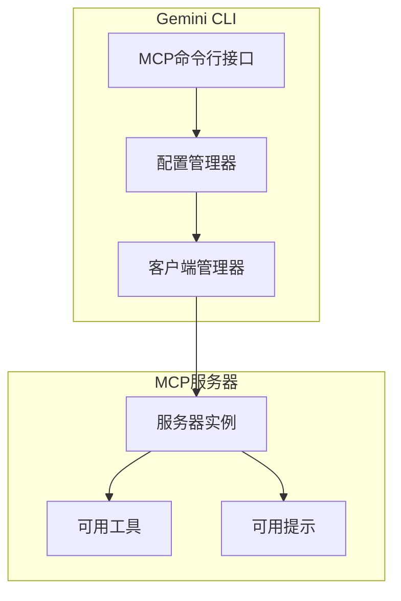
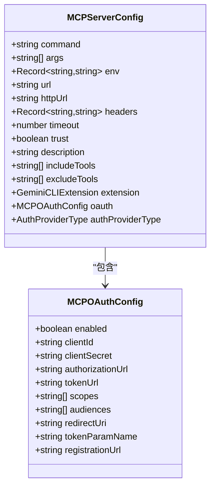
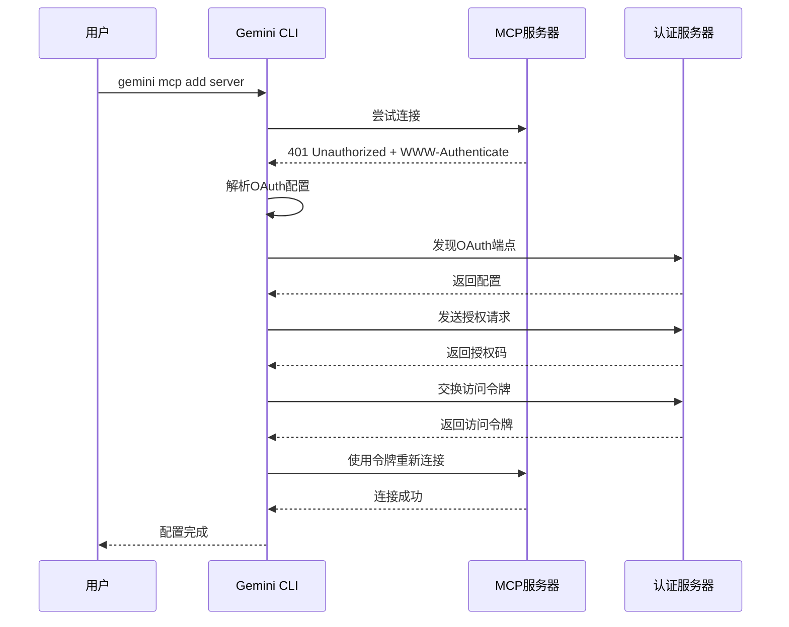
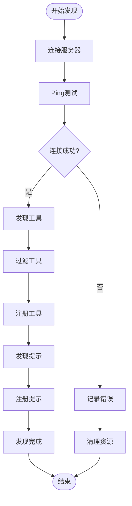
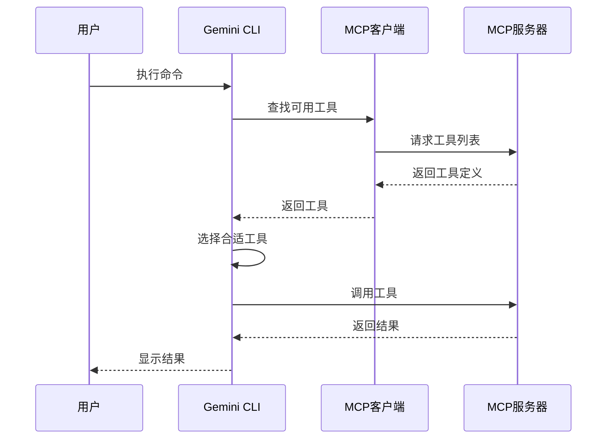

# MCP服务器管理命令

<cite>
**本文档中引用的文件**
- [packages/cli/src/commands/mcp.ts](file://packages/cli/src/commands/mcp.ts)
- [packages/cli/src/commands/mcp/add.ts](file://packages/cli/src/commands/mcp/add.ts)
- [packages/cli/src/commands/mcp/list.ts](file://packages/cli/src/commands/mcp/list.ts)
- [packages/cli/src/commands/mcp/remove.ts](file://packages/cli/src/commands/mcp/remove.ts)
- [packages/core/src/tools/mcp-client.ts](file://packages/core/src/tools/mcp-client.ts)
- [packages/core/src/config/config.ts](file://packages/core/src/config/config.ts)
- [packages/core/src/mcp/oauth-provider.ts](file://packages/core/src/mcp/oauth-provider.ts)
- [packages/cli/src/config/settings.ts](file://packages/cli/src/config/settings.ts)
- [packages/core/src/tools/mcp-client-manager.ts](file://packages/core/src/tools/mcp-client-manager.ts)
- [integration-tests/simple-mcp-server.test.ts](file://integration-tests/simple-mcp-server.test.ts)
</cite>

## 目录

1. [简介](#简介)
2. [MCP协议概述](#mcp协议概述)
3. [MCP服务器管理命令](#mcp服务器管理命令)
4. [MCP服务器配置详解](#mcp服务器配置详解)
5. [认证流程](#认证流程)
6. [服务器发现机制](#服务器发现机制)
7. [工具调用过程](#工具调用过程)
8. [配置示例](#配置示例)
9. [故障排除](#故障排除)
10. [最佳实践](#最佳实践)

## 简介

MCP（Model Context Protocol）是Gemini
CLI中的重要功能，允许用户连接外部服务器以扩展工具和提示功能。通过`gemini mcp`系列命令，用户可以轻松管理MCP服务器，包括添加、列出和移除服务器。

## MCP协议概述

MCP协议是一个标准化的通信协议，用于在AI助手和外部服务之间建立连接。它支持多种传输方式和认证机制，为开发者提供了灵活的集成选项。

### 核心特性

- **多传输支持**：支持STDIO、SSE（Server-Sent Events）和HTTP传输
- **认证机制**：内置OAuth 2.0支持，支持多种认证提供商
- **工具发现**：自动发现和注册可用的工具
- **安全隔离**：支持沙箱环境下的安全通信



**图表来源**

- [packages/cli/src/commands/mcp.ts](file://packages/cli/src/commands/mcp.ts#L1-L28)
- [packages/core/src/tools/mcp-client-manager.ts](file://packages/core/src/tools/mcp-client-manager.ts#L1-L50)

## MCP服务器管理命令

### 命令结构

```bash
gemini mcp <command> [options]
```

支持的子命令：

- `add` - 添加新的MCP服务器
- `list` - 列出所有配置的MCP服务器
- `remove` - 移除指定的MCP服务器

### add命令

添加新的MCP服务器到配置中。

#### 语法

```bash
gemini mcp add <name> <commandOrUrl> [args...] [options]
```

#### 参数说明

| 参数           | 类型     | 必需 | 描述                               |
| -------------- | -------- | ---- | ---------------------------------- |
| `name`         | string   | 是   | 服务器名称，用于标识配置           |
| `commandOrUrl` | string   | 是   | STDIO传输的命令路径或网络传输的URL |
| `args`         | string[] | 否   | 传递给服务器的参数                 |

#### 选项

| 选项              | 别名 | 默认值    | 描述                            |
| ----------------- | ---- | --------- | ------------------------------- |
| `--scope`         | `-s` | `project` | 配置范围（user或project）       |
| `--transport`     | `-t` | `stdio`   | 传输类型（stdio、sse、http）    |
| `--env`           | `-e` | -         | 设置环境变量（格式：KEY=value） |
| `--header`        | `-H` | -         | 设置HTTP头（格式：Key:Value）   |
| `--timeout`       | -    | -         | 连接超时时间（毫秒）            |
| `--trust`         | -    | false     | 信任服务器（跳过工具调用确认）  |
| `--description`   | -    | -         | 服务器描述                      |
| `--include-tools` | -    | -         | 包含的工具列表（逗号分隔）      |
| `--exclude-tools` | -    | -         | 排除的工具列表（逗号分隔）      |

#### 使用示例

```bash
# 添加本地STDIO服务器
gemini mcp add my-server ./my-mcp-server --port 8080

# 添加HTTP服务器
gemini mcp add api-server https://api.example.com/mcp --transport http

# 添加带有认证的SSE服务器
gemini mcp add streaming-api wss://stream.example.com --transport sse \
  -H "Authorization: Bearer token123" \
  -H "X-API-Key: api-key-value"
```

**章节来源**

- [packages/cli/src/commands/mcp/add.ts](file://packages/cli/src/commands/mcp/add.ts#L1-L235)

### list命令

列出所有配置的MCP服务器及其状态。

#### 语法

```bash
gemini mcp list
```

#### 输出格式

```
✓ my-server: /path/to/server (stdio) - Connected
✗ api-server: https://api.example.com (http) - Disconnected
… streaming-api: wss://stream.example.com (sse) - Connecting
```

#### 状态指示器

- ✅ `✓` - 已连接
- ❌ `✗` - 已断开
- ⚙️ `…` - 正在连接

**章节来源**

- [packages/cli/src/commands/mcp/list.ts](file://packages/cli/src/commands/mcp/list.ts#L1-L150)

### remove命令

从配置中移除指定的MCP服务器。

#### 语法

```bash
gemini mcp remove <name> [options]
```

#### 参数

| 参数   | 类型   | 必需 | 描述               |
| ------ | ------ | ---- | ------------------ |
| `name` | string | 是   | 要移除的服务器名称 |

#### 选项

| 选项      | 别名 | 默认值    | 描述                      |
| --------- | ---- | --------- | ------------------------- |
| `--scope` | `-s` | `project` | 配置范围（user或project） |

#### 使用示例

```bash
# 移除项目级配置的服务器
gemini mcp remove old-server

# 移除用户级配置的服务器
gemini mcp remove global-server --scope user
```

**章节来源**

- [packages/cli/src/commands/mcp/remove.ts](file://packages/cli/src/commands/mcp/remove.ts#L1-L62)

## MCP服务器配置详解

### 配置结构

MCP服务器配置存储在Gemini CLI的设置文件中，支持用户级和项目级配置。



**图表来源**

- [packages/core/src/config/config.ts](file://packages/core/src/config/config.ts#L175-L200)
- [packages/core/src/mcp/oauth-provider.ts](file://packages/core/src/mcp/oauth-provider.ts#L25-L35)

### 传输类型

#### STDIO传输

最常用的传输方式，适用于本地可执行文件。

```typescript
// 配置示例
{
  command: "/path/to/mcp-server",
  args: ["--port", "8080"],
  env: {
    "NODE_ENV": "production",
    "API_KEY": "secret-key"
  },
  timeout: 5000
}
```

#### SSE传输

基于Server-Sent Events的实时通信。

```typescript
// 配置示例
{
  url: "wss://api.example.com/mcp",
  headers: {
    "Authorization": "Bearer token",
    "User-Agent": "Gemini-CLI"
  },
  timeout: 10000
}
```

#### HTTP传输

基于HTTP的请求-响应模式。

```typescript
// 配置示例
{
  httpUrl: "https://api.example.com/mcp/v1",
  headers: {
    "Content-Type": "application/json",
    "Accept": "application/json"
  },
  timeout: 15000
}
```

**章节来源**

- [packages/core/src/tools/mcp-client.ts](file://packages/core/src/tools/mcp-client.ts#L1271-L1326)

## 认证流程

### OAuth 2.0支持

Gemini CLI内置了完整的OAuth 2.0支持，包括自动发现和认证流程。



**图表来源**

- [packages/core/src/tools/mcp-client.ts](file://packages/core/src/tools/mcp-client.ts#L326-L395)
- [packages/core/src/mcp/oauth-provider.ts](file://packages/core/src/mcp/oauth-provider.ts#L700-L738)

### 自动OAuth发现

当服务器返回401状态码且包含`WWW-Authenticate`头时，Gemini
CLI会自动尝试发现OAuth配置：

1. **解析认证头**：提取资源元数据URI
2. **发现配置**：从服务器获取OAuth配置
3. **执行认证**：完成授权码流程
4. **存储令牌**：保存访问令牌供后续使用

### 手动OAuth配置

对于不支持自动发现的服务器，可以手动配置OAuth：

```bash
# 配置OAuth客户端
gemini mcp auth <server-name> \
  --client-id <client-id> \
  --client-secret <client-secret> \
  --authorization-url <auth-url> \
  --token-url <token-url>
```

**章节来源**

- [packages/core/src/tools/mcp-client.ts](file://packages/core/src/tools/mcp-client.ts#L968-L1080)

## 服务器发现机制

### 工具发现

MCP客户端会自动发现服务器提供的工具和提示：



**图表来源**

- [packages/core/src/tools/mcp-client.ts](file://packages/core/src/tools/mcp-client.ts#L511-L586)

### 提示发现

服务器可以提供可重用的提示模板：

```typescript
// 提示发现示例
{
  prompts: [
    {
      name: 'code-review',
      description: '代码审查提示',
      argumentsSchema: {
        type: 'object',
        properties: {
          code: { type: 'string' },
          language: { type: 'string' },
        },
      },
    },
  ];
}
```

### 工具过滤

支持基于名称的工具过滤：

```bash
# 只包含特定工具
gemini mcp add server ./server --include-tools "tool1,tool2"

# 排除特定工具
gemini mcp add server ./server --exclude-tools "tool3,tool4"
```

**章节来源**

- [packages/core/src/tools/mcp-client.ts](file://packages/core/src/tools/mcp-client.ts#L679-L719)

## 工具调用过程

### 调用流程



**图表来源**

- [packages/core/src/tools/mcp-client.ts](file://packages/core/src/tools/mcp-client.ts#L589-L669)

### 错误处理

MCP客户端实现了完善的错误处理机制：

1. **连接错误**：重试机制和超时处理
2. **认证错误**：自动重新认证
3. **工具错误**：详细的错误信息和回退策略
4. **网络错误**：智能重连和状态监控

### 信任机制

对于可信的服务器，可以跳过工具调用确认：

```bash
# 信任服务器，跳过确认
gemini mcp add trusted-server ./server --trust
```

**章节来源**

- [packages/core/src/tools/mcp-client.ts](file://packages/core/src/tools/mcp-client.ts#L1040-L1080)

## 配置示例

### 开发环境配置

```json
{
  "mcpServers": {
    "local-dev": {
      "command": "node",
      "args": ["./dev-server.js"],
      "env": {
        "NODE_ENV": "development",
        "PORT": "3000"
      },
      "timeout": 5000,
      "description": "本地开发服务器"
    }
  }
}
```

### 生产环境配置

```json
{
  "mcpServers": {
    "production-api": {
      "httpUrl": "https://api.production.com/mcp",
      "headers": {
        "Authorization": "Bearer ${PRODUCTION_API_TOKEN}",
        "User-Agent": "Gemini-CLI/1.0"
      },
      "timeout": 10000,
      "trust": false,
      "includeTools": ["data-query", "report-generation"]
    }
  }
}
```

### OAuth服务器配置

```json
{
  "mcpServers": {
    "oauth-server": {
      "url": "wss://oauth.example.com/mcp",
      "headers": {
        "Authorization": "Bearer ${OAUTH_ACCESS_TOKEN}"
      },
      "oauth": {
        "enabled": true,
        "clientId": "${OAUTH_CLIENT_ID}",
        "clientSecret": "${OAUTH_CLIENT_SECRET}",
        "scopes": ["read", "write"]
      }
    }
  }
}
```

### 多服务器配置

```json
{
  "mcpServers": {
    "database-tools": {
      "command": "./db-tools",
      "args": ["--host", "localhost", "--port", "5432"]
    },
    "api-client": {
      "httpUrl": "https://api.external.com/v1",
      "headers": {
        "X-API-Version": "v1"
      }
    },
    "streaming-service": {
      "url": "wss://stream.external.com",
      "timeout": 30000
    }
  }
}
```

**章节来源**

- [packages/core/src/config/config.ts](file://packages/core/src/config/config.ts#L175-L200)

## 故障排除

### 常见问题

#### 连接失败

**症状**：服务器显示为"Disconnected"

**解决方案**：

1. 检查服务器是否正在运行
2. 验证网络连接和防火墙设置
3. 确认端口和URL配置正确
4. 增加超时时间

```bash
# 增加超时时间
gemini mcp add server ./server --timeout 30000
```

#### 认证失败

**症状**：OAuth认证过程中断

**解决方案**：

1. 检查客户端凭据
2. 验证授权服务器可达性
3. 确认作用域配置正确

```bash
# 手动重新认证
gemini mcp auth server-name
```

#### 工具不可用

**症状**：服务器已连接但无可用工具

**解决方案**：

1. 检查服务器能力声明
2. 验证工具过滤配置
3. 确认服务器版本兼容性

### 调试技巧

启用调试模式获取详细日志：

```bash
# 设置调试环境变量
export DEBUG=gemini:mcp
export MCP_DEBUG=true

# 运行命令查看详细输出
gemini mcp list
```

### 日志分析

关键日志位置：

- **标准输出**：MCP服务器的标准输出
- **标准错误**：MCP服务器的错误输出
- **Gemini CLI日志**：CLI的调试日志

**章节来源**

- [packages/core/src/tools/mcp-client.ts](file://packages/core/src/tools/mcp-client.ts#L1143-L1191)

## 最佳实践

### 安全考虑

1. **最小权限原则**：只授予必要的工具访问权限
2. **定期轮换令牌**：使用刷新令牌保持长期连接
3. **网络隔离**：在受控环境中运行敏感服务器
4. **输入验证**：确保工具参数的安全性

### 性能优化

1. **合理超时设置**：根据服务器响应时间调整超时
2. **连接池管理**：避免频繁的连接/断开操作
3. **工具缓存**：利用工具发现结果的缓存机制
4. **并发控制**：限制同时进行的工具调用数量

### 配置管理

1. **版本控制**：将项目级配置纳入版本控制
2. **环境分离**：为不同环境使用不同的配置
3. **密钥管理**：使用环境变量存储敏感信息
4. **配置验证**：定期验证配置的有效性

### 监控和维护

1. **健康检查**：定期检查服务器状态
2. **性能监控**：跟踪工具调用的响应时间
3. **错误报告**：收集和分析错误信息
4. **更新策略**：及时更新服务器和客户端版本

通过遵循这些最佳实践，可以确保MCP服务器的稳定运行和最佳性能，同时保持系统的安全性和可维护性。
