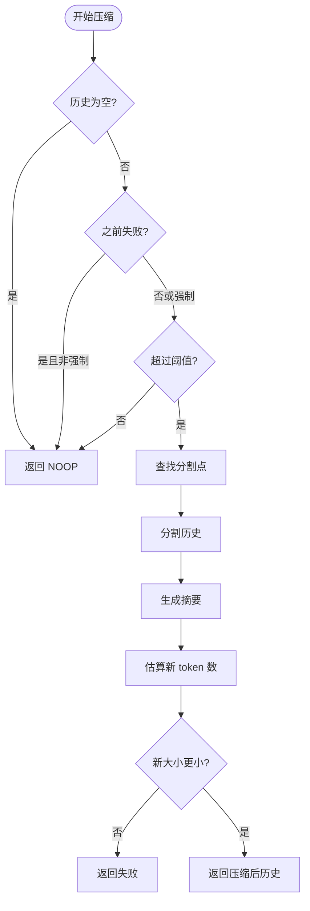

# 实用工具命令

<cite>
**本文档引用的文件**  
- [compressCommand.ts](file://packages/cli/src/ui/commands/compressCommand.ts)
- [aboutCommand.ts](file://packages/cli/src/ui/commands/aboutCommand.ts)
- [clearCommand.ts](file://packages/cli/src/ui/commands/clearCommand.ts)
- [helpCommand.ts](file://packages/cli/src/ui/commands/helpCommand.ts)
- [docsCommand.ts](file://packages/cli/src/ui/commands/docsCommand.ts)
- [chatCompressionService.ts](file://packages/core/src/services/chatCompressionService.ts)
- [types.ts](file://packages/cli/src/ui/commands/types.ts)
</cite>

## 目录

1. [简介](#简介)
2. [核心工具命令](#核心工具命令)
3. [上下文压缩算法详解](#上下文压缩算法详解)
4. [内联文档支持机制](#内联文档支持机制)
5. [最佳实践建议](#最佳实践建议)
6. [结论](#结论)

## 简介

Gemini
CLI 提供了一系列实用工具命令，旨在提升用户的工作效率和交互体验。这些命令涵盖了帮助、版本信息、文档访问、会话清理和上下文压缩等核心功能。本文档将详细说明每个工具命令的用途和使用场景，重点解析
`compress` 命令的上下文压缩算法和性能优化策略，并提供最佳实践建议。

## 核心工具命令

Gemini CLI 的实用工具命令通过内置的 `SlashCommand`
机制实现，为用户提供便捷的交互方式。以下是主要工具命令的详细说明：

### 帮助命令 (`help`)

`help`
命令是用户获取交互式帮助的主要入口。它通过触发 UI 组件显示基础使用指南，包括如何添加上下文（使用
`@` 符号）和执行 shell 命令（使用 `!` 符号）。该命令支持别名
`?`，方便用户快速访问。

**使用场景**：当用户不确定如何使用 CLI 或需要快速回顾基本语法时，输入 `/help`
可立即获得指导。

**Section sources**

- [helpCommand.ts](file://packages/cli/src/ui/commands/helpCommand.ts#L11-L25)
- [Help.tsx](file://packages/cli/src/ui/components/Help.tsx#L1-L61)

### 关于命令 (`about`)

`about`
命令用于显示当前环境的版本和配置信息。它收集并展示 CLI 版本、操作系统、沙箱环境、模型版本、认证类型、GCP 项目和 IDE 集成等关键信息。

**使用场景**：在调试问题或报告错误时，`/about`
命令提供的详细信息有助于快速定位环境相关的问题。

**Section sources**

- [aboutCommand.ts](file://packages/cli/src/ui/commands/aboutCommand.ts#L13-L47)

### 文档命令 (`docs`)

`docs` 命令用于打开完整的 Gemini
CLI 在线文档。它会尝试在用户的默认浏览器中打开官方文档 URL。在沙箱环境中，它会提供一个可复制的链接，确保功能的可用性。

**使用场景**：当用户需要查阅详细的配置选项、高级功能或 API 参考时，`/docs`
是最直接的访问方式。

**Section sources**

- [docsCommand.ts](file://packages/cli/src/ui/commands/docsCommand.ts#L16-L42)

### 退出命令 (`quit`)

`quit` 命令用于优雅地终止 CLI 会话。它通过返回特定的 `QuitActionReturn`
类型来通知主应用循环退出，确保所有清理操作（如会话数据保存）能够正确执行。

**使用场景**：完成工作后，使用 `/quit` 安全地关闭 CLI。

### 清屏命令 (`clear`)

`clear` 命令用于清除屏幕和对话历史。它会调用 `geminiClient.resetChat()`
来重置聊天状态，并清除 UI 显示，为用户提供一个干净的开始。

**使用场景**：当对话历史变得混乱或需要重新开始一个新任务时，`/clear`
命令非常有用。

**Section sources**

- [clearCommand.ts](file://packages/cli/src/ui/commands/clearCommand.ts#L10-L29)

### 上下文压缩命令 (`compress`)

`compress` 命令是优化长对话性能的核心工具。它通过调用 `ChatCompressionService`
将对话历史的早期部分压缩成一个摘要，从而减少发送给模型的 token 数量，提高响应速度并降低成本。

**使用场景**：在长时间的交互会话中，当感觉响应变慢或接近 token 限制时，使用
`/compress` 或其别名 `/summarize` 来优化上下文。

**Section sources**

- [compressCommand.ts](file://packages/cli/src/ui/commands/compressCommand.ts#L11-L81)

## 上下文压缩算法详解

`compress` 命令的核心是 `ChatCompressionService`
类，它实现了一套智能的上下文管理算法。

### 压缩决策逻辑

压缩服务首先评估当前对话历史的 token 数量。如果历史长度低于配置的阈值（默认为模型 token 限制的 20%），则不会执行压缩。此外，如果之前压缩尝试失败，除非强制执行，否则也不会再次尝试。

**Diagram sources**

- [chatCompressionService.ts](file://packages/core/src/services/chatCompressionService.ts#L78-L216)

**Section sources**

- [chatCompressionService.ts](file://packages/core/src/services/chatCompressionService.ts#L78-L216)

### 分割点选择算法

`findCompressSplitPoint`
函数是算法的关键。它根据字符数（作为 token 数的近似）来确定保留多少最新的对话。默认情况下，它会保留最近 30% 的对话内容，确保最新的上下文完整无损。分割点优先选择在用户消息之后，以保证对话的连贯性。

### 摘要生成与验证

服务将分割点之前的历史发送给模型，并附带一个系统指令（`getCompressionPrompt()`），要求模型生成一个包含所有必要信息的
`<state_snapshot>`。生成的摘要会与保留的最新历史合并，形成新的对话历史。系统会估算新历史的 token 数，只有当新历史比原历史更短时，压缩才会被应用，避免无效操作。

## 内联文档支持机制

`help` 和 `docs` 命令共同构成了 Gemini CLI 的内联文档支持体系。

### 交互式帮助 (`help`)

`help`
命令提供的是轻量级、即时的交互式帮助。它直接在 CLI 界面内渲染，无需离开当前工作环境。这种设计非常适合快速查询基本语法和快捷方式。

### 完整文档访问 (`docs`)

`docs`
命令则提供了通往完整、详尽文档的桥梁。它解决了 CLI 界面空间有限的问题，将用户引导至包含所有细节的在线资源。其智能处理沙箱环境的能力，确保了在各种部署场景下的可用性。

这种分层的文档策略平衡了即时性和完整性，为用户提供了最佳的文档体验。

## 最佳实践建议

为了最大化利用这些工具命令，建议遵循以下最佳实践：

1.  **定期使用 `/compress`**：在长时间的开发或调试会话中，养成定期使用
    `/compress` 的习惯。这可以防止 token 数量无限制增长，保持 CLI 的响应速度。
2.  **善用 `/help` 进行快速回顾**：不必记住所有命令，当需要时，`/help`
    是最快速的参考。
3.  **利用 `/about` 进行故障排除**：当遇到问题时，首先运行 `/about`
    并复制其输出，这能为技术支持提供关键的环境信息。
4.  **通过 `/docs` 深入学习**：要掌握高级功能和配置，应定期查阅完整的在线文档。
5.  **使用 `/clear` 重置上下文**：当对话偏离主题或变得混乱时，不要犹豫，使用
    `/clear` 重新开始。

## 结论

Gemini CLI 的实用工具命令是提升用户体验和效率的重要组成部分。从提供即时帮助的
`/help` 到优化性能的
`/compress`，每个命令都经过精心设计。理解这些命令的原理和最佳使用方式，将帮助用户更高效地利用 Gemini
CLI 完成复杂任务。
