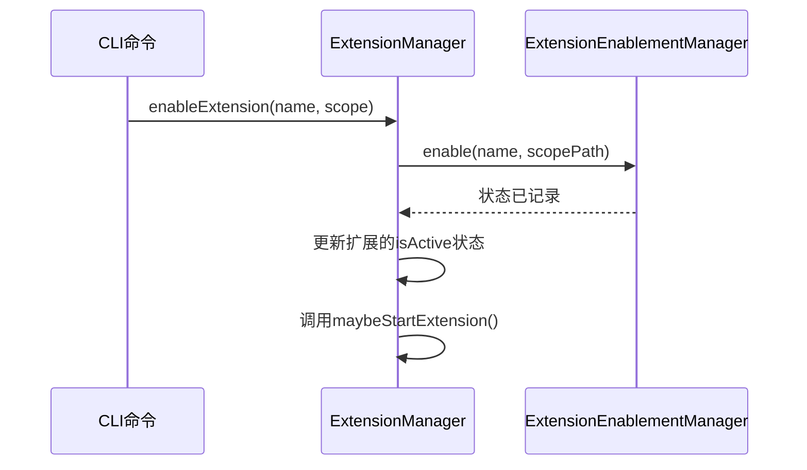

# 扩展管理命令

<cite>
**本文档中引用的文件**  
- [extensions.tsx](file://packages/cli/src/commands/extensions.tsx)
- [extension.ts](file://packages/cli/src/config/extension.ts)
- [extension-manager.ts](file://packages/cli/src/config/extension-manager.ts)
- [install.ts](file://packages/cli/src/commands/extensions/install.ts)
- [uninstall.ts](file://packages/cli/src/commands/extensions/uninstall.ts)
- [list.ts](file://packages/cli/src/commands/extensions/list.ts)
- [enable.ts](file://packages/cli/src/commands/extensions/enable.ts)
- [disable.ts](file://packages/cli/src/commands/extensions/disable.ts)
- [validate.ts](file://packages/cli/src/commands/extensions/validate.ts)
- [gemini-extension.json](file://hello/gemini-extension.json)
</cite>

## 目录

1. [简介](#简介)
2. [扩展管理命令概览](#扩展管理命令概览)
3. [安装扩展 (install)](#安装扩展-install)
4. [卸载扩展 (uninstall)](#卸载扩展-uninstall)
5. [列出扩展 (list)](#列出扩展-list)
6. [启用扩展 (enable)](#启用扩展-enable)
7. [禁用扩展 (disable)](#禁用扩展-disable)
8. [验证扩展 (validate)](#验证扩展-validate)
9. [扩展元数据与配置](#扩展元数据与配置)
10. [扩展安装流程](#扩展安装流程)
11. [状态管理与作用域](#状态管理与作用域)
12. [常见错误处理](#常见错误处理)

## 简介

Gemini
CLI 提供了一套强大的扩展管理命令，允许用户安装、卸载、启用、禁用和验证自定义扩展。这些扩展可以增强 CLI 的功能，例如添加新的 MCP（Model
Control Protocol）服务器或自定义命令。本文档详细介绍了 `gemini extensions`
命令下的所有子命令，包括其语法、参数、使用示例以及底层的配置和管理机制。

**Section sources**

- [extensions.tsx](file://packages/cli/src/commands/extensions.tsx)

## 扩展管理命令概览

`gemini extensions`
命令是管理所有扩展的入口点。它提供了一系列子命令来执行不同的操作。以下是所有可用子命令的列表：

- `install`: 从 Git 仓库 URL 或本地路径安装扩展。
- `uninstall`: 卸载已安装的扩展。
- `list`: 列出所有已安装的扩展及其状态。
- `enable`: 启用一个已禁用的扩展。
- `disable`: 禁用一个已启用的扩展。
- `validate`: 验证本地扩展目录的配置是否正确。

这些命令共同构成了一个完整的扩展生命周期管理工具。

**Section sources**

- [extensions.tsx](file://packages/cli/src/commands/extensions.tsx)

## 安装扩展 (install)

### 语法

```bash
gemini extensions install <source> [--ref <ref>] [--auto-update] [--pre-release] [--consent]
```

### 参数描述

- `<source>`: **（必需）** 扩展的源地址。可以是 GitHub 仓库的 URL（如
  `https://github.com/user/repo` 或
  `git@github.com:user/repo.git`），也可以是本地文件系统的路径。
- `--ref <ref>`: 指定要安装的 Git 引用，可以是分支名（如 `main`）、标签（如
  `v1.0.0`）或提交哈希。
- `--auto-update`: 启用此扩展的自动更新功能。当有新版本发布时，系统会自动更新。
- `--pre-release`: 允许安装预发布版本的扩展。
- `--consent`: 跳过安全风险确认提示，表示用户已同意安装。

### 使用示例

1.  **从 GitHub 安装最新版本:**

    ```bash
    gemini extensions install https://github.com/google/gemini-cli-example-extension
    ```

    系统会提示确认安全风险。

2.  **从 GitHub 安装特定版本并启用自动更新:**

    ```bash
    gemini extensions install https://github.com/google/gemini-cli-example-extension --ref v1.2.0 --auto-update
    ```

3.  **安装本地扩展并跳过确认:**
    ```bash
    gemini extensions install ./my-local-extension --consent
    ```

### 命令行输出示例

```
You are about to install an extension from an untrusted source. This extension can execute arbitrary code on your machine.
Do you trust the source and wish to continue? (y/N)
y
Extension "gemini-cli-example-extension" installed successfully and enabled.
```

**Section sources**

- [install.ts](file://packages/cli/src/commands/extensions/install.ts)

## 卸载扩展 (uninstall)

### 语法

```bash
gemini extensions uninstall <name>
```

### 参数描述

- `<name>`: **（必需）** 要卸载的扩展的名称或其源路径。

### 使用示例

```bash
gemini extensions uninstall gemini-cli-example-extension
```

### 命令行输出示例

```
Extension "gemini-cli-example-extension" successfully uninstalled.
```

**Section sources**

- [uninstall.ts](file://packages/cli/src/commands/extensions/uninstall.ts)

## 列出扩展 (list)

### 语法

```bash
gemini extensions list
```

### 参数描述

此命令没有额外的参数。

### 使用示例

```bash
gemini extensions list
```

### 命令行输出示例

```
✓ gemini-cli-example-extension (1.2.0)
 ID: a1b2c3d4...
 name: e5f6g7h8...
 Path: /Users/username/.gemini/extensions/gemini-cli-example-extension
 Source: https://github.com/google/gemini-cli-example-extension (Type: git)
 Ref: v1.2.0
 Enabled (User): true
 Enabled (Workspace): true
 MCP servers:
  example-server
```

**Section sources**

- [list.ts](file://packages/cli/src/commands/extensions/list.ts)

## 启用扩展 (enable)

### 语法

```bash
gemini extensions enable <name> [--scope <scope>]
```

### 参数描述

- `<name>`: **（必需）** 要启用的扩展名称。
- `--scope <scope>`: 启用的作用域。可选值为 `user`（用户级）或
  `workspace`（工作区级）。默认为 `user`。

### 使用示例

1.  **在用户级别启用扩展:**

    ```bash
    gemini extensions enable gemini-cli-example-extension
    ```

2.  **在工作区级别启用扩展:**
    ```bash
    gemini extensions enable gemini-cli-example-extension --scope workspace
    ```

### 命令行输出示例

```
Extension "gemini-cli-example-extension" successfully enabled in all scopes.
```

**Section sources**

- [enable.ts](file://packages/cli/src/commands/extensions/enable.ts)

## 禁用扩展 (disable)

### 语法

```bash
gemini extensions disable <name> [--scope <scope>]
```

### 参数描述

- `<name>`: **（必需）** 要禁用的扩展名称。
- `--scope <scope>`: 禁用的作用域。可选值为 `user`（用户级）或
  `workspace`（工作区级）。默认为 `user`。

### 使用示例

```bash
gemini extensions disable gemini-cli-example-extension --scope workspace
```

### 命令行输出示例

```
Extension "gemini-cli-example-extension" successfully disabled for scope "workspace".
```

**Section sources**

- [disable.ts](file://packages/cli/src/commands/extensions/disable.ts)

## 验证扩展 (validate)

### 语法

```bash
gemini extensions validate <path>
```

### 参数描述

- `<path>`: **（必需）** 要验证的本地扩展目录的路径。

### 使用示例

```bash
gemini extensions validate ./my-extension
```

### 命令行输出示例

```
Validation warnings:
  - Warning: Version '1.0' does not appear to be standard semver (e.g., 1.0.0).
Extension ./my-extension has been successfully validated.
```

**Section sources**

- [validate.ts](file://packages/cli/src/commands/extensions/validate.ts)

## 扩展元数据与配置

扩展的核心配置文件是 `gemini-extension.json`。该文件定义了扩展的基本信息和功能。

### 配置文件格式

```json
{
  "name": "my-extension",
  "version": "1.0.0",
  "mcpServers": {
    "my-server": {
      "command": "node",
      "args": ["server.js"]
    }
  },
  "contextFileName": "GEMINI.md",
  "excludeTools": ["read-file", "write-file"],
  "settings": [
    {
      "name": "API_KEY",
      "description": "Your API key for the service."
    }
  ]
}
```

### 元数据结构说明

- `name`: 扩展的唯一名称，只能包含字母、数字和连字符。
- `version`: 扩展的版本号，建议使用语义化版本（SemVer）。
- `mcpServers`: 定义扩展提供的 MCP 服务器，包括启动命令和参数。
- `contextFileName`: 指定扩展的上下文文件名，用于在提示中包含额外信息。
- `excludeTools`: 列出需要从核心工具中排除的工具名称。
- `settings`: 定义扩展所需的配置项，安装时会提示用户输入。

**Section sources**

- [extension.ts](file://packages/cli/src/config/extension.ts)
- [gemini-extension.json](file://hello/gemini-extension.json)

## 扩展安装流程

当执行 `install` 命令时，系统会遵循以下流程：

1.  **解析源地址**: 系统会判断 `<source>` 是一个 URL 还是本地路径。
2.  **工作区信任检查**: 如果源是远程的，系统会检查当前工作区是否受信任。如果不受信任，会提示用户进行确认。
3.  **创建临时目录**: 对于远程源，系统会创建一个临时目录来克隆代码。
4.  **下载源代码**: 使用 `git clone` 或下载 GitHub Release 的方式获取代码。
5.  **加载配置**: 读取目标目录中的 `gemini-extension.json` 文件，并验证其 `name`
    和 `version` 字段。
6.  **处理依赖和设置**: 如果扩展有配置项（`settings`），系统会提示用户输入值。
7.  **复制到安装目录**: 将扩展文件复制到用户主目录下的 `.gemini/extensions/`
    目录中。
8.  **记录安装元数据**: 创建一个 `install-metadata.json`
    文件，记录安装源、类型、引用等信息。
9.  **启用并加载**: 安装完成后，扩展会被默认启用并加载到运行时环境中。

**Section sources**

- [extension-manager.ts](file://packages/cli/src/config/extension-manager.ts)

## 状态管理与作用域

扩展的状态（启用/禁用）是通过 `ExtensionEnablementManager`
类进行管理的，并支持不同的作用域。

### 作用域类型

- **用户 (User)**: 状态对当前用户的所有项目生效。
- **工作区 (Workspace)**: 状态仅对当前工作目录（项目）生效。
- **会话 (Session)**: 状态仅在当前 CLI 会话中生效。

### 状态管理流程

- 当调用 `enable` 或 `disable` 命令时，`ExtensionManager` 会调用
  `ExtensionEnablementManager` 的相应方法。
- `ExtensionEnablementManager`
  会根据作用域将启用/禁用状态写入对应的配置文件或内存中。
- 在加载扩展时，`ExtensionManager` 会查询 `ExtensionEnablementManager`
  来确定扩展的 `isActive` 状态。



**Diagram sources**

- [extension-manager.ts](file://packages/cli/src/config/extension-manager.ts)
- [extensions/extensionEnablement.js](file://packages/cli/src/config/extensions/extensionEnablement.js)

**Section sources**

- [extension-manager.ts](file://packages/cli/src/config/extension-manager.ts)

## 常见错误处理

### 安装错误

- **`Extension is already installed`**: 尝试安装一个已存在的扩展。请先使用
  `uninstall` 命令卸载。
- **`Could not install extension because the current workspace at ... is not trusted`**: 工作区不受信任。在确认源安全后，同意信任提示即可。
- **`Configuration file not found at ...`**: 指定的源路径中缺少
  `gemini-extension.json` 文件。
- **`Invalid extension name`**: 扩展名称包含非法字符。请使用字母、数字和连字符。

### 卸载错误

- **`Extension not found`**: 指定的扩展名称未安装。请使用 `list`
  命令检查已安装的扩展。

### 验证错误

- **`The following context files ... are missing`**: `gemini-extension.json`
  中引用的上下文文件在目录中不存在。

**Section sources**

- [extension-manager.ts](file://packages/cli/src/config/extension-manager.ts)
- [install.ts](file://packages/cli/src/commands/extensions/install.ts)
- [uninstall.ts](file://packages/cli/src/commands/extensions/uninstall.ts)
- [validate.ts](file://packages/cli/src/commands/extensions/validate.ts)
