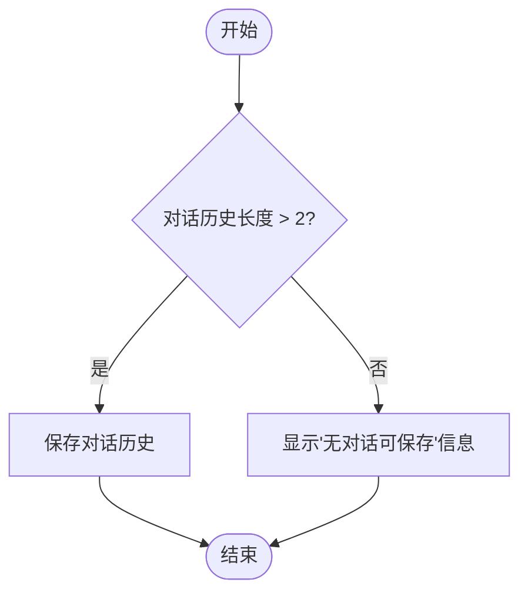
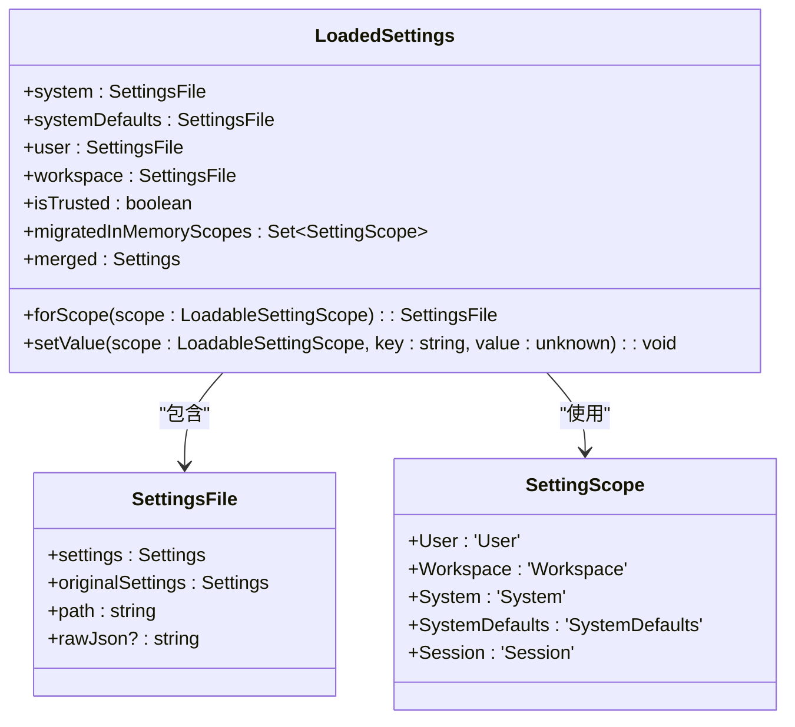
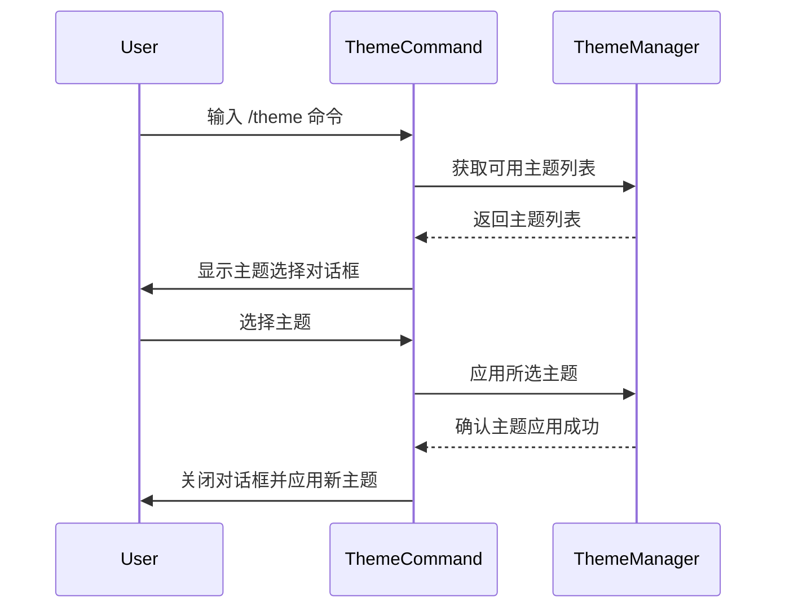
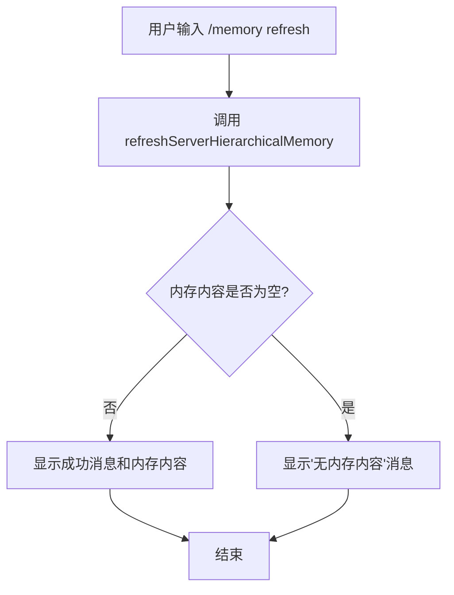
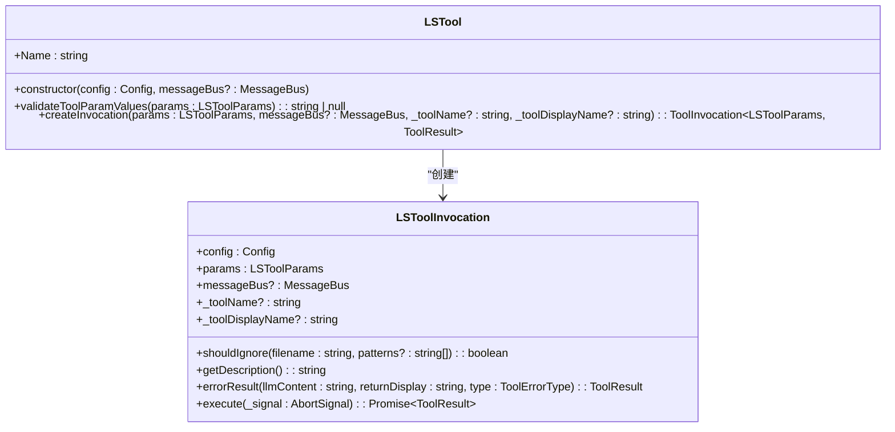

# 核心功能命令

<cite>
**本文档中引用的文件**   
- [settings.ts](file://packages/cli/src/config/settings.ts)
- [models.ts](file://packages/core/src/config/models.ts)
- [chatCommand.ts](file://packages/cli/src/ui/commands/chatCommand.ts)
- [modelCommand.ts](file://packages/cli/src/ui/commands/modelCommand.ts)
- [memoryCommand.ts](file://packages/cli/src/ui/commands/memoryCommand.ts)
- [themeCommand.ts](file://packages/cli/src/ui/commands/themeCommand.ts)
- [ls.ts](file://packages/core/src/tools/ls.ts)
- [settingsSchema.ts](file://packages/cli/src/config/settingsSchema.ts)
</cite>

## 目录

1. [介绍](#介绍)
2. [聊天交互](#聊天交互)
3. [模型选择](#模型选择)
4. [设置管理](#设置管理)
5. [主题切换](#主题切换)
6. [内存管理](#内存管理)
7. [目录浏览](#目录浏览)
8. [交互式会话示例](#交互式会话示例)

## 介绍

本文档详细介绍了 Gemini
CLI 的核心功能命令，涵盖聊天交互、模型选择、设置管理、主题切换、内存管理和目录浏览等主要功能。文档重点解释了
`chat` 命令的交互模式、上下文管理机制和消息流控制，描述了 `model`
命令如何切换不同的 Gemini 模型版本及其性能影响，并结合
`packages/cli/src/config/settings.ts` 文件说明了命令行设置与配置文件的交互关系。

**Section sources**

- [settings.ts](file://packages/cli/src/config/settings.ts#L1-L836)

## 聊天交互

`chat`
命令是管理对话历史的核心命令，提供了一系列子命令来保存、加载、列出和分享对话记录。该命令通过管理聊天历史的上下文，实现了对话的持久化和恢复功能。

`chat` 命令的子命令包括：

- `list`: 列出所有已保存的对话检查点。
- `save <tag>`: 将当前对话保存为一个检查点，需要提供一个标签。
- `resume <tag>`: 从指定标签的检查点恢复对话。
- `delete <tag>`: 删除指定标签的对话检查点。
- `share <file>`: 将当前对话分享到 Markdown 或 JSON 文件。

消息流控制通过 `resume`
命令实现，该命令在加载对话历史时会过滤掉系统提示信息，只恢复用户和模型之间的实际交互内容。上下文管理机制通过检查对话历史的长度来判断是否需要保存或分享对话，避免了空对话的处理。



**Diagram sources **

- [chatCommand.ts](file://packages/cli/src/ui/commands/chatCommand.ts#L83-L144)

**Section sources**

- [chatCommand.ts](file://packages/cli/src/ui/commands/chatCommand.ts#L1-L370)

## 模型选择

`model`
命令用于切换不同的 Gemini 模型版本，用户可以通过该命令选择最适合当前任务的模型。模型选择直接影响到性能和成本，不同的模型在推理速度、准确性和资源消耗方面有显著差异。

根据 `models.ts` 文件，Gemini CLI 支持以下模型：

- `gemini-2.5-pro`: 默认的 Pro 模型，适用于复杂的任务。
- `gemini-2.5-flash`: Flash 模型，适用于需要平衡速度和推理能力的任务。
- `gemini-2.5-flash-lite`: Flash-Lite 模型，适用于简单的快速任务。

当系统处于回退模式时，`getEffectiveModel`
函数会强制使用标准的回退模型，但会保留 "lite" 模型的请求，以确保成本节约。这种机制确保了 "pro" 模型总是被降级，而 "lite" 模型请求则被尊重。

```mermaid
graph TD
A[用户请求模型] --> B{是否处于回退模式?}
B --> |否| C[使用请求的模型]
B --> |是| D{请求的模型是否包含 "lite"?}
D --> |是| E[使用请求的 "lite" 模型]
D --> |否| F[使用默认的 Flash 回退模型]
```

**Diagram sources **

- [models.ts](file://packages/core/src/config/models.ts#L31-L48)

**Section sources**

- [models.ts](file://packages/core/src/config/models.ts#L1-L49)
- [modelCommand.ts](file://packages/cli/src/ui/commands/modelCommand.ts#L1-L18)

## 设置管理

设置管理通过 `settings.ts`
文件实现，该文件定义了用户、工作区、系统和系统默认设置的加载和合并逻辑。设置的优先级顺序为：系统默认 < 用户设置 < 工作区设置 < 系统设置（作为覆盖）。

`settings.ts` 文件中的 `MIGRATION_MAP`
对象定义了从 V1 到 V2 设置结构的迁移映射，确保了旧版本设置的兼容性。`mergeSettings`
函数使用 `customDeepMerge`
函数来合并不同作用域的设置，确保了设置的正确性和一致性。



**Diagram sources **

- [settings.ts](file://packages/cli/src/config/settings.ts#L426-L489)

**Section sources**

- [settings.ts](file://packages/cli/src/config/settings.ts#L1-L836)
- [settingsSchema.ts](file://packages/cli/src/config/settingsSchema.ts#L1-L1660)

## 主题切换

主题切换功能通过 `themeCommand.ts` 文件实现，允许用户更改界面主题。用户可以通过
`/theme` 命令打开主题选择对话框，选择内置主题或自定义主题。

`useThemeCommand`
钩子函数处理主题的选择和应用，确保所选主题存在于当前作用域的自定义主题或内置主题中。如果主题不存在，会显示错误信息并重新打开主题选择对话框。



**Diagram sources **

- [themeCommand.ts](file://packages/cli/src/ui/commands/themeCommand.ts#L1-L19)

**Section sources**

- [themeCommand.ts](file://packages/cli/src/ui/commands/themeCommand.ts#L1-L19)

## 内存管理

内存管理命令通过 `memoryCommand.ts`
文件实现，提供了查看、添加、刷新和列出内存内容的功能。`/memory show`
命令显示当前内存内容，`/memory add <text>`
命令将文本添加到内存，`/memory refresh` 命令从源文件刷新内存，`/memory list`
命令列出所有 GEMINI.md 文件的路径。

`refreshServerHierarchicalMemory`
函数负责刷新内存，它会从配置的工作目录中加载所有 GEMINI.md 文件的内容，并更新内存内容。该函数还处理了错误情况，如文件读取失败或内存为空的情况。



**Diagram sources **

- [memoryCommand.ts](file://packages/cli/src/ui/commands/memoryCommand.ts#L74-L87)

**Section sources**

- [memoryCommand.ts](file://packages/cli/src/ui/commands/memoryCommand.ts#L1-L138)

## 目录浏览

目录浏览功能通过 `ls` 工具实现，允许用户列出指定目录中的文件和子目录。`ls`
工具支持忽略模式，可以忽略匹配指定 glob 模式的条目。

`ls` 工具的参数包括：

- `dir_path`: 要列出的目录路径。
- `ignore`: 要忽略的 glob 模式列表。
- `file_filtering_options`: 是否尊重 .gitignore 或 .geminiignore 模式的选项。

`ls`
工具在执行时会检查路径是否在工作区目录内，如果是，则列出目录内容；否则，返回错误信息。目录内容按目录优先、然后按字母顺序排序。



**Diagram sources **

- [ls.ts](file://packages/core/src/tools/ls.ts#L257-L346)

**Section sources**

- [ls.ts](file://packages/core/src/tools/ls.ts#L1-L346)

## 交互式会话示例

以下是一个完整的交互式会话示例，展示了 `chat`、`model`、`memory` 和 `ls`
命令的完整工作流程：

1. 用户启动 Gemini CLI 并进入交互模式。
2. 用户输入 `/chat list` 查看所有已保存的对话检查点。
3. 用户输入 `/chat save my-session` 将当前对话保存为 "my-session" 检查点。
4. 用户输入 `/model` 打开模型选择对话框，选择 "Flash" 模型。
5. 用户输入 `/memory add "项目需求：实现用户认证功能"` 将项目需求添加到内存。
6. 用户输入 `/memory show` 查看当前内存内容。
7. 用户输入 `/ls .` 列出当前目录中的文件。
8. 用户输入 `/chat resume my-session` 从 "my-session" 检查点恢复对话。
9. 用户输入 `/chat share conversation.md` 将当前对话分享到 Markdown 文件。

这个示例展示了如何结合使用多个命令来管理对话、选择模型、管理内存和浏览目录，从而完成一个完整的开发任务。

**Section sources**

- [chatCommand.ts](file://packages/cli/src/ui/commands/chatCommand.ts#L1-L370)
- [modelCommand.ts](file://packages/cli/src/ui/commands/modelCommand.ts#L1-L18)
- [memoryCommand.ts](file://packages/cli/src/ui/commands/memoryCommand.ts#L1-L138)
- [ls.ts](file://packages/core/src/tools/ls.ts#L1-L346)
