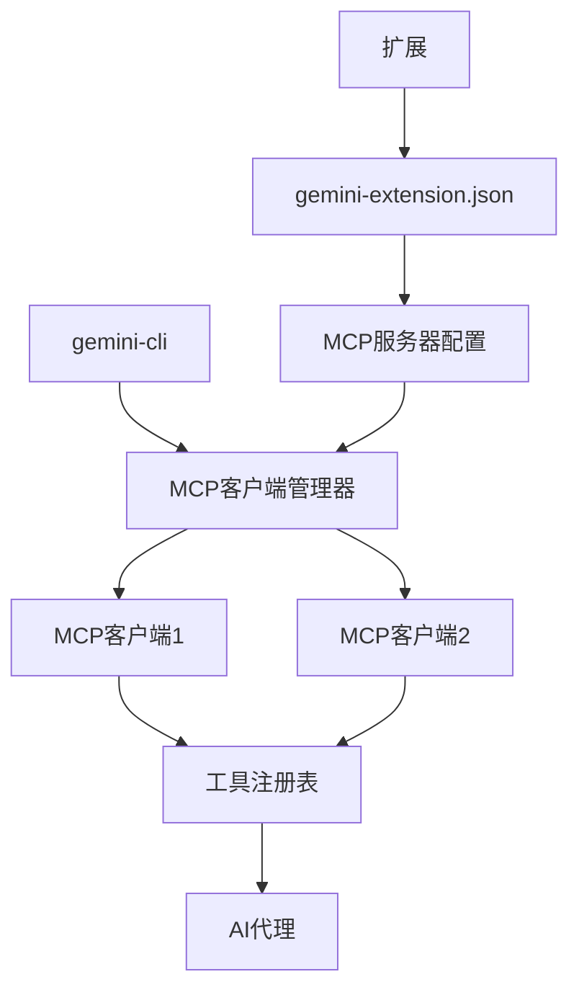
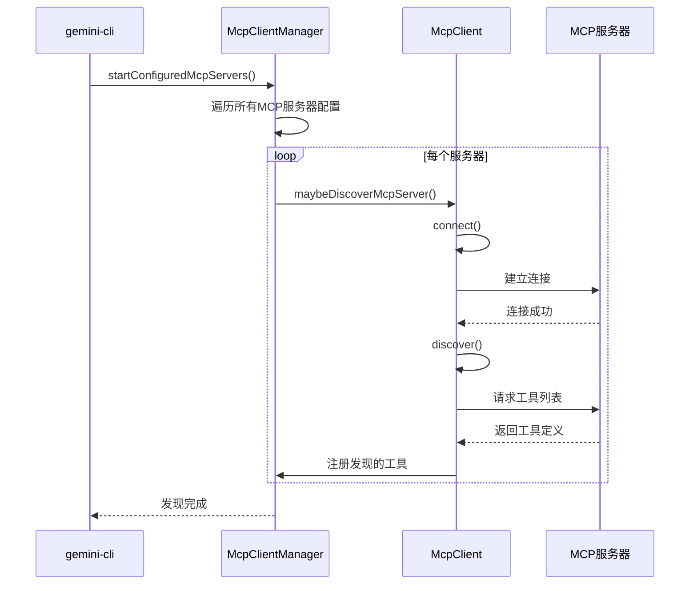
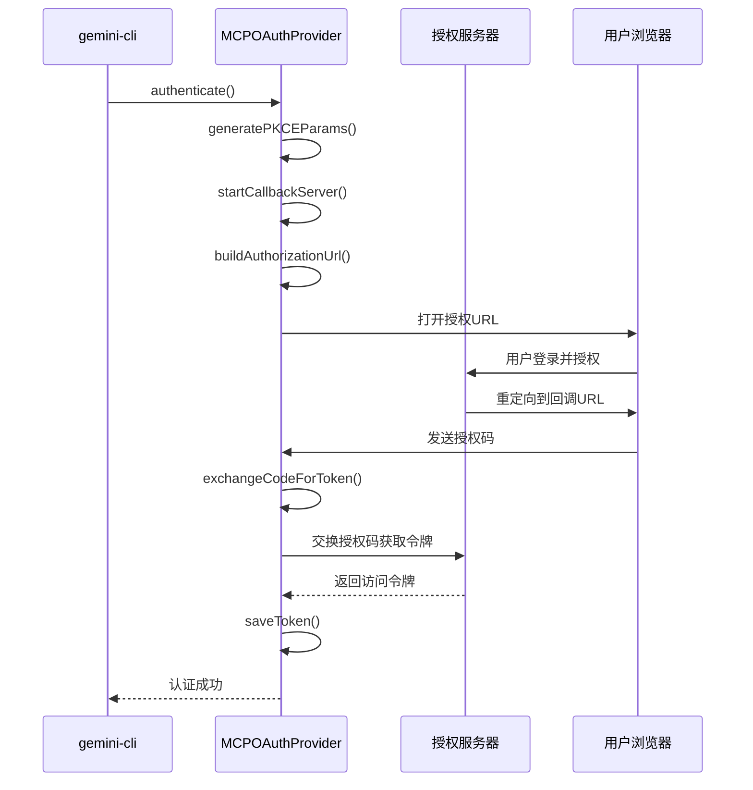
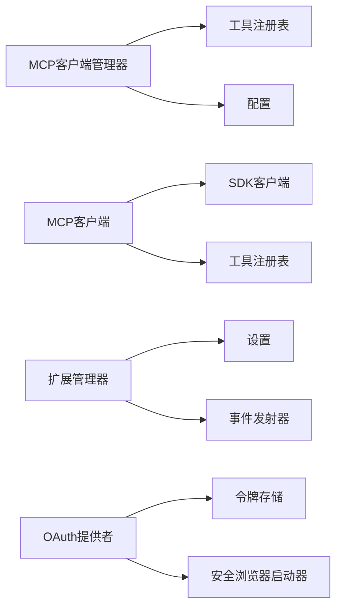

# MCP扩展系统

<cite>
**本文档中引用的文件**   
- [gemini-extension.json](file://hello/gemini-extension.json)
- [add.ts](file://packages/cli/src/commands/mcp/add.ts)
- [list.ts](file://packages/cli/src/commands/mcp/list.ts)
- [remove.ts](file://packages/cli/src/commands/mcp/remove.ts)
- [mcp-client-manager.ts](file://packages/core/src/tools/mcp-client-manager.ts)
- [mcp-client.ts](file://packages/core/src/tools/mcp-client.ts)
- [extension-manager.ts](file://packages/cli/src/config/extension-manager.ts)
- [config.ts](file://packages/core/src/config/config.ts)
- [mcp-tool.ts](file://packages/core/src/tools/mcp-tool.ts)
- [oauth-provider.ts](file://packages/core/src/mcp/oauth-provider.ts)
- [oauth-token-storage.ts](file://packages/core/src/mcp/oauth-token-storage.ts)
- [grep-code.toml](file://hello/commands/fs/grep-code.toml)
- [test-mcp-server.ts](file://integration-tests/test-mcp-server.ts)
</cite>

## 目录

1. [简介](#简介)
2. [MCP系统概述](#mcp系统概述)
3. [核心组件分析](#核心组件分析)
4. [MCP扩展开发指南](#mcp扩展开发指南)
5. [认证与安全](#认证与安全)
6. [工具调用协议与错误处理](#工具调用协议与错误处理)
7. [依赖关系分析](#依赖关系分析)

## 简介

MCP（Model Context
Protocol）扩展系统是gemini-cli的核心功能，它允许开发者通过定义工具和服务器来扩展AI代理的能力。该系统通过标准化的协议实现AI代理间的通信，使gemini-cli能够与各种外部服务和工具进行交互。本文档旨在为终端用户和扩展开发者提供关于MCP系统的权威指南，涵盖其概念、功能、发现、安装、管理和扩展开发的各个方面。

## MCP系统概述

MCP系统是gemini-cli的扩展框架，它通过`gemini-extension.json`清单文件定义扩展，并通过MCP服务器提供工具。系统支持多种传输方式（stdio,
sse,
http），允许开发者创建自定义命令和工具。MCP客户端管理器负责管理多个MCP客户端的生命周期，包括启动、停止和发现工具。该系统通过标准化的协议实现AI代理间的通信，使gemini-cli能够与各种外部服务和工具进行交互。



**Diagram sources**

- [mcp-client-manager.ts](file://packages/core/src/tools/mcp-client-manager.ts#L28-L327)
- [config.ts](file://packages/core/src/config/config.ts#L132-L143)

## 核心组件分析

### MCP客户端管理器

MCP客户端管理器（McpClientManager）是MCP系统的核心组件，负责管理多个MCP客户端的生命周期。它通过`startExtension`和`stopExtension`方法加载和卸载扩展，通过`maybeDiscoverMcpServer`方法发现和连接MCP服务器。管理器维护一个客户端映射，确保每个服务器只连接一次，并在配置更改时重新发现工具。

**Section sources**

- [mcp-client-manager.ts](file://packages/core/src/tools/mcp-client-manager.ts#L28-L327)

### MCP客户端

MCP客户端（McpClient）负责与单个MCP服务器的连接和交互。它通过`connect`方法建立连接，通过`discover`方法发现服务器提供的工具和提示，通过`disconnect`方法断开连接。客户端维护连接状态，并在连接失败时抛出异常。它使用`MCPServerStatus`枚举来跟踪服务器状态。

#### 连接与发现流程



**Diagram sources**

- [mcp-client.ts](file://packages/core/src/tools/mcp-client.ts#L87-L217)
- [mcp-client-manager.ts](file://packages/core/src/tools/mcp-client-manager.ts#L132-L229)

### 扩展管理器

扩展管理器（ExtensionManager）负责管理gemini-cli的扩展。它通过`loadExtensions`方法加载所有已安装的扩展，通过`installOrUpdateExtension`方法安装或更新扩展，通过`uninstallExtension`方法卸载扩展。管理器还处理扩展的启用和禁用，并在加载扩展时启动其MCP服务器。

**Section sources**

- [extension-manager.ts](file://packages/cli/src/config/extension-manager.ts#L75-L731)

## MCP扩展开发指南

### 创建MCP扩展

创建MCP扩展的第一步是编写`gemini-extension.json`清单文件。该文件定义了扩展的名称、版本和MCP服务器配置。以`hello/`目录中的示例为基础，一个基本的扩展清单文件如下：

```json
{
  "name": "custom-commands",
  "version": "1.0.0"
}
```

**Section sources**

- [gemini-extension.json](file://hello/gemini-extension.json#L1-L5)

### 定义工具

工具通过`.toml`文件定义，这些文件位于`commands`目录下。每个`.toml`文件定义了一个命令，包括其提示和执行逻辑。例如，`grep-code.toml`文件定义了一个搜索代码的命令：

```toml
prompt = """
Please summarize the findings for the pattern `{{args}}`.

Search Results:
!{grep -r {{args}} .}
"""
```

此命令使用`{{args}}`占位符来插入用户提供的参数，并使用`!{}`语法来执行shell命令。

**Section sources**

- [grep-code.toml](file://hello/commands/fs/grep-code.toml#L1-L7)

### 启动MCP服务器

MCP服务器可以通过`gemini mcp add`命令添加。该命令接受服务器名称、命令或URL以及各种选项。例如，要添加一个使用stdio传输的服务器：

```bash
gemini mcp add my-server ./my-server.js --transport stdio
```

要添加一个使用SSE传输的服务器：

```bash
gemini mcp add my-server http://localhost:8080 --transport sse
```

**Section sources**

- [add.ts](file://packages/cli/src/commands/mcp/add.ts#L12-L235)

### 管理MCP服务器

MCP服务器可以通过`gemini mcp`命令进行管理。`list`命令列出所有配置的服务器，`remove`命令移除服务器。

#### 列出服务器

```bash
gemini mcp list
```

此命令显示所有配置的MCP服务器，包括其名称、URL或命令、传输类型和连接状态。

#### 移除服务器

```bash
gemini mcp remove my-server
```

此命令从配置中移除指定的MCP服务器。

**Section sources**

- [list.ts](file://packages/cli/src/commands/mcp/list.ts#L8-L150)
- [remove.ts](file://packages/cli/src/commands/mcp/remove.ts#L8-L62)

## 认证与安全

### OAuth认证

MCP系统支持OAuth认证，通过`MCPOAuthProvider`类实现。该类处理OAuth授权码流程，包括生成PKCE参数、启动回调服务器、构建授权URL、交换授权码获取令牌。认证令牌存储在`MCPOAuthTokenStorage`中，支持加密存储。

#### OAuth流程



**Diagram sources**

- [oauth-provider.ts](file://packages/core/src/mcp/oauth-provider.ts#L99-L800)
- [oauth-token-storage.ts](file://packages/core/src/mcp/oauth-token-storage.ts#L26-L235)

### 令牌存储

OAuth令牌通过`MCPOAuthTokenStorage`类存储和管理。该类提供`saveToken`、`getCredentials`、`deleteCredentials`等方法来操作令牌。令牌存储在用户配置目录中，文件权限设置为600以确保安全。

**Section sources**

- [oauth-token-storage.ts](file://packages/core/src/mcp/oauth-token-storage.ts#L26-L235)

## 工具调用协议与错误处理

### 工具调用

MCP工具通过`DiscoveredMCPTool`类表示。当AI代理调用工具时，`DiscoveredMCPToolInvocation`执行实际的调用。调用过程包括参数验证、确认提示（如果需要）和实际的工具执行。工具执行结果被转换为标准格式返回给AI代理。

### 错误处理

MCP系统有完善的错误处理机制。在连接和发现过程中，任何错误都会被捕获并记录。工具执行中的错误通过`ToolResult`对象返回，包含错误消息和类型。系统还处理网络错误、认证错误和协议错误。

**Section sources**

- [mcp-tool.ts](file://packages/core/src/tools/mcp-tool.ts#L61-L213)

## 依赖关系分析

MCP系统依赖于多个核心组件和外部库。`@modelcontextprotocol/sdk`提供MCP协议的实现，`@google/genai`用于与Gemini
API交互，`yargs`用于命令行参数解析。系统内部组件之间有明确的依赖关系，如MCP客户端管理器依赖于工具注册表和配置对象。



**Diagram sources**

- [mcp-client-manager.ts](file://packages/core/src/tools/mcp-client-manager.ts#L28-L327)
- [mcp-client.ts](file://packages/core/src/tools/mcp-client.ts#L87-L217)
- [extension-manager.ts](file://packages/cli/src/config/extension-manager.ts#L75-L731)
- [oauth-provider.ts](file://packages/core/src/mcp/oauth-provider.ts#L99-L800)
- [oauth-token-storage.ts](file://packages/core/src/mcp/oauth-token-storage.ts#L26-L235)
