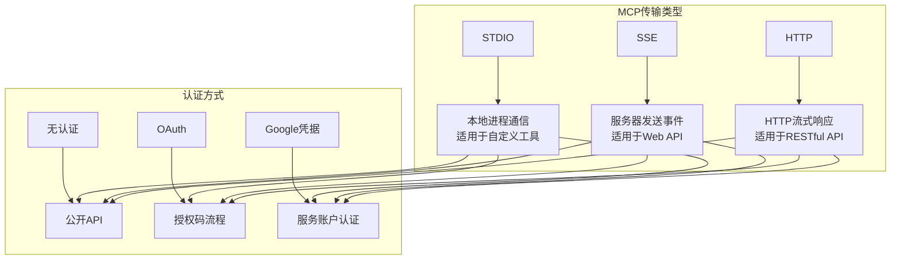
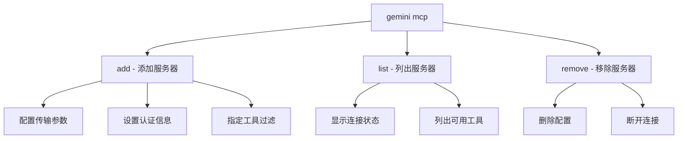
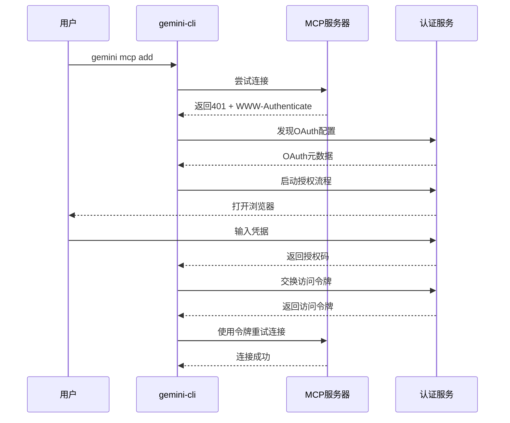

# 使用MCP扩展

<cite>
**本文档中引用的文件**
- [packages/cli/src/commands/mcp/add.ts](file://packages/cli/src/commands/mcp/add.ts)
- [packages/cli/src/commands/mcp/list.ts](file://packages/cli/src/commands/mcp/list.ts)
- [packages/cli/src/commands/mcp/remove.ts](file://packages/cli/src/commands/mcp/remove.ts)
- [packages/cli/src/commands/mcp.ts](file://packages/cli/src/commands/mcp.ts)
- [packages/core/src/tools/mcp-client.ts](file://packages/core/src/tools/mcp-client.ts)
- [packages/core/src/tools/mcp-tool.ts](file://packages/core/src/tools/mcp-tool.ts)
- [packages/core/src/tools/mcp-client-manager.ts](file://packages/core/src/tools/mcp-client-manager.ts)
- [packages/core/src/config/config.ts](file://packages/core/src/config/config.ts)
- [packages/core/src/mcp/oauth-provider.ts](file://packages/core/src/mcp/oauth-provider.ts)
- [packages/core/src/mcp/oauth-utils.ts](file://packages/core/src/mcp/oauth-utils.ts)
- [integration-tests/simple-mcp-server.test.ts](file://integration-tests/simple-mcp-server.test.ts)
- [integration-tests/test-mcp-server.ts](file://integration-tests/test-mcp-server.ts)
</cite>

## 目录

1. [简介](#简介)
2. [MCP服务器概念](#mcp服务器概念)
3. [MCP命令概览](#mcp命令概览)
4. [添加MCP服务器](#添加mcp服务器)
5. [列出和管理MCP服务器](#列出和管理mcp服务器)
6. [服务器连接和认证](#服务器连接和认证)
7. [端到端使用示例](#端到端使用示例)
8. [故障排除](#故障排除)
9. [最佳实践](#最佳实践)

## 简介

Model Context Protocol
(MCP) 扩展为 gemini-cli 提供了强大的功能扩展能力。通过MCP，您可以将外部工具和服务集成到聊天界面中，实现文件系统操作、数据查询、API调用等各种功能。本指南将详细介绍如何在 gemini-cli 中使用MCP扩展，包括添加服务器、管理配置以及解决常见问题。

## MCP服务器概念

### 什么是MCP服务器？

MCP服务器是一个遵循Model Context
Protocol标准的进程或服务，它向gemini-cli提供工具和提示词。每个MCP服务器可以：

- 提供可调用的工具函数
- 注册自定义提示词模板
- 处理文件系统访问请求
- 实现其他协议功能

### 支持的传输类型

gemini-cli支持三种主要的MCP传输类型：



**图表来源**

- [packages/core/src/tools/mcp-client.ts](file://packages/core/src/tools/mcp-client.ts#L1193-L1226)
- [packages/core/src/config/config.ts](file://packages/core/src/config/config.ts#L175-L200)

## MCP命令概览

gemini-cli提供了三个核心MCP命令来管理MCP服务器：



**图表来源**

- [packages/cli/src/commands/mcp.ts](file://packages/cli/src/commands/mcp.ts#L13-L27)

## 添加MCP服务器

### 基本语法

```bash
gemini mcp add <name> <commandOrUrl> [args...]
```

### 完整选项参考

| 选项              | 别名 | 类型    | 默认值  | 描述                                   |
| ----------------- | ---- | ------- | ------- | -------------------------------------- |
| `--scope`         | `-s` | string  | project | 配置范围 (user 或 project)             |
| `--transport`     | `-t` | string  | stdio   | 传输类型 (stdio, sse, http)            |
| `--env`           | `-e` | array   | -       | 设置环境变量 (如 -e KEY=value)         |
| `--header`        | `-H` | array   | -       | 设置HTTP头 (如 -H "X-Api-Key: abc123") |
| `--timeout`       | -    | number  | -       | 连接超时（毫秒）                       |
| `--trust`         | -    | boolean | false   | 信任服务器（跳过工具确认）             |
| `--description`   | -    | string  | -       | 服务器描述                             |
| `--include-tools` | -    | array   | -       | 包含的工具列表                         |
| `--exclude-tools` | -    | array   | -       | 排除的工具列表                         |

### 示例：添加本地工具服务器

```bash
# 添加简单的加法工具服务器
gemini mcp add addition-server node ./addition-tool.js

# 添加带参数的服务器
gemini mcp add file-tools python ./file-operations.py --config=config.json

# 添加带环境变量的服务器
gemini mcp add api-server curl -s -H "Authorization: Bearer $API_KEY" \
  --header "Content-Type: application/json"
```

### 示例：添加HTTP API服务器

```bash
# 添加REST API服务器
gemini mcp add weather-api https://api.weather.com/v1 \
  --transport http \
  --header "Authorization: Bearer YOUR_API_KEY" \
  --timeout 5000

# 添加SSE服务器
gemini mcp add streaming-data https://stream.example.com/data \
  --transport sse \
  --header "Accept: text/event-stream"
```

### 示例：添加需要认证的服务器

```bash
# 添加OAuth认证的服务器
gemini mcp add google-drive https://drive.googleapis.com \
  --transport http \
  --header "Authorization: Bearer TOKEN" \
  --trust

# 添加Google服务账户认证的服务器
gemini mcp add gcp-services https://cloud.google.com \
  --transport http \
  --trust
```

**节来源**

- [packages/cli/src/commands/mcp/add.ts](file://packages/cli/src/commands/mcp/add.ts#L137-L235)

## 列出和管理MCP服务器

### 查看所有配置的服务器

```bash
# 列出所有MCP服务器
gemini mcp list

# 输出示例：
# ✓ weather-api (http) - Connected
# ✗ file-tools (stdio) - Disconnected
# … streaming-data (sse) - Connecting
```

### 服务器状态指示器

| 状态   | 图标 | 含义                   |
| ------ | ---- | ---------------------- |
| 已连接 | ✓    | 服务器正常运行且可访问 |
| 连接中 | …    | 正在尝试建立连接       |
| 已断开 | ✗    | 连接失败或服务器不可用 |

### 过滤和搜索

```bash
# 只查看特定范围的服务器
gemini mcp list --scope user

# 查看服务器详细信息（通过配置文件）
cat ~/.config/gemini/settings.json | grep mcpServers
```

**节来源**

- [packages/cli/src/commands/mcp/list.ts](file://packages/cli/src/commands/mcp/list.ts#L93-L150)

## 服务器连接和认证

### 认证流程



**图表来源**

- [packages/core/src/tools/mcp-client.ts](file://packages/core/src/tools/mcp-client.ts#L937-L1006)
- [packages/core/src/mcp/oauth-provider.ts](file://packages/core/src/mcp/oauth-provider.ts#L700-L738)

### 自动OAuth发现

当服务器返回401未授权响应时，gemini-cli会自动尝试发现OAuth配置：

```bash
# 如果服务器要求OAuth认证
gemini mcp add my-server https://api.example.com

# CLI会自动：
# 1. 检查/.well-known/oauth-authorization-server
# 2. 启动浏览器进行授权
# 3. 自动保存访问令牌
```

### 手动OAuth配置

对于需要手动配置OAuth的服务器：

```bash
# 1. 配置OAuth参数
gemini mcp add my-server https://api.example.com \
  --oauth-enabled=true \
  --oauth-client-id=your-client-id \
  --oauth-authorization-url=https://auth.example.com/authorize \
  --oauth-token-url=https://auth.example.com/token

# 2. 手动启动认证
gemini mcp auth my-server
```

**节来源**

- [packages/core/src/mcp/oauth-provider.ts](file://packages/core/src/mcp/oauth-provider.ts#L700-L738)
- [packages/core/src/mcp/oauth-utils.ts](file://packages/core/src/mcp/oauth-utils.ts#L329-L389)

## 端到端使用示例

### 完整示例：添加和使用加法工具

#### 1. 创建MCP服务器脚本

```javascript
// addition-server.js
const readline = require('readline');

const rl = readline.createInterface({
  input: process.stdin,
  output: process.stdout,
  terminal: false,
});

rl.on('line', (line) => {
  try {
    const message = JSON.parse(line);
    handleMCPMessage(message);
  } catch (e) {
    console.error('解析错误:', e);
  }
});

async function handleMCPMessage(message) {
  if (message.method === 'initialize') {
    send({
      jsonrpc: '2.0',
      id: message.id,
      result: {
        protocolVersion: '2024-11-05',
        capabilities: {
          tools: {},
        },
        serverInfo: {
          name: 'addition-server',
          version: '1.0.0',
        },
      },
    });
  } else if (message.method === 'tools/list') {
    send({
      jsonrpc: '2.0',
      id: message.id,
      result: {
        tools: [
          {
            name: 'add',
            description: 'Add two numbers',
            inputSchema: {
              type: 'object',
              properties: {
                a: { type: 'number', description: 'First number' },
                b: { type: 'number', description: 'Second number' },
              },
              required: ['a', 'b'],
            },
          },
        ],
      },
    });
  } else if (message.method === 'tools/call') {
    if (message.params.name === 'add') {
      const { a, b } = message.params.arguments;
      send({
        jsonrpc: '2.0',
        id: message.id,
        result: {
          content: [
            {
              type: 'text',
              text: String(a + b),
            },
          ],
        },
      });
    }
  }
}

function send(response) {
  console.log(JSON.stringify(response));
}
```

#### 2. 添加MCP服务器

```bash
# 在项目目录中添加服务器
gemini mcp add addition-server node ./addition-server.js
```

#### 3. 验证服务器状态

```bash
# 检查服务器是否连接
gemini mcp list

# 输出应该显示：
# ✓ addition-server (stdio) - Connected
```

#### 4. 在对话中使用工具

```bash
# 启动聊天并使用工具
gemini

# 在聊天中输入：
# "使用add工具计算5加10的结果"

# 或者直接调用：
# "/add 5 10"

# 输出结果应该是：
# "15"
```

### 完整示例：添加天气API服务器

#### 1. 添加API服务器

```bash
# 添加天气API服务器
gemini mcp add weather-api https://api.openweathermap.org/data/2.5 \
  --transport http \
  --header "Authorization: Bearer YOUR_API_KEY" \
  --timeout 5000
```

#### 2. 验证工具可用性

```bash
# 列出可用工具
gemini mcp list

# 测试API连接
curl -H "Authorization: Bearer YOUR_API_KEY" \
  https://api.openweathermap.org/data/2.5/weather?q=London&appid=YOUR_API_KEY
```

#### 3. 在对话中使用天气工具

```bash
# 查询天气状况
gemini

# 输入：
# "查询北京的当前天气状况"

# 或者：
# "/weather Beijing"
```

**节来源**

- [integration-tests/simple-mcp-server.test.ts](file://integration-tests/simple-mcp-server.test.ts#L18-L232)
- [integration-tests/test-mcp-server.ts](file://integration-tests/test-mcp-server.ts#L16-L81)

## 故障排除

### 常见连接错误

#### 1. 连接超时

```bash
# 错误信息：
# "Connection timeout after 10000ms"

# 解决方案：
gemini mcp add my-server http://localhost:3000 \
  --timeout 30000  # 增加超时时间
```

#### 2. 服务器拒绝连接

```bash
# 错误信息：
# "ECONNREFUSED: Connection refused"

# 检查：
# 1. 服务器是否正在运行
# 2. 端口是否正确
# 3. 防火墙设置

# 测试连接：
curl http://localhost:3000
```

#### 3. 认证失败

```bash
# 错误信息：
# "401 Unauthorized"

# 解决方案：
# 1. 检查认证头是否正确
# 2. 验证令牌有效性
# 3. 重新配置OAuth

gemini mcp add my-server https://api.example.com \
  --header "Authorization: Bearer NEW_TOKEN"
```

### 调试技巧

#### 启用调试模式

```bash
# 设置调试环境变量
export MCP_DEBUG=true
export VERBOSE=true

# 重新运行命令以查看详细日志
gemini mcp list
```

#### 检查配置文件

```bash
# 查看MCP服务器配置
cat ~/.config/gemini/settings.json | jq '.mcpServers'

# 检查项目级配置
cat ./.gemini/settings.json | jq '.mcpServers'
```

#### 手动测试连接

```bash
# 对于HTTP服务器，手动测试
curl -I https://api.example.com/mcp

# 对于SSE服务器
curl -H "Accept: text/event-stream" https://api.example.com/sse
```

### 工具调用问题

#### 1. 工具未找到

```bash
# 错误信息：
# "Tool 'my-tool' not found"

# 检查：
# 1. 工具名称拼写
# 2. 工具是否在服务器上注册
# 3. 工具过滤配置

# 列出可用工具
gemini mcp list --verbose
```

#### 2. 工具参数错误

```bash
# 错误信息：
# "Invalid parameters for tool 'my-tool'"

# 检查：
# 1. 参数类型是否正确
# 2. 必需参数是否提供
# 3. 参数格式是否符合预期

# 查看工具规范
gemini mcp add my-server http://localhost:3000 \
  --include-tools "my-tool" \
  --verbose
```

**节来源**

- [packages/core/src/tools/mcp-client.ts](file://packages/core/src/tools/mcp-client.ts#L1112-L1141)

## 最佳实践

### 服务器配置最佳实践

#### 1. 环境隔离

```bash
# 使用项目范围配置
gemini mcp add local-tools ./tools.py --scope project

# 使用全局配置
gemini mcp add shared-tools ./shared.py --scope user
```

#### 2. 安全考虑

```bash
# 不要将敏感信息硬编码
gemini mcp add api-server https://api.example.com \
  --env API_KEY=$API_KEY \
  --env BASE_URL=$BASE_URL

# 使用信任标志时要谨慎
gemini mcp add internal-tools ./internal.py --trust
```

#### 3. 性能优化

```bash
# 设置合理的超时时间
gemini mcp add fast-api https://fast.api.com --timeout 5000

# 限制工具数量以提高性能
gemini mcp add limited-tools ./tools.py \
  --include-tools "tool1,tool2,tool3"
```

### 开发建议

#### 1. 渐进式集成

```bash
# 先添加基本功能
gemini mcp add core-tools ./core.py

# 再添加高级功能
gemini mcp add advanced-tools ./advanced.py

# 最后移除不需要的
gemini mcp remove old-tools
```

#### 2. 版本控制

```bash
# 将MCP配置纳入版本控制
echo ".gemini/" >> .gitignore
git add ./.gemini/settings.json
git commit -m "Add MCP server configurations"
```

#### 3. 文档化

```bash
# 为自定义MCP服务器编写文档
# README.md
#
# ## MCP服务器配置
#
# ### 文件操作服务器
# - 名称: file-tools
# - 用途: 文件读取、编辑、搜索
# - 工具: read-file, write-file, search-files
```

### 监控和维护

#### 1. 定期检查

```bash
# 每周检查MCP服务器状态
gemini mcp list | grep "Disconnected"

# 监控工具使用情况
# （需要额外的日志收集机制）
```

#### 2. 更新策略

```bash
# 更新MCP服务器
gemini mcp remove old-server
gemini mcp add new-server ./updated-script.py

# 测试新服务器
gemini mcp list
```

#### 3. 清理过期配置

```bash
# 移除不再使用的服务器
gemini mcp remove legacy-server

# 清理配置文件中的无效条目
# （手动编辑配置文件）
```

通过遵循这些最佳实践，您可以确保MCP扩展的安全、高效和可持续使用，为您的开发工作流提供强大的功能增强。
