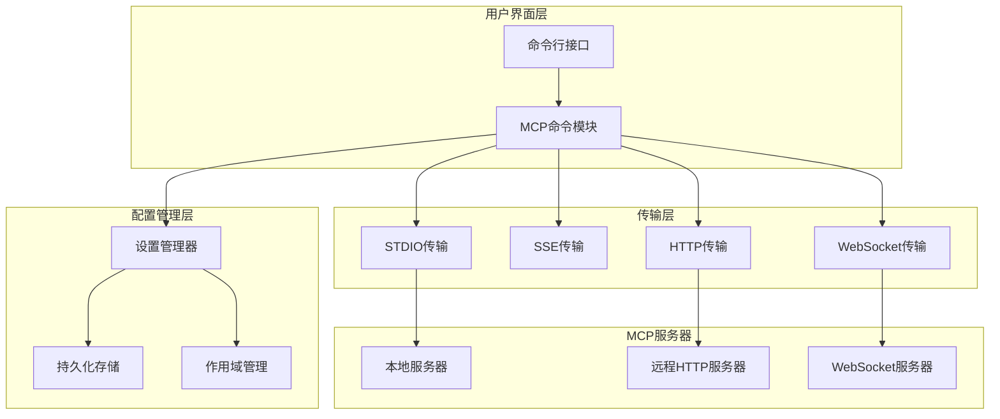
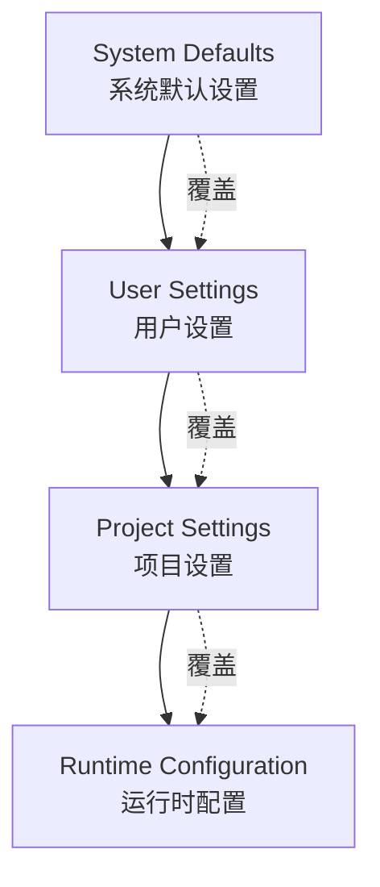
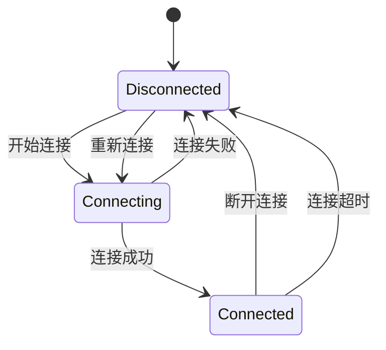
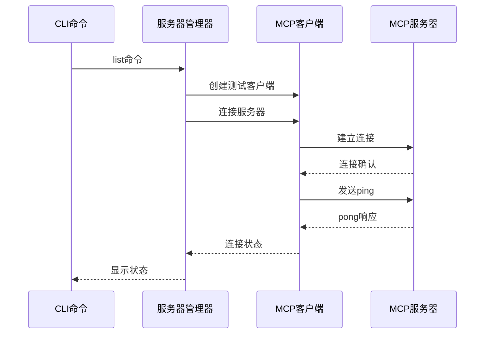

# 管理MCP服务器

<cite>
**本文档中引用的文件**
- [packages/cli/src/commands/mcp/add.ts](file://packages/cli/src/commands/mcp/add.ts)
- [packages/cli/src/commands/mcp/list.ts](file://packages/cli/src/commands/mcp/list.ts)
- [packages/cli/src/commands/mcp/remove.ts](file://packages/cli/src/commands/mcp/remove.ts)
- [packages/cli/src/commands/mcp.ts](file://packages/cli/src/commands/mcp.ts)
- [packages/core/src/tools/mcp-client.ts](file://packages/core/src/tools/mcp-client.ts)
- [packages/core/src/config/config.ts](file://packages/core/src/config/config.ts)
- [packages/cli/src/config/settings.ts](file://packages/cli/src/config/settings.ts)
- [packages/cli/src/config/extension-manager.ts](file://packages/cli/src/config/extension-manager.ts)
- [packages/cli/src/commands/mcp/add.test.ts](file://packages/cli/src/commands/mcp/add.test.ts)
- [packages/cli/src/commands/mcp/list.test.ts](file://packages/cli/src/commands/mcp/list.test.ts)
- [packages/cli/src/commands/mcp/remove.test.ts](file://packages/cli/src/commands/mcp/remove.test.ts)
</cite>

## 目录

1. [简介](#简介)
2. [MCP服务器架构概述](#mcp服务器架构概述)
3. [添加MCP服务器](#添加mcp服务器)
4. [列出MCP服务器](#列出mcp服务器)
5. [移除MCP服务器](#移除mcp服务器)
6. [服务器配置类型](#服务器配置类型)
7. [配置文件结构](#配置文件结构)
8. [服务器生命周期管理](#服务器生命周期管理)
9. [故障排除指南](#故障排除指南)
10. [最佳实践](#最佳实践)

## 简介

MCP（Model Context Protocol）服务器是Gemini
CLI生态系统中的重要组件，允许用户集成外部工具和服务到AI对话中。本指南详细介绍了如何使用命令行界面管理MCP服务器，包括添加、列出和移除服务器的操作流程。

MCP服务器管理系统提供了三个核心命令：

- `gemini mcp add`：添加新的MCP服务器
- `gemini mcp list`：显示已配置的服务器列表
- `gemini mcp remove`：移除现有的MCP服务器

## MCP服务器架构概述

MCP服务器管理系统采用分层架构设计，支持多种传输协议和配置选项。



**图表来源**

- [packages/cli/src/commands/mcp.ts](file://packages/cli/src/commands/mcp.ts#L1-L28)
- [packages/core/src/tools/mcp-client.ts](file://packages/core/src/tools/mcp-client.ts#L1-L200)

**章节来源**

- [packages/cli/src/commands/mcp.ts](file://packages/cli/src/commands/mcp.ts#L1-L28)
- [packages/core/src/tools/mcp-client.ts](file://packages/core/src/tools/mcp-client.ts#L1-L200)

## 添加MCP服务器

### 基本语法

```bash
gemini mcp add [选项] <名称> <命令或URL> [参数...]
```

### 命令选项详解

| 选项              | 别名 | 类型    | 默认值    | 描述                               |
| ----------------- | ---- | ------- | --------- | ---------------------------------- |
| `--scope`         | `-s` | string  | `project` | 配置作用域（user 或 project）      |
| `--transport`     | `-t` | string  | `stdio`   | 传输类型（stdio、sse、http）       |
| `--env`           | `-e` | array   | -         | 设置环境变量（格式：KEY=value）    |
| `--header`        | `-H` | array   | -         | 设置HTTP头（格式：Header: Value）  |
| `--timeout`       | -    | number  | -         | 连接超时时间（毫秒）               |
| `--trust`         | -    | boolean | false     | 信任服务器（绕过工具调用确认提示） |
| `--description`   | -    | string  | -         | 服务器描述                         |
| `--include-tools` | -    | array   | -         | 包含的工具列表                     |
| `--exclude-tools` | -    | array   | -         | 排除的工具列表                     |

### 添加不同类型服务器的示例

#### 1. 添加本地STDIO服务器

```bash
# 基本STDIO服务器
gemini mcp add my-local-server /usr/local/bin/my-mcp-server

# 带参数的STDIO服务器
gemini mcp add dev-server python ./server.py --port 8080

# 设置环境变量
gemini mcp add prod-server ./deploy.sh -e NODE_ENV=production -e API_KEY=secret
```

#### 2. 添加HTTP服务器

```bash
# 基本HTTP服务器
gemini mcp add api-server https://api.example.com/mcp --transport http

# 带认证头的HTTP服务器
gemini mcp add secured-api https://api.example.com/mcp \
  --transport http \
  --header "Authorization: Bearer your-token" \
  --header "X-API-Version: 2024-01-01"

# 设置超时
gemini mcp add slow-api https://slow-service.com/mcp \
  --transport http \
  --timeout 30000
```

#### 3. 添加SSE服务器

```bash
# 基本SSE服务器
gemini mcp add streaming-server https://stream.example.com/events --transport sse

# 带自定义头部的SSE服务器
gemini mcp add realtime https://realtime.example.com/sse \
  --transport sse \
  --header "X-Client-ID: my-app" \
  --header "Accept: text/event-stream"
```

#### 4. 添加用户级服务器

```bash
# 用户级配置（全局可用）
gemini mcp add --scope user global-server /path/to/global-server

# 项目级配置（仅当前项目）
gemini mcp add project-server /path/to/project-server
```

### 高级配置选项

#### 工具过滤配置

```bash
# 只包含特定工具
gemini mcp add selective-server ./server.py \
  --include-tools "search,files,terminal"

# 排除特定工具
gemini mcp add restricted-server ./server.py \
  --exclude-tools "dangerous-command,delete-all"
```

#### 信任配置

```bash
# 信任服务器，跳过所有工具确认
gemini mcp add trusted-server ./trusted.py --trust
```

**章节来源**

- [packages/cli/src/commands/mcp/add.ts](file://packages/cli/src/commands/mcp/add.ts#L1-L235)
- [packages/cli/src/commands/mcp/add.test.ts](file://packages/cli/src/commands/mcp/add.test.ts#L1-L371)

## 列出MCP服务器

### 基本用法

```bash
gemini mcp list
```

### 输出格式

`list`命令会显示所有已配置的MCP服务器及其状态信息：

```
✓ my-server: /usr/local/bin/server (stdio) - Connected
✗ api-server: https://api.example.com/mcp (http) - Disconnected
… streaming-server: https://stream.example.com/events (sse) - Connecting
✓ extension-server (from my-extension): /path/to/ext-server (stdio) - Connected
```

### 状态指示器

| 状态   | 图标 | 含义             |
| ------ | ---- | ---------------- |
| 已连接 | ✓    | 服务器正常连接   |
| 连接中 | …    | 正在建立连接     |
| 已断开 | ✗    | 连接失败或未连接 |

### 扩展服务器

`list`命令还会显示从扩展加载的服务器，这些服务器会标注其来源扩展名称。

**章节来源**

- [packages/cli/src/commands/mcp/list.ts](file://packages/cli/src/commands/mcp/list.ts#L1-L150)
- [packages/cli/src/commands/mcp/list.test.ts](file://packages/cli/src/commands/mcp/list.test.ts#L1-L192)

## 移除MCP服务器

### 基本语法

```bash
gemini mcp remove [选项] <名称>
```

### 命令选项

| 选项      | 别名 | 类型   | 默认值    | 描述                          |
| --------- | ---- | ------ | --------- | ----------------------------- |
| `--scope` | `-s` | string | `project` | 配置作用域（user 或 project） |

### 使用示例

```bash
# 移除项目级服务器
gemini mcp remove my-server

# 移除用户级服务器
gemini mcp remove --scope user global-server

# 尝试移除不存在的服务器
gemini mcp remove nonexistent-server
# 输出：Server "nonexistent-server" not found in project settings.
```

### 安全考虑

移除操作只会从配置文件中删除服务器条目，不会停止正在运行的服务器进程。如果需要完全清理，还需要手动停止相关进程。

**章节来源**

- [packages/cli/src/commands/mcp/remove.ts](file://packages/cli/src/commands/mcp/remove.ts#L1-L62)
- [packages/cli/src/commands/mcp/remove.test.ts](file://packages/cli/src/commands/mcp/remove.test.ts#L1-L229)

## 服务器配置类型

### STDIO传输

STDIO传输是最常用的传输方式，适用于本地可执行文件。

```typescript
// 配置示例
{
  "command": "/usr/local/bin/my-mcp-server",
  "args": ["--port", "8080"],
  "env": {
    "NODE_ENV": "production",
    "API_KEY": "secret-key"
  },
  "timeout": 30000
}
```

**特点：**

- 本地进程通信
- 支持环境变量设置
- 可配置工作目录
- 自动处理进程生命周期

### HTTP传输

HTTP传输适用于RESTful API风格的MCP服务器。

```typescript
// 配置示例
{
  "httpUrl": "https://api.example.com/mcp/v1",
  "headers": {
    "Authorization": "Bearer your-token",
    "Content-Type": "application/json"
  },
  "timeout": 15000
}
```

**特点：**

- 支持标准HTTP认证
- 可配置请求头
- 超时控制
- 错误重试机制

### SSE传输

Server-Sent Events传输适用于实时数据流场景。

```typescript
// 配置示例
{
  "url": "https://stream.example.com/events",
  "headers": {
    "Authorization": "Bearer your-token",
    "Accept": "text/event-stream"
  },
  "timeout": 60000
}
```

**特点：**

- 实时双向通信
- 流式数据传输
- 自动重连机制
- 支持事件过滤

### WebSocket传输

WebSocket传输提供全双工通信能力。

```typescript
// 配置示例
{
  "tcp": "ws://localhost:8080/mcp",
  "headers": {
    "Sec-WebSocket-Protocol": "mcp.v1"
  }
}
```

**特点：**

- 全双工通信
- 低延迟
- 支持二进制数据
- 连接状态监控

**章节来源**

- [packages/core/src/tools/mcp-client.ts](file://packages/core/src/tools/mcp-client.ts#L1143-L1326)
- [packages/core/src/config/config.ts](file://packages/core/src/config/config.ts#L174-L205)

## 配置文件结构

### 设置文件层次结构

Gemini CLI使用分层设置系统，优先级从高到低为：

1. **系统默认设置**（最高优先级）
2. **用户设置**（中等优先级）
3. **项目设置**（最低优先级）



**图表来源**

- [packages/cli/src/config/settings.ts](file://packages/cli/src/config/settings.ts#L400-L425)

### MCP服务器配置结构

```typescript
// 配置文件中的MCP服务器部分
{
  "mcpServers": {
    "server-name": {
      // 根据传输类型选择配置
      "command": "/path/to/server",           // STDIO
      "args": ["--port", "8080"],
      "env": { "NODE_ENV": "production" },

      "httpUrl": "https://api.example.com/mcp", // HTTP
      "headers": { "Authorization": "Bearer token" },

      "url": "https://stream.example.com/events", // SSE

      // 通用配置
      "timeout": 30000,
      "trust": false,
      "description": "My MCP Server",
      "includeTools": ["tool1", "tool2"],
      "excludeTools": ["dangerous-tool"]
    }
  }
}
```

### 作用域管理

| 作用域         | 文件位置                               | 优先级 | 修改权限   |
| -------------- | -------------------------------------- | ------ | ---------- |
| System         | `/etc/gemini-cli/settings.json`        | 最高   | 系统管理员 |
| SystemDefaults | `/etc/gemini-cli/system-defaults.json` | 最高   | 系统管理员 |
| User           | `~/.gemini/settings.json`              | 中等   | 用户       |
| Workspace      | `.gemini/settings.json`                | 最低   | 项目成员   |

**章节来源**

- [packages/cli/src/config/settings.ts](file://packages/cli/src/config/settings.ts#L1-L800)

## 服务器生命周期管理

### 连接状态管理



**图表来源**

- [packages/core/src/tools/mcp-client.ts](file://packages/core/src/tools/mcp-client.ts#L57-L66)

### 状态枚举

```typescript
enum MCPServerStatus {
  DISCONNECTED = 'disconnected', // 服务器断开或出现错误
  DISCONNECTING = 'disconnecting', // 服务器正在断开连接
  CONNECTING = 'connecting', // 服务器正在连接中
  CONNECTED = 'connected', // 服务器已连接并就绪
}
```

### 连接测试机制

系统会定期测试服务器连接状态：



**图表来源**

- [packages/cli/src/commands/mcp/list.ts](file://packages/cli/src/commands/mcp/list.ts#L52-L83)

### 持久化存储

服务器配置通过以下机制持久化：

1. **JSON文件存储**：配置保存为JSON格式
2. **注释保留**：保持配置文件中的注释
3. **格式化维护**：保持一致的缩进和格式
4. **备份机制**：自动创建备份文件

**章节来源**

- [packages/core/src/tools/mcp-client.ts](file://packages/core/src/tools/mcp-client.ts#L57-L1354)
- [packages/cli/src/commands/mcp/list.ts](file://packages/cli/src/commands/mcp/list.ts#L52-L150)

## 故障排除指南

### 常见问题及解决方案

#### 1. 网络连接失败

**症状：**

```
✗ server-name: https://example.com/mcp (http) - Disconnected
```

**可能原因：**

- 服务器不可达
- 网络防火墙阻止
- DNS解析失败
- SSL证书问题

**解决方案：**

```bash
# 检查服务器可达性
curl -I https://example.com/mcp

# 使用不同的传输类型
gemini mcp add --transport sse server-name https://example.com/events

# 增加超时时间
gemini mcp add --timeout 60000 server-name https://slow-server.com/mcp
```

#### 2. 认证错误

**症状：**

```
Error: Authentication failed for 'server-name'
```

**解决方案：**

```bash
# 检查认证头
gemini mcp add server-name https://api.example.com/mcp \
  --header "Authorization: Bearer $(cat ~/.api-token)"

# 使用环境变量
gemini mcp add server-name https://api.example.com/mcp \
  -e AUTH_TOKEN=$(cat ~/.api-token)
```

#### 3. 协议版本不兼容

**症状：**

```
Error: Unsupported protocol version for 'server-name'
```

**解决方案：**

```bash
# 检查服务器支持的协议版本
gemini mcp add server-name https://api.example.com/mcp \
  --header "Accept: application/json; version=1.0"
```

#### 4. 权限问题

**症状：**

```
Error: Permission denied for 'server-name'
```

**解决方案：**

```bash
# 检查文件权限
chmod +x /path/to/server

# 使用用户级配置
gemini mcp add --scope user server-name /path/to/server
```

#### 5. 工具发现失败

**症状：**

```
Error: No prompts or tools found on the server
```

**解决方案：**

```bash
# 检查服务器是否正确实现MCP协议
gemini mcp add server-name /path/to/server --trust

# 排除特定工具进行调试
gemini mcp add server-name /path/to/server \
  --exclude-tools "problematic-tool"
```

### 调试技巧

#### 启用调试模式

```bash
# 设置调试环境变量
export DEBUG=mcp:*
gemini mcp list
```

#### 检查配置文件

```bash
# 查看当前配置
cat ~/.gemini/settings.json | jq '.mcpServers'

# 验证JSON格式
cat ~/.gemini/settings.json | jq .
```

#### 测试连接

```bash
# 手动测试连接
telnet server-host 8080
nc -zv server-host 8080
```

**章节来源**

- [packages/core/src/tools/mcp-client.ts](file://packages/core/src/tools/mcp-client.ts#L1143-L1191)

## 最佳实践

### 1. 配置组织

#### 分层配置策略

```bash
# 系统级：基础工具配置
gemini mcp add --scope system base-tools /usr/bin/base-tools

# 用户级：个人常用工具
gemini mcp add --scope user personal-tools ~/bin/personal-tools

# 项目级：项目特定工具
gemini mcp add project-specific ./project-tools
```

#### 命名约定

```bash
# 使用描述性名称
gemini mcp add production-api https://api.prod.com/mcp
gemini mcp add staging-api https://api.staging.com/mcp
gemini mcp add dev-api https://localhost:8080/mcp

# 包含用途信息
gemini mcp add file-search-tools ./tools/search.py
gemini mcp add db-query-tools ./tools/db.py
```

### 2. 安全考虑

#### 信任级别管理

```bash
# 对于可信服务器
gemini mcp add trusted-server ./trusted.py --trust

# 对于半可信服务器
gemini mcp add semi-trusted-server ./semi-trusted.py

# 对于不可信服务器
gemini mcp add untrusted-server ./untrusted.py
```

#### 认证最佳实践

```bash
# 使用环境变量存储敏感信息
export API_KEY=$(cat ~/.api-key)
gemini mcp add secure-server https://api.com/mcp \
  --header "Authorization: Bearer $API_KEY"

# 避免在命令行中暴露密钥
gemini mcp add server ./script.py \
  -e API_KEY_FILE=~/.api-key
```

### 3. 性能优化

#### 超时配置

```bash
# 快速服务使用短超时
gemini mcp add fast-service ./fast.py --timeout 5000

# 慢速服务使用长超时
gemini mcp add slow-service ./slow.py --timeout 60000
```

#### 工具过滤

```bash
# 只包含必要的工具
gemini mcp add minimal-server ./server.py \
  --include-tools "search,files"

# 排除危险工具
gemini mcp add safe-server ./server.py \
  --exclude-tools "delete,format"
```

### 4. 开发和测试

#### 开发环境配置

```bash
# 开发服务器
gemini mcp add dev-server ./dev-server.py --scope user

# 测试服务器
gemini mcp add test-server ./test-server.py --scope user --trust
```

#### 版本管理

```bash
# 使用版本化的服务器名称
gemini mcp add api-v1 https://api.example.com/v1/mcp
gemini mcp add api-v2 https://api.example.com/v2/mcp

# 临时测试服务器
gemini mcp add tmp-server ./tmp-server.py
```

### 5. 监控和维护

#### 定期检查

```bash
# 检查所有服务器状态
gemini mcp list

# 导出状态报告
gemini mcp list | tee mcp-status-$(date +%Y%m%d).log
```

#### 清理无用配置

```bash
# 移除不再使用的服务器
gemini mcp remove old-server

# 清理测试配置
gemini mcp remove --scope user test-server
```

通过遵循这些最佳实践，您可以有效地管理MCP服务器，确保系统的稳定性、安全性和性能。
