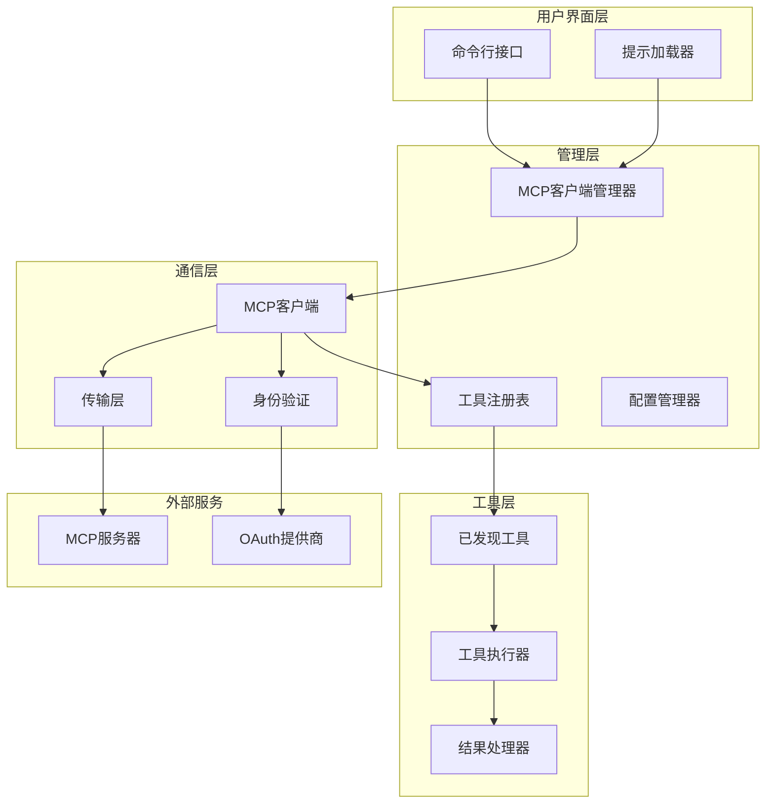
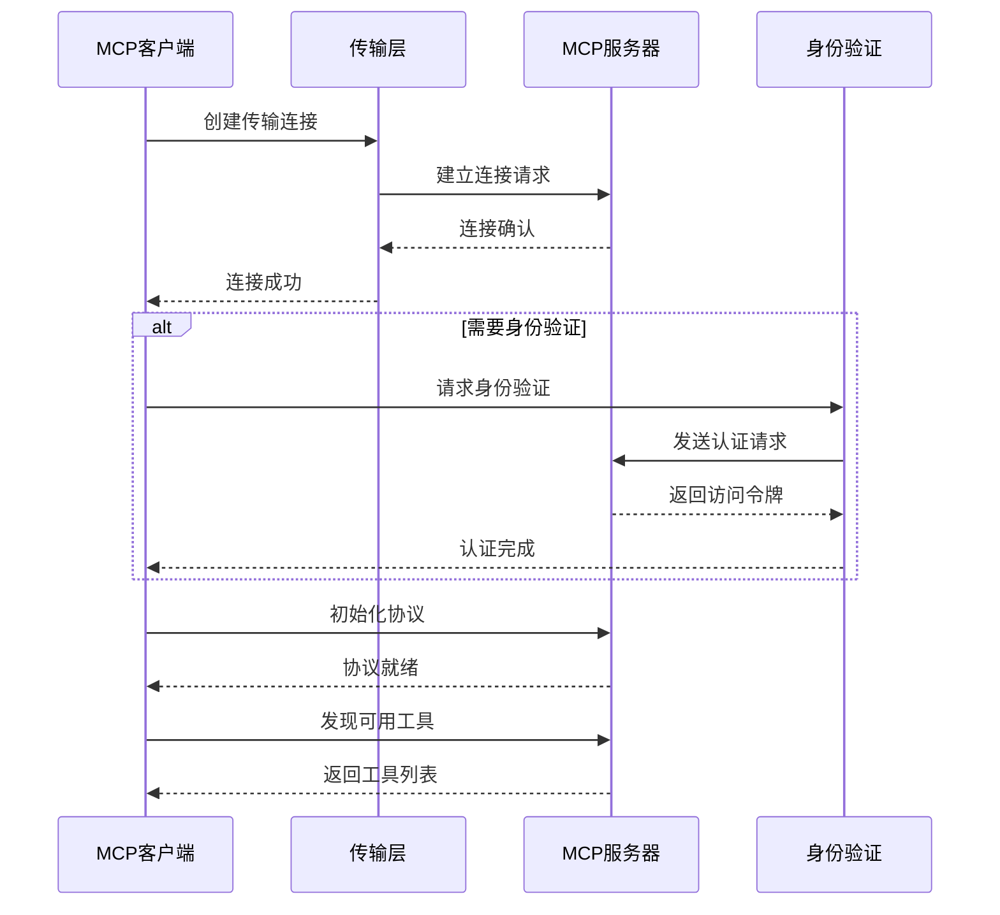
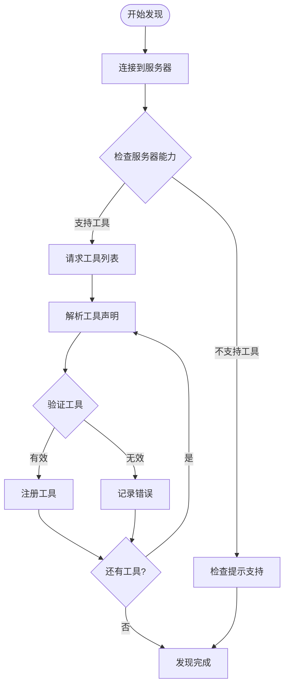
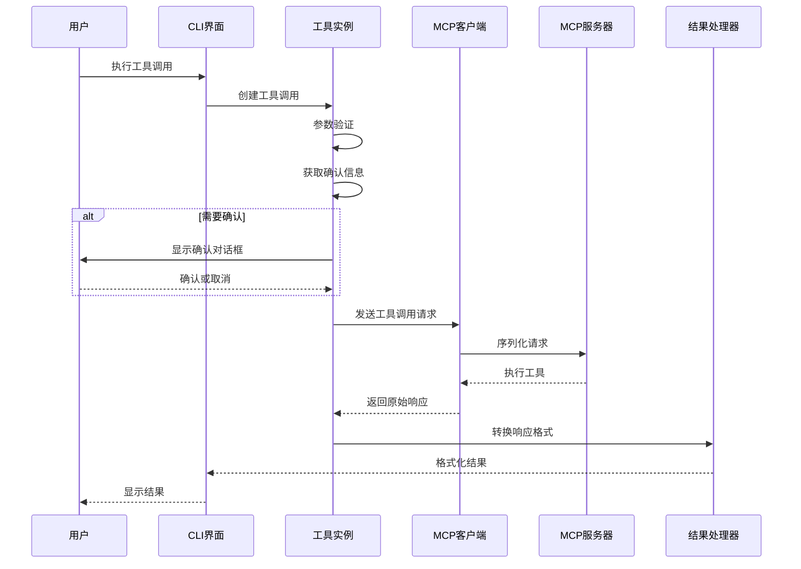
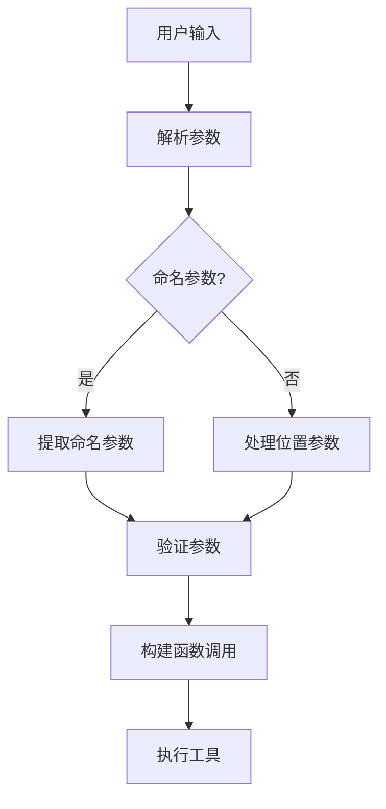
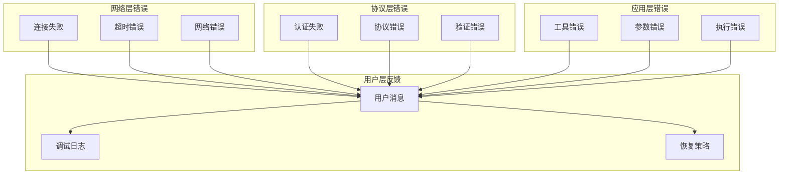
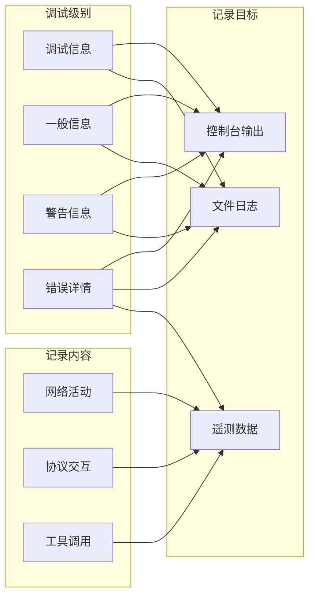

# 调用MCP工具

<cite>
**本文档中引用的文件**
- [mcp-client.ts](file://packages/core/src/tools/mcp-client.ts)
- [mcp-tool.ts](file://packages/core/src/tools/mcp-tool.ts)
- [mcp-client-manager.ts](file://packages/core/src/tools/mcp-client-manager.ts)
- [McpPromptLoader.ts](file://packages/cli/src/services/McpPromptLoader.ts)
- [errors.ts](file://packages/core/src/utils/errors.ts)
- [config.ts](file://packages/core/src/config/config.ts)
- [list.ts](file://packages/cli/src/commands/mcp/list.ts)
- [add.ts](file://packages/cli/src/commands/mcp/add.ts)
</cite>

## 目录

1. [简介](#简介)
2. [系统架构概览](#系统架构概览)
3. [MCP客户端通信机制](#mcp客户端通信机制)
4. [工具发现与注册](#工具发现与注册)
5. [工具调用流程](#工具调用流程)
6. [交互式CLI使用](#交互式cli使用)
7. [错误处理机制](#错误处理机制)
8. [配置管理](#配置管理)
9. [调试技巧](#调试技巧)
10. [最佳实践](#最佳实践)

## 简介

Model Context Protocol
(MCP) 是一个标准化协议，允许AI代理与外部工具和服务进行安全交互。在Gemini
CLI中，MCP工具系统提供了完整的端到端解决方案，从服务器连接到工具执行，再到结果呈现。

MCP工具系统的核心特性包括：

- 多种传输协议支持（STDIO、SSE、HTTP）
- 自动身份验证和OAuth集成
- 工具发现和动态注册
- 安全的工具调用确认机制
- 丰富的错误处理和调试支持

## 系统架构概览

MCP工具系统采用分层架构设计，确保了可扩展性和安全性：

**图表来源**

- [mcp-client-manager.ts](file://packages/core/src/tools/mcp-client-manager.ts#L28-L49)
- [mcp-client.ts](file://packages/core/src/tools/mcp-client.ts#L87-L100)

**章节来源**

- [mcp-client-manager.ts](file://packages/core/src/tools/mcp-client-manager.ts#L1-L50)
- [mcp-client.ts](file://packages/core/src/tools/mcp-client.ts#L1-L100)

## MCP客户端通信机制

### 连接建立过程

MCP客户端通过多种传输协议与远程服务器建立连接：

**图表来源**

- [mcp-client.ts](file://packages/core/src/tools/mcp-client.ts#L104-L135)
- [mcp-client.ts](file://packages/core/src/tools/mcp-client.ts#L530-L585)

### 支持的传输协议

系统支持三种主要的传输协议：

1. **STDIO传输**：用于本地进程通信
2. **SSE传输**：基于Server-Sent Events的实时通信
3. **HTTP传输**：基于RESTful API的请求-响应模式

每种传输协议都有其特定的配置选项和使用场景。

**章节来源**

- [mcp-client.ts](file://packages/core/src/tools/mcp-client.ts#L1193-L1326)

## 工具发现与注册

### 工具发现流程

工具发现是MCP系统的核心功能，负责识别和注册远程服务器提供的可用工具：

**图表来源**

- [mcp-client.ts](file://packages/core/src/tools/mcp-client.ts#L588-L669)

### 工具注册机制

发现的工具会被包装成`DiscoveredMCPTool`实例，并注册到全局工具注册表中：

- **名称规范化**：确保工具名称符合API要求
- **参数验证**：检查工具参数的完整性和有效性
- **信任级别设置**：根据配置确定工具的信任级别
- **优先级排序**：按类型和来源对工具进行排序

**章节来源**

- [mcp-tool.ts](file://packages/core/src/tools/mcp-tool.ts#L215-L283)
- [mcp-client.ts](file://packages/core/src/tools/mcp-client.ts#L588-L669)

## 工具调用流程

### 完整调用生命周期

从用户触发到结果返回的完整流程：

**图表来源**

- [mcp-tool.ts](file://packages/core/src/tools/mcp-tool.ts#L146-L208)

### 请求序列化与参数验证

工具调用涉及复杂的序列化和验证过程：

1. **参数预处理**：转换用户输入为标准格式
2. **JSON Schema验证**：确保参数符合工具定义
3. **类型转换**：将字符串参数转换为正确类型
4. **默认值填充**：为缺失的可选参数提供默认值

### 响应处理与格式化

服务器响应需要经过多层处理才能呈现给用户：

- **内容块解析**：处理不同类型的响应内容
- **媒体数据处理**：嵌入图片和音频数据
- **资源链接处理**：解析和显示外部资源链接
- **错误状态检测**：识别和报告工具执行错误

**章节来源**

- [mcp-tool.ts](file://packages/core/src/tools/mcp-tool.ts#L345-L415)

## 交互式CLI使用

### 提示解析与映射

CLI系统提供了强大的提示解析功能，支持复杂的参数传递：

**图表来源**

- [McpPromptLoader.ts](file://packages/cli/src/services/McpPromptLoader.ts#L225-L299)

### 命令行参数处理

系统支持多种参数传递方式：

- **命名参数**：`--参数名="值"`
- **位置参数**：按顺序传递的简单值
- **混合参数**：同时使用命名和位置参数
- **引号处理**：支持复杂字符串和特殊字符

### 自动补全与帮助

CLI提供了智能的自动补全和帮助功能：

- **参数建议**：根据当前输入提供建议
- **语法高亮**：显示正确的参数格式
- **帮助信息**：提供详细的参数说明

**章节来源**

- [McpPromptLoader.ts](file://packages/cli/src/services/McpPromptLoader.ts#L1-L100)

## 错误处理机制

### 分层错误处理

MCP系统实现了多层错误处理机制：

**图表来源**

- [mcp-client.ts](file://packages/core/src/tools/mcp-client.ts#L1143-L1191)
- [errors.ts](file://packages/core/src/utils/errors.ts#L1-L120)

### 常见错误类型

系统处理以下主要错误类型：

1. **连接错误**：服务器不可达、网络中断
2. **认证错误**：凭据过期、权限不足
3. **协议错误**：版本不兼容、消息格式错误
4. **工具错误**：工具不存在、参数无效
5. **执行错误**：工具内部异常、超时

### 恢复策略

对于可恢复的错误，系统提供了多种恢复策略：

- **重试机制**：自动重试失败的操作
- **降级处理**：使用备用传输协议
- **缓存策略**：使用缓存的工具列表
- **用户干预**：提示用户手动解决

**章节来源**

- [mcp-client.ts](file://packages/core/src/tools/mcp-client.ts#L1143-L1191)
- [errors.ts](file://packages/core/src/utils/errors.ts#L1-L120)

## 配置管理

### 服务器配置结构

每个MCP服务器都有详细的配置选项：

| 配置项        | 类型                   | 描述             | 默认值   |
| ------------- | ---------------------- | ---------------- | -------- |
| `command`     | string                 | 启动服务器的命令 | -        |
| `args`        | string[]               | 命令行参数       | []       |
| `env`         | Record<string, string> | 环境变量         | {}       |
| `cwd`         | string                 | 工作目录         | 当前目录 |
| `url`         | string                 | SSE服务器URL     | -        |
| `httpUrl`     | string                 | HTTP服务器URL    | -        |
| `headers`     | Record<string, string> | HTTP头           | {}       |
| `timeout`     | number                 | 连接超时(ms)     | 600000   |
| `trust`       | boolean                | 是否信任服务器   | false    |
| `description` | string                 | 服务器描述       | -        |

### 身份验证配置

系统支持多种身份验证方式：

- **OAuth 2.0**：现代Web应用的标准认证
- **Google凭据**：基于Google Cloud的服务
- **服务账户模拟**：企业环境的身份验证
- **自定义凭据**：第三方服务的专用认证

### 安全策略

为了确保安全性，系统实现了多层次的安全控制：

- **信任级别**：区分可信和非可信服务器
- **工具白名单**：限制可使用的工具集合
- **参数验证**：防止恶意参数注入
- **执行沙箱**：隔离工具执行环境

**章节来源**

- [config.ts](file://packages/core/src/config/config.ts#L175-L200)

## 调试技巧

### 日志记录策略

系统提供了全面的日志记录功能：

### 常见调试场景

1. **连接问题**：检查网络连接和防火墙设置
2. **认证失败**：验证凭据配置和OAuth流程
3. **工具调用失败**：查看参数验证和执行日志
4. **性能问题**：监控超时和响应时间

### 工具诊断命令

系统提供了专门的诊断工具：

- **服务器状态检查**：验证所有配置的服务器
- **连接测试**：测试特定服务器的连通性
- **工具清单**：列出所有可用的工具
- **配置验证**：检查配置文件的有效性

**章节来源**

- [list.ts](file://packages/cli/src/commands/mcp/list.ts#L70-L107)

## 最佳实践

### 开发者指南

1. **工具设计原则**
   - 保持工具功能单一明确
   - 提供清晰的参数文档
   - 实现适当的错误处理
   - 支持异步操作

2. **安全考虑**
   - 验证所有用户输入
   - 使用最小权限原则
   - 实施适当的超时机制
   - 记录敏感操作

3. **性能优化**
   - 缓存频繁访问的数据
   - 实现批量操作
   - 优化网络请求
   - 监控资源使用

### 部署建议

1. **生产环境配置**
   - 使用HTTPS传输
   - 实施适当的认证机制
   - 配置合理的超时值
   - 设置监控和告警

2. **故障排除**
   - 定期检查服务器状态
   - 监控错误率和响应时间
   - 维护详细的日志记录
   - 制定应急响应计划

3. **维护更新**
   - 定期更新依赖包
   - 测试新版本兼容性
   - 备份重要配置
   - 文档化变更历史

通过遵循这些最佳实践，开发者可以构建稳定、安全且高效的MCP工具集成解决方案。
