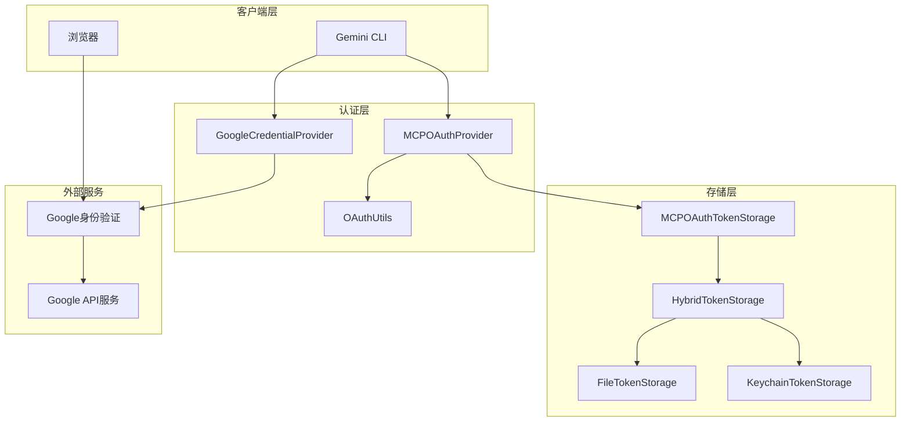
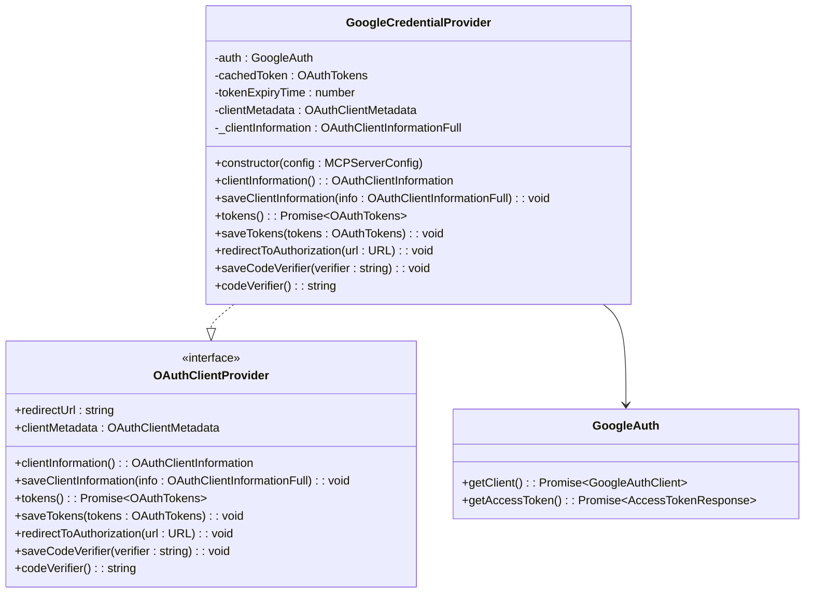
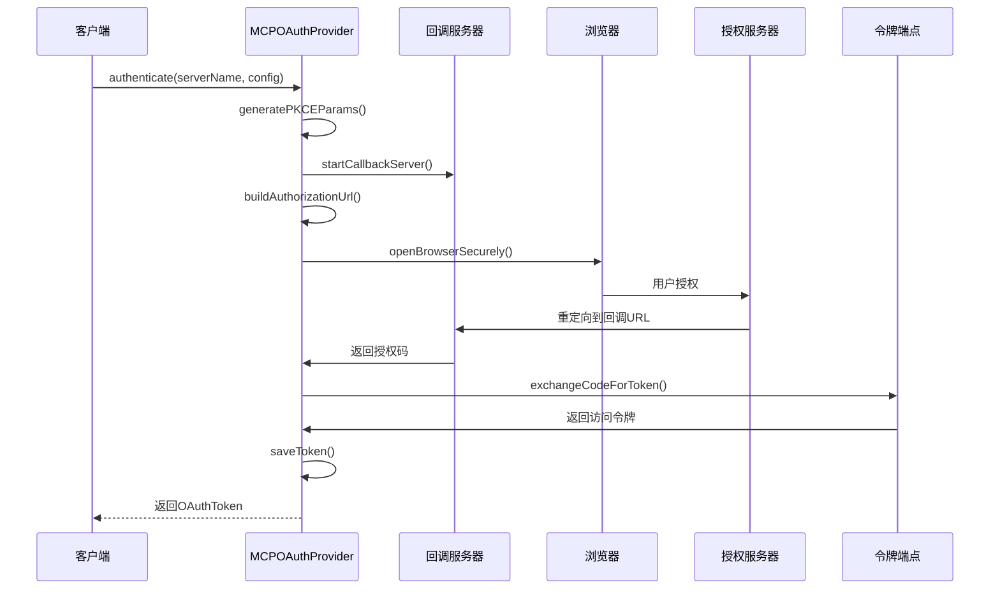
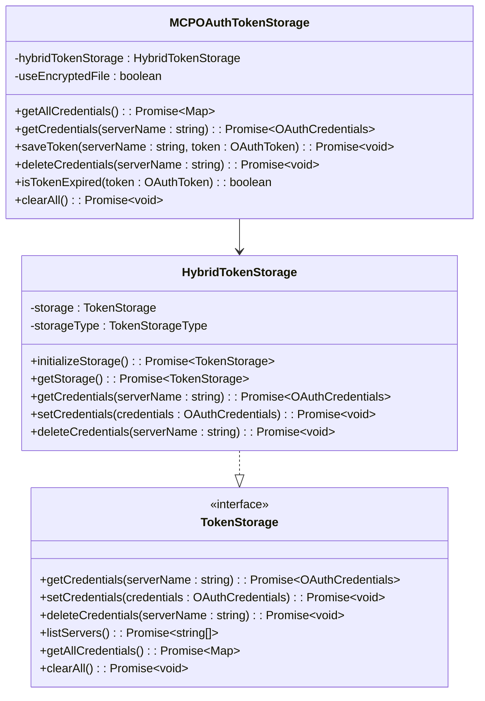
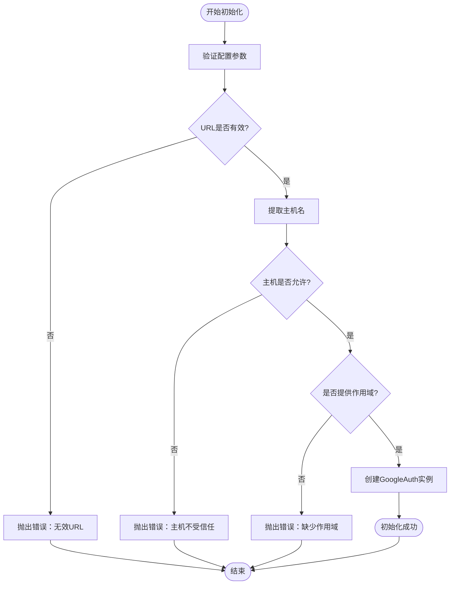
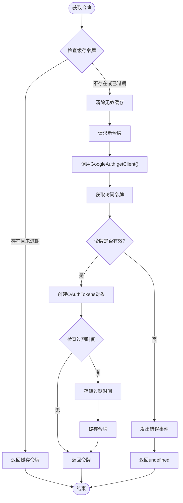
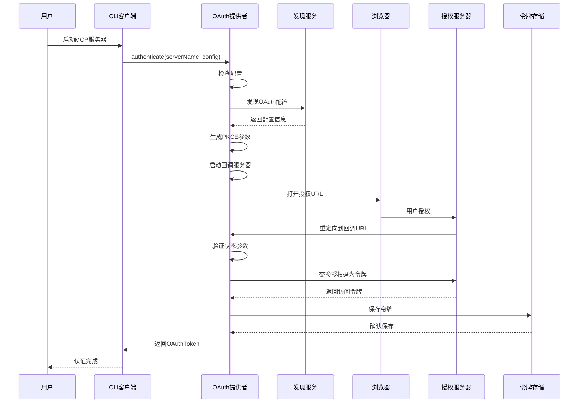
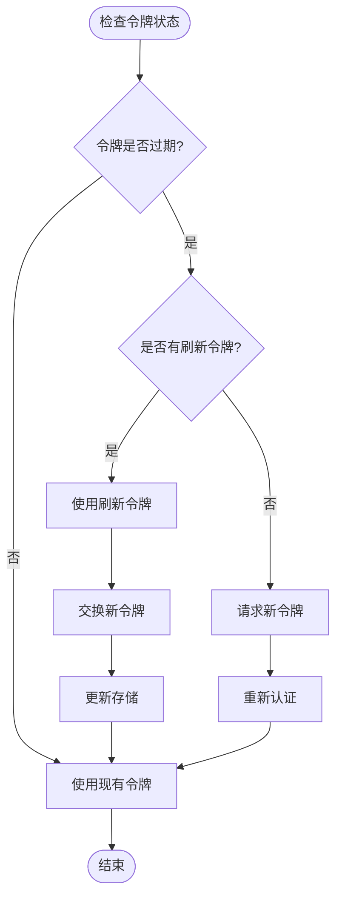

# Google登录认证

<cite>
**本文档引用的文件**
- [google-auth-provider.ts](file://packages/core/src/mcp/google-auth-provider.ts)
- [oauth-provider.ts](file://packages/core/src/mcp/oauth-provider.ts)
- [oauth-token-storage.ts](file://packages/core/src/mcp/oauth-token-storage.ts)
- [oauth-utils.ts](file://packages/core/src/mcp/oauth-utils.ts)
- [token-storage/types.ts](file://packages/core/src/mcp/token-storage/types.ts)
- [token-storage/hybrid-token-storage.ts](file://packages/core/src/mcp/token-storage/hybrid-token-storage.ts)
- [google-auth-provider.test.ts](file://packages/core/src/mcp/google-auth-provider.test.ts)
- [secure-browser-launcher.ts](file://packages/core/src/utils/secure-browser-launcher.ts)
- [mcp-client.ts](file://packages/core/src/tools/mcp-client.ts)
- [config.ts](file://packages/core/src/config/config.ts)
</cite>

## 目录

1. [简介](#简介)
2. [系统架构概览](#系统架构概览)
3. [核心组件分析](#核心组件分析)
4. [认证流程详解](#认证流程详解)
5. [配置和集成指南](#配置和集成指南)
6. [安全最佳实践](#安全最佳实践)
7. [故障排除指南](#故障排除指南)
8. [总结](#总结)

## 简介

Gemini
CLI的MCP扩展通过Google登录认证机制实现了安全的用户身份验证。该系统基于OAuth
2.0协议，使用PKCE（Proof Key for Code Exchange）增强安全性，支持Google Cloud
Platform服务的访问，并提供了完整的令牌管理和持久化存储功能。

Google登录认证机制的核心优势包括：

- 基于标准OAuth 2.0协议的安全认证
- 使用PKCE防止授权码拦截攻击
- 支持Google Cloud Platform服务的访问
- 完整的令牌生命周期管理
- 多平台浏览器安全启动

## 系统架构概览

Google登录认证系统采用分层架构设计，包含认证提供者、令牌存储、OAuth工具和安全组件等核心模块。



**图表来源**

- [google-auth-provider.ts](file://packages/core/src/mcp/google-auth-provider.ts#L21-L127)
- [oauth-provider.ts](file://packages/core/src/mcp/oauth-provider.ts#L99-L1026)
- [oauth-token-storage.ts](file://packages/core/src/mcp/oauth-token-storage.ts#L26-L235)

## 核心组件分析

### GoogleCredentialProvider类

GoogleCredentialProvider是Google登录认证的核心组件，实现了OAuthClientProvider接口，负责与Google身份验证服务的交互。



**图表来源**

- [google-auth-provider.ts](file://packages/core/src/mcp/google-auth-provider.ts#L21-L127)

**章节来源**

- [google-auth-provider.ts](file://packages/core/src/mcp/google-auth-provider.ts#L1-L127)

### OAuth认证提供者

MCPOAuthProvider负责处理完整的OAuth
2.0授权码流程，包括PKCE参数生成、回调服务器启动和令牌交换。



**图表来源**

- [oauth-provider.ts](file://packages/core/src/mcp/oauth-provider.ts#L700-L945)

**章节来源**

- [oauth-provider.ts](file://packages/core/src/mcp/oauth-provider.ts#L700-L1026)

### 令牌存储系统

令牌存储系统提供了安全的令牌持久化功能，支持文件存储和密钥链存储两种模式。



**图表来源**

- [oauth-token-storage.ts](file://packages/core/src/mcp/oauth-token-storage.ts#L26-L235)
- [hybrid-token-storage.ts](file://packages/core/src/mcp/token-storage/hybrid-token-storage.ts#L14-L98)

**章节来源**

- [oauth-token-storage.ts](file://packages/core/src/mcp/oauth-token-storage.ts#L1-L235)
- [hybrid-token-storage.ts](file://packages/core/src/mcp/token-storage/hybrid-token-storage.ts#L1-L98)

## 认证流程详解

### 初始化阶段

Google登录认证的初始化过程包括配置验证、主机检查和作用域设置。



**图表来源**

- [google-auth-provider.ts](file://packages/core/src/mcp/google-auth-provider.ts#L37-L61)

### 令牌获取流程

令牌获取过程包含缓存检查、令牌刷新和新令牌请求等步骤。



**图表来源**

- [google-auth-provider.ts](file://packages/core/src/mcp/google-auth-provider.ts#L71-L107)

### OAuth完整流程

完整的OAuth认证流程涵盖了从配置发现到最终令牌保存的所有步骤。



**图表来源**

- [oauth-provider.ts](file://packages/core/src/mcp/oauth-provider.ts#L700-L945)

**章节来源**

- [oauth-provider.ts](file://packages/core/src/mcp/oauth-provider.ts#L700-L1026)

## 配置和集成指南

### 基本配置要求

要启用Google登录认证，需要在MCP服务器配置中正确设置相关参数：

| 配置项             | 类型             | 必需 | 描述                                 |
| ------------------ | ---------------- | ---- | ------------------------------------ |
| `url`              | string           | 是   | MCP服务器的基础URL                   |
| `oauth.scopes`     | string[]         | 是   | 请求的权限范围列表                   |
| `authProviderType` | AuthProviderType | 是   | 认证提供者类型（GOOGLE_CREDENTIALS） |

### API密钥和权限设置

1. **Google Cloud项目配置**
   - 创建Google Cloud项目
   - 启用相关API服务
   - 配置OAuth同意屏幕
   - 设置授权重定向URI

2. **权限范围定义**
   - 根据需求选择适当的作用域
   - 遵循最小权限原则
   - 考虑用户隐私保护

### 集成步骤

1. **安装依赖包**

```bash
npm install google-auth-library @modelcontextprotocol/sdk
```

2. **配置MCP服务器**

```typescript
const serverConfig = new MCPServerConfig(
  undefined, // command
  undefined, // args
  undefined, // env
  undefined, // cwd
  'https://your-mcp-server.com', // url
  undefined, // httpUrl
  undefined, // headers
  undefined, // tcp
  undefined, // timeout
  undefined, // trust
  undefined, // description
  undefined, // includeTools
  undefined, // excludeTools
  undefined, // extension
  {
    enabled: true,
    scopes: ['https://www.googleapis.com/auth/userinfo.profile'],
  }, // oauth
  AuthProviderType.GOOGLE_CREDENTIALS, // authProviderType
);
```

3. **启动认证流程**

```typescript
const provider = new GoogleCredentialProvider(serverConfig);
const tokens = await provider.tokens();
```

**章节来源**

- [config.ts](file://packages/core/src/config/config.ts#L175-L205)
- [google-auth-provider.ts](file://packages/core/src/mcp/google-auth-provider.ts#L37-L61)

## 安全最佳实践

### 令牌轮换策略

系统实现了自动令牌轮换机制，确保令牌的安全性和有效性。



**图表来源**

- [oauth-provider.ts](file://packages/core/src/mcp/oauth-provider.ts#L947-L1024)

### 最小权限原则

1. **作用域限制**
   - 仅请求必要的API权限
   - 避免过度授权
   - 定期审查权限范围

2. **令牌有效期控制**
   - 设置合理的令牌过期时间
   - 实现自动刷新机制
   - 监控令牌使用情况

### 安全传输

1. **HTTPS强制使用**
   - 所有通信必须使用HTTPS
   - 验证SSL证书
   - 防止中间人攻击

2. **PKCE增强安全性**
   - 使用随机生成的代码挑战
   - 防止授权码拦截
   - 确保代码验证完整性

**章节来源**

- [oauth-provider.ts](file://packages/core/src/mcp/oauth-provider.ts#L246-L259)
- [secure-browser-launcher.ts](file://packages/core/src/utils/secure-browser-launcher.ts#L1-L192)

## 故障排除指南

### 常见问题及解决方案

1. **主机验证失败**
   - 错误信息：`Host "example.com" is not an allowed host for Google Credential provider`
   - 解决方案：确保使用Google API域名（googleapis.com或luci.app）

2. **作用域配置错误**
   - 错误信息：`Scopes must be provided in the oauth config`
   - 解决方案：在配置中添加必要的权限范围

3. **令牌获取失败**
   - 错误信息：`Failed to get access token from Google ADC`
   - 解决方案：检查Google Application Default Credentials配置

4. **浏览器启动问题**
   - 错误信息：`Failed to open browser`
   - 解决方案：检查环境变量和浏览器可用性

### 调试技巧

1. **启用调试日志**

```typescript
process.env.DEBUG = 'gemini:*';
```

2. **检查令牌存储**

```typescript
const storage = new MCPOAuthTokenStorage();
const tokens = await storage.getAllCredentials();
console.log('Stored tokens:', tokens);
```

3. **验证网络连接**

```typescript
try {
  const response = await fetch(
    'https://accounts.google.com/.well-known/openid-configuration',
  );
  console.log('Google discovery endpoint:', response.ok);
} catch (error) {
  console.error('Network error:', error);
}
```

**章节来源**

- [google-auth-provider.ts](file://packages/core/src/mcp/google-auth-provider.ts#L46-L50)
- [oauth-token-storage.ts](file://packages/core/src/mcp/oauth-token-storage.ts#L60-L80)

## 总结

Gemini
CLI的Google登录认证机制提供了一个安全、可靠且易于集成的身份验证解决方案。通过OAuth
2.0协议和PKCE技术，系统确保了用户数据的安全性，同时通过智能的令牌管理和多平台支持，提供了良好的用户体验。

### 主要特性

- **安全性**：基于OAuth 2.0和PKCE的安全认证机制
- **可靠性**：自动令牌刷新和错误恢复机制
- **易用性**：简化的配置和集成流程
- **可扩展性**：支持多种Google Cloud Platform服务
- **跨平台**：兼容Windows、macOS和Linux系统

### 适用场景

该认证机制特别适用于以下场景：

- 需要访问Google服务的MCP扩展
- 需要用户身份验证的企业应用
- 需要安全令牌管理的云原生应用
- 需要合规性认证的金融系统

通过遵循本文档中的配置指南和安全最佳实践，开发者可以快速集成并部署安全可靠的Google登录认证功能。
