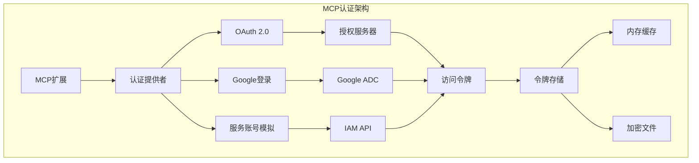
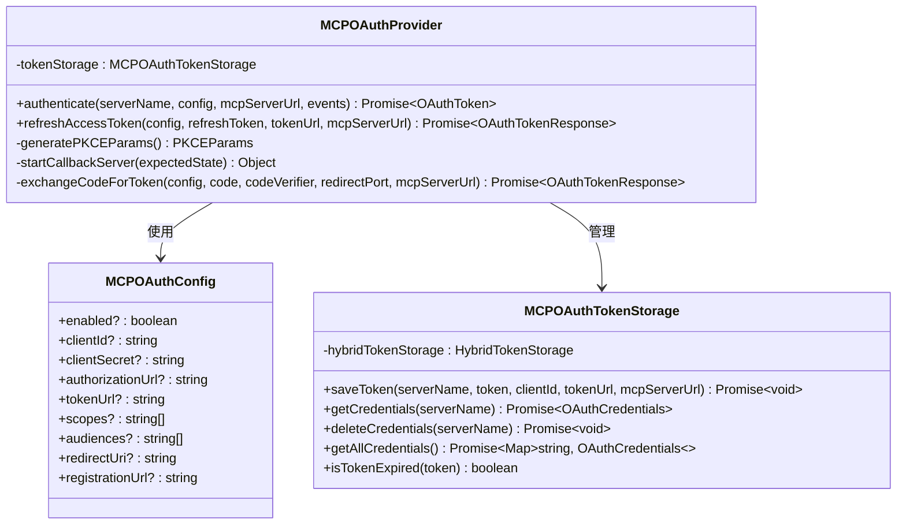
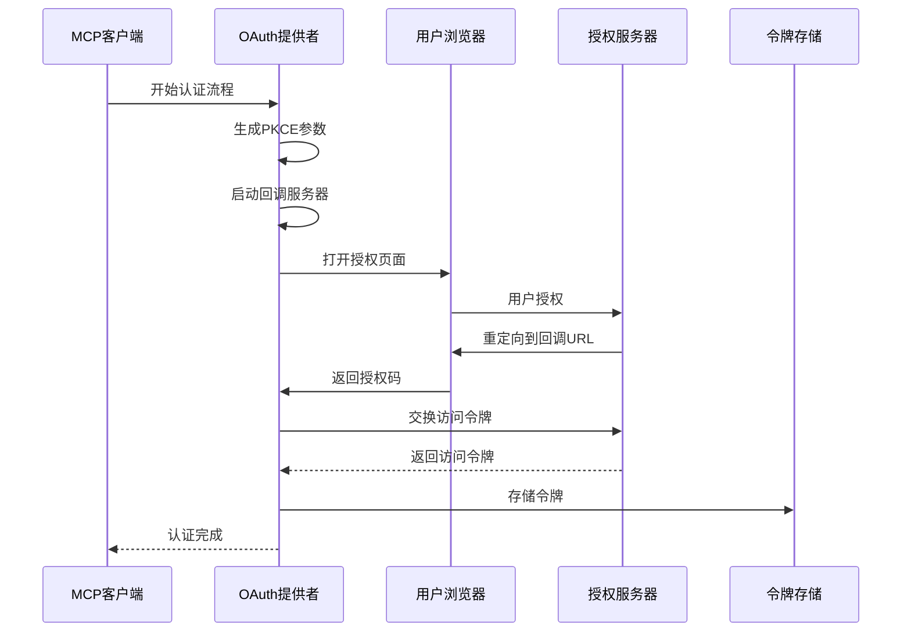
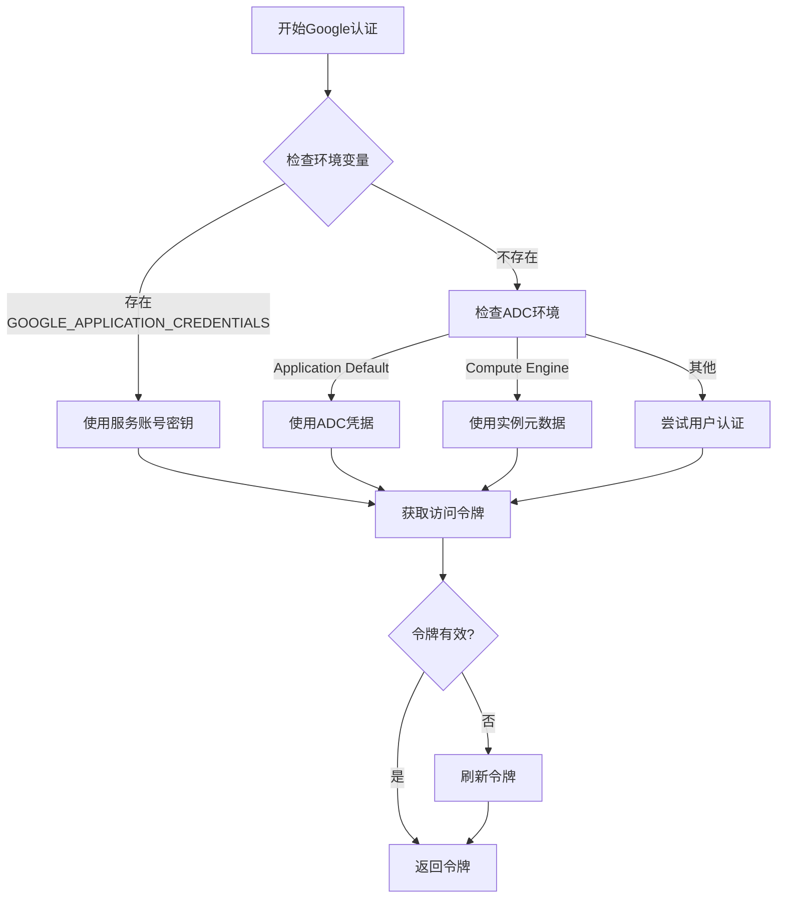
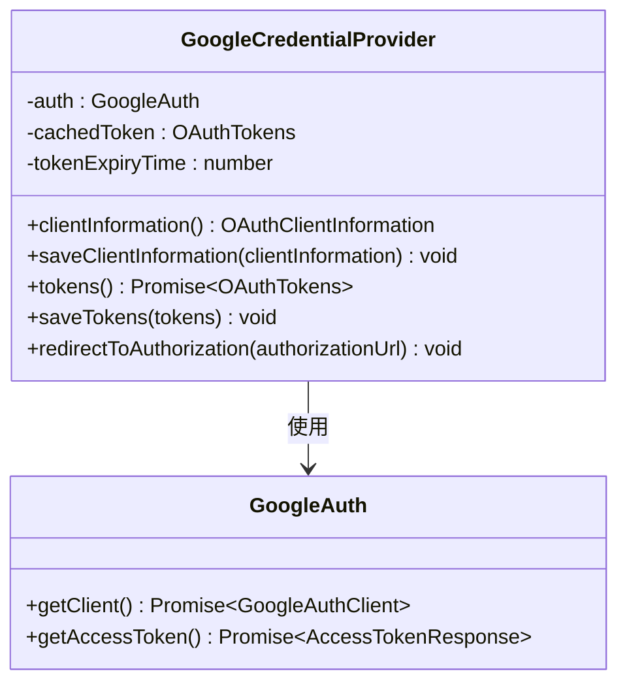
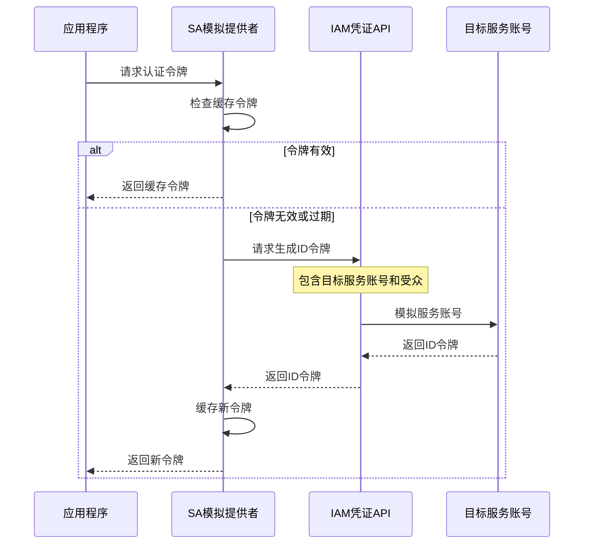
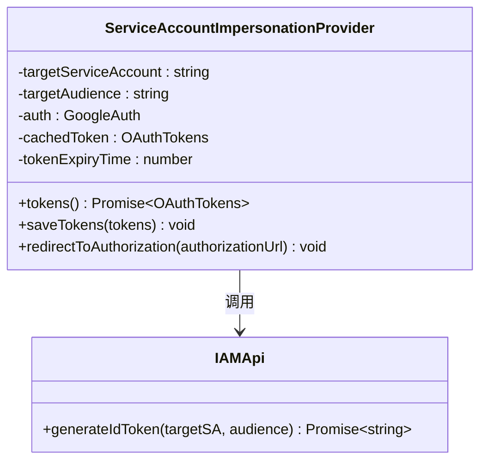
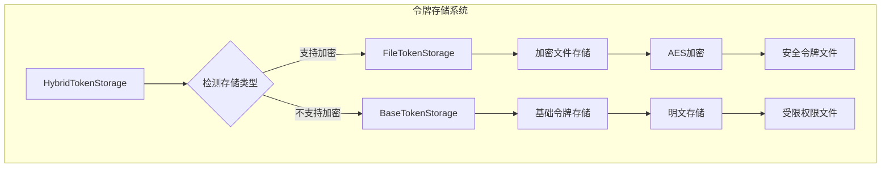
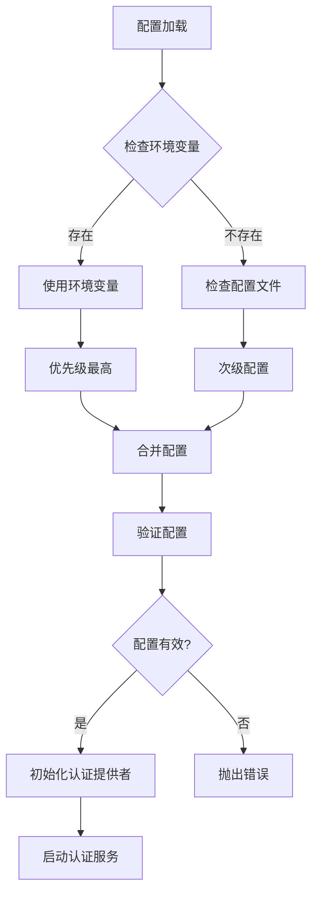

# MCP认证机制

<cite>
**本文档引用的文件**
- [oauth-provider.ts](file://packages/core/src/mcp/oauth-provider.ts)
- [google-auth-provider.ts](file://packages/core/src/mcp/google-auth-provider.ts)
- [sa-impersonation-provider.ts](file://packages/core/src/mcp/sa-impersonation-provider.ts)
- [oauth-utils.ts](file://packages/core/src/mcp/oauth-utils.ts)
- [oauth-token-storage.ts](file://packages/core/src/mcp/oauth-token-storage.ts)
- [config.ts](file://packages/core/src/config/config.ts)
- [hybrid-token-storage.ts](file://packages/core/src/mcp/token-storage/hybrid-token-storage.ts)
- [base-token-storage.ts](file://packages/core/src/mcp/token-storage/base-token-storage.ts)
- [file-token-storage.ts](file://packages/core/src/mcp/token-storage/file-token-storage.ts)
- [zedIntegration.ts](file://packages/cli/src/zed-integration/zedIntegration.ts)
</cite>

## 目录

1. [概述](#概述)
2. [OAuth 2.0认证机制](#oauth-20认证机制)
3. [Google登录认证](#google登录认证)
4. [服务账号模拟认证](#服务账号模拟认证)
5. [认证配置与管理](#认证配置与管理)
6. [安全最佳实践](#安全最佳实践)
7. [故障排除指南](#故障排除指南)
8. [总结](#总结)

## 概述

MCP（Model Context
Protocol）扩展系统提供了三种强大的认证机制，以满足不同场景下的安全需求。这些认证机制包括OAuth
2.0标准流程、Google登录认证和企业级服务账号模拟（Service Account
Impersonation）。每种机制都有其独特的应用场景和安全特性，开发者可以根据具体需求选择最适合的认证方案。



**图表来源**

- [oauth-provider.ts](file://packages/core/src/mcp/oauth-provider.ts#L99-L104)
- [google-auth-provider.ts](file://packages/core/src/mcp/google-auth-provider.ts#L21-L26)
- [sa-impersonation-provider.ts](file://packages/core/src/mcp/sa-impersonation-provider.ts#L25-L32)

## OAuth 2.0认证机制

OAuth
2.0是MCP扩展中最灵活和标准化的认证方式，支持各种授权服务器和自定义配置。它实现了完整的PKCE（Proof
Key for Code Exchange）流程，确保安全性的同时提供良好的用户体验。

### 核心组件架构

OAuth 2.0认证机制由以下核心组件构成：



**图表来源**

- [oauth-provider.ts](file://packages/core/src/mcp/oauth-provider.ts#L99-L104)
- [oauth-provider.ts](file://packages/core/src/mcp/oauth-provider.ts#L25-L35)
- [oauth-token-storage.ts](file://packages/core/src/mcp/oauth-token-storage.ts#L26-L30)

### OAuth流程详解

OAuth 2.0认证遵循标准的授权码流程，结合PKCE增强安全性：



**图表来源**

- [oauth-provider.ts](file://packages/core/src/mcp/oauth-provider.ts#L701-L800)
- [oauth-provider.ts](file://packages/core/src/mcp/oauth-provider.ts#L262-L393)

### 配置示例

在`gemini-extension.json`中配置OAuth 2.0认证：

```json
{
  "name": "example-mcp-server",
  "version": "1.0.0",
  "mcpServers": {
    "example-server": {
      "url": "https://api.example.com",
      "oauth": {
        "clientId": "your-client-id",
        "clientSecret": "your-client-secret",
        "authorizationUrl": "https://auth.example.com/oauth/authorize",
        "tokenUrl": "https://auth.example.com/oauth/token",
        "scopes": ["read", "write"],
        "audiences": ["https://api.example.com"]
      }
    }
  }
}
```

### 安全特性

OAuth 2.0认证机制包含以下安全特性：

1. **PKCE增强安全性**：防止授权码拦截攻击
2. **状态参数验证**：防止CSRF攻击
3. **令牌过期管理**：自动处理令牌刷新
4. **本地回调服务器**：避免网络暴露
5. **动态客户端注册**：支持自动化配置

**章节来源**

- [oauth-provider.ts](file://packages/core/src/mcp/oauth-provider.ts#L25-L1026)
- [oauth-utils.ts](file://packages/core/src/mcp/oauth-utils.ts#L46-L390)

## Google登录认证

Google登录认证利用Google Application Default Credentials
(ADC)，为用户提供无缝的Google账户集成体验。这种认证方式特别适合需要Google
Cloud服务集成的应用程序。

### 工作原理

Google登录认证通过Google Auth Library实现，自动发现和使用可用的凭据：



**图表来源**

- [google-auth-provider.ts](file://packages/core/src/mcp/google-auth-provider.ts#L71-L107)

### 核心实现

Google认证提供者的核心功能包括：



**图表来源**

- [google-auth-provider.ts](file://packages/core/src/mcp/google-auth-provider.ts#L21-L127)

### 配置要求

Google登录认证需要以下配置：

1. **有效的Google Cloud项目**：必须有活动的Google Cloud项目
2. **适当的IAM权限**：服务账号或用户需要相应的作用域权限
3. **启用相关API**：如Cloud IAM API等
4. **正确的主机名限制**：只允许特定的Google域名

### 适用场景

Google登录认证特别适合以下场景：

- 需要Google Cloud服务集成的应用
- 使用Google Workspace的企业应用
- 需要统一身份认证的解决方案
- 基于Google平台的开发工具

**章节来源**

- [google-auth-provider.ts](file://packages/core/src/mcp/google-auth-provider.ts#L1-L127)

## 服务账号模拟认证

服务账号模拟（Service Account
Impersonation）是企业环境中最安全和可控的认证方式。它允许应用程序代表其他服务账号执行操作，提供细粒度的权限控制和审计能力。

### 架构设计

服务账号模拟通过Google Cloud IAM API实现，提供企业级的安全保障：



**图表来源**

- [sa-impersonation-provider.ts](file://packages/core/src/mcp/sa-impersonation-provider.ts#L78-L139)

### 核心特性

服务账号模拟提供以下关键特性：



**图表来源**

- [sa-impersonation-provider.ts](file://packages/core/src/mcp/sa-impersonation-provider.ts#L25-L159)

### 配置参数

服务账号模拟需要以下配置参数：

| 参数                   | 描述                             | 必需 |
| ---------------------- | -------------------------------- | ---- |
| `targetServiceAccount` | 要模拟的目标服务账号电子邮件地址 | 是   |
| `targetAudience`       | 受众标识符（OAuth客户端ID）      | 是   |
| `url` 或 `httpUrl`     | MCP服务器URL                     | 是   |

### 企业优势

服务账号模拟在企业环境中具有显著优势：

1. **细粒度权限控制**：可以精确控制每个服务账号的权限
2. **审计和合规性**：所有操作都可以追溯到原始服务账号
3. **最小权限原则**：应用程序只能访问必要的资源
4. **集中管理**：通过IAM策略统一管理权限
5. **多租户支持**：为不同租户提供隔离的服务账号

**章节来源**

- [sa-impersonation-provider.ts](file://packages/core/src/mcp/sa-impersonation-provider.ts#L1-L159)

## 认证配置与管理

MCP扩展提供了完善的认证配置和管理机制，支持多种存储后端和安全特性。

### 令牌存储架构



**图表来源**

- [hybrid-token-storage.ts](file://packages/core/src/mcp/token-storage/hybrid-token-storage.ts#L44-L97)
- [file-token-storage.ts](file://packages/core/src/mcp/token-storage/file-token-storage.ts#L71-L119)

### 配置管理

认证配置通过以下层次结构管理：



### 多环境支持

MCP扩展支持多种部署环境的认证配置：

1. **开发环境**：使用本地配置和测试凭据
2. **测试环境**：使用模拟认证和预定义凭据
3. **生产环境**：使用加密存储和企业级认证
4. **CI/CD环境**：使用环境变量和自动化配置

**章节来源**

- [oauth-token-storage.ts](file://packages/core/src/mcp/oauth-token-storage.ts#L1-L235)
- [config.ts](file://packages/core/src/config/config.ts#L175-L200)

## 安全最佳实践

为了确保MCP扩展认证的安全性，建议遵循以下最佳实践：

### 令牌管理

1. **定期轮换**：设置合理的令牌过期时间
2. **安全存储**：使用加密存储保护敏感信息
3. **访问控制**：限制对令牌文件的访问权限
4. **监控告警**：监控异常的认证行为

### 网络安全

1. **HTTPS强制**：确保所有通信都使用TLS加密
2. **证书验证**：验证服务器证书的有效性
3. **防火墙规则**：限制对认证端点的访问
4. **网络隔离**：在专用网络中运行认证服务

### 权限控制

1. **最小权限**：只授予必要的最小权限
2. **角色分离**：分离管理和操作权限
3. **定期审查**：定期审查和更新权限设置
4. **审计日志**：记录所有认证和授权事件

### 故障恢复

1. **备份策略**：定期备份认证配置和令牌
2. **灾难恢复**：制定认证系统的灾难恢复计划
3. **降级方案**：准备认证失败时的降级方案
4. **监控告警**：建立认证系统的监控和告警机制

## 故障排除指南

### 常见问题及解决方案

#### OAuth认证失败

**问题症状**：

- 授权服务器返回错误
- 令牌交换失败
- 回调服务器超时

**排查步骤**：

1. 检查客户端ID和密钥配置
2. 验证授权URL和令牌URL
3. 确认回调URI配置正确
4. 检查网络连接和防火墙设置

**解决方案**：

- 更新客户端配置信息
- 验证授权服务器状态
- 检查网络代理设置
- 查看详细错误日志

#### Google认证问题

**问题症状**：

- ADC无法找到凭据
- 权限不足错误
- 主机名验证失败

**排查步骤**：

1. 检查Google Cloud项目配置
2. 验证服务账号权限
3. 确认主机名白名单设置
4. 检查环境变量配置

**解决方案**：

- 设置正确的GOOGLE_APPLICATION_CREDENTIALS
- 添加适当的IAM角色
- 更新ALLOWED_HOSTS配置
- 验证Google Cloud SDK安装

#### 服务账号模拟失败

**问题症状**：

- IAM API调用失败
- 权限拒绝错误
- 令牌生成失败

**排查步骤**：

1. 检查目标服务账号配置
2. 验证模拟权限设置
3. 确认受众标识符正确
4. 检查IAM API可用性

**解决方案**：

- 更新服务账号配置
- 添加模拟权限
- 验证受众设置
- 检查API配额限制

### 调试工具

MCP扩展提供了丰富的调试工具：

1. **详细日志**：启用DEBUG级别日志记录
2. **错误报告**：自动收集和报告错误信息
3. **性能监控**：监控认证性能指标
4. **配置验证**：验证配置文件的有效性

**章节来源**

- [oauth-provider.ts](file://packages/core/src/mcp/oauth-provider.ts#L701-L800)
- [google-auth-provider.ts](file://packages/core/src/mcp/google-auth-provider.ts#L71-L107)
- [sa-impersonation-provider.ts](file://packages/core/src/mcp/sa-impersonation-provider.ts#L78-L139)

## 总结

MCP扩展的三种认证机制各有特色，适用于不同的应用场景：

1. **OAuth 2.0**：最适合需要标准化认证流程和第三方集成的场景
2. **Google登录**：最适合基于Google生态系统的应用和开发工具
3. **服务账号模拟**：最适合企业级应用和需要精细权限控制的场景

选择合适的认证机制需要考虑以下因素：

- **安全性要求**：企业级应用优先考虑服务账号模拟
- **集成复杂度**：简单应用可以选择Google登录
- **标准化程度**：需要标准化的场景选择OAuth 2.0
- **维护成本**：长期维护考虑使用成熟的认证方案

通过合理配置和使用这些认证机制，开发者可以构建安全、可靠且易于维护的MCP扩展系统。
