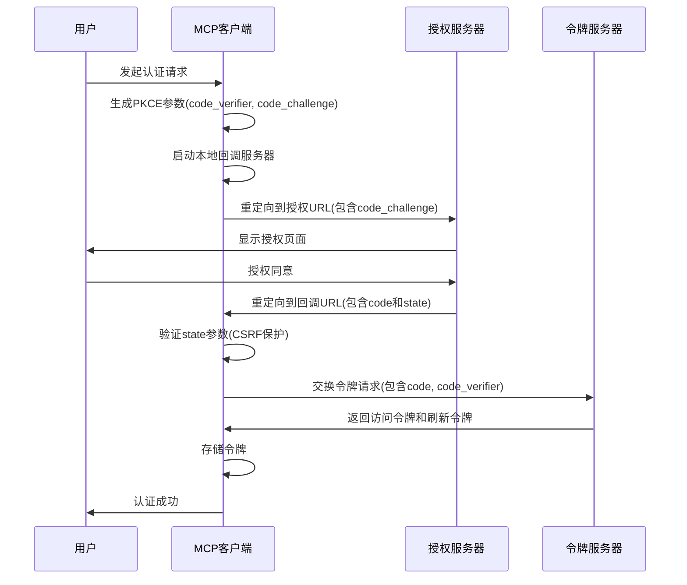
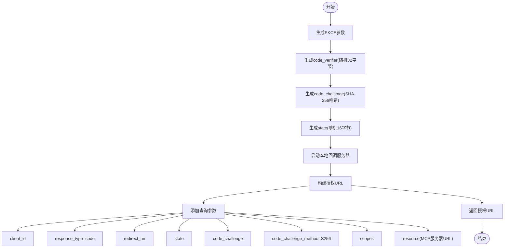
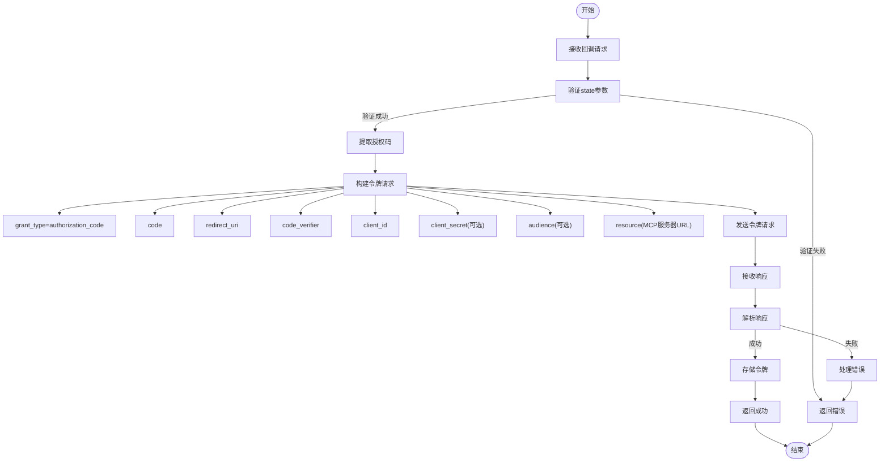
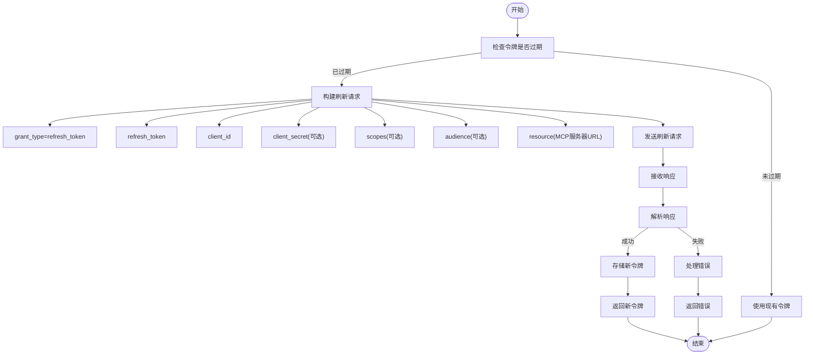
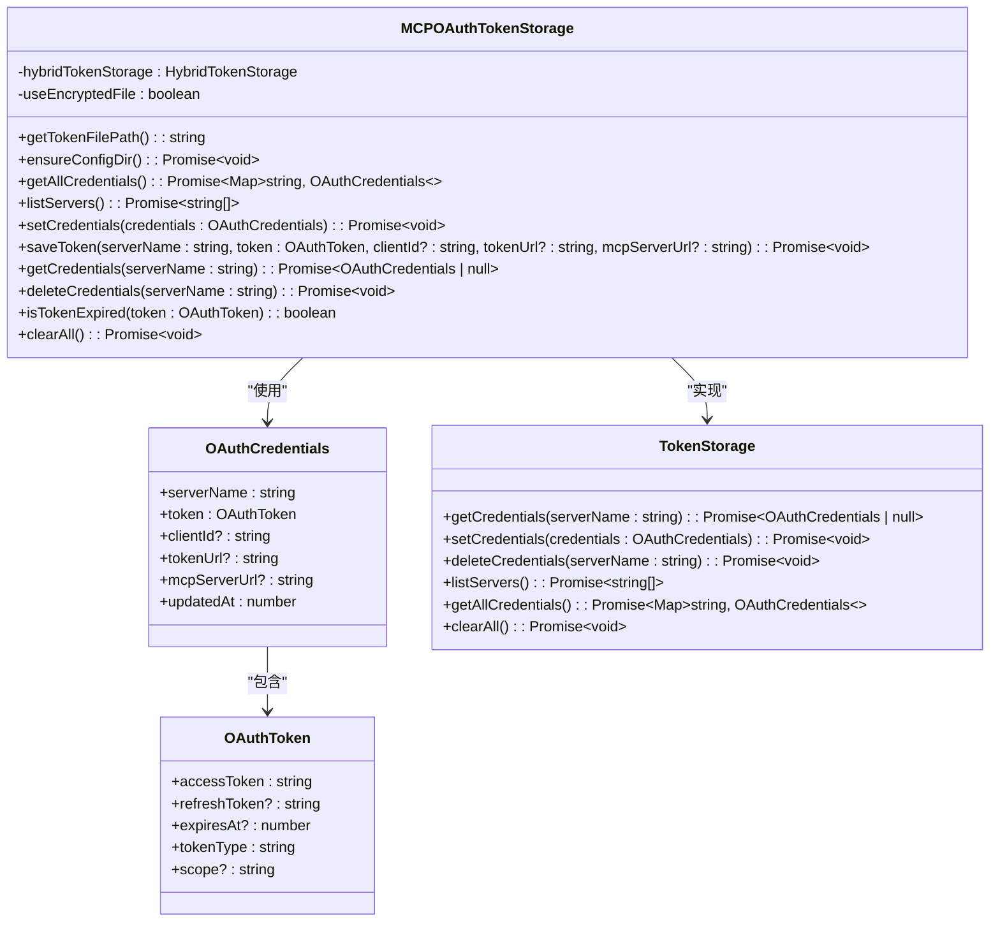

# OAuth 2.0认证

<cite>
**本文档中引用的文件**   
- [oauth-provider.ts](file://packages/core/src/mcp/oauth-provider.ts)
- [oauth-token-storage.ts](file://packages/core/src/mcp/oauth-token-storage.ts)
- [oauth-utils.ts](file://packages/core/src/mcp/oauth-utils.ts)
- [token-storage/types.ts](file://packages/core/src/mcp/token-storage/types.ts)
- [gemini-extension.json](file://hello/gemini-extension.json)
</cite>

## 目录

1. [引言](#引言)
2. [OAuth 2.0授权码流程实现](#oauth-20授权码流程实现)
3. [配置文件定义](#配置文件定义)
4. [安全性考虑](#安全性考虑)
5. [集成指南](#集成指南)
6. [调试与故障排除](#调试与故障排除)
7. [结论](#结论)

## 引言

OAuth
2.0认证机制是MCP扩展中用于安全访问受保护资源的核心组件。该机制实现了完整的授权码流程，包括PKCE（Proof
Key for Code
Exchange）增强的安全性，支持动态客户端注册和令牌刷新功能。系统通过本地HTTP服务器处理OAuth回调，确保授权过程的安全性和可靠性。认证信息存储采用加密文件或系统密钥链，保障用户凭证的安全。

## OAuth 2.0授权码流程实现

MCP扩展中的OAuth
2.0认证实现位于`packages/core/src/mcp/oauth-provider.ts`文件中，核心类为`MCPOAuthProvider`。该实现遵循OAuth
2.0授权码流程，并采用PKCE机制防止授权码拦截攻击。

### 授权码流程概述



**Diagram sources**

- [oauth-provider.ts](file://packages/core/src/mcp/oauth-provider.ts#L1-L1026)

**Section sources**

- [oauth-provider.ts](file://packages/core/src/mcp/oauth-provider.ts#L1-L1026)

### 重定向URL生成

重定向URL的生成由`buildAuthorizationUrl`方法处理。系统首先生成PKCE参数，包括code
verifier、code challenge和state。code challenge通过SHA-256哈希算法从code
verifier生成，确保授权码的安全性。



**Diagram sources**

- [oauth-provider.ts](file://packages/core/src/mcp/oauth-provider.ts#L394-L449)

**Section sources**

- [oauth-provider.ts](file://packages/core/src/mcp/oauth-provider.ts#L394-L449)

### 授权码交换

授权码交换过程由`exchangeCodeForToken`方法实现。当用户授权后，授权服务器会重定向到本地回调服务器，携带授权码和state参数。系统验证state参数以防止CSRF攻击，然后向令牌服务器发送请求，使用授权码和code
verifier交换访问令牌。



**Diagram sources**

- [oauth-provider.ts](file://packages/core/src/mcp/oauth-provider.ts#L462-L576)

**Section sources**

- [oauth-provider.ts](file://packages/core/src/mcp/oauth-provider.ts#L462-L576)

### 访问令牌刷新

访问令牌刷新逻辑由`refreshAccessToken`方法处理。当访问令牌过期时，系统使用存储的刷新令牌向令牌服务器请求新的访问令牌，而无需用户重新授权。



**Diagram sources**

- [oauth-provider.ts](file://packages/core/src/mcp/oauth-provider.ts#L587-L697)

**Section sources**

- [oauth-provider.ts](file://packages/core/src/mcp/oauth-provider.ts#L587-L697)

## 配置文件定义

在`gemini-extension.json`配置文件中，可以通过`oauth2`类型定义认证配置。以下是一个完整的配置示例：

```json
{
  "name": "mcp-server-example",
  "version": "1.0.0",
  "servers": {
    "my-mcp-server": {
      "url": "http://localhost:8080/mcp",
      "oauth": {
        "enabled": true,
        "clientId": "your-client-id",
        "clientSecret": "your-client-secret",
        "authorizationUrl": "https://auth.example.com/oauth2/authorize",
        "tokenUrl": "https://auth.example.com/oauth2/token",
        "scopes": ["mcp.read", "mcp.write"],
        "audiences": ["https://api.example.com"],
        "redirectUri": "http://localhost:3000/oauth/callback",
        "tokenParamName": "access_token",
        "registrationUrl": "https://auth.example.com/oauth2/register"
      }
    }
  }
}
```

**Section sources**

- [gemini-extension.json](file://hello/gemini-extension.json#L1-L5)

## 安全性考虑

### 令牌存储

令牌存储由`MCPOAuthTokenStorage`类管理，位于`packages/core/src/mcp/oauth-token-storage.ts`。系统支持两种存储方式：加密文件存储和系统密钥链存储。存储的令牌包括访问令牌、刷新令牌、过期时间等信息，并设置适当的文件权限（0600）。



**Diagram sources**

- [oauth-token-storage.ts](file://packages/core/src/mcp/oauth-token-storage.ts#L1-L235)
- [token-storage/types.ts](file://packages/core/src/mcp/token-storage/types.ts#L1-L50)

**Section sources**

- [oauth-token-storage.ts](file://packages/core/src/mcp/oauth-token-storage.ts#L1-L235)
- [token-storage/types.ts](file://packages/core/src/mcp/token-storage/types.ts#L1-L50)

### 作用域管理

作用域管理通过`scopes`配置项实现，允许指定请求的权限范围。系统在授权请求和令牌交换时都会包含作用域参数，确保最小权限原则。

### CSRF攻击防护

系统采用多种策略防止CSRF攻击：

1. 使用state参数：生成随机state值并在回调时验证
2. PKCE机制：防止授权码拦截攻击
3. 本地回调服务器：仅在本地回环接口上监听，限制外部访问

## 集成指南

开发者在自己的MCP服务器中集成此认证方式时，需要：

1. 在`gemini-extension.json`中配置OAuth 2.0参数
2. 确保授权服务器支持PKCE和动态客户端注册
3. 实现符合RFC 8414和RFC 9728的发现端点
4. 处理WWW-Authenticate头中的资源元数据

## 调试与故障排除

### 常见问题

- **回调服务器端口冲突**：可通过设置`OAUTH_CALLBACK_PORT`环境变量指定端口
- **CSRF验证失败**：检查state参数是否正确传递和验证
- **令牌刷新失败**：检查刷新令牌是否有效，客户端凭证是否正确

### 调试技巧

- 启用debug日志查看详细流程
- 使用`OAUTH_CALLBACK_HOST`环境变量指定回调服务器主机
- 检查令牌存储文件的权限和内容

## 结论

MCP扩展中的OAuth
2.0认证机制提供了安全、可靠的授权解决方案。通过PKCE增强的安全性、动态客户端注册支持和灵活的令牌管理，系统能够有效保护用户凭证和受保护资源。合理的错误处理和调试支持使得集成和维护更加便捷。
