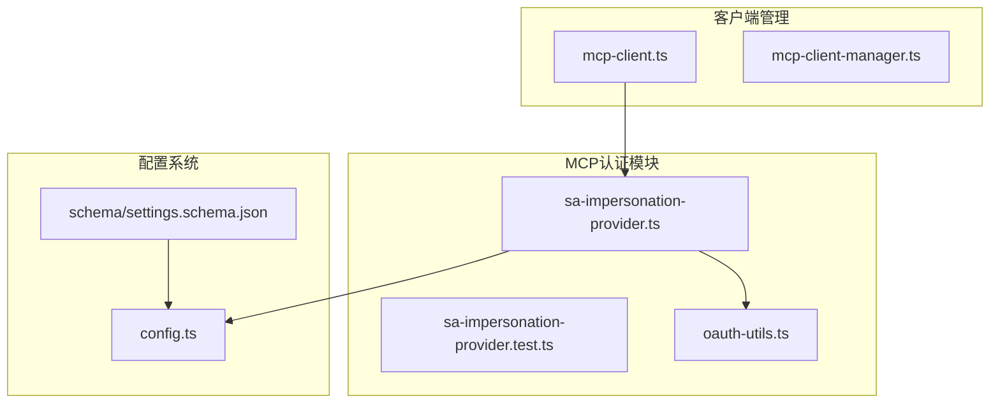
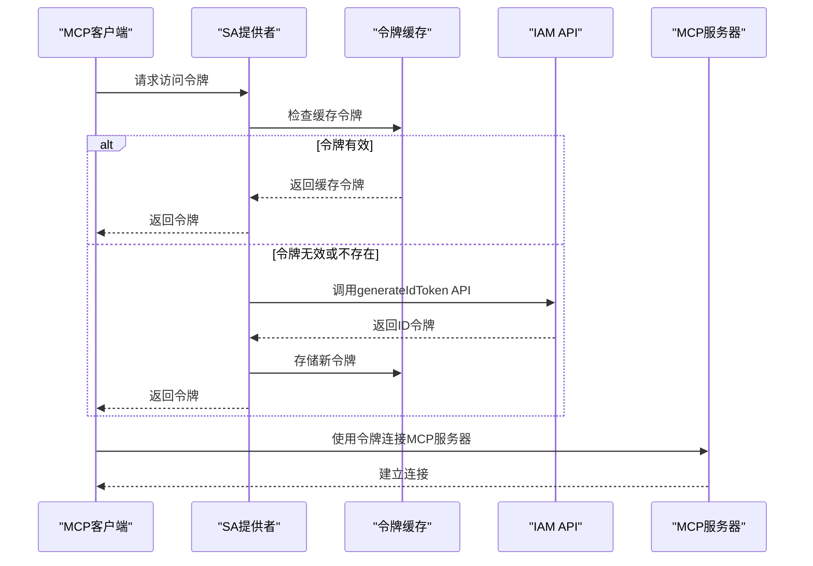
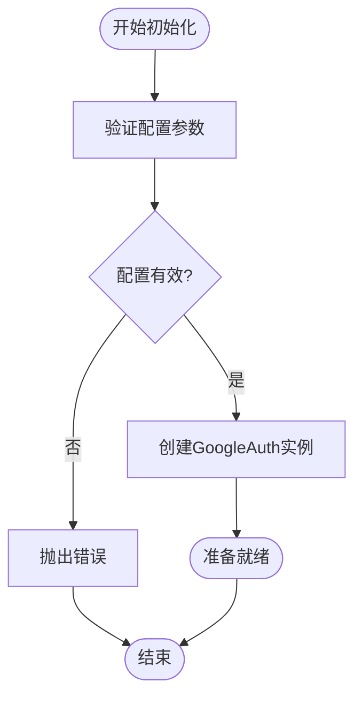
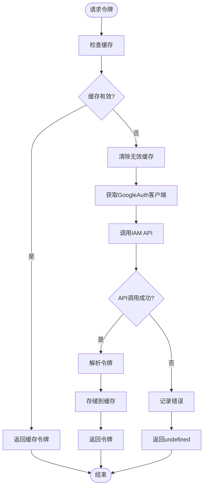
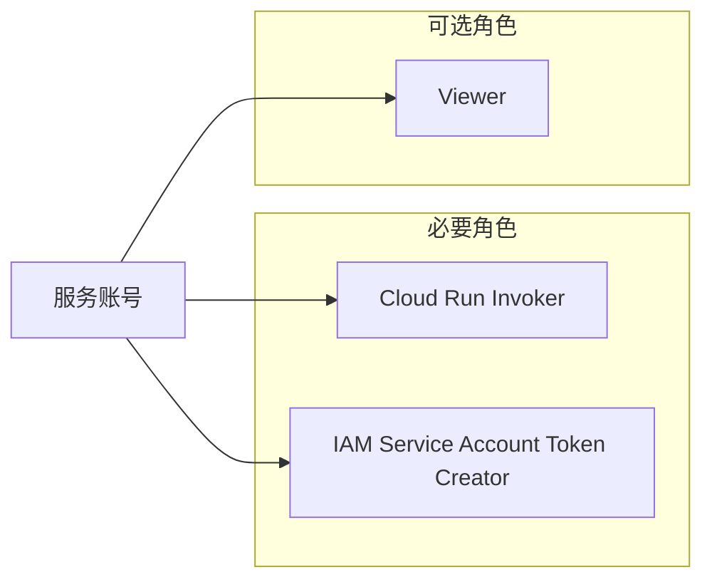

# 服务账号模拟

<cite>
**本文档中引用的文件**
- [sa-impersonation-provider.ts](file://packages/core/src/mcp/sa-impersonation-provider.ts)
- [sa-impersonation-provider.test.ts](file://packages/core/src/mcp/sa-impersonation-provider.test.ts)
- [oauth-utils.ts](file://packages/core/src/mcp/oauth-utils.ts)
- [config.ts](file://packages/core/src/config/config.ts)
- [mcp-client.ts](file://packages/core/src/tools/mcp-client.ts)
- [settings.schema.json](file://schemas/settings.schema.json)
</cite>

## 目录

1. [简介](#简介)
2. [项目结构](#项目结构)
3. [核心组件](#核心组件)
4. [架构概览](#架构概览)
5. [详细组件分析](#详细组件分析)
6. [配置指南](#配置指南)
7. [安全考虑](#安全考虑)
8. [故障排除](#故障排除)
9. [总结](#总结)

## 简介

服务账号模拟（Service Account Impersonation）是Google Cloud
Platform中的一种高级身份验证机制，允许一个服务账号代表另一个用户或服务账号执行操作。在Gemini
CLI的MCP（Model Context
Protocol）扩展中，这种机制提供了企业级自动化场景中的无交互式身份验证解决方案。

该机制的核心优势包括：

- **无需用户交互**：自动获取访问令牌，无需用户手动授权
- **集中式权限管理**：通过IAM角色控制访问权限
- **完整的审计追踪**：所有操作都记录在服务账号的审计日志中
- **长期有效性**：使用长期有效的服务账号密钥

## 项目结构

服务账号模拟功能主要分布在以下关键文件中：



**图表来源**

- [sa-impersonation-provider.ts](file://packages/core/src/mcp/sa-impersonation-provider.ts#L1-L159)
- [config.ts](file://packages/core/src/config/config.ts#L200-L205)
- [mcp-client.ts](file://packages/core/src/tools/mcp-client.ts#L1160-L1190)

## 核心组件

### ServiceAccountImpersonationProvider类

这是服务账号模拟认证的核心实现类，负责与Google Cloud IAM API交互以获取ID令牌。

**主要特性：**

- 实现OAuthClientProvider接口
- 缓存机制防止频繁API调用
- 自动令牌过期检测和刷新
- 支持多种传输协议（HTTP/SSE）

### 配置参数

服务账号模拟需要以下配置参数：

| 参数名称               | 类型   | 描述                                                      | 示例值                                                  |
| ---------------------- | ------ | --------------------------------------------------------- | ------------------------------------------------------- |
| `targetAudience`       | string | OAuth客户端ID，格式：CLIENT_ID.apps.googleusercontent.com | `123456789012.apps.googleusercontent.com`               |
| `targetServiceAccount` | string | 要模拟的目标服务账号邮箱                                  | `my-service-account@my-project.iam.gserviceaccount.com` |
| `url` 或 `httpUrl`     | string | MCP服务器URL                                              | `https://my-iap-service.run.app`                        |

**章节来源**

- [sa-impersonation-provider.ts](file://packages/core/src/mcp/sa-impersonation-provider.ts#L45-L67)
- [config.ts](file://packages/core/src/config/config.ts#L201-L204)

## 架构概览

服务账号模拟认证的工作流程如下：



**图表来源**

- [sa-impersonation-provider.ts](file://packages/core/src/mcp/sa-impersonation-provider.ts#L78-L140)
- [mcp-client.ts](file://packages/core/src/tools/mcp-client.ts#L1160-L1190)

## 详细组件分析

### 认证流程实现

服务账号模拟的认证流程包含以下关键步骤：

#### 1. 初始化阶段



**图表来源**

- [sa-impersonation-provider.ts](file://packages/core/src/mcp/sa-impersonation-provider.ts#L45-L67)

#### 2. 令牌获取流程



**图表来源**

- [sa-impersonation-provider.ts](file://packages/core/src/mcp/sa-impersonation-provider.ts#L78-L140)

#### 3. 缓存机制

服务账号提供者实现了智能缓存机制：

- **过期时间检查**：使用5分钟缓冲区避免边界问题
- **自动刷新**：过期前自动获取新令牌
- **内存管理**：及时清理无效令牌

**章节来源**

- [sa-impersonation-provider.ts](file://packages/core/src/mcp/sa-impersonation-provider.ts#L80-L90)

### API调用实现

服务账号模拟通过Google Cloud IAM API的`generateIdToken`端点实现：

#### API端点构建

```typescript
function createIamApiUrl(targetSA: string): string {
  return `https://iamcredentials.googleapis.com/v1/projects/-/serviceAccounts/${encodeURIComponent(
    targetSA,
  )}:generateIdToken`;
}
```

#### 请求参数

API调用使用以下参数：

- `audience`：目标受众（OAuth客户端ID）
- `includeEmail`：是否包含电子邮件地址

**章节来源**

- [sa-impersonation-provider.ts](file://packages/core/src/mcp/sa-impersonation-provider.ts#L19-L23)
- [sa-impersonation-provider.ts](file://packages/core/src/mcp/sa-impersonation-provider.ts#L98-L107)

### 测试覆盖

测试套件涵盖了以下关键场景：

#### 配置验证测试

- 缺少URL时抛出错误
- 缺少目标受众时抛出错误
- 缺少目标服务账号时抛出错误

#### 令牌获取测试

- 成功获取有效令牌
- 处理令牌获取失败情况
- 缓存机制验证
- 过期令牌刷新测试

**章节来源**

- [sa-impersonation-provider.test.ts](file://packages/core/src/mcp/sa-impersonation-provider.test.ts#L39-L62)
- [sa-impersonation-provider.test.ts](file://packages/core/src/mcp/sa-impersonation-provider.test.ts#L66-L84)

## 配置指南

### 服务账号创建

1. **在Google Cloud Console中创建服务账号**
   - 导航到IAM & Admin > 服务账号
   - 点击"创建服务账号"
   - 填写服务账号信息
   - 分配适当的IAM角色

2. **生成服务账号密钥**
   - 在服务账号详情页面
   - 选择"添加密钥" > "创建新密钥"
   - 选择JSON格式
   - 下载并妥善保管密钥文件

### IAM角色分配

为服务账号分配适当的IAM角色：



### settings.json配置

在Gemini CLI的settings.json中配置服务账号模拟：

```json
{
  "mcpServers": {
    "my-server": {
      "url": "https://my-iap-service.run.app",
      "authProviderType": "service_account_impersonation",
      "targetAudience": "123456789012.apps.googleusercontent.com",
      "targetServiceAccount": "my-service-account@my-project.iam.gserviceaccount.com"
    }
  }
}
```

### 环境变量配置

设置Google Application Default Credentials：

```bash
export GOOGLE_APPLICATION_CREDENTIALS="/path/to/service-account-key.json"
```

**章节来源**

- [settings.schema.json](file://schemas/settings.schema.json#L1-L100)
- [config.ts](file://packages/core/src/config/config.ts#L201-L204)

## 安全考虑

### 密钥管理

服务账号模拟的安全基础是服务账号密钥的保护：

#### 密钥保管最佳实践

- **物理安全**：将密钥文件存储在安全位置
- **访问控制**：限制对密钥文件的访问权限
- **加密存储**：使用加密技术保护密钥文件
- **定期轮换**：定期更换服务账号密钥

#### 密钥权限最小化

- **仅授予必要权限**：遵循最小权限原则
- **角色分离**：将不同职责分配给不同角色
- **定期审查**：定期检查和调整权限

### 网络安全

#### 传输安全

- **HTTPS强制**：确保所有通信使用HTTPS
- **证书验证**：验证服务器证书的有效性
- **TLS版本**：使用最新的TLS协议版本

#### 网络隔离

- **防火墙规则**：限制对MCP服务器的访问
- **VPC网络**：在专用网络中部署服务
- **VPN连接**：使用VPN建立安全连接

### 审计和监控

#### 审计日志

- **操作记录**：记录所有服务账号操作
- **异常检测**：监控异常访问模式
- **合规报告**：生成合规性报告

#### 监控指标

- **令牌使用频率**：监控令牌获取频率
- **API调用统计**：跟踪API调用次数
- **错误率监控**：监控认证失败率

**章节来源**

- [sa-impersonation-provider.ts](file://packages/core/src/mcp/sa-impersonation-provider.ts#L115-L122)

### 风险缓解措施

#### 令牌管理

- **自动刷新**：避免令牌过期导致的服务中断
- **缓存策略**：减少API调用频率
- **错误处理**：优雅处理令牌获取失败

#### 权限控制

- **角色绑定**：精确控制服务账号权限
- **条件访问**：实施基于条件的访问控制
- **资源约束**：限制服务账号可访问的资源范围

## 故障排除

### 常见问题及解决方案

#### 1. 认证失败

**症状**：无法获取访问令牌 **可能原因**：

- 服务账号密钥无效
- 目标服务账号权限不足
- 网络连接问题

**解决步骤**：

1. 验证服务账号密钥的有效性
2. 检查IAM角色分配
3. 确认网络连通性

#### 2. 权限被拒绝

**症状**：令牌获取成功但API调用失败 **可能原因**：

- 目标服务账号缺少必要权限
- 目标受众不匹配
- IAM策略冲突

**解决步骤**：

1. 验证目标服务账号权限
2. 检查目标受众配置
3. 审查IAM策略设置

#### 3. 性能问题

**症状**：令牌获取延迟过高 **可能原因**：

- 缓存失效频繁
- API调用过于频繁
- 网络延迟较高

**解决步骤**：

1. 优化缓存策略
2. 减少不必要的API调用
3. 检查网络性能

### 调试工具

#### 日志分析

启用详细日志记录：

```typescript
// 在开发环境中启用调试
process.env.DEBUG = 'gemini:*';
```

#### 网络诊断

使用curl测试API连接：

```bash
curl -H "Authorization: Bearer $(gcloud auth print-identity-token)" \
     https://iamcredentials.googleapis.com/v1/projects/-/serviceAccounts/target-sa:generateIdToken
```

**章节来源**

- [sa-impersonation-provider.test.ts](file://packages/core/src/mcp/sa-impersonation-provider.test.ts#L1-L154)

## 总结

服务账号模拟认证机制为Gemini
CLI提供了强大而安全的企业级身份验证解决方案。通过使用长期有效的服务账号密钥，该机制实现了：

### 主要优势

- **自动化程度高**：无需用户交互即可完成身份验证
- **安全性强**：基于Google Cloud的成熟安全基础设施
- **可扩展性好**：支持大规模部署和管理
- **审计完善**：提供完整的操作审计和追踪

### 适用场景

- **CI/CD管道**：自动化构建和部署流程
- **批处理作业**：后台数据处理任务
- **微服务通信**：服务间安全认证
- **监控系统**：自动化监控和告警

### 最佳实践建议

1. **严格密钥管理**：确保服务账号密钥的安全保管
2. **最小权限原则**：只授予必要的最小权限
3. **定期审计**：定期审查和更新权限设置
4. **监控告警**：建立完善的监控和告警机制

通过正确配置和使用服务账号模拟认证机制，组织可以在保证安全性的前提下，实现高效的自动化工作流程。
